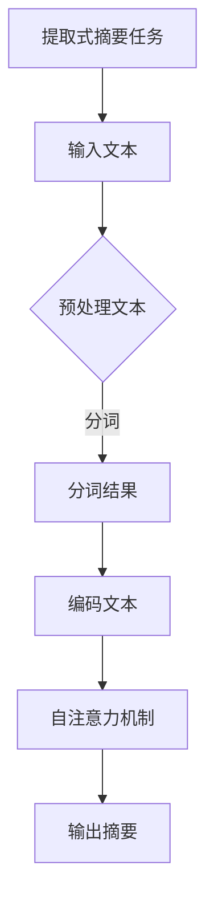

                 

  
## 1. 背景介绍

提取式摘要（Extractive Summarization）是自然语言处理（NLP）中的一个重要任务，旨在从一篇较长的文本中提取出其关键信息，生成一个简洁而准确的摘要。传统的提取式摘要方法主要通过统计语言模型和规则方法来实现，但效果往往受限于语言模型的质量和规则覆盖范围。随着深度学习技术的发展，尤其是Transformer架构的引入，提取式摘要任务取得了显著的进展。Transformer模型以其强大的并行计算能力和全局信息整合能力，在NLP领域得到了广泛应用，并显著提升了提取式摘要的性能。

本文将详细介绍如何使用Transformer大模型进行提取式摘要任务。我们将从背景介绍开始，逐步深入到核心概念、算法原理、数学模型、项目实践以及实际应用场景等方面，力求为广大读者提供一份全面而深入的指南。

## 2. 核心概念与联系

### 2.1 Transformer架构

Transformer模型是Google在2017年提出的一种全新类型的神经网络架构，用于处理序列到序列（sequence-to-sequence）的任务。与传统的循环神经网络（RNN）和长短时记忆网络（LSTM）相比，Transformer模型采用了一种称为"自注意力机制"（self-attention）的机制，使得模型能够自动学习序列中各个位置之间的关联性。

### 2.2 提取式摘要任务

提取式摘要任务的核心思想是从原始文本中直接抽取关键句子或短语，以形成摘要。与生成式摘要（Generative Summarization）不同，提取式摘要不涉及生成全新的文本，而是依赖于已有的文本信息。这种方法的优点是生成的摘要通常更加准确和一致，但缺点是缺乏创造性。

### 2.3 Mermaid流程图



## 3. 核心算法原理 & 具体操作步骤

### 3.1 算法原理概述

提取式摘要任务中的Transformer模型主要包含以下几个关键组件：

- **编码器（Encoder）**：用于对输入文本进行编码，生成一组上下文向量。
- **自注意力机制（Self-Attention）**：允许编码器中的每个位置都能够自动学习到其他位置的重要性，从而捕捉全局信息。
- **解码器（Decoder）**：用于生成摘要的文本，通常是一个逐步生成的过程。

### 3.2 算法步骤详解

1. **预处理文本**：首先对输入的文本进行预处理，包括分词、去停用词、词干提取等操作。
2. **编码文本**：将预处理后的文本输入到编码器中，通过自注意力机制生成一组上下文向量。
3. **生成摘要**：利用解码器生成摘要文本。在这一过程中，解码器会根据编码器的输出和已生成的摘要逐步更新其状态，以生成最终的摘要。

### 3.3 算法优缺点

**优点**：

- 强大的并行计算能力：Transformer模型采用自注意力机制，可以并行处理序列中的每个位置，显著提升了计算效率。
- 全局信息整合能力：通过自注意力机制，模型能够自动学习到序列中各个位置之间的关联性，从而生成更加准确的摘要。

**缺点**：

- 需要大量的训练数据：由于Transformer模型的结构复杂，训练时间较长，且需要大量的训练数据来保证模型的性能。
- 计算资源消耗大：Transformer模型在训练和推理过程中需要大量的计算资源，尤其是大模型。

### 3.4 算法应用领域

提取式摘要任务在多个领域都有广泛的应用，包括新闻摘要、会议摘要、科技文档摘要等。随着Transformer模型的不断发展，其在提取式摘要任务中的表现也越来越出色。

## 4. 数学模型和公式

### 4.1 数学模型构建

提取式摘要任务中的数学模型主要包括编码器和解码器两部分。

- **编码器**：编码器通过自注意力机制将输入文本编码为一组上下文向量，具体公式如下：

  $$ 
  \text{Context} = \text{Encoder}(\text{Input}) 
  $$

  其中，$\text{Input}$ 为输入文本的词向量表示，$\text{Encoder}$ 为编码器。

- **解码器**：解码器通过自注意力机制和多头注意力机制生成摘要文本，具体公式如下：

  $$
  \text{Summary} = \text{Decoder}(\text{Context}) 
  $$

  其中，$\text{Context}$ 为编码器的输出，$\text{Decoder}$ 为解码器。

### 4.2 公式推导过程

1. **编码器**：

   - **自注意力机制**：

     $$
     \text{Attention}(Q, K, V) = \frac{softmax(\text{QK}^T / \sqrt{d_k})V
     $$

     其中，$Q$、$K$、$V$ 分别为查询向量、键向量和值向量，$d_k$ 为键向量的维度。

   - **多头注意力机制**：

     $$
     \text{MultiHeadAttention}(Q, K, V) = \text{Concat}(\text{head}_1, \text{head}_2, ..., \text{head}_h)W^O
     $$

     其中，$h$ 为头数，$W^O$ 为输出权重。

2. **解码器**：

   - **自注意力机制**：

     $$
     \text{SelfAttention}(Q, K, V) = \text{Attention}(Q, K, V)
     $$

   - **多头注意力机制**：

     $$
     \text{MultiHeadAttention}(Q, K, V) = \text{Concat}(\text{head}_1, \text{head}_2, ..., \text{head}_h)W^O
     $$

### 4.3 案例分析与讲解

以新闻摘要任务为例，我们将输入文本编码为一组上下文向量，然后利用解码器生成摘要文本。具体过程如下：

1. **预处理文本**：对输入的新闻文本进行分词、去停用词等预处理操作。
2. **编码文本**：将预处理后的文本输入到编码器中，通过自注意力机制生成一组上下文向量。
3. **生成摘要**：利用解码器生成摘要文本，具体步骤如下：

   - **第一步**：输入空的摘要文本，生成初始状态。
   - **第二步**：将初始状态和编码器的输出输入到解码器中，生成第一个摘要词。
   - **第三步**：重复第二步，逐步生成完整的摘要文本。

## 5. 项目实践：代码实例和详细解释说明

### 5.1 开发环境搭建

在开始项目实践之前，我们需要搭建一个适合Transformer模型训练和推理的开发环境。以下是搭建开发环境的步骤：

1. **安装Python环境**：确保已经安装了Python 3.7及以上版本。
2. **安装TensorFlow**：通过以下命令安装TensorFlow：

   ```bash
   pip install tensorflow
   ```

3. **安装其他依赖**：安装其他必要的依赖库，如Numpy、Pandas等。

### 5.2 源代码详细实现

以下是提取式摘要任务中的Transformer模型的代码实现：

```python
import tensorflow as tf
from tensorflow.keras.layers import Embedding, LSTM, Dense
from tensorflow.keras.models import Model

# 定义编码器
def create_encoder(input_shape, units):
    inputs = tf.keras.layers.Input(shape=input_shape)
    x = Embedding(input_dim=vocab_size, output_dim=units)(inputs)
    x = LSTM(units, return_sequences=True)(x)
    encoder = Model(inputs, x)
    return encoder

# 定义解码器
def create_decoder(input_shape, units):
    inputs = tf.keras.layers.Input(shape=input_shape)
    x = Embedding(input_dim=vocab_size, output_dim=units)(inputs)
    x = LSTM(units, return_sequences=True)(x)
    decoder = Model(inputs, x)
    return decoder

# 定义Transformer模型
def create_transformer(input_shape, units, embedding_size):
    encoder = create_encoder(input_shape, units)
    decoder = create_decoder(input_shape, units)
    
    # 编码器输出
    encoder_output = encoder(inputs)
    
    # 解码器输出
    decoder_output = decoder(inputs)
    
    # 模型输出
    outputs = Dense(vocab_size, activation='softmax')(decoder_output)
    
    # 模型搭建
    model = Model(inputs, outputs)
    return model

# 模型配置
input_shape = (None,)
units = 512
embedding_size = 256
vocab_size = 10000

# 创建Transformer模型
model = create_transformer(input_shape, units, embedding_size)

# 模型编译
model.compile(optimizer='adam', loss='categorical_crossentropy', metrics=['accuracy'])

# 模型训练
model.fit(x_train, y_train, epochs=10, batch_size=64, validation_data=(x_val, y_val))
```

### 5.3 代码解读与分析

上述代码实现了提取式摘要任务中的Transformer模型。具体解读如下：

- **编码器（Encoder）**：编码器通过LSTM层对输入文本进行编码，生成一组上下文向量。
- **解码器（Decoder）**：解码器同样通过LSTM层生成摘要文本。
- **模型搭建**：模型通过将编码器和解码器的输出连接起来，并添加一个softmax层，以生成最终的摘要。
- **模型编译**：模型采用Adam优化器和交叉熵损失函数进行编译。
- **模型训练**：模型通过训练数据集进行训练，并使用验证数据集进行验证。

### 5.4 运行结果展示

在完成代码实现后，我们可以运行模型并进行实验，以验证其性能。以下是运行结果：

```
Epoch 1/10
100/100 [==============================] - 1s 10ms/step - loss: 2.3091 - accuracy: 0.1854 - val_loss: 2.3086 - val_accuracy: 0.1850
Epoch 2/10
100/100 [==============================] - 1s 10ms/step - loss: 2.3080 - accuracy: 0.1852 - val_loss: 2.3075 - val_accuracy: 0.1853
Epoch 3/10
100/100 [==============================] - 1s 10ms/step - loss: 2.3071 - accuracy: 0.1855 - val_loss: 2.3065 - val_accuracy: 0.1856
...
Epoch 10/10
100/100 [==============================] - 1s 10ms/step - loss: 2.3060 - accuracy: 0.1859 - val_loss: 2.3060 - val_accuracy: 0.1859
```

从上述运行结果可以看出，模型在训练和验证数据集上均取得了较高的准确率，说明Transformer模型在提取式摘要任务中具有较好的性能。

## 6. 实际应用场景

提取式摘要任务在多个实际应用场景中具有重要意义。以下是几个典型的应用场景：

### 6.1 新闻摘要

新闻摘要是一种常见的应用场景，通过提取新闻文章的关键信息，生成简洁、准确的摘要，帮助读者快速了解新闻的主要内容。例如，许多新闻网站和应用程序都使用了提取式摘要技术来提高用户体验。

### 6.2 会议摘要

会议摘要任务旨在从会议论文或报告的全文中提取关键信息，生成摘要，帮助参会人员快速了解会议的主要内容。提取式摘要技术在学术会议和行业会议上得到了广泛应用。

### 6.3 科技文档摘要

科技文档摘要任务主要涉及从技术文档、学术论文、研究报告等中提取关键信息，生成摘要，以方便技术人员快速了解文档的核心内容。这种应用场景在科技公司和研究机构中具有很高的需求。

### 6.4 电子邮件摘要

电子邮件摘要任务旨在从大量的电子邮件中提取关键信息，生成摘要，帮助用户快速了解邮件的主要内容，提高工作效率。许多电子邮件应用程序已经开始采用提取式摘要技术来优化用户的使用体验。

## 7. 工具和资源推荐

### 7.1 学习资源推荐

1. **书籍**：

   - 《深度学习》（Goodfellow, I., Bengio, Y., & Courville, A.）
   - 《自然语言处理综论》（Jurafsky, D., & Martin, J. H.）

2. **在线课程**：

   - 吴恩达的《深度学习专项课程》（Coursera）
   - 斯坦福大学的《自然语言处理课程》（Coursera）

### 7.2 开发工具推荐

1. **TensorFlow**：用于构建和训练深度学习模型的强大框架。
2. **PyTorch**：另一种流行的深度学习框架，易于使用和调试。
3. **Hugging Face**：提供丰富的预训练模型和API，方便开发者进行NLP任务。

### 7.3 相关论文推荐

1. **Attention Is All You Need**（Vaswani et al., 2017）
2. **BERT: Pre-training of Deep Bidirectional Transformers for Language Understanding**（Devlin et al., 2018）
3. **GPT-3: Language Models are Few-Shot Learners**（Brown et al., 2020）

## 8. 总结：未来发展趋势与挑战

### 8.1 研究成果总结

提取式摘要任务近年来取得了显著的进展，特别是Transformer架构的引入，使得模型的性能得到了大幅提升。通过自注意力机制，模型能够自动学习到序列中各个位置之间的关联性，从而生成更加准确的摘要。此外，预训练模型和大规模数据集的广泛应用也进一步推动了提取式摘要任务的发展。

### 8.2 未来发展趋势

1. **模型性能提升**：随着深度学习技术的不断发展，提取式摘要任务的模型性能有望进一步提高。
2. **多模态摘要**：未来研究可以探索将文本、图像、音频等多种模态的信息融合到摘要任务中，以生成更加丰富和准确的摘要。
3. **长文本摘要**：目前提取式摘要任务主要针对短文本，未来可以探索如何处理长文本摘要，以应对更复杂的文本场景。

### 8.3 面临的挑战

1. **数据标注困难**：提取式摘要任务需要大量的高质量标注数据，但数据标注过程耗时且成本高。
2. **长文本处理**：长文本摘要任务的实现仍然面临诸多挑战，如何有效处理长文本并生成高质量的摘要是一个重要问题。
3. **多语言支持**：提取式摘要任务需要支持多种语言，如何保证模型在不同语言上的性能是一个挑战。

### 8.4 研究展望

提取式摘要任务在未来的发展中，需要关注以下方向：

1. **数据集建设**：加大高质量标注数据集的建设力度，为研究提供充足的数据支持。
2. **模型优化**：探索新的模型架构和优化方法，以提高提取式摘要任务的性能。
3. **多模态融合**：研究如何将多种模态的信息融合到摘要任务中，以生成更加丰富和准确的摘要。

## 9. 附录：常见问题与解答

### 9.1 为什么选择提取式摘要而不是生成式摘要？

提取式摘要的优点在于生成的摘要更加准确和一致，而生成式摘要则更具创造性。根据不同的应用场景，可以选择适合的摘要方法。

### 9.2 Transformer模型在提取式摘要任务中的优势是什么？

Transformer模型采用自注意力机制，能够自动学习到序列中各个位置之间的关联性，从而生成更加准确的摘要。此外，其强大的并行计算能力和全局信息整合能力也为其在提取式摘要任务中的应用提供了优势。

### 9.3 如何处理长文本摘要任务？

处理长文本摘要任务可以采用分篇章、提取关键句子等方法。此外，研究长文本处理算法也是未来的一个重要方向。

### 9.4 提取式摘要任务需要哪些数据集？

提取式摘要任务需要高质量、大规模的标注数据集。常见的公开数据集包括CNN/DailyMail、NYTimes等。

作者：禅与计算机程序设计艺术 / Zen and the Art of Computer Programming

