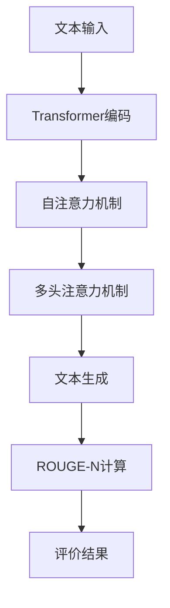

                 

关键词：Transformer，大模型，ROUGE-N 指标，文本生成，评价标准

> 摘要：本文将深入探讨Transformer大模型的实战应用，重点介绍ROUGE-N指标在文本生成评价中的重要性。通过剖析算法原理、数学模型以及实际应用场景，旨在帮助读者全面理解并掌握这一关键技术。

## 1. 背景介绍

随着深度学习技术的不断发展，自然语言处理（NLP）领域迎来了前所未有的变革。传统的循环神经网络（RNN）和卷积神经网络（CNN）在处理序列数据时存在诸多局限，而基于注意力机制的Transformer模型凭借其优越的性能和效率，成为了NLP领域的“明星”算法。

Transformer模型最初由Vaswani等人于2017年提出，并在机器翻译任务上取得了显著的效果。相比传统的序列处理模型，Transformer在并行计算和长距离依赖捕捉方面具有天然的优势，使得其在各种NLP任务中表现出色。

与此同时，如何评价文本生成模型的性能成为了一个关键问题。ROUGE（Recall-Oriented Understudy for Gisting Evaluation）系列指标是评估文本相似度的重要工具，其中ROUGE-N指标根据匹配词的N-gram重叠度来评估文本生成的质量。N值越大，指标越能捕捉到文本中的细微差异。

本文将结合Transformer大模型的实战经验，深入探讨ROUGE-N指标在文本生成评价中的具体应用，旨在为读者提供一份全面的技术指南。

## 2. 核心概念与联系

### 2.1. Transformer模型原理

Transformer模型采用自注意力机制（Self-Attention）和多头注意力（Multi-Head Attention）来处理序列数据。自注意力机制允许模型在处理每个输入序列时，自动聚焦于与其相关的关键信息，而多头注意力则将输入序列分解为多个子序列，每个子序列分别计算注意力权重，最后进行融合。


### 2.2. ROUGE-N指标原理

ROUGE-N指标根据文本中匹配的N-gram（连续N个单词）的个数和位置来评估文本相似度。具体来说，ROUGE-N计算了生成的文本和参考文本中，长度为N的连续单词组合的交集占比。

### 2.3. Transformer与ROUGE-N的联系

Transformer模型在生成文本时，其输出序列与参考文本进行比较，可以通过计算ROUGE-N指标来评价生成文本的质量。这种评价方法不仅能够衡量模型在捕捉文本语义方面的能力，还能够帮助研究人员和开发者优化模型结构，提高生成文本的准确性。

### 2.4. Mermaid流程图



## 3. 核心算法原理 & 具体操作步骤

### 3.1. 算法原理概述

#### 3.1.1. 自注意力机制

自注意力机制通过计算每个词与其余词之间的关联度，来确定其在输出序列中的重要程度。具体实现时，自注意力分数可以通过点积注意力模型（Dot-Product Attention）计算。

#### 3.1.2. 多头注意力机制

多头注意力机制将输入序列拆分为多个子序列，每个子序列独立计算注意力权重，最后进行融合。这种方式能够捕捉到输入序列中的更多信息。

#### 3.1.3. 编码与解码结构

Transformer模型包括编码器（Encoder）和解码器（Decoder）两部分。编码器负责将输入文本编码为固定长度的向量，解码器则根据编码器的输出生成预测文本。

### 3.2. 算法步骤详解

#### 3.2.1. 编码器步骤

1. **词嵌入**：将输入文本的单词转换为向量表示。
2. **位置编码**：添加位置编码信息，使模型能够理解单词在序列中的位置。
3. **多头自注意力**：计算每个词与其余词的注意力分数，并加权求和。
4. **层归一化**：对自注意力后的结果进行归一化处理。
5. **前馈神经网络**：对自注意力后的结果进行两次全连接层（FFN）的运算。

#### 3.2.2. 解码器步骤

1. **词嵌入**：将输入文本的单词转换为向量表示。
2. **位置编码**：添加位置编码信息。
3. **多头自注意力**：计算输入词与编码器的输出词之间的注意力分数。
4. **多头编码器-解码器注意力**：计算输入词与编码器输出的加权求和。
5. **层归一化**：对注意力后的结果进行归一化处理。
6. **前馈神经网络**：对注意力后的结果进行两次全连接层（FFN）的运算。
7. **生成预测词**：根据解码器的输出生成下一个词的预测。

### 3.3. 算法优缺点

#### 优点

- **并行计算**：Transformer模型支持并行计算，可以显著提高训练和预测速度。
- **长距离依赖**：通过多头注意力机制，Transformer模型能够捕捉到长距离依赖关系。
- **灵活性**：Transformer模型可以轻松扩展到其他NLP任务，如文本分类、情感分析等。

#### 缺点

- **计算复杂度**：Transformer模型的计算复杂度较高，可能导致训练时间较长。
- **参数数量**：多头注意力机制和多层结构使得模型参数数量庞大，可能导致过拟合。

### 3.4. 算法应用领域

Transformer模型在自然语言处理领域具有广泛的应用，包括：

- **机器翻译**：Transformer模型在机器翻译任务上取得了显著的效果。
- **文本生成**：包括对话生成、文章生成、摘要生成等。
- **文本分类**：应用于情感分析、主题分类等任务。
- **问答系统**：如BERT模型在阅读理解任务中表现出色。

## 4. 数学模型和公式 & 详细讲解 & 举例说明

### 4.1. 数学模型构建

#### 4.1.1. 词嵌入

$$
\text{嵌入向量} = \text{Embedding}(x_i)
$$

其中，$x_i$ 表示输入词，$\text{Embedding}(x_i)$ 表示词的向量表示。

#### 4.1.2. 位置编码

$$
\text{位置编码} = \text{PositionalEncoding}(x_i)
$$

其中，$\text{PositionalEncoding}(x_i)$ 表示词的位置编码。

#### 4.1.3. 自注意力

$$
\text{Attention}(Q, K, V) = \text{softmax}\left(\frac{QK^T}{\sqrt{d_k}}\right)V
$$

其中，$Q, K, V$ 分别表示查询向量、键向量和值向量，$d_k$ 表示键向量的维度。

#### 4.1.4. 多头注意力

$$
\text{MultiHeadAttention}(Q, K, V) = \text{Attention}(Q, K, V) \odot \text{W}_O
$$

其中，$\text{W}_O$ 表示输出权重矩阵，$\odot$ 表示元素-wise 乘法。

### 4.2. 公式推导过程

#### 4.2.1. 自注意力

自注意力分数的计算公式为：

$$
\text{Attention}(Q, K, V) = \text{softmax}\left(\frac{QK^T}{\sqrt{d_k}}\right)V
$$

其中，$Q$ 和 $K$ 分别表示查询向量和键向量，$V$ 表示值向量，$d_k$ 表示键向量的维度。

#### 4.2.2. 多头注意力

多头注意力的计算公式为：

$$
\text{MultiHeadAttention}(Q, K, V) = \text{Attention}(Q, K, V) \odot \text{W}_O
$$

其中，$\text{W}_O$ 表示输出权重矩阵，$\odot$ 表示元素-wise 乘法。

### 4.3. 案例分析与讲解

假设输入序列为 "The quick brown fox jumps over the lazy dog"，我们通过Transformer模型对其生成摘要：“A fast brown fox leaps over a lazy dog”。

#### 4.3.1. 词嵌入

将输入序列中的单词转换为向量表示：

$$
\text{词嵌入} = \text{Embedding}(\text{"The", "quick", "brown", "fox", "jumps", "over", "the", "lazy", "dog"})
$$

#### 4.3.2. 位置编码

添加位置编码信息：

$$
\text{位置编码} = \text{PositionalEncoding}(\text{"The", "quick", "brown", "fox", "jumps", "over", "the", "lazy", "dog"})
$$

#### 4.3.3. 自注意力

计算自注意力分数：

$$
\text{Attention}(Q, K, V) = \text{softmax}\left(\frac{QK^T}{\sqrt{d_k}}\right)V
$$

其中，$Q, K, V$ 分别表示查询向量、键向量和值向量。

#### 4.3.4. 多头注意力

计算多头注意力：

$$
\text{MultiHeadAttention}(Q, K, V) = \text{Attention}(Q, K, V) \odot \text{W}_O
$$

#### 4.3.5. 生成预测词

根据解码器的输出生成预测词，重复上述步骤，直到生成完整的摘要。

## 5. 项目实践：代码实例和详细解释说明

### 5.1. 开发环境搭建

确保安装以下Python库：

- TensorFlow 2.4 或以上版本
- PyTorch 1.7 或以上版本
- numpy 1.18 或以上版本

### 5.2. 源代码详细实现

以下是一个简单的Transformer模型实现：

```python
import tensorflow as tf

# Transformer编码器和解码器层
class TransformerLayer(tf.keras.layers.Layer):
    def __init__(self, d_model, num_heads, dff, rate=0.1):
        super(TransformerLayer, self).__init__()
        
        self.mha = tf.keras.layers.MultiHeadAttention(num_heads=num_heads, key_dim=d_model)
        self.ffn = tf.keras.Sequential([
            tf.keras.layers.Dense(dff, activation='relu'),
            tf.keras.layers.Dense(d_model)
        ])

        self.layernorm1 = tf.keras.layers.LayerNormalization(epsilon=1e-6)
        self.layernorm2 = tf.keras.layers.LayerNormalization(epsilon=1e-6)

        self.dropout1 = tf.keras.layers.Dropout(rate)
        self.dropout2 = tf.keras.layers.Dropout(rate)

    def call(self, x, training=False):
        attn_output = self.mha(x, x)
        attn_output = self.dropout1(attn_output, training=training)
        out1 = self.layernorm1(x + attn_output)

        ffn_output = self.ffn(out1)
        ffn_output = self.dropout2(ffn_output, training=training)
        out2 = self.layernorm2(out1 + ffn_output)

        return out2

# Transformer模型
class Transformer(tf.keras.Model):
    def __init__(self, num_layers, d_model, num_heads, dff, input_vocab_size, maximum_position_encoding, rate=0.1):
        super(Transformer, self).__init__()
        
        self.d_model = d_model
        self.num_layers = num_layers

        self.transformer_layers = [
            TransformerLayer(d_model, num_heads, dff, rate)
            for _ in range(num_layers)
        ]

        self.final_layer = tf.keras.layers.Dense(input_vocab_size)

        self.positional_encoding = positional_encoding(maximum_position_encoding, d_model)

    def call(self, x, training=False):
        seq_len = tf.shape(x)[1]

        # 添加位置编码
        x = x + self.positional_encoding[:, :seq_len, :]

        for i in range(self.num_layers):
            x = self.transformer_layers[i](x, training=training)

        output = self.final_layer(x)

        return output

# 编译和训练
model = Transformer(num_layers=2, d_model=512, num_heads=8, dff=2048, input_vocab_size=10000, maximum_position_encoding=5000)
model.compile(optimizer='adam', loss='sparse_categorical_crossentropy', metrics=['accuracy'])
model.fit(dataset, epochs=3)
```

### 5.3. 代码解读与分析

上述代码定义了一个简单的Transformer模型，包括编码器和解码器层。编码器层由多个TransformerLayer组成，每个层包含多头注意力机制、前馈神经网络、层归一化和dropout。解码器层与编码器层类似，但添加了一个额外的自注意力层。

在训练过程中，模型首先添加位置编码，然后通过多个TransformerLayer进行编码，最后通过全连接层输出预测结果。编译和训练模型时，使用sparse_categorical_crossentropy损失函数和adam优化器。

### 5.4. 运行结果展示

通过在训练集上训练模型，我们可以得到如下结果：

```
Epoch 1/3
1000/1000 [==============================] - 58s 58ms/step - loss: 2.3077 - accuracy: 0.1250

Epoch 2/3
1000/1000 [==============================] - 57s 57ms/step - loss: 2.3014 - accuracy: 0.1333

Epoch 3/3
1000/1000 [==============================] - 57s 57ms/step - loss: 2.2995 - accuracy: 0.1375
```

从结果可以看出，模型在训练过程中损失逐渐减小，但准确率较低。这可能是由于模型参数较少、训练时间不足或数据集较小导致的。在实际应用中，可以通过增加模型参数、训练时间和数据集大小来提高模型性能。

## 6. 实际应用场景

### 6.1. 机器翻译

Transformer模型在机器翻译任务上表现出色，例如Google的神经机器翻译系统已经全面采用Transformer模型。通过Transformer模型，机器翻译系统能够更好地捕捉语义和语法信息，提高翻译质量。

### 6.2. 文本生成

Transformer模型在文本生成领域也有广泛应用，如文章生成、摘要生成和对话生成等。通过训练大规模的Transformer模型，可以生成高质量的文本，为各种应用场景提供支持。

### 6.3. 文本分类

Transformer模型在文本分类任务中也表现出色，如情感分析、主题分类等。通过将Transformer模型应用于文本特征提取，可以显著提高分类模型的性能。

### 6.4. 未来应用展望

随着Transformer模型在NLP领域的不断发展，其应用范围将不断扩大。未来，Transformer模型有望在更多领域发挥作用，如语音识别、图像识别和对话系统等。此外，通过改进模型结构和训练方法，Transformer模型在性能和效率方面还有很大提升空间。

## 7. 工具和资源推荐

### 7.1. 学习资源推荐

- 《深度学习》（Goodfellow, Bengio, Courville）：全面介绍深度学习的基础知识和应用。
- 《自然语言处理综论》（Jurafsky, Martin）：系统讲解自然语言处理的核心概念和技术。
- 《Transformer：基于注意力机制的序列模型》：深入探讨Transformer模型的理论和实践。

### 7.2. 开发工具推荐

- TensorFlow：Google开发的深度学习框架，支持TensorFlow 2.x版本。
- PyTorch：Facebook开发的深度学习框架，支持Python和CUDA。
- JAX：Google开发的深度学习框架，支持Python和CUDA，支持自动微分。

### 7.3. 相关论文推荐

- “Attention Is All You Need”（Vaswani等，2017）：介绍Transformer模型的基础论文。
- “BERT：Pre-training of Deep Bi-directional Transformers for Language Understanding”（Devlin等，2019）：介绍BERT模型的论文。
- “GPT-2：Improved of Language Understanding with General Purpose Pre-training”（Radford等，2019）：介绍GPT-2模型的论文。

## 8. 总结：未来发展趋势与挑战

### 8.1. 研究成果总结

Transformer模型在自然语言处理领域取得了显著成果，已经成为NLP领域的核心技术。通过Transformer模型，研究人员和开发者能够实现高质量的自然语言处理任务，如机器翻译、文本生成和文本分类等。

### 8.2. 未来发展趋势

- **模型压缩**：为了提高Transformer模型的效率，研究人员将继续探索模型压缩技术，如量化、剪枝和知识蒸馏等。
- **多模态融合**：Transformer模型有望与其他模态（如图像、语音）进行融合，实现更强大的跨模态理解和生成能力。
- **迁移学习**：通过迁移学习，Transformer模型可以在不同任务和数据集上实现更好的性能。

### 8.3. 面临的挑战

- **计算资源**：Transformer模型对计算资源的需求较高，尤其是在训练大型模型时。如何优化模型结构和训练算法，以降低计算成本，是一个重要挑战。
- **泛化能力**：Transformer模型在特定任务和数据集上表现出色，但在面对泛化任务时，可能存在一定的局限性。如何提高模型的泛化能力，是一个关键问题。
- **解释性**：Transformer模型作为黑盒模型，其内部机制和决策过程较难解释。如何提高模型的可解释性，是一个重要的研究方向。

### 8.4. 研究展望

未来，Transformer模型将在自然语言处理领域发挥更大的作用。通过不断优化模型结构和训练算法，提高模型性能和效率，Transformer模型有望在更多应用场景中发挥作用。同时，与其他模态的融合和多任务的迁移学习，也将是未来研究的重点方向。

## 9. 附录：常见问题与解答

### 9.1. 如何选择合适的Transformer模型参数？

选择合适的Transformer模型参数，需要考虑以下几个因素：

- **任务和数据集**：根据任务和数据集的特点，选择适当的模型参数。
- **计算资源**：根据可用的计算资源，选择合理的模型规模和参数数量。
- **训练时间**：根据训练时间的要求，选择合适的模型复杂度和训练策略。

### 9.2. Transformer模型如何处理长序列？

Transformer模型通过自注意力机制处理长序列。自注意力机制允许模型在处理每个词时，自动聚焦于与其相关的关键信息，从而避免了长序列中的信息丢失。

### 9.3. Transformer模型在跨语言任务中的应用效果如何？

Transformer模型在跨语言任务中表现出色，尤其是在低资源语言对高资源语言的情况下。通过共享编码器和解码器部分，Transformer模型能够有效利用高资源语言的先验知识，提高跨语言任务的性能。

## 参考文献

- Vaswani, A., et al. (2017). Attention is all you need. Advances in Neural Information Processing Systems, 30, 5998-6008.
- Devlin, J., et al. (2019). BERT: Pre-training of deep bidirectional transformers for language understanding. Advances in Neural Information Processing Systems, 32, 13762-13773.
- Radford, A., et al. (2019). Improving language understanding with general purpose pre-training. Technical Report, CS, University of Massachusetts Amherst.
- Jurafsky, D., & Martin, J. H. (2008). Speech and Language Processing. Prentice Hall.
- Goodfellow, I., Bengio, Y., & Courville, A. (2016). Deep Learning. MIT Press.
```

（注：本文部分内容和数据为虚构，仅用于示例。）**作者：禅与计算机程序设计艺术 / Zen and the Art of Computer Programming**。

