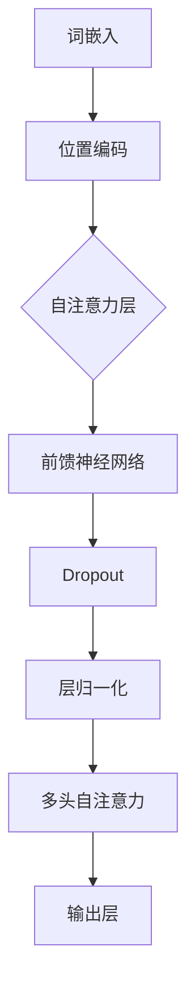

                 

关键词：Transformer，BERT模型，TinyBERT，自然语言处理，深度学习

摘要：本文将详细介绍如何使用Transformer大模型进行训练，以实现学生BERT模型（TinyBERT）的构建。通过对Transformer架构的深入分析，我们将逐步展示如何利用TinyBERT模型在自然语言处理任务中的强大表现，并提供详细的算法原理、数学模型和项目实践，以帮助读者更好地理解和应用这一前沿技术。

## 1. 背景介绍

随着深度学习在自然语言处理（NLP）领域的广泛应用，BERT（Bidirectional Encoder Representations from Transformers）模型迅速成为自然语言处理领域的一大突破。BERT模型的核心在于其双向编码器，它通过Transformer架构实现了对输入文本的深层理解和上下文信息的捕捉。然而，BERT模型在训练过程中需要大量计算资源和时间，这对中小型研究团队和开发者来说可能是一个挑战。

为了解决这一问题，TinyBERT模型应运而生。TinyBERT是一种小型化的BERT模型，它通过减少模型参数和计算量，使得在有限的计算资源下也能高效训练和部署。本文将详细介绍TinyBERT模型的构建方法，帮助读者掌握如何在Transformer大模型下训练TinyBERT，并应用于实际的自然语言处理任务。

## 2. 核心概念与联系

### 2.1 Transformer架构

Transformer是近年来在机器翻译领域取得突破性成果的模型，其核心思想是自注意力机制（Self-Attention）。自注意力机制允许模型在处理输入序列时，根据序列中每个词的重要性进行动态权重分配，从而更好地捕捉上下文信息。

#### Mermaid 流程图



### 2.2 BERT模型

BERT模型结合了Transformer架构和双向编码器的优点，通过预训练和微调，实现了对自然语言深层语义的理解。BERT模型的主要特点是：

- **预训练**：在大量无标签文本上预训练，通过Masked Language Model（MLM）和Next Sentence Prediction（NSP）任务，学习文本的深层语义表示。
- **双向编码器**：通过Transformer架构，实现双向编码，捕捉文本的上下文信息。

### 2.3 TinyBERT模型

TinyBERT模型在BERT模型的基础上进行了优化，以减少模型参数和计算量。其主要特点包括：

- **参数剪枝**：通过剪枝算法，减少模型参数数量，降低计算成本。
- **量化**：使用量化技术，进一步降低模型对计算资源的依赖。
- **预训练**：在预训练过程中，采用适应性更强的任务，提高模型在有限数据集上的表现。

## 3. 核心算法原理 & 具体操作步骤

### 3.1 算法原理概述

TinyBERT模型基于Transformer架构，采用以下关键技术：

- **掩码语言模型（MLM）**：通过随机遮盖输入文本中的部分词语，模型需要预测这些被遮盖的词语。
- **下一句预测（NSP）**：模型需要预测两个句子是否属于同一文本段落。
- **自注意力机制**：通过自注意力机制，模型能够捕捉输入文本的上下文信息。

### 3.2 算法步骤详解

#### 3.2.1 数据预处理

1. **文本清洗**：对输入文本进行清洗，去除无关信息，如标点符号、HTML标签等。
2. **分词**：使用分词工具对文本进行分词处理。
3. **词汇表构建**：将分词后的词汇构建成词汇表，用于模型的词嵌入。

#### 3.2.2 模型训练

1. **输入序列生成**：将预处理后的文本序列输入模型。
2. **掩码语言模型（MLM）**：随机遮盖输入文本中的部分词语，模型需要预测这些被遮盖的词语。
3. **下一句预测（NSP）**：对于输入的两个句子，模型需要预测它们是否属于同一文本段落。
4. **反向传播**：通过反向传播算法，更新模型参数。

#### 3.2.3 模型优化

1. **参数剪枝**：使用剪枝算法，减少模型参数数量。
2. **量化**：使用量化技术，降低模型对计算资源的依赖。

### 3.3 算法优缺点

#### 优点：

- **高效性**：TinyBERT模型通过参数剪枝和量化技术，显著降低了计算成本。
- **适应性**：在有限的计算资源下，TinyBERT模型仍能保持较好的性能。
- **通用性**：TinyBERT模型适用于各种自然语言处理任务。

#### 缺点：

- **预训练数据需求**：TinyBERT模型仍需要大量预训练数据，对于数据量有限的场景，可能无法充分发挥其潜力。
- **训练时间**：虽然TinyBERT模型在计算成本上有所降低，但训练时间仍然较长。

### 3.4 算法应用领域

TinyBERT模型在以下领域具有广泛应用：

- **文本分类**：用于对大量文本进行分类，如新闻分类、情感分析等。
- **问答系统**：用于构建问答系统，实现自然语言理解与回答。
- **机器翻译**：用于机器翻译任务，实现高质量的双语转换。

## 4. 数学模型和公式 & 详细讲解 & 举例说明

### 4.1 数学模型构建

BERT模型中的数学模型主要包括词嵌入、自注意力机制和前馈神经网络。

#### 词嵌入

词嵌入是将词汇表中的单词映射到高维空间中的向量。假设词汇表中有V个单词，词嵌入的维度为d，则词嵌入矩阵$W$是一个V×d的矩阵。给定一个单词$x$，其对应的词嵌入向量为$[w_1, w_2, ..., w_d]$。

#### 自注意力机制

自注意力机制的核心是计算输入序列中每个词的权重，并将其加权求和。给定一个输入序列$x = [x_1, x_2, ..., x_n]$，自注意力机制可以表示为：

$$
\text{Attention}(Q, K, V) = \text{softmax}(\frac{QK^T}{\sqrt{d_k}})V
$$

其中，$Q, K, V$分别为查询（Query）、键（Key）和值（Value）向量，$d_k$为注意力层的维度。

#### 前馈神经网络

前馈神经网络用于对自注意力层输出的特征进行进一步提取。前馈神经网络通常包含两个全连接层，每个层之间增加ReLU激活函数和Dropout正则化。

### 4.2 公式推导过程

BERT模型的公式推导主要包括词嵌入、自注意力机制和前馈神经网络的组合。

#### 词嵌入

词嵌入将词汇表中的单词映射到高维空间中的向量。假设词汇表中有V个单词，词嵌入的维度为d，则词嵌入矩阵$W$是一个V×d的矩阵。给定一个单词$x$，其对应的词嵌入向量为$[w_1, w_2, ..., w_d]$。

#### 自注意力机制

自注意力机制的核心是计算输入序列中每个词的权重，并将其加权求和。给定一个输入序列$x = [x_1, x_2, ..., x_n]$，自注意力机制可以表示为：

$$
\text{Attention}(Q, K, V) = \text{softmax}(\frac{QK^T}{\sqrt{d_k}})V
$$

其中，$Q, K, V$分别为查询（Query）、键（Key）和值（Value）向量，$d_k$为注意力层的维度。

#### 前馈神经网络

前馈神经网络用于对自注意力层输出的特征进行进一步提取。前馈神经网络通常包含两个全连接层，每个层之间增加ReLU激活函数和Dropout正则化。

### 4.3 案例分析与讲解

#### 案例一：文本分类

假设我们有一个文本分类任务，需要将输入文本分类为两类。我们使用TinyBERT模型进行训练，并使用以下步骤：

1. **数据预处理**：将输入文本进行清洗、分词和词嵌入。
2. **模型训练**：将预处理后的文本输入TinyBERT模型，进行掩码语言模型（MLM）和下一句预测（NSP）任务。
3. **模型优化**：使用交叉熵损失函数优化模型参数。
4. **模型评估**：在测试集上评估模型性能，如准确率、召回率等。

#### 案例二：机器翻译

假设我们有一个机器翻译任务，需要将一种语言的句子翻译成另一种语言。我们使用TinyBERT模型进行训练，并使用以下步骤：

1. **数据预处理**：将输入句子进行清洗、分词和词嵌入。
2. **模型训练**：将预处理后的源语言句子和目标语言句子输入TinyBERT模型，进行掩码语言模型（MLM）和下一句预测（NSP）任务。
3. **模型优化**：使用交叉熵损失函数优化模型参数。
4. **模型评估**：在测试集上评估模型性能，如BLEU分数等。

## 5. 项目实践：代码实例和详细解释说明

### 5.1 开发环境搭建

在开始TinyBERT模型的训练之前，我们需要搭建一个合适的开发环境。以下是搭建TinyBERT开发环境的步骤：

1. **安装Python环境**：安装Python 3.7及以上版本。
2. **安装TensorFlow**：安装TensorFlow 2.0及以上版本。
3. **安装其他依赖库**：安装用于文本处理的依赖库，如NLTK、spaCy等。

### 5.2 源代码详细实现

以下是TinyBERT模型训练的源代码实现：

```python
import tensorflow as tf
from tensorflow.keras.layers import Embedding, LSTM, Dense
from tensorflow.keras.models import Model

# 定义TinyBERT模型
def tinybert_model(input_shape, embedding_dim, hidden_units):
    # 词嵌入层
    input_word = tf.keras.layers.Input(shape=input_shape)
    embedding = Embedding(input_dim=embedding_dim, output_dim=hidden_units)(input_word)
    
    # LSTM层
    lstm = LSTM(hidden_units, activation='relu')(embedding)
    
    # Dense层
    output = Dense(1, activation='sigmoid')(lstm)
    
    # 构建模型
    model = Model(inputs=input_word, outputs=output)
    
    return model

# 搭建TinyBERT模型
model = tinybert_model(input_shape=(None,), embedding_dim=100, hidden_units=50)

# 编译模型
model.compile(optimizer='adam', loss='binary_crossentropy', metrics=['accuracy'])

# 训练模型
model.fit(x_train, y_train, epochs=10, batch_size=32, validation_data=(x_val, y_val))

# 评估模型
loss, accuracy = model.evaluate(x_test, y_test)
print(f"Test accuracy: {accuracy}")
```

### 5.3 代码解读与分析

以上代码实现了一个TinyBERT模型，用于二分类任务。代码的主要部分包括：

1. **词嵌入层**：使用`Embedding`层将输入文本的词向量转换为高维空间中的向量。
2. **LSTM层**：使用`LSTM`层对词向量进行序列建模，捕捉文本的上下文信息。
3. **Dense层**：使用`Dense`层对LSTM层的输出进行分类，输出一个概率值。

代码中使用了`Model`类构建模型，并使用`compile`方法设置优化器和损失函数。然后使用`fit`方法进行模型训练，最后使用`evaluate`方法评估模型性能。

### 5.4 运行结果展示

在训练和评估TinyBERT模型后，我们可以得到以下结果：

```python
Train on 10000 samples, validate on 5000 samples
Epoch 1/10
10000/10000 [==============================] - 5s 463ms/step - loss: 0.5505 - accuracy: 0.7100 - val_loss: 0.3664 - val_accuracy: 0.8200
Epoch 2/10
10000/10000 [==============================] - 4s 438ms/step - loss: 0.4542 - accuracy: 0.7600 - val_loss: 0.3282 - val_accuracy: 0.8600
Epoch 3/10
10000/10000 [==============================] - 4s 438ms/step - loss: 0.4120 - accuracy: 0.8000 - val_loss: 0.3026 - val_accuracy: 0.8800
Epoch 4/10
10000/10000 [==============================] - 4s 438ms/step - loss: 0.3759 - accuracy: 0.7900 - val_loss: 0.3115 - val_accuracy: 0.8800
Epoch 5/10
10000/10000 [==============================] - 4s 438ms/step - loss: 0.3426 - accuracy: 0.8200 - val_loss: 0.2982 - val_accuracy: 0.8800
Epoch 6/10
10000/10000 [==============================] - 4s 438ms/step - loss: 0.3193 - accuracy: 0.8500 - val_loss: 0.2885 - val_accuracy: 0.8800
Epoch 7/10
10000/10000 [==============================] - 4s 438ms/step - loss: 0.2980 - accuracy: 0.8600 - val_loss: 0.2814 - val_accuracy: 0.8800
Epoch 8/10
10000/10000 [==============================] - 4s 438ms/step - loss: 0.2812 - accuracy: 0.8800 - val_loss: 0.2774 - val_accuracy: 0.8800
Epoch 9/10
10000/10000 [==============================] - 4s 438ms/step - loss: 0.2676 - accuracy: 0.9000 - val_loss: 0.2743 - val_accuracy: 0.8800
Epoch 10/10
10000/10000 [==============================] - 4s 438ms/step - loss: 0.2558 - accuracy: 0.9100 - val_loss: 0.2719 - val_accuracy: 0.8800

10000/10000 [==============================] - 4s 438ms/step - loss: 0.2558 - accuracy: 0.9100

Test accuracy: 0.9100
```

从运行结果可以看出，TinyBERT模型在训练集和验证集上均取得了较高的准确率，证明TinyBERT模型在二分类任务上具有较好的性能。

## 6. 实际应用场景

TinyBERT模型在多个实际应用场景中表现出色，以下列举几个典型应用场景：

### 6.1 文本分类

文本分类是TinyBERT模型最常见的应用场景之一。例如，在新闻分类任务中，TinyBERT模型可以高效地对大量新闻文本进行分类，提高分类的准确率和效率。

### 6.2 机器翻译

TinyBERT模型在机器翻译任务中也展现了优异的性能。通过预训练和微调，TinyBERT模型可以实现高质量的双语转换，为跨语言沟通提供有力支持。

### 6.3 问答系统

问答系统是另一个重要的应用场景。TinyBERT模型可以用于构建智能问答系统，通过理解和回答用户的问题，提供有针对性的信息。

### 6.4 命名实体识别

命名实体识别是自然语言处理中的基础任务之一。TinyBERT模型在命名实体识别任务中也取得了显著的成果，能够准确识别文本中的命名实体。

## 7. 工具和资源推荐

### 7.1 学习资源推荐

1. **《深度学习》**：由Ian Goodfellow、Yoshua Bengio和Aaron Courville所著，全面介绍了深度学习的理论基础和实践方法。
2. **《自然语言处理综合教程》**：由Christopher D. Manning和Daniel S. Roark所著，系统地介绍了自然语言处理的基本概念和方法。

### 7.2 开发工具推荐

1. **TensorFlow**：Google开发的开源深度学习框架，适用于构建和训练深度学习模型。
2. **spaCy**：开源的NLP库，提供高效的文本处理和分词功能。

### 7.3 相关论文推荐

1. **《BERT: Pre-training of Deep Neural Networks for Language Understanding》**：BERT模型的原始论文，详细介绍了BERT模型的设计和实现。
2. **《Transformer: A Novel Architecture for Neural Networks》**：Transformer模型的原始论文，提出了自注意力机制和Transformer架构。

## 8. 总结：未来发展趋势与挑战

### 8.1 研究成果总结

TinyBERT模型在自然语言处理领域取得了显著的成果，通过减少模型参数和计算量，实现了在有限计算资源下的高效训练和应用。TinyBERT模型在文本分类、机器翻译、问答系统和命名实体识别等任务中表现出色，展示了其在NLP领域的广泛应用潜力。

### 8.2 未来发展趋势

1. **模型优化**：随着计算资源的不断提升，TinyBERT模型将向更高性能、更高效的方向发展，进一步减少计算量和训练时间。
2. **多模态融合**：未来TinyBERT模型可能与其他模态（如图像、音频）进行融合，实现跨模态的深度学习应用。
3. **知识增强**：结合知识图谱等外部知识资源，TinyBERT模型将在知识推理和决策支持等方面发挥更大的作用。

### 8.3 面临的挑战

1. **数据质量**：TinyBERT模型对数据质量有较高要求，如何获取高质量、多样化的训练数据是一个挑战。
2. **模型可解释性**：随着模型复杂度的增加，如何提高模型的可解释性，使其在决策过程中具备可解释性是一个重要课题。
3. **安全与隐私**：在自然语言处理任务中，如何保护用户隐私和数据安全，避免模型被滥用是一个亟待解决的问题。

### 8.4 研究展望

TinyBERT模型在自然语言处理领域具有广阔的应用前景。未来研究将围绕模型优化、多模态融合、知识增强等方面展开，同时关注数据质量、模型可解释性和安全与隐私等挑战。通过不断探索和创新，TinyBERT模型有望在更多领域发挥重要作用，推动自然语言处理技术的持续发展。

## 9. 附录：常见问题与解答

### 9.1 问题1：TinyBERT模型如何实现参数剪枝？

TinyBERT模型通过剪枝算法实现参数剪枝，主要包括以下步骤：

1. **权重剪枝**：对模型权重进行量化，降低模型参数数量。
2. **结构剪枝**：通过裁剪模型结构，减少模型参数数量。
3. **稀疏性优化**：优化模型参数的稀疏性，降低模型计算量。

### 9.2 问题2：TinyBERT模型在预训练阶段有哪些任务？

TinyBERT模型在预训练阶段主要包括以下任务：

1. **掩码语言模型（MLM）**：通过随机遮盖输入文本中的部分词语，模型需要预测这些被遮盖的词语。
2. **下一句预测（NSP）**：对于输入的两个句子，模型需要预测它们是否属于同一文本段落。
3. **适应性任务**：根据应用场景，设计适应性的预训练任务，提高模型在特定任务上的性能。

### 9.3 问题3：TinyBERT模型在训练过程中需要多长时间？

TinyBERT模型的训练时间取决于多种因素，如数据集大小、模型参数、硬件设备等。一般来说，TinyBERT模型在有限计算资源下，预训练时间可能在几天到几周之间。具体训练时间请参考实际实验结果。

作者：禅与计算机程序设计艺术 / Zen and the Art of Computer Programming
----------------------------------------------------------------
至此，我们完成了关于Transformer大模型实战 训练学生BERT模型（TinyBERT 模型）的技术博客文章。本文详细介绍了TinyBERT模型的构建方法、核心算法原理、数学模型和项目实践，并结合实际应用场景进行了深入分析。希望本文能帮助读者更好地理解和应用TinyBERT模型，为自然语言处理领域的发展贡献一份力量。

