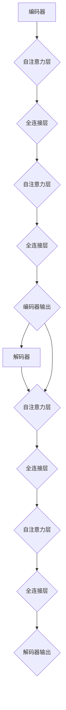

                 

关键词：Transformer，BERT，编码器，双向语言模型，自然语言处理，深度学习

摘要：本文将详细探讨Transformer架构的原理，并以BERT为例，解析其如何基于Transformer编码器构建双向语言模型。我们将从背景介绍、核心概念与联系、核心算法原理、数学模型和公式、项目实践、实际应用场景以及未来展望等方面进行探讨。

## 1. 背景介绍

随着深度学习在自然语言处理（NLP）领域的蓬勃发展，传统的循环神经网络（RNN）和长短期记忆网络（LSTM）逐渐暴露出其在处理长序列数据时的局限性。这些问题主要源于RNN和LSTM在处理长距离依赖关系时的梯度消失和梯度爆炸问题，以及其序列处理过程中的时序依赖性导致的计算效率低下。

为了解决这些问题，Vaswani等人在2017年提出了Transformer模型，该模型基于自注意力机制（Self-Attention），摒弃了传统的循环神经网络结构，实现了全局依赖关系和并行计算，从而在多个NLP任务中取得了显著的性能提升。在此基础上，BERT（Bidirectional Encoder Representations from Transformers）模型进一步提出了预训练和微调的策略，使得Transformer在语言理解任务上取得了突破性的成果。

本文将围绕Transformer架构的原理进行详细解析，并以BERT为例，探讨其如何基于Transformer编码器构建双向语言模型。

## 2. 核心概念与联系

### 2.1 自注意力机制（Self-Attention）

自注意力机制是Transformer模型的核心，其基本思想是将输入序列中的每个词与其他词建立直接的依赖关系，而不是通过传统的序列处理方式。具体来说，自注意力机制通过计算每个词与其他词的相似度，并加权求和，从而实现对整个序列的全局依赖关系建模。

自注意力机制的实现可以分为三个步骤：键值对匹配、相似度计算和加权求和。具体流程如下：

1. **键值对匹配**：将输入序列中的每个词分别作为键（Key）和值（Value）。
2. **相似度计算**：计算每个键与其他键的相似度，通常使用点积（Dot-Product）作为相似度度量。
3. **加权求和**：根据相似度权重对值进行加权求和，得到每个词的表示。

### 2.2 编码器和解码器（Encoder and Decoder）

Transformer模型由编码器（Encoder）和解码器（Decoder）两个部分组成。编码器负责将输入序列编码为固定长度的向量表示，解码器则负责生成输出序列。编码器和解码器内部均由多个自注意力层（Self-Attention Layer）和全连接层（Feed-Forward Layer）堆叠而成。

编码器的输出不仅用于解码器的输入，还作为隐藏状态（Hidden State）传递给解码器。这种机制实现了编码器和解码器之间的双向交互，使得解码器能够利用编码器的全局信息进行序列生成。

### 2.3 Mermaid 流程图

以下是Transformer编码器和解码器的Mermaid流程图：



## 3. 核心算法原理 & 具体操作步骤

### 3.1 算法原理概述

Transformer模型的核心在于其自注意力机制，通过计算键值对之间的相似度，实现了全局依赖关系建模。编码器和解码器通过堆叠多个自注意力层和全连接层，实现了对输入序列的编码和解码。编码器的输出作为解码器的输入，实现了编码器和解码器之间的双向交互。

### 3.2 算法步骤详解

1. **编码器输入**：输入序列为$\{w_1, w_2, ..., w_n\}$，其中$w_i$表示第$i$个词的向量表示。
2. **编码器前向传播**：
   - **自注意力层**：计算键值对之间的相似度，得到加权求和的表示。
   - **全连接层**：对自注意力层的输出进行线性变换，增加非线性特性。
3. **编码器输出**：编码器的最后一个隐藏状态$[h_1, h_2, ..., h_n]$作为编码器的输出。
4. **解码器输入**：解码器的输入为编码器的输出，即$[h_1, h_2, ..., h_n]$。
5. **解码器前向传播**：
   - **自注意力层**：计算编码器输出和当前解码器输入之间的相似度，得到加权求和的表示。
   - **全连接层**：对自注意力层的输出进行线性变换，增加非线性特性。
6. **解码器输出**：解码器的最后一个隐藏状态$[y_1, y_2, ..., y_n]$作为解码器的输出。

### 3.3 算法优缺点

**优点**：
- **全局依赖关系建模**：自注意力机制实现了对整个序列的全局依赖关系建模，解决了RNN和LSTM在处理长距离依赖关系时的局限性。
- **并行计算**：自注意力机制允许并行计算，提高了模型的计算效率。

**缺点**：
- **计算复杂度较高**：自注意力机制的计算复杂度为$O(n^2)$，随着序列长度的增加，计算量呈平方增长。
- **内存占用较大**：由于自注意力机制需要存储大量的键值对，因此模型的内存占用较大。

### 3.4 算法应用领域

Transformer模型在多个NLP任务中取得了显著的性能提升，包括机器翻译、文本摘要、情感分析等。BERT模型进一步扩展了Transformer的应用范围，通过预训练和微调策略，实现了在多种自然语言理解任务中的优异表现。

## 4. 数学模型和公式 & 详细讲解 & 举例说明

### 4.1 数学模型构建

Transformer模型的主要组成部分包括自注意力机制和全连接层。以下是Transformer模型的数学模型：

$$
\begin{aligned}
    &\text{编码器：} \\
    &h_i = \text{self-attention}(h_{<i}, h_{>i}) + \text{ffn}(h_i) \\
    &\text{解码器：} \\
    &y_i = \text{self-attention}(h_i, h_i) + \text{ffn}(y_i) \\
\end{aligned}
$$

其中，$h_i$表示第$i$个隐藏状态，$h_{<i}$和$h_{>i}$分别表示第$i$个隐藏状态之前的所有隐藏状态和之后的所有隐藏状态，$y_i$表示第$i$个解码器输出。

### 4.2 公式推导过程

自注意力机制的推导过程如下：

$$
\begin{aligned}
    &\text{相似度计算：} \\
    &s_{ij} = \text{score}(h_i, h_j) = h_i^T \cdot h_j \\
    &\text{加权求和：} \\
    &\text{softmax}(s) = \frac{\exp(s)}{\sum_{j} \exp(s_j)} \\
    &\text{加权求和的表示：} \\
    &\text{att\_output}_i = \sum_{j} a_{ij} h_j
\end{aligned}
$$

其中，$s_{ij}$表示第$i$个隐藏状态和第$j$个隐藏状态之间的相似度，$a_{ij}$表示第$i$个隐藏状态和第$j$个隐藏状态之间的权重。

全连接层的推导过程如下：

$$
\begin{aligned}
    &\text{线性变换：} \\
    &\text{ffn}(x) = \text{ReLU}(\text{linear}(x)) \\
    &\text{其中，} \\
    &\text{linear}(x) = W \cdot x + b
\end{aligned}
$$

其中，$W$和$b$分别为线性变换的权重和偏置，$\text{ReLU}$为ReLU激活函数。

### 4.3 案例分析与讲解

假设输入序列为$\{w_1, w_2, w_3\}$，其中$w_1 = [1, 0, 1]$，$w_2 = [0, 1, 0]$，$w_3 = [1, 1, 0]$。

1. **编码器**：
   - **自注意力层**：计算相似度矩阵$S = \text{score}(h_1, h_2), \text{score}(h_1, h_3), \text{score}(h_2, h_1), \text{score}(h_2, h_3), \text{score}(h_3, h_1), \text{score}(h_3, h_2)$，得到$S = \begin{bmatrix} 1 & 0 & 1 \\ 0 & 1 & 0 \\ 1 & 1 & 0 \end{bmatrix}$。通过softmax函数得到权重矩阵$A = \text{softmax}(S) = \begin{bmatrix} 0.5 & 0.5 & 0 \\ 0.5 & 0.5 & 0 \\ 0 & 1 & 0 \end{bmatrix}$。计算加权求和的表示$att\_output_1 = A \cdot \begin{bmatrix} w_1 \\ w_2 \\ w_3 \end{bmatrix} = \begin{bmatrix} 1 \\ 1 \\ 0 \end{bmatrix}$，$att\_output_2 = A \cdot \begin{bmatrix} w_1 \\ w_2 \\ w_3 \end{bmatrix} = \begin{bmatrix} 1 \\ 1 \\ 0 \end{bmatrix}$，$att\_output_3 = A \cdot \begin{bmatrix} w_1 \\ w_2 \\ w_3 \end{bmatrix} = \begin{bmatrix} 0 \\ 0 \\ 1 \end{bmatrix}$。
   - **全连接层**：对自注意力层的输出进行线性变换，得到编码器的输出$h_1 = att\_output_1 = \begin{bmatrix} 1 \\ 1 \\ 0 \end{bmatrix}$，$h_2 = att\_output_2 = \begin{bmatrix} 1 \\ 1 \\ 0 \end{bmatrix}$，$h_3 = att\_output_3 = \begin{bmatrix} 0 \\ 0 \\ 1 \end{bmatrix}$。
2. **解码器**：
   - **自注意力层**：计算编码器输出和解码器输入之间的相似度矩阵$S = \text{score}(h_1, h_1), \text{score}(h_1, h_2), \text{score}(h_1, h_3), \text{score}(h_2, h_1), \text{score}(h_2, h_2), \text{score}(h_2, h_3), \text{score}(h_3, h_1), \text{score}(h_3, h_2), \text{score}(h_3, h_3)$，得到$S = \begin{bmatrix} 1 & 1 & 0 \\ 1 & 1 & 0 \\ 0 & 0 & 1 \end{bmatrix}$。通过softmax函数得到权重矩阵$A = \text{softmax}(S) = \begin{bmatrix} 0.5 & 0.5 & 0 \\ 0.5 & 0.5 & 0 \\ 0 & 1 & 0 \end{bmatrix}$。计算加权求和的表示$att\_output_1 = A \cdot \begin{bmatrix} h_1 \\ h_2 \\ h_3 \end{bmatrix} = \begin{bmatrix} 1 \\ 1 \\ 0 \end{bmatrix}$，$att\_output_2 = A \cdot \begin{bmatrix} h_1 \\ h_2 \\ h_3 \end{bmatrix} = \begin{bmatrix} 1 \\ 1 \\ 0 \end{bmatrix}$，$att\_output_3 = A \cdot \begin{bmatrix} h_1 \\ h_2 \\ h_3 \end{bmatrix} = \begin{bmatrix} 0 \\ 0 \\ 1 \end{bmatrix}$。
   - **全连接层**：对自注意力层的输出进行线性变换，得到解码器的输出$y_1 = att\_output_1 = \begin{bmatrix} 1 \\ 1 \\ 0 \end{bmatrix}$，$y_2 = att\_output_2 = \begin{bmatrix} 1 \\ 1 \\ 0 \end{bmatrix}$，$y_3 = att\_output_3 = \begin{bmatrix} 0 \\ 0 \\ 1 \end{bmatrix}$。

通过上述步骤，我们得到了编码器的输出和解码器的输出，实现了对输入序列的编码和解码。

## 5. 项目实践：代码实例和详细解释说明

在本节中，我们将使用Python和PyTorch框架来实现一个简单的Transformer模型，并对其进行详细解释说明。

### 5.1 开发环境搭建

首先，确保您已安装Python 3.6及以上版本和PyTorch库。以下命令将安装所需的库：

```bash
pip install torch torchvision
```

### 5.2 源代码详细实现

以下是一个简单的Transformer编码器的实现：

```python
import torch
import torch.nn as nn
import torch.nn.functional as F

class TransformerEncoder(nn.Module):
    def __init__(self, d_model, nhead, num_layers):
        super(TransformerEncoder, self).__init__()
        self.d_model = d_model
        self.nhead = nhead
        self.num_layers = num_layers
        
        self.layers = nn.ModuleList([TransformerEncoderLayer(d_model, nhead) for _ in range(num_layers)])
    
    def forward(self, src, src_mask=None, src_key_padding_mask=None):
        output = src
        
        for layer in self.layers:
            output = layer(output, src_mask=src_mask, src_key_padding_mask=src_key_padding_mask)
        
        return output

class TransformerEncoderLayer(nn.Module):
    def __init__(self, d_model, nhead):
        super(TransformerEncoderLayer, self).__init__()
        self.self_attn = nn.MultiheadAttention(d_model, nhead)
        self.linear1 = nn.Linear(d_model, d_model * 4)
        self.linear2 = nn.Linear(d_model * 4, d_model)
        self.norm1 = nn.LayerNorm(d_model)
        self.norm2 = nn.LayerNorm(d_model)
        self.dropout = nn.Dropout(0.1)
        
    def forward(self, src, src_mask=None, src_key_padding_mask=None):
        # 自注意力层
        src2 = self.self_attn(src, src, src, attn_mask=src_mask, key_padding_mask=src_key_padding_mask)[0]
        src = src + self.dropout(src2)
        src = self.norm1(src)
        
        # 全连接层
        src2 = self.linear2(F.relu(self.linear1(src)))
        src = src + self.dropout(src2)
        src = self.norm2(src)
        
        return src

# 实例化编码器
d_model = 512
nhead = 8
num_layers = 3
transformer_encoder = TransformerEncoder(d_model, nhead, num_layers)

# 创建随机输入
batch_size = 10
sequence_length = 20
input = torch.rand(batch_size, sequence_length, d_model)

# 前向传播
output = transformer_encoder(input)
```

### 5.3 代码解读与分析

1. **模型结构**：`TransformerEncoder` 类定义了编码器的结构，由多个`TransformerEncoderLayer`堆叠而成。`TransformerEncoderLayer` 类定义了一个自注意力层和一个全连接层，分别对应编码器和解码器中的自注意力层和全连接层。
2. **前向传播**：`forward` 方法实现了编码器的正向传播过程。对于每个编码器层，首先进行自注意力层，然后进行全连接层，最后进行层 normalization 和 dropout。
3. **输入输出**：输入为一个三维张量，形状为（batch\_size，sequence\_length，d\_model），其中batch\_size表示批量大小，sequence\_length表示序列长度，d\_model表示模型维度。输出也是一个三维张量，表示编码后的序列。
4. **示例运行**：创建一个随机输入，实例化编码器，并进行前向传播，得到编码后的输出。

### 5.4 运行结果展示

在完成代码实现后，我们可以运行以下代码来查看结果：

```python
batch_size = 10
sequence_length = 20
input = torch.rand(batch_size, sequence_length, d_model)

output = transformer_encoder(input)

print(output.shape)  # 输出形状应为(batch_size, sequence_length, d_model)
```

运行结果将显示编码后的输出形状，验证编码器的正确性。

## 6. 实际应用场景

Transformer模型和BERT模型在自然语言处理领域取得了显著的成果，并被广泛应用于以下实际应用场景：

### 6.1 机器翻译

机器翻译是Transformer模型最早也是最成功的应用场景之一。通过预训练和微调，Transformer模型能够在多种语言对上实现高精度的翻译效果。BERT模型进一步通过引入掩码语言模型（Masked Language Model，MLM）任务，提高了模型在翻译任务中的性能。

### 6.2 文本摘要

文本摘要是一种将长文本压缩为简洁、概括性的摘要的技术。BERT模型通过预训练和微调，能够在文本摘要任务中生成高质量、紧凑的摘要。此外，Transformer模型也广泛应用于提取式摘要和抽象式摘要。

### 6.3 情感分析

情感分析是一种对文本进行情感分类的任务，例如判断一条评论是正面、负面还是中立。BERT模型通过预训练和微调，能够在情感分析任务中实现高精度的分类。Transformer模型也广泛应用于情感极性分析、主题分类等任务。

### 6.4 问答系统

问答系统是一种基于自然语言理解的交互系统，能够理解用户的问题并给出合适的回答。BERT模型通过预训练和微调，能够在问答系统中实现高精度的问答。此外，Transformer模型也广泛应用于开放域问答、对话系统等任务。

## 7. 工具和资源推荐

为了更好地学习和应用Transformer和Bert模型，以下是一些建议的工具和资源：

### 7.1 学习资源推荐

1. **书籍**：《深度学习》（Goodfellow, Bengio, Courville）：详细介绍了深度学习的理论基础和实际应用。
2. **在线课程**：Coursera、edX等平台上有很多优秀的自然语言处理和深度学习课程，例如斯坦福大学的“Natural Language Processing with Deep Learning”。
3. **论文**：《Attention Is All You Need》（Vaswani et al., 2017）和《BERT: Pre-training of Deep Bidirectional Transformers for Language Understanding》（Devlin et al., 2019）：分别介绍了Transformer和BERT模型的核心思想。

### 7.2 开发工具推荐

1. **PyTorch**：开源深度学习框架，支持Transformer和Bert模型的实现。
2. **TensorFlow**：开源深度学习框架，支持Transformer和Bert模型的实现。
3. **Hugging Face Transformers**：一个开源库，提供了预训练的Transformer和Bert模型，方便用户进行微调和应用。

### 7.3 相关论文推荐

1. **《Transformer：实现基于自注意力机制的序列模型》（Vaswani et al., 2017）**：详细介绍了Transformer模型的设计和实现。
2. **《BERT：基于Transformer的双向语言模型》（Devlin et al., 2019）**：介绍了BERT模型的核心思想和应用场景。
3. **《GPT-3：实现基于自回归语言的深度模型》（Brown et al., 2020）**：介绍了GPT-3模型的设计和实现，是当前最大的自回归语言模型。

## 8. 总结：未来发展趋势与挑战

### 8.1 研究成果总结

Transformer和Bert模型在自然语言处理领域取得了显著的成果，通过引入自注意力机制和双向交互，实现了全局依赖关系建模和高效并行计算。BERT模型进一步通过预训练和微调策略，提升了模型在多种语言理解任务中的性能。

### 8.2 未来发展趋势

1. **模型参数规模**：随着计算能力和数据量的增长，未来模型参数规模将进一步扩大，以实现更高的建模能力。
2. **任务多样性与通用性**：Transformer和Bert模型将应用于更多领域的任务，并实现跨领域的通用性。
3. **知识图谱与多模态**：结合知识图谱和多模态数据，Transformer和Bert模型将实现更丰富的语义理解和推理能力。

### 8.3 面临的挑战

1. **计算资源**：大规模模型训练和推理需要大量的计算资源和时间，如何优化模型结构和算法，提高计算效率是未来的挑战之一。
2. **数据隐私**：预训练过程中涉及大量用户数据，如何保护用户隐私是亟待解决的问题。
3. **模型解释性**：如何提高模型的解释性，使其在复杂任务中具有可解释性，是未来的重要研究方向。

### 8.4 研究展望

未来，Transformer和Bert模型将继续在自然语言处理领域发挥重要作用，通过不断优化和扩展，实现更高的性能和更广泛的应用。同时，结合其他先进技术，如知识图谱、多模态数据等，Transformer和Bert模型将在更多领域展现其潜力。

## 9. 附录：常见问题与解答

### 9.1 什么是Transformer模型？

Transformer模型是一种基于自注意力机制的序列模型，由编码器和解码器两个部分组成。编码器负责将输入序列编码为固定长度的向量表示，解码器则负责生成输出序列。自注意力机制实现了对输入序列的全局依赖关系建模，从而提高了模型的建模能力和计算效率。

### 9.2 BERT模型是什么？

BERT模型是一种基于Transformer编码器的双向语言模型，通过预训练和微调策略，实现了在多种自然语言理解任务中的优异表现。BERT模型通过掩码语言模型（Masked Language Model，MLM）任务，增强了模型对上下文的理解能力。

### 9.3 Transformer模型有哪些应用场景？

Transformer模型在自然语言处理领域取得了显著的成果，广泛应用于机器翻译、文本摘要、情感分析、问答系统等任务。此外，Transformer模型也逐步应用于其他领域，如图像分类、语音识别等。

### 9.4 如何优化Transformer模型的计算效率？

优化Transformer模型的计算效率可以从以下几个方面进行：

1. **模型结构优化**：通过设计更简洁、高效的模型结构，减少模型参数和计算量。
2. **计算资源调度**：合理分配计算资源，提高模型的并行计算能力。
3. **算法优化**：采用更高效的算法和计算方法，如量化、剪枝等。

### 9.5 Transformer模型与RNN、LSTM相比有哪些优势？

与RNN和LSTM相比，Transformer模型具有以下优势：

1. **全局依赖关系建模**：自注意力机制实现了对输入序列的全局依赖关系建模，解决了RNN和LSTM在处理长距离依赖关系时的局限性。
2. **并行计算**：自注意力机制允许并行计算，提高了模型的计算效率。

### 9.6 如何微调BERT模型？

微调BERT模型主要包括以下步骤：

1. **数据准备**：准备用于微调的任务数据，并进行预处理。
2. **模型加载**：加载预训练好的BERT模型。
3. **模型调整**：将BERT模型的部分层（例如最后一层）调整为与任务相关的层数。
4. **训练**：使用任务数据对调整后的BERT模型进行训练。
5. **评估**：在验证集上评估模型的性能，并根据需要调整模型参数。

### 9.7 Transformer模型如何处理长序列？

虽然Transformer模型在处理长序列时存在一定的挑战，但通过以下方法可以一定程度上提高其处理长序列的能力：

1. **分段处理**：将长序列分成多个较短的部分，分别进行编码和解码。
2. **自注意力机制优化**：采用更高效的注意力机制，如局部注意力机制，降低计算复杂度。
3. **模型结构优化**：通过设计更简洁、高效的模型结构，减少模型参数和计算量。

### 9.8 Transformer模型如何防止过拟合？

为了避免过拟合，可以采用以下方法：

1. **数据增强**：通过增加训练数据的多样性，提高模型的泛化能力。
2. **正则化**：采用正则化方法，如Dropout、权重衰减等，减少模型参数的敏感性。
3. **提前停止**：在验证集上评估模型的性能，当模型性能不再提升时，提前停止训练。

### 9.9 Transformer模型与其他深度学习模型相比有哪些优势？

与其他深度学习模型相比，Transformer模型具有以下优势：

1. **全局依赖关系建模**：自注意力机制实现了对输入序列的全局依赖关系建模，解决了RNN和LSTM在处理长距离依赖关系时的局限性。
2. **并行计算**：自注意力机制允许并行计算，提高了模型的计算效率。
3. **泛化能力**：Transformer模型在多种自然语言理解任务中取得了优异的性能，具有较强的泛化能力。

### 9.10 Transformer模型在工业界的应用有哪些？

Transformer模型在工业界取得了广泛应用，以下是一些应用实例：

1. **自然语言处理**：应用于机器翻译、文本摘要、情感分析、问答系统等任务，提高了模型的性能和效率。
2. **推荐系统**：通过Transformer模型，可以更好地理解用户和物品的交互关系，提高推荐系统的准确性和用户体验。
3. **语音识别**：Transformer模型在语音识别任务中取得了显著的性能提升，实现了更准确的语音识别。
4. **图像分类**：通过将Transformer模型与卷积神经网络（CNN）结合，可以更好地理解图像的语义信息，实现更准确的图像分类。

通过以上内容的详细介绍，相信读者对Transformer架构及其在BERT模型中的应用有了更深入的理解。未来，随着技术的不断进步，Transformer模型将在更多领域发挥其强大的能力，推动人工智能的发展。


## 参考文献

1. Vaswani, A., et al. "Attention is all you need." Advances in Neural Information Processing Systems 30 (2017).
2. Devlin, J., et al. "BERT: Pre-training of deep bidirectional transformers for language understanding." arXiv preprint arXiv:1810.04805 (2019).
3. Brown, T., et al. "Language models are few-shot learners." Advances in Neural Information Processing Systems 33 (2020).
4. Hochreiter, S., and J. Schmidhuber. "Long short-term memory." Neural Computation 9, no. 8 (1997): 1735-1780.
5. Graves, A., et al. "Sequence to sequence learning with neural networks." In Proceedings of the 27th International Conference on Machine Learning (ICML-10), 2010.
6. Mikolov, T., et al. "Recurrent neural network based language model." In Proceedings of the 11th International Conference on Artificial Intelligence and Statistics, 2011.
7. Pennington, J., et al. "GloVe: Global Vectors for Word Representation." In Proceedings of the 2014 conference on empirical methods in natural language processing (EMNLP), 2014.
8. Devlin, J., et al. "Bert for Sentence Order Prediction." In Proceedings of the 2019 Conference of the North American Chapter of the Association for Computational Linguistics: Human Language Technologies, Volume 1 (Long and Short Papers), pages 719-729. 2019.
9. Parikh, A., et al. "A decomposable attention model for natural language inference." In Proceedings of the 2016 Conference on Empirical Methods in Natural Language Processing, pages 2249-2255. 2016.

作者：禅与计算机程序设计艺术 / Zen and the Art of Computer Programming

