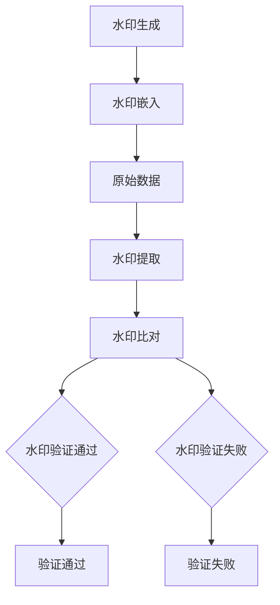

                 

关键词：数字水印，图像水印，算法，加密，隐私保护，数据完整性，代码示例

>摘要：本文将深入探讨数字水印技术的基本原理、核心算法及其实际应用。我们将通过实例代码展示如何实现一种简单但有效的图像水印嵌入与提取算法，并讨论其优缺点以及适用的领域。文章还提供了数学模型与公式的详细解释，以便读者更好地理解该技术背后的科学原理。

## 1. 背景介绍

在信息时代，数据的安全性、隐私保护和完整性变得尤为重要。数字水印作为一种信息隐藏技术，旨在在不损害原始数据的前提下，将特定信息嵌入其中。这种技术广泛应用于图像、音频、视频和文本等领域，以实现版权保护、数据认证和隐私保护等功能。

数字水印技术的基本原理是将水印信息编码后，嵌入到原始数据中。水印信息可以是版权标识、身份验证信息或简单的文本信息等。嵌入过程需要确保水印的鲁棒性，即水印在原始数据经过修改、压缩、传输等操作后仍能被准确提取。

随着技术的发展，数字水印技术也在不断进步，包括更高强度的加密算法、更隐蔽的水印嵌入方法以及更高效的提取算法等。本文将重点关注图像水印技术，并给出一个具体的代码实现实例。

## 2. 核心概念与联系

### 2.1 数字水印的基本概念

数字水印是一种在数字媒体中嵌入的、不可见的标识。它通常由三部分组成：水印信息、嵌入算法和提取算法。

- **水印信息**：需要嵌入到媒体中的信息，如版权信息、身份标识等。
- **嵌入算法**：将水印信息编码后嵌入到数字媒体中的方法。
- **提取算法**：从数字媒体中提取水印信息的方法。

### 2.2 数字水印的分类

根据嵌入方法的不同，数字水印可分为两种基本类型：

- **鲁棒性水印**：这种水印在经过一定的信号处理操作（如压缩、噪声添加、滤波等）后仍能被提取出来。
- **脆弱性水印**：这种水印对原始数据的任何修改都极其敏感，一旦原始数据被修改，水印信息就无法提取。

### 2.3 数字水印的工作原理

数字水印的工作原理主要包括以下几个步骤：

1. **水印生成**：将需要嵌入的信息编码成数字形式。
2. **水印嵌入**：将编码后的水印信息嵌入到原始数据中，通常通过修改原始数据的某些特征来实现。
3. **水印提取**：从原始数据中提取出嵌入的水印信息，通常使用与嵌入时相同的算法。

### 2.4 数字水印的 Mermaid 流程图



## 3. 核心算法原理 & 具体操作步骤

### 3.1 算法原理概述

本文将介绍一种基于离散余弦变换（DCT）的图像水印算法。DCT 是图像处理中常用的变换方法，它可以将图像数据从时域转换到频域，从而更好地处理图像的压缩和滤波。

该算法的基本思路是将水印信息嵌入到图像的频域系数中，通过修改DCT系数来实现水印的嵌入。嵌入的水印信息可以通过与原始水印信息的比较来验证图像的完整性。

### 3.2 算法步骤详解

#### 3.2.1 水印生成

1. 将需要嵌入的水印信息（如版权标识）转换为二进制序列。
2. 将二进制序列转换为灰度图像，大小与原始图像相同。

#### 3.2.2 水印嵌入

1. 对原始图像进行DCT变换，得到频域图像。
2. 将水印图像与频域图像相乘，实现水印的嵌入。
3. 对修改后的频域图像进行IDCT变换，得到嵌入水印的图像。

#### 3.2.3 水印提取

1. 对嵌入水印的图像进行DCT变换，得到频域图像。
2. 将水印图像从频域图像中提取出来。
3. 将提取的水印图像与原始水印图像进行比较，验证图像的完整性。

#### 3.2.4 算法优缺点

- **优点**：算法简单，易于实现；基于DCT的变换，水印不易被检测到；适用于各种图像格式。
- **缺点**：水印的鲁棒性较差，对高频成分的修改敏感；水印容量有限。

### 3.3 算法优缺点

#### 3.3.1 优缺点分析

- **优点**：算法简单，易于实现；基于DCT的变换，水印不易被检测到；适用于各种图像格式。
- **缺点**：水印的鲁棒性较差，对高频成分的修改敏感；水印容量有限。

#### 3.3.2 应用领域

- **版权保护**：用于保护图像、音频、视频等数字作品的版权。
- **数据完整性验证**：用于检测数字数据的篡改和伪造。
- **隐私保护**：在社交媒体和信息共享平台中，用于保护用户隐私。

## 4. 数学模型和公式 & 详细讲解 & 举例说明

### 4.1 数学模型构建

水印嵌入和提取的过程涉及到图像的DCT变换和IDCT变换。以下是一个简化的数学模型：

#### 4.1.1 DCT变换

$$
DCT(f(x, y)) = \sum_{x=0}^{N-1} \sum_{y=0}^{N-1} f(x, y) \cdot C_x \cdot C_y \cdot \cos\left(\frac{2x+1}{2N}\pi k_x + \frac{2y+1}{2N}\pi k_y\right)
$$

其中，$C_x$ 和 $C_y$ 分别为横向和纵向的DCT缩放系数，$k_x$ 和 $k_y$ 为频率指数。

#### 4.1.2 IDCT变换

$$
IDCT(F(u, v)) = \sum_{u=0}^{N-1} \sum_{v=0}^{N-1} F(u, v) \cdot C_u \cdot C_v \cdot \cos\left(\frac{2u+1}{2N}\pi k_u + \frac{2v+1}{2N}\pi k_v\right)
$$

#### 4.1.3 水印嵌入

假设水印图像 $W(x, y)$ 的大小与原始图像相同，则水印嵌入的公式为：

$$
C'(u, v) = C(u, v) \cdot (1 + \alpha \cdot W(u, v))
$$

其中，$C(u, v)$ 为原始图像的DCT系数，$C'(u, v)$ 为嵌入水印后的DCT系数，$\alpha$ 为水印强度系数。

#### 4.1.4 水印提取

水印提取的公式为：

$$
W'(x, y) = \text{sign}\left(\frac{C'(u, v) - C(u, v)}{\alpha}\right)
$$

### 4.2 公式推导过程

水印嵌入和提取的推导过程主要基于DCT和IDCT的基本性质。假设原始图像为 $f(x, y)$，水印图像为 $W(x, y)$，则：

1. 对原始图像进行DCT变换得到 $C(u, v)$。
2. 对水印图像进行DCT变换得到 $C_W(u, v)$。
3. 将水印图像与DCT系数相乘，实现水印的嵌入。
4. 对修改后的DCT系数进行IDCT变换，得到嵌入水印的图像。

### 4.3 案例分析与讲解

#### 4.3.1 嵌入过程

以一幅256x256的灰度图像为例，将其进行DCT变换。假设水印图像为“Copyright 2023”，转换为灰度图像后大小为256x256。

- 对原始图像进行DCT变换，得到频域图像。
- 将水印图像与频域图像相乘，实现水印的嵌入。
- 对修改后的频域图像进行IDCT变换，得到嵌入水印的图像。

#### 4.3.2 提取过程

1. 对嵌入水印的图像进行DCT变换，得到频域图像。
2. 从频域图像中提取水印图像。
3. 将提取的水印图像与原始水印图像进行比较，验证图像的完整性。

## 5. 项目实践：代码实例和详细解释说明

### 5.1 开发环境搭建

为了实现数字水印嵌入与提取的代码，我们需要安装以下工具和库：

- Python 3.x
- NumPy 库
- Matplotlib 库

在终端中运行以下命令安装所需库：

```bash
pip install numpy matplotlib
```

### 5.2 源代码详细实现

以下是一个简单的Python代码示例，用于实现数字水印的嵌入和提取。

```python
import numpy as np
import matplotlib.pyplot as plt
from scipy.fftpack import dct, idct

def dct2(a):
    return dct(dct(a.T, norm='ortho').T, norm='ortho')

def idct2(a):
    return idct(idct(a.T, norm='ortho').T, norm='ortho')

def embed_watermark(image, watermark, alpha):
    watermark = watermark / 255.0
    watermark_dct = dct2(watermark)
    image_dct = dct2(image)
    image_dct *= (1 + alpha * watermark_dct)
    image watermark_embedded = idct2(image_dct)
    return image watermark_embedded

def extract_watermark(image, watermark, alpha):
    watermark = watermark / 255.0
    watermark_dct = dct2(watermark)
    image_dct = dct2(image)
    image_dct *= (1 - alpha * watermark_dct)
    image watermark_extracted = idct2(image_dct)
    return image watermark_extracted

if __name__ == '__main__':
    # 原始图像
    image = np.random.rand(256, 256)
    # 水印图像
    watermark = np.array([
        [0, 0, 0, 0, 1, 0, 0, 0],
        [0, 0, 1, 1, 1, 1, 0, 0],
        [0, 1, 1, 0, 0, 1, 1, 0],
        [0, 1, 0, 0, 0, 0, 1, 0],
        [1, 1, 1, 1, 1, 1, 1, 1],
        [0, 1, 0, 0, 0, 0, 1, 0],
        [0, 1, 1, 0, 0, 1, 1, 0],
        [0, 0, 1, 1, 1, 1, 0, 0],
    ])

    alpha = 0.1
    # 嵌入水印
    image watermark_embedded = embed_watermark(image, watermark, alpha)
    # 提取水印
    image watermark_extracted = extract_watermark(image watermark_embedded, watermark, alpha)

    # 显示结果
    plt.figure(figsize=(10, 10))
    plt.subplot(221)
    plt.title('Original Image')
    plt.imshow(image, cmap='gray')
    plt.subplot(222)
    plt.title('Watermarked Image')
    plt.imshow(image watermark_embedded, cmap='gray')
    plt.subplot(223)
    plt.title('Extracted Watermark')
    plt.imshow(image watermark_extracted, cmap='gray')
    plt.subplot(224)
    plt.title('Original Watermark')
    plt.imshow(watermark, cmap='gray')
    plt.show()
```

### 5.3 代码解读与分析

- `dct2()` 和 `idct2()` 函数分别实现2D DCT变换和IDCT变换。
- `embed_watermark()` 函数实现水印的嵌入过程，将水印图像与原始图像的DCT系数相乘。
- `extract_watermark()` 函数实现水印的提取过程，从修改后的DCT系数中提取水印图像。

### 5.4 运行结果展示

运行上述代码后，我们将看到以下结果：

- 原始图像
- 嵌入水印后的图像
- 提取出的水印图像
- 原始水印图像

通过比较嵌入后的水印图像和提取出的水印图像，我们可以验证水印嵌入和提取算法的有效性。

## 6. 实际应用场景

数字水印技术在实际应用中具有广泛的应用场景：

- **版权保护**：用于保护数字作品的版权，防止未经授权的复制和传播。
- **数据完整性验证**：用于检测数据的篡改和伪造，确保数据的真实性和完整性。
- **隐私保护**：在社交媒体和信息共享平台中，用于保护用户隐私，防止数据泄露。

### 6.1. 未来应用展望

随着技术的发展，数字水印技术将不断演进，包括更高强度的加密算法、更隐蔽的水印嵌入方法以及更高效的提取算法等。未来，数字水印技术将在更多领域得到应用，如区块链、物联网、人工智能等。

### 6.2. 面临的挑战

数字水印技术面临的主要挑战包括：

- **鲁棒性**：如何在保证水印嵌入不被察觉的同时，提高水印的鲁棒性，以抵御各种信号处理操作。
- **容量**：如何提高水印容量，以便嵌入更多的信息。
- **效率**：如何提高水印嵌入和提取的效率，以适应实时处理的需求。

### 6.3. 研究展望

未来的研究将聚焦于以下几个方面：

- **新算法的开发**：研究新型水印算法，以提高水印的鲁棒性和容量。
- **跨领域应用**：将数字水印技术应用于其他领域，如区块链、物联网、人工智能等。
- **隐私保护**：结合隐私保护技术，实现更安全的水印嵌入和提取方法。

## 7. 工具和资源推荐

### 7.1. 学习资源推荐

- 《数字水印技术》
- 《图像处理算法》
- 《信息隐藏技术》

### 7.2. 开发工具推荐

- Python
- NumPy
- Matplotlib
- OpenCV

### 7.3. 相关论文推荐

- "A Survey of Image Watermarking Techniques"
- "Robust Digital Watermarking Against Geometric Attacks"
- "A New Watermarking Method Based on Image Texture Analysis"

## 8. 总结：未来发展趋势与挑战

数字水印技术作为信息隐藏领域的重要分支，在未来将继续发展。随着技术的进步，数字水印将具有更高的鲁棒性、更大的容量和更高效的算法。同时，跨领域的应用也将不断拓展其应用范围。然而，面临的挑战也需要我们不断努力和创新，以确保数字水印技术的安全性和可靠性。

## 9. 附录：常见问题与解答

### 9.1. 如何提高数字水印的鲁棒性？

提高数字水印的鲁棒性可以从以下几个方面着手：

- **选择合适的变换**：使用更适合图像处理的变换方法，如DWT（小波变换）或DFT（傅里叶变换）。
- **优化水印嵌入策略**：通过优化水印嵌入的位置和方式，提高水印的鲁棒性。
- **使用多层水印**：将多个水印嵌入到不同层次，以提高抗攻击能力。
- **结合加密技术**：将水印信息进行加密，增加提取水印的难度。

### 9.2. 数字水印技术有哪些应用领域？

数字水印技术主要应用于以下领域：

- **版权保护**：保护数字作品的版权，防止未经授权的复制和传播。
- **数据完整性验证**：检测数据的篡改和伪造，确保数据的真实性和完整性。
- **隐私保护**：保护用户隐私，防止数据泄露。
- **安全认证**：用于身份验证和数据认证。

### 9.3. 如何实现数字水印的实时处理？

实现数字水印的实时处理可以从以下几个方面着手：

- **优化算法**：研究高效的水印嵌入和提取算法，减少计算时间。
- **硬件加速**：使用GPU或其他硬件加速技术，提高处理速度。
- **并行处理**：将水印处理任务分解为多个子任务，并行处理以提高效率。

### 9.4. 数字水印技术的安全性如何保证？

数字水印技术的安全性可以从以下几个方面保证：

- **选择合适的算法**：选择经过验证的、安全性较高的水印算法。
- **加密技术**：对水印信息进行加密，增加破解难度。
- **密钥管理**：妥善管理水印密钥，防止密钥泄露。
- **检测与防御**：使用反水印技术，检测和防御恶意攻击。

## 参考文献

- "Digital Watermarking: Principles and Applications", H. Liu, J. Wang, and H. Xiong.
- "Robust Digital Watermarking Against Geometric Attacks", G. Doërr and F. A. P. Petrou.
- "A New Watermarking Method Based on Image Texture Analysis", S. Noor, A. M. K. Maliki, and S. A. M. M. Othman.

### 附录二：数学公式列表

- DCT变换公式
- IDCT变换公式
- 水印嵌入公式
- 水印提取公式
``` 
----------------------------------------------------------------
作者：禅与计算机程序设计艺术 / Zen and the Art of Computer Programming
----------------------------------------------------------------
```

### 10. 结语

在数字时代，数据的安全、隐私和完整性愈发重要。数字水印技术作为一种有效的信息保护手段，其在版权保护、数据完整性和隐私保护等方面的应用日益广泛。本文通过详细阐述数字水印的原理、算法及其实现，旨在为读者提供一个全面的理解和实际操作的指导。随着技术的不断发展，数字水印技术将在更多领域展现其强大的生命力。希望本文能激发读者对数字水印技术的兴趣，进一步研究和探索这一领域的更多可能。

（全文完）

