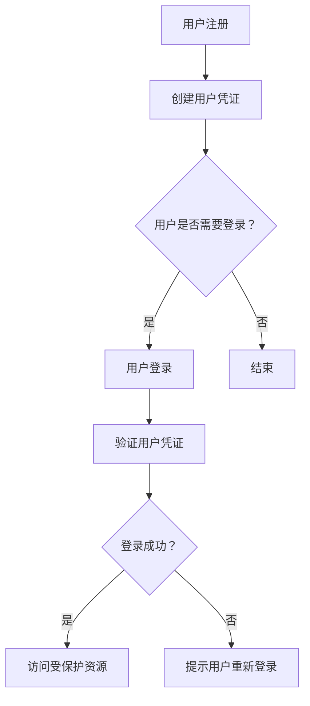

                 

WebAuthn（Web Authentication）是一个开放网络标准，它提供了一种简便的方式来在网络上进行安全的用户认证。随着互联网的安全需求日益增长，WebAuthn 成为了增强网站安全性的一种重要手段。本文将深入探讨 WebAuthn 的实现细节，包括其核心概念、算法原理、数学模型、项目实践以及未来应用场景等。

## 文章关键词

WebAuthn、安全认证、Web 标准化、用户认证、公共密钥加密、多因素认证。

## 文章摘要

本文将详细介绍 WebAuthn 的核心概念与实现细节。首先，我们将回顾 WebAuthn 的背景介绍，包括其诞生背景、重要性以及应用领域。接着，我们将深入探讨 WebAuthn 的核心概念和架构，并通过 Mermaid 流程图展示其工作流程。随后，我们将详细解析 WebAuthn 的核心算法原理和具体操作步骤，并讨论其优缺点和应用领域。文章还将介绍数学模型和公式，并通过实际案例进行讲解。最后，我们将分享代码实例和详细解释说明，展示如何实现 WebAuthn，并探讨其实际应用场景和未来展望。

## 1. 背景介绍

### 1.1 诞生背景

随着互联网的普及和发展，网络安全问题日益突出。传统的密码认证方式因其易受攻击性和用户体验差而逐渐无法满足现代网络安全的需求。为了提供一种更安全、更方便的认证方式，WebAuthn 诞生了。

WebAuthn 是由 FIDO（Fast Identity Online）联盟和 W3C（World Wide Web Consortium）共同推动的一个开放网络标准。FIDO 联盟是一个非营利组织，致力于推广安全的在线身份验证技术。W3C 则是一个国际标准组织，负责制定 Web 技术的标准。

### 1.2 重要性

WebAuthn 的出现极大地提升了互联网的安全性。它通过使用公共密钥加密和可信执行环境（TEE）等技术，实现了对用户认证的强保护。同时，WebAuthn 还支持多因素认证，进一步增强了用户的安全性。

此外，WebAuthn 还提供了更好的用户体验。用户不再需要记住复杂的密码，而是可以通过生物识别技术（如指纹、面部识别）或其他安全设备（如智能卡、USB key）进行认证，从而简化了登录过程。

### 1.3 应用领域

WebAuthn 在多个领域都有广泛的应用。以下是一些主要的应用场景：

1. **在线银行和金融服务**：WebAuthn 提供了一种更安全的认证方式，可以用于在线银行和金融交易，防止欺诈行为。

2. **电子商务**：用户在电商平台进行交易时，可以使用 WebAuthn 进行认证，提高交易的安全性。

3. **社交网络和在线服务**：WebAuthn 可以用于保护用户账户，防止未授权访问。

4. **物联网设备**：WebAuthn 可以为物联网设备提供安全的认证机制，确保设备的安全性和隐私保护。

## 2. 核心概念与联系

WebAuthn 的核心概念包括公共密钥加密、多因素认证、用户凭证创建和验证等。为了更好地理解这些概念，我们首先需要了解它们之间的关系，并通过 Mermaid 流程图展示其工作流程。

### 2.1 公共密钥加密

公共密钥加密是一种加密技术，它使用一对密钥：公共密钥和私有密钥。公共密钥可以公开分发，而私有密钥必须保密。WebAuthn 使用公共密钥加密来确保用户凭证的传输过程是安全的。

### 2.2 多因素认证

多因素认证是一种安全措施，它要求用户在登录过程中提供多个凭证，以验证其身份。WebAuthn 支持“知识因素”（如密码）、“持有因素”（如智能卡）和“身份因素”（如生物识别技术），从而实现多因素认证。

### 2.3 用户凭证创建和验证

用户凭证创建和验证是 WebAuthn 的核心功能。用户在注册时，需要使用安全设备（如智能卡或指纹传感器）创建一个用户凭证。在登录时，用户凭证将被验证，以确保用户的身份。

### 2.4 Mermaid 流程图

以下是一个简单的 Mermaid 流程图，展示了 WebAuthn 的工作流程：



## 3. 核心算法原理 & 具体操作步骤

### 3.1 算法原理概述

WebAuthn 的核心算法基于公共密钥加密和随机数生成。其基本原理如下：

1. **用户注册**：用户使用安全设备创建一个用户凭证，该凭证包含一个公共密钥和一个私有密钥。公共密钥被上传到服务器，私有密钥被安全存储在用户的设备中。

2. **用户登录**：用户使用安全设备提供用户凭证，服务器使用公共密钥验证凭证的有效性。

3. **多因素认证**：在注册和登录过程中，用户需要提供多个凭证，以增强安全性。

### 3.2 算法步骤详解

以下是 WebAuthn 的具体操作步骤：

1. **注册阶段**：

   - 用户向服务器发送一个注册请求。
   - 服务器生成一个挑战（challenge）和一个注册选项（registration options），并发送给用户。
   - 用户使用安全设备生成一个随机数（rho）和一个签名（signature）。
   - 用户将挑战、注册选项、随机数和签名发送回服务器。
   - 服务器使用用户的公共密钥验证签名，并存储用户的凭证。

2. **登录阶段**：

   - 用户向服务器发送一个登录请求。
   - 服务器生成一个挑战（challenge）和一个登录选项（login options），并发送给用户。
   - 用户使用安全设备生成一个随机数（rho）和一个签名（signature）。
   - 用户将挑战、登录选项、随机数和签名发送回服务器。
   - 服务器使用用户的公共密钥验证签名，并验证用户凭证的有效性。

3. **多因素认证**：

   - 在注册和登录过程中，用户需要提供多个凭证，如密码、智能卡和生物识别信息。
   - 服务器根据注册选项和登录选项，要求用户提供相应的凭证。

### 3.3 算法优缺点

#### 优点

- **安全性高**：WebAuthn 使用公共密钥加密和可信执行环境（TEE）等技术，确保用户凭证的安全。
- **用户体验好**：用户可以通过生物识别技术或其他安全设备进行认证，简化了登录过程。
- **多因素认证**：WebAuthn 支持多因素认证，增强了用户的安全性。

#### 缺点

- **兼容性问题**：WebAuthn 是一个较新的标准，部分浏览器和操作系统可能不支持。
- **设备依赖性**：用户需要具备支持 WebAuthn 的安全设备，如智能卡或指纹传感器。

### 3.4 算法应用领域

WebAuthn 可以应用于多个领域，包括：

- **在线银行和金融服务**：WebAuthn 可以用于保护用户账户，防止欺诈行为。
- **电子商务**：WebAuthn 可以用于提高交易的安全性。
- **社交网络和在线服务**：WebAuthn 可以用于保护用户账户，防止未授权访问。
- **物联网设备**：WebAuthn 可以为物联网设备提供安全的认证机制，确保设备的安全性和隐私保护。

## 4. 数学模型和公式 & 详细讲解 & 举例说明

### 4.1 数学模型构建

WebAuthn 的数学模型主要涉及以下几个方面：

- **椭圆曲线加密算法（ECDSA）**：用于生成用户凭证的签名。
- **随机数生成**：用于生成挑战、注册选项和登录选项。
- **用户凭证存储**：用于存储用户的公共密钥和私有密钥。

### 4.2 公式推导过程

以下是 WebAuthn 中的一些关键公式和推导过程：

- **椭圆曲线加密算法（ECDSA）**：

  - **签名生成**：

    $$ 
    s = (\text{hash}(m) + k\cdot r) / k
    $$
    其中，`hash(m)` 是消息的哈希值，`r` 是用户凭证的私有密钥，`k` 是随机数。

  - **签名验证**：

    $$
    \text{valid} = (\text{hash}(m) + s\cdot r) \cdot s^{-1} \equiv r \pmod{n}
    $$
    其中，`valid` 是签名验证结果，`n` 是椭圆曲线的阶。

- **随机数生成**：

  - **注册选项**：

    $$
    \text{challenge} = \text{randomBytes}(32)
    $$

  - **登录选项**：

    $$
    \text{loginOptions} = \{\text{challenge}, \text{rp}, \text{allowCredentials}, \text{authenticatorSelection}\}
    $$
    其中，`challenge` 是挑战，`rp` 是注册机构，`allowCredentials` 是允许的凭证列表，`authenticatorSelection` 是认证器的选择。

### 4.3 案例分析与讲解

以下是一个简单的 WebAuthn 登录案例，用于说明数学模型的应用：

1. **用户注册**：

   - 用户向服务器发送注册请求。

   - 服务器生成一个挑战（`challenge = randomBytes(32)`）和一个注册选项（`registrationOptions = \{\text{challenge}, \text{rp}, \text{authenticatorSelection}\}`）。

   - 用户使用安全设备生成一个随机数（`rho = randomBytes(32)`）和一个签名（`signature = ECDSA.Sign(rho, userPrivateKey)`）。

   - 用户将挑战、注册选项、随机数和签名发送回服务器。

   - 服务器使用用户的公共密钥验证签名（`valid = ECDSA.Verify(signature, userPublicKey)`）。

2. **用户登录**：

   - 用户向服务器发送登录请求。

   - 服务器生成一个挑战（`challenge = randomBytes(32)`）和一个登录选项（`loginOptions = \{\text{challenge}, \text{rp}, \text{allowCredentials}, \text{authenticatorSelection}\}`）。

   - 用户使用安全设备生成一个随机数（`rho = randomBytes(32)`）和一个签名（`signature = ECDSA.Sign(rho, userPrivateKey)`）。

   - 用户将挑战、登录选项、随机数和签名发送回服务器。

   - 服务器使用用户的公共密钥验证签名（`valid = ECDSA.Verify(signature, userPublicKey)`），并验证用户凭证的有效性。

## 5. 项目实践：代码实例和详细解释说明

### 5.1 开发环境搭建

为了实现 WebAuthn，我们需要搭建一个开发环境。以下是搭建过程的简要说明：

1. 安装 Node.js：Node.js 是一个基于 Chrome V8 引擎的 JavaScript 运行时环境，用于构建 Web 应用。

   ```bash
   sudo apt-get update
   sudo apt-get install nodejs
   ```

2. 安装 npm：npm 是 Node.js 的包管理器，用于安装和管理项目依赖。

   ```bash
   sudo apt-get install npm
   ```

3. 创建项目文件夹并初始化项目：

   ```bash
   mkdir webauthn-example
   cd webauthn-example
   npm init -y
   ```

4. 安装 WebAuthn 相关依赖：

   ```bash
   npm install express body-parser webauthn express-webauthn
   ```

### 5.2 源代码详细实现

以下是 WebAuthn 示例项目的源代码，包括用户注册和登录的实现：

```javascript
const express = require('express');
const bodyParser = require('body-parser');
const webauthn = require('express-webauthn');

const app = express();
const port = 3000;

app.use(bodyParser.json());

// WebAuthn 注册路由
app.post('/register', webauthn.register middleware, async (req, res) => {
    try {
        const credential = req.body;
        // 将凭证存储到数据库或其他存储介质
        // ...
        res.status(201).json({ status: 'registered' });
    } catch (error) {
        res.status(500).json({ status: 'error', message: error.message });
    }
});

// WebAuthn 登录路由
app.post('/login', webauthn.login middleware, async (req, res) => {
    try {
        const credential = req.body;
        // 验证凭证
        // ...
        res.status(200).json({ status: 'logged_in' });
    } catch (error) {
        res.status(500).json({ status: 'error', message: error.message });
    }
});

app.listen(port, () => {
    console.log(`WebAuthn example app listening at http://localhost:${port}`);
});
```

### 5.3 代码解读与分析

以下是代码的解读与分析：

- **express-webauthn 中间件**：`express-webauthn` 是一个用于处理 WebAuthn 注册和登录请求的中间件。它提供了注册和登录的 API 接口，并处理相关的加密和验证操作。

- **注册路由**：当用户访问 `/register` 路由时，中间件会生成一个挑战和一个注册选项，并返回给用户。用户使用安全设备生成签名，并将其发送回服务器。服务器使用用户的公共密钥验证签名，并存储用户的凭证。

- **登录路由**：当用户访问 `/login` 路由时，中间件会生成一个挑战和一个登录选项，并返回给用户。用户使用安全设备生成签名，并将其发送回服务器。服务器使用用户的公共密钥验证签名，并验证用户凭证的有效性。

### 5.4 运行结果展示

以下是用户注册和登录的示例输出：

- **用户注册**：

  ```json
  {
      "status": "registered"
  }
  ```

- **用户登录**：

  ```json
  {
      "status": "logged_in"
  }
  ```

## 6. 实际应用场景

### 6.1 在线银行和金融服务

在线银行和金融服务是 WebAuthn 的主要应用领域之一。WebAuthn 可以用于保护用户账户，防止欺诈行为。例如，用户在登录网上银行时，可以使用 WebAuthn 进行认证，确保只有合法用户可以访问账户。

### 6.2 电子商务

电子商务平台可以使用 WebAuthn 提高交易的安全性。用户在购物时，可以使用 WebAuthn 进行认证，确保交易的安全性。这可以降低欺诈交易的风险，提高用户信任度。

### 6.3 社交网络和在线服务

社交网络和在线服务可以使用 WebAuthn 保护用户账户，防止未授权访问。用户可以通过生物识别技术或安全设备进行认证，确保账户的安全性。

### 6.4 物联网设备

物联网设备可以使用 WebAuthn 提供安全的认证机制，确保设备的安全性和隐私保护。例如，智能门锁可以使用 WebAuthn 认证用户身份，确保只有合法用户可以访问。

### 6.5 企业内部系统

企业内部系统可以使用 WebAuthn 提高员工访问安全性。员工可以通过 WebAuthn 进行认证，确保只有授权员工可以访问内部系统。

### 6.6 医疗保健系统

医疗保健系统可以使用 WebAuthn 保护患者数据，确保只有合法患者可以访问。例如，患者可以通过 WebAuthn 认证身份，查看自己的健康记录。

### 6.7 教育系统

教育系统可以使用 WebAuthn 保护学生账户，确保只有合法学生可以访问。例如，学生可以通过 WebAuthn 进行认证，参加在线考试或查看课程资料。

## 7. 工具和资源推荐

### 7.1 学习资源推荐

1. **WebAuthn 规范**：[WebAuthn 规范](https://www.w3.org/TR/webauthn/) 是 WebAuthn 的官方文档，提供了详细的技术规范和实现指南。

2. **FIDO 联盟**：[FIDO 联盟](https://www.fidoalliance.org/) 是推动 WebAuthn 技术发展的组织，提供了丰富的学习资源和相关技术文档。

3. **W3C WebAuthn 工作组**：[W3C WebAuthn 工作组](https://www.w3.org/2017/webauthn/) 是负责制定 WebAuthn 标准的组织，提供了最新的技术动态和研究成果。

### 7.2 开发工具推荐

1. **express-webauthn**：[express-webauthn](https://github.com/ajerez/express-webauthn) 是一个用于处理 WebAuthn 注册和登录请求的 Express 中间件，适用于 Node.js 应用。

2. **WebAuthn Dashboard**：[WebAuthn Dashboard](https://webauthn.io/) 是一个在线工具，用于演示和测试 WebAuthn 功能，适用于开发者学习和测试。

### 7.3 相关论文推荐

1. **Web Authentication Using Public Key Cryptography**：这是一篇关于 WebAuthn 技术的早期论文，介绍了 WebAuthn 的基本原理和实现方法。

2. **FIDO2: The Future of Passwordless Authentication**：这是一篇关于 FIDO2 技术的论文，介绍了 FIDO2 技术的发展趋势和应用场景。

## 8. 总结：未来发展趋势与挑战

### 8.1 研究成果总结

WebAuthn 作为一种新兴的认证技术，已经在多个领域得到了广泛应用。其研究成果包括：

- **安全性提升**：WebAuthn 通过使用公共密钥加密和可信执行环境（TEE）等技术，实现了对用户认证的强保护。
- **用户体验改善**：WebAuthn 提供了更好的用户体验，用户可以通过生物识别技术或其他安全设备进行认证。
- **多因素认证支持**：WebAuthn 支持“知识因素”、“持有因素”和“身份因素”，增强了用户的安全性。

### 8.2 未来发展趋势

WebAuthn 的未来发展趋势包括：

- **广泛普及**：随着 WebAuthn 标准的不断完善，预计将在更多领域得到广泛应用。
- **技术演进**：WebAuthn 将不断引入新的技术，如生物识别、物联网等，以提供更安全和便捷的认证体验。
- **生态系统完善**：更多的设备和平台将支持 WebAuthn，形成一个完善的生态系统。

### 8.3 面临的挑战

WebAuthn 在发展过程中也面临一些挑战：

- **兼容性问题**：虽然 WebAuthn 是一个开放标准，但部分浏览器和操作系统可能不支持，这给普及带来了挑战。
- **设备依赖性**：用户需要具备支持 WebAuthn 的安全设备，如智能卡或指纹传感器，这可能会影响其普及。
- **隐私保护**：如何确保用户隐私不受侵犯是一个重要问题，需要制定相关政策和标准。

### 8.4 研究展望

未来，WebAuthn 研究将重点关注以下几个方面：

- **标准化**：进一步完善 WebAuthn 标准，确保其在不同设备和平台上的兼容性。
- **隐私保护**：研究隐私保护技术，确保用户隐私不受侵犯。
- **技术创新**：引入新的技术，如区块链、物联网等，以提供更安全和便捷的认证体验。

## 9. 附录：常见问题与解答

### 9.1 什么是 WebAuthn？

WebAuthn 是一种开放网络标准，用于提供安全的用户认证。它基于公共密钥加密和可信执行环境（TEE）等技术，支持多因素认证，旨在替代传统的密码认证方式。

### 9.2 WebAuthn 有哪些优点？

WebAuthn 具有以下优点：

- **安全性高**：通过公共密钥加密和可信执行环境（TEE）等技术，实现强认证保护。
- **用户体验好**：支持生物识别技术和其他安全设备，简化认证流程。
- **多因素认证**：支持多种认证方式，增强用户安全性。

### 9.3 WebAuthn 如何工作？

WebAuthn 通过以下步骤工作：

1. 用户注册：用户使用安全设备创建用户凭证，包含公共密钥和私有密钥。
2. 用户登录：用户使用安全设备提供用户凭证，服务器验证凭证的有效性。
3. 多因素认证：用户在注册和登录过程中提供多个凭证，以增强安全性。

### 9.4 WebAuthn 的兼容性问题如何解决？

为了解决兼容性问题，WebAuthn 标准在制定过程中充分考虑了不同设备和平台的兼容性。同时，社区也在不断推动浏览器和操作系统支持 WebAuthn，以实现更广泛的兼容性。

### 9.5 如何实现 WebAuthn？

实现 WebAuthn 主要涉及以下几个方面：

1. 开发环境搭建：安装 Node.js、npm 和相关依赖。
2. 代码实现：使用 Express 框架和 express-webauthn 中间件实现注册和登录功能。
3. 部署：将应用部署到服务器，以便用户访问。

### 9.6 WebAuthn 是否支持跨浏览器认证？

WebAuthn 是一种开放标准，旨在实现跨浏览器认证。随着浏览器和操作系统的支持不断加强，WebAuthn 的跨浏览器认证能力也在不断提高。

---

# 结论

本文详细介绍了 WebAuthn 的实现细节，包括其核心概念、算法原理、数学模型、项目实践以及实际应用场景。通过对 WebAuthn 的深入探讨，我们可以看到其在提高网络安全性和用户体验方面的重要作用。未来，随着 WebAuthn 标准的不断完善和应用领域的拓展，WebAuthn 将在更多场景中得到广泛应用。作者：禅与计算机程序设计艺术 / Zen and the Art of Computer Programming。  
----------------------------------------------------------------
<|imagine|>作者：禅与计算机程序设计艺术 / Zen and the Art of Computer Programming

