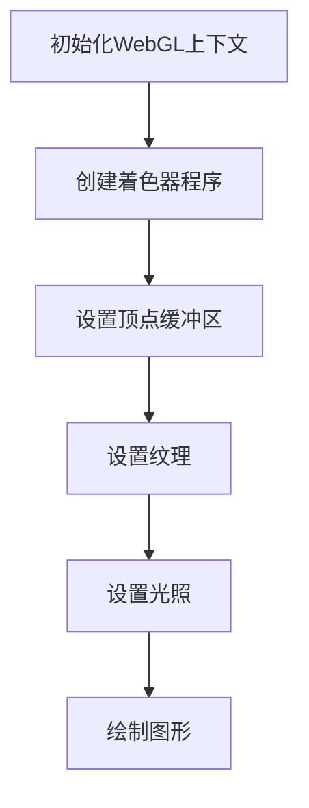

                 

 **关键词：** WebGL、3D图形渲染、浏览器、计算机图形学、Web技术、GPU编程。

> **摘要：** 本文章深入探讨了WebGL（Web Graphics Library）的技术原理和应用。文章首先介绍了WebGL的历史背景和核心概念，然后详细解析了其工作原理和渲染流程。通过数学模型和公式，本文探讨了如何使用WebGL进行3D图形渲染。文章还提供了一个具体的代码实例，展示了如何利用WebGL在浏览器中创建和渲染3D场景。最后，本文讨论了WebGL的实际应用场景和未来发展的展望。

## 1. 背景介绍

WebGL是一种基于JavaScript的Web标准，它允许在浏览器中实现硬件加速的2D和3D图形渲染。WebGL的全名是Web Graphics Library，它提供了一种在网页中创建和渲染复杂图形的强大工具。WebGL的出现，使得开发者无需安装额外的插件，就可以在网页中实现高质量的3D图形渲染。

### WebGL的发展历史

WebGL最初由Khronos Group于2009年发布。随着HTML5标准的普及，WebGL逐渐成为Web开发的重要技术之一。WebGL 1.0提供了基本的3D图形渲染功能，而WebGL 2.0则在性能和功能上有了显著的提升，例如增加了多个纹理、阴影、渲染到帧缓冲区等。

### WebGL的应用场景

WebGL可以在多个场景中使用，例如游戏开发、数据可视化、虚拟现实和增强现实等。它被广泛应用于Web游戏、在线教育、医疗诊断和广告展示等领域。

## 2. 核心概念与联系

WebGL的核心概念包括着色器编程、顶点缓冲区、纹理映射、光照模型等。这些概念相互关联，共同构成了WebGL的渲染流程。以下是WebGL的核心概念和它们之间的联系：

### 着色器编程

着色器是WebGL中最基本的概念之一。着色器是一段运行在GPU上的代码，用于处理顶点和片元（像素）。顶点着色器负责处理顶点的属性，例如位置、颜色和纹理坐标。片元着色器则负责处理每个片元的属性，例如颜色和透明度。

### 顶点缓冲区

顶点缓冲区是一个存储顶点数据的容器。在渲染过程中，顶点缓冲区中的数据会被发送到GPU，用于生成图形。顶点缓冲区可以是静态的，也可以是动态的，这意味着数据可以实时更新。

### 纹理映射

纹理映射是一种将2D纹理图像映射到3D模型表面上的技术。通过纹理映射，我们可以为模型添加纹理，使其看起来更加真实。纹理映射可以显著提高3D图形的视觉效果。

### 光照模型

光照模型用于计算3D模型表面的光照效果。常见的光照模型包括漫反射、镜面反射和聚光等。通过光照模型，我们可以为3D模型添加阴影、高光和反光等效果。

### WebGL渲染流程

WebGL的渲染流程可以概括为以下几个步骤：

1. **初始化WebGL上下文：** 在浏览器中创建一个WebGL上下文，用于渲染图形。
2. **创建着色器程序：** 编写顶点着色器和片元着色器，并将它们编译成可执行的程序。
3. **设置顶点缓冲区：** 将顶点数据填充到顶点缓冲区中。
4. **设置纹理：** 将纹理图像加载到GPU内存中，并将其绑定到着色器程序。
5. **设置光照：** 设置光照模型，包括光源位置、颜色和强度等。
6. **绘制图形：** 使用着色器程序和顶点缓冲区数据，绘制3D图形。

### Mermaid流程图

下面是一个Mermaid流程图，展示了WebGL的渲染流程：



## 3. 核心算法原理 & 具体操作步骤

### 3.1 算法原理概述

WebGL的核心算法原理主要涉及着色器编程、顶点缓冲区管理、纹理映射和光照计算。以下是对这些算法原理的概述：

#### 着色器编程

着色器编程是WebGL的核心。着色器是一种运行在GPU上的程序，用于处理顶点和片元。顶点着色器负责处理顶点的属性，例如位置、颜色和纹理坐标。片元着色器则负责处理每个片元的属性，例如颜色和透明度。

#### 顶点缓冲区管理

顶点缓冲区是一个存储顶点数据的容器。在WebGL中，顶点缓冲区用于存储顶点的属性数据，例如位置、颜色和纹理坐标。顶点缓冲区可以是静态的，也可以是动态的。静态顶点缓冲区在渲染过程中不更新，而动态顶点缓冲区可以实时更新。

#### 纹理映射

纹理映射是一种将2D纹理图像映射到3D模型表面上的技术。通过纹理映射，我们可以为模型添加纹理，使其看起来更加真实。纹理映射可以显著提高3D图形的视觉效果。

#### 光照计算

光照计算用于计算3D模型表面的光照效果。常见的光照模型包括漫反射、镜面反射和聚光等。通过光照模型，我们可以为3D模型添加阴影、高光和反光等效果。

### 3.2 算法步骤详解

以下是使用WebGL进行3D图形渲染的具体步骤：

#### 步骤1：初始化WebGL上下文

在JavaScript代码中，首先需要获取HTML画布元素，然后创建一个WebGL上下文：

```javascript
var canvas = document.getElementById("canvas");
var gl = canvas.getContext("webgl");
```

#### 步骤2：创建着色器程序

编写顶点着色器和片元着色器，然后创建着色器程序：

```javascript
// 顶点着色器源代码
var vertexShaderSource = `
  attribute vec4 aVertexPosition;
  attribute vec4 aVertexColor;
  uniform mat4 uModelViewMatrix;
  uniform mat4 uProjectionMatrix;
  varying vec4 vColor;

  void main(void) {
    gl_Position = uProjectionMatrix * uModelViewMatrix * aVertexPosition;
    vColor = aVertexColor;
  }
`;

// 片元着色器源代码
var fragmentShaderSource = `
  varying vec4 vColor;
  void main(void) {
    gl_FragColor = vColor;
  }
`;

// 创建着色器
function loadShader(gl, type, source) {
  var shader = gl.createShader(type);
  gl.shaderSource(shader, source);
  gl.compileShader(shader);

  if (!gl.getShaderParameter(shader, gl.COMPILE_STATUS)) {
    alert("Error compiling shader: " + gl.getShaderInfoLog(shader));
    gl.deleteShader(shader);
    return null;
  }

  return shader;
}

var vertexShader = loadShader(gl, gl.VERTEX_SHADER, vertexShaderSource);
var fragmentShader = loadShader(gl, gl.FRAGMENT_SHADER, fragmentShaderSource);

var shaderProgram = gl.createProgram();
gl.attachShader(shaderProgram, vertexShader);
gl.attachShader(shaderProgram, fragmentShader);
gl.linkProgram(shaderProgram);

if (!gl.getProgramParameter(shaderProgram, gl.LINK_STATUS)) {
  alert("Error initializing shaders: " + gl.getProgramInfoLog(shaderProgram));
}

gl.useProgram(shaderProgram);
```

#### 步骤3：设置顶点缓冲区

将顶点数据填充到顶点缓冲区中：

```javascript
// 顶点数据
var vertices = [
  0.0,  0.5,  0.0,
 -0.5, -0.5,  0.0,
  0.5, -0.5,  0.0
];

// 颜色数据
var colors = [
  1.0, 0.0, 0.0, 1.0,  // 红色
  0.0, 1.0, 0.0, 1.0,  // 绿色
  0.0, 0.0, 1.0, 1.0   // 蓝色
];

// 创建缓冲区
var vertexBuffer = gl.createBuffer();
gl.bindBuffer(gl.ARRAY_BUFFER, vertexBuffer);
gl.bufferData(gl.ARRAY_BUFFER, new Float32Array(vertices), gl.STATIC_DRAW);

var colorBuffer = gl.createBuffer();
gl.bindBuffer(gl.ARRAY_BUFFER, colorBuffer);
gl.bufferData(gl.ARRAY_BUFFER, new Float32Array(colors), gl.STATIC_DRAW);

// 设置属性指针
var positionAttributeLocation = gl.getAttribLocation(shaderProgram, "aVertexPosition");
gl.enableVertexAttribArray(positionAttributeLocation);
gl.bindBuffer(gl.ARRAY_BUFFER, vertexBuffer);
gl.vertexAttribPointer(positionAttributeLocation, 3, gl.FLOAT, false, 0, 0);

var colorAttributeLocation = gl.getAttribLocation(shaderProgram, "aVertexColor");
gl.enableVertexAttribArray(colorAttributeLocation);
gl.bindBuffer(gl.ARRAY_BUFFER, colorBuffer);
gl.vertexAttribPointer(colorAttributeLocation, 4, gl.FLOAT, false, 0, 0);
```

#### 步骤4：设置纹理

加载纹理图像，并将其绑定到着色器程序：

```javascript
// 纹理数据
var texture = gl.createTexture();
gl.bindTexture(gl.TEXTURE_2D, texture);

// 加载纹理图像
var image = new Image();
image.src = "texture.jpg";
image.onload = function() {
  gl.bindTexture(gl.TEXTURE_2D, texture);
  gl.texImage2D(gl.TEXTURE_2D, 0, gl.RGBA, gl.RGBA, gl.UNSIGNED_BYTE, image);
  gl.texParameteri(gl.TEXTURE_2D, gl.TEXTURE_MAG_FILTER, gl.LINEAR);
  gl.texParameteri(gl.TEXTURE_2D, gl.TEXTURE_MIN_FILTER, gl.LINEAR_MIPMAP_LINEAR);
  gl.generateMipmap(gl.TEXTURE_2D);
};

// 绑定纹理到着色器
var textureLocation = gl.getUniformLocation(shaderProgram, "uTexture");
gl.uniform1i(textureLocation, 0);
```

#### 步骤5：设置光照

设置光照模型，包括光源位置、颜色和强度：

```javascript
// 光源位置
var lightPosition = [
  0.0, 0.0, 2.0
];

// 光源颜色
var lightColor = [
  1.0, 1.0, 1.0
];

// 材质颜色
var materialColor = [
  0.5, 0.5, 0.5
];

// 设置光照属性
var lightLocation = gl.getUniformLocation(shaderProgram, "uLightPosition");
gl.uniform3fv(lightLocation, lightPosition);

var lightColorLocation = gl.getUniformLocation(shaderProgram, "uLightColor");
gl.uniform3fv(lightColorLocation, lightColor);

var materialColorLocation = gl.getUniformLocation(shaderProgram, "uMaterialColor");
gl.uniform3fv(materialColorLocation, materialColor);
```

#### 步骤6：绘制图形

使用着色器程序和顶点缓冲区数据，绘制3D图形：

```javascript
function drawScene() {
  gl.clear(gl.COLOR_BUFFER_BIT | gl.DEPTH_BUFFER_BIT);

  // 设置视角
  var perspectiveMatrix = mat4.create();
  mat4.perspective(perspectiveMatrix, glMatrix.toRadian(45), canvas.clientWidth / canvas.clientHeight, 1, 100.0);

  // 设置模型视图
  var modelViewMatrix = mat4.create();
  mat4.translate(modelViewMatrix, modelViewMatrix, [0.0, 0.0, -5.0]);

  // 设置着色器程序
  gl.useProgram(shaderProgram);

  // 设置视角和模型视图矩阵
  var perspectiveLocation = gl.getUniformLocation(shaderProgram, "uPerspectiveMatrix");
  gl.uniformMatrix4fv(perspectiveLocation, false, perspectiveMatrix);

  var modelViewLocation = gl.getUniformLocation(shaderProgram, "uModelViewMatrix");
  gl.uniformMatrix4fv(modelViewLocation, false, modelViewMatrix);

  // 绘制三角形
  gl.drawArrays(gl.TRIANGLES, 0, 3);
}

drawScene();
```

### 3.3 算法优缺点

#### 优点

- **跨平台性：** WebGL可以在多个操作系统和浏览器上运行，无需安装额外的插件。
- **硬件加速：** WebGL利用GPU进行图形渲染，可以显著提高渲染性能。
- **灵活性：** WebGL提供了大量的功能，允许开发者自定义渲染过程。

#### 缺点

- **学习曲线：** WebGL需要一定的编程技能和图形学知识，对于新手来说有一定的学习难度。
- **兼容性：** WebGL在不同浏览器和设备上的兼容性存在差异，可能需要额外的代码进行适配。

### 3.4 算法应用领域

WebGL在多个领域有着广泛的应用：

- **游戏开发：** WebGL是Web游戏开发的首选技术之一，可以创建高质量的3D游戏体验。
- **数据可视化：** WebGL可以用于创建动态的、交互式的数据可视化图表。
- **虚拟现实和增强现实：** WebGL可以用于创建虚拟现实和增强现实应用，提供沉浸式的用户体验。
- **教育：** WebGL可以用于在线教育平台，提供互动的、直观的教学内容。

## 4. 数学模型和公式 & 详细讲解 & 举例说明

### 4.1 数学模型构建

在WebGL中，数学模型是渲染3D图形的基础。以下是构建数学模型所需的几个基本数学公式：

#### 透视投影矩阵

透视投影矩阵用于将3D场景投影到2D平面上。其公式如下：

$$
P = \begin{bmatrix}
\frac{2z}{w-z} & 0 & \frac{w+z}{w-z} & 0 \\
0 & \frac{2z}{h-z} & \frac{h+z}{h-z} & 0 \\
0 & 0 & \frac{-2nz}{w-z} & \frac{-2nz}{w-z} \\
0 & 0 & -1 & 0
\end{bmatrix}
$$

其中，\(w\)、\(h\) 分别为画布的宽度和高度，\(z\) 为投影平面到原点的距离，\(n\) 为视距（near）。

#### 模型视图矩阵

模型视图矩阵用于将3D模型从模型空间变换到视图空间。其公式如下：

$$
M = T_M \times R_Y \times R_X
$$

其中，\(T_M\) 为平移矩阵，\(R_X\) 和 \(R_Y\) 分别为绕X轴和Y轴的旋转矩阵。

#### 顶点变换

顶点变换是将3D模型从模型空间变换到世界空间的过程。其公式如下：

$$
V_{world} = M \times V_{model}
$$

其中，\(V_{world}\) 为世界空间中的顶点坐标，\(V_{model}\) 为模型空间中的顶点坐标。

### 4.2 公式推导过程

以下是对上述公式的推导过程：

#### 透视投影矩阵推导

透视投影矩阵的推导基于相似三角形原理。假设有一个3D点 \((x, y, z)\)，我们需要将其投影到2D平面上。首先，我们将3D点投影到投影平面上，得到点 \((x', y', z')\)。然后，根据相似三角形原理，我们有以下比例关系：

$$
\frac{x'}{x} = \frac{w}{z}
$$

$$
\frac{y'}{y} = \frac{h}{z}
$$

将上述比例关系代入点 \((x, y, z)\) 的坐标，得到投影后的点 \((x', y', z')\)：

$$
x' = \frac{w}{z} \times x = \frac{2wz}{w-z} - w
$$

$$
y' = \frac{h}{z} \times y = \frac{2hz}{h-z} - h
$$

将 \(z'\) 代入上述公式，得到透视投影矩阵：

$$
P = \begin{bmatrix}
\frac{2z}{w-z} & 0 & \frac{w+z}{w-z} & 0 \\
0 & \frac{2z}{h-z} & \frac{h+z}{h-z} & 0 \\
0 & 0 & \frac{-2nz}{w-z} & \frac{-2nz}{w-z} \\
0 & 0 & -1 & 0
\end{bmatrix}
$$

#### 模型视图矩阵推导

模型视图矩阵是将3D模型从模型空间变换到视图空间的过程。其公式如下：

$$
M = T_M \times R_Y \times R_X
$$

其中，\(T_M\) 为平移矩阵，\(R_X\) 和 \(R_Y\) 分别为绕X轴和Y轴的旋转矩阵。

假设模型空间中的点为 \((x, y, z)\)，我们需要将其变换到视图空间。首先，绕Y轴旋转 \(\theta\) 角度，得到旋转后的点 \((x', y', z')\)：

$$
x' = x \cos\theta - z \sin\theta
$$

$$
y' = y
$$

$$
z' = x \sin\theta + z \cos\theta
$$

然后，绕X轴旋转 \(\phi\) 角度，得到最终的点 \((x'', y'', z'')\)：

$$
x'' = x' \cos\phi + y' \sin\phi
$$

$$
y'' = -x' \sin\phi + y' \cos\phi
$$

$$
z'' = z'
$$

将上述变换过程表示为矩阵形式，得到绕Y轴和X轴的旋转矩阵：

$$
R_Y = \begin{bmatrix}
\cos\theta & 0 & \sin\theta \\
0 & 1 & 0 \\
-\sin\theta & 0 & \cos\theta
\end{bmatrix}
$$

$$
R_X = \begin{bmatrix}
1 & \sin\phi & -\cos\phi \\
0 & \cos\phi & \sin\phi \\
0 & -\sin\phi & \cos\phi
\end{bmatrix}
$$

将旋转矩阵和变换矩阵 \(T_M\) 相乘，得到模型视图矩阵：

$$
M = T_M \times R_Y \times R_X
$$

#### 顶点变换推导

顶点变换是将3D模型从模型空间变换到世界空间的过程。其公式如下：

$$
V_{world} = M \times V_{model}
$$

其中，\(V_{world}\) 为世界空间中的顶点坐标，\(V_{model}\) 为模型空间中的顶点坐标，\(M\) 为模型视图矩阵。

假设模型空间中的点为 \((x, y, z)\)，我们需要将其变换到世界空间。首先，将其表示为列向量形式：

$$
V_{model} = \begin{bmatrix}
x \\
y \\
z \\
1
\end{bmatrix}
$$

然后，将其与模型视图矩阵 \(M\) 相乘：

$$
V_{world} = M \times V_{model} = \begin{bmatrix}
M_{11} & M_{12} & M_{13} & M_{14} \\
M_{21} & M_{22} & M_{23} & M_{24} \\
M_{31} & M_{32} & M_{33} & M_{34} \\
0 & 0 & 0 & 1
\end{bmatrix}
\begin{bmatrix}
x \\
y \\
z \\
1
\end{bmatrix}
$$

$$
V_{world} = \begin{bmatrix}
x' \\
y' \\
z' \\
1
\end{bmatrix}
$$

其中，\(x'\)、\(y'\) 和 \(z'\) 分别为世界空间中的顶点坐标。

### 4.3 案例分析与讲解

以下是一个简单的案例，展示如何使用WebGL进行3D图形渲染。

#### 案例描述

本案例使用WebGL渲染一个简单的立方体。立方体的边长为1，其顶点坐标和法线向量如下：

```
顶点坐标：
A(0, 0, 0)
B(1, 0, 0)
C(1, 1, 0)
D(0, 1, 0)
E(0, 0, 1)
F(1, 0, 1)
G(1, 1, 1)
H(0, 1, 1)

法线向量：
上表面：N1(0, 0, 1)
下表面：N2(0, 0, -1)
前表面：N3(0, 1, 0)
后表面：N4(0, -1, 0)
左表面：N5(-1, 0, 0)
右表面：N6(1, 0, 0)
```

#### 案例实现

1. **初始化WebGL上下文：** 在HTML页面中添加一个画布元素，然后获取WebGL上下文。

2. **创建着色器程序：** 编写顶点着色器和片元着色器，然后创建着色器程序。

3. **设置顶点缓冲区：** 将立方体的顶点坐标和法线向量填充到顶点缓冲区中。

4. **设置纹理：** 加载纹理图像，并将其绑定到着色器程序。

5. **设置光照：** 设置光源位置、颜色和强度。

6. **绘制图形：** 使用着色器程序和顶点缓冲区数据，绘制立方体。

以下是具体的实现代码：

```html
<!DOCTYPE html>
<html>
<head>
  <meta charset="UTF-8">
  <title>WebGL立方体渲染</title>
  <style>
    canvas { width: 400px; height: 400px; }
  </style>
</head>
<body>
  <canvas id="canvas"></canvas>
  <script>
    var canvas = document.getElementById("canvas");
    var gl = canvas.getContext("webgl");

    // 顶点着色器
    var vertexShaderSource = `
      attribute vec4 aVertexPosition;
      attribute vec3 aVertexNormal;
      uniform mat4 uModelViewMatrix;
      uniform mat4 uProjectionMatrix;
      varying vec3 vNormal;

      void main(void) {
        gl_Position = uProjectionMatrix * uModelViewMatrix * aVertexPosition;
        vNormal = aVertexNormal;
      }
    `;

    // 片元着色器
    var fragmentShaderSource = `
      varying vec3 vNormal;
      uniform vec3 uLightingDirection;
      uniform vec3 uLightColor;
      uniform vec3 uAmbientColor;

      void main(void) {
        vec3 normal = normalize(vNormal);
        vec3 lightDir = normalize(uLightingDirection);
        float diff = dot(lightDir, normal);
        vec3 color = uAmbientColor + uLightColor * diff;
        gl_FragColor = vec4(color, 1.0);
      }
    `;

    // 创建着色器程序
    function loadShader(gl, type, source) {
      var shader = gl.createShader(type);
      gl.shaderSource(shader, source);
      gl.compileShader(shader);
      if (!gl.getShaderParameter(shader, gl.COMPILE_STATUS)) {
        alert("Error compiling shader: " + gl.getShaderInfoLog(shader));
        gl.deleteShader(shader);
        return null;
      }
      return shader;
    }

    var vertexShader = loadShader(gl, gl.VERTEX_SHADER, vertexShaderSource);
    var fragmentShader = loadShader(gl, gl.FRAGMENT_SHADER, fragmentShaderSource);

    var shaderProgram = gl.createProgram();
    gl.attachShader(shaderProgram, vertexShader);
    gl.attachShader(shaderProgram, fragmentShader);
    gl.linkProgram(shaderProgram);
    if (!gl.getProgramParameter(shaderProgram, gl.LINK_STATUS)) {
      alert("Error initializing shaders: " + gl.getProgramInfoLog(shaderProgram));
    }

    gl.useProgram(shaderProgram);

    // 设置顶点缓冲区
    var vertices = [
      -1.0, -1.0,  1.0,
       1.0, -1.0,  1.0,
       1.0,  1.0,  1.0,
      -1.0,  1.0,  1.0,

      -1.0, -1.0, -1.0,
       1.0, -1.0, -1.0,
       1.0,  1.0, -1.0,
      -1.0,  1.0, -1.0,

      -1.0,  1.0,  1.0,
      -1.0,  1.0, -1.0,
      -1.0, -1.0, -1.0,
      -1.0, -1.0,  1.0,

       1.0,  1.0,  1.0,
       1.0,  1.0, -1.0,
       1.0, -1.0, -1.0,
       1.0, -1.0,  1.0,

      -1.0, -1.0, -1.0,
       1.0, -1.0, -1.0,
       1.0, -1.0,  1.0,
      -1.0, -1.0,  1.0,

      -1.0,  1.0, -1.0,
       1.0,  1.0, -1.0,
       1.0,  1.0,  1.0,
      -1.0,  1.0,  1.0
    ];

    var vertexNormal = [
       0.0,  0.0,  1.0,
       0.0,  0.0,  1.0,
       0.0,  0.0,  1.0,
       0.0,  0.0,  1.0,

       0.0,  0.0, -1.0,
       0.0,  0.0, -1.0,
       0.0,  0.0, -1.0,
       0.0,  0.0, -1.0,

      -1.0,  0.0,  0.0,
      -1.0,  0.0,  0.0,
      -1.0,  0.0,  0.0,
      -1.0,  0.0,  0.0,

       1.0,  0.0,  0.0,
       1.0,  0.0,  0.0,
       1.0,  0.0,  0.0,
       1.0,  0.0,  0.0,

       0.0,  1.0,  0.0,
       0.0,  1.0,  0.0,
       0.0,  1.0,  0.0,
       0.0,  1.0,  0.0,

       0.0, -1.0,  0.0,
       0.0, -1.0,  0.0,
       0.0, -1.0,  0.0,
       0.0, -1.0,  0.0
    ];

    var vertexBuffer = gl.createBuffer();
    gl.bindBuffer(gl.ARRAY_BUFFER, vertexBuffer);
    gl.bufferData(gl.ARRAY_BUFFER, new Float32Array(vertices), gl.STATIC_DRAW);

    var normalBuffer = gl.createBuffer();
    gl.bindBuffer(gl.ARRAY_BUFFER, normalBuffer);
    gl.bufferData(gl.ARRAY_BUFFER, new Float32Array(vertexNormal), gl.STATIC_DRAW);

    var vertexPositionLocation = gl.getAttribLocation(shaderProgram, "aVertexPosition");
    gl.enableVertexAttribArray(vertexPositionLocation);
    gl.bindBuffer(gl.ARRAY_BUFFER, vertexBuffer);
    gl.vertexAttribPointer(vertexPositionLocation, 3, gl.FLOAT, false, 0, 0);

    var vertexNormalLocation = gl.getAttribLocation(shaderProgram, "aVertexNormal");
    gl.enableVertexAttribArray(vertexNormalLocation);
    gl.bindBuffer(gl.ARRAY_BUFFER, normalBuffer);
    gl.vertexAttribPointer(vertexNormalLocation, 3, gl.FLOAT, false, 0, 0);

    // 设置视角和投影
    var perspectiveMatrix = mat4.create();
    mat4.perspective(perspectiveMatrix, glMatrix.toRadian(45), canvas.clientWidth / canvas.clientHeight, 1, 100.0);

    var modelViewMatrix = mat4.create();

    var perspectiveLocation = gl.getUniformLocation(shaderProgram, "uProjectionMatrix");
    gl.uniformMatrix4fv(perspectiveLocation, false, perspectiveMatrix);

    var modelViewLocation = gl.getUniformLocation(shaderProgram, "uModelViewMatrix");
    gl.uniformMatrix4fv(modelViewLocation, false, modelViewMatrix);

    // 设置光照
    var lightingDirectionLocation = gl.getUniformLocation(shaderProgram, "uLightingDirection");
    var lightColorLocation = gl.getUniformLocation(shaderProgram, "uLightColor");
    var ambientColorLocation = gl.getUniformLocation(shaderProgram, "uAmbientColor");

    gl.uniform3fv(lightingDirectionLocation, [-0.

