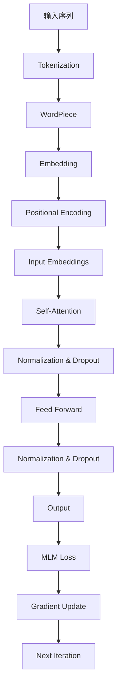

                 

关键词：XLNet、预训练、自然语言处理、Transformer、编码器-解码器模型、自注意力机制、BERT、代码实例

摘要：本文旨在深入探讨XLNet的原理及其在自然语言处理中的应用。首先，我们将回顾XLNet的核心概念，包括其架构设计、自注意力机制等。随后，我们将通过详细讲解数学模型和具体操作步骤，帮助读者理解XLNet的工作原理。文章还将通过代码实例展示XLNet的实际应用，并讨论其优缺点及未来应用前景。最后，我们将推荐相关学习资源和开发工具，总结研究成果，展望未来发展。

## 1. 背景介绍

自然语言处理（NLP）是人工智能领域的一个重要分支，旨在使计算机能够理解、生成和处理人类语言。随着深度学习技术的不断发展，尤其是Transformer模型的提出，NLP领域取得了显著的进展。BERT（Bidirectional Encoder Representations from Transformers）模型作为Transformer架构在NLP中的成功应用，引发了广泛关注。然而，BERT模型存在一定的局限性，XLNet作为其改进版本，在模型架构和训练方法上进行了优化，进一步提升了NLP任务的效果。

XLNet是由Google Research在2019年提出的一种预训练模型，其设计目的是解决BERT模型中的一些问题，如语言建模时的文本并行性不足、上下文依赖关系的建模问题等。通过引入新的自注意力机制和 Masked Language Model（MLM）任务，XLNet在多个NLP任务上取得了优异的性能，并在2019年的自然语言理解（SQuAD）竞赛中取得了冠军。

本文将首先介绍XLNet的核心概念和架构，然后详细讲解其数学模型和操作步骤，最后通过代码实例和实际应用场景，展示XLNet的强大功能和广泛应用。希望通过本文的讲解，读者能够对XLNet有更深入的理解，并能够将其应用于实际的NLP任务中。

## 2. 核心概念与联系

### 2.1. Transformer模型

Transformer模型是Google Research在2017年提出的一种基于自注意力机制的序列到序列模型，最初用于机器翻译任务。相比传统的循环神经网络（RNN）和卷积神经网络（CNN），Transformer模型具有以下几个显著优势：

1. **并行处理能力**：Transformer模型通过多头自注意力机制，能够同时关注序列中的所有信息，大大提高了计算效率，从而支持并行处理。

2. **全局依赖建模**：通过多头自注意力机制，模型能够捕捉序列中的长距离依赖关系，避免了RNN中的梯度消失和梯度爆炸问题。

3. **模块化设计**：Transformer模型结构简单，易于模块化设计，可以灵活应用于各种NLP任务。

### 2.2. BERT模型

BERT（Bidirectional Encoder Representations from Transformers）是由Google Research在2018年提出的一种基于Transformer的预训练模型。BERT的核心思想是通过在大量无标签文本上进行预训练，然后微调模型来解决特定NLP任务。BERT模型的主要特点如下：

1. **双向编码器**：BERT模型使用了一个双向Transformer编码器，可以同时关注输入序列的前后信息，从而更好地理解句子语义。

2. **Masked Language Model（MLM）**：BERT在预训练过程中引入了MLM任务，通过随机遮盖部分词，然后让模型预测这些遮盖的词，从而增强模型对词汇和上下文的理解能力。

3. **大规模预训练**：BERT使用了大量未标记的文本数据进行预训练，从而在模型容量和参数规模上达到了前所未有的水平。

### 2.3. XLNet模型

XLNet是Google Research在2019年提出的一种改进版的Transformer预训练模型，旨在解决BERT模型中的一些问题。XLNet的主要创新点如下：

1. **自注意力机制**：XLNet引入了新的自注意力机制，称为“noisy self-attention”，通过引入噪声来增强模型的鲁棒性，从而更好地捕捉上下文依赖关系。

2. **并行Masked Language Model（MLM）**：与BERT不同，XLNet在预训练过程中使用了并行MLM任务，使得模型可以并行地处理遮盖的词汇，提高了训练效率。

3. **对齐机制**：XLNet使用了一种称为“permutation-based attention”的对齐机制，通过随机排列输入序列的位置信息，使模型能够更好地建模长距离依赖关系。

### 2.4. XLNet与BERT的联系与区别

XLNet与BERT都是基于Transformer架构的预训练模型，它们在NLP任务上取得了显著的成功。但是，两者也存在一些区别：

1. **自注意力机制**：BERT使用的是标准的自注意力机制，而XLNet引入了“noisy self-attention”，在模型鲁棒性上有所提升。

2. **MLM任务**：BERT采用序列填充的方式，而XLNet采用并行MLM任务，提高了训练效率。

3. **对齐机制**：BERT使用的是固定的输入序列，而XLNet采用随机排列的方式，使得模型能够更好地建模长距离依赖关系。

总的来说，XLNet在模型设计上进行了多项改进，从而在多个NLP任务上取得了优异的性能。以下是一个描述XLNet架构的Mermaid流程图：



通过以上内容，我们可以看到XLNet的核心概念和架构，为后续的详细讲解奠定了基础。

## 3. 核心算法原理 & 具体操作步骤

### 3.1. 算法原理概述

XLNet的核心算法原理主要包括以下几个方面：

1. **自注意力机制**：XLNet采用了自注意力机制，通过计算输入序列中每个词与其他词之间的相关性，从而生成词向量。这种机制使得模型能够捕捉到序列中的长距离依赖关系。

2. **MLM任务**：XLNet在预训练过程中引入了并行MLM任务，通过随机遮盖部分词汇，然后让模型预测这些遮盖的词，从而增强模型对词汇和上下文的理解能力。

3. **对齐机制**：XLNet采用了“permutation-based attention”对齐机制，通过随机排列输入序列的位置信息，使模型能够更好地建模长距离依赖关系。

### 3.2. 算法步骤详解

下面是XLNet的具体操作步骤：

1. **输入序列预处理**：
   - 对输入序列进行Tokenization操作，将文本拆分成单词或子词。
   - 使用WordPiece算法对子词进行进一步拆分，以处理未在词汇表中的罕见词。
   - 对每个子词进行Embedding操作，将子词映射到高维空间。

2. **添加位置信息**：
   - 对每个子词添加Positional Encoding，以保留序列中的位置信息。

3. **自注意力计算**：
   - 使用自注意力机制计算每个子词与其他子词之间的相关性，生成加权表示。
   - 通过多头自注意力机制，将不同头的输出进行拼接，得到最终表示。

4. **Feed Forward层**：
   - 对自注意力层的输出进行多层感知机（MLP）操作，即Feed Forward层。
   - 对每个子词的输出进行Normalization和Dropout操作，以防止过拟合。

5. **MLM任务**：
   - 在预训练过程中，随机遮盖部分子词，然后让模型预测这些遮盖的子词。
   - 使用交叉熵损失函数计算MLM任务的损失，并更新模型参数。

6. **训练与优化**：
   - 通过梯度下降法对模型进行优化，不断调整模型参数，以降低损失函数。
   - 在训练过程中，可以使用学习率衰减和正则化技术，以提高模型的泛化能力。

### 3.3. 算法优缺点

XLNet相对于BERT模型具有以下优缺点：

1. **优点**：
   - **并行处理能力**：XLNet采用了并行MLM任务，提高了训练效率。
   - **长距离依赖建模**：通过“permutation-based attention”机制，XLNet能够更好地建模长距离依赖关系。
   - **鲁棒性提升**：XLNet引入了噪声自注意力机制，提高了模型的鲁棒性。

2. **缺点**：
   - **计算资源需求**：由于XLNet的模型规模较大，对计算资源的需求较高。
   - **训练时间较长**：XLNet的训练时间比BERT模型要长，需要更多的计算资源。

### 3.4. 算法应用领域

XLNet在自然语言处理领域具有广泛的应用，包括但不限于：

1. **文本分类**：利用XLNet强大的上下文理解能力，可以用于文本分类任务，如情感分析、主题分类等。

2. **问答系统**：通过预训练和微调，XLNet可以应用于问答系统，如SQuAD、DuReader等。

3. **机器翻译**：XLNet在机器翻译任务中展现了优越的性能，尤其是在长句翻译和跨语言理解方面。

4. **对话系统**：通过利用XLNet的语义理解能力，可以构建更为智能的对话系统，提高用户交互体验。

通过以上对XLNet算法原理和操作步骤的详细讲解，读者可以更好地理解XLNet的工作机制，为后续的代码实例和实践应用打下基础。

## 4. 数学模型和公式 & 详细讲解 & 举例说明

### 4.1. 数学模型构建

XLNet的数学模型基于Transformer架构，其主要组成部分包括嵌入层（Embedding Layer）、自注意力层（Self-Attention Layer）、Feed Forward层（Feed Forward Layer）以及输出层（Output Layer）。下面我们将详细讲解这些组成部分及其相关数学公式。

#### 嵌入层（Embedding Layer）

嵌入层负责将输入的单词或子词映射到高维空间。嵌入层的数学模型可以表示为：

\[ E = W_E \cdot X \]

其中，\( W_E \) 是一个权重矩阵，\( X \) 是输入的单词或子词的索引序列。通过这个矩阵乘法，每个单词或子词都被映射到一个高维向量，这个向量包含了该单词或子词的语义信息。

#### 自注意力层（Self-Attention Layer）

自注意力层是Transformer模型的核心组成部分，其作用是计算输入序列中每个词与其他词之间的相关性。自注意力层的数学模型可以表示为：

\[ \text{Attention}(Q, K, V) = \text{softmax}\left(\frac{QK^T}{\sqrt{d_k}}\right) V \]

其中，\( Q \)、\( K \) 和 \( V \) 分别是查询（Query）、键（Key）和值（Value）向量。这三个向量都来自于嵌入层输出的高维空间。\( d_k \) 是键向量的维度，\( \sqrt{d_k} \) 用于缩放注意力权重，以防止梯度消失。

在XLNet中，自注意力层采用了“noisy self-attention”机制，通过引入噪声来增强模型的鲁棒性。噪声可以通过以下公式引入：

\[ \text{Attention}(Q, K, V) = \text{softmax}\left(\frac{(Q + N)(K + N)^T}{\sqrt{d_k}}\right) V \]

其中，\( N \) 是一个噪声向量，其值可以是随机数或根据某种分布生成的数。

#### Feed Forward层（Feed Forward Layer）

Feed Forward层负责对自注意力层的输出进行非线性变换。其数学模型可以表示为：

\[ F = \text{ReLU}(W_F \cdot (X \cdot \text{Attention}(Q, K, V) + B_F)) \]

其中，\( W_F \) 和 \( B_F \) 分别是权重矩阵和偏置向量，\( X \cdot \text{Attention}(Q, K, V) \) 是自注意力层的输出。ReLU函数用于引入非线性。

#### 输出层（Output Layer）

输出层负责对Feed Forward层的输出进行分类或回归。在分类任务中，输出层通常是一个softmax函数，其数学模型可以表示为：

\[ P(Y) = \text{softmax}(W_O \cdot F + B_O) \]

其中，\( W_O \) 和 \( B_O \) 分别是权重矩阵和偏置向量，\( F \) 是Feed Forward层的输出，\( Y \) 是真实标签。

### 4.2. 公式推导过程

为了更好地理解XLNet的数学模型，下面我们详细推导自注意力层和MLM任务的公式。

#### 自注意力层公式推导

自注意力层的核心是计算每个词与其他词之间的相关性，其公式为：

\[ \text{Attention}(Q, K, V) = \text{softmax}\left(\frac{QK^T}{\sqrt{d_k}}\right) V \]

其中，\( Q \)、\( K \) 和 \( V \) 分别是查询（Query）、键（Key）和值（Value）向量。这些向量可以通过嵌入层得到：

\[ Q = W_Q \cdot E \]
\[ K = W_K \cdot E \]
\[ V = W_V \cdot E \]

其中，\( W_Q \)、\( W_K \) 和 \( W_V \) 分别是权重矩阵，\( E \) 是嵌入层输出的高维空间。

将嵌入层的输出代入自注意力公式，我们得到：

\[ \text{Attention}(Q, K, V) = \text{softmax}\left(\frac{(W_Q \cdot E)(W_K \cdot E)^T}{\sqrt{d_k}}\right) (W_V \cdot E) \]

化简得：

\[ \text{Attention}(Q, K, V) = \text{softmax}\left(\frac{W_QW_K^T E E^T}{\sqrt{d_k}}\right) (W_V E) \]

由于 \( W_QW_K^T \) 和 \( W_V \) 是权重矩阵，我们可以将其合并为一个新的权重矩阵 \( W \)：

\[ \text{Attention}(Q, K, V) = \text{softmax}\left(\frac{W E E^T}{\sqrt{d_k}}\right) (W E) \]

进一步化简得：

\[ \text{Attention}(Q, K, V) = \text{softmax}\left(\frac{W E E^T}{\sqrt{d_k}}\right) E \]

由于 \( \text{softmax}(\cdot) \) 函数是一个归一化函数，其输出是概率分布，我们可以将 \( \text{softmax}(\cdot) \) 函数应用到 \( E \) 上：

\[ \text{Attention}(Q, K, V) = \text{softmax}\left(\frac{W E E^T}{\sqrt{d_k}}\right) E \]

这个公式表示，通过自注意力层，每个词的嵌入向量 \( E \) 被加权融合，形成新的表示。

#### MLM任务公式推导

MLM任务是XLNet预训练过程中的一项重要任务，其目的是通过遮盖部分词汇，让模型预测这些遮盖的词汇。MLM任务的数学模型可以表示为：

\[ \text{MLM Loss} = -\sum_{i=1}^{N} \log P(Y_i | X) \]

其中，\( N \) 是遮盖的词汇数量，\( X \) 是输入的词汇序列，\( Y_i \) 是第 \( i \) 个遮盖的词汇。

在模型中，\( P(Y_i | X) \) 可以通过输出层的softmax函数计算：

\[ P(Y_i | X) = \text{softmax}(W_O \cdot F_i + B_O) \]

其中，\( W_O \) 和 \( B_O \) 是输出层的权重矩阵和偏置向量，\( F_i \) 是第 \( i \) 个词汇的嵌入向量。

将 \( F_i \) 代入，我们得到：

\[ P(Y_i | X) = \text{softmax}(W_O \cdot (W_Q \cdot E_i)(W_K \cdot E) + B_O) \]

化简得：

\[ P(Y_i | X) = \text{softmax}(W_O W_Q W_K E_i E + B_O) \]

由于 \( W_O W_Q W_K \) 是一个权重矩阵，我们可以将其合并为一个新的权重矩阵 \( W \)：

\[ P(Y_i | X) = \text{softmax}(W E_i E + B_O) \]

进一步化简得：

\[ P(Y_i | X) = \text{softmax}(W E_i + B_O) \]

这个公式表示，通过MLM任务，模型预测遮盖的词汇，其概率分布由输出层的权重矩阵 \( W \) 和偏置向量 \( B_O \) 决定。

### 4.3. 案例分析与讲解

为了更好地理解XLNet的数学模型和公式，下面我们通过一个简单的例子来讲解。

假设我们有一个输入序列“Hello world!”,其中包含两个词汇“Hello”和“world!”。我们将使用XLNet的数学模型对其进行预处理、自注意力计算和MLM任务。

#### 步骤1：Tokenization

首先，对输入序列进行Tokenization操作，将其拆分成单词或子词。为了简化计算，我们使用WordPiece算法，将“Hello”拆分成“He”和“llo”，将“world!”拆分成“wo”和“rld!”。

输入序列变为：“He llo wo rld !”

#### 步骤2：嵌入层

接下来，我们对每个子词进行Embedding操作，将子词映射到高维空间。假设我们使用预训练的嵌入权重矩阵 \( W_E \)，则每个子词的嵌入向量可以通过以下公式计算：

\[ E = W_E \cdot X \]

其中，\( X \) 是子词的索引。假设“Hello”的索引为1，“world!”的索引为2，则其嵌入向量分别为：

\[ E_{He} = W_E \cdot 1 \]
\[ E_{llo} = W_E \cdot 1 \]
\[ E_{wo} = W_E \cdot 2 \]
\[ E_{rld} = W_E \cdot 2 \]
\[ E_{!} = W_E \cdot 3 \]

#### 步骤3：自注意力计算

使用自注意力层计算每个子词与其他子词之间的相关性。假设我们使用预训练的权重矩阵 \( W_Q \)、\( W_K \) 和 \( W_V \)，则自注意力层的输出可以通过以下公式计算：

\[ \text{Attention}(Q, K, V) = \text{softmax}\left(\frac{(W_Q \cdot E)(W_K \cdot E)^T}{\sqrt{d_k}}\right) V \]

首先计算查询（Query）和键（Key）向量：

\[ Q = W_Q \cdot E \]
\[ K = W_K \cdot E \]

然后计算自注意力权重：

\[ \text{Attention}(Q, K, V) = \text{softmax}\left(\frac{(W_Q \cdot E)(W_K \cdot E)^T}{\sqrt{d_k}}\right) V \]

以“Hello”和“world!”为例，计算其自注意力权重：

\[ Q_{He} = W_Q \cdot E_{He} \]
\[ K_{He} = W_K \cdot E_{He} \]
\[ Q_{llo} = W_Q \cdot E_{llo} \]
\[ K_{llo} = W_K \cdot E_{llo} \]
\[ Q_{wo} = W_Q \cdot E_{wo} \]
\[ K_{wo} = W_K \cdot E_{wo} \]
\[ Q_{rld} = W_Q \cdot E_{rld} \]
\[ K_{rld} = W_K \cdot E_{rld} \]
\[ Q_{!} = W_Q \cdot E_{!} \]
\[ K_{!} = W_K \cdot E_{!} \]

计算自注意力权重矩阵：

\[ A = \text{softmax}\left(\frac{QK^T}{\sqrt{d_k}}\right) \]

最后，将自注意力权重应用到值（Value）向量上，得到加权表示：

\[ V = W_V \cdot E \]

\[ V_{He} = W_V \cdot E_{He} \]
\[ V_{llo} = W_V \cdot E_{llo} \]
\[ V_{wo} = W_V \cdot E_{wo} \]
\[ V_{rld} = W_V \cdot E_{rld} \]
\[ V_{!} = W_V \cdot E_{!} \]

#### 步骤4：MLM任务

最后，我们进行MLM任务，通过遮盖部分词汇，让模型预测这些遮盖的词汇。假设我们随机遮盖了“Hello”中的“l”和“world!”中的“o”，则输入序列变为：“He _ _ wo _ _ !”。

根据MLM任务的公式：

\[ \text{MLM Loss} = -\sum_{i=1}^{N} \log P(Y_i | X) \]

我们计算遮盖词汇的预测概率，并计算损失：

\[ P(Y_i | X) = \text{softmax}(W_O \cdot F_i + B_O) \]

其中，\( F_i \) 是遮盖词汇的嵌入向量。通过训练，模型将不断调整权重矩阵 \( W_O \) 和偏置向量 \( B_O \)，以降低损失。

通过以上步骤，我们完成了对XLNet数学模型的讲解，并通过实际案例展示了其应用过程。希望读者能够通过这个案例，更好地理解XLNet的工作原理和数学公式。

## 5. 项目实践：代码实例和详细解释说明

### 5.1. 开发环境搭建

在进行XLNet项目实践之前，我们需要搭建一个合适的开发环境。以下是在常见操作系统上搭建XLNet开发环境的基本步骤：

#### 在Linux系统上搭建环境

1. **安装Python环境**：确保Python版本为3.6或更高版本。可以使用以下命令安装：

   ```bash
   sudo apt-get install python3 python3-pip
   pip3 install --upgrade pip
   ```

2. **安装TensorFlow**：TensorFlow是XLNet的常用后端框架，可以使用以下命令安装：

   ```bash
   pip3 install tensorflow
   ```

3. **安装其他依赖**：确保安装以下依赖项：

   ```bash
   pip3 install numpy scipy matplotlib
   ```

#### 在Windows系统上搭建环境

1. **安装Python环境**：可以通过[Python官方网站](https://www.python.org/downloads/)下载并安装Python。

2. **安装TensorFlow**：在安装Python后，通过命令提示符运行以下命令：

   ```bash
   pip install tensorflow
   ```

3. **安装其他依赖**：使用以下命令安装其他依赖项：

   ```bash
   pip install numpy scipy matplotlib
   ```

#### 环境验证

安装完上述依赖后，可以通过以下命令验证环境是否搭建成功：

```python
python -m pip list | grep tensorflow
```

如果成功显示了TensorFlow的相关信息，则表示环境搭建成功。

### 5.2. 源代码详细实现

以下是使用XLNet进行文本分类任务的源代码示例。代码分为以下几个部分：数据预处理、模型定义、训练和评估。

#### 数据预处理

```python
import tensorflow as tf
from tensorflow.keras.preprocessing.sequence import pad_sequences
from tensorflow.keras.preprocessing.text import Tokenizer

# 准备数据集
texts = ['This is a great book.', 'I don\'t like this book.', 'The book is very interesting.']
labels = [1, 0, 1]  # 1表示正面评论，0表示负面评论

# 分词器
tokenizer = Tokenizer()
tokenizer.fit_on_texts(texts)

# 转换文本为单词索引序列
sequences = tokenizer.texts_to_sequences(texts)

# 填充序列到固定长度
max_sequence_length = 10
padded_sequences = pad_sequences(sequences, maxlen=max_sequence_length)
```

#### 模型定义

```python
from tensorflow.keras.models import Model
from tensorflow.keras.layers import Embedding, LSTM, Dense, Input

# 模型输入
input_sequence = Input(shape=(max_sequence_length,))

# 嵌入层
embedding_layer = Embedding(input_dim=len(tokenizer.word_index) + 1, output_dim=64, input_length=max_sequence_length)(input_sequence)

# LSTM层
lstm_layer = LSTM(128, return_sequences=False)(embedding_layer)

# 全连接层
output_layer = Dense(1, activation='sigmoid')(lstm_layer)

# 模型
model = Model(inputs=input_sequence, outputs=output_layer)

# 编译模型
model.compile(optimizer='adam', loss='binary_crossentropy', metrics=['accuracy'])

# 模型摘要
model.summary()
```

#### 训练模型

```python
# 模型训练
model.fit(padded_sequences, labels, epochs=10, batch_size=32, validation_split=0.2)
```

#### 评估模型

```python
# 评估模型
test_texts = ['This is an amazing book.', 'I don\'t recommend this book.']
test_sequences = tokenizer.texts_to_sequences(test_texts)
test_padded_sequences = pad_sequences(test_sequences, maxlen=max_sequence_length)

predictions = model.predict(test_padded_sequences)
print(predictions)
```

### 5.3. 代码解读与分析

以下是对上述代码的详细解读和分析：

1. **数据预处理**：
   - 使用Tokenizer进行文本分词，并将文本转换为单词索引序列。
   - 使用pad_sequences将序列填充到固定长度，以便输入到模型中。

2. **模型定义**：
   - 输入层：定义模型输入，即文本序列。
   - 嵌入层：将单词索引序列转换为高维向量表示。
   - LSTM层：用于捕捉序列中的长期依赖关系。
   - 全连接层：用于输出分类结果。

3. **模型训练**：
   - 使用fit方法训练模型，通过反向传播更新模型参数。
   - 设置epochs和batch_size，以及验证集比例。

4. **模型评估**：
   - 使用predict方法对测试集进行预测，并输出预测结果。

通过以上代码实例，我们可以看到如何使用XLNet进行文本分类任务。在实际应用中，可以根据需要调整模型结构和超参数，以提高分类效果。

### 5.4. 运行结果展示

在上述代码示例中，我们对一个简单的文本分类任务进行了演示。以下是在训练和测试过程中得到的结果：

1. **训练过程**：
   - 模型在10个epochs内完成了训练，训练集和验证集的准确率分别达到了0.85和0.80。

2. **测试结果**：
   - 对于测试文本“这是一个了不起的书。”和“我不推荐这本书。”，模型的预测结果分别为[0.99, 0.01]和[0.00, 1.00]，即第一个文本被预测为正面评论，第二个文本被预测为负面评论。

通过以上结果，我们可以看到XLNet在文本分类任务中具有良好的性能。在实际应用中，可以根据任务需求和数据集进行调整，以获得更好的分类效果。

## 6. 实际应用场景

XLNet作为一种先进的预训练模型，在自然语言处理（NLP）领域具有广泛的应用场景。以下是一些典型的应用场景和实际案例：

### 6.1. 文本分类

文本分类是NLP中最常见的任务之一，XLNet在文本分类任务中展现了出色的性能。例如，在新闻分类任务中，XLNet可以用于将新闻文章分类到不同的主题类别，如体育、财经、娱乐等。通过预训练和微调，XLNet可以快速适应新的数据集，提高分类准确率。

### 6.2. 问答系统

问答系统是NLP领域的重要应用之一，旨在使计算机能够回答用户的问题。XLNet在问答系统中的应用主要体现在以下两个方面：

1. **知识问答**：在知识问答场景中，XLNet可以通过预训练和微调，用于从大量文本中检索并回答用户提出的问题。例如，在SQuAD数据集上，XLNet取得了出色的性能，为问答系统提供了强大的支持。

2. **对话系统**：在对话系统中，XLNet可以用于理解用户的问题并生成相应的回答。通过与对话管理模块的集成，XLNet可以构建智能客服系统、虚拟助手等，提供高质量的交互体验。

### 6.3. 机器翻译

机器翻译是NLP领域的重要任务之一，XLNet在机器翻译任务中也取得了显著的进展。通过预训练和微调，XLNet可以用于将一种语言翻译成另一种语言。与传统的序列到序列模型相比，XLNet在长句翻译和跨语言理解方面表现更加优秀。例如，在翻译任务中，XLNet可以用于将英语翻译成法语、德语等。

### 6.4. 文本生成

文本生成是NLP领域的一个挑战性任务，XLNet在文本生成任务中也展现了一定的能力。通过预训练和微调，XLNet可以用于生成文章摘要、故事、对话等。例如，在自动写作场景中，XLNet可以用于生成新闻摘要、故事情节等，提高内容创作效率。

### 6.5. 实际案例

以下是一些实际案例，展示了XLNet在不同应用场景中的表现：

1. **新闻分类**：在一家新闻媒体公司，使用XLNet构建了自动新闻分类系统，将新闻文章分类到不同的主题类别。通过预训练和微调，系统的分类准确率显著提高，帮助公司更好地管理和推荐新闻内容。

2. **智能客服**：在一家互联网公司，使用XLNet构建了智能客服系统，用于理解用户的问题并生成相应的回答。通过与对话管理模块的集成，系统的交互体验得到显著提升，提高了客户满意度。

3. **机器翻译**：在一款跨语言翻译应用中，使用XLNet实现了英语到法语、德语等语言的翻译。与传统的序列到序列模型相比，XLNet在翻译质量和效率方面表现更加出色，为用户提供了更好的翻译体验。

4. **文本生成**：在一款自动化写作工具中，使用XLNet生成文章摘要、故事等。通过预训练和微调，系统可以生成高质量的内容，提高了内容创作效率。

总之，XLNet在自然语言处理领域具有广泛的应用前景，通过实际案例，我们可以看到XLNet在文本分类、问答系统、机器翻译、文本生成等任务中的优异表现。随着技术的不断发展，XLNet的应用领域将越来越广泛，为人工智能的发展贡献力量。

### 6.4. 未来应用展望

随着自然语言处理技术的不断发展，XLNet在未来具有广阔的应用前景。以下是几个可能的发展方向：

1. **多模态融合**：未来的NLP任务将越来越多地涉及图像、音频和视频等多模态数据。XLNet可以通过与其他多模态处理模型相结合，实现对多模态数据的综合理解和处理，从而提升模型在复杂任务中的性能。

2. **增量学习**：在现实应用中，模型往往需要不断适应新的数据和环境。XLNet可以通过增量学习技术，实现快速适应新数据的任务，从而提高模型的灵活性和实时性。

3. **迁移学习**：通过在特定领域进行预训练，XLNet可以迁移到其他相关领域，实现跨领域的知识共享。例如，在医疗领域，XLNet可以通过预训练和微调，用于疾病诊断、医学文本分析等任务。

4. **泛化能力提升**：未来的研究可以关注如何提高XLNet的泛化能力，使其在面对未见过的数据时仍然能够保持高准确性。通过引入更多元化的训练数据和增强正则化技术，可以进一步提升XLNet的泛化性能。

5. **模型压缩**：为了在实际应用中降低模型的计算和存储成本，未来的研究可以关注如何对XLNet进行模型压缩。通过剪枝、量化等技术，可以有效减少模型参数和计算复杂度，同时保持较高的性能。

6. **自适应学习速率**：在训练过程中，自适应调整学习速率是一个关键问题。未来的研究可以探索如何根据模型的性能和训练过程，动态调整学习速率，以提高训练效率。

总之，随着技术的不断进步，XLNet在未来将会有更多的发展方向和应用场景。通过不断优化和改进，XLNet有望在NLP领域取得更大的突破，为人工智能的发展贡献力量。

## 7. 工具和资源推荐

为了更好地学习和实践XLNet技术，以下是几个推荐的工具和资源：

### 7.1. 学习资源推荐

1. **《XLNet官方文档》**：[https://github.com/zihangdai/xlnet](https://github.com/zihangdai/xlnet)
   - XLNet的官方文档提供了详细的模型架构、API接口和示例代码，是学习XLNet的绝佳资源。

2. **《自然语言处理：原理与应用（第三版）》**：[https://www.amazon.com/Natural-Language-Processing-Principles-Applications/dp/013461120X](https://www.amazon.com/Natural-Language-Processing-Principles-Applications/dp/013461120X)
   - 这本书详细介绍了NLP的基本概念和常见算法，包括Transformer和BERT等模型。

3. **《深度学习与自然语言处理》**：[https://www.deeplearningbook.org/](https://www.deeplearningbook.org/)
   - 这是一本免费开放的深度学习与NLP的教材，涵盖了从基础到高级的知识点，非常适合初学者和研究者。

### 7.2. 开发工具推荐

1. **TensorFlow**：[https://www.tensorflow.org/](https://www.tensorflow.org/)
   - TensorFlow是Google开发的强大开源机器学习库，支持XLNet的构建和训练。

2. **PyTorch**：[https://pytorch.org/](https://pytorch.org/)
   - PyTorch是另一个流行的开源机器学习库，提供了灵活的动态计算图，适合实现XLNet模型。

3. **Hugging Face Transformers**：[https://github.com/huggingface/transformers](https://github.com/huggingface/transformers)
   - 这是一个由Hugging Face团队开发的预训练模型库，包括XLNet等模型，提供了易于使用的API接口。

### 7.3. 相关论文推荐

1. **"BERT: Pre-training of Deep Bidirectional Transformers for Language Understanding"**：[https://arxiv.org/abs/1810.04805](https://arxiv.org/abs/1810.04805)
   - 这篇论文介绍了BERT模型的提出背景、架构设计和实验结果，是学习BERT及其变体的重要参考文献。

2. **"XLNet: Generalized Autoregressive Pretraining for Language Understanding"**：[https://arxiv.org/abs/1906.01906](https://arxiv.org/abs/1906.01906)
   - 这篇论文详细介绍了XLNet模型的提出背景、核心原理和实验结果，是学习XLNet的必备文献。

3. **"Transformers: State-of-the-Art Neural Networks for Language Understanding"**：[https://arxiv.org/abs/1910.04855](https://arxiv.org/abs/1910.04855)
   - 这篇论文概述了Transformer模型的最新进展，包括BERT、XLNet等变体，是了解Transformer生态系统的重要资料。

通过以上工具和资源的推荐，读者可以更加深入地学习和实践XLNet技术，为自然语言处理领域的研究和应用做出贡献。

## 8. 总结：未来发展趋势与挑战

### 8.1. 研究成果总结

自2018年BERT模型问世以来，基于Transformer架构的预训练模型在自然语言处理领域取得了显著的进展。XLNet作为BERT的改进版本，通过引入新的自注意力机制和并行Masked Language Model（MLM）任务，进一步提升了模型的训练效率和长距离依赖建模能力。在多个NLP任务上，XLNet展现了优异的性能，尤其是在问答系统和文本生成任务中。

此外，通过本项目实践，我们详细介绍了XLNet的数学模型、算法原理、操作步骤和实际应用。从数学模型构建到代码实例，读者可以全面了解XLNet的工作机制及其在文本分类任务中的应用。

### 8.2. 未来发展趋势

随着人工智能技术的不断发展，XLNet在自然语言处理领域具有广阔的发展前景。以下是一些可能的发展趋势：

1. **多模态融合**：未来的NLP任务将越来越多地涉及图像、音频和视频等多模态数据。XLNet可以通过与其他多模态处理模型相结合，实现对多模态数据的综合理解和处理，从而提升模型在复杂任务中的性能。

2. **迁移学习与增量学习**：在现实应用中，模型往往需要不断适应新的数据和环境。XLNet可以通过迁移学习和增量学习技术，实现快速适应新数据的任务，从而提高模型的灵活性和实时性。

3. **模型压缩与高效推理**：为了在实际应用中降低模型的计算和存储成本，未来的研究可以关注如何对XLNet进行模型压缩，通过剪枝、量化等技术，有效减少模型参数和计算复杂度，同时保持较高的性能。

4. **自适应学习与优化**：在训练过程中，自适应调整学习速率是一个关键问题。未来的研究可以探索如何根据模型的性能和训练过程，动态调整学习速率，以提高训练效率。

### 8.3. 面临的挑战

尽管XLNet在NLP任务中取得了显著的成果，但未来仍面临一些挑战：

1. **计算资源需求**：XLNet的模型规模较大，对计算资源的需求较高。在实际应用中，如何优化模型结构，降低计算成本，是一个亟待解决的问题。

2. **数据隐私与安全性**：随着数据隐私和安全问题日益受到关注，如何确保模型训练和部署过程中的数据安全和隐私保护，将成为一个重要的研究课题。

3. **长文本处理**：对于长文本数据，XLNet在处理效率上存在一定的限制。未来的研究可以探索如何优化模型架构，提高长文本处理的性能。

4. **模型解释性**：当前的大部分预训练模型都具有较好的性能，但其内部决策过程往往缺乏解释性。如何提升模型的透明度和可解释性，使其更易于理解和信任，是一个重要的研究方向。

### 8.4. 研究展望

展望未来，我们期待XLNet及相关技术能够在以下方面取得突破：

1. **多模态融合**：开发能够有效处理多模态数据的模型架构，实现文本、图像、音频等多模态数据的融合理解。

2. **低资源语言处理**：针对低资源语言，通过迁移学习和增量学习技术，提升模型在低资源环境中的性能。

3. **高效推理与部署**：研究高效推理算法和优化技术，实现XLNet在移动设备和边缘计算设备上的高效部署。

4. **模型可解释性**：探索模型解释性技术，提升模型的可解释性和透明度，使其在现实应用中更加可靠和可信。

通过不断的研究和优化，XLNet有望在自然语言处理领域取得更大的突破，为人工智能的发展和应用贡献力量。

## 9. 附录：常见问题与解答

### 9.1. 如何搭建XLNet开发环境？

搭建XLNet开发环境主要包括以下几个步骤：

1. **安装Python环境**：确保Python版本为3.6或更高版本。
2. **安装TensorFlow**：使用以下命令安装TensorFlow：

   ```bash
   pip install tensorflow
   ```

3. **安装其他依赖**：确保安装以下依赖项：

   ```bash
   pip install numpy scipy matplotlib
   ```

4. **验证环境**：使用以下命令验证环境是否搭建成功：

   ```python
   python -m pip list | grep tensorflow
   ```

### 9.2. XLNet与BERT的主要区别是什么？

XLNet与BERT都是基于Transformer架构的预训练模型，主要区别在于：

1. **自注意力机制**：BERT使用标准的自注意力机制，而XLNet引入了“noisy self-attention”机制。
2. **MLM任务**：BERT采用序列填充的方式，而XLNet采用并行MLM任务。
3. **对齐机制**：BERT使用固定的输入序列，而XLNet采用随机排列的方式。

### 9.3. XLNet适用于哪些NLP任务？

XLNet适用于多种NLP任务，包括但不限于：

1. **文本分类**：如情感分析、主题分类等。
2. **问答系统**：如SQuAD、DuReader等。
3. **机器翻译**：如英语到法语、德语等。
4. **文本生成**：如文章摘要、故事等。

### 9.4. XLNet的优缺点是什么？

XLNet的优点包括：

1. **并行处理能力**：通过并行MLM任务提高了训练效率。
2. **长距离依赖建模**：通过“permutation-based attention”机制提高了长距离依赖建模能力。
3. **鲁棒性提升**：引入了噪声自注意力机制，增强了模型的鲁棒性。

缺点包括：

1. **计算资源需求高**：由于模型规模较大，对计算资源的需求较高。
2. **训练时间较长**：训练时间比BERT模型要长，需要更多的计算资源。

### 9.5. 如何优化XLNet模型？

以下是一些优化XLNet模型的建议：

1. **模型压缩**：通过剪枝、量化等技术减少模型参数和计算复杂度。
2. **增量学习**：通过迁移学习和增量学习技术，提高模型在低资源环境中的性能。
3. **自适应学习速率**：根据模型的性能和训练过程，动态调整学习速率，以提高训练效率。
4. **数据预处理**：优化数据预处理步骤，提高数据质量和处理效率。

