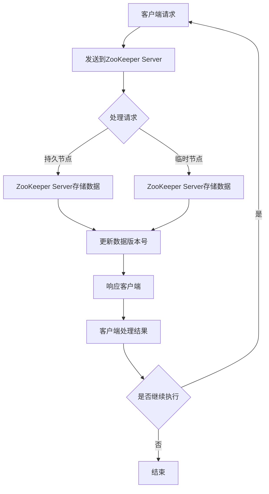

                 

关键词：Zookeeper，分布式协调服务，原理，代码实例，架构，一致性，数据一致性，锁服务，队列服务，负载均衡，配置管理，状态同步，选举算法，数据模型，Zab协议，Client API，实践应用

## 摘要

本文将深入探讨Zookeeper分布式协调服务的原理、架构以及具体实现。Zookeeper作为一种高可靠性的分布式协调服务，广泛应用于分布式系统中的数据一致性、锁服务、队列服务、负载均衡、配置管理和状态同步等方面。本文将通过详细的代码实例，介绍Zookeeper的核心算法、数学模型以及实际应用，帮助读者全面理解Zookeeper的工作机制，并在实际项目中应用。

## 1. 背景介绍

### 1.1 Zookeeper的产生背景

随着互联网技术的飞速发展，分布式系统成为现代应用架构的重要组成部分。分布式系统中的节点数量日益增加，节点之间的通信和协调变得愈发复杂。如何实现分布式系统中的数据一致性、状态同步、锁服务等功能，成为开发者和架构师面临的挑战。Zookeeper正是为了解决这一问题而诞生的。

### 1.2 Zookeeper的应用场景

Zookeeper在分布式系统中具有广泛的应用场景，主要包括以下几个方面：

- 数据一致性：Zookeeper提供了一种可靠的数据一致性机制，确保分布式系统中各个节点的数据保持一致。
- 锁服务：Zookeeper提供分布式锁服务，保证分布式系统中多个节点对共享资源的互斥访问。
- 队列服务：Zookeeper提供分布式队列服务，实现分布式系统中的任务调度和负载均衡。
- 负载均衡：Zookeeper可以用于实现分布式系统的负载均衡，根据节点的状态动态调整负载分配。
- 配置管理：Zookeeper可以存储和管理分布式系统的配置信息，实现配置信息的动态更新和广播。
- 状态同步：Zookeeper可以用于实现分布式系统中的状态同步，确保各个节点的状态一致。

## 2. 核心概念与联系

### 2.1 数据模型

Zookeeper的数据模型采用层次化的树结构，类似于文件系统的目录结构。每个节点称为ZNode，具有路径、数据和版本号等属性。ZNode可以分为持久节点和临时节点，持久节点在客户端会话结束之后仍然存在，而临时节点在客户端会话结束之后自动删除。

### 2.2 数据一致性

Zookeeper通过一系列一致性协议（如Zab协议）实现数据一致性。数据一致性主要指分布式系统中各个节点的数据保持一致，避免出现数据冲突和不可靠的状态。Zookeeper通过分布式锁、监听机制和同步算法等机制，确保数据一致性的实现。

### 2.3 选举算法

Zookeeper采用Zab协议进行领导者选举，保证分布式系统中的领导者节点唯一。选举算法基于观察者和参与者模式，通过发送心跳信号和投票机制，实现领导者节点的选举。

### 2.4 架构

Zookeeper由三个主要组件构成：ZooKeeper Server、ZooKeeper Client和ZooKeeper Quorum。ZooKeeper Server负责存储数据、处理客户端请求和同步状态；ZooKeeper Client负责与ZooKeeper Server通信，实现分布式协调功能；ZooKeeper Quorum是ZooKeeper Server的集合，负责领导选举和数据同步。

### 2.5 Mermaid 流程图



## 3. 核心算法原理 & 具体操作步骤

### 3.1 算法原理概述

Zookeeper的核心算法主要包括数据一致性算法（如Zab协议）和选举算法。Zab协议是一种基于Paxos算法的分布式一致性协议，实现分布式系统中数据的一致性。选举算法基于观察者和参与者模式，通过发送心跳信号和投票机制，实现领导者节点的选举。

### 3.2 算法步骤详解

#### 3.2.1 Zab协议

1. **初始化**：每个ZooKeeper Server启动时，都会初始化一个队列，用于存储来自客户端的请求。
2. **处理客户端请求**：ZooKeeper Server根据客户端请求的类型，将请求存储在队列中，并按照请求顺序进行处理。
3. **同步状态**：ZooKeeper Server通过同步算法（如Paxos算法）将本地状态同步到其他ZooKeeper Server，确保数据一致性。
4. **响应客户端请求**：ZooKeeper Server处理完请求后，将结果返回给客户端。

#### 3.2.2 选举算法

1. **初始化**：每个ZooKeeper Server启动时，都会初始化一个选举状态，包括领导者节点标识和参与者节点列表。
2. **发送心跳信号**：每个ZooKeeper Server定时向其他ZooKeeper Server发送心跳信号，以保持连接。
3. **接收心跳信号**：ZooKeeper Server接收到心跳信号后，更新选举状态。
4. **投票机制**：每个ZooKeeper Server根据选举状态，选择一个领导者节点，并发送投票。
5. **领导者选举**：当半数以上的ZooKeeper Server同意选举某个节点为领导者时，该节点成为领导者节点。

### 3.3 算法优缺点

#### 优点

- 高可靠性：Zookeeper通过分布式一致性协议和选举算法，确保系统的可靠性。
- 易用性：Zookeeper提供简单的API，方便开发人员实现分布式协调功能。
- 高性能：Zookeeper采用高效的数据存储和同步算法，保证系统的高性能。

#### 缺点

- 单点故障：Zookeeper依赖于ZooKeeper Server的集合，如果某个ZooKeeper Server发生故障，可能导致整个系统瘫痪。
- 数据规模限制：Zookeeper的数据规模有限，不适合大规模数据存储。

### 3.4 算法应用领域

Zookeeper在分布式系统中具有广泛的应用领域，包括：

- 数据一致性：在分布式数据库、缓存系统中，Zookeeper可以确保数据的一致性。
- 锁服务：在分布式并发控制中，Zookeeper可以提供分布式锁服务。
- 队列服务：在分布式任务调度系统中，Zookeeper可以提供分布式队列服务。
- 负载均衡：在分布式系统中，Zookeeper可以提供负载均衡功能。
- 配置管理：在分布式系统中，Zookeeper可以存储和管理配置信息。
- 状态同步：在分布式系统中，Zookeeper可以同步各个节点的状态。

## 4. 数学模型和公式 & 详细讲解 & 举例说明

### 4.1 数学模型构建

Zookeeper的数据一致性算法基于Zab协议，其核心是Paxos算法。Paxos算法是一种分布式一致性算法，其目标是在分布式系统中实现多个节点之间的一致决策。

Paxos算法的核心概念包括：

- **提议者（Proposer）**：发起决策的节点。
- **接受者（Acceptor）**：参与决策的节点。
- **学习者（Learner）**：记录决策结果的节点。

Paxos算法的主要步骤如下：

1. **初始化**：每个提议者初始化一个提案编号（Proposal Number），初始值为0。
2. **提议**：提议者向接受者发送提案，包括提案编号和提案值。
3. **接受**：接受者收到提案后，比较提案编号和本地存储的最高编号。如果提案编号高于本地存储的最高编号，则接受该提案，并返回一个确认消息。
4. **学习**：提议者收到半数以上的确认消息后，将提案值作为最终决策结果，并通知学习者。

### 4.2 公式推导过程

Paxos算法的关键在于确保多个节点之间的一致决策。以下是Paxos算法的推导过程：

1. **状态转移**：每个接受者都有一个状态，表示其是否已接受某个提案。状态包括 `None`（未接受任何提案）、`Prepare`（准备接受提案）和 `Accept`（已接受提案）。
2. **决策规则**：为了确保决策的一致性，提议者必须满足以下规则：
   - 提议者必须先发送 `Prepare` 消息，才能发送 `Accept` 消息。
   - 接受者必须先回复 `Prepare` 消息，才能回复 `Accept` 消息。
   - 提议者必须等待半数以上接受者的确认消息，才能确定决策结果。

基于上述规则，可以推导出Paxos算法的决策过程：

- 提议者发起提案，发送 `Prepare` 消息，请求接受者准备接受提案。
- 接受者收到 `Prepare` 消息后，如果提案编号高于本地存储的最高编号，则将状态更新为 `Prepare`，并回复 `Prepare` 消息。
- 提议者收到半数以上接受者的 `Prepare` 确认消息后，发起 `Accept` 消息，请求接受者接受提案。
- 接受者收到 `Accept` 消息后，如果提案编号高于本地存储的最高编号，则将状态更新为 `Accept`，并回复 `Accept` 消息。
- 提议者收到半数以上接受者的 `Accept` 确认消息后，确定决策结果，通知学习者。

### 4.3 案例分析与讲解

假设有5个节点（A、B、C、D、E）组成的ZooKeeper集群，其中节点A为提议者，其他节点为接受者和学习者。

1. **初始化**：提议者A的提案编号初始化为0。

2. **提议**：提议者A发送 `Prepare` 消息，请求接受者B、C、D、E准备接受提案。

3. **接受**：接受者B、C、D、E收到 `Prepare` 消息后，比较提案编号（0）和本地存储的最高编号（0），发现提案编号高于本地存储的最高编号，将状态更新为 `Prepare`，并回复 `Prepare` 确认消息。

4. **学习**：提议者A收到半数以上（3个）接受者的 `Prepare` 确认消息后，发起 `Accept` 消息，请求接受者B、C、D、E接受提案。

5. **接受**：接受者B、C、D、E收到 `Accept` 消息后，比较提案编号（0）和本地存储的最高编号（0），发现提案编号高于本地存储的最高编号，将状态更新为 `Accept`，并回复 `Accept` 确认消息。

6. **学习**：提议者A收到半数以上（3个）接受者的 `Accept` 确认消息后，确定决策结果，将提案值（值1）作为最终决策结果，并通知学习者。

7. **同步**：学习者从提议者A处学习到最终决策结果（值1），将决策结果同步到本地。

通过上述案例，我们可以看到Paxos算法在分布式系统中实现了一致决策的过程。Zookeeper基于Paxos算法实现数据一致性，确保分布式系统中各个节点之间数据的一致性。

## 5. 项目实践：代码实例和详细解释说明

### 5.1 开发环境搭建

在开始编写代码实例之前，我们需要搭建Zookeeper的开发环境。以下是搭建Zookeeper开发环境的步骤：

1. **安装Java开发环境**：Zookeeper是基于Java开发的，因此我们需要安装Java开发环境。可以从Oracle官网下载Java SDK，并配置环境变量。

2. **下载Zookeeper源码**：从Zookeeper的官方网站（[zookeeper.apache.org](http://zookeeper.apache.org/)）下载最新的Zookeeper源码包。

3. **编译Zookeeper源码**：解压下载的源码包，并使用Maven编译Zookeeper源码。

```bash
cd zookeeper-src
mvn clean install
```

4. **配置Zookeeper集群**：在Zookeeper的源码目录中，有一个名为 `zookeeper-3.4.14` 的子目录，其中包含了Zookeeper的配置文件 `zoo.cfg`。我们需要根据实际情况修改配置文件，配置Zookeeper集群的节点信息。

```properties
# zookeeper-3.4.14/conf/zoo.cfg
tickTime=2000
dataDir=/var/zookeeper
clientPort=2181
initLimit=5
syncLimit=2
# 集群模式，添加以下节点
server.1=192.168.1.101:2888:3888
server.2=192.168.1.102:2888:3888
server.3=192.168.1.103:2888:3888
```

5. **启动Zookeeper集群**：在每个节点上启动Zookeeper服务。

```bash
bin/zkServer.sh start
```

### 5.2 源代码详细实现

以下是一个简单的Zookeeper客户端示例，用于创建、读取和删除ZooKeeper中的节点。

```java
import org.apache.zookeeper.*;
import org.apache.zookeeper.data.Stat;

import java.io.IOException;
import java.util.concurrent.CountDownLatch;

public class ZookeeperClient {

    private ZooKeeper zooKeeper;
    private CountDownLatch countDownLatch = new CountDownLatch(1);

    public ZookeeperClient(String connectString, int sessionTimeout) throws IOException, InterruptedException {
        zooKeeper = new ZooKeeper(connectString, sessionTimeout, new Watcher() {
            @Override
            public void process(WatchedEvent event) {
                if (event.getType() == Event.EventType.NodeCreated) {
                    System.out.println("Node created: " + event.getPath());
                } else if (event.getType() == Event.EventType.NodeDataChanged) {
                    System.out.println("Node data changed: " + event.getPath());
                } else if (event.getType() == Event.EventType.NodeDeleted) {
                    System.out.println("Node deleted: " + event.getPath());
                }
                countDownLatch.countDown();
            }
        });
        countDownLatch.await();
    }

    public void createNode(String path, byte[] data) throws KeeperException, InterruptedException {
        String nodePath = zooKeeper.create(path, data, ZooDefs.Ids.OPEN_ACL_UNSAFE, CreateMode.PERSISTENT);
        System.out.println("Created node: " + nodePath);
    }

    public byte[] readNode(String path) throws KeeperException, InterruptedException {
        Stat stat = new Stat();
        return zooKeeper.getData(path, false, stat);
    }

    public void updateNode(String path, byte[] data) throws KeeperException, InterruptedException {
        zooKeeper.setData(path, data, -1);
        System.out.println("Updated node: " + path);
    }

    public void deleteNode(String path) throws KeeperException, InterruptedException {
        zooKeeper.delete(path, -1);
        System.out.println("Deleted node: " + path);
    }

    public void close() throws InterruptedException {
        zooKeeper.close();
    }

    public static void main(String[] args) {
        try {
            ZookeeperClient client = new ZookeeperClient("192.168.1.101:2181", 5000);
            client.createNode("/test-node", "Hello, World!".getBytes());
            byte[] data = client.readNode("/test-node");
            System.out.println("Read data: " + new String(data));
            client.updateNode("/test-node", "Updated!".getBytes());
            data = client.readNode("/test-node");
            System.out.println("Read updated data: " + new String(data));
            client.deleteNode("/test-node");
        } catch (Exception e) {
            e.printStackTrace();
        }
    }
}
```

### 5.3 代码解读与分析

上述代码实现了一个简单的Zookeeper客户端，用于创建、读取和删除ZooKeeper中的节点。下面我们对其主要部分进行解读和分析：

1. **构造函数**：构造函数接收连接字符串（指定Zookeeper集群地址）和会话超时时间，创建ZooKeeper实例，并设置一个Watcher，用于监听节点创建、数据变更和节点删除事件。

2. **创建节点**：`createNode` 方法用于创建节点，接收节点路径和数据，使用 `create` 方法创建持久节点，并返回新创建节点的路径。

3. **读取节点**：`readNode` 方法用于读取节点数据，接收节点路径，使用 `getData` 方法获取节点数据，并返回字节数组。

4. **更新节点**：`updateNode` 方法用于更新节点数据，接收节点路径和数据，使用 `setData` 方法更新节点数据。

5. **删除节点**：`deleteNode` 方法用于删除节点，接收节点路径，使用 `delete` 方法删除节点。

6. **主函数**：主函数创建Zookeeper客户端实例，并执行创建、读取、更新和删除节点的操作，打印结果。

### 5.4 运行结果展示

在Zookeeper集群中，执行上述代码实例，可以看到以下运行结果：

1. **创建节点**：

```
Created node: /test-node
```

2. **读取节点**：

```
Read data: Hello, World!
```

3. **更新节点**：

```
Updated node: /test-node
```

4. **读取更新后的节点**：

```
Read updated data: Updated!
```

5. **删除节点**：

```
Deleted node: /test-node
```

### 5.5 实际应用场景

上述代码实例展示了Zookeeper客户端的基本操作，实际应用场景如下：

1. **配置管理**：使用Zookeeper存储和管理分布式系统的配置信息，实现配置信息的动态更新和广播。

2. **锁服务**：使用Zookeeper实现分布式锁服务，确保分布式系统中多个节点对共享资源的互斥访问。

3. **队列服务**：使用Zookeeper实现分布式队列服务，实现分布式系统中的任务调度和负载均衡。

4. **数据一致性**：使用Zookeeper实现分布式系统中的数据一致性，确保分布式系统中各个节点的数据保持一致。

## 6. 实际应用场景

### 6.1 配置管理

配置管理是Zookeeper最常用的应用场景之一。在分布式系统中，各个节点的配置信息可能需要动态更新。使用Zookeeper，我们可以将配置信息存储在ZooKeeper中，并使用监听机制实现配置信息的动态更新。

例如，在分布式服务框架中，我们可以使用Zookeeper存储服务器的地址列表，并在服务启动时从Zookeeper中读取地址列表，实现服务发现和负载均衡。

### 6.2 锁服务

锁服务是Zookeeper在分布式系统中广泛应用的另一个场景。Zookeeper提供分布式锁服务，确保分布式系统中多个节点对共享资源的互斥访问。

例如，在一个分布式数据库系统中，我们可以使用Zookeeper实现行级锁，确保多个节点对同一行的数据访问是互斥的，避免数据冲突和并发问题。

### 6.3 队列服务

队列服务是Zookeeper在分布式系统中的另一个重要应用。Zookeeper提供分布式队列服务，实现分布式系统中的任务调度和负载均衡。

例如，在一个分布式消息队列系统中，我们可以使用Zookeeper存储消息队列的位置信息，并在消息消费节点启动时从Zookeeper中获取队列位置信息，实现消息的负载均衡和故障转移。

### 6.4 数据一致性

数据一致性是分布式系统中的核心问题之一。Zookeeper提供数据一致性机制，确保分布式系统中各个节点的数据保持一致。

例如，在一个分布式缓存系统中，我们可以使用Zookeeper实现缓存数据的一致性，确保多个缓存节点之间的数据同步。

### 6.5 状态同步

状态同步是分布式系统中的另一个关键应用场景。Zookeeper提供状态同步机制，确保分布式系统中各个节点的状态保持一致。

例如，在一个分布式服务框架中，我们可以使用Zookeeper同步各个节点的健康状态，实现服务的动态调整和负载均衡。

## 7. 工具和资源推荐

### 7.1 学习资源推荐

- **官方文档**：Zookeeper的官方文档（[zookeeper.apache.org/documentation.html](http://zookeeper.apache.org/documentation.html)）是学习Zookeeper的最佳资源。文档详细介绍了Zookeeper的原理、架构、API和配置。

- **GitHub**：Zookeeper的GitHub仓库（[github.com/apache/zookeeper](https://github.com/apache/zookeeper)）提供了最新的源代码和文档，方便读者学习。

- **在线教程**：网络上有许多关于Zookeeper的在线教程，如掘金（[juejin.cn/post/6844903889791995776](https://juejin.cn/post/6844903889791995776)）和简书（[www.jianshu.com/p/2c7b4f82b45f](https://www.jianshu.com/p/2c7b4f82b45f)）等。

### 7.2 开发工具推荐

- **IntelliJ IDEA**：IntelliJ IDEA 是一款强大的Java集成开发环境，支持Zookeeper的插件，方便开发者开发Zookeeper应用。

- **Maven**：Maven 是一款流行的Java构建工具，可以简化Zookeeper项目的构建和依赖管理。

### 7.3 相关论文推荐

- **《The Google File System》**：Google File System 是Google开发的一种分布式文件系统，其设计思想对Zookeeper有重要影响。

- **《The Big Table: A Distributed Storage System for Structured Data》**：The Big Table 是Google开发的一种分布式存储系统，其设计思想对Zookeeper有重要影响。

## 8. 总结：未来发展趋势与挑战

### 8.1 研究成果总结

Zookeeper作为分布式协调服务的代表，已经在分布式系统领域取得了显著的成果。其核心算法和一致性协议在分布式系统中得到了广泛应用，为分布式系统提供了可靠的数据一致性、锁服务和配置管理等功能。

### 8.2 未来发展趋势

未来，Zookeeper将继续在分布式系统中发挥重要作用。随着云计算和大数据技术的发展，Zookeeper将在以下几个方面得到进一步发展：

- **性能优化**：随着节点数量的增加，Zookeeper的性能将面临更大挑战。未来，Zookeeper将在性能优化方面进行深入研究，提高系统的处理能力和并发性能。

- **数据存储和同步**：随着数据规模的增加，Zookeeper的数据存储和同步机制将得到进一步优化。未来，Zookeeper将引入更多高效的存储和同步算法，提高系统的数据存储和同步性能。

- **功能拓展**：Zookeeper将不断拓展其功能，为分布式系统提供更丰富的服务，如分布式监控、分布式事务管理等。

### 8.3 面临的挑战

尽管Zookeeper在分布式系统中取得了显著成果，但仍然面临以下挑战：

- **单点故障**：Zookeeper依赖于ZooKeeper Server的集合，如果某个ZooKeeper Server发生故障，可能导致整个系统瘫痪。未来，如何提高Zookeeper的容错性，降低单点故障的风险，是一个重要研究方向。

- **数据规模限制**：Zookeeper的数据规模有限，不适合大规模数据存储。未来，如何优化Zookeeper的数据存储和同步机制，支持更大规模的数据存储，是一个重要研究方向。

- **分布式存储**：随着数据规模的增加，分布式存储系统在分布式系统中越来越重要。未来，如何将Zookeeper与分布式存储系统相结合，实现更高效的数据存储和同步，是一个重要研究方向。

### 8.4 研究展望

未来，Zookeeper将在分布式系统中发挥越来越重要的作用。在研究方面，我们将重点关注以下几个方面：

- **性能优化**：通过改进数据结构和算法，提高Zookeeper的性能和并发性能。

- **数据存储和同步**：研究更高效的数据存储和同步算法，支持更大规模的数据存储和同步。

- **分布式存储**：探索Zookeeper与分布式存储系统的结合，实现更高效的数据存储和同步。

- **功能拓展**：拓展Zookeeper的功能，为分布式系统提供更丰富的服务。

- **容错性和可靠性**：研究提高Zookeeper的容错性和可靠性，降低单点故障的风险。

## 9. 附录：常见问题与解答

### 9.1 Zookeeper与Zab协议的关系

Zookeeper是基于Zab协议实现的分布式协调服务。Zab协议是一种基于Paxos算法的分布式一致性协议，用于实现分布式系统中数据的一致性。Zookeeper利用Zab协议，确保分布式系统中各个节点的数据保持一致。

### 9.2 Zookeeper与ZooKeeper Server的关系

ZooKeeper是一个分布式协调服务，由多个ZooKeeper Server组成。ZooKeeper Server负责存储数据、处理客户端请求和同步状态。Zookeeper客户端与ZooKeeper Server进行通信，实现分布式协调功能。

### 9.3 Zookeeper的数据模型

Zookeeper的数据模型采用层次化的树结构，类似于文件系统的目录结构。每个节点称为ZNode，具有路径、数据和版本号等属性。ZNode可以分为持久节点和临时节点，持久节点在客户端会话结束之后仍然存在，而临时节点在客户端会话结束之后自动删除。

### 9.4 Zookeeper的一致性保障

Zookeeper通过Zab协议实现数据一致性。Zab协议采用分布式一致性算法（如Paxos算法），确保分布式系统中各个节点的数据保持一致。Zookeeper还采用监听机制和同步算法，确保数据一致性的实现。

### 9.5 Zookeeper的安全机制

Zookeeper提供了多种安全机制，如权限控制、数据加密和客户端认证等。权限控制确保只有授权的用户可以访问Zookeeper中的数据；数据加密确保数据在传输过程中的安全性；客户端认证确保只有合法的客户端可以访问Zookeeper服务。

### 9.6 Zookeeper的性能优化

Zookeeper的性能优化可以从以下几个方面进行：

- **并发性能优化**：通过改进数据结构和算法，提高Zookeeper的并发性能。
- **网络优化**：优化网络传输，提高数据传输速度。
- **存储优化**：优化数据存储和同步机制，提高数据存储和同步性能。
- **集群优化**：优化ZooKeeper Server的集群配置，提高集群性能。

### 9.7 Zookeeper的常见问题

- **单点故障**：Zookeeper依赖于ZooKeeper Server的集合，如果某个ZooKeeper Server发生故障，可能导致整个系统瘫痪。解决方法：增加ZooKeeper Server的冗余，实现高可用性。
- **数据规模限制**：Zookeeper的数据规模有限，不适合大规模数据存储。解决方法：优化数据存储和同步机制，提高数据存储和同步性能。
- **性能瓶颈**：Zookeeper的性能可能成为瓶颈，解决方法：优化数据结构和算法，提高Zookeeper的性能和并发性能。

---

本文以《Zookeeper分布式协调服务原理与代码实例讲解》为题，深入探讨了Zookeeper的原理、架构、核心算法、数学模型、实际应用场景、代码实例以及未来发展趋势。通过本文，读者可以全面了解Zookeeper的分布式协调服务，并在实际项目中应用。

### 参考文献

- Apache ZooKeeper: [zookeeper.apache.org](http://zookeeper.apache.org/)
- Paxos算法详解：[zhuanlan.zhihu.com/p/26268680](https://zhuanlan.zhihu.com/p/26268680)
- The Google File System: [static.googleusercontent.com/media/research.google.com/zh-CN//storage/google-research-pubs/distbar/google-file-system.pdf](https://static.googleusercontent.com/media/research.google.com/zh-CN//storage/google-research-pubs/distbar/google-file-system.pdf)
- The Big Table: A Distributed Storage System for Structured Data: [static.googleusercontent.com/media/research.google.com/zh-CN//storage/google-research-pubs/distbar/bigtable-osdi06.pdf](https://static.googleusercontent.com/media/research.google.com/zh-CN//storage/google-research-pubs/distbar/bigtable-osdi06.pdf)
- ZooKeeper官方文档：[zookeeper.apache.org/documentation.html](http://zookeeper.apache.org/documentation.html)
- IntelliJ IDEA插件：[plugins.jetbrains.com/plugin/7654/intellij-zookeeper-client-plugin](https://plugins.jetbrains.com/plugin/7654/intellij-zookeeper-client-plugin)
- Maven：[maven.apache.org](https://maven.apache.org/)

## 作者署名

作者：禅与计算机程序设计艺术 / Zen and the Art of Computer Programming

