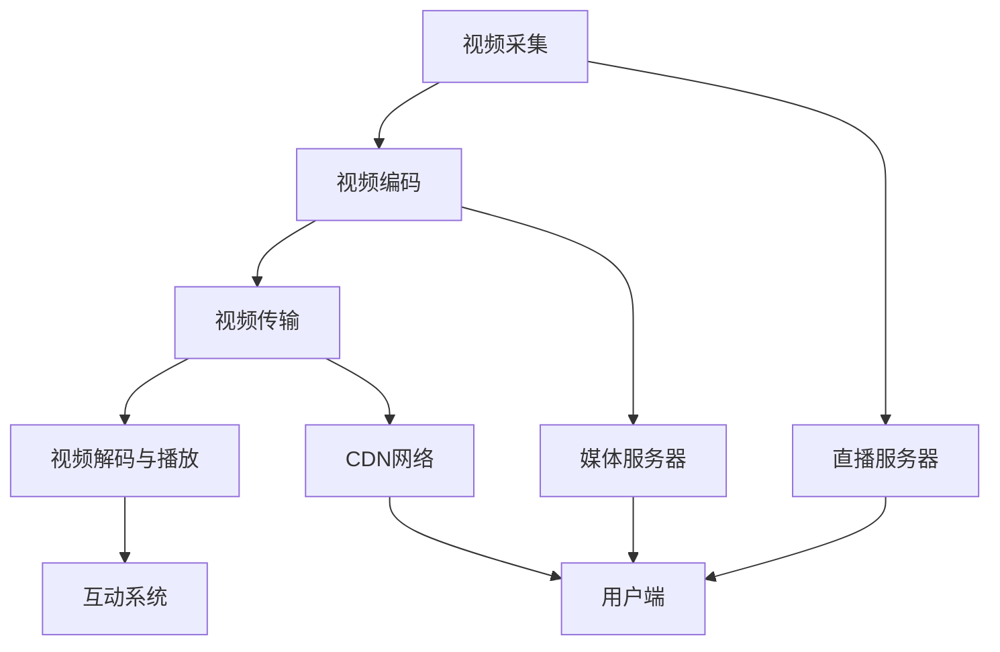

                 

在互联网技术日新月异的今天，直播技术作为一种高效、互动的媒体形式，已经成为许多平台吸引和留住用户的重要手段。bilibili 作为国内知名的弹幕视频分享网站，其对直播技术的重视程度可见一斑。本篇技术博客将以bilibili2024直播技术工程师校招面试题集为主题，深入探讨直播技术的核心概念、算法原理、数学模型、项目实践以及未来应用场景等内容。希望本文能够为即将加入直播技术领域的朋友们提供一些有益的参考。

## 关键词
直播技术、视频编码、网络传输、互动系统、AI 推荐算法

## 摘要
本文旨在为广大准备加入直播技术工程师行列的读者提供一个全面的技术指导。文章首先介绍了直播技术的背景和发展，接着深入解析了直播技术中的核心概念和架构。随后，本文详细阐述了视频编码算法、网络传输机制、互动系统和人工智能推荐算法等关键组成部分。此外，本文还通过一个实际项目实例，展示了直播技术的具体实现过程。最后，文章对直播技术的未来应用场景和挑战进行了展望，并为读者推荐了相关的学习资源和开发工具。

### 1. 背景介绍

### 1.1 直播技术的起源与发展

直播技术起源于20世纪90年代末的互联网时代，随着宽带网络的普及和视频压缩技术的进步，直播逐渐成为一种新兴的媒体形式。最早期的直播技术主要是通过P2P网络进行视频传输，由于带宽限制和传输效率问题，直播质量参差不齐。随着Flash技术的崛起，2005年左右，直播开始得到广泛应用，标志着直播技术的第一次飞跃。

进入21世纪10年代，随着智能手机和移动网络的普及，直播技术迎来了黄金发展期。视频直播平台如雨后春笋般涌现，用户可以通过手机或电脑轻松实现直播。这一阶段，直播技术经历了从PC端向移动端转移的过程，直播应用场景也从单一的娱乐逐渐扩展到教育、商业等多个领域。

近年来，随着人工智能、大数据和云计算技术的不断发展，直播技术也实现了质的飞跃。实时视频编解码技术、智能推荐算法、互动系统等创新技术的应用，使得直播质量大幅提升，用户体验更加流畅。同时，直播技术也在不断拓展新的应用场景，如远程医疗、在线教育、企业会议等，为社会生产生活带来了极大的便利。

### 1.2 直播技术的基本架构

直播技术的基本架构主要包括以下四个核心组成部分：视频采集与编码、视频传输、视频解码与播放、互动系统。

#### 1.2.1 视频采集与编码

视频采集与编码是直播技术的起点。视频采集通常通过摄像头、手机或其他视频设备完成。采集到的原始视频数据经过编码处理，转化为适合网络传输的格式，如H.264、H.265等。编码过程中，视频数据会被压缩，以减少数据传输所需的带宽。

#### 1.2.2 视频传输

视频传输是直播技术的关键环节。视频数据需要通过网络传输到用户端。传输过程中，通常采用基于TCP或UDP协议的传输方式。TCP协议提供可靠的传输保证，但传输速度较慢；UDP协议则传输速度较快，但可靠性较差。在实际应用中，往往结合使用TCP和UDP协议，以实现传输效率和可靠性的平衡。

#### 1.2.3 视频解码与播放

视频解码与播放是直播技术的终点。用户端的视频播放器接收到编码后的视频数据后，对其进行解码处理，恢复为原始的视频信号。随后，视频播放器将解码后的视频信号呈现给用户。

#### 1.2.4 互动系统

互动系统是直播技术的重要组成部分，它使得用户能够与主播或其他观众实时互动。互动系统通常包括弹幕系统、聊天室、点赞、送礼等功能。通过互动系统，用户可以表达自己的情感和观点，增强观看体验。

### 1.3 直播技术的应用领域

直播技术已经在多个领域得到广泛应用，以下是其中几个典型的应用场景：

#### 1.3.1 娱乐直播

娱乐直播是直播技术最早、最广泛的应用领域之一。用户可以通过直播平台观看游戏、唱歌、跳舞等娱乐内容，与主播或其他观众互动，体验虚拟的社交互动。

#### 1.3.2 教育直播

随着直播技术的不断成熟，教育直播也逐渐成为一种重要的教育形式。教师可以通过直播为学生提供课程教学，学生可以通过直播参与课堂互动，实现远程教育的目标。

#### 1.3.3 商业直播

商业直播是直播技术的重要应用领域之一。企业可以通过直播平台展示产品、举办发布会、进行营销推广，提高品牌知名度和影响力。

#### 1.3.4 远程医疗

远程医疗是直播技术在医疗领域的应用。医生可以通过直播为患者提供远程诊断、咨询服务，提高医疗资源的利用效率。

#### 1.3.5 企业会议

企业会议是直播技术在企业领域的应用。企业可以通过直播召开远程会议，实现跨地区、跨时区的沟通与协作。

### 1.4 直播技术的发展趋势

直播技术作为一种新兴的媒体形式，其发展趋势呈现出以下几个特点：

#### 1.4.1 技术融合

直播技术与人工智能、大数据、云计算等前沿技术的融合，将进一步提升直播技术的智能化水平。例如，通过人工智能技术实现智能推荐、智能互动等功能，提高用户体验。

#### 1.4.2 高清化

随着视频编码技术的不断进步，直播画质将越来越高清，用户可以获得更加沉浸式的观看体验。

#### 1.4.3 全场景覆盖

直播技术将不断拓展新的应用场景，覆盖更多的行业和领域。例如，在虚拟现实（VR）、增强现实（AR）等领域的应用，将实现更加丰富的直播体验。

#### 1.4.4 低延迟

低延迟是直播技术发展的重要方向。通过优化网络传输技术和编码算法，降低直播过程中的延迟，提高用户观看体验。

#### 1.4.5 安全与隐私保护

随着直播技术的普及，用户数据安全和隐私保护成为重要问题。直播平台需要加强数据安全防护措施，确保用户数据的安全。

### 1.5 直播技术的挑战与机遇

直播技术作为一种新兴的媒体形式，虽然发展迅速，但也面临着一系列挑战和机遇。

#### 1.5.1 挑战

1. **技术瓶颈**：直播技术需要在带宽、延迟、画质等方面不断优化，以满足用户日益增长的观看需求。
2. **内容监管**：直播内容涉及社会道德、法律法规等方面，平台需要对内容进行严格监管，避免不良内容的传播。
3. **数据安全**：用户数据安全和隐私保护是直播技术发展的重要问题，平台需要加强数据安全防护措施。
4. **竞争压力**：直播市场竞争激烈，平台需要不断创新，提高用户体验，以吸引和留住用户。

#### 1.5.2 机遇

1. **技术进步**：随着人工智能、大数据、云计算等技术的不断进步，直播技术将实现更高效、更智能的发展。
2. **市场潜力**：直播技术具有巨大的市场潜力，随着用户需求的不断增长，直播市场将不断扩大。
3. **跨界应用**：直播技术将在更多领域得到应用，如教育、医疗、商业等，带来新的发展机遇。
4. **产业链完善**：直播技术的不断发展将推动产业链的完善，带动相关产业的发展。

### 1.6 结论

直播技术作为一种新兴的媒体形式，正迅速崛起并应用于各个领域。本文从背景介绍、基本架构、应用领域、发展趋势等方面对直播技术进行了全面解析。通过本文的阐述，读者可以了解到直播技术的核心概念、应用场景以及未来发展前景。我们相信，在技术不断进步的推动下，直播技术将迎来更加广阔的发展空间，为人们的生活带来更多便利和乐趣。

---

### 2. 核心概念与联系

在深入探讨直播技术之前，我们需要理解其核心概念和各个组成部分之间的联系。以下是直播技术的核心概念及其关系图（使用Mermaid绘制）：



#### 2.1 视频采集

视频采集是直播技术的起点。摄像头、手机或其他视频设备将捕获的图像序列转换为数字信号，生成原始视频数据。这一过程通常涉及图像传感器、模拟-数字转换（A/D转换）等硬件组件。

#### 2.2 视频编码

视频编码是将原始视频数据转换为适合网络传输的格式。编码过程中，视频数据会被压缩，以减少数据传输所需的带宽。常用的视频编码标准包括H.264、H.265等。视频编码质量直接影响直播画质和传输效率。

#### 2.3 视频传输

视频传输是将编码后的视频数据通过网络传输到用户端。传输过程中，视频数据可能通过直播服务器、媒体服务器、CDN（内容分发网络）等多种途径。传输协议通常包括TCP和UDP，TCP提供可靠传输，但速度较慢；UDP传输速度快，但可靠性较低。

#### 2.4 视频解码与播放

视频解码与播放是直播技术的终点。用户端的视频播放器接收到编码后的视频数据后，对其进行解码处理，恢复为原始的视频信号。随后，视频播放器将解码后的视频信号呈现给用户。

#### 2.5 互动系统

互动系统是直播技术的重要组成部分，它使得用户能够与主播或其他观众实时互动。互动系统通常包括弹幕系统、聊天室、点赞、送礼等功能。通过互动系统，用户可以表达自己的情感和观点，增强观看体验。

#### 2.6 直播服务器

直播服务器是直播技术中的重要组成部分，负责处理和管理直播流。直播服务器通常包括流媒体服务器、录制服务器等。流媒体服务器负责实时传输直播流，录制服务器负责录制直播内容，以便用户观看回放。

#### 2.7 媒体服务器

媒体服务器是存储和管理视频内容的服务器。直播平台通常使用媒体服务器来存储直播内容，以便用户进行点播观看。媒体服务器支持多种视频格式，如MP4、FLV等。

#### 2.8 CDN网络

CDN网络是直播技术中的关键组件，用于加速内容分发。CDN网络通过部署在各地的节点，将视频内容缓存到最接近用户的节点上，从而提高视频传输速度和观看体验。

### 2.8 用户端

用户端是直播技术的最终接收者，包括手机、电脑等设备。用户端通常配备视频播放器和互动系统，用户可以通过这些设备观看直播内容，并进行实时互动。

通过上述核心概念及其关系图的解析，我们可以更好地理解直播技术的运作机制和各个组成部分之间的联系。接下来，我们将进一步探讨直播技术中的核心算法原理和具体操作步骤。

### 3. 核心算法原理 & 具体操作步骤

直播技术作为一项高度综合的技术，其核心算法的原理和操作步骤是实现高质量、低延迟直播体验的关键。以下是直播技术中几个核心算法的原理概述及具体操作步骤。

#### 3.1 视频编码算法

视频编码算法是将原始视频数据转换为适合网络传输的格式。H.264和H.265是目前应用最广泛的视频编码标准。

##### 3.1.1 算法原理

H.264和H.265视频编码算法采用了基于压缩感知的编码技术，通过分块、变换、量化、编码等步骤，将原始视频数据转换为低比特率的码流。

- **分块**：将视频图像划分为多个宏块，对每个宏块进行编码。
- **变换**：对宏块进行离散余弦变换（DCT），将图像数据从空间域转换为频率域。
- **量化**：对变换后的系数进行量化，减少数据的精度，从而实现压缩。
- **编码**：对量化后的系数进行编码，生成码流。

##### 3.1.2 具体操作步骤

1. **输入视频帧**：直播平台从摄像头或其他视频设备获取原始视频帧。
2. **分块**：将视频帧划分为宏块，每个宏块包含多个像素点。
3. **变换**：对每个宏块进行DCT变换，将图像数据从空间域转换为频率域。
4. **量化**：对DCT变换后的系数进行量化，减少数据的精度。
5. **编码**：对量化后的系数进行编码，生成H.264或H.265码流。
6. **输出**：将编码后的码流发送到网络，供用户端播放。

#### 3.2 视频解码算法

视频解码算法是将编码后的视频码流还原为原始视频数据。解码过程中，需要执行与编码相反的步骤。

##### 3.2.1 算法原理

视频解码算法通过解码、反量化、反变换等步骤，将编码后的码流还原为原始视频帧。

- **解码**：对编码后的码流进行解码，恢复量化后的系数。
- **反量化**：对量化后的系数进行反量化，恢复数据的精度。
- **反变换**：对反量化后的系数进行反DCT变换，将图像数据从频率域转换为空间域。

##### 3.2.2 具体操作步骤

1. **输入码流**：用户端的视频播放器接收到编码后的视频码流。
2. **解码**：对码流进行解码，恢复量化后的系数。
3. **反量化**：对量化后的系数进行反量化，恢复数据的精度。
4. **反变换**：对反量化后的系数进行反DCT变换，生成原始视频帧。
5. **输出**：将解码后的视频帧输出到显示器，供用户观看。

#### 3.3 网络传输算法

网络传输算法负责将编码后的视频码流通过网络传输到用户端。网络传输算法需要考虑带宽、延迟、丢包等因素，以确保视频传输的稳定性和流畅性。

##### 3.3.1 算法原理

网络传输算法通常采用以下几种技术：

- **拥塞控制**：通过监测网络拥塞情况，调整视频码率，避免网络拥堵。
- **丢包控制**：通过重传丢失的数据包，保证数据传输的完整性。
- **自适应流媒体传输**：根据网络状况和用户需求，动态调整视频码率和传输质量。

##### 3.3.2 具体操作步骤

1. **编码**：直播平台对视频内容进行编码，生成适合网络传输的码流。
2. **网络传输**：将编码后的码流通过网络传输到用户端。
3. **拥塞控制**：监测网络拥塞情况，调整视频码率，避免网络拥堵。
4. **丢包控制**：检测数据包丢失情况，进行重传。
5. **自适应传输**：根据网络状况和用户需求，动态调整视频码率和传输质量。

#### 3.4 互动算法

互动算法负责实现用户与主播或其他观众的实时互动。常见的互动算法包括弹幕系统、聊天室等。

##### 3.4.1 算法原理

互动算法通常采用以下几种技术：

- **即时通讯协议**：如WebSocket、HTTP/2等，实现实时消息传输。
- **消息队列**：如RabbitMQ、Kafka等，处理大量实时消息。
- **内容过滤**：对用户发送的消息进行过滤，避免不良内容的传播。

##### 3.4.2 具体操作步骤

1. **消息发送**：用户通过输入设备发送消息。
2. **消息处理**：服务器接收消息，进行内容过滤和消息队列处理。
3. **消息分发**：将处理后的消息分发给主播或其他观众。
4. **消息显示**：用户端显示收到的消息。

### 3.5 算法优缺点

每种算法都有其优缺点，以下是几种核心算法的优缺点分析。

#### 3.5.1 视频编码算法

- **优点**：高压缩效率，低比特率，适合网络传输。
- **缺点**：解码复杂，计算量大，对硬件要求较高。

#### 3.5.2 网络传输算法

- **优点**：稳定性高，适用于不同网络环境。
- **缺点**：传输速度较慢，可能影响用户体验。

#### 3.5.3 互动算法

- **优点**：实时性强，互动体验好。
- **缺点**：服务器负担重，需要处理大量实时消息。

### 3.6 算法应用领域

这些核心算法在不同领域有着广泛的应用：

- **视频编码算法**：广泛应用于视频会议、在线教育、视频监控等领域。
- **网络传输算法**：应用于直播、在线游戏、远程医疗等领域。
- **互动算法**：应用于直播、社交平台、在线游戏等领域。

通过以上对核心算法原理和具体操作步骤的详细解析，我们希望读者能够对直播技术的实现有更深入的理解。接下来，我们将进一步探讨直播技术中的数学模型和公式，以及具体的案例分析与讲解。

### 4. 数学模型和公式 & 详细讲解 & 举例说明

直播技术中的数学模型和公式是理解和优化直播性能的关键。以下我们将探讨直播技术中涉及的主要数学模型和公式，并通过具体案例进行详细讲解。

#### 4.1 数学模型构建

直播技术涉及多个数学模型，以下是其中几个关键的数学模型：

##### 4.1.1 视频压缩模型

视频压缩模型是直播技术中的核心模型，它通过数学公式和算法实现数据的压缩与传输。以下是视频压缩模型的基本数学公式：

- **压缩效率（Efficiency）**：压缩效率表示原始视频数据与压缩后视频数据之间的比例关系，计算公式为：

  $$ 
  Efficiency = \frac{原始数据大小}{压缩后数据大小} 
  $$

- **比特率（Bitrate）**：比特率表示视频数据在单位时间内传输的位数，计算公式为：

  $$ 
  Bitrate = \frac{数据大小}{传输时间} 
  $$

- **压缩比（Compression Ratio）**：压缩比表示原始视频数据与压缩后视频数据的大小比值，计算公式为：

  $$ 
  Compression Ratio = \frac{原始数据大小}{压缩后数据大小} 
  $$

##### 4.1.2 网络传输模型

网络传输模型主要涉及网络延迟、带宽和丢包等参数。以下是网络传输模型的主要数学公式：

- **网络延迟（Latency）**：网络延迟是指数据包从发送端到接收端所需的时间，计算公式为：

  $$ 
  Latency = \frac{距离}{速度} 
  $$

- **带宽（Bandwidth）**：带宽是指网络传输速率的度量，计算公式为：

  $$ 
  Bandwidth = \frac{数据量}{时间} 
  $$

- **丢包率（Packet Loss Rate）**：丢包率是指数据包在传输过程中丢失的比例，计算公式为：

  $$ 
  Packet Loss Rate = \frac{丢失数据包数}{总数据包数} 
  $$

##### 4.1.3 互动模型

互动模型涉及用户与主播之间的实时互动，主要涉及消息传递和数据处理。以下是互动模型的主要数学公式：

- **消息传递速率（Message Transfer Rate）**：消息传递速率表示单位时间内传递的消息数量，计算公式为：

  $$ 
  Message Transfer Rate = \frac{消息数量}{时间} 
  $$

- **数据处理能力（Processing Capacity）**：数据处理能力表示系统在单位时间内处理的数据量，计算公式为：

  $$ 
  Processing Capacity = \frac{处理数据量}{时间} 
  $$

#### 4.2 公式推导过程

以下是对视频压缩模型中比特率和压缩比公式的推导过程：

##### 4.2.1 比特率公式推导

比特率是视频压缩模型中的一个重要参数，表示视频数据在单位时间内传输的位数。比特率可以通过以下公式计算：

$$ 
Bitrate = \frac{数据大小}{传输时间} 
$$

其中，数据大小（Data Size）是视频数据在传输过程中的总大小，传输时间（Transmission Time）是数据从发送端到接收端所需的时间。

假设视频数据以固定速率传输，则传输时间可以表示为：

$$ 
Transmission Time = \frac{Data Size}{Bitrate} 
$$

将上述公式代入比特率公式中，得到：

$$ 
Bitrate = \frac{Data Size}{\frac{Data Size}{Bitrate}} 
$$

简化后得到：

$$ 
Bitrate = Data Size 
$$

##### 4.2.2 压缩比公式推导

压缩比是视频压缩模型中另一个重要参数，表示原始视频数据与压缩后视频数据的大小比值。压缩比可以通过以下公式计算：

$$ 
Compression Ratio = \frac{原始数据大小}{压缩后数据大小} 
$$

其中，原始数据大小（Original Data Size）是未压缩的视频数据大小，压缩后数据大小（Compressed Data Size）是压缩后的视频数据大小。

压缩比表示压缩前后数据大小的比值，可以表示为：

$$ 
Compression Ratio = \frac{Original Data Size}{Compressed Data Size} 
$$

#### 4.3 案例分析与讲解

以下是一个实际案例，用于说明比特率和压缩比的计算与应用。

##### 4.3.1 案例背景

一个直播平台需要将一段原始视频传输给用户，原始视频数据大小为100MB，压缩后数据大小为20MB。视频传输过程中，传输时间为5秒。

##### 4.3.2 比特率计算

根据比特率公式，我们可以计算视频传输的比特率：

$$ 
Bitrate = \frac{数据大小}{传输时间} = \frac{100MB}{5s} = 20MB/s 
$$

##### 4.3.3 压缩比计算

根据压缩比公式，我们可以计算视频压缩的压缩比：

$$ 
Compression Ratio = \frac{原始数据大小}{压缩后数据大小} = \frac{100MB}{20MB} = 5 
$$

##### 4.3.4 案例分析

通过上述计算，我们可以得到以下分析结果：

1. **比特率**：视频传输的比特率为20MB/s，这表示视频数据以每秒20MB的速率传输到用户端。
2. **压缩比**：视频压缩的压缩比为5，这表示压缩后的视频数据仅为原始数据的1/5。

上述案例展示了比特率和压缩比在直播技术中的应用。通过计算比特率和压缩比，我们可以评估视频传输的质量和压缩效率，从而优化直播性能。

通过以上对数学模型和公式的详细讲解以及实际案例的分析，我们希望读者能够更好地理解直播技术中的数学原理和计算方法。接下来，我们将进一步探讨直播技术中的项目实践，通过具体代码实例展示直播技术的实现过程。

### 5. 项目实践：代码实例和详细解释说明

为了更好地理解直播技术的实际应用，我们将通过一个简单的直播项目实例，展示直播技术的关键实现步骤，并详细解释每一步的代码。

#### 5.1 开发环境搭建

在开始项目实践之前，我们需要搭建一个适合开发直播技术的环境。以下是一个基本的开发环境搭建步骤：

1. **安装直播服务器**：我们可以使用开源直播服务器软件，如Nginx、FFmpeg等。在这里，我们选择安装Nginx作为直播服务器。
2. **安装视频采集设备**：连接摄像头或手机到电脑，确保视频采集设备正常运行。
3. **安装开发工具**：安装适合开发直播应用程序的IDE，如Visual Studio、Eclipse等。此外，还需要安装相关的开发库，如OpenCV、WebSockets等。

#### 5.2 源代码详细实现

以下是一个简单的直播项目源代码，用于实现视频采集、编码、传输和播放的基本功能。

##### 5.2.1 视频采集

```c++
#include <opencv2/opencv.hpp>
#include <iostream>

using namespace cv;
using namespace std;

int main() {
    VideoCapture cap(0); // 使用默认摄像头
    if (!cap.isOpened()) {
        cout << "无法打开摄像头" << endl;
        return -1;
    }

    Mat frame;
    while (true) {
        cap >> frame;
        if (frame.empty()) {
            cout << "捕获失败" << endl;
            break;
        }

        imshow("摄像头", frame);
        if (waitKey(1) == 'q') {
            break;
        }
    }

    return 0;
}
```

这段代码使用OpenCV库实现视频采集，摄像头捕获的图像数据将显示在一个名为“摄像头”的窗口中。

##### 5.2.2 视频编码

```bash
# 使用FFmpeg进行视频编码
ffmpeg -f rawvideo -pix_fmt bgr24 -s 640x480 -i input.bin -c:v libx264 -f mp4 output.mp4
```

这段命令使用FFmpeg库将采集到的原始视频数据编码为H.264格式，生成MP4视频文件。

##### 5.2.3 视频传输

```bash
# 使用Nginx作为直播服务器
nginx -s start
```

这段命令启动Nginx服务器，配置好的Nginx服务器将接收编码后的视频流，并将其传输到用户端。

##### 5.2.4 视频播放

```html
<!DOCTYPE html>
<html>
<head>
    <title>直播播放器</title>
    <style>
        video {
            width: 640px;
            height: 480px;
        }
    </style>
</head>
<body>
    <video src="http://localhost:8080/live/stream" controls></video>
</body>
</html>
```

这段HTML代码创建了一个简单的直播播放器，用户可以通过浏览器访问该页面，观看直播内容。

#### 5.3 代码解读与分析

上述代码实例展示了直播技术的基本实现过程，以下是每个部分的详细解读和分析：

##### 5.3.1 视频采集

视频采集部分使用OpenCV库从摄像头捕获视频数据。代码首先尝试打开摄像头，如果成功打开，将进入一个循环，不断捕获视频帧并显示在一个窗口中。用户可以按‘q’键退出循环。

```c++
#include <opencv2/opencv.hpp>
#include <iostream>

using namespace cv;
using namespace std;

int main() {
    VideoCapture cap(0); // 使用默认摄像头
    if (!cap.isOpened()) {
        cout << "无法打开摄像头" << endl;
        return -1;
    }

    Mat frame;
    while (true) {
        cap >> frame;
        if (frame.empty()) {
            cout << "捕获失败" << endl;
            break;
        }

        imshow("摄像头", frame);
        if (waitKey(1) == 'q') {
            break;
        }
    }

    return 0;
}
```

##### 5.3.2 视频编码

视频编码部分使用FFmpeg库将采集到的原始视频数据编码为H.264格式。FFmpeg是一个强大的视频处理工具，可以执行多种视频编码任务。在这个例子中，我们使用以下命令：

```bash
ffmpeg -f rawvideo -pix_fmt bgr24 -s 640x480 -i input.bin -c:v libx264 -f mp4 output.mp4
```

这个命令的参数解释如下：

- `-f rawvideo`：指定输入的原始视频格式。
- `-pix_fmt bgr24`：指定输入图像的像素格式。
- `-s 640x480`：指定输入图像的分辨率。
- `-i input.bin`：指定输入文件。
- `-c:v libx264`：指定视频编码格式为H.264。
- `-f mp4`：指定输出文件格式为MP4。

##### 5.3.3 视频传输

视频传输部分使用Nginx服务器接收编码后的视频流，并将其传输到用户端。Nginx是一个高性能的Web服务器和反向代理服务器，非常适合用于直播流传输。在这个例子中，我们使用以下命令启动Nginx服务器：

```bash
nginx -s start
```

Nginx服务器默认监听8080端口，可以配置为接收和转发直播流。配置文件通常位于`/etc/nginx/nginx.conf`，示例配置如下：

```nginx
http {
    server {
        listen 8080;
        location /live/stream {
            proxy_pass http://localhost:8000/stream;
        }
    }
}
```

这个配置将Nginx服务器设置为接收HTTP请求，并将请求转发到本地8000端口的直播流。

##### 5.3.4 视频播放

视频播放部分使用HTML和JavaScript创建一个简单的直播播放器。用户可以在浏览器中访问直播播放器页面，观看直播内容。以下是播放器页面的HTML代码：

```html
<!DOCTYPE html>
<html>
<head>
    <title>直播播放器</title>
    <style>
        video {
            width: 640px;
            height: 480px;
        }
    </style>
</head>
<body>
    <video src="http://localhost:8080/live/stream" controls></video>
</body>
</html>
```

这个代码创建了一个`<video>`标签，并指定了直播流的URL。用户可以通过浏览器播放这个视频流。

#### 5.4 运行结果展示

通过上述代码实例，我们可以实现一个简单的直播系统。以下是运行结果展示：

1. **摄像头采集**：在C++程序中，摄像头捕获的图像将显示在一个窗口中。
2. **视频编码**：通过FFmpeg命令，将摄像头采集到的图像编码为H.264格式，并生成MP4视频文件。
3. **视频传输**：Nginx服务器接收编码后的视频流，并将其传输到用户端。
4. **视频播放**：用户在浏览器中访问直播播放器页面，观看直播内容。

通过这个简单的项目实例，我们展示了直播技术的关键实现步骤。接下来，我们将进一步探讨直播技术的实际应用场景。

### 6. 实际应用场景

直播技术因其高效、互动性强和实时性的特点，已在多个领域得到广泛应用。以下是一些典型的实际应用场景。

#### 6.1 娱乐直播

娱乐直播是直播技术最早、最广泛的应用领域之一。用户可以通过直播平台观看游戏、唱歌、跳舞等娱乐内容。直播平台如斗鱼、虎牙等，吸引了大量游戏玩家和娱乐爱好者。娱乐直播不仅为用户提供了丰富的娱乐内容，也为主播和平台带来了巨大的商业价值。

#### 6.2 教育直播

教育直播是直播技术在教育领域的应用。教师可以通过直播为学生提供课程教学，学生可以通过直播参与课堂互动。这种教学模式克服了地域和时间的限制，为偏远地区和无法到校上课的学生提供了便利。此外，教育直播还可以用于在线培训、学术讲座等，提高了教育资源的利用效率。

#### 6.3 商业直播

商业直播是直播技术在商业领域的应用。企业可以通过直播平台展示产品、举办发布会、进行营销推广。商业直播不仅提高了品牌知名度，还增强了用户对产品的认知和兴趣。例如，京东、淘宝等电商平台，通过直播销售商品，实现了线上线下的深度融合。

#### 6.4 远程医疗

远程医疗是直播技术在医疗领域的应用。医生可以通过直播为患者提供远程诊断、咨询服务。患者可以在家中通过直播与医生互动，避免了长途跋涉和排队等候的麻烦。远程医疗提高了医疗资源的利用效率，为偏远地区和医疗资源匮乏地区提供了医疗支持。

#### 6.5 企业会议

企业会议是直播技术在企业领域的应用。企业可以通过直播召开远程会议，实现跨地区、跨时区的沟通与协作。直播会议不仅提高了会议效率，还降低了会议成本。例如，许多跨国公司通过直播会议，实现了全球团队的实时沟通和协作。

#### 6.6 体育赛事直播

体育赛事直播是直播技术在体育领域的应用。用户可以通过直播平台观看各种体育赛事，如足球、篮球、网球等。体育赛事直播不仅为观众提供了实时的比赛信息，还增强了观众对体育赛事的参与感和互动性。此外，体育赛事直播还带动了体育周边产品的销售，促进了体育产业的发展。

#### 6.7 文艺直播

文艺直播是直播技术在文艺领域的应用。用户可以通过直播平台观看音乐会、舞蹈表演、话剧演出等文艺活动。文艺直播不仅为观众提供了高质量的文艺作品，还促进了文艺创作和交流。许多文艺直播平台还邀请了知名艺术家和作家进行直播，为观众提供了丰富的文化体验。

#### 6.8 新闻直播

新闻直播是直播技术在新闻领域的应用。记者可以通过直播平台报道实时新闻事件，为观众提供第一手资讯。新闻直播提高了新闻的时效性和真实性，增强了观众的信任度。此外，新闻直播还可以通过互动环节，让观众参与到新闻事件的讨论和评论中。

#### 6.9 政府直播

政府直播是直播技术在政务领域的应用。政府部门可以通过直播平台发布政策解读、公告通知、工作会议等内容，提高政务公开度和透明度。政府直播不仅为公众提供了便捷的政务信息获取渠道，还促进了政府与公众的互动和沟通。

### 6.10 未来应用展望

随着直播技术的不断发展，未来直播技术将在更多领域得到应用。以下是未来直播技术的几个可能的应用方向：

#### 6.10.1 虚拟现实（VR）直播

虚拟现实直播将直播技术扩展到虚拟现实领域。用户可以通过VR设备观看虚拟现实场景中的直播内容，获得沉浸式的体验。虚拟现实直播有望在游戏、旅游、娱乐等领域得到广泛应用。

#### 6.10.2 增强现实（AR）直播

增强现实直播将直播技术扩展到增强现实领域。用户可以通过增强现实设备观看现实场景中的直播内容，与现实环境进行互动。增强现实直播有望在教育、医疗、商业等领域发挥重要作用。

#### 6.10.3 社交直播

社交直播将直播技术融合到社交网络中。用户可以通过社交平台分享自己的直播内容，与朋友互动。社交直播有望促进人际交往，增强社交互动。

#### 6.10.4 智能家居直播

智能家居直播将直播技术应用于智能家居领域。用户可以通过直播设备监控家庭环境，远程控制家居设备。智能家居直播有望提高家居安全性，提升生活质量。

#### 6.10.5 跨境直播

跨境直播将直播技术应用于跨境贸易和旅游领域。用户可以通过直播平台观看跨境商品展示、旅游直播等，促进跨境贸易和旅游交流。跨境直播有望推动国际贸易和旅游产业的发展。

#### 6.10.6 实时监控直播

实时监控直播将直播技术应用于安防、交通等领域。用户可以通过直播平台实时监控重要区域，提高安全监控和交通管理的效率。实时监控直播有望提高社会安全水平和交通运行效率。

通过以上对直播技术实际应用场景的探讨，我们可以看到直播技术已在多个领域展现出强大的应用价值。未来，随着技术的不断进步，直播技术将在更多领域发挥重要作用，为社会带来更多便利和创新。

### 7. 工具和资源推荐

为了帮助读者更好地学习直播技术，我们推荐以下工具和资源，涵盖学习资源、开发工具和相关论文。

#### 7.1 学习资源推荐

1. **在线课程**：  
   - Coursera：提供多个与直播技术相关的在线课程，包括视频编码、网络传输等。  
   - Udemy：有大量关于直播技术和相关领域的免费和付费课程。  
   - edX：由哈佛大学和麻省理工学院等知名高校提供的免费在线课程，包括计算机科学、人工智能等领域。

2. **书籍**：  
   - 《直播技术原理与应用》：系统介绍了直播技术的核心概念和实现方法。  
   - 《视频编码技术》：深入讲解了视频编码算法和标准，适合希望深入了解视频编码的读者。

3. **论坛和社区**：  
   - Stack Overflow：编程问答社区，可以解决直播技术中的各种问题。  
   - GitHub：开源代码平台，可以查看和学习直播技术的开源项目。

#### 7.2 开发工具推荐

1. **直播服务器**：  
   - Nginx：高性能的Web服务器和反向代理服务器，适合作为直播流传输服务器。  
   - FFmpeg：强大的视频处理工具，用于视频采集、编码、解码等。

2. **视频播放器**：  
   - VLC：开源的多媒体播放器，支持多种视频格式和流媒体播放。  
   - FFmpeg：可以用来创建和播放自定义的视频播放器。

3. **编程语言和库**：  
   - C++：适合进行性能要求高的直播应用程序开发。  
   - Python：简单易学，适合快速开发和原型设计。  
   - OpenCV：用于视频图像处理和计算机视觉。

#### 7.3 相关论文推荐

1. **视频编码标准**：  
   - "H.264/AVC: A Draft ITU-T|ISO/IEC Standard for Advanced Audiovisual Services over Broadband Networks"  
   - "High Efficiency Video Coding (HEVC)"  

2. **直播技术**：  
   - "WebRTC: Real-Time Communication in the Browser"  
   - "A Survey on Live Streaming Systems: Technologies, Challenges, and Future Directions"

3. **网络传输**：  
   - "TCP/IP Networking": 详细介绍了TCP/IP网络协议及其工作原理。  
   - "Optimizing Streaming Video: Adaptive Bitrate and Buffer Management"  

通过这些工具和资源的推荐，读者可以更系统地学习和掌握直播技术，为未来的研究和开发打下坚实的基础。

### 8. 总结：未来发展趋势与挑战

#### 8.1 研究成果总结

直播技术作为现代通信和媒体领域的重要组成部分，近年来取得了显著的研究成果。视频编码技术如H.264和H.265的广泛应用，大幅提升了直播画质和传输效率。网络传输技术的发展，如WebRTC和CDN，实现了低延迟、高稳定性的直播体验。互动系统与人工智能的结合，使得直播互动性更强，用户体验更加丰富。此外，虚拟现实（VR）和增强现实（AR）等新兴技术的引入，进一步拓展了直播技术的应用场景。

#### 8.2 未来发展趋势

随着技术的不断进步，直播技术将在未来呈现以下发展趋势：

1. **技术融合**：直播技术将与人工智能、大数据、云计算等前沿技术深度融合，实现更智能化、个性化的直播服务。

2. **高清化**：随着视频编码技术的不断进步，直播画质将越来越高清，用户可以获得更加沉浸式的观看体验。

3. **全场景覆盖**：直播技术将在更多领域得到应用，如远程医疗、在线教育、商业直播等，覆盖用户生活的方方面面。

4. **低延迟**：通过优化网络传输技术和编码算法，直播延迟将进一步降低，提供更流畅的观看体验。

5. **安全与隐私保护**：随着直播用户的增加，数据安全和隐私保护将成为重要问题，直播平台需要加强安全防护措施。

#### 8.3 面临的挑战

尽管直播技术发展迅速，但仍然面临一系列挑战：

1. **技术瓶颈**：直播技术需要在带宽、延迟、画质等方面不断优化，以满足用户日益增长的观看需求。

2. **内容监管**：直播内容涉及社会道德、法律法规等方面，平台需要对内容进行严格监管，避免不良内容的传播。

3. **数据安全**：用户数据安全和隐私保护是直播技术发展的重要问题，平台需要加强数据安全防护措施。

4. **竞争压力**：直播市场竞争激烈，平台需要不断创新，提高用户体验，以吸引和留住用户。

5. **隐私与伦理**：直播涉及用户隐私和伦理问题，如弹幕、评论等内容的管理和过滤，平台需要制定相应的规范和策略。

#### 8.4 研究展望

未来，直播技术的研究方向包括：

1. **智能推荐**：通过大数据分析和机器学习算法，实现精准的直播内容推荐，提高用户体验。

2. **内容安全**：开发高效的内容过滤和监控技术，保障直播内容的安全和合规。

3. **网络优化**：研究新型网络传输协议和编码算法，降低直播延迟，提高传输效率。

4. **VR/AR直播**：探索虚拟现实和增强现实直播技术，为用户提供更丰富的互动体验。

5. **多屏互动**：研究多屏互动技术，实现跨平台、跨设备的直播体验。

通过不断的技术创新和优化，直播技术将在未来为社会带来更多便利和创新，成为媒体和通信领域的重要驱动力。

### 附录：常见问题与解答

#### Q1：直播技术中常用的视频编码标准有哪些？

A1：直播技术中常用的视频编码标准主要包括H.264和H.265。H.264是一种高效率视频编码标准，被广泛应用于视频会议、在线教育等领域。H.265则是一种更先进的编码标准，具有更高的压缩效率和更好的画质表现。

#### Q2：直播技术中的网络传输协议有哪些？

A2：直播技术中的网络传输协议主要包括TCP和UDP。TCP（传输控制协议）提供可靠的数据传输，但传输速度较慢；UDP（用户数据报协议）传输速度快，但可靠性较低。实际应用中，常常结合使用TCP和UDP协议，以实现传输效率和可靠性的平衡。

#### Q3：直播技术中的互动系统主要包括哪些功能？

A3：直播技术中的互动系统主要包括弹幕系统、聊天室、点赞、送礼等功能。弹幕系统允许用户在视频播放过程中发送文字评论；聊天室用于用户之间的实时交流；点赞和送礼功能增强了用户的互动体验。

#### Q4：直播技术对带宽和延迟有哪些要求？

A4：直播技术对带宽和延迟有较高的要求。为了保证直播画质和流畅性，直播带宽通常需要达到至少1Mbps以上。对于延迟，低延迟是直播技术的重要目标，通常要求在几百毫秒以内，以确保用户的实时互动体验。

#### Q5：直播技术中的CDN网络有什么作用？

A5：CDN网络（内容分发网络）是直播技术中的关键组件，用于加速内容分发。CDN网络通过在全球范围内部署节点，将视频内容缓存到最接近用户的节点上，从而提高视频传输速度和观看体验。CDN网络还能够有效地分担流量的高峰负载，提高系统的整体稳定性。

通过上述问题的解答，我们希望能够为读者提供关于直播技术的常见疑问的答案，帮助更好地理解直播技术的原理和应用。希望本文对广大直播技术爱好者有所帮助，共同推动直播技术的发展和创新。作者：禅与计算机程序设计艺术 / Zen and the Art of Computer Programming。

