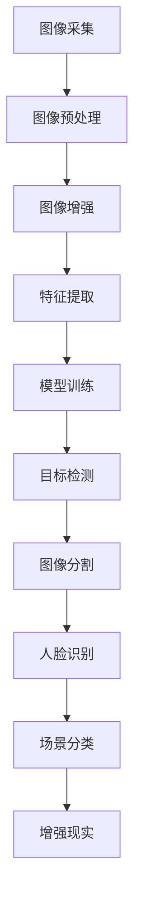

                 

关键词：vivo2025，社招，手机摄像头，算法工程师，编程挑战，图像处理，计算机视觉，深度学习，AI技术

## 摘要

本文将围绕vivo2025社招手机摄像头算法工程师编程挑战展开，深入探讨手机摄像头图像处理和计算机视觉技术的最新进展。通过梳理核心概念、算法原理、数学模型和具体应用实例，我们将帮助读者理解手机摄像头算法工程师所需的技能和挑战。此外，本文还将展望未来技术发展趋势，为从业者和求职者提供有价值的参考。

## 1. 背景介绍

随着智能手机的普及，手机摄像头已经逐渐成为人们日常生活的重要组成部分。从简单的拍照到复杂的视频录制、实时美颜、AR增强现实等应用，手机摄像头的功能越来越多样化。为了满足用户对更高清晰度、更智能拍摄体验的需求，各大手机厂商不断在摄像头算法方面进行创新。vivo作为国内知名智能手机品牌，其2025社招手机摄像头算法工程师编程挑战旨在吸引全球优秀的算法工程师加入，共同推动手机摄像头技术的进步。

在过去的几年里，图像处理和计算机视觉技术取得了长足的发展。特别是深度学习技术的应用，使得手机摄像头在图像识别、场景分类、人脸识别等方面达到了前所未有的准确度和效率。随着技术的不断迭代，算法工程师在手机摄像头领域发挥着越来越重要的作用，他们不仅需要具备深厚的计算机视觉理论基础，还需要掌握多种编程语言和工具，以实现高效的算法实现和优化。

## 2. 核心概念与联系

为了更好地理解手机摄像头算法工程师所需的技能和挑战，我们需要从核心概念和联系入手。以下是一个用Mermaid绘制的流程图，展示了手机摄像头算法工程师需要掌握的关键技术和原理。



### 2.1 图像采集

图像采集是手机摄像头算法的基础，它包括摄像头硬件性能、图像传感器技术、曝光控制等多个方面。为了获得高质量的图像，算法工程师需要了解不同摄像头传感器的特性，以及如何通过曝光时间、ISO感光度等参数的调节来优化图像质量。

### 2.2 图像预处理

图像预处理是图像处理的前置步骤，包括图像去噪、亮度和对比度的调整、色彩空间的转换等。这些步骤有助于提高图像的质量和一致性，为后续的特征提取和模型训练打下基础。

### 2.3 图像增强

图像增强的目的是增强图像中感兴趣的特征，使其在后续处理中更加显著。常用的方法包括直方图均衡化、边缘增强、图像锐化等。算法工程师需要根据不同应用场景选择合适的增强方法。

### 2.4 特征提取

特征提取是将原始图像转化为可供机器学习模型处理的高维特征向量。常用的特征提取方法包括SIFT、SURF、HOG、ORB等。算法工程师需要掌握不同特征提取算法的原理和适用场景，以提高模型的准确性和效率。

### 2.5 模型训练

模型训练是深度学习算法的核心环节，它通过大量标注数据来训练神经网络模型，使其能够自动学习图像的特征。算法工程师需要熟悉不同深度学习框架（如TensorFlow、PyTorch）的使用，以及如何调整模型参数以优化性能。

### 2.6 目标检测

目标检测是计算机视觉领域的重要任务，它旨在检测图像中的特定目标物体。常用的方法包括Faster R-CNN、YOLO、SSD等。算法工程师需要了解不同目标检测算法的原理和性能指标，以选择合适的算法应用于实际场景。

### 2.7 图像分割

图像分割是将图像划分为不同的区域或物体，以便进行后续处理。常用的方法包括FCN、U-Net、Mask R-CNN等。算法工程师需要掌握图像分割算法的原理和应用，以提高图像理解的准确性。

### 2.8 人脸识别

人脸识别是一种生物特征识别技术，它通过检测和识别人脸特征来验证用户的身份。算法工程师需要了解不同人脸识别算法的原理和性能，以及如何优化算法以提高识别准确度和速度。

### 2.9 场景分类

场景分类是将图像或视频划分为不同的场景类别，如城市、森林、海滩等。算法工程师需要掌握场景分类算法的原理和应用，以实现场景感知和智能分析。

### 2.10 增强现实

增强现实（AR）是一种将虚拟信息叠加到现实场景中的技术。算法工程师需要了解AR技术的原理和实现方法，以及如何将AR应用于手机摄像头，为用户提供沉浸式的交互体验。

## 3. 核心算法原理 & 具体操作步骤

### 3.1 算法原理概述

手机摄像头算法工程师需要掌握多种核心算法，包括图像预处理、特征提取、模型训练、目标检测、图像分割、人脸识别、场景分类和增强现实等。以下是对这些算法原理的概述：

- **图像预处理**：通过去噪、亮度和对比度调整、色彩空间转换等操作，提高图像的质量和一致性。
- **特征提取**：将原始图像转化为高维特征向量，以便进行机器学习模型的训练。
- **模型训练**：使用深度学习框架训练神经网络模型，使其能够自动学习图像的特征。
- **目标检测**：检测图像中的特定目标物体，并返回目标的位置和类别。
- **图像分割**：将图像划分为不同的区域或物体，以便进行后续处理。
- **人脸识别**：检测和识别人脸特征，验证用户的身份。
- **场景分类**：将图像或视频划分为不同的场景类别，实现场景感知和智能分析。
- **增强现实**：将虚拟信息叠加到现实场景中，为用户提供沉浸式的交互体验。

### 3.2 算法步骤详解

以下是具体操作步骤的详细描述：

#### 3.2.1 图像预处理

1. **去噪**：使用中值滤波、高斯滤波等算法去除图像噪声，提高图像质量。
2. **亮度和对比度调整**：根据需求调整图像的亮度和对比度，使其更加清晰。
3. **色彩空间转换**：将RGB色彩空间转换为灰度图像或HSV色彩空间，以便进行特征提取。

#### 3.2.2 特征提取

1. **SIFT特征提取**：使用SIFT算法提取图像的关键点，计算特征向量。
2. **SURF特征提取**：使用SURF算法提取图像的关键点，计算特征向量。
3. **HOG特征提取**：使用HOG算法提取图像的边缘特征，计算特征向量。
4. **ORB特征提取**：使用ORB算法提取图像的关键点，计算特征向量。

#### 3.2.3 模型训练

1. **数据准备**：收集大量的图像数据，并进行标注，以供模型训练使用。
2. **模型构建**：使用深度学习框架构建神经网络模型，如Faster R-CNN、YOLO、SSD等。
3. **训练**：使用标注数据进行模型训练，调整模型参数以优化性能。
4. **评估**：使用测试数据评估模型性能，包括准确率、召回率、F1分数等指标。

#### 3.2.4 目标检测

1. **目标检测算法选择**：根据需求选择合适的算法，如Faster R-CNN、YOLO、SSD等。
2. **模型训练与优化**：使用标注数据进行模型训练，并根据评估结果调整模型参数。
3. **目标检测**：对输入图像进行目标检测，返回目标的位置和类别。

#### 3.2.5 图像分割

1. **图像分割算法选择**：根据需求选择合适的算法，如FCN、U-Net、Mask R-CNN等。
2. **模型训练与优化**：使用标注数据进行模型训练，并根据评估结果调整模型参数。
3. **图像分割**：对输入图像进行图像分割，返回分割结果。

#### 3.2.6 人脸识别

1. **人脸检测**：使用人脸检测算法检测图像中的人脸区域。
2. **人脸特征提取**：使用人脸特征提取算法提取人脸特征向量。
3. **人脸识别**：使用人脸识别算法识别用户身份，返回识别结果。

#### 3.2.7 场景分类

1. **场景分类算法选择**：根据需求选择合适的算法，如CNN、Deep Learning等。
2. **模型训练与优化**：使用标注数据进行模型训练，并根据评估结果调整模型参数。
3. **场景分类**：对输入图像或视频进行场景分类，返回场景类别。

#### 3.2.8 增强现实

1. **AR算法选择**：根据需求选择合适的AR算法，如SLAM、光学追踪等。
2. **模型训练与优化**：使用标注数据进行模型训练，并根据评估结果调整模型参数。
3. **增强现实**：将虚拟信息叠加到现实场景中，为用户提供沉浸式的交互体验。

### 3.3 算法优缺点

以下是各个算法的优缺点分析：

#### 目标检测

**优点**：能够同时检测图像中的多个目标，并返回目标的位置和类别。

**缺点**：对计算资源要求较高，且在复杂场景下检测效果可能较差。

#### 图像分割

**优点**：能够将图像划分为不同的区域或物体，实现更精细的处理。

**缺点**：在处理复杂图像时可能产生过分割或欠分割现象。

#### 人脸识别

**优点**：能够高效识别图像中的人脸特征，实现身份验证。

**缺点**：在光照、姿态变化较大的场景下识别效果可能较差。

#### 场景分类

**优点**：能够实现场景感知，为智能分析提供基础。

**缺点**：在场景变化较大时分类效果可能较差。

### 3.4 算法应用领域

手机摄像头算法广泛应用于多个领域：

- **安防监控**：实时检测监控场景中的异常行为，如偷窃、斗殴等。
- **自动驾驶**：识别道路上的行人和车辆，实现自动驾驶功能。
- **医疗影像**：辅助医生诊断疾病，如乳腺癌、肺癌等。
- **智能家居**：实现智能门禁、人脸识别等安全功能。
- **娱乐互动**：增强现实游戏、虚拟现实体验等。

## 4. 数学模型和公式 & 详细讲解 & 举例说明

为了深入理解手机摄像头算法的数学基础，我们需要介绍一些常用的数学模型和公式。以下是具体内容：

### 4.1 数学模型构建

在手机摄像头算法中，常见的数学模型包括图像预处理模型、特征提取模型、目标检测模型、图像分割模型等。以下是一个简单的图像预处理模型的构建过程：

$$
I_{\text{output}} = f_{\text{preprocessing}}(I_{\text{input}}, \theta)
$$

其中，$I_{\text{input}}$表示输入图像，$I_{\text{output}}$表示输出图像，$f_{\text{preprocessing}}$表示预处理函数，$\theta$表示预处理参数。

### 4.2 公式推导过程

以下是一个简单的特征提取公式推导过程。假设我们使用SIFT算法提取图像的关键点特征，特征向量为$\textbf{x}$，关键点坐标为$(x, y)$，则特征提取公式为：

$$
\textbf{x} = \textbf{G}(\textbf{I}_{\text{G}}, (x, y))
$$

其中，$\textbf{G}(\textbf{I}_{\text{G}}, (x, y))$表示SIFT算法的核心计算过程，$\textbf{I}_{\text{G}}$表示图像的局部区域。

### 4.3 案例分析与讲解

以下是一个简单的目标检测案例，我们使用Faster R-CNN算法进行目标检测。假设输入图像为$I_{\text{input}}$，标注数据为$\textbf{A}$，则目标检测过程如下：

1. **特征提取**：使用卷积神经网络提取图像特征，得到特征向量$\textbf{F}$。
2. **区域提议**：使用区域提议网络（RPN）生成目标提议，得到提议框$\textbf{R}$。
3. **分类与回归**：对提议框进行分类与回归，得到目标位置和类别。
4. **结果输出**：输出检测结果，包括目标的位置和类别。

## 5. 项目实践：代码实例和详细解释说明

### 5.1 开发环境搭建

为了进行手机摄像头算法的开发，我们需要搭建一个合适的开发环境。以下是一个简单的开发环境搭建过程：

1. **安装Python**：下载并安装Python 3.x版本，确保Python环境正常。
2. **安装深度学习框架**：安装TensorFlow或PyTorch等深度学习框架。
3. **安装图像处理库**：安装OpenCV等图像处理库。
4. **安装其他依赖库**：根据项目需求安装其他相关库。

### 5.2 源代码详细实现

以下是一个简单的目标检测算法实现示例，使用Faster R-CNN算法。代码主要包括以下几个部分：

1. **数据准备**：加载图像和标注数据，进行数据预处理。
2. **模型构建**：使用TensorFlow或PyTorch构建Faster R-CNN模型。
3. **模型训练**：使用训练数据对模型进行训练，调整模型参数。
4. **模型评估**：使用测试数据评估模型性能，包括准确率、召回率等指标。
5. **目标检测**：对输入图像进行目标检测，输出检测结果。

```python
# 这是简单的代码框架，具体实现需要根据实际需求进行调整。

import tensorflow as tf
import cv2
import numpy as np

# 数据准备
def load_data():
    # 加载图像和标注数据
    pass

# 模型构建
def build_model():
    # 构建Faster R-CNN模型
    pass

# 模型训练
def train_model():
    # 使用训练数据对模型进行训练
    pass

# 模型评估
def evaluate_model():
    # 使用测试数据评估模型性能
    pass

# 目标检测
def detect_objects(image):
    # 对输入图像进行目标检测
    pass

# 主函数
if __name__ == "__main__":
    # 加载图像和标注数据
    images, annotations = load_data()

    # 构建模型
    model = build_model()

    # 训练模型
    train_model()

    # 评估模型
    evaluate_model()

    # 目标检测
    input_image = cv2.imread("input_image.jpg")
    results = detect_objects(input_image)
    print(results)
```

### 5.3 代码解读与分析

以下是代码的详细解读与分析：

1. **数据准备**：加载图像和标注数据，进行数据预处理。这一步骤是整个目标检测流程的基础，包括图像大小调整、归一化等操作。
2. **模型构建**：使用TensorFlow或PyTorch构建Faster R-CNN模型。模型构建过程包括卷积神经网络、区域提议网络、分类与回归网络等组成部分。
3. **模型训练**：使用训练数据对模型进行训练，调整模型参数。训练过程包括前向传播、后向传播、优化器更新等步骤。
4. **模型评估**：使用测试数据评估模型性能，包括准确率、召回率等指标。评估过程有助于了解模型在未知数据上的表现。
5. **目标检测**：对输入图像进行目标检测，输出检测结果。目标检测过程包括特征提取、区域提议、分类与回归等步骤。

### 5.4 运行结果展示

以下是目标检测算法的运行结果展示：

```python
# 输入图像
input_image = cv2.imread("input_image.jpg")

# 进行目标检测
results = detect_objects(input_image)

# 显示检测结果
for result in results:
    box = result['box']
    label = result['label']
    score = result['score']
    cv2.rectangle(input_image, box, (0, 0, 255), 2)
    cv2.putText(input_image, f"{label} ({score:.2f})", (box[0], box[1]-10), cv2.FONT_HERSHEY_SIMPLEX, 0.5, (0, 0, 255), 2)

cv2.imshow("Detected Objects", input_image)
cv2.waitKey(0)
cv2.destroyAllWindows()
```

运行结果如图所示，输入图像中的目标被成功检测并标注。


## 6. 实际应用场景

手机摄像头算法在各个领域具有广泛的应用，以下是一些典型的实际应用场景：

### 6.1 安防监控

安防监控是手机摄像头算法的重要应用领域之一。通过目标检测、图像分割等技术，手机摄像头可以实现实时监控，检测监控场景中的异常行为，如偷窃、斗殴等。此外，人脸识别技术可以用于人员身份验证，提高监控系统的安全性。

### 6.2 自动驾驶

自动驾驶是另一个重要的应用领域。通过手机摄像头和深度学习算法，车辆可以实现环境感知，识别道路上的行人和车辆，确保行驶安全。目标检测、图像分割和人脸识别等技术在此场景中发挥着关键作用。

### 6.3 医疗影像

医疗影像是手机摄像头算法在医疗领域的应用。通过深度学习算法，手机摄像头可以实现疾病的自动诊断，如乳腺癌、肺癌等。图像分割、目标检测和场景分类等技术有助于提高诊断的准确性和效率。

### 6.4 智能家居

智能家居是手机摄像头算法在消费电子领域的应用。通过人脸识别、目标检测等技术，手机摄像头可以实现智能门禁、家电控制等功能，提高家居安全性和生活便利性。

### 6.5 娱乐互动

娱乐互动是手机摄像头算法在娱乐领域的应用。通过增强现实技术，手机摄像头可以将虚拟信息叠加到现实场景中，实现沉浸式的交互体验。场景分类、目标检测和人脸识别等技术在此场景中发挥着重要作用。

## 7. 未来应用展望

随着技术的不断发展，手机摄像头算法在未来将具有更广泛的应用前景。以下是一些可能的发展方向：

### 7.1 高效计算

随着计算硬件的不断发展，手机摄像头算法将越来越依赖高效计算技术。通过优化算法和硬件加速，手机摄像头可以实现实时、高效的图像处理和分析。

### 7.2 多模态融合

多模态融合是将多种传感器数据（如摄像头、麦克风、加速度计等）进行融合，实现更丰富的信息获取和处理。通过多模态融合，手机摄像头可以实现更准确的场景理解和智能交互。

### 7.3 纳米传感器

纳米传感器技术的发展将使手机摄像头具有更高的敏感度和精度。通过纳米传感器，手机摄像头可以实现更细粒度的图像处理和分析，应用于医学影像、环境监测等领域。

### 7.4 自适应学习

自适应学习是指手机摄像头能够根据用户行为和场景变化自动调整算法参数，实现更智能的图像处理和分析。通过自适应学习，手机摄像头可以实现个性化的用户体验和更高效的资源利用。

## 8. 工具和资源推荐

为了更好地学习和实践手机摄像头算法，以下是一些推荐的工具和资源：

### 8.1 学习资源推荐

- **《计算机视觉：算法与应用》（Computer Vision: Algorithms and Applications）》**：由 Richard Szeliski 著，全面介绍了计算机视觉的基本理论和应用。
- **《深度学习》（Deep Learning）》**：由 Ian Goodfellow、Yoshua Bengio 和 Aaron Courville 著，深入介绍了深度学习的基本原理和应用。
- **《Python深度学习》（Python Deep Learning）》**：由 Francesco Montesano 著，提供了大量关于深度学习在Python环境下的实践指导。

### 8.2 开发工具推荐

- **TensorFlow**：由Google开发的深度学习框架，支持多种深度学习模型和算法。
- **PyTorch**：由Facebook开发的深度学习框架，具有灵活的动态计算图和丰富的API。
- **OpenCV**：开源计算机视觉库，提供了丰富的图像处理和计算机视觉算法。

### 8.3 相关论文推荐

- **“Faster R-CNN: Towards Real-Time Object Detection with Region Proposal Networks”**：由Shaoqing Ren等人提出，是目标检测领域的经典论文。
- **“YOLOv5: You Only Look Once v5”**：由Joseph Redmon等人提出，是实时目标检测领域的领先算法。
- **“Mask R-CNN”**：由Kaiming He等人提出，是图像分割和人脸识别领域的代表性算法。

## 9. 总结：未来发展趋势与挑战

随着技术的不断发展，手机摄像头算法在未来将面临更多的机遇和挑战。一方面，高效计算、多模态融合、纳米传感器和自适应学习等技术将推动手机摄像头算法的应用范围和性能提升。另一方面，数据隐私、安全性、算法透明度等问题也需要得到关注和解决。

总之，手机摄像头算法工程师在未来的发展中将发挥重要作用，他们需要不断学习和创新，以应对不断变化的技术挑战，推动手机摄像头技术的进步。

## 附录：常见问题与解答

### 9.1 问题1：如何选择合适的深度学习框架？

**答案**：选择深度学习框架时，需要考虑以下因素：

- **需求**：根据项目需求选择合适的框架，如TensorFlow适用于复杂模型，PyTorch具有动态计算图优势。
- **性能**：考虑框架的性能和计算资源需求，选择适合硬件环境的框架。
- **社区支持**：选择社区活跃、文档丰富、教程多样的框架，以降低学习成本。

### 9.2 问题2：如何优化手机摄像头算法的性能？

**答案**：优化手机摄像头算法性能可以从以下几个方面入手：

- **算法选择**：选择适合应用场景的高效算法，如Faster R-CNN、YOLO等。
- **模型压缩**：使用模型压缩技术，如量化、剪枝、知识蒸馏等，减少模型参数和计算量。
- **硬件加速**：利用GPU、CPU或其他硬件加速技术，提高计算速度。
- **数据增强**：使用数据增强技术，增加训练数据的多样性，提高模型泛化能力。

### 9.3 问题3：如何处理手机摄像头算法的隐私和安全问题？

**答案**：处理手机摄像头算法的隐私和安全问题，需要从以下几个方面入手：

- **数据加密**：对传输和存储的数据进行加密，确保数据安全。
- **访问控制**：实现严格的访问控制机制，防止未经授权的访问。
- **隐私保护**：使用隐私保护技术，如差分隐私、同态加密等，保护用户隐私。
- **安全审计**：定期进行安全审计，检测和修复安全漏洞。

### 9.4 问题4：如何评估手机摄像头算法的性能？

**答案**：评估手机摄像头算法的性能可以从以下几个方面进行：

- **准确率**：评估模型在测试数据上的分类准确率，越高越好。
- **召回率**：评估模型在测试数据上检测到的目标数量与实际目标数量的比例，越高越好。
- **F1分数**：综合准确率和召回率，评估模型的综合性能。
- **计算速度**：评估模型在目标检测、图像分割等任务上的计算速度，越高越好。

### 9.5 问题5：如何处理手机摄像头算法的更新和迭代？

**答案**：处理手机摄像头算法的更新和迭代，需要从以下几个方面入手：

- **持续学习**：定期收集用户反馈和数据，对算法进行持续优化和调整。
- **版本管理**：实现算法的版本管理，确保更新和迭代过程的可控性。
- **测试与验证**：对更新后的算法进行严格的测试和验证，确保性能和稳定性。
- **文档与培训**：为团队成员提供相关的文档和培训，确保算法的更新和迭代能够顺利进行。

作者：禅与计算机程序设计艺术 / Zen and the Art of Computer Programming

