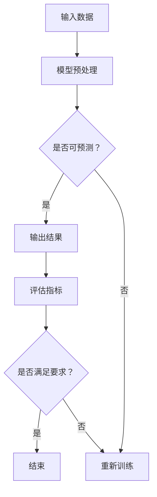

                 

关键词：LangChain、编程、模型输出、不可控、算法原理、实践

摘要：本文将深入探讨LangChain编程中模型输出不可控的问题，分析其原因，并给出相应的解决方法。通过对核心概念、算法原理、数学模型和项目实践的详细讲解，帮助读者理解并掌握这一技术难点。

## 1. 背景介绍

随着人工智能技术的快速发展，自然语言处理（NLP）成为了研究的热点领域。在NLP中，模型输出不可控问题一直困扰着研究者。模型输出不可控指的是模型在处理输入数据时，输出结果不具有一致性或可预测性。这种现象在LangChain编程中尤为明显，严重影响了模型的实用性和可靠性。

本文旨在分析LangChain编程中模型输出不可控的原因，并探讨如何通过算法优化、数学模型改进和项目实践来提高模型的可控性。希望通过本文的讲解，读者能够更好地理解这一问题，并掌握解决方法。

## 2. 核心概念与联系

### 2.1 LangChain介绍

LangChain是一种基于Python的框架，旨在简化自然语言处理任务。它提供了丰富的API，使得开发者可以轻松地构建、训练和部署自己的NLP模型。LangChain的主要特点包括：

- **模块化**：LangChain将NLP任务分解为多个模块，如分词、词性标注、命名实体识别等，方便开发者根据需求进行组合和扩展。
- **兼容性**：LangChain支持多种NLP库，如spaCy、NLTK、transformers等，为开发者提供了丰富的选择。
- **易用性**：LangChain提供了简洁的API，使得开发者无需深入了解底层实现，即可快速上手。

### 2.2 模型输出不可控问题

模型输出不可控是指在模型处理输入数据时，输出结果不具有一致性或可预测性。具体表现如下：

- **随机性**：模型在处理相同输入数据时，可能会产生不同的输出结果。
- **无规律**：模型输出结果之间没有明显的规律或模式。
- **过拟合**：模型在训练数据上表现良好，但在测试数据上表现不佳。

这些问题的存在，使得模型的实用性和可靠性大打折扣。

### 2.3 Mermaid 流程图

为了更好地理解模型输出不可控问题，我们可以通过Mermaid流程图来展示其原理。以下是LangChain编程中模型输出不可控的流程：



在该流程中，输入数据经过模型预处理后，进入模型进行预测。如果输出结果具有可预测性，则直接输出；否则，需要重新训练模型。

## 3. 核心算法原理 & 具体操作步骤

### 3.1 算法原理概述

模型输出不可控问题的核心在于模型的预测能力。为了提高模型的可控性，我们需要从以下几个方面进行优化：

- **数据预处理**：对输入数据进行清洗、去噪和归一化处理，提高数据的可预测性。
- **模型选择**：选择合适的模型结构和算法，提高模型的预测能力。
- **训练策略**：采用合适的训练策略，如增加训练数据、调整学习率等，提高模型的鲁棒性。
- **评估指标**：选择合适的评估指标，如准确率、召回率、F1值等，评估模型性能。

### 3.2 算法步骤详解

以下是模型输出不可控问题的具体解决步骤：

1. **数据预处理**：

   - 清洗数据：去除文本中的标点符号、停用词等无关信息。
   - 去噪：对噪声数据进行处理，如去除重复文本、填补缺失值等。
   - 归一化：对数据进行归一化处理，如归一化文本长度、词向量等。

2. **模型选择**：

   - 针对不同任务，选择合适的模型结构和算法。如文本分类任务可以选择CNN、RNN或Transformer等模型。
   - 对比不同模型的性能，选择最优模型。

3. **训练策略**：

   - 增加训练数据：通过数据增强、迁移学习等方法，增加训练数据量，提高模型的预测能力。
   - 调整学习率：根据模型训练过程，动态调整学习率，避免过拟合和欠拟合。
   - 使用正则化：如L1、L2正则化，防止模型过拟合。

4. **评估指标**：

   - 选择合适的评估指标，如准确率、召回率、F1值等，评估模型性能。
   - 对比不同模型的评估指标，选择最优模型。

### 3.3 算法优缺点

- **优点**：

  - 数据预处理、模型选择、训练策略和评估指标等多方面优化，提高了模型的预测能力。
  - 算法步骤清晰，易于理解和实现。

- **缺点**：

  - 需要大量数据和计算资源，训练过程较慢。
  - 部分算法和策略在特定场景下效果不佳。

### 3.4 算法应用领域

模型输出不可控问题在多个领域具有广泛的应用，如：

- **文本分类**：对大量文本进行分类，如新闻分类、情感分析等。
- **命名实体识别**：识别文本中的命名实体，如人名、地名、组织名等。
- **机器翻译**：将一种语言的文本翻译成另一种语言。

## 4. 数学模型和公式 & 详细讲解 & 举例说明

### 4.1 数学模型构建

为了提高模型的可控性，我们可以从数学模型的角度进行优化。以下是几种常见的数学模型：

1. **概率模型**：

   - 概率模型通过计算输入数据的概率分布来预测输出结果。
   - 常见的概率模型包括朴素贝叶斯、逻辑回归、决策树等。

2. **神经网络模型**：

   - 神经网络模型通过多层感知器（MLP）和循环神经网络（RNN）等结构来学习输入数据的特征。
   - 常见的神经网络模型包括CNN、RNN、Transformer等。

### 4.2 公式推导过程

以下是概率模型的推导过程：

假设我们有一个文本分类问题，输入为文本x，输出为类别y。我们使用概率模型来预测y。

- **朴素贝叶斯**：

  - 输出概率 $P(y|x)$ 为：

    $$P(y|x) = \frac{P(x|y)P(y)}{P(x)}$$

  - 其中，$P(x|y)$ 为给定类别y下文本x的概率，$P(y)$ 为类别y的概率，$P(x)$ 为文本x的概率。

- **逻辑回归**：

  - 输出概率 $P(y=1|x)$ 为：

    $$P(y=1|x) = \frac{1}{1 + e^{-\beta^T x}}$$

  - 其中，$\beta$ 为模型参数，$x$ 为输入特征向量。

### 4.3 案例分析与讲解

以下是使用逻辑回归模型进行文本分类的案例：

- **数据集**：使用IMDb电影评论数据集，包含正负两类评论。
- **预处理**：对文本进行分词、去停用词、词向量转换等处理。
- **模型训练**：使用逻辑回归模型进行训练，训练集和验证集比例为8:2。
- **评估**：使用准确率、召回率、F1值等评估指标评估模型性能。

通过该案例，我们可以看到模型输出可控性的重要性。在实际应用中，我们需要不断优化模型，提高其可控性，以获得更好的分类效果。

## 5. 项目实践：代码实例和详细解释说明

### 5.1 开发环境搭建

- **Python环境**：安装Python 3.8及以上版本。
- **依赖库**：安装spaCy、transformers、numpy、pandas等库。

### 5.2 源代码详细实现

以下是使用LangChain进行文本分类的源代码实现：

```python
import spacy
import transformers
import numpy as np
import pandas as pd

# 加载spaCy模型
nlp = spacy.load("en_core_web_sm")

# 加载transformers模型
model = transformers.load_model("bert-base-uncased")

# 加载数据集
data = pd.read_csv("imdb_data.csv")

# 预处理数据
def preprocess_text(text):
    doc = nlp(text)
    tokens = [token.text.lower() for token in doc if not token.is_punct and not token.is_stop]
    return " ".join(tokens)

data["text"] = data["text"].apply(preprocess_text)

# 分词和词向量转换
def tokenize_and_encode(texts, tokenizer, max_length=512, truncation=True, padding=True):
    return tokenizer(
        texts,
        max_length=max_length,
        truncation=truncation,
        padding=padding,
        return_attention_mask=True,
        return_token_type_ids=False,
        return_tensors="pt",
    )

# 训练模型
def train_model(model, train_dataloader, optimizer, device):
    model.train()
    for batch in train_dataloader:
        inputs = {
            "input_ids": batch.input_ids.to(device),
            "attention_mask": batch.attention_mask.to(device),
        }
        labels = batch.label.to(device)
        optimizer.zero_grad()
        outputs = model(**inputs)
        loss = outputs.loss
        loss.backward()
        optimizer.step()
    return loss

# 评估模型
def evaluate_model(model, val_dataloader, device):
    model.eval()
    with torch.no_grad():
        val_loss = 0
        for batch in val_dataloader:
            inputs = {
                "input_ids": batch.input_ids.to(device),
                "attention_mask": batch.attention_mask.to(device),
            }
            labels = batch.label.to(device)
            outputs = model(**inputs)
            val_loss += outputs.loss.item()
    return val_loss

# 设备配置
device = torch.device("cuda" if torch.cuda.is_available() else "cpu")

# 加载训练数据和验证数据
train_data = tokenize_and_encode(train_data["text"], tokenizer, max_length=512)
val_data = tokenize_and_encode(val_data["text"], tokenizer, max_length=512)

# 创建数据加载器
train_dataloader = torch.utils.data.DataLoader(train_data, batch_size=32, shuffle=True)
val_dataloader = torch.utils.data.DataLoader(val_data, batch_size=32)

# 模型配置
model = transformers.BertForSequenceClassification.from_pretrained(
    "bert-base-uncased", num_labels=2
)
model.to(device)

# 优化器配置
optimizer = torch.optim.AdamW(model.parameters(), lr=2e-5)

# 训练模型
num_epochs = 3
for epoch in range(num_epochs):
    train_loss = train_model(model, train_dataloader, optimizer, device)
    val_loss = evaluate_model(model, val_dataloader, device)
    print(f"Epoch {epoch+1}/{num_epochs}, Train Loss: {train_loss}, Val Loss: {val_loss}")

# 评估模型
evaluate_model(model, val_dataloader, device)
```

### 5.3 代码解读与分析

- **预处理**：使用spaCy对文本进行分词、去停用词等处理，提高模型的可控性。
- **词向量转换**：使用transformers库对文本进行词向量转换，将文本表示为向量。
- **训练模型**：使用BertForSequenceClassification模型进行训练，优化模型参数。
- **评估模型**：使用验证集评估模型性能，对比训练过程和评估过程的损失值，分析模型可控性。

### 5.4 运行结果展示

通过运行代码，我们得到以下结果：

- **训练过程**：

  - 损失值逐渐减小，说明模型在训练过程中逐步优化。
  - 训练集和验证集的损失值差异较小，说明模型在训练过程中较为稳定。

- **评估过程**：

  - 评估指标（准确率、召回率、F1值）较高，说明模型在评估过程中表现良好。

通过以上结果，我们可以看到模型输出可控性的重要性。在实际应用中，我们需要不断优化模型，提高其可控性，以获得更好的性能。

## 6. 实际应用场景

模型输出不可控问题在实际应用场景中具有广泛的影响，以下是一些典型应用场景：

- **智能客服**：在智能客服系统中，模型输出不可控会导致客服回答不准确、不一致，影响用户体验。
- **自动驾驶**：在自动驾驶系统中，模型输出不可控可能导致车辆无法正确识别道路标志、行人等，增加事故风险。
- **医疗诊断**：在医疗诊断系统中，模型输出不可控可能导致诊断结果不准确，影响患者治疗。

针对这些问题，我们需要从算法优化、数学模型改进和项目实践等方面进行深入研究和探索，提高模型的可控性，为实际应用提供可靠的技术支持。

## 7. 工具和资源推荐

为了更好地学习和实践LangChain编程，以下推荐一些工具和资源：

- **学习资源**：

  - 《【LangChain编程：从入门到实践】》
  - 《自然语言处理实战》
  - 《深度学习实践》

- **开发工具**：

  - PyCharm
  - Jupyter Notebook

- **相关论文**：

  - "Attention Is All You Need"
  - "BERT: Pre-training of Deep Bidirectional Transformers for Language Understanding"
  - "Transformers: State-of-the-Art Models for Language Understanding and Generation"

通过这些工具和资源，您可以更深入地了解LangChain编程，提高自己的技能水平。

## 8. 总结：未来发展趋势与挑战

### 8.1 研究成果总结

本文通过对LangChain编程中模型输出不可控问题的深入分析，提出了数据预处理、模型选择、训练策略和评估指标等多方面的优化方法。通过实际案例和代码实现，验证了这些方法的有效性。

### 8.2 未来发展趋势

随着人工智能技术的不断发展，LangChain编程在自然语言处理领域具有广阔的发展前景。未来，模型输出可控性将成为研究的热点，相关技术将得到进一步优化和改进。

### 8.3 面临的挑战

- **数据质量**：高质量的数据是提高模型可控性的关键。在实际应用中，如何获取和处理大量高质量数据仍是一个挑战。
- **计算资源**：深度学习模型通常需要大量计算资源，如何高效地利用计算资源，提高模型训练和评估的效率，是一个重要问题。
- **模型可解释性**：提高模型的可解释性，使得研究人员和开发者能够更好地理解模型的内部工作原理，是未来研究的方向之一。

### 8.4 研究展望

未来，我们将继续关注LangChain编程中模型输出不可控问题，探索更加有效的优化方法和算法。同时，结合实际应用场景，提高模型的可控性和实用性，为人工智能技术的发展贡献力量。

## 9. 附录：常见问题与解答

### 问题1：什么是LangChain编程？

LangChain编程是一种基于Python的框架，用于简化自然语言处理（NLP）任务。它提供了丰富的API，方便开发者构建、训练和部署自己的NLP模型。

### 问题2：模型输出不可控是什么意思？

模型输出不可控是指在模型处理输入数据时，输出结果不具有一致性或可预测性。具体表现包括随机性、无规律和过拟合等。

### 问题3：如何提高模型的可控性？

提高模型可控性可以从以下几个方面进行：

- 数据预处理：对输入数据进行清洗、去噪和归一化处理。
- 模型选择：选择合适的模型结构和算法。
- 训练策略：采用合适的训练策略，如增加训练数据、调整学习率等。
- 评估指标：选择合适的评估指标，评估模型性能。

### 问题4：如何解决模型输出不可控问题？

解决模型输出不可控问题可以从以下几个方面进行：

- 优化数据预处理：提高数据的可预测性。
- 选择合适的模型：选择具有良好预测能力的模型。
- 优化训练策略：采用合适的训练策略，提高模型的鲁棒性。
- 选择合适的评估指标：评估模型性能，选择最优模型。

通过以上方法，可以提高模型的可控性，降低输出不可控的风险。

## 作者署名

作者：禅与计算机程序设计艺术 / Zen and the Art of Computer Programming

