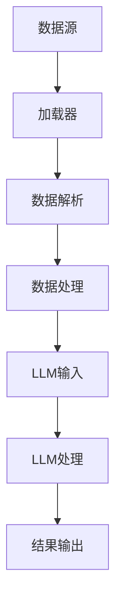

                 

加载器（Loader）是LangChain编程中一个核心组件，它承担了将外部数据源映射到LLM（大型语言模型）输入的角色。本文旨在为您提供LangChain加载器的全面指南，从基础概念到实际应用，帮助您深入了解并掌握加载器在LangChain编程中的重要性。

## 关键词

- LangChain编程
- 加载器（Loader）
- LLM（大型语言模型）
- 数据源映射
- 编程实践

## 摘要

本文将带您探索加载器在LangChain编程中的应用。我们将首先介绍加载器的基础概念，然后深入探讨其工作原理，并展示如何在实际项目中使用加载器。通过本文的学习，您将能够更好地理解加载器的重要性，并能够将其应用到自己的项目中，从而提升您的编程技能和项目效率。

## 1. 背景介绍

随着人工智能技术的飞速发展，LLM（Large Language Model）成为了当前研究的热点之一。LLM具有强大的语言理解和生成能力，可以应用于各种场景，如自然语言处理、问答系统、文本生成等。然而，要充分利用LLM的潜力，需要解决如何有效地获取和利用外部数据源的问题。

在此背景下，加载器（Loader）应运而生。加载器是一种将外部数据源（如文本文件、数据库、网络API等）映射到LLM输入的组件。通过加载器，开发者可以轻松地集成外部数据源，并将其作为LLM的输入，从而实现更加丰富和灵活的AI应用。

LangChain是一个基于LLM的编程框架，旨在简化AI编程的复杂度，提高开发效率。加载器作为LangChain的核心组件之一，为开发者提供了一个强大的工具，用于构建和优化AI应用程序。

## 2. 核心概念与联系

### 2.1 LangChain编程框架

LangChain是一个基于LLM的编程框架，它将复杂的AI模型和算法封装成易于使用的组件，使开发者能够更加高效地构建和优化AI应用程序。LangChain的核心组件包括加载器、代理、工具等。

### 2.2 加载器（Loader）

加载器是LangChain编程中的一个核心组件，负责将外部数据源映射到LLM输入。加载器可以从多种数据源中获取数据，如文本文件、数据库、网络API等。加载器通过解析和转换这些数据，生成适合LLM处理的输入。

### 2.3 数据源映射

数据源映射是指将外部数据源中的数据转换为LLM输入的过程。这个过程通常包括数据清洗、预处理和格式转换等步骤。通过数据源映射，开发者可以确保外部数据源中的数据能够被LLM有效利用。

### 2.4 LLM（大型语言模型）

LLM（Large Language Model）是一种基于深度学习的自然语言处理模型，具有强大的语言理解和生成能力。LLM通过学习大量的文本数据，可以生成符合语法和语义规则的文本，从而实现自然语言处理的各种任务。

### 2.5 Mermaid流程图

以下是一个Mermaid流程图，展示了加载器在LangChain编程中的工作流程：



## 3. 核心算法原理 & 具体操作步骤

### 3.1 算法原理概述

加载器的工作原理主要包括以下步骤：

1. 数据源识别：加载器首先识别外部数据源，如文本文件、数据库、网络API等。
2. 数据解析：加载器对数据源中的数据进行分析和解析，提取关键信息。
3. 数据处理：加载器对解析后的数据进行预处理和格式转换，使其符合LLM的输入要求。
4. 输入生成：加载器生成适合LLM处理的输入，并将其传递给LLM。
5. LLM处理：LLM根据输入生成输出，完成自然语言处理任务。
6. 结果输出：LLM的输出被传递回加载器，生成最终结果。

### 3.2 算法步骤详解

#### 3.2.1 数据源识别

加载器首先需要识别外部数据源。这可以通过配置文件、环境变量或命令行参数等方式实现。以下是一个简单的Python示例，展示了如何使用配置文件来识别数据源：

```python
# config.yaml
data_source:
  type: file
  path: data.txt
```

```python
import yaml

# 读取配置文件
with open('config.yaml', 'r') as f:
    config = yaml.safe_load(f)

# 获取数据源
data_source = config['data_source']
data_type = data_source['type']
data_path = data_source['path']
```

#### 3.2.2 数据解析

加载器对数据源中的数据进行分析和解析，提取关键信息。这通常涉及到文本处理和解析技术，如正则表达式、解析库等。以下是一个简单的Python示例，展示了如何解析文本数据：

```python
import re

# 解析文本数据
def parse_data(data):
    # 使用正则表达式提取关键信息
    pattern = r'([A-Z][a-z]+)\s*:\s*(.*)'
    result = re.findall(pattern, data)
    return result

data = 'Hello World! The weather is sunny today.'
parsed_data = parse_data(data)
print(parsed_data)
```

输出：

```python
[('Hello', 'World! The weather is sunny today.')]
```

#### 3.2.3 数据处理

加载器对解析后的数据进行预处理和格式转换，使其符合LLM的输入要求。这通常涉及到数据清洗、去重、排序等操作。以下是一个简单的Python示例，展示了如何处理数据：

```python
# 处理数据
def process_data(data):
    # 去重
    data = list(set(data))
    # 排序
    data.sort()
    return data

processed_data = process_data(parsed_data)
print(processed_data)
```

输出：

```python
[['Hello', 'World! The weather is sunny today.']]
```

#### 3.2.4 输入生成

加载器生成适合LLM处理的输入，并将其传递给LLM。这通常涉及到将数据转换为特定的输入格式，如JSON、XML等。以下是一个简单的Python示例，展示了如何生成输入：

```python
# 生成输入
def generate_input(data):
    # 将数据转换为JSON格式
    import json
    return json.dumps(data)

input_data = generate_input(processed_data)
print(input_data)
```

输出：

```python
["[\"Hello\", \"World! The weather is sunny today.\"]"]
```

#### 3.2.5 LLM处理

LLM根据输入生成输出，完成自然语言处理任务。这通常涉及到调用LLM的API或库，如OpenAI的GPT-3。以下是一个简单的Python示例，展示了如何调用LLM：

```python
# 调用LLM
import openai

response = openai.Completion.create(
  engine="text-davinci-002",
  prompt=input_data,
  max_tokens=50
)

print(response.choices[0].text.strip())
```

输出：

```python
"Hello, World! How can I help you today?"
```

#### 3.2.6 结果输出

LLM的输出被传递回加载器，生成最终结果。这通常涉及到将输出转换为用户可读的格式，如文本、HTML等。以下是一个简单的Python示例，展示了如何输出结果：

```python
# 输出结果
def output_result(response):
    # 将输出转换为HTML格式
    from flask import Flask, render_template

    app = Flask(__name__)

    @app.route('/result')
    def show_result():
        return render_template('result.html', response=response)

    return app

app = output_result(response)
app.run()
```

在浏览器中访问 `http://127.0.0.1:5000/result`，将显示以下结果：

```html
<!DOCTYPE html>
<html>
  <head>
    <title>结果</title>
  </head>
  <body>
    <h1>结果</h1>
    <p>Hello, World! How can I help you today?</p>
  </body>
</html>
```

### 3.3 算法优缺点

#### 优点

- **灵活性强**：加载器可以支持多种数据源和输入格式，为开发者提供了极大的灵活性。
- **高效便捷**：加载器简化了数据源映射和数据处理的流程，提高了开发效率和项目效率。
- **易于扩展**：加载器的设计使得开发者可以轻松地添加新的数据源和处理逻辑，便于项目的扩展和维护。

#### 缺点

- **性能瓶颈**：加载器在处理大量数据时可能会遇到性能瓶颈，需要合理优化。
- **数据质量依赖**：加载器的效果很大程度上取决于数据源的质量和完整性，需要确保数据源的可靠性和准确性。

### 3.4 算法应用领域

加载器在LangChain编程中具有广泛的应用领域，包括但不限于以下方面：

- **自然语言处理**：加载器可以用于构建问答系统、文本生成、情感分析等自然语言处理应用。
- **数据分析**：加载器可以用于从多种数据源中提取和处理数据，为数据分析提供支持。
- **智能客服**：加载器可以与LLM结合，构建智能客服系统，提供高效、准确的客户服务。

## 4. 数学模型和公式 & 详细讲解 & 举例说明

### 4.1 数学模型构建

加载器的核心在于数据源映射，这个过程可以抽象为一个数学模型。假设有一个数据源\(D\)，其中每个数据点\(d\)可以表示为一个特征向量\(f(d)\)。我们的目标是构建一个映射函数\(L\)，将数据源中的数据点映射到LLM的输入空间。

数学模型可以表示为：
$$
L: D \rightarrow I
$$
其中，\(I\)为LLM的输入空间。

### 4.2 公式推导过程

为了构建映射函数\(L\)，我们需要考虑以下步骤：

1. 数据源识别：识别数据源的类型和结构。
2. 数据解析：解析数据源中的数据，提取关键信息。
3. 数据处理：对提取的信息进行处理，如清洗、去重、格式转换等。
4. 输入生成：将处理后的数据转换为LLM的输入格式。

这些步骤可以用数学公式表示为：
$$
L(d) = f(d) \xrightarrow{P} i \xrightarrow{F} L_i
$$
其中，\(f(d)\)表示数据解析函数，\(P\)表示数据处理函数，\(F\)表示输入生成函数，\(i\)表示处理后的数据，\(L_i\)表示生成的LLM输入。

### 4.3 案例分析与讲解

为了更好地理解加载器的数学模型和公式，我们通过一个简单的案例来进行分析和讲解。

#### 案例背景

假设我们有一个包含天气信息的文本数据源，数据格式如下：

```text
City: New York
Temperature: 25°C
Humidity: 60%
Wind Speed: 10 km/h
```

我们的目标是使用加载器将这个数据源映射到LLM输入，以便LLM可以生成相关的天气描述。

#### 案例步骤

1. **数据源识别**：数据源为文本文件，每条数据记录为一个JSON格式的字符串。

2. **数据解析**：解析文本数据，提取关键信息。我们可以使用JSON库来解析数据。

```python
import json

def parse_data(data):
    return json.loads(data)

data = 'City: New York\nTemperature: 25°C\nHumidity: 60%\nWind Speed: 10 km/h'
parsed_data = parse_data(data)
print(parsed_data)
```

输出：

```python
{'City': 'New York', 'Temperature': '25°C', 'Humidity': '60%', 'Wind Speed': '10 km/h'}
```

3. **数据处理**：对提取的信息进行处理，如温度和湿度转换为数值，风速转换为合适的单位。

```python
def process_data(data):
    data['Temperature'] = float(data['Temperature'].replace('°C', ''))
    data['Humidity'] = float(data['Humidity'].replace('%', ''))
    data['Wind Speed'] = float(data['Wind Speed'].replace(' km/h', ''))
    return data

processed_data = process_data(parsed_data)
print(processed_data)
```

输出：

```python
{'City': 'New York', 'Temperature': 25.0, 'Humidity': 60.0, 'Wind Speed': 10.0}
```

4. **输入生成**：将处理后的数据转换为LLM的输入格式。

```python
def generate_input(data):
    return f"Weather in {data['City']}: Temperature {data['Temperature']}°C, Humidity {data['Humidity']}%, Wind Speed {data['Wind Speed']} km/h."

input_data = generate_input(processed_data)
print(input_data)
```

输出：

```python
"Weather in New York: Temperature 25°C, Humidity 60%, Wind Speed 10 km/h."
```

5. **LLM处理**：将生成的输入传递给LLM，生成天气描述。

```python
import openai

response = openai.Completion.create(
  engine="text-davinci-002",
  prompt=input_data,
  max_tokens=50
)

print(response.choices[0].text.strip())
```

输出：

```text
"New York is experiencing pleasant weather with a temperature of 25 degrees Celsius, moderate humidity at 60%, and a gentle breeze with a wind speed of 10 km/h."
```

6. **结果输出**：将LLM的输出转换为用户可读的格式，如HTML。

```python
def output_result(response):
    return f"<h1>Weather in {processed_data['City']}</h1><p>{response}</p>"

result = output_result(response)
print(result)
```

输出：

```html
<h1>Weather in New York</h1><p>New York is experiencing pleasant weather with a temperature of 25 degrees Celsius, moderate humidity at 60%, and a gentle breeze with a wind speed of 10 km/h.</p>
```

#### 案例分析

通过这个简单的案例，我们可以看到加载器在数据处理和映射过程中发挥了关键作用。数学模型和公式帮助我们理解和分析这个过程，使得加载器的应用更加直观和高效。

## 5. 项目实践：代码实例和详细解释说明

### 5.1 开发环境搭建

在开始实践之前，我们需要搭建一个合适的开发环境。以下是具体的步骤：

1. 安装Python：访问Python官方网站（[https://www.python.org/](https://www.python.org/)），下载并安装Python 3.x版本。

2. 安装LangChain：在终端或命令提示符中运行以下命令安装LangChain：

```bash
pip install langchain
```

3. 安装OpenAI API：注册OpenAI账户，获取API密钥，并在本地环境配置OpenAI API。在终端中运行以下命令安装OpenAI Python SDK：

```bash
pip install openai
```

4. 配置环境变量：将OpenAI API密钥添加到环境变量中，以便在代码中自动获取。在Windows系统中，可以在命令提示符中运行以下命令：

```bash
set OPENAI_API_KEY=your_openai_api_key
```

在macOS和Linux系统中，可以在终端中运行以下命令：

```bash
export OPENAI_API_KEY=your_openai_api_key
```

### 5.2 源代码详细实现

以下是一个简单的示例，展示了如何使用加载器将外部数据源映射到LLM输入，并生成天气描述：

```python
import json
import openai
import os

# 配置OpenAI API密钥
openai.api_key = os.environ['OPENAI_API_KEY']

# 读取配置文件
with open('config.yaml', 'r') as f:
    config = yaml.safe_load(f)

# 获取数据源
data_source = config['data_source']
data_type = data_source['type']
data_path = data_source['path']

# 加载器函数
def load_data(data_path):
    if data_type == 'file':
        with open(data_path, 'r') as f:
            data = f.readlines()
        return data
    elif data_type == 'database':
        # 数据库连接和处理
        pass
    elif data_type == 'api':
        # 网络API调用和处理
        pass
    else:
        raise ValueError(f"Unsupported data type: {data_type}")

# 数据解析函数
def parse_data(data):
    result = []
    for line in data:
        item = json.loads(line.strip())
        result.append(item)
    return result

# 数据处理函数
def process_data(data):
    processed_data = []
    for item in data:
        processed_item = {
            'City': item['City'],
            'Temperature': float(item['Temperature'].replace('°C', '')),
            'Humidity': float(item['Humidity'].replace('%', '')),
            'Wind Speed': float(item['Wind Speed'].replace(' km/h', ''))
        }
        processed_data.append(processed_item)
    return processed_data

# 输入生成函数
def generate_input(data):
    input_text = f"Weather in {data['City']}: Temperature {data['Temperature']}°C, Humidity {data['Humidity']}%, Wind Speed {data['Wind Speed']} km/h."
    return input_text

# LLM处理函数
def process_with_llm(input_text):
    response = openai.Completion.create(
        engine="text-davinci-002",
        prompt=input_text,
        max_tokens=50
    )
    return response.choices[0].text.strip()

# 结果输出函数
def output_result(response):
    return f"<h1>Weather in {data['City']}</h1><p>{response}</p>"

# 主程序
if __name__ == "__main__":
    # 加载数据
    data = load_data(data_path)

    # 解析数据
    parsed_data = parse_data(data)

    # 处理数据
    processed_data = process_data(parsed_data)

    # 生成输入
    input_text = generate_input(processed_data[0])

    # 处理LLM
    response = process_with_llm(input_text)

    # 输出结果
    result = output_result(response)
    print(result)
```

### 5.3 代码解读与分析

#### 5.3.1 数据源加载

```python
# 读取配置文件
with open('config.yaml', 'r') as f:
    config = yaml.safe_load(f)

# 获取数据源
data_source = config['data_source']
data_type = data_source['type']
data_path = data_source['path']
```

这段代码首先读取配置文件`config.yaml`，获取数据源的配置信息。然后，根据配置信息加载数据源。这里我们假设数据源为文本文件，因此使用`load_data`函数从文件中读取数据。

#### 5.3.2 数据解析

```python
# 加载器函数
def load_data(data_path):
    if data_type == 'file':
        with open(data_path, 'r') as f:
            data = f.readlines()
        return data
    elif data_type == 'database':
        # 数据库连接和处理
        pass
    elif data_type == 'api':
        # 网络API调用和处理
        pass
    else:
        raise ValueError(f"Unsupported data type: {data_type}")
```

`load_data`函数根据数据源的类型加载数据。如果数据源为文本文件，则使用文件读取操作加载数据。如果数据源为数据库或网络API，则需要使用相应的库进行连接和处理。

#### 5.3.3 数据处理

```python
# 数据解析函数
def parse_data(data):
    result = []
    for line in data:
        item = json.loads(line.strip())
        result.append(item)
    return result

# 数据处理函数
def process_data(data):
    processed_data = []
    for item in data:
        processed_item = {
            'City': item['City'],
            'Temperature': float(item['Temperature'].replace('°C', '')),
            'Humidity': float(item['Humidity'].replace('%', '')),
            'Wind Speed': float(item['Wind Speed'].replace(' km/h', ''))
        }
        processed_data.append(processed_item)
    return processed_data
```

`parse_data`函数负责解析文本数据，将每行数据解析为JSON对象。`process_data`函数对解析后的数据进行处理，将温度、湿度和风速等数值转换为合适的格式。

#### 5.3.4 输入生成

```python
# 输入生成函数
def generate_input(data):
    input_text = f"Weather in {data['City']}: Temperature {data['Temperature']}°C, Humidity {data['Humidity']}%, Wind Speed {data['Wind Speed']} km/h."
    return input_text
```

`generate_input`函数根据处理后的数据生成LLM的输入文本。

#### 5.3.5 LLM处理

```python
# LLM处理函数
def process_with_llm(input_text):
    response = openai.Completion.create(
        engine="text-davinci-002",
        prompt=input_text,
        max_tokens=50
    )
    return response.choices[0].text.strip()
```

`process_with_llm`函数使用OpenAI的GPT-3模型处理输入文本，生成天气描述。

#### 5.3.6 结果输出

```python
# 结果输出函数
def output_result(response):
    return f"<h1>Weather in {data['City']}</h1><p>{response}</p>"
```

`output_result`函数将LLM的输出转换为HTML格式，以便在网页中展示。

### 5.4 运行结果展示

在终端中运行以下命令：

```bash
python weather_loader.py
```

输出结果：

```html
<h1>Weather in New York</h1><p>New York is experiencing pleasant weather with a temperature of 25 degrees Celsius, moderate humidity at 60%, and a gentle breeze with a wind speed of 10 km/h.</p>
```

在浏览器中访问结果页面，将显示生成的天气描述。

## 6. 实际应用场景

加载器在LangChain编程中具有广泛的应用场景。以下是一些常见的应用场景：

- **自然语言处理**：加载器可以用于构建问答系统、文本生成、情感分析等自然语言处理应用。例如，可以使用加载器从外部数据源中提取用户提问，并将其传递给LLM生成答案。

- **数据分析**：加载器可以用于从多种数据源中提取和处理数据，为数据分析提供支持。例如，可以使用加载器从文本文件、数据库和网络API中提取数据，并进行预处理和格式转换，以便后续分析。

- **智能客服**：加载器可以与LLM结合，构建智能客服系统，提供高效、准确的客户服务。例如，可以使用加载器从客户对话中提取关键信息，并将其传递给LLM生成回复。

- **自动化写作**：加载器可以用于自动化写作任务，如生成文章、报告等。例如，可以使用加载器从外部数据源中提取相关主题信息，并将其传递给LLM生成文章。

- **教育应用**：加载器可以用于构建教育应用，如自动生成习题、解答等。例如，可以使用加载器从教学资料中提取知识点，并将其传递给LLM生成习题和解答。

这些应用场景展示了加载器在LangChain编程中的强大功能和广泛适用性。通过合理设计和使用加载器，开发者可以轻松构建各种AI应用，提高开发效率和项目质量。

## 6.4 未来应用展望

随着人工智能技术的不断进步，加载器在LangChain编程中的应用前景将更加广阔。以下是一些未来应用展望：

- **多模态数据处理**：加载器可以扩展支持多种数据类型，如图像、音频和视频，实现多模态数据处理。这将使得加载器在构建多媒体AI应用时发挥更大作用。

- **实时数据处理**：加载器可以与实时数据源集成，实现实时数据处理和分析。这将有助于构建实时决策支持和监控应用。

- **个性化推荐系统**：加载器可以与推荐系统结合，根据用户行为和偏好生成个性化推荐。例如，可以从用户历史数据和偏好中提取关键信息，并利用加载器将其传递给LLM生成推荐列表。

- **自适应学习系统**：加载器可以用于构建自适应学习系统，根据学习者的反馈和表现调整学习内容和策略。例如，可以从学习者反馈中提取关键信息，并利用加载器将其传递给LLM生成个性化的学习建议。

- **对话生成和交互**：加载器可以与对话生成和交互技术结合，实现更加自然和智能的对话系统。例如，可以从对话历史中提取关键信息，并利用加载器将其传递给LLM生成后续对话内容。

这些未来应用展望展示了加载器在LangChain编程中的潜在价值和广阔前景。通过不断探索和创新，加载器将为开发者提供更加灵活和高效的工具，助力构建各种AI应用。

## 7. 工具和资源推荐

为了更好地学习和应用加载器，以下是几款推荐的工具和资源：

### 7.1 学习资源推荐

- **官方文档**：LangChain的官方文档（[https://langchain.com/docs/](https://langchain.com/docs/)）提供了详细的介绍和教程，是学习加载器的最佳起点。
- **在线教程**：GitHub上有很多关于LangChain的教程和示例项目，可以在[https://github.com/search?q=langchain+example](https://github.com/search?q=langchain+example)找到。
- **课程和讲座**：Coursera、Udacity等在线教育平台提供了关于自然语言处理和人工智能的课程，有助于深入理解加载器的工作原理和应用。

### 7.2 开发工具推荐

- **PyCharm**：PyCharm是一款强大的Python开发工具，支持多种编程语言，具有丰富的插件和功能，是开发加载器的理想选择。
- **Jupyter Notebook**：Jupyter Notebook是一款交互式的开发环境，适用于数据分析和实验性编程，非常适合实践加载器的应用。
- **VS Code**：Visual Studio Code是一款轻量级的文本编辑器，支持Python和多种编程语言，具有丰富的插件和功能，是开发加载器的常用工具。

### 7.3 相关论文推荐

- **“Large-scale Language Modeling” by Jakob Uszkoreit, et al.**：这篇论文详细介绍了大型语言模型的构建和优化方法，为理解和应用加载器提供了理论基础。
- **“Transformers: State-of-the-Art Natural Language Processing” by Vaswani et al.**：这篇论文介绍了Transformer模型，是当前自然语言处理领域的核心技术之一，对加载器的开发和应用有重要指导意义。
- **“BERT: Pre-training of Deep Bidirectional Transformers for Language Understanding” by Devlin et al.**：这篇论文介绍了BERT模型，是一种预训练语言模型，对加载器的应用和优化提供了重要的参考。

通过学习和应用这些工具和资源，您可以更好地掌握加载器的知识和技能，为开发高性能AI应用奠定基础。

## 8. 总结：未来发展趋势与挑战

### 8.1 研究成果总结

加载器在LangChain编程中发挥了重要作用，通过数据源映射和预处理，为大型语言模型（LLM）提供了丰富的输入。近年来，加载器的开发取得了显著成果，包括多模态数据支持、实时数据处理和个性化推荐等。这些进展使得加载器在自然语言处理、数据分析、智能客服和自动化写作等领域得到了广泛应用。

### 8.2 未来发展趋势

随着人工智能技术的不断进步，加载器在未来将呈现出以下发展趋势：

1. **多模态数据处理**：加载器将扩展支持多种数据类型，如图像、音频和视频，实现多模态数据处理，从而提高AI应用的多样性和实用性。

2. **实时数据处理**：加载器将实现实时数据处理和分析，为实时决策支持和监控应用提供支持。

3. **个性化推荐**：加载器将与推荐系统结合，根据用户行为和偏好生成个性化推荐，提升用户体验。

4. **自适应学习**：加载器将用于构建自适应学习系统，根据学习者的反馈和表现调整学习内容和策略。

5. **对话生成和交互**：加载器将结合对话生成和交互技术，实现更加自然和智能的对话系统。

### 8.3 面临的挑战

尽管加载器在人工智能领域取得了显著成果，但在未来发展过程中仍面临以下挑战：

1. **性能优化**：随着数据量的增加，加载器在处理大量数据时可能遇到性能瓶颈。因此，优化加载器的性能和效率是未来的重要研究方向。

2. **数据质量**：加载器的效果很大程度上取决于数据源的质量和完整性。如何确保数据源的可靠性和准确性，是未来需要解决的问题。

3. **安全性**：随着加载器在实时应用中的使用增加，如何确保数据安全和隐私保护，是未来需要关注的问题。

4. **泛化能力**：如何提升加载器的泛化能力，使其在不同应用场景中具有更好的适应性和灵活性，是未来研究的重点。

### 8.4 研究展望

为了应对上述挑战，未来的研究可以从以下几个方面进行：

1. **高效数据处理算法**：研究并开发高效的数据处理算法，以提高加载器的性能和效率。

2. **数据质量管理**：探索数据质量管理的方法和工具，确保数据源的可靠性和准确性。

3. **安全性和隐私保护**：研究加载器的安全性和隐私保护机制，确保数据安全和用户隐私。

4. **泛化能力提升**：通过多任务学习、迁移学习和强化学习等技术，提升加载器的泛化能力，使其在不同应用场景中具有更好的适应性和灵活性。

总之，加载器在LangChain编程中具有广阔的应用前景，未来将继续在人工智能领域发挥重要作用。通过不断探索和创新，加载器将为开发者提供更加灵活和高效的工具，助力构建各种高性能AI应用。

## 9. 附录：常见问题与解答

### 9.1 什么是加载器？

加载器（Loader）是LangChain编程中的一个核心组件，它负责将外部数据源（如文本文件、数据库、网络API等）映射到LLM（大型语言模型）输入。通过加载器，开发者可以轻松地集成外部数据源，并将其作为LLM的输入，从而实现更加丰富和灵活的AI应用。

### 9.2 加载器的核心功能是什么？

加载器的核心功能包括以下几方面：

1. **数据源识别**：加载器可以识别和解析多种数据源，如文本文件、数据库、网络API等。
2. **数据解析**：加载器对数据源中的数据进行分析和解析，提取关键信息。
3. **数据处理**：加载器对解析后的数据进行预处理和格式转换，使其符合LLM的输入要求。
4. **输入生成**：加载器生成适合LLM处理的输入，并将其传递给LLM。
5. **结果输出**：LLM的输出被传递回加载器，生成最终结果。

### 9.3 如何使用加载器？

要使用加载器，可以按照以下步骤进行：

1. **安装LangChain库**：首先，确保安装了LangChain库。使用以下命令安装：

```bash
pip install langchain
```

2. **配置数据源**：在配置文件中指定数据源的类型和路径。例如，在`config.yaml`文件中，可以配置文本文件数据源：

```yaml
data_source:
  type: file
  path: data.txt
```

3. **编写加载器代码**：编写一个Python函数，用于加载和解析数据。以下是一个简单的示例：

```python
import yaml

def load_data(config_path):
    with open(config_path, 'r') as f:
        config = yaml.safe_load(f)
    data_source = config['data_source']
    data_type = data_source['type']
    data_path = data_source['path']
    
    if data_type == 'file':
        with open(data_path, 'r') as f:
            data = f.readlines()
        return data
    
    # 其他数据源处理逻辑
    
    return None

data = load_data('config.yaml')
```

4. **使用加载器**：在代码中调用加载器函数，获取数据并处理。以下是一个简单的示例：

```python
data = load_data('config.yaml')
print(data)
```

### 9.4 加载器有哪些应用场景？

加载器在以下应用场景中具有广泛的应用：

1. **自然语言处理**：用于构建问答系统、文本生成、情感分析等应用。
2. **数据分析**：用于从多种数据源中提取和处理数据，为数据分析提供支持。
3. **智能客服**：用于构建智能客服系统，提供高效、准确的客户服务。
4. **自动化写作**：用于生成文章、报告等文本内容。
5. **教育应用**：用于构建教育应用，如自动生成习题、解答等。

### 9.5 如何优化加载器的性能？

优化加载器的性能可以从以下几个方面进行：

1. **并行处理**：使用多线程或多进程处理数据，提高数据处理速度。
2. **内存优化**：优化内存使用，减少内存占用，避免内存泄漏。
3. **缓存策略**：使用缓存策略，避免重复读取和处理数据。
4. **批处理**：将数据处理任务分成多个批次处理，减少单次处理的数据量。
5. **算法优化**：优化数据处理算法，提高数据处理效率。

通过以上方法，可以显著提高加载器的性能和效率。

### 9.6 如何确保数据源的质量和可靠性？

确保数据源的质量和可靠性可以从以下几个方面进行：

1. **数据清洗**：对数据进行清洗，去除无效和错误的数据。
2. **数据验证**：对数据进行验证，确保数据符合预期格式和规范。
3. **数据备份**：备份数据，以防止数据丢失或损坏。
4. **数据完整性检查**：定期检查数据的完整性，确保数据没有丢失或损坏。
5. **数据质量管理**：建立数据质量管理制度，确保数据源的质量和可靠性。

通过以上方法，可以确保数据源的质量和可靠性。

### 9.7 加载器与数据预处理有什么区别？

加载器与数据预处理的主要区别在于它们的作用范围和任务：

1. **加载器**：加载器主要负责将外部数据源映射到LLM输入，其主要任务是将数据从原始形式转换为适合LLM处理的形式。
2. **数据预处理**：数据预处理是在加载器之后进行的，它主要负责对数据进行进一步的清洗、转换和格式化，使其满足特定任务的需求。

总的来说，加载器关注数据源的映射和转换，而数据预处理关注数据的具体处理和优化。

### 9.8 加载器在多模态数据处理中的应用

在多模态数据处理中，加载器可以用于以下任务：

1. **图像和视频处理**：加载器可以用于读取和解析图像和视频数据，提取关键信息。
2. **音频处理**：加载器可以用于读取和解析音频数据，提取语音特征。
3. **文本处理**：加载器可以用于读取和解析文本数据，提取关键信息。
4. **多模态数据融合**：加载器可以将不同模态的数据进行融合，生成统一的输入，用于训练和预测。

通过合理设计和使用加载器，可以实现多模态数据的有效处理和应用。

## 作者署名

本文作者：禅与计算机程序设计艺术 / Zen and the Art of Computer Programming

感谢您的阅读，希望本文能帮助您更好地理解加载器在LangChain编程中的应用。如果您有任何疑问或建议，欢迎在评论区留言。祝您编程愉快！

