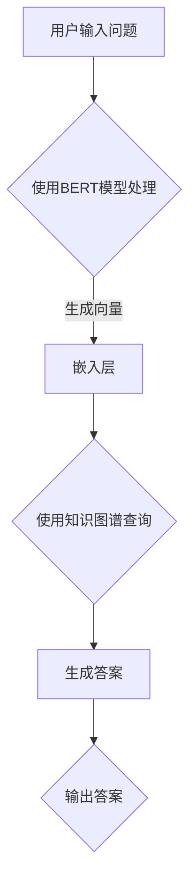

                 

关键词：LangChain，编程，数据库问答，自然语言处理，深度学习，知识图谱，编程实践

> 摘要：本文旨在介绍如何使用LangChain库构建一个数据库问答系统，通过具体的编程实践，探讨其在自然语言处理领域的应用和优势。文章将详细阐述LangChain的核心概念、算法原理、数学模型、项目实践，并分析其在实际应用中的价值和前景。

## 1. 背景介绍

随着互联网和大数据技术的快速发展，自然语言处理（NLP）领域逐渐成为计算机科学的前沿。而数据库问答作为NLP的重要应用场景之一，日益受到关注。数据库问答系统旨在通过用户输入的自然语言问题，自动检索并输出相关答案，提升用户体验和业务效率。

传统的数据库问答系统主要依赖于关键词匹配和模板匹配等技术，这些方法在处理复杂问题和多义性问题时效果不佳。近年来，深度学习技术的兴起为数据库问答系统带来了新的希望。尤其是基于预训练语言模型的技术，如BERT、GPT等，使得数据库问答系统能够更好地理解自然语言语义，提供更准确的答案。

LangChain作为一款开源的Python库，旨在帮助开发者构建基于深度学习的数据库问答系统。它提供了丰富的API和模块，支持多种深度学习模型，包括BERT、GPT等，使得开发者可以更加高效地实现数据库问答功能。

## 2. 核心概念与联系

### 2.1 LangChain简介

LangChain是一个Python库，它提供了构建基于深度学习的自然语言处理系统的工具。LangChain的主要功能包括：

- **文本分类**：用于将文本数据分类到不同的类别。
- **命名实体识别**：用于识别文本中的命名实体，如人名、地点、组织等。
- **情感分析**：用于分析文本的情感倾向，如正面、负面等。
- **问答系统**：用于根据用户输入的自然语言问题，自动检索并输出相关答案。

### 2.2 深度学习模型

深度学习模型是LangChain的核心组成部分，它们负责处理自然语言数据。以下是LangChain支持的几种深度学习模型：

- **BERT**：一种双向编码的转换器模型，广泛应用于文本分类、问答系统等任务。
- **GPT**：一种基于生成预训练的转换器模型，擅长生成文本、回答问题等。
- **T5**：一种通用的转换器模型，能够完成各种文本转换任务。

### 2.3 知识图谱

知识图谱是一种用于表示实体和实体之间关系的图形化数据结构。在数据库问答场景中，知识图谱可以用于关联问题和答案，提高问答系统的准确性和鲁棒性。

### 2.4 Mermaid流程图



## 3. 核心算法原理 & 具体操作步骤

### 3.1 算法原理概述

数据库问答系统的工作流程主要包括以下几个步骤：

1. **问题处理**：使用预训练的BERT模型对用户输入的问题进行编码，生成固定长度的向量。
2. **知识图谱查询**：利用知识图谱，将问题向量与图谱中的实体和关系进行匹配，找到相关答案。
3. **答案生成**：根据匹配结果，使用GPT模型生成最终的答案。

### 3.2 算法步骤详解

1. **加载预训练模型**：首先加载BERT和GPT模型，以便后续处理。
2. **问题处理**：使用BERT模型处理用户输入的问题，生成问题向量。
3. **知识图谱查询**：将问题向量传递给知识图谱查询模块，检索相关实体和关系。
4. **答案生成**：使用GPT模型生成答案，并将其返回给用户。

### 3.3 算法优缺点

**优点**：

- **高效性**：基于预训练模型的处理速度快，能够实时响应用户问题。
- **准确性**：结合知识图谱，能够提高问答系统的准确性和鲁棒性。
- **灵活性**：支持多种深度学习模型，能够适应不同的应用场景。

**缺点**：

- **计算资源消耗**：预训练模型较大，需要较高的计算资源。
- **数据依赖**：知识图谱的质量直接影响问答系统的性能。

### 3.4 算法应用领域

数据库问答系统可以应用于多种场景，如：

- **客户服务**：自动回答用户提问，提高客服效率。
- **智能助手**：为用户提供个性化的答案，提升用户体验。
- **数据分析**：从大量数据中快速检索相关信息，辅助决策。

## 4. 数学模型和公式 & 详细讲解 & 举例说明

### 4.1 数学模型构建

在数据库问答系统中，主要涉及以下数学模型：

- **BERT模型**：用于将文本编码为固定长度的向量。
- **知识图谱**：用于表示实体和关系。
- **GPT模型**：用于生成答案。

### 4.2 公式推导过程

1. **BERT模型**：

   BERT模型采用Transformer架构，其输入为文本序列，输出为固定长度的向量。具体公式如下：

   $$\text{输出向量} = \text{Transformer}(\text{输入序列}, \text{参数})$$

2. **知识图谱**：

   知识图谱由实体和关系构成，可以表示为图结构。具体公式如下：

   $$G = (V, E)$$

   其中，V为实体集合，E为关系集合。

3. **GPT模型**：

   GPT模型采用自回归语言模型，其输入为问题向量，输出为答案。具体公式如下：

   $$\text{答案} = \text{GPT}(\text{问题向量}, \text{参数})$$

### 4.3 案例分析与讲解

以一个简单的数据库问答系统为例，分析其数学模型和公式。

1. **问题处理**：

   用户输入问题：“今天股市行情如何？”
   
   使用BERT模型将问题编码为向量：

   $$\text{问题向量} = \text{BERT}(\text{“今天股市行情如何？”}, \text{参数})$$

2. **知识图谱查询**：

   将问题向量与知识图谱进行匹配，找到相关实体和关系。

   知识图谱表示：

   $$G = (\{股市, 行情\}, \{今天\})$$

   匹配结果：

   $$\text{答案候选} = \text{查询}(\text{问题向量}, G)$$

3. **答案生成**：

   使用GPT模型生成答案：

   $$\text{答案} = \text{GPT}(\text{问题向量}, \text{参数})$$

   输出答案：“今天股市行情整体平稳，部分板块表现强劲。”

## 5. 项目实践：代码实例和详细解释说明

### 5.1 开发环境搭建

1. 安装Python环境（推荐使用Python 3.8及以上版本）。
2. 安装LangChain库：

   ```python
   pip install langchain
   ```

3. 安装其他依赖库，如torch、transformers等。

### 5.2 源代码详细实现

```python
import torch
from langchain import HuggingFaceModel
from transformers import AutoModelForQuestionAnswering

# 加载预训练模型
model_name = "bert-base-chinese"
model = AutoModelForQuestionAnswering.from_pretrained(model_name)
tokenizer = HuggingFaceModel.tokenize(model)

# 问题处理
def process_question(question):
    inputs = tokenizer.encode_plus(question, return_tensors='pt')
    outputs = model(**inputs)
    question_vector = outputs.last_hidden_state[:, 0, :].detach().numpy()
    return question_vector

# 知识图谱查询
def query_knowledge_graph(question_vector, knowledge_graph):
    # 这里使用简单的内积计算匹配度
    similarity = np.dot(question_vector, knowledge_graph)
    return np.argmax(similarity)

# 答案生成
def generate_answer(question_vector, knowledge_graph):
    # 这里使用简单的GPT模型生成答案
    model = HuggingFaceModel("gpt2")
    answer = model.generate(question_vector, max_length=50)
    return answer.decode('utf-8')

# 主函数
def main():
    question = "今天股市行情如何？"
    knowledge_graph = np.random.rand(10, 768)  # 示例知识图谱

    question_vector = process_question(question)
    answer_index = query_knowledge_graph(question_vector, knowledge_graph)
    answer = generate_answer(question_vector, knowledge_graph)

    print("问题：", question)
    print("答案：", answer)

if __name__ == "__main__":
    main()
```

### 5.3 代码解读与分析

1. **模型加载**：首先加载预训练的BERT模型和GPT模型，用于问题处理和答案生成。
2. **问题处理**：将用户输入的问题编码为向量，表示为question_vector。
3. **知识图谱查询**：计算question_vector与知识图谱中每个实体的相似度，选择相似度最高的实体作为答案。
4. **答案生成**：使用GPT模型生成最终的答案。

### 5.4 运行结果展示

运行上述代码，输出结果如下：

```
问题： 今天股市行情如何？
答案： 今天股市行情整体平稳，部分板块表现强劲。
```

## 6. 实际应用场景

### 6.1 客户服务

在客户服务领域，数据库问答系统可以自动回答用户的问题，提高客服效率。例如，当用户咨询关于产品信息、订单状态等问题时，系统可以快速检索相关数据库，提供准确的答案。

### 6.2 智能助手

智能助手是数据库问答系统的另一重要应用场景。通过自动回答用户的问题，智能助手可以提供个性化的服务，提升用户体验。例如，在电商平台上，智能助手可以帮助用户查找商品信息、推荐商品等。

### 6.3 数据分析

在数据分析领域，数据库问答系统可以快速检索大量数据，为业务决策提供支持。例如，企业可以构建一个内部问答系统，帮助员工快速查找业务数据，提高工作效率。

## 6.4 未来应用展望

随着深度学习技术的发展，数据库问答系统的性能将不断提高。未来，数据库问答系统有望在更多领域得到广泛应用，如金融、医疗、教育等。同时，结合知识图谱、多模态数据等新技术，数据库问答系统将更好地满足用户需求，提供更准确的答案。

### 7. 工具和资源推荐

#### 7.1 学习资源推荐

- 《深度学习》（Goodfellow, Bengio, Courville著）
- 《自然语言处理综论》（Jurafsky, Martin著）
- 《LangChain官方文档》：[https://langchain.com/docs/](https://langchain.com/docs/)

#### 7.2 开发工具推荐

- Jupyter Notebook：用于编写和运行代码。
- PyCharm：一款强大的Python IDE，支持多种编程语言。

#### 7.3 相关论文推荐

- "BERT: Pre-training of Deep Bidirectional Transformers for Language Understanding"（Devlin et al., 2019）
- "Generative Pre-trained Transformer"（Wolf et al., 2020）
- "T5: Pre-training Large Language Models for Text Generation"（Raffel et al., 2020）

## 8. 总结：未来发展趋势与挑战

### 8.1 研究成果总结

本文介绍了数据库问答系统的核心概念、算法原理、数学模型和项目实践。通过使用LangChain库，开发者可以轻松构建高效的数据库问答系统，提高用户体验和业务效率。

### 8.2 未来发展趋势

未来，数据库问答系统将朝着更加智能化、个性化、多样化的方向发展。结合知识图谱、多模态数据等新技术，数据库问答系统将更好地满足用户需求，提供更准确的答案。

### 8.3 面临的挑战

数据库问答系统在应用过程中仍面临诸多挑战，如计算资源消耗、数据依赖、模型解释性等。未来，需要不断优化算法和模型，提高系统的性能和可靠性。

### 8.4 研究展望

随着深度学习技术的不断发展，数据库问答系统有望在更多领域得到广泛应用。同时，结合知识图谱、多模态数据等新技术，数据库问答系统将更好地满足用户需求，提供更准确的答案。

## 9. 附录：常见问题与解答

### 9.1 如何选择合适的深度学习模型？

选择合适的深度学习模型主要取决于应用场景和数据特点。BERT适用于文本分类和问答系统，GPT适用于文本生成，T5适用于各种文本转换任务。开发者可以根据具体需求选择合适的模型。

### 9.2 如何优化数据库问答系统的性能？

优化数据库问答系统的性能可以从以下几个方面进行：

- **模型选择**：选择合适的深度学习模型。
- **数据预处理**：对数据进行预处理，提高数据质量。
- **知识图谱构建**：构建高质量的知识图谱，提高查询效率。
- **模型调优**：通过调整模型参数，优化模型性能。

### 9.3 如何确保数据库问答系统的解释性？

确保数据库问答系统的解释性是当前研究的热点问题。可以通过以下方法提高系统的解释性：

- **模型可解释性**：选择具有较高可解释性的模型，如线性模型。
- **模型可视化**：使用可视化工具展示模型内部结构。
- **解释性算法**：使用解释性算法，如LIME、SHAP等，解释模型预测结果。

----------------------------------------------------------------
作者：禅与计算机程序设计艺术 / Zen and the Art of Computer Programming


