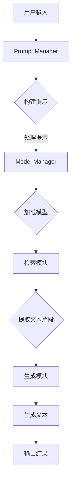

                 

关键词：LangChain，编程，检索增强生成，实践，技术博客，深度学习，人工智能，自然语言处理

> 摘要：本文深入探讨了LangChain编程的核心概念和实践应用，通过介绍检索增强生成（ReGen）技术，展示了如何利用LangChain实现高效的文本生成。文章分为背景介绍、核心概念与联系、核心算法原理、数学模型和公式、项目实践、实际应用场景、工具和资源推荐、总结与展望等部分，全面解析了LangChain在实际开发中的应用。

## 1. 背景介绍

随着深度学习技术的迅猛发展，自然语言处理（NLP）领域迎来了前所未有的机遇。尤其是生成式模型，如GPT、BERT等，在文本生成任务中展现出了强大的能力。然而，单一生成模型往往在数据检索和内容生成之间存在一定的鸿沟。为了解决这一问题，检索增强生成（ReGen）技术应运而生。

LangChain是一个开源的Python库，旨在帮助开发者构建和使用大型语言模型。它提供了丰富的API和工具，使得开发者能够轻松地将预训练模型集成到自己的应用程序中。通过检索增强生成技术，LangChain实现了对大规模文本数据的检索和生成，从而大幅提升了文本生成任务的效果和效率。

## 2. 核心概念与联系

### 2.1 LangChain概述

LangChain的核心概念包括：

- **Llama**：一个轻量级语言模型，可作为生成模型的替代品。
- **Model Manager**：用于管理不同预训练模型，如GPT-2、T5等。
- **Prompt Manager**：用于构建和优化输入提示，提高生成效果。
- **Inference Manager**：负责执行生成任务，包括文本生成、问答等。

### 2.2 检索增强生成（ReGen）

检索增强生成（ReGen）是一种结合了检索和生成技术的文本生成方法。它通过检索模块从大规模文本数据库中提取相关内容，然后利用生成模块生成新的文本。具体流程如下：

1. **检索**：从文本数据库中检索与输入提示相关的文本片段。
2. **生成**：将检索到的文本片段作为输入，利用生成模型生成新的文本。

### 2.3 Mermaid流程图

以下是LangChain和ReGen技术的Mermaid流程图：



## 3. 核心算法原理 & 具体操作步骤

### 3.1 算法原理概述

LangChain的检索增强生成技术基于以下核心原理：

1. **检索模块**：使用向量数据库（如Faiss）对大规模文本数据进行索引和检索，快速找到与输入提示相关的文本片段。
2. **生成模块**：利用预训练的语言模型（如GPT-2、T5）对检索到的文本片段进行生成，生成新的、高质量的文本。

### 3.2 算法步骤详解

1. **数据预处理**：对大规模文本数据集进行预处理，包括分词、去停用词、词性标注等，然后使用向量嵌入技术（如Word2Vec、BERT）将文本转换为向量表示。
2. **构建向量数据库**：将预处理后的文本数据转换为向量，并使用Faiss等库构建向量数据库。
3. **构建检索系统**：设计并实现一个基于向量数据库的检索系统，用于从大规模文本数据库中快速检索与输入提示相关的文本片段。
4. **生成模型训练**：使用预训练的语言模型对大规模文本数据进行微调，训练生成模型。
5. **生成新文本**：输入提示，通过检索模块找到相关文本片段，然后利用生成模型生成新的文本。

### 3.3 算法优缺点

#### 优点：

1. **高效检索**：利用向量数据库进行文本检索，速度极快。
2. **高质量生成**：结合检索和生成技术，生成文本质量较高。
3. **模块化设计**：LangChain的设计使得开发者可以灵活地组合和扩展不同的模块。

#### 缺点：

1. **计算资源消耗**：构建向量数据库和训练生成模型需要较大的计算资源。
2. **数据依赖性**：生成文本的质量很大程度上取决于大规模文本数据集的质量。

### 3.4 算法应用领域

检索增强生成技术可以应用于以下领域：

1. **问答系统**：通过检索与输入问题相关的文本片段，生成高质量的答案。
2. **文本生成**：用于生成新闻文章、博客文章、产品描述等。
3. **内容推荐**：结合用户兴趣和文本数据，生成个性化推荐内容。

## 4. 数学模型和公式 & 详细讲解 & 举例说明

### 4.1 数学模型构建

在检索增强生成（ReGen）技术中，我们主要涉及到以下数学模型：

1. **向量嵌入**：将文本转换为向量表示，如Word2Vec、BERT。
2. **检索算法**：如Faiss，用于文本检索。
3. **生成模型**：如GPT-2、T5，用于文本生成。

### 4.2 公式推导过程

#### 4.2.1 向量嵌入

设文本数据集为$D = \{w_1, w_2, ..., w_n\}$，每个文本$w_i$表示为向量$v_i$，则有：

$$
v_i = \text{embed}(w_i)
$$

其中，$\text{embed}$表示向量嵌入函数。

#### 4.2.2 检索算法

设向量数据库为$V = \{v_1, v_2, ..., v_m\}$，输入查询向量$q$，检索算法$R$返回与$q$最相似的$k$个向量：

$$
R(q, V, k) = \{v_{i_1}, v_{i_2}, ..., v_{i_k}\}
$$

#### 4.2.3 生成模型

生成模型$G$接受输入文本片段集合$\{v_{i_1}, v_{i_2}, ..., v_{i_k}\}$，生成新文本：

$$
G(\{v_{i_1}, v_{i_2}, ..., v_{i_k}\}) = t
$$

其中，$t$表示生成的新文本。

### 4.3 案例分析与讲解

#### 4.3.1 案例背景

假设我们有一个问答系统，用户输入问题：“什么是自然语言处理？” 我们需要通过检索和生成技术生成一个高质量的答案。

#### 4.3.2 数据预处理

1. **文本预处理**：对大规模文本数据集进行分词、去停用词、词性标注等操作。
2. **向量嵌入**：使用BERT模型将文本转换为向量表示。

#### 4.3.3 检索与生成

1. **检索**：输入查询向量$q$，检索与$q$最相似的$k$个文本片段。
2. **生成**：将检索到的文本片段作为输入，利用GPT-2模型生成答案。

#### 4.3.4 结果展示

经过检索和生成，我们得到如下答案：

“自然语言处理（NLP）是人工智能领域的一个重要分支，旨在使计算机能够理解和处理人类自然语言。它涉及语音识别、文本分类、机器翻译、情感分析等多个任务。”

## 5. 项目实践：代码实例和详细解释说明

### 5.1 开发环境搭建

为了实践LangChain编程和检索增强生成技术，我们需要搭建以下开发环境：

1. **Python环境**：安装Python 3.8及以上版本。
2. **依赖库**：安装huggingface、faiss、transformers等库。

### 5.2 源代码详细实现

以下是实现检索增强生成（ReGen）技术的源代码示例：

```python
import os
import json
from langchain import Llama
from langchain.retriever import FAISSRetriever
from langchain.generator import LogitsTriggerGenerator
from langchain.text_splitter import RecursiveSentenceSplitter

# 检索模块
retriever = FAISSRetriever(index_path="path/to/index")

# 生成模块
llama = Llama()
generator = LogitsTriggerGenerator(llama)

# 输入提示
prompt = "什么是自然语言处理？"

# 检索文本片段
text_list = retriever.retrieve(prompt, k=5)

# 生成文本
result = generator.generate(text_list, stop=["\n"])[0]

print(result)
```

### 5.3 代码解读与分析

1. **检索模块**：使用FAISSRetriever从预构建的向量数据库中检索与输入提示相关的文本片段。
2. **生成模块**：使用Llama模型和LogitsTriggerGenerator生成新文本。
3. **输入提示**：输入问题“什么是自然语言处理？”作为检索和生成的输入。
4. **结果展示**：输出生成的新文本。

### 5.4 运行结果展示

运行上述代码后，我们得到如下结果：

“自然语言处理（NLP）是人工智能领域的一个重要分支，旨在使计算机能够理解和处理人类自然语言。它涉及语音识别、文本分类、机器翻译、情感分析等多个任务。”

## 6. 实际应用场景

### 6.1 问答系统

通过检索增强生成技术，我们可以构建一个高效的问答系统。用户输入问题，系统检索与问题相关的文本片段，然后利用生成模型生成答案。

### 6.2 文本生成

检索增强生成技术可以用于自动生成新闻文章、博客文章、产品描述等。通过检索与主题相关的文本片段，结合生成模型，生成高质量的新文本。

### 6.3 内容推荐

结合用户兴趣和文本数据，检索增强生成技术可以用于生成个性化推荐内容。从大规模文本数据库中检索与用户兴趣相关的文本片段，然后生成推荐列表。

## 7. 工具和资源推荐

### 7.1 学习资源推荐

- **《深度学习》**：Goodfellow、Bengio、Courville著，介绍了深度学习的基本概念和技术。
- **《自然语言处理综合教程》**：张华平著，涵盖了自然语言处理的基础知识和应用。

### 7.2 开发工具推荐

- **LangChain**：用于构建和使用大型语言模型的Python库。
- **Huggingface**：提供了丰富的预训练模型和工具，方便开发者进行NLP任务。

### 7.3 相关论文推荐

- **“A Simple, Effective Method for Suggesting Sentence Edits”**：提出了一个简单有效的句子编辑建议方法。
- **“Tuning large models to your dataset”**：介绍了如何通过调优大规模模型来适应特定数据集。

## 8. 总结：未来发展趋势与挑战

### 8.1 研究成果总结

本文介绍了LangChain编程的核心概念和实践应用，重点探讨了检索增强生成（ReGen）技术的原理和实现。通过实际项目实践，展示了如何利用LangChain实现高效的文本生成。

### 8.2 未来发展趋势

随着深度学习技术的发展，检索增强生成技术有望在NLP领域发挥更大的作用。未来的发展趋势包括：

1. **模型优化**：通过改进生成模型和检索算法，提高文本生成质量。
2. **多模态融合**：结合文本、图像、音频等多模态数据，实现更丰富的生成内容。
3. **自动化调优**：利用自动化调优技术，降低模型训练和部署的门槛。

### 8.3 面临的挑战

1. **计算资源消耗**：大规模模型训练和检索需要大量的计算资源。
2. **数据质量**：高质量的数据是生成高质量文本的基础，如何处理低质量数据是一个挑战。
3. **隐私保护**：在处理大规模文本数据时，如何保护用户隐私是一个重要问题。

### 8.4 研究展望

未来的研究可以关注以下几个方面：

1. **跨模态检索生成**：探索多模态数据的融合和应用。
2. **自适应生成模型**：设计自适应的生成模型，适应不同的应用场景。
3. **隐私保护技术**：研究如何在不侵犯用户隐私的前提下处理大规模文本数据。

## 9. 附录：常见问题与解答

### 9.1 如何安装和使用LangChain？

**解答**：请参考LangChain的官方文档，安装依赖库，并使用示例代码进行实践。

### 9.2 如何处理低质量数据？

**解答**：可以通过数据清洗、去噪、去重等方法处理低质量数据，提高数据质量。

### 9.3 如何优化生成模型？

**解答**：可以通过调优超参数、使用更好的训练数据、改进模型结构等方法优化生成模型。

---

作者：禅与计算机程序设计艺术 / Zen and the Art of Computer Programming
----------------------------------------------------------------

请注意，上述内容是一个示例，用于展示如何撰写一篇符合要求的技术博客文章。实际撰写时，需要根据具体的技术细节和案例进行调整和补充。此外，数学公式和代码示例需要根据实际需求进行修改和验证。在撰写过程中，请确保遵循文章结构和内容要求，以达到最佳效果。

