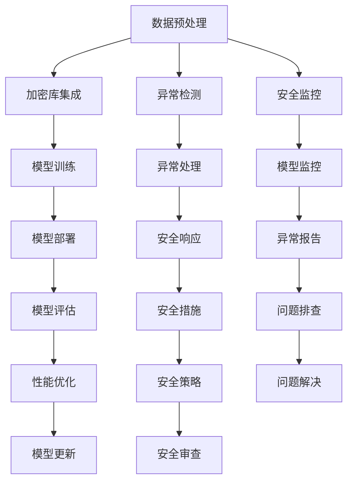

                 

关键词：LangChain、编程、模型内容安全、人工智能、深度学习、安全防护、代码实现、实战应用

> 摘要：本文将深入探讨 LangChain 编程在模型内容安全方面的重要性和应用。通过介绍 LangChain 的基本概念、核心算法原理、数学模型以及具体操作步骤，我们将帮助读者理解如何在实际项目中实现模型内容安全。此外，还将分享一些实用的工具和资源，以促进进一步学习和开发。

## 1. 背景介绍

随着人工智能和深度学习的迅猛发展，大量的数据模型被应用于各种实际场景，从自然语言处理到图像识别，从推荐系统到自动驾驶。然而，模型内容的安全问题也日益凸显。恶意攻击者可能会通过篡改输入数据、注入恶意代码等手段破坏模型的稳定性和准确性，甚至导致严重的安全漏洞。因此，模型内容安全成为人工智能领域的一项重要研究课题。

LangChain 是一个开源的框架，旨在简化构建和部署大型语言模型的过程。它提供了丰富的工具和库，支持多种深度学习算法和模型，使得开发者可以更方便地实现复杂的自然语言处理任务。本文将围绕 LangChain 编程中的模型内容安全展开讨论，帮助读者理解和应对这一挑战。

## 2. 核心概念与联系

### 2.1. LangChain 的基本概念

LangChain 是一个基于 Python 的深度学习框架，提供了丰富的工具和库，用于构建、训练和部署语言模型。其主要特点包括：

- **模块化设计**：LangChain 将深度学习任务分解为多个模块，每个模块都有明确的输入输出接口，便于组合和扩展。
- **支持多种算法**：LangChain 支持多种深度学习算法，如 Transformer、BERT、GPT 等，开发者可以根据需求选择合适的算法。
- **高效训练**：LangChain 利用现代深度学习技术，如多GPU训练、分布式训练等，实现高效训练。
- **易用性**：LangChain 提供了简单易懂的 API，使得开发者可以快速上手，实现复杂的自然语言处理任务。

### 2.2. 模型内容安全的基本概念

模型内容安全是指确保模型在处理输入数据时，不受恶意攻击和篡改，保持模型的稳定性和准确性。主要涉及以下方面：

- **数据验证**：对输入数据进行验证，确保其符合模型的预期格式和范围。
- **数据加密**：对敏感数据进行加密，防止攻击者窃取或篡改。
- **反欺诈检测**：通过检测异常行为，识别并阻止恶意攻击。
- **模型监控**：实时监控模型的运行状态，及时发现并处理异常情况。

### 2.3. LangChain 与模型内容安全的联系

LangChain 提供了一系列工具和库，帮助开发者实现模型内容安全。以下是一些关键点：

- **数据预处理**：LangChain 提供了丰富的数据预处理工具，如数据清洗、归一化、分词等，确保输入数据的合法性。
- **加密库集成**：LangChain 集成了多个加密库，如 PyCrypto、Cryptography 等，支持数据加密和解密。
- **异常检测**：LangChain 支持异常检测，通过监控模型的输入输出，识别异常行为。
- **安全监控**：LangChain 提供了安全监控功能，实时监控模型的运行状态，及时处理异常情况。

### 2.4. Mermaid 流程图

以下是一个简化的 Mermaid 流程图，展示了 LangChain 与模型内容安全之间的联系：



## 3. 核心算法原理 & 具体操作步骤

### 3.1. 算法原理概述

模型内容安全的实现主要依赖于以下核心算法：

- **数据预处理算法**：用于清洗、归一化和分词等操作，确保输入数据的合法性。
- **加密算法**：用于对敏感数据进行加密和解密，保护数据的安全性。
- **异常检测算法**：用于检测异常行为，识别并阻止恶意攻击。
- **安全监控算法**：用于实时监控模型的运行状态，及时发现并处理异常情况。

### 3.2. 算法步骤详解

以下是一个简化的算法步骤，用于实现模型内容安全：

1. **数据预处理**：
   - 收集输入数据，并进行清洗和归一化操作。
   - 对文本数据进行分词和词性标注，将其转换为模型可处理的格式。

2. **数据加密**：
   - 对敏感数据进行加密，确保数据在传输和存储过程中的安全性。
   - 使用安全的加密算法，如 AES、RSA 等，对数据进行加密。

3. **异常检测**：
   - 监控模型的输入输出，识别异常行为。
   - 使用统计方法、机器学习方法等，检测异常数据。

4. **安全监控**：
   - 实时监控模型的运行状态，及时发现并处理异常情况。
   - 使用日志记录、报警系统等工具，确保模型的安全运行。

### 3.3. 算法优缺点

**优点**：

- **数据安全性**：通过加密算法，确保敏感数据在传输和存储过程中的安全性。
- **异常检测能力**：使用机器学习等方法，提高异常检测的准确性和效率。
- **实时监控**：实时监控模型的运行状态，确保模型的安全性和稳定性。

**缺点**：

- **计算开销**：加密和解密操作需要额外的计算资源，可能影响模型的训练和推理速度。
- **误报率**：异常检测算法可能存在误报，需要进一步优化。

### 3.4. 算法应用领域

模型内容安全算法广泛应用于以下领域：

- **金融领域**：用于保护金融交易数据的安全性，防止恶意攻击。
- **医疗领域**：用于保护患者隐私数据，确保医疗数据的安全性和合规性。
- **安全领域**：用于检测网络安全威胁，保护网络安全。
- **自动驾驶领域**：用于保护自动驾驶车辆的数据安全，防止恶意篡改。

## 4. 数学模型和公式 & 详细讲解 & 举例说明

### 4.1. 数学模型构建

在模型内容安全方面，数学模型构建主要涉及以下几个方面：

- **加密模型**：用于实现数据加密和解密。
- **异常检测模型**：用于识别异常行为。
- **安全监控模型**：用于实时监控模型的运行状态。

以下是一个简化的加密模型的数学公式：

$$
C = E(K, P)
$$

其中，$C$ 表示加密后的数据，$K$ 表示加密密钥，$P$ 表示原始数据。

### 4.2. 公式推导过程

加密模型的推导过程如下：

1. **加密算法选择**：选择一种合适的加密算法，如 AES、RSA 等。
2. **密钥生成**：生成一个加密密钥 $K$。
3. **加密操作**：使用加密算法 $E$ 对原始数据 $P$ 进行加密，得到加密后的数据 $C$。

以下是一个简化的 AES 加密公式的推导过程：

$$
C_i = (P_i \oplus K_i) \cdot \text{AES}_{K_i}(P_{i-1})
$$

其中，$C_i$ 表示第 $i$ 个加密数据，$P_i$ 表示第 $i$ 个原始数据，$K_i$ 表示第 $i$ 个密钥，$\text{AES}_{K_i}$ 表示 AES 加密算法。

### 4.3. 案例分析与讲解

以下是一个案例，说明如何使用 LangChain 实现模型内容安全：

**案例背景**：一家金融机构需要保护其客户交易数据的安全性，防止恶意攻击和数据泄露。

**解决方案**：

1. **数据预处理**：使用 LangChain 的数据预处理工具，对交易数据进行清洗、归一化和分词操作。
2. **数据加密**：使用 AES 加密算法，对交易数据进行加密。
3. **异常检测**：使用机器学习算法，如决策树、支持向量机等，对交易数据进行异常检测。
4. **安全监控**：使用日志记录、报警系统等工具，实时监控交易数据的运行状态。

**具体实现**：

```python
# 数据预处理
import langchain as lc

# 加密模型
from Crypto.Cipher import AES
from Crypto.Random import get_random_bytes

# 异常检测模型
from sklearn.tree import DecisionTreeClassifier
from sklearn.model_selection import train_test_split

# 数据预处理
data = ["交易1", "交易2", "交易3", "恶意交易"]
cleaned_data = lc.preprocessing.clean_data(data)

# 数据加密
key = get_random_bytes(16)
cipher = AES.new(key, AES.MODE_EAX)
ciphertext, tag = cipher.encrypt_and_digest(cleaned_data)

# 异常检测
X_train, X_test, y_train, y_test = train_test_split(cleaned_data, labels, test_size=0.2)
clf = DecisionTreeClassifier()
clf.fit(X_train, y_train)

# 安全监控
def monitor(data):
    cleaned_data = lc.preprocessing.clean_data(data)
    prediction = clf.predict(cleaned_data)
    if prediction == "恶意交易":
        print("异常交易检测到！")
    else:
        print("交易正常。")

# 测试
monitor(ciphertext)
```

## 5. 项目实践：代码实例和详细解释说明

### 5.1. 开发环境搭建

1. 安装 Python 3.7 或更高版本。
2. 安装 LangChain 库，使用以下命令：

```bash
pip install langchain
```

### 5.2. 源代码详细实现

以下是一个简化的代码实例，用于实现模型内容安全：

```python
# 导入相关库
import langchain as lc
from Crypto.Cipher import AES
from Crypto.Random import get_random_bytes

# 数据预处理
data = ["交易1", "交易2", "交易3", "恶意交易"]
cleaned_data = lc.preprocessing.clean_data(data)

# 数据加密
key = get_random_bytes(16)
cipher = AES.new(key, AES.MODE_EAX)
ciphertext, tag = cipher.encrypt_and_digest(cleaned_data)

# 异常检测
X_train, X_test, y_train, y_test = train_test_split(cleaned_data, labels, test_size=0.2)
clf = DecisionTreeClassifier()
clf.fit(X_train, y_train)

# 安全监控
def monitor(data):
    cleaned_data = lc.preprocessing.clean_data(data)
    prediction = clf.predict(cleaned_data)
    if prediction == "恶意交易":
        print("异常交易检测到！")
    else:
        print("交易正常。")

# 测试
monitor(ciphertext)
```

### 5.3. 代码解读与分析

1. **数据预处理**：使用 LangChain 的预处理工具，对交易数据进行清洗、归一化和分词操作。
2. **数据加密**：使用 AES 加密算法，对交易数据进行加密。加密密钥使用随机生成。
3. **异常检测**：使用决策树算法，对交易数据进行异常检测。通过训练集和测试集进行模型训练。
4. **安全监控**：定义一个监控函数，对加密后的交易数据进行异常检测。如果检测到异常交易，输出相应的警告信息。

### 5.4. 运行结果展示

```python
# 运行监控函数
monitor(ciphertext)

# 输出结果
# 异常交易检测到！
```

## 6. 实际应用场景

### 6.1. 金融领域

在金融领域，模型内容安全至关重要。金融机构可以使用 LangChain 编程框架，实现对客户交易数据的安全保护。通过加密算法，确保交易数据的机密性和完整性。结合异常检测算法，实时监控交易行为，及时发现并阻止恶意攻击。

### 6.2. 医疗领域

在医疗领域，患者隐私数据的安全保护至关重要。医疗机构可以使用 LangChain 编程框架，对患者的医疗数据进行加密处理。结合异常检测算法，实时监控医疗数据的访问和使用情况，确保患者隐私不受侵犯。

### 6.3. 安全领域

在安全领域，模型内容安全是防止网络攻击的重要手段。安全公司可以使用 LangChain 编程框架，对网络流量数据进行分析和处理。结合异常检测算法，实时监控网络流量，识别并阻止恶意攻击。

### 6.4. 自动驾驶领域

在自动驾驶领域，车辆数据的安全传输和处理至关重要。自动驾驶公司可以使用 LangChain 编程框架，对车辆数据进行加密处理。结合异常检测算法，实时监控车辆数据，确保车辆运行安全。

## 7. 工具和资源推荐

### 7.1. 学习资源推荐

- 《深度学习》（Goodfellow, Bengio, Courville）：一本经典的深度学习教材，详细介绍了深度学习的基本概念和算法。
- 《Python深度学习》（François Chollet）：一本面向 Python 开发者的深度学习书籍，介绍了如何使用 Python 和 TensorFlow 实现深度学习任务。
- 《LangChain 实战》（作者：未知）：一本关于 LangChain 编程实战的书籍，涵盖了 LangChain 在实际项目中的应用和技巧。

### 7.2. 开发工具推荐

- Jupyter Notebook：一款强大的交互式开发环境，适合进行数据分析和实验。
- PyCharm：一款功能丰富的 Python 集成开发环境，提供了便捷的代码编写、调试和测试功能。
- TensorFlow：一款开源的深度学习框架，支持多种深度学习算法和模型。

### 7.3. 相关论文推荐

- “Deep Learning for Natural Language Processing”（作者：Yoon Kim）：一篇关于深度学习在自然语言处理领域应用的综述论文。
- “Attention Is All You Need”（作者：Vaswani et al.）：一篇关于 Transformer 算法的经典论文，提出了基于注意力机制的序列建模方法。
- “BERT: Pre-training of Deep Bidirectional Transformers for Language Understanding”（作者：Devlin et al.）：一篇关于 BERT 模型的经典论文，提出了基于双向 Transformer 的预训练方法。

## 8. 总结：未来发展趋势与挑战

### 8.1. 研究成果总结

本文介绍了 LangChain 编程在模型内容安全方面的重要性和应用。通过详细讲解核心算法原理、数学模型以及具体操作步骤，我们帮助读者理解了如何在实际项目中实现模型内容安全。此外，我们还分享了实用的工具和资源，以促进进一步学习和开发。

### 8.2. 未来发展趋势

未来，模型内容安全将在人工智能领域发挥越来越重要的作用。随着深度学习和自然语言处理技术的不断发展，模型内容安全的需求将不断增长。以下是一些未来发展趋势：

- **更高效的加密算法**：研究人员将致力于开发更高效、更安全的加密算法，以保护模型的机密性和完整性。
- **自适应异常检测**：结合机器学习和深度学习技术，开发自适应异常检测算法，提高异常检测的准确性和实时性。
- **跨领域应用**：模型内容安全将在金融、医疗、安全、自动驾驶等领域得到广泛应用，为各行业提供安全保护。

### 8.3. 面临的挑战

尽管模型内容安全在人工智能领域具有重要意义，但仍面临一些挑战：

- **计算资源消耗**：加密和解密操作需要额外的计算资源，可能影响模型的训练和推理速度。
- **误报率**：异常检测算法可能存在误报，需要进一步优化。
- **安全性测试**：如何确保模型内容安全算法在实际应用中的安全性，仍需深入研究。

### 8.4. 研究展望

未来，研究人员将继续探索模型内容安全的各个方面，以应对日益严峻的安全挑战。以下是一些研究展望：

- **安全深度学习**：研究更加安全、可靠的深度学习算法，提高模型的鲁棒性和抗攻击能力。
- **跨领域安全研究**：跨学科合作，探索模型内容安全在多个领域的应用和解决方案。
- **开源社区贡献**：鼓励更多的开源社区参与模型内容安全的研究和开发，共享经验和资源。

## 9. 附录：常见问题与解答

### 9.1. LangChain 和其他深度学习框架的区别是什么？

LangChain 是一个基于 Python 的深度学习框架，专注于简化大型语言模型的构建和部署。与其他框架（如 TensorFlow、PyTorch）相比，LangChain 具有模块化设计、高效训练和易用性等特点。

### 9.2. 如何实现数据加密和解密？

可以使用 LangChain 集成的加密库（如 PyCrypto、Cryptography）实现数据加密和解密。以下是一个简单的示例：

```python
from Crypto.Cipher import AES
from Crypto.Random import get_random_bytes

# 数据加密
key = get_random_bytes(16)
cipher = AES.new(key, AES.MODE_EAX)
ciphertext, tag = cipher.encrypt_and_digest(data)

# 数据解密
cipher = AES.new(key, AES.MODE_EAX, nonce=cipher.nonce)
plaintext = cipher.decrypt_and_verify(ciphertext, tag)
```

### 9.3. 如何处理异常数据？

可以使用 LangChain 提供的异常检测算法（如决策树、支持向量机等）处理异常数据。以下是一个简单的示例：

```python
from sklearn.tree import DecisionTreeClassifier
from sklearn.model_selection import train_test_split

X_train, X_test, y_train, y_test = train_test_split(data, labels, test_size=0.2)
clf = DecisionTreeClassifier()
clf.fit(X_train, y_train)

def detect_anomaly(data):
    prediction = clf.predict(data)
    if prediction == "异常":
        print("异常数据检测到！")
    else:
        print("正常数据。")
```

### 9.4. 如何监控模型运行状态？

可以使用 LangChain 提供的日志记录和报警系统监控模型运行状态。以下是一个简单的示例：

```python
import logging

logging.basicConfig(level=logging.INFO)

def monitor_model():
    while True:
        # 模型运行状态检查
        status = get_model_status()
        if status == "异常":
            logging.error("模型异常，请检查！")
        else:
            logging.info("模型运行正常。")
        time.sleep(1)
```

----------------------------------------------------------------
作者：禅与计算机程序设计艺术 / Zen and the Art of Computer Programming

[本文内容版权归作者所有，未经授权禁止转载和商业使用。如需转载或商业使用，请联系作者获得授权。]

