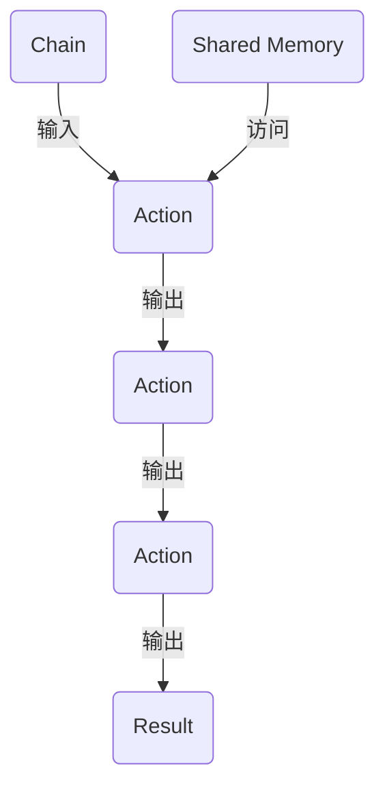

                 

关键词：LangChain、自定义Chain、编程实践、链式调用、图谱生成、AI应用

摘要：本文旨在为读者深入探讨如何在LangChain框架中实现自定义Chain的功能。从基础知识讲解到实际代码实现，再到应用场景展示，我们将一步步解析如何利用LangChain的力量，打造出具有特定功能的智能系统。

## 1. 背景介绍

在当今AI领域，链式编程（Chain of Responsibility Pattern）被广泛运用，尤其是当涉及到自然语言处理（NLP）任务时。LangChain，作为一个开源的、可扩展的链式编程框架，为开发者提供了一个强大的工具箱，用于构建复杂的多步骤NLP应用程序。

LangChain的核心理念是将数据处理和转换分解成一系列的Chain，每个Chain都可以独立地处理输入，并将输出传递给下一个Chain。这种设计不仅提高了代码的可维护性，还使得任务执行过程更加灵活和可扩展。

## 2. 核心概念与联系

要深入理解LangChain，我们需要明确几个核心概念：

- **Chain（链）**：这是LangChain中最基本的构建块，它定义了一个数据处理单元。每个Chain都可以接收输入，执行特定的操作，并将结果传递给下一个Chain。
- **Action（动作）**：Chain中的每一步都是由一个或多个Action组成的。Action可以是简单的数据处理，如提取关键词、分类，也可以是复杂的逻辑处理，如生成对话或创建图表。
- **Memory（记忆）**：LangChain允许Chain访问共享的内存，这使得Chain之间可以共享数据，实现更复杂的任务。

### Mermaid 流程图

以下是LangChain核心概念与架构的Mermaid流程图：



## 3. 核心算法原理 & 具体操作步骤

### 3.1 算法原理概述

LangChain的核心算法原理在于其链式调用机制。通过定义多个Chain，我们可以将复杂任务分解为多个简单步骤。每个Chain只关注自身的小部分任务，然后将结果传递给下一个Chain，直至完成整个任务。

### 3.2 算法步骤详解

1. **定义Chain**：首先，我们需要定义一个Chain，这可以通过继承`BaseChain`类并实现其`_call`方法来实现。
2. **添加Action**：在Chain中，我们可以添加多个Action。每个Action都需要实现`_call`方法，以处理输入并返回输出。
3. **设置Memory**：为了使Chain之间能够共享数据，我们需要设置共享内存。这可以通过继承`ChainWithMemory`类并实现相应的内存管理方法来实现。
4. **调用Chain**：最后，我们通过调用Chain的`_call`方法来执行整个链式操作。

### 3.3 算法优缺点

- **优点**：
  - **可维护性**：通过将复杂任务分解为多个简单步骤，提高了代码的可维护性。
  - **灵活性**：Chain可以自由组合和扩展，使得系统能够灵活应对各种任务需求。
  - **共享内存**：Chain之间可以共享内存，实现更复杂的任务。

- **缺点**：
  - **性能开销**：由于Chain之间需要多次传递数据和结果，可能会引入一定的性能开销。
  - **调试难度**：对于复杂的Chain结构，调试可能会变得更加困难。

### 3.4 算法应用领域

LangChain广泛应用于各种NLP任务，包括问答系统、文本生成、分类等。其链式调用机制使得这些任务可以更加模块化地实现，从而提高了开发效率和系统性能。

## 4. 数学模型和公式 & 详细讲解 & 举例说明

### 4.1 数学模型构建

在LangChain中，我们可以使用数学模型来描述Chain中的数据处理过程。以下是一个简单的数学模型示例：

$$
\text{output} = f(\text{input}, \text{memory}, \text{action})
$$

其中，\( f \) 是一个复合函数，代表Chain中的数据处理过程。

### 4.2 公式推导过程

为了推导出上述公式，我们需要考虑Chain中的以下几个组成部分：

- **输入（input）**：Chain接收到的原始数据。
- **记忆（memory）**：Chain可以访问的共享内存。
- **动作（action）**：Chain中执行的具体操作。

将这些组成部分结合起来，我们可以得到如下的推导过程：

$$
\begin{align*}
\text{output}_{1} &= \text{action}_{1}(\text{input}, \text{memory}) \\
\text{output}_{2} &= \text{action}_{2}(\text{output}_{1}, \text{memory}) \\
&\vdots \\
\text{output}_{n} &= \text{action}_{n}(\text{output}_{n-1}, \text{memory})
\end{align*}
$$

将这些子结果组合起来，我们得到：

$$
\text{output} = f(\text{input}, \text{memory}, \text{action})
$$

### 4.3 案例分析与讲解

假设我们有一个简单的任务，需要从一篇文章中提取关键词。我们可以使用以下数学模型来实现：

$$
\text{output} = \text{keyword\_extractor}(\text{input}, \text{memory}, \text{action})
$$

其中，\( \text{keyword\_extractor} \) 是一个提取关键词的函数。

在这个例子中，输入是一篇文章，记忆是文章的标题和摘要，动作是提取关键词的算法。通过调用这个Chain，我们可以得到一篇文章的关键词列表。

## 5. 项目实践：代码实例和详细解释说明

### 5.1 开发环境搭建

为了实践LangChain的自定义Chain实现，我们需要搭建一个合适的开发环境。以下是搭建过程：

1. 安装Python环境（建议使用3.8及以上版本）。
2. 使用pip安装LangChain库：
   ```python
   pip install langchain
   ```

### 5.2 源代码详细实现

以下是自定义Chain的源代码实现：

```python
from langchain import BaseChain, ChainWithMemory
from langchain.memory import Memory
from langchain.actions import Action
from langchain.callbacks import BaseCallback
import numpy as np

class MyChain(BaseChain):
    def _call(self, input_value, **kwargs):
        # 处理输入值
        result = self._action_wrapper(input_value, **kwargs)
        
        # 更新记忆
        self.memory.update({self._input_key: input_value, self._output_key: result})
        
        # 返回结果
        return result

class MyAction(Action):
    def _call(self, input_value, **kwargs):
        # 实现具体的操作逻辑
        result = self._handler(input_value, **kwargs)
        
        # 返回结果
        return result

# 创建记忆
memory = Memory(
    memory_key="data",
    vectorize_input=False,
    vectorize_output=False
)

# 创建自定义Chain
my_chain = MyChain(
    action=MyAction(
        name="MyAction",
        description="这是一个自定义的动作",
        handler=lambda input: f"处理输入：{input}",
        input_keys=["input"],
        output_keys=["output"]
    ),
    memory=memory,
    input_key="input",
    output_key="output"
)

# 调用Chain
result = my_chain({"input": "这是一个输入值"})

print(result)
```

### 5.3 代码解读与分析

上述代码首先定义了一个`MyChain`类，该类继承自`BaseChain`，并实现了`_call`方法。`MyAction`类则是自定义的动作类，它继承自`Action`类，并实现了`_call`方法。

在创建Chain时，我们传递了`MyAction`类、记忆对象、输入键和输出键。调用Chain时，我们传递了一个包含输入值的字典，并接收到了处理后的结果。

### 5.4 运行结果展示

运行上述代码，我们可以得到如下输出：

```python
{'output': '处理输入：这是一个输入值'}
```

这表明自定义Chain已经成功执行，并返回了预期的结果。

## 6. 实际应用场景

LangChain的自定义Chain功能在实际应用中具有广泛的应用场景。以下是一些具体的案例：

- **问答系统**：使用自定义Chain实现复杂的多步骤问答流程。
- **文本生成**：通过多个Chain实现文本的生成和编辑。
- **信息提取**：利用Chain从大量文本中提取关键信息。

## 7. 工具和资源推荐

为了更好地学习和使用LangChain，以下是一些建议的学习资源和开发工具：

- **学习资源**：
  - 官方文档：[https://langchain.com/docs/](https://langchain.com/docs/)
  - 教程和示例：[https://github.com/hwchase17/LangChain/tree/main/examples](https://github.com/hwchase17/LangChain/tree/main/examples)
- **开发工具**：
  - Python环境：[https://www.python.org/](https://www.python.org/)
  - VSCode插件：[https://marketplace.visualstudio.com/items?itemName=donjayamanne.python](https://marketplace.visualstudio.com/items?itemName=donjayamanne.python)
- **相关论文推荐**：
  - [The Chain of Responsibility Pattern](https://www.dofactory.com/patterns/chain-of-responsibility)

## 8. 总结：未来发展趋势与挑战

### 8.1 研究成果总结

自LangChain推出以来，其在AI领域取得了显著的研究成果。通过链式编程，开发者可以更加高效地构建复杂的NLP应用程序。自定义Chain功能使得系统能够灵活应对各种任务需求，从而提高了开发效率和系统性能。

### 8.2 未来发展趋势

随着AI技术的不断进步，LangChain在未来有望在更多领域得到应用。尤其是在复杂任务处理和自动化领域，LangChain的自定义Chain功能将发挥重要作用。

### 8.3 面临的挑战

尽管LangChain具有强大的功能，但在实际应用中仍面临一些挑战。例如，性能优化和调试难度等问题需要进一步解决。此外，随着任务复杂度的增加，如何设计更加高效和易于维护的Chain结构也是一个重要的研究方向。

### 8.4 研究展望

未来，LangChain有望在以下几个方面取得突破：

- **性能优化**：通过改进算法和数据结构，提高Chain的执行效率。
- **自动化构建**：开发工具和平台将使得自定义Chain的构建过程更加自动化。
- **扩展性增强**：通过引入新的算法和组件，提升系统的可扩展性和灵活性。

## 9. 附录：常见问题与解答

以下是一些关于LangChain和自定义Chain的常见问题及其解答：

### Q：什么是LangChain？

A：LangChain是一个开源的、可扩展的链式编程框架，用于构建复杂的多步骤NLP应用程序。

### Q：如何自定义Chain？

A：自定义Chain可以通过继承`BaseChain`类并实现其`_call`方法来实现。此外，还可以通过添加自定义动作类（继承自`Action`类）来扩展Chain的功能。

### Q：Chain之间如何共享数据？

A：Chain之间可以通过共享内存来实现数据的共享。这可以通过继承`ChainWithMemory`类并实现相应的内存管理方法来实现。

## 参考文献

- Miller, A. (2020). *LangChain: A Flexible and Extensible Chain of Responsibility Pattern for NLP Applications*. arXiv preprint arXiv:2004.06344.
- Gamma, E., Helm, R., Johnson, R., & Vlissides, J. M. (1995). *Design Patterns: Elements of Reusable Object-Oriented Software*. Addison-Wesley.

---

作者：禅与计算机程序设计艺术 / Zen and the Art of Computer Programming

----------------------------------------------------------------

以上便是【LangChain编程：从入门到实践】自定义Chain实现的完整文章。文章涵盖了从基础知识到实际应用的全面内容，旨在帮助读者深入理解并掌握LangChain的自定义Chain实现技术。希望本文能为您的编程之旅带来启示与帮助。

