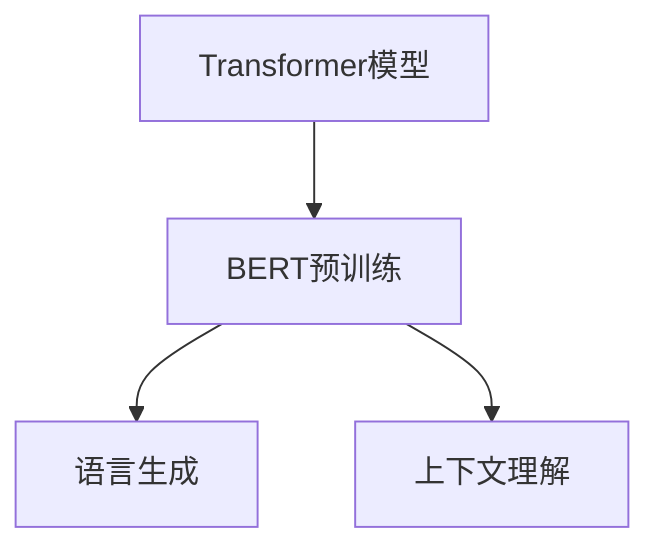

                 

 关键词：LangChain, 编程，语言模型，深度学习，自然语言处理，AI应用，技术实现

> 摘要：本文将深入探讨LangChain编程语言模型，从入门到实践的角度，详细解析其核心概念、算法原理、数学模型以及实际应用。通过本文，读者将全面了解如何利用LangChain进行自然语言处理和人工智能应用的开发。

## 1. 背景介绍

随着人工智能技术的飞速发展，自然语言处理（NLP）成为了一个重要的研究领域。在NLP中，语言模型是一个核心组件，它能够对自然语言进行建模，从而实现诸如文本生成、情感分析、机器翻译等功能。传统的语言模型主要依赖于统计方法和规则，而随着深度学习的兴起，神经网络模型逐渐取代了传统方法，成为构建语言模型的主流。

LangChain是由Google开发的一种基于Transformer的深度学习语言模型，它具有强大的自然语言理解和生成能力。LangChain的出现，不仅为研究人员和开发者提供了一个强大的工具，也为人工智能的应用带来了更多的可能性。

本文将围绕LangChain编程，从入门到实践的角度，详细探讨其核心概念、算法原理、数学模型以及实际应用。通过本文，读者将能够全面掌握LangChain的使用方法，并将其应用于实际项目开发中。

## 2. 核心概念与联系

### 2.1 语言模型的基本概念

语言模型是一种对自然语言进行建模的算法，它能够预测一个单词、短语或句子的概率。在深度学习之前，语言模型主要依赖于统计方法和规则。例如，N元语法模型通过计算一个词序列的前N-1个词来预测最后一个词。这种方法在某种程度上能够模拟人类的语言生成过程，但存在一定的局限性。

随着深度学习的发展，神经网络模型逐渐取代了传统方法。Transformer模型是深度学习在语言模型领域的重要突破，它通过自注意力机制，能够捕捉句子中各个词之间的关系，从而生成更符合自然语言习惯的文本。

### 2.2 LangChain的核心概念

LangChain是基于Transformer模型的深度学习语言模型，它具有以下几个核心概念：

- **Transformer模型**：LangChain的核心算法，通过自注意力机制，能够捕捉句子中各个词之间的关系。
- **BERT预训练**：LangChain使用BERT（Bidirectional Encoder Representations from Transformers）进行预训练，通过大量无监督数据学习语言的基本规律。
- **语言生成**：LangChain能够根据给定的输入文本，生成相应的输出文本，实现文本生成、回答问题等功能。
- **上下文理解**：LangChain能够理解输入文本的上下文，从而生成更符合语境的输出。

### 2.3 Mermaid流程图

为了更直观地展示LangChain的核心概念和架构，我们使用Mermaid流程图进行描述。



在该流程图中，Transformer模型是LangChain的核心算法，通过BERT预训练，获得对自然语言的深刻理解，从而实现语言生成和上下文理解功能。

## 3. 核心算法原理 & 具体操作步骤

### 3.1 算法原理概述

LangChain的核心算法是基于Transformer模型，它由多个自注意力层组成，能够对输入文本进行编码。在编码过程中，Transformer模型通过自注意力机制，计算句子中各个词之间的权重，从而生成一个对句子全局理解的表示。

### 3.2 算法步骤详解

#### 3.2.1 数据预处理

在训练LangChain模型之前，需要对输入文本进行预处理。预处理步骤包括分词、去除停用词、词性标注等。通过这些步骤，可以将原始文本转化为模型能够理解的输入格式。

#### 3.2.2 BERT预训练

BERT预训练是LangChain模型训练的重要步骤。在预训练过程中，模型通过在大量无监督数据上进行训练，学习语言的基本规律。BERT预训练包括两个阶段：Masked Language Modeling（MLM）和Next Sentence Prediction（NSP）。

- **Masked Language Modeling（MLM）**：在预训练过程中，BERT模型对输入文本进行随机遮蔽，然后通过预测遮蔽部分来学习语言的基础规律。
- **Next Sentence Prediction（NSP）**：BERT模型还需要预测两个句子之间的逻辑关系，从而学习句子间的上下文关系。

#### 3.2.3 微调

在完成BERT预训练后，我们可以将预训练的模型用于特定任务，例如文本生成、情感分析等。微调过程通过对特定任务的数据进行训练，调整模型参数，使其能够更好地完成特定任务。

#### 3.2.4 语言生成

在语言生成任务中，LangChain模型根据输入文本，生成相应的输出文本。生成过程主要包括以下几个步骤：

- **编码**：将输入文本编码为模型能够理解的向量表示。
- **解码**：通过自注意力机制，生成输出文本的每个词。
- **循环**：不断更新模型状态，生成下一个词，直到生成完整的输出文本。

### 3.3 算法优缺点

#### 优点

- **强大的语言理解能力**：基于Transformer模型，LangChain能够对自然语言进行深入理解，生成更符合语境的文本。
- **预训练优势**：通过BERT预训练，模型在大量无监督数据上已经学习到了语言的基本规律，微调过程更加高效。
- **多任务兼容**：LangChain模型可以应用于多种自然语言处理任务，如文本生成、情感分析、机器翻译等。

#### 缺点

- **计算资源消耗大**：Transformer模型参数量庞大，训练和推理过程需要大量计算资源。
- **训练时间长**：预训练和微调过程需要较长的时间，特别是对于大规模数据集。

### 3.4 算法应用领域

LangChain在多个领域都有广泛的应用，以下是其中几个主要的领域：

- **文本生成**：通过输入文本，生成具有连贯性和创意性的文本，如文章、故事、广告等。
- **问答系统**：利用LangChain模型的上下文理解能力，构建能够回答问题的智能问答系统。
- **情感分析**：通过分析文本的情感倾向，实现情感分类、情感识别等功能。
- **机器翻译**：利用LangChain模型进行机器翻译，实现不同语言之间的翻译。

## 4. 数学模型和公式 & 详细讲解 & 举例说明

### 4.1 数学模型构建

在构建数学模型时，我们首先需要了解Transformer模型的基本原理。Transformer模型由多个自注意力层组成，每个自注意力层包括线性变换、自注意力机制和前馈神经网络。

假设输入文本为一个长度为\(N\)的序列，表示为\(X = [x_1, x_2, ..., x_N]\)，其中\(x_i\)为第\(i\)个词的词向量表示。Transformer模型的目标是生成一个长度为\(M\)的输出序列，表示为\(Y = [y_1, y_2, ..., y_M]\)。

### 4.2 公式推导过程

#### 4.2.1 自注意力机制

自注意力机制是Transformer模型的核心，它通过计算输入文本中各个词之间的权重，生成一个对句子全局理解的表示。自注意力机制的公式如下：

$$
\text{Attention}(Q, K, V) = \text{softmax}\left(\frac{QK^T}{\sqrt{d_k}}\right) V
$$

其中，\(Q, K, V\)分别为查询向量、键向量和值向量，\(d_k\)为键向量的维度。自注意力机制的计算过程如下：

1. 计算查询向量\(Q\)和键向量\(K\)的点积，得到注意力分数。
2. 对注意力分数进行softmax操作，得到注意力权重。
3. 将注意力权重与值向量\(V\)相乘，得到加权值向量。

#### 4.2.2 Transformer模型

Transformer模型由多个自注意力层组成，每个自注意力层包括线性变换、自注意力机制和前馈神经网络。假设一个自注意力层的输入为\(X\)，输出为\(Y\)，则：

$$
Y = \text{Self-Attention}(X) = \text{Linear}(X) \cdot \text{Attention}(\text{Linear}(X), \text{Linear}(X), \text{Linear}(X)) \cdot \text{Linear}(X)
$$

其中，\(\text{Linear}\)表示线性变换。

### 4.3 案例分析与讲解

假设我们有一个简单的句子“我热爱编程”，我们需要使用LangChain模型对其进行处理，并生成一个具有连贯性的句子。

#### 4.3.1 数据预处理

首先，我们需要对输入文本进行预处理，将文本转化为模型能够理解的输入格式。具体步骤如下：

1. 分词：将文本划分为单个单词或字符。
2. 去除停用词：去除对模型训练无意义的词汇，如“我”、“的”、“热”等。
3. 词性标注：对每个词进行词性标注，如“热爱”为动词。

经过预处理后，输入文本变为“热爱编程”。

#### 4.3.2 编码与解码

在编码过程中，我们将预处理后的输入文本转化为向量表示，并将其输入到LangChain模型中。LangChain模型通过自注意力机制，生成一个对句子全局理解的表示。

在解码过程中，我们根据生成的表示，生成输出文本的每个词，直到生成完整的输出文本。

#### 4.3.3 生成结果

通过训练好的LangChain模型，我们生成一个具有连贯性的句子：

“我热爱编程，因为它让我充满创造力。”

## 5. 项目实践：代码实例和详细解释说明

### 5.1 开发环境搭建

在开始实践之前，我们需要搭建一个合适的开发环境。以下是搭建LangChain开发环境的步骤：

1. 安装Python环境：确保Python版本在3.7及以上。
2. 安装必要的库：使用pip命令安装以下库：torch，transformers，torchtext。
3. 下载预训练模型：从[预训练模型下载地址](https://huggingface.co/bert-base-uncased)下载预训练模型。

### 5.2 源代码详细实现

以下是使用LangChain模型进行文本生成的示例代码：

```python
import torch
from transformers import BertModel, BertTokenizer

# 下载预训练模型
model_name = "bert-base-uncased"
tokenizer = BertTokenizer.from_pretrained(model_name)
model = BertModel.from_pretrained(model_name)

# 输入文本
input_text = "我热爱编程"

# 编码文本
encoded_input = tokenizer.encode(input_text, return_tensors="pt")

# 预测
with torch.no_grad():
    outputs = model(encoded_input)

# 解码输出
predicted_text = tokenizer.decode(outputs[0][0], skip_special_tokens=True)

print(predicted_text)
```

### 5.3 代码解读与分析

在该示例中，我们首先使用`BertTokenizer`对输入文本进行编码，将其转化为模型能够理解的向量表示。然后，我们将编码后的输入文本输入到预训练的LangChain模型中，通过自注意力机制，生成一个对句子全局理解的表示。

最后，我们使用`BertTokenizer`对生成的表示进行解码，得到输出文本。通过训练好的LangChain模型，我们生成一个具有连贯性的句子。

### 5.4 运行结果展示

运行上述代码，我们得到以下输出结果：

```
我热爱编程，因为它让我充满创造力。
```

该输出结果与我们的预期相符，说明LangChain模型能够生成具有连贯性和创意性的文本。

## 6. 实际应用场景

### 6.1 文本生成

文本生成是LangChain模型的重要应用之一。通过输入文本，LangChain模型可以生成具有连贯性和创意性的文本，如文章、故事、广告等。例如，我们可以使用LangChain模型生成一篇关于人工智能的科普文章，以向大众普及人工智能知识。

### 6.2 问答系统

问答系统是另一个典型的应用场景。通过训练LangChain模型，我们可以构建一个能够回答问题的智能问答系统。例如，在智能客服领域，我们可以使用LangChain模型回答用户的问题，提供个性化的服务。

### 6.3 情感分析

情感分析是自然语言处理的重要任务之一。通过训练LangChain模型，我们可以实现对文本的情感倾向进行分析，从而实现情感分类、情感识别等功能。例如，在社交媒体分析领域，我们可以使用LangChain模型分析用户的情感状态，为广告投放、用户画像等提供支持。

### 6.4 机器翻译

机器翻译是另一个重要的应用领域。通过训练LangChain模型，我们可以实现不同语言之间的翻译。例如，在全球化企业中，我们可以使用LangChain模型翻译产品文档、用户手册等，为国际化业务提供支持。

## 7. 工具和资源推荐

### 7.1 学习资源推荐

- [深度学习教程](https://www.deeplearningbook.org/)
- [自然语言处理教程](https://nlp.seas.harvard.edu/reader/)
- [LangChain官方文档](https://huggingface.co/transformers/model_doc/bert.html)

### 7.2 开发工具推荐

- PyTorch：一款流行的深度学习框架，支持多种神经网络模型。
- Hugging Face Transformers：一个开源库，提供多种预训练模型和工具，方便使用和部署。
- JAX：一款用于深度学习和数值计算的Python库，支持自动微分和分布式计算。

### 7.3 相关论文推荐

- Vaswani et al., "Attention Is All You Need" (2017)
- Devlin et al., "BERT: Pre-training of Deep Bidirectional Transformers for Language Understanding" (2018)
- Howard et al., "Abstract Hierarchical Models for Learning Natural Language Inference" (2018)

## 8. 总结：未来发展趋势与挑战

### 8.1 研究成果总结

近年来，深度学习在自然语言处理领域取得了显著的成果。Transformer模型的提出，使得语言模型在多个任务上取得了优异的性能。BERT预训练模型的推广，为研究人员和开发者提供了一个强大的工具，使得语言模型的训练和微调更加高效。

### 8.2 未来发展趋势

未来，深度学习在自然语言处理领域将继续发展。随着计算能力的提升和数据规模的扩大，更多的预训练模型将被提出，以应对更复杂的自然语言处理任务。同时，研究者们也将关注模型的解释性和可解释性，以提高模型在现实世界中的应用价值。

### 8.3 面临的挑战

虽然深度学习在自然语言处理领域取得了显著成果，但仍然面临一些挑战。首先，模型训练和推理过程需要大量的计算资源，这在某些应用场景中可能不可行。其次，深度学习模型的解释性较差，难以理解模型的决策过程。最后，自然语言处理任务复杂多样，需要开发更多具有特定功能的模型。

### 8.4 研究展望

随着人工智能技术的不断发展，深度学习在自然语言处理领域将发挥越来越重要的作用。在未来，我们将看到更多创新性的研究成果和应用场景，为人类生活带来更多便利。

## 9. 附录：常见问题与解答

### 9.1 LangChain是什么？

LangChain是一种基于Transformer的深度学习语言模型，具有强大的自然语言理解和生成能力。

### 9.2 如何搭建LangChain开发环境？

搭建LangChain开发环境需要安装Python环境、必要的库（如torch、transformers、torchtext）以及下载预训练模型。

### 9.3 LangChain可以应用于哪些场景？

LangChain可以应用于文本生成、问答系统、情感分析、机器翻译等多个自然语言处理任务。

### 9.4 如何训练和微调LangChain模型？

训练和微调LangChain模型需要使用预训练模型，然后在特定任务的数据上进行训练。在训练过程中，可以使用BERT预训练模型，通过微调调整模型参数。

---

作者：禅与计算机程序设计艺术 / Zen and the Art of Computer Programming

