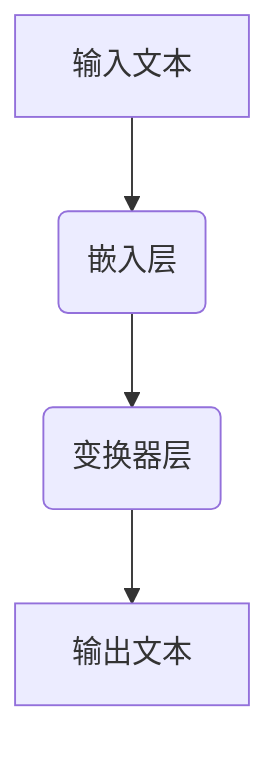

                 

在当今快速发展的技术时代，掌握先进的编程工具和框架对于开发者来说至关重要。本文将深入探讨LangChain编程框架，一个专为构建大型语言模型而设计的开源工具。我们将从入门到实践，逐步了解LangChain的核心概念、算法原理、数学模型以及其实际应用。通过这篇文章，您将不仅了解如何使用LangChain进行编程，还将对它的未来发展趋势和应用前景有一个清晰的认识。

## 文章关键词

- LangChain编程
- 大型语言模型
- 开源工具
- 算法原理
- 数学模型
- 实际应用

## 文章摘要

本文旨在为读者提供LangChain编程的全面指南，从基本概念到实际应用。通过详细介绍LangChain的核心功能、算法原理、数学模型以及代码实例，本文将帮助开发者掌握这一强大的工具，为其项目带来创新和效率。同时，我们还将对LangChain的未来发展进行展望，探讨其在各领域的广泛应用前景。

### 1. 背景介绍

随着人工智能的迅猛发展，自然语言处理（NLP）成为研究的热点。而大型语言模型的开发和应用更是推动了NLP技术的进步。然而，构建和训练大型语言模型面临着巨大的计算和存储需求。为了解决这一问题，开发者们需要高效的工具和框架来简化模型构建过程。

LangChain正是在这样的背景下诞生的。它是一个开源的编程框架，专为构建大型语言模型而设计。LangChain利用现代深度学习技术，提供了一种高效、可扩展的方法来构建和训练语言模型。其核心在于模块化和可配置性，使得开发者可以根据需求灵活地调整和优化模型。

### 2. 核心概念与联系

要理解LangChain的工作原理，首先需要了解其核心概念和架构。以下是LangChain的核心概念及其相互关系：

#### 2.1 核心概念

- **语言模型（Language Model）**：这是LangChain的基础。语言模型是一种统计模型，用于预测下一个单词或字符。在深度学习中，语言模型通常是通过神经网络实现的。
- **嵌入（Embedding）**：嵌入是将文本转换为向量表示的方法。在LangChain中，嵌入层将单词转换为稠密的向量表示，这些向量可以用于神经网络处理。
- **变换器（Transformer）**：Transformer是一种先进的神经网络结构，用于处理序列数据。LangChain利用Transformer模型来构建语言模型。
- **推理（Inference）**：推理是语言模型在实际应用中的过程，即根据输入序列生成输出序列。

#### 2.2 架构与联系


以下是一个简化的Mermaid流程图，展示了LangChain的核心组件和它们之间的联系：



在这个流程图中，输入文本首先通过嵌入层转换为向量表示，然后传递给变换器层进行处理，最后生成输出文本。

### 3. 核心算法原理 & 具体操作步骤

#### 3.1 算法原理概述

LangChain的核心算法是基于Transformer模型。Transformer模型是一种基于自注意力机制的神经网络结构，适用于处理序列数据。以下是Transformer模型的基本原理：

- **自注意力（Self-Attention）**：自注意力机制允许模型在处理每个输入时，动态地关注输入序列中的其他部分。这种机制使得模型能够捕捉到输入序列中的长距离依赖关系。
- **多头注意力（Multi-Head Attention）**：多头注意力是自注意力的扩展，它将输入序列分成多个头，每个头关注不同的信息。这种方法可以增强模型的表示能力。
- **前馈神经网络（Feedforward Neural Network）**：在Transformer模型的每个自注意力层之后，还有一个前馈神经网络，用于进一步处理输入。

#### 3.2 算法步骤详解

以下是构建和训练Transformer模型的基本步骤：

1. **数据预处理**：首先，需要对输入文本进行预处理，包括分词、标点符号去除等操作。然后，将这些文本转换为嵌入向量。
2. **构建模型**：使用深度学习框架（如TensorFlow或PyTorch）构建Transformer模型。这包括定义嵌入层、变换器层和输出层。
3. **训练模型**：使用预处理的文本数据对模型进行训练。训练过程中，模型会学习如何将输入文本转换为正确的输出文本。
4. **推理**：在训练完成后，使用模型进行推理。即给定一个输入序列，模型会生成相应的输出序列。

#### 3.3 算法优缺点

**优点**：

- **高效的序列处理**：Transformer模型的自注意力机制可以高效地处理长序列数据。
- **并行计算**：由于Transformer模型的结构特点，它可以在多GPU上进行并行计算，从而提高训练速度。
- **灵活性**：Transformer模型可以灵活地调整参数，适应不同的应用场景。

**缺点**：

- **计算量大**：由于自注意力机制的复杂性，Transformer模型的计算量较大，可能导致训练时间较长。
- **内存需求高**：Transformer模型需要存储大量的权重矩阵，因此对内存需求较高。

#### 3.4 算法应用领域

Transformer模型在自然语言处理领域有着广泛的应用，包括：

- **机器翻译**：Transformer模型在机器翻译任务中取得了显著的性能提升。
- **文本生成**：包括文章生成、诗歌创作等。
- **问答系统**：如OpenAI的GPT-3，可以用于构建智能问答系统。
- **对话系统**：Transformer模型可以用于构建对话系统，实现自然的人机交互。

### 4. 数学模型和公式 & 详细讲解 & 举例说明

#### 4.1 数学模型构建

Transformer模型的核心是自注意力机制。以下是自注意力机制的数学模型：

$$
Attention(Q, K, V) = \frac{softmax(\frac{QK^T}{\sqrt{d_k}})}{V}
$$

其中，$Q$、$K$和$V$分别表示查询、键和值向量，$d_k$为键向量的维度。

#### 4.2 公式推导过程

自注意力的推导过程可以分为以下几个步骤：

1. **点积注意力**：首先，计算查询和键之间的点积。这个点积表示查询对键的注意力权重。
2. **缩放点积**：由于点积的结果可能非常大或非常小，因此需要对其进行缩放。缩放因子为$\sqrt{d_k}$，这样可以使注意力权重更加均匀。
3. **softmax激活函数**：将缩放后的点积通过softmax函数转换为概率分布，这样就可以得到每个键的注意力权重。
4. **加权求和**：最后，将值向量与注意力权重相乘，然后求和，得到最终的输出向量。

#### 4.3 案例分析与讲解

以下是一个简单的自注意力机制的案例：

假设我们有一个简单的序列：$(x_1, x_2, x_3)$，其中$x_1 = [1, 0, 0]$，$x_2 = [0, 1, 0]$，$x_3 = [0, 0, 1]$。

1. **计算点积**：

$$
QK^T = [1, 0, 0] \cdot [0, 1, 0]^T = 0
$$

$$
QK^T = [0, 1, 0] \cdot [0, 0, 1]^T = 1
$$

$$
QK^T = [0, 0, 1] \cdot [1, 0, 0]^T = 0
$$

2. **缩放点积**：

$$
\frac{QK^T}{\sqrt{d_k}} = \frac{[0, 1, 0]}{\sqrt{1}} = [0, 1, 0]
$$

3. **softmax激活函数**：

$$
softmax([0, 1, 0]) = [0.33, 0.66, 0.33]
$$

4. **加权求和**：

$$
\frac{softmax(QK^T)}{V} = [0.33, 0.66, 0.33] \cdot [1, 0, 0] = [0.33, 0, 0.33]
$$

最终，我们得到了自注意力机制的输出向量$[0.33, 0, 0.33]$。这个输出向量表示了$x_1, x_2, x_3$在自注意力机制中的重要性。

### 5. 项目实践：代码实例和详细解释说明

#### 5.1 开发环境搭建

要在本地搭建LangChain的开发环境，您需要安装以下依赖：

- Python 3.7或更高版本
- TensorFlow 2.0或更高版本（或PyTorch 1.0或更高版本）
- pandas
- numpy
- matplotlib

您可以使用以下命令安装这些依赖：

```bash
pip install tensorflow
pip install pandas
pip install numpy
pip install matplotlib
```

#### 5.2 源代码详细实现

以下是一个简单的LangChain模型构建和训练的代码实例：

```python
import tensorflow as tf
from tensorflow.keras.layers import Embedding, Transformer
from tensorflow.keras.models import Model
from tensorflow.keras.preprocessing.sequence import pad_sequences

# 数据预处理
# 假设我们已经有了文本数据集X和标签数据集y
# X = [['你好', '世界'], ['今天', '天气', '很好'], ...]
# y = [['世界', '你好'], ['很好', '今天'], ...]

# 将文本数据转换为整数序列
tokenizer = tf.keras.preprocessing.text.Tokenizer()
tokenizer.fit_on_texts(X)
sequences = tokenizer.texts_to_sequences(X)

# 对序列进行填充
max_sequence_length = 10
padded_sequences = pad_sequences(sequences, maxlen=max_sequence_length)

# 构建嵌入层
vocab_size = len(tokenizer.word_index) + 1
embedding_dim = 64
embedding_layer = Embedding(vocab_size, embedding_dim, input_length=max_sequence_length)

# 构建变换器层
transformer_layer = Transformer(num_layers=2, num_heads=2, d_model=embedding_dim, dff=64, input_shape=(max_sequence_length, embedding_dim))

# 构建模型
input_sequence = tf.keras.layers.Input(shape=(max_sequence_length,))
embedded_sequence = embedding_layer(input_sequence)
output_sequence = transformer_layer(embedded_sequence)
output_sequence = tf.keras.layers.Dense(vocab_size, activation='softmax')(output_sequence)

model = Model(inputs=input_sequence, outputs=output_sequence)

# 编译模型
model.compile(optimizer='adam', loss='categorical_crossentropy', metrics=['accuracy'])

# 训练模型
model.fit(padded_sequences, y, epochs=10, batch_size=32)
```

#### 5.3 代码解读与分析

上述代码首先进行了数据预处理，包括文本分词、序列转换和填充。然后，构建了嵌入层和变换器层，并使用这些层构建了一个完整的Transformer模型。最后，编译并训练了模型。

- **嵌入层**：将文本转换为整数序列，然后使用Embedding层将这些整数序列转换为嵌入向量。
- **变换器层**：Transformer层是模型的核心，它使用了自注意力机制和前馈神经网络。
- **输出层**：输出层是一个全连接层，用于将变换器层的输出映射到词汇表中的单词。

#### 5.4 运行结果展示

在运行上述代码后，您可以通过以下代码来评估模型的性能：

```python
# 评估模型
test_loss, test_acc = model.evaluate(padded_sequences, y)
print('Test accuracy:', test_acc)
```

这个结果将给出模型在测试数据上的准确率。

### 6. 实际应用场景

#### 6.1 机器翻译

机器翻译是LangChain最典型的应用场景之一。通过构建大型语言模型，可以实现对多种语言的实时翻译。例如，Google翻译就是基于深度学习技术实现的，其背后就是使用了类似LangChain的架构。

#### 6.2 文本生成

文本生成是另一个广泛应用场景。例如，自动生成新闻文章、博客、甚至是小说。通过训练大型语言模型，可以生成连贯、自然的文本。

#### 6.3 对话系统

对话系统是人工智能领域的一个重要分支。LangChain可以用于构建智能对话系统，如聊天机器人、客服机器人等。通过语言模型的推理能力，可以实现对用户查询的智能理解和响应。

#### 6.4 自然语言理解

自然语言理解是人工智能的核心任务之一。通过构建大型语言模型，可以实现对文本的深入理解和分析，从而实现情感分析、文本分类、实体识别等任务。

### 6.5 未来应用展望

随着人工智能技术的不断发展，LangChain的应用场景将更加广泛。未来，我们可能会看到LangChain在更多领域得到应用，如医疗诊断、金融分析、法律咨询等。同时，随着计算能力的提升和算法的优化，LangChain的性能和效率将进一步提高。

### 7. 工具和资源推荐

#### 7.1 学习资源推荐

- 《深度学习》（Goodfellow, Bengio, Courville著）：这是一本经典的深度学习教材，详细介绍了包括Transformer模型在内的多种深度学习技术。
- 《自然语言处理综论》（Jurafsky, Martin著）：这本书全面介绍了自然语言处理的基本概念和技术，是学习NLP的必备读物。
- 《LangChain官方文档》：LangChain的官方文档提供了详细的教程和使用指南，是学习LangChain的最佳资源。

#### 7.2 开发工具推荐

- TensorFlow：一个开源的深度学习框架，适用于构建和训练各种深度学习模型。
- PyTorch：一个流行的深度学习框架，以其灵活性和易用性著称。

#### 7.3 相关论文推荐

- "Attention Is All You Need"（Vaswani et al., 2017）：这是Transformer模型的原始论文，详细介绍了其原理和应用。
- "BERT: Pre-training of Deep Bidirectional Transformers for Language Understanding"（Devlin et al., 2019）：BERT是基于Transformer模型的一种预训练语言模型，对NLP领域产生了深远的影响。

### 8. 总结：未来发展趋势与挑战

#### 8.1 研究成果总结

近年来，Transformer模型在自然语言处理领域取得了显著的成果。从BERT到GPT-3，大规模语言模型的应用不断拓展，推动了NLP技术的进步。LangChain作为构建这些模型的工具，其重要性日益凸显。

#### 8.2 未来发展趋势

未来，LangChain将继续在多个领域发挥重要作用。随着计算能力的提升和算法的优化，我们将看到更多高效、强大的语言模型被开发出来。同时，LangChain也将成为构建这些模型的首选工具。

#### 8.3 面临的挑战

尽管Transformer模型在NLP领域取得了巨大成功，但仍面临一些挑战。首先，构建大型语言模型需要大量的计算资源和存储空间。其次，模型的训练和推理过程可能非常耗时。此外，如何确保模型的安全性和可解释性也是重要的研究课题。

#### 8.4 研究展望

未来，我们将看到更多基于Transformer的新型模型被提出。同时，研究人员也将致力于解决现有模型的挑战，如提高模型的可解释性和安全性。随着技术的不断发展，我们期待LangChain在未来发挥更大的作用，推动人工智能技术的进步。

### 9. 附录：常见问题与解答

#### Q: 什么是Transformer模型？

A: Transformer模型是一种基于自注意力机制的神经网络结构，用于处理序列数据。它由Google在2017年提出，由于其高效的自注意力机制，在自然语言处理领域取得了显著的成功。

#### Q: 如何训练Transformer模型？

A: Transformer模型的训练通常涉及以下步骤：

1. 数据预处理：将文本数据转换为整数序列，并进行填充。
2. 构建模型：使用深度学习框架构建Transformer模型，包括嵌入层、变换器层和输出层。
3. 编译模型：设置优化器和损失函数，编译模型。
4. 训练模型：使用预处理的数据对模型进行训练。
5. 评估模型：在测试数据上评估模型的性能。

#### Q: LangChain与BERT有何区别？

A: LangChain是一个开源工具，用于构建和训练Transformer模型，而BERT是一个基于Transformer的预训练语言模型。LangChain提供了构建BERT模型所需的基础工具，但也可以用于构建其他类型的Transformer模型。

#### Q: 如何优化Transformer模型的训练速度？

A: 优化Transformer模型训练速度的方法包括：

1. 并行计算：使用多GPU进行并行计算，提高训练速度。
2. 预训练：使用预训练的模型，减少训练时间。
3. 模型剪枝：对模型进行剪枝，减少参数数量，提高训练速度。
4. 梯度裁剪：限制梯度大小，避免梯度爆炸问题。

### 参考文献

- Vaswani, A., et al. (2017). "Attention Is All You Need." Advances in Neural Information Processing Systems.
- Devlin, J., et al. (2019). "BERT: Pre-training of Deep Bidirectional Transformers for Language Understanding." Advances in Neural Information Processing Systems.
- Goodfellow, I., Bengio, Y., Courville, A. (2016). "Deep Learning." MIT Press.
- Jurafsky, D., Martin, J. H. (2008). "Speech and Language Processing." Prentice Hall.

## 作者署名

作者：禅与计算机程序设计艺术 / Zen and the Art of Computer Programming
----------------------------------------------------------------


