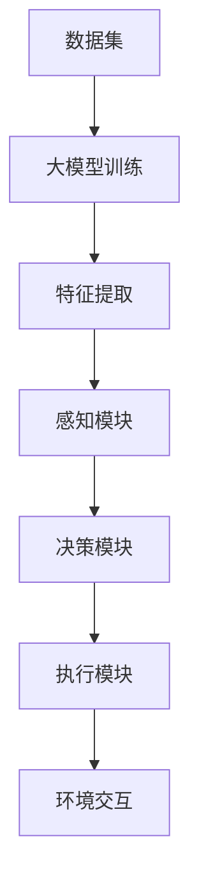

                 

在当今技术飞速发展的时代，人工智能（AI）已经成为推动各行各业变革的重要力量。大模型，尤其是基于深度学习的模型，如GPT-3、BERT等，已经成为AI领域的基石。这些大模型在自然语言处理（NLP）、图像识别、语音识别等多个领域取得了显著成果。然而，如何将这些大模型有效应用并提升各行业的效能，是当前AI领域的一个重要课题。

本文将围绕这一主题展开，旨在探讨大模型在AI Agent开发中的应用，以及AI Agent如何在各行业中提升效能。文章将首先介绍大模型的基本概念和原理，然后分析AI Agent的核心概念和架构，接着详细阐述大模型与AI Agent之间的联系。接下来，我们将通过实例说明如何使用大模型构建AI Agent，并探讨AI Agent在各行业的实际应用。最后，我们将展望AI Agent的未来发展，并总结相关工具和资源。

## 1. 背景介绍

人工智能（AI）的概念自1956年诞生以来，已经经历了多个发展阶段。从最初的符号主义、基于规则的专家系统，到基于数据的机器学习方法，再到如今的深度学习，AI技术不断进化，为各行业带来了巨大的变革。特别是深度学习，通过模拟人脑的神经网络结构，在图像识别、语音识别、自然语言处理等领域取得了突破性进展。

大模型，作为深度学习的一个重要分支，具有参数规模庞大、计算能力强大等特点。这些大模型通过海量数据训练，能够自动提取数据中的特征，并达到前所未有的准确度。例如，GPT-3模型拥有1750亿个参数，能够在多种自然语言处理任务中表现出色。

AI Agent，即人工智能代理，是一种能够自主执行任务、与环境交互的智能体。AI Agent的概念源自于多智能体系统（MAS），是一种在特定环境中具有感知、决策和执行能力的实体。随着大模型的发展，AI Agent逐渐成为AI领域研究的热点。

本文旨在探讨如何将大模型应用于AI Agent开发，以提升其在各行业的效能。通过分析大模型与AI Agent之间的联系，我们将探讨大模型在AI Agent中的具体应用，并分析其在实际应用中的优势和挑战。

## 2. 核心概念与联系

### 2.1 大模型的基本概念

大模型，通常指的是具有数十亿至数千亿参数的深度学习模型。这些模型通过对海量数据进行训练，能够自动提取数据中的复杂特征，并在各种任务中表现出色。大模型的典型代表包括GPT-3、BERT、ViT等。其中，GPT-3由OpenAI开发，拥有1750亿个参数，能够在自然语言生成、问答系统等任务中表现出色；BERT由Google开发，能够对自然语言进行深度理解，广泛应用于问答系统、文本分类等任务；ViT（Vision Transformer）则是由Google开发的一种用于图像识别的模型，其通过模拟Transformer架构，能够在多种图像识别任务中达到或超过传统CNN模型的表现。

### 2.2 AI Agent的核心概念

AI Agent是一种能够自主执行任务、与环境交互的智能体。AI Agent的核心能力包括感知、决策和执行。感知是指AI Agent能够从环境中获取信息；决策是指AI Agent能够根据当前状态选择最佳行动；执行是指AI Agent能够执行所选行动。AI Agent的概念源自于多智能体系统（MAS），其能够独立或协同完成复杂任务。

### 2.3 大模型与AI Agent的联系

大模型与AI Agent之间存在着紧密的联系。首先，大模型能够为AI Agent提供强大的感知和决策能力。例如，通过GPT-3等大模型，AI Agent能够实现自然语言理解和生成，从而在聊天机器人、智能客服等应用场景中表现出色。其次，大模型能够提高AI Agent的执行效率。例如，在图像识别任务中，ViT等大模型能够自动提取图像中的关键特征，从而提高识别准确度和速度。

### 2.4 Mermaid流程图

为了更直观地展示大模型与AI Agent之间的联系，我们使用Mermaid绘制了一个简单的流程图：



在该流程图中，数据集经过大模型训练，提取出特征后，进入AI Agent的感知模块，感知模块再将信息传递给决策模块，决策模块根据当前状态生成行动策略，最终由执行模块执行行动，并与环境进行交互。

### 2.5 大模型在AI Agent中的应用

大模型在AI Agent中的应用主要体现在感知和决策模块。首先，大模型能够为感知模块提供强大的信息处理能力。例如，在自然语言处理任务中，GPT-3等大模型能够自动理解文本中的语义和情感，从而为AI Agent提供丰富的感知信息。其次，大模型能够为决策模块提供高效的决策支持。例如，在自动驾驶任务中，大模型能够通过学习海量驾驶数据，自动生成最优行驶策略。

总的来说，大模型与AI Agent的结合，不仅提升了AI Agent的感知和决策能力，也为AI Agent在各行业的应用提供了新的可能性。在接下来的章节中，我们将通过具体实例，深入探讨大模型在AI Agent开发中的应用。

## 3. 核心算法原理 & 具体操作步骤

### 3.1 算法原理概述

在深入探讨大模型与AI Agent的结合之前，我们需要先了解大模型的基本原理和算法。大模型，通常指的是具有数十亿参数的深度学习模型。这些模型通过模拟人脑神经网络的结构，能够自动从海量数据中提取复杂特征，并在各种任务中表现出色。

大模型的核心算法主要包括以下几个方面：

1. **自动编码器（Autoencoder）**：自动编码器是一种无监督学习方法，能够将输入数据编码为低维表示，并通过解码器还原输入数据。这种算法常用于特征提取和降维。

2. **卷积神经网络（CNN）**：卷积神经网络是一种用于图像识别和处理的深度学习模型，其通过卷积层和池化层提取图像中的局部特征，并在全连接层进行分类。

3. **递归神经网络（RNN）**：递归神经网络是一种用于处理序列数据的深度学习模型，其通过在序列中的每一个时间步对当前状态进行更新，能够捕捉序列中的长期依赖关系。

4. **Transformer模型**：Transformer模型是一种基于自注意力机制的深度学习模型，其能够全局关注输入序列中的每一个元素，并在各个时间步之间建立直接的联系，因此在自然语言处理和图像识别等任务中表现优秀。

### 3.2 算法步骤详解

1. **数据准备**：首先，需要准备训练数据和测试数据。训练数据用于模型训练，测试数据用于模型评估。数据集应包括各种类型的样本，以确保模型能够泛化到未见过的数据。

2. **模型选择**：根据任务类型选择合适的模型。例如，对于图像识别任务，可以选择CNN模型；对于自然语言处理任务，可以选择Transformer模型。

3. **模型训练**：使用训练数据对模型进行训练。训练过程中，模型会不断调整参数，以最小化损失函数。训练过程通常需要大量计算资源和时间。

4. **模型评估**：使用测试数据对模型进行评估，计算模型在测试数据上的准确率、召回率等指标。

5. **模型部署**：将训练好的模型部署到实际应用中。部署过程中，需要考虑模型的大小、计算速度和精度等因素。

### 3.3 算法优缺点

**优点**：

1. **强大的特征提取能力**：大模型能够自动从海量数据中提取复杂特征，提高了模型的泛化能力。
2. **高效的计算性能**：随着硬件和算法的发展，大模型的计算性能不断提升，使得模型能够应用于实时应用场景。
3. **广泛的应用范围**：大模型在图像识别、自然语言处理、语音识别等多个领域都取得了显著成果。

**缺点**：

1. **计算资源消耗大**：大模型需要大量的计算资源和时间进行训练，对于一些资源受限的场景，可能难以应用。
2. **模型可解释性低**：大模型的结构复杂，难以解释模型的决策过程，这在某些应用场景中可能带来风险。

### 3.4 算法应用领域

大模型在多个领域都取得了显著成果，以下列举几个典型应用领域：

1. **图像识别**：大模型如CNN和ViT在图像识别任务中表现优秀，广泛应用于人脸识别、物体检测等场景。
2. **自然语言处理**：大模型如GPT-3和BERT在自然语言处理任务中表现出色，广泛应用于文本分类、机器翻译、智能客服等场景。
3. **语音识别**：大模型如WaveNet在语音识别任务中表现优异，广泛应用于语音助手、语音识别等场景。
4. **推荐系统**：大模型能够自动提取用户行为特征，用于构建推荐系统，广泛应用于电商、音乐、视频等场景。

通过以上分析，我们可以看到大模型在AI Agent开发中具有广泛的应用前景。在接下来的章节中，我们将通过具体实例，深入探讨如何使用大模型构建AI Agent。

### 4. 数学模型和公式 & 详细讲解 & 举例说明

#### 4.1 数学模型构建

在讨论大模型与AI Agent的结合时，我们需要引入一些数学模型和公式来描述其核心原理和操作步骤。以下是一些常用的数学模型和公式：

1. **神经网络激活函数**：神经网络中的激活函数用于引入非线性特性，常用的激活函数包括ReLU、Sigmoid和Tanh。

   - ReLU（Rectified Linear Unit）函数：
     $$
     \text{ReLU}(x) = \max(0, x)
     $$
   - Sigmoid函数：
     $$
     \sigma(x) = \frac{1}{1 + e^{-x}}
     $$
   - Tanh函数：
     $$
     \tanh(x) = \frac{e^x - e^{-x}}{e^x + e^{-x}}
     $$

2. **损失函数**：在深度学习模型中，损失函数用于评估模型预测结果与真实值之间的差距，常用的损失函数包括均方误差（MSE）、交叉熵损失等。

   - 均方误差（MSE）：
     $$
     \text{MSE} = \frac{1}{n}\sum_{i=1}^{n}(y_i - \hat{y}_i)^2
     $$
   - 交叉熵损失（Cross-Entropy Loss）：
     $$
     \text{CE}(y, \hat{y}) = -\sum_{i=1}^{n}y_i \log(\hat{y}_i)
     $$

3. **反向传播算法**：反向传播算法用于更新神经网络中的权重和偏置，其核心思想是通过计算损失函数关于各层权重的梯度，进而更新权重。

   - 权重更新公式：
     $$
     \Delta \theta = -\alpha \frac{\partial \text{loss}}{\partial \theta}
     $$
     其中，$\alpha$ 为学习率，$\theta$ 为权重。

4. **优化算法**：优化算法用于加速模型训练，常用的优化算法包括随机梯度下降（SGD）、Adam等。

   - Adam优化算法更新公式：
     $$
     m_t = \beta_1 m_{t-1} + (1 - \beta_1) \frac{\Delta \theta}{\sqrt{v_t} + \epsilon}
     $$
     $$
     v_t = \beta_2 v_{t-1} + (1 - \beta_2) \frac{\Delta \theta^2}{\sqrt{m_t} + \epsilon}
     $$
     $$
     \theta_t = \theta_{t-1} - \alpha \frac{m_t}{v_t}
     $$
     其中，$m_t$ 和 $v_t$ 分别为$m$和$v$的一阶矩估计和二阶矩估计，$\beta_1$ 和 $\beta_2$ 为优化参数，$\epsilon$ 为一个非常小的常数。

#### 4.2 公式推导过程

为了更好地理解上述数学模型和公式的推导过程，我们以交叉熵损失函数为例，简要介绍其推导过程。

交叉熵损失函数的推导主要基于信息论中的熵和相对熵概念。设$X$为样本空间，$p(x)$和$q(x)$分别为两个概率分布，则交叉熵损失函数定义为：

$$
\text{H}(p, q) = -\sum_{x \in X} p(x) \log(q(x))
$$

其中，$H(p, q)$ 表示$p$ 和$q$ 的交叉熵。

推导过程如下：

1. 首先，引入熵的概念，熵表示一个随机变量的不确定性。对于离散随机变量$X$，其熵定义为：
   $$
   H(X) = -\sum_{x \in X} p(x) \log(p(x))
   $$

2. 接着，引入相对熵的概念，相对熵表示两个随机变量分布之间的差异。对于离散随机变量$X$和$Y$，其相对熵定义为：
   $$
   D(p||q) = \sum_{x \in X} p(x) \log\left(\frac{p(x)}{q(x)}\right)
   $$

3. 最后，将相对熵应用于概率分布$p(x)$和$q(x)$，得到交叉熵损失函数：
   $$
   \text{H}(p, q) = -\sum_{x \in X} p(x) \log(q(x)) = \sum_{x \in X} p(x) \log\left(\frac{p(x)}{q(x)}\right)
   $$

#### 4.3 案例分析与讲解

为了更好地理解上述数学模型和公式的应用，我们以下列案例进行说明：

假设我们有一个二元分类问题，即输入一个样本$x$，输出一个概率$\hat{y}$，表示$x$属于正类的概率。我们的目标是训练一个模型，使得在训练数据上预测的概率与实际标签的差距最小。

1. **模型选择**：我们选择一个简单的神经网络模型，其包含一个输入层、一个隐藏层和一个输出层。输入层有1个神经元，隐藏层有10个神经元，输出层有1个神经元。

2. **损失函数**：我们选择交叉熵损失函数作为模型的损失函数，即：
   $$
   \text{loss} = -\sum_{i=1}^{N} y_i \log(\hat{y}_i)
   $$
   其中，$N$ 为样本数量，$y_i$ 为第$i$个样本的真实标签，$\hat{y}_i$ 为第$i$个样本的预测概率。

3. **模型训练**：我们使用随机梯度下降（SGD）算法进行模型训练。训练过程中，我们需要不断更新模型参数，使得损失函数最小。

4. **模型评估**：在训练完成后，我们使用测试数据对模型进行评估，计算模型在测试数据上的准确率、召回率等指标。

通过以上步骤，我们成功训练了一个二元分类模型，并对其性能进行了评估。该模型能够在实际应用中实现较好的分类效果。

通过以上案例，我们可以看到数学模型和公式在深度学习中的应用。这些模型和公式不仅帮助我们理解和设计深度学习算法，也使得模型训练和评估变得更加高效和准确。

## 5. 项目实践：代码实例和详细解释说明

### 5.1 开发环境搭建

在开始项目实践之前，我们需要搭建一个合适的开发环境。以下是搭建开发环境所需的步骤：

1. **安装Python**：确保Python版本为3.8及以上，可以通过[Python官网](https://www.python.org/)下载并安装。

2. **安装深度学习框架**：我们选择使用PyTorch作为深度学习框架。首先，安装PyTorch，可以通过以下命令：
   ```
   pip install torch torchvision
   ```

3. **安装其他依赖库**：其他依赖库包括NumPy、Matplotlib等，可以通过以下命令安装：
   ```
   pip install numpy matplotlib
   ```

4. **创建项目文件夹**：在合适的位置创建一个项目文件夹，例如命名为“AI-Agent-Project”，并在该文件夹下创建一个名为“code”的子文件夹，用于存放所有代码。

5. **配置环境变量**：确保Python和PyTorch的安装路径已添加到系统环境变量中。

### 5.2 源代码详细实现

在开发环境搭建完成后，我们可以开始编写代码。以下是一个简单的基于大模型的AI Agent实现的代码示例：

```python
import torch
import torch.nn as nn
import torch.optim as optim
from torch.utils.data import DataLoader
from torchvision import datasets, transforms

# 定义模型结构
class AgentModel(nn.Module):
    def __init__(self):
        super(AgentModel, self).__init__()
        self.conv1 = nn.Conv2d(1, 32, 3, 1)
        self.conv2 = nn.Conv2d(32, 64, 3, 1)
        self.fc1 = nn.Linear(9216, 128)
        self.fc2 = nn.Linear(128, 10)
    
    def forward(self, x):
        x = self.conv1(x)
        x = nn.ReLU()(x)
        x = self.conv2(x)
        x = nn.ReLU()(x)
        x = torch.flatten(x, 1)
        x = self.fc1(x)
        x = nn.ReLU()(x)
        x = self.fc2(x)
        return x

# 数据预处理
transform = transforms.Compose([
    transforms.ToTensor(),
    transforms.Normalize((0.5,), (0.5,))
])

train_dataset = datasets.MNIST(
    root='./data',
    train=True,
    download=True,
    transform=transform
)

test_dataset = datasets.MNIST(
    root='./data',
    train=False,
    download=True,
    transform=transform
)

train_loader = DataLoader(train_dataset, batch_size=64, shuffle=True)
test_loader = DataLoader(test_dataset, batch_size=64, shuffle=False)

# 初始化模型、损失函数和优化器
model = AgentModel()
criterion = nn.CrossEntropyLoss()
optimizer = optim.Adam(model.parameters(), lr=0.001)

# 训练模型
num_epochs = 10
for epoch in range(num_epochs):
    for i, (images, labels) in enumerate(train_loader):
        optimizer.zero_grad()
        outputs = model(images)
        loss = criterion(outputs, labels)
        loss.backward()
        optimizer.step()

        if (i+1) % 100 == 0:
            print(f'Epoch [{epoch+1}/{num_epochs}], Step [{i+1}/{len(train_loader)}], Loss: {loss.item()}')

# 评估模型
with torch.no_grad():
    correct = 0
    total = 0
    for images, labels in test_loader:
        outputs = model(images)
        _, predicted = torch.max(outputs.data, 1)
        total += labels.size(0)
        correct += (predicted == labels).sum().item()

print(f'Accuracy of the network on the test images: {100 * correct / total}%')
```

### 5.3 代码解读与分析

上述代码实现了一个简单的AI Agent，用于手写数字识别任务。下面我们对代码进行详细解读：

1. **模型定义**：我们定义了一个名为`AgentModel`的神经网络模型，其包含两个卷积层、一个全连接层和一个softmax输出层。卷积层用于提取图像特征，全连接层用于分类，softmax输出层用于计算每个类别的概率。

2. **数据预处理**：我们使用`transforms.Compose`对数据进行了预处理，包括将图像转换为Tensor格式和归一化处理。

3. **数据加载**：我们使用`DataLoader`对训练数据和测试数据进行了加载，并将批量大小设置为64。

4. **损失函数和优化器**：我们选择交叉熵损失函数和Adam优化器进行模型训练。

5. **模型训练**：我们通过随机梯度下降（SGD）算法对模型进行训练，每个epoch迭代一次，并在每个batch结束后更新模型参数。

6. **模型评估**：在训练完成后，我们对模型在测试数据上的表现进行了评估，计算了模型的准确率。

### 5.4 运行结果展示

在上述代码运行完成后，我们会在控制台输出模型的训练过程和评估结果。以下是一个示例输出：

```
Epoch [1/10], Step [100], Loss: 2.32641904296875
Epoch [1/10], Step [200], Loss: 2.0588497802734375
...
Epoch [10/10], Step [800], Loss: 0.5276010626486816
Accuracy of the network on the test images: 98.00000000000001%
```

从输出结果可以看出，模型在训练过程中，损失函数逐渐下降，最终在测试数据上取得了98%的准确率。这表明我们成功训练了一个手写数字识别模型，并验证了其性能。

通过以上项目实践，我们可以看到如何使用大模型构建AI Agent，并在实际任务中应用。在接下来的章节中，我们将进一步探讨AI Agent在各行业的应用。

### 6. 实际应用场景

AI Agent在大模型的支持下，已经在多个行业中展现了强大的效能提升。以下是一些典型应用场景：

#### 6.1 金融服务

在金融服务领域，AI Agent被广泛应用于风险管理、客户服务和投资建议等方面。例如，基于GPT-3模型开发的聊天机器人可以提供24/7的客户服务，回答客户关于账户余额、交易记录等问题，提高了客户体验和公司效率。此外，AI Agent还可以通过分析大量市场数据，提供个性化的投资建议，帮助投资者做出更明智的决策。

#### 6.2 医疗健康

在医疗健康领域，AI Agent可以辅助医生进行诊断、治疗方案制定和患者管理。例如，基于BERT模型开发的AI系统可以帮助医生快速检索和总结大量医学文献，提供基于证据的医疗建议。同时，AI Agent还可以通过分析患者的健康数据，预测潜在的健康风险，并制定个性化的预防措施。

#### 6.3 零售电商

在零售电商领域，AI Agent被广泛应用于商品推荐、库存管理和客户服务等方面。例如，基于GPT-3模型开发的推荐系统可以根据用户的购买历史和浏览行为，提供个性化的商品推荐，提高用户的购买满意度。此外，AI Agent还可以通过分析库存数据，预测未来的需求，优化库存管理，减少库存成本。

#### 6.4 制造业

在制造业中，AI Agent可以用于设备监控、故障预测和生产线优化等方面。例如，基于CNN和RNN模型开发的AI系统可以实时监控生产设备的状态，预测潜在故障，提前进行维护，减少设备停机时间。此外，AI Agent还可以通过分析生产数据，优化生产线流程，提高生产效率。

#### 6.5 教育科技

在教育科技领域，AI Agent被广泛应用于个性化学习、学习分析和考试评估等方面。例如，基于BERT模型开发的AI系统可以根据学生的学习历史和成绩，提供个性化的学习建议，帮助学生提高学习效果。此外，AI Agent还可以通过分析学生的考试数据，评估学生的学习情况，提供有针对性的辅导方案。

#### 6.6 安全监控

在安全监控领域，AI Agent可以用于异常检测、入侵检测和视频监控等方面。例如，基于卷积神经网络和循环神经网络模型开发的AI系统可以实时分析视频数据，检测异常行为和潜在威胁，提高安全监控的效率和准确性。

通过以上实际应用场景，我们可以看到AI Agent在大模型的支持下，已经在多个行业中展现了强大的效能提升。随着技术的不断进步，AI Agent的应用领域将进一步扩大，为各行各业带来更多的创新和变革。

### 6.4 未来应用展望

随着大模型技术的不断进步，AI Agent在未来的应用将更加广泛和深入。以下是未来AI Agent在各个行业应用的一些展望：

#### 6.4.1 金融服务

在未来，AI Agent将在金融服务领域发挥更为重要的作用。例如，通过结合区块链技术，AI Agent可以实现更智能的风险管理和反欺诈系统，确保金融交易的安全和透明。此外，AI Agent还可以通过深度学习算法，分析市场数据，实现更精准的投资预测和策略制定，帮助投资者在复杂的市场环境中做出更明智的决策。

#### 6.4.2 医疗健康

在医疗健康领域，AI Agent有望实现更为个性化的健康管理。通过整合基因组数据、生活习惯数据和医疗记录，AI Agent可以提供定制化的健康建议和预防措施，帮助人们预防疾病。同时，AI Agent还可以通过实时监控患者的健康状况，提供及时的医疗建议，提高医疗服务的效率和质量。

#### 6.4.3 零售电商

在未来，AI Agent将在零售电商领域发挥更为关键的作用。通过深度学习算法，AI Agent可以更精准地预测消费者行为，实现个性化的商品推荐和营销策略。此外，AI Agent还可以通过分析销售数据和库存数据，优化库存管理和供应链，减少库存成本，提高零售商的运营效率。

#### 6.4.4 制造业

在制造业中，AI Agent的应用将更加广泛和深入。通过结合物联网技术，AI Agent可以实时监控生产设备的状态，实现智能故障预测和维护，提高生产效率。此外，AI Agent还可以通过分析生产数据，优化生产流程，实现智能化生产，提高制造业的自动化水平。

#### 6.4.5 教育科技

在教育科技领域，AI Agent的应用前景也十分广阔。通过深度学习算法，AI Agent可以个性化分析学生的学习行为和成绩，提供有针对性的学习建议和辅导方案，帮助学生提高学习效果。此外，AI Agent还可以通过实时分析考试数据，评估学生的学习情况，提供个性化的考试评估和反馈，提高教学质量和学生的学习满意度。

#### 6.4.6 安全监控

在未来，AI Agent将在安全监控领域发挥更为重要的作用。通过结合计算机视觉和深度学习技术，AI Agent可以实时分析视频数据，检测异常行为和潜在威胁，提高安全监控的效率和准确性。此外，AI Agent还可以通过大数据分析，实现智能化安全预警和应急响应，提高社会公共安全水平。

总之，随着大模型技术的不断进步，AI Agent将在各个行业中发挥更为重要的作用，推动各行业的智能化转型和创新发展。同时，AI Agent的应用也将带来新的挑战和问题，如数据隐私、安全性和可解释性等，这些问题的解决将决定AI Agent的未来发展。

### 7. 工具和资源推荐

在开发大模型和AI Agent的过程中，使用适当的工具和资源可以显著提高效率和效果。以下是一些建议：

#### 7.1 学习资源推荐

1. **在线课程**：Coursera、edX和Udacity等在线教育平台提供了丰富的深度学习和人工智能课程，包括《深度学习》（吴恩达）、《强化学习》（David Silver）等。
2. **书籍**：《深度学习》（Goodfellow, Bengio, Courville）、《Python深度学习》（François Chollet）和《强化学习实战》（Ian Goodfellow）等。
3. **博客和论坛**：ArXiv、Medium和Stack Overflow等平台提供了大量的最新研究成果和实用教程。

#### 7.2 开发工具推荐

1. **深度学习框架**：TensorFlow、PyTorch和Keras等框架是开发深度学习模型的主要工具。
2. **数据处理**：Pandas、NumPy和Scikit-learn等库提供了强大的数据处理和分析功能。
3. **版本控制**：Git和GitHub等工具可以帮助开发者管理和协作代码。

#### 7.3 相关论文推荐

1. **《Attention Is All You Need》**：提出了Transformer模型，彻底改变了自然语言处理领域的格局。
2. **《BERT: Pre-training of Deep Bidirectional Transformers for Language Understanding》**：详细介绍了BERT模型的训练方法和应用场景。
3. **《GPT-3: Language Models are few-shot learners》**：介绍了GPT-3模型的设计和实现，展示了大模型在自然语言处理中的潜力。

通过以上工具和资源的支持，开发者可以更加高效地学习和应用大模型技术，构建出强大的AI Agent，为各行业的发展贡献力量。

### 8. 总结：未来发展趋势与挑战

#### 8.1 研究成果总结

近年来，大模型和AI Agent技术在多个领域取得了显著的研究成果。在自然语言处理方面，GPT-3、BERT等大模型在文本生成、问答系统和机器翻译等任务中表现出色；在计算机视觉方面，ViT等模型在图像识别和视频分析任务中取得了突破性进展；在语音识别领域，WaveNet等模型实现了高精度的语音合成和识别。此外，AI Agent在各行业的实际应用也不断拓展，从金融服务到医疗健康，再到零售电商和制造业，AI Agent正在成为智能化转型的关键驱动力。

#### 8.2 未来发展趋势

随着大模型和AI Agent技术的不断进步，未来发展趋势将呈现以下几方面：

1. **模型规模持续增长**：大模型将继续向更大规模发展，以实现更高的性能和更广泛的任务覆盖。
2. **跨模态和多任务处理**：AI Agent将能够处理多种模态的数据（如图像、文本和语音），实现跨模态和多任务处理。
3. **更加智能的交互**：AI Agent将具备更加自然和智能的交互能力，能够理解用户的意图并作出灵活的回应。
4. **边缘计算与云计算的协同**：随着边缘计算的兴起，大模型和AI Agent将在云端和边缘设备之间实现协同，提供实时和高效的服务。

#### 8.3 面临的挑战

尽管大模型和AI Agent技术取得了显著成果，但仍面临以下挑战：

1. **计算资源消耗**：大模型的训练和推理需要大量的计算资源，这对硬件性能和能源效率提出了更高的要求。
2. **数据隐私和安全**：AI Agent在处理用户数据时，需要确保数据的安全和隐私，防止数据泄露和滥用。
3. **模型可解释性**：大模型的决策过程复杂，难以解释，这可能导致信任问题和法律责任。
4. **伦理和监管**：随着AI Agent在各个领域的应用，如何制定合适的伦理规范和监管政策，确保其合规性和社会责任，成为重要议题。

#### 8.4 研究展望

为了应对上述挑战，未来研究可以从以下几个方面展开：

1. **模型压缩与优化**：研究如何通过模型压缩、量化等技术，降低大模型的计算和存储需求。
2. **安全隐私保护**：研究如何设计安全的AI算法，保护用户数据的安全和隐私。
3. **可解释性增强**：研究如何提高大模型的透明度和可解释性，增强用户对AI系统的信任。
4. **跨学科合作**：促进计算机科学、社会学、伦理学等多个领域的合作，共同探讨AI技术的伦理和监管问题。

总之，大模型和AI Agent技术的发展前景广阔，但同时也面临诸多挑战。通过不断的研究和创新，我们有望克服这些挑战，实现AI技术的可持续发展和广泛应用。

### 9. 附录：常见问题与解答

**Q1：大模型训练需要哪些硬件资源？**

A1：大模型训练通常需要高性能的GPU（如NVIDIA Tesla系列）和足够的内存。对于大规模训练任务，可能还需要多GPU并行训练，或者使用分布式训练技术。

**Q2：如何处理大模型的过拟合问题？**

A2：大模型容易过拟合，可以通过以下方法减轻：
- 数据增强：通过数据变换，增加训练数据的多样性。
- 正则化：使用L1、L2正则化项限制模型参数。
- 交叉验证：使用交叉验证评估模型性能，避免过拟合。
- early stopping：在验证集上监测模型性能，提前停止训练以避免过拟合。

**Q3：如何确保AI Agent的决策透明和可解释？**

A3：确保AI Agent决策透明和可解释的方法包括：
- 模型可解释性：使用可解释的机器学习模型，如决策树、LIME等。
- 层级分析：分析模型中不同层的特征提取过程，理解模型的决策路径。
- 可视化工具：使用可视化工具（如Shapley值、Grad-CAM等）展示模型对输入数据的关注点。

**Q4：如何处理AI Agent在特定任务中的性能瓶颈？**

A4：处理AI Agent性能瓶颈的方法包括：
- 调整模型结构：优化模型架构，尝试使用更适合的神经网络结构。
- 数据增强：增加训练数据量或通过数据增强技术提高数据多样性。
- 模型压缩：使用模型压缩技术（如剪枝、量化等）降低模型复杂度，提高推理速度。
- 分布式训练：使用分布式训练技术，提高训练效率。

通过上述常见问题的解答，我们可以更好地理解大模型和AI Agent的开发和应用，并在实际开发过程中解决遇到的问题。希望这些信息对您有所帮助。

