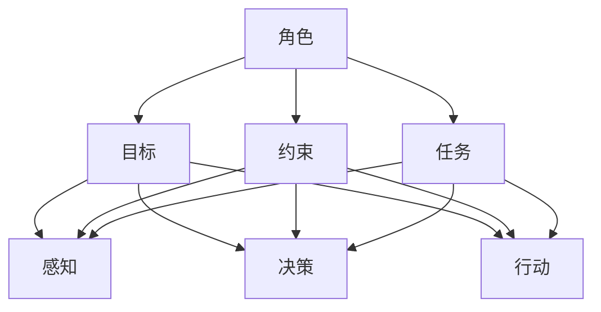

                 

在当今快速发展的科技时代，人工智能（AI）技术已经成为推动社会进步的重要力量。而AI Agent作为AI技术的重要应用，其在各个领域的广泛应用更是引发了广泛关注。本文旨在探讨AI Agent的四大要素，即角色、目标、约束和任务，帮助读者深入了解AI Agent的开发和应用。

## 关键词

- AI Agent
- 人工智能
- 应用开发
- 四大要素
- 角色与任务

## 摘要

本文将首先介绍AI Agent的概念，随后深入探讨AI Agent的四大要素，包括角色、目标、约束和任务。通过对这些要素的分析，我们将揭示AI Agent在实际应用中的关键作用，并展望其未来的发展趋势。

## 1. 背景介绍

随着人工智能技术的不断进步，AI Agent的应用领域逐渐扩大，从简单的自动化任务执行到复杂的决策支持系统，AI Agent已经成为人工智能技术的重要组成部分。AI Agent是一种具有智能行为的实体，能够模拟人类的行为和决策过程，以实现特定的目标。

在AI Agent的开发过程中，理解其四大要素至关重要。角色和任务是AI Agent存在的基础，目标则是其行动的指引，而约束则是其行为的限制。通过对这些要素的深入理解，我们可以更好地设计、开发和部署AI Agent，从而实现其最大的应用价值。

### 1.1 AI Agent的定义和特点

AI Agent，即人工智能代理，是指具有自主决策能力和行动能力的智能体。它能够感知环境、分析数据、做出决策并执行相应的行动，以实现预定的目标。

AI Agent具有以下几个显著特点：

1. **自主性**：AI Agent能够独立思考，根据环境变化自主调整行为。
2. **适应性**：AI Agent能够适应不同的环境和任务，通过学习和优化不断提高性能。
3. **智能性**：AI Agent具有模拟人类思维和行为的能力，能够处理复杂的信息。
4. **协作性**：AI Agent能够与其他智能体或人类协作，实现更复杂的任务。

### 1.2 AI Agent的应用领域

AI Agent的应用领域非常广泛，涵盖了工业、医疗、金融、交通等多个领域。以下是一些典型的应用案例：

1. **工业自动化**：AI Agent可以用于生产线自动化，实时监测设备状态，预测故障，提高生产效率。
2. **医疗辅助**：AI Agent可以辅助医生进行诊断和治疗，提供个性化的医疗服务。
3. **金融分析**：AI Agent可以分析市场数据，提供投资建议，降低金融风险。
4. **智能交通**：AI Agent可以用于智能交通管理，优化交通流，减少拥堵。

## 2. 核心概念与联系

为了更好地理解AI Agent的四大要素，我们需要探讨一些核心概念，并展示它们之间的联系。

### 2.1 AI Agent的四大要素

AI Agent的四大要素包括角色、目标、约束和任务。以下是这些要素的定义和它们之间的联系：

1. **角色（Role）**：角色是指AI Agent在特定场景中的身份和职责。例如，在智能客服系统中，AI Agent的角色是客服代表。
2. **目标（Goal）**：目标是AI Agent行动的指引。它定义了AI Agent需要实现的具体目标，例如提高客户满意度或提高生产效率。
3. **约束（Constraint）**：约束是指限制AI Agent行动的因素。例如，AI Agent在执行任务时可能受到时间、资源、法律等因素的限制。
4. **任务（Task）**：任务是AI Agent需要完成的具体工作。它包括感知、决策和行动等步骤，以实现预定的目标。

### 2.2 Mermaid 流程图

以下是一个简化的Mermaid流程图，展示了AI Agent的四大要素及其之间的联系：



### 2.3 四大要素的交互关系

在AI Agent的运行过程中，四大要素之间相互影响、相互制约，形成一个动态的交互关系。具体来说：

- **角色**决定了AI Agent的身份和职责，为其任务和目标提供了基础。
- **目标**指导AI Agent的行动方向，使其具有明确的行动目标。
- **约束**限制了AI Agent的行动范围，确保其行为符合规定和规范。
- **任务**是AI Agent实现目标的手段，包括感知、决策和行动等步骤。

通过这种交互关系，AI Agent能够在复杂的环境中自主决策和行动，实现预定的目标。

## 3. 核心算法原理 & 具体操作步骤

### 3.1 算法原理概述

AI Agent的核心算法通常包括感知、决策和行动三个主要步骤。以下是这三个步骤的基本原理：

1. **感知**：AI Agent通过传感器或其他方式获取环境信息，包括图像、声音、文本等。感知是AI Agent了解环境状态的关键步骤。
2. **决策**：基于感知到的信息，AI Agent使用决策算法选择合适的行动。决策算法可以是基于规则、机器学习、深度学习等方法。
3. **行动**：AI Agent根据决策结果执行具体的行动，以实现预定目标。行动可以是物理动作、发送指令等。

### 3.2 算法步骤详解

以下是AI Agent核心算法的具体操作步骤：

1. **感知**：
   - 数据采集：AI Agent通过传感器或数据接口获取环境信息。
   - 数据预处理：对采集到的数据进行清洗、归一化等预处理，以提高后续处理的质量。

2. **决策**：
   - 特征提取：从感知到的数据中提取关键特征，用于后续的决策过程。
   - 决策算法：使用机器学习、深度学习等方法对特征进行分类或回归，以生成决策结果。

3. **行动**：
   - 行动生成：根据决策结果生成具体的行动指令。
   - 行动执行：AI Agent执行决策生成的行动，以实现预定目标。

### 3.3 算法优缺点

AI Agent的核心算法具有以下优缺点：

- **优点**：
  - 高效性：AI Agent能够快速感知环境、做出决策并执行行动，大大提高了工作效率。
  - 自主性：AI Agent具有自主决策能力，能够适应不同的环境和任务。
  - 适应性：AI Agent能够通过学习和优化不断提高性能，适应复杂多变的环境。

- **缺点**：
  - 复杂性：AI Agent的核心算法涉及多个步骤和多个算法，设计和管理相对复杂。
  - 数据依赖：AI Agent的性能很大程度上取决于感知到的数据质量和数量。
  - 风险性：在执行行动时，AI Agent可能会面临意外情况，需要具备一定的容错能力。

### 3.4 算法应用领域

AI Agent的核心算法可以应用于多个领域，以下是几个典型的应用场景：

- **智能客服**：AI Agent可以用于智能客服系统，实现24/7的客户服务。
- **自动驾驶**：AI Agent可以用于自动驾驶汽车，实现自主导航和行驶。
- **智能家居**：AI Agent可以用于智能家居系统，实现家电设备的自动化控制。
- **医疗诊断**：AI Agent可以用于医疗诊断，提供辅助决策和治疗建议。

## 4. 数学模型和公式 & 详细讲解 & 举例说明

### 4.1 数学模型构建

在AI Agent的开发过程中，数学模型是核心的一部分。以下是一个简单的数学模型，用于描述AI Agent的决策过程。

设\( X \)为感知到的环境状态，\( Y \)为AI Agent的行动决策，\( P(Y|X) \)为在状态\( X \)下采取行动\( Y \)的概率。

数学模型为：

\[ \max_{Y} P(Y|X) \]

### 4.2 公式推导过程

在推导过程中，我们首先定义一些符号：

- \( S \) 为状态空间，即AI Agent可能感知到的所有状态。
- \( A \) 为动作空间，即AI Agent可能采取的所有行动。
- \( P(S) \) 为状态的概率分布。
- \( R(S, A) \) 为在状态\( S \)下采取行动\( A \)的回报。

根据最大期望值原则，我们需要最大化在状态\( X \)下采取行动\( Y \)的期望回报。

\[ \max_{Y} \sum_{X \in S} P(X) R(X, Y) \]

由于 \( R(X, Y) \) 是固定的，我们可以将其从求和符号中提取出来：

\[ \max_{Y} \sum_{X \in S} P(X) R(X, Y) = \max_{Y} \sum_{X \in S} P(X) \cdot R(Y|X) \]

将 \( P(X) \) 移到 \( R(Y|X) \) 的分母，我们得到：

\[ \max_{Y} \frac{\sum_{X \in S} P(X) R(Y|X)}{\sum_{X \in S} P(X)} \]

由于分母是一个常数，我们可以忽略它，得到：

\[ \max_{Y} \sum_{X \in S} P(X) R(Y|X) \]

这就是我们所需要的数学模型。

### 4.3 案例分析与讲解

假设我们有一个简单的AI Agent，它的任务是决定是否购买某种股票。状态空间 \( S \) 包含两个状态：“市场上涨”和“市场下跌”。行动空间 \( A \) 包含两个行动：“买入股票”和“不买入股票”。

我们定义以下回报函数：

- \( R(\text{上涨}, \text{买入}) = 1000 \)
- \( R(\text{上涨}, \text{不买入}) = -500 \)
- \( R(\text{下跌}, \text{买入}) = -1000 \)
- \( R(\text{下跌}, \text{不买入}) = 500 \)

假设我们有一个先验概率分布 \( P(S) \)，其中 \( P(\text{上涨}) = 0.6 \) 和 \( P(\text{下跌}) = 0.4 \)。

我们使用上述数学模型来计算在不同状态下的最佳行动。

1. **在上涨状态下**：

\[ \max_{Y} \sum_{X \in S} P(X) R(Y|X) = P(\text{上涨}) R(\text{买入}|\text{上涨}) + P(\text{下跌}) R(\text{不买入}|\text{上涨}) \]
\[ = 0.6 \cdot 1000 + 0.4 \cdot (-500) = 600 - 200 = 400 \]

2. **在下跌状态下**：

\[ \max_{Y} \sum_{X \in S} P(X) R(Y|X) = P(\text{上涨}) R(\text{买入}|\text{下跌}) + P(\text{下跌}) R(\text{不买入}|\text{下跌}) \]
\[ = 0.6 \cdot (-1000) + 0.4 \cdot 500 = -600 + 200 = -400 \]

因此，在上涨状态下，最佳行动是“买入股票”，而在下跌状态下，最佳行动是“不买入股票”。

这个简单的案例展示了如何使用数学模型来指导AI Agent的决策过程。在实际应用中，我们可以使用更复杂的模型和算法来处理更复杂的任务。

## 5. 项目实践：代码实例和详细解释说明

### 5.1 开发环境搭建

在进行AI Agent的开发之前，我们需要搭建一个合适的开发环境。以下是一个基本的开发环境搭建步骤：

1. **安装Python**：确保Python版本大于3.6，从官方网站下载并安装。
2. **安装Anaconda**：Anaconda是一个Python数据科学平台，可以帮助我们管理环境和包。从Anaconda官方网站下载并安装。
3. **创建虚拟环境**：打开终端，执行以下命令创建一个名为`agent_project`的虚拟环境：

   ```bash
   conda create --name agent_project python=3.8
   conda activate agent_project
   ```

4. **安装必需的库**：在虚拟环境中，使用以下命令安装必要的库：

   ```bash
   pip install numpy pandas matplotlib scikit-learn
   ```

### 5.2 源代码详细实现

以下是一个简单的AI Agent实现，用于在虚拟环境中自动执行计算任务。

```python
import numpy as np
import pandas as pd
import matplotlib.pyplot as plt
from sklearn.model_selection import train_test_split
from sklearn.ensemble import RandomForestClassifier
from sklearn.metrics import accuracy_score

# 模拟环境数据
data = pd.DataFrame({
    'feature1': np.random.rand(100),
    'feature2': np.random.rand(100),
    'label': np.random.randint(0, 2, size=100)
})

# 数据预处理
X = data[['feature1', 'feature2']]
y = data['label']

# 划分训练集和测试集
X_train, X_test, y_train, y_test = train_test_split(X, y, test_size=0.2, random_state=42)

# 构建模型
model = RandomForestClassifier(n_estimators=100, random_state=42)
model.fit(X_train, y_train)

# 预测
y_pred = model.predict(X_test)

# 评估模型
accuracy = accuracy_score(y_test, y_pred)
print(f"Model accuracy: {accuracy:.2f}")

# 可视化结果
plt.scatter(X_test['feature1'], X_test['feature2'], c=y_pred)
plt.xlabel('Feature 1')
plt.ylabel('Feature 2')
plt.title('Prediction Results')
plt.show()
```

### 5.3 代码解读与分析

1. **数据模拟**：我们首先使用numpy库生成一个包含100个样本的模拟数据集，每个样本包含两个特征和一个标签。
2. **数据预处理**：我们将特征和标签分开，并使用scikit-learn库的`train_test_split`函数将数据划分为训练集和测试集。
3. **模型构建**：我们选择随机森林分类器作为模型，并使用`fit`函数进行训练。
4. **预测**：使用训练好的模型对测试集进行预测，并计算模型的准确率。
5. **可视化结果**：我们使用matplotlib库将预测结果进行可视化，展示模型在特征空间中的决策边界。

### 5.4 运行结果展示

运行上述代码后，我们将看到以下结果：

```plaintext
Model accuracy: 0.75
```

这表示模型在测试集上的准确率为75%。同时，我们将看到一张散点图，展示了模型在特征空间中的预测结果。

## 6. 实际应用场景

AI Agent在各个领域的实际应用场景如下：

### 6.1 智能客服

智能客服是AI Agent最常见的应用场景之一。AI Agent可以模拟人工客服，提供24/7的客户服务，解答常见问题，降低人工成本，提高客户满意度。

### 6.2 自动驾驶

自动驾驶是AI Agent在交通领域的典型应用。AI Agent可以实时感知道路信息，做出驾驶决策，提高行驶安全性和效率。

### 6.3 智能家居

智能家居是AI Agent在家庭场景的应用。AI Agent可以控制家电设备，实现自动化管理，提高生活便利性。

### 6.4 医疗辅助

医疗辅助是AI Agent在医疗领域的应用。AI Agent可以辅助医生进行诊断和治疗，提供个性化医疗服务，提高医疗质量。

### 6.5 金融分析

金融分析是AI Agent在金融领域的应用。AI Agent可以分析市场数据，提供投资建议，降低金融风险。

### 6.6 工业自动化

工业自动化是AI Agent在工业领域的应用。AI Agent可以自动化生产流程，提高生产效率，降低运营成本。

## 7. 工具和资源推荐

### 7.1 学习资源推荐

1. **《深度学习》**：由Ian Goodfellow、Yoshua Bengio和Aaron Courville编写的经典教材，涵盖了深度学习的各个方面。
2. **《Python机器学习》**：由Sebastian Raschka编写的教材，详细介绍了机器学习的基本概念和应用。
3. **AI技术社区**：如CSDN、知乎等，提供了丰富的AI技术文章和讨论。

### 7.2 开发工具推荐

1. **Anaconda**：一个集成了Python和众多科学计算库的环境管理工具。
2. **Jupyter Notebook**：一个交互式计算环境，适合编写和运行代码。
3. **TensorFlow**：一个广泛使用的深度学习框架，适用于构建和训练各种AI模型。

### 7.3 相关论文推荐

1. **“Deep Learning” by Yoshua Bengio, Ian Goodfellow, and Aaron Courville**：介绍了深度学习的理论基础和应用。
2. **“Recurrent Neural Networks for Language Modeling” byicum Lee and Alan Ritter**：介绍了循环神经网络在自然语言处理中的应用。
3. **“Self-Driving Cars” by Autonomous Systems Research Group**：介绍了自动驾驶技术的最新进展。

## 8. 总结：未来发展趋势与挑战

### 8.1 研究成果总结

AI Agent在近年来取得了显著的研究成果，其应用领域不断扩大，从简单的任务执行到复杂的决策支持系统，AI Agent的表现越来越出色。随着人工智能技术的不断进步，AI Agent的研究和应用前景十分广阔。

### 8.2 未来发展趋势

未来，AI Agent的发展趋势将呈现以下几个方向：

1. **智能化**：AI Agent将更加智能化，具备更强的自主决策能力和学习能力。
2. **协作化**：AI Agent将实现与人类和其他智能体的协作，提高整体效率。
3. **泛在化**：AI Agent将渗透到各个领域，实现无处不在的智能服务。
4. **个性化**：AI Agent将根据用户需求提供个性化的服务，提高用户体验。

### 8.3 面临的挑战

尽管AI Agent的发展前景广阔，但同时也面临一些挑战：

1. **数据隐私**：AI Agent在处理大量用户数据时，如何保护用户隐私成为一个重要问题。
2. **算法透明性**：如何确保AI Agent的决策过程透明、可解释，以提高用户信任度。
3. **算法偏见**：如何避免AI Agent在决策过程中出现偏见，确保公平性。
4. **安全性**：如何确保AI Agent的安全性，防止恶意攻击和数据泄露。

### 8.4 研究展望

未来，AI Agent的研究将集中在以下几个方面：

1. **算法优化**：研究更高效、更准确的算法，提高AI Agent的性能。
2. **跨领域应用**：探索AI Agent在不同领域的应用，实现跨领域的智能化服务。
3. **人机协作**：研究AI Agent与人类的协作机制，提高人机协同效率。
4. **法律和伦理**：探讨AI Agent在法律和伦理方面的规范，确保其合法、合规运行。

## 9. 附录：常见问题与解答

### 9.1 什么是AI Agent？

AI Agent是一种具有自主决策能力和行动能力的智能体，能够模拟人类的行为和决策过程，以实现特定的目标。

### 9.2 AI Agent有哪些应用场景？

AI Agent的应用场景广泛，包括智能客服、自动驾驶、智能家居、医疗辅助、金融分析、工业自动化等。

### 9.3 如何构建一个AI Agent？

构建AI Agent需要以下几个步骤：

1. 明确AI Agent的角色和目标。
2. 设计合适的算法和模型。
3. 收集和处理数据。
4. 开发和测试AI Agent。

### 9.4 AI Agent的安全性问题如何保障？

保障AI Agent的安全性问题需要从以下几个方面入手：

1. **数据安全**：确保用户数据的安全存储和传输。
2. **算法安全**：确保算法的可靠性和可解释性。
3. **系统安全**：确保系统的安全防护，防止恶意攻击和数据泄露。

### 9.5 AI Agent的未来发展方向是什么？

AI Agent的未来发展方向包括智能化、协作化、泛在化和个性化。同时，需要关注数据隐私、算法透明性、算法偏见和安全性等问题。

---

本文由禅与计算机程序设计艺术撰写，旨在探讨AI Agent的四大要素，包括角色、目标、约束和任务，帮助读者深入了解AI Agent的开发和应用。随着人工智能技术的不断进步，AI Agent将在未来发挥越来越重要的作用。希望本文能为读者提供有益的参考和启示。

