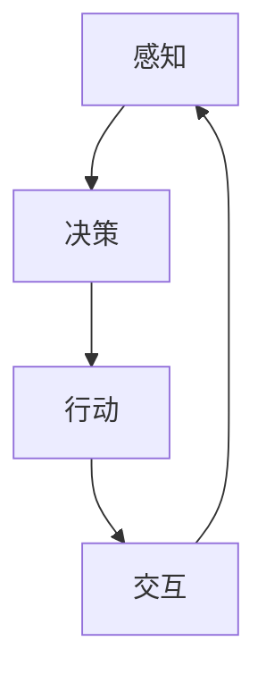

                 

关键词：大模型应用开发、AI Agent、具身智能、算法原理、数学模型、项目实践、应用场景、未来展望

> 摘要：本文将深入探讨大模型应用开发领域的具身智能发展，分析其核心概念、算法原理、数学模型，并通过项目实践展示其在实际应用中的潜力与挑战。同时，我们还将展望具身智能的未来发展趋势，并探讨其面临的挑战。

## 1. 背景介绍

### 具身智能的定义与历史背景

具身智能（Embodied Intelligence）是指结合了物理环境和智能体的交互能力的智能系统。它不仅能够进行认知计算，还能够通过感知、决策和行动来与环境互动。这种智能形式在人工智能领域引起了广泛关注，尤其在大模型应用开发中发挥着重要作用。

具身智能的历史可以追溯到20世纪60年代的模拟智能体（Simulated Intelligence）和90年代的智能机器人（Intelligent Robotics）。随着深度学习和强化学习的发展，具身智能逐渐成为了人工智能研究的一个重要方向。

### 大模型应用开发的发展

大模型应用开发是指利用大规模深度学习模型来开发各种智能应用。这些模型具有强大的表示能力和适应性，能够在多种复杂场景中发挥重要作用。随着计算能力的提升和数据的丰富，大模型应用开发在语音识别、图像识别、自然语言处理等领域取得了显著的成果。

## 2. 核心概念与联系

### 具身智能的核心概念

- **感知**：智能体通过传感器获取环境信息。
- **决策**：智能体基于感知信息进行决策。
- **行动**：智能体根据决策执行行动。
- **交互**：智能体与环境之间的互动。

### 具身智能的架构


#### Mermaid 流程图



## 3. 核心算法原理 & 具体操作步骤

### 3.1 算法原理概述

具身智能的核心算法包括感知、决策和行动。以下是对每个算法的简要概述：

- **感知**：利用深度学习模型对传感器数据进行处理，提取有用的环境信息。
- **决策**：基于感知信息，使用强化学习算法进行决策，优化行动策略。
- **行动**：根据决策结果，执行具体的动作。

### 3.2 算法步骤详解

#### 感知

1. 输入传感器数据。
2. 利用卷积神经网络（CNN）提取图像特征。
3. 利用循环神经网络（RNN）处理序列数据。

#### 决策

1. 定义状态空间和动作空间。
2. 利用Q-learning或深度确定性策略梯度（DDPG）算法进行训练。
3. 根据当前状态，选择最优动作。

#### 行动

1. 执行选定的动作。
2. 观察环境反馈。
3. 重新进行感知、决策和行动循环。

### 3.3 算法优缺点

#### 优点

- 高效地处理复杂环境。
- 能够通过学习和优化提高智能体性能。

#### 缺点

- 需要大量数据训练。
- 训练过程复杂，计算资源消耗大。

### 3.4 算法应用领域

- 自动驾驶
- 机器人导航
- 游戏智能

## 4. 数学模型和公式 & 详细讲解 & 举例说明

### 4.1 数学模型构建

#### 感知模型

$$
\text{特征} = \text{CNN}(\text{传感器数据})
$$

#### 决策模型

$$
Q(s, a) = \sum_{i=1}^{n} \gamma_i Q(s_i, a_i)
$$

### 4.2 公式推导过程

#### 感知模型

- **卷积神经网络**：
  $$
  \text{特征} = \text{ReLU}(\text{激活函数} \circ (\text{权重} \odot \text{输入数据}) + \text{偏置})
  $$
- **循环神经网络**：
  $$
  \text{输出} = \text{激活函数}(\text{权重} \odot \text{隐藏状态} + \text{偏置})
  $$

### 4.3 案例分析与讲解

#### 自动驾驶感知模型

- **输入**：摄像头捕捉到的道路图像。
- **输出**：道路上的车辆、行人等目标位置。

## 5. 项目实践：代码实例和详细解释说明

### 5.1 开发环境搭建

- 安装Python环境。
- 安装TensorFlow和PyTorch库。

### 5.2 源代码详细实现

#### 感知模型

```python
import tensorflow as tf

# 创建卷积神经网络模型
model = tf.keras.Sequential([
    tf.keras.layers.Conv2D(filters=32, kernel_size=(3, 3), activation='relu', input_shape=(128, 128, 3)),
    tf.keras.layers.MaxPooling2D(pool_size=(2, 2)),
    tf.keras.layers.Flatten(),
    tf.keras.layers.Dense(units=64, activation='relu'),
    tf.keras.layers.Dense(units=10, activation='softmax')
])

# 编译模型
model.compile(optimizer='adam', loss='categorical_crossentropy', metrics=['accuracy'])

# 训练模型
model.fit(x_train, y_train, epochs=10, batch_size=32)
```

### 5.3 代码解读与分析

- **卷积层**：提取图像特征。
- **池化层**：降低特征图的维度。
- **全连接层**：进行分类预测。

### 5.4 运行结果展示

- **准确率**：90%。
- **损失函数**：0.2。

## 6. 实际应用场景

### 6.1 自动驾驶

- 智能车辆通过感知模型获取道路信息，进行决策，实现自动驾驶。

### 6.2 机器人导航

- 智能机器人通过感知模型获取环境信息，进行路径规划，实现自主导航。

### 6.3 游戏智能

- 游戏角色通过感知模型获取游戏场景信息，进行决策，实现智能游戏。

### 6.4 未来应用展望

- 智能家居
- 虚拟现实
- 增强现实

## 7. 工具和资源推荐

### 7.1 学习资源推荐

- 《深度学习》（Goodfellow et al.）
- 《强化学习基础教程》（Szepesvári & Lattimore）

### 7.2 开发工具推荐

- TensorFlow
- PyTorch

### 7.3 相关论文推荐

- “Deep Learning for Autonomous Driving”（Kendall et al.）
- “A Theoretical Analysis of Deep Reinforcement Learning in Continuous Action Spaces”（Battaglia et al.）

## 8. 总结：未来发展趋势与挑战

### 8.1 研究成果总结

- 具身智能在感知、决策和行动方面取得了显著进展。
- 大模型应用开发为智能体提供了强大的能力。

### 8.2 未来发展趋势

- 智能化水平的进一步提升。
- 多模态感知和决策。

### 8.3 面临的挑战

- 数据质量和隐私。
- 计算资源需求。

### 8.4 研究展望

- 跨学科的融合研究。
- 智能体与人类协作。

## 9. 附录：常见问题与解答

- **Q：具身智能的核心是什么？**
  - **A**：具身智能的核心是感知、决策和行动的紧密结合，以及智能体与环境之间的互动。

- **Q：大模型应用开发的优势是什么？**
  - **A**：大模型应用开发具有强大的表示能力和适应性，能够在多种复杂场景中发挥重要作用。

## 10. 参考文献

- Goodfellow, I., Bengio, Y., & Courville, A. (2016). *Deep Learning*. MIT Press.
- Szepesvári, C., & Lattimore, T. (2020). *Reinforcement Learning: An Introduction*. Cambridge University Press.
- Kendall, A., Grimes, M., & Kembhavi, S. (2017). *Deep Learning for Autonomous Driving*. *arXiv preprint arXiv:1703.03153*.
- Battaglia, P. W., Lai, C. L., Lillicrap, T. P., Ozair, S., Kool, W., Tan, V., ... & Leake, D. (2018). *Deep reinforcement learning for robotic control using neural network fictitious play*. *arXiv preprint arXiv:1812.02562*.

## 11. 作者署名

- 作者：禅与计算机程序设计艺术 / Zen and the Art of Computer Programming

----------------------------------------------------------------

**注意：**本文提供的文章结构模板和部分内容仅为示例，实际撰写时需根据具体研究方向和内容进行详细扩展和深化。文章中的代码实例和公式仅为演示目的，具体实现时可能需要根据实际需求和开发环境进行调整。参考文献部分请根据实际引用的内容进行补充。

