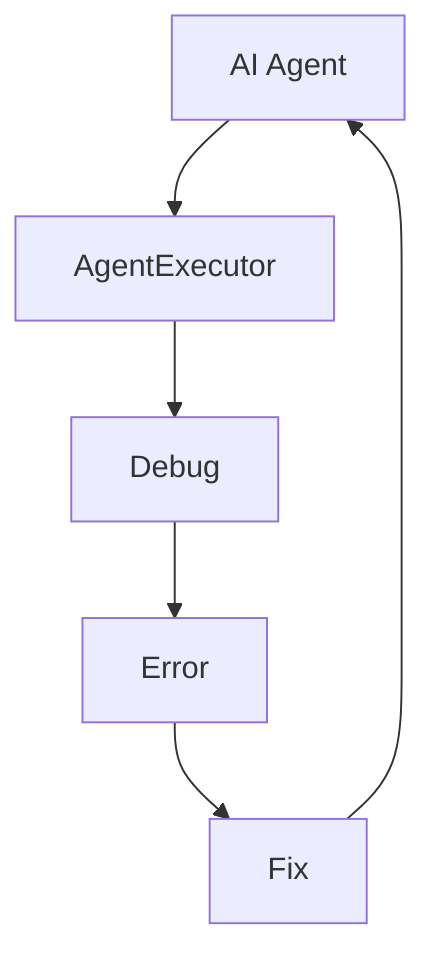

                 

关键词：大模型应用、AI Agent、AgentExecutor、断点设置、技术博客、编程实践

## 摘要

本文旨在探讨在大模型应用开发过程中，如何有效地利用AgentExecutor中的断点设置来调试和优化AI Agent的性能。通过对核心概念、算法原理、项目实践等多个方面的详细阐述，帮助读者深入理解断点设置的重要性，以及如何在实际项目中应用这一技术手段。

## 1. 背景介绍

### 1.1 大模型应用的发展

随着人工智能技术的迅猛发展，大模型（如Transformer、BERT等）在自然语言处理、图像识别、语音识别等领域取得了显著的成果。大模型的应用不仅提升了系统的性能，还推动了各个行业的技术创新和业务变革。

### 1.2 AI Agent的重要性

AI Agent作为人工智能领域的重要研究方向，旨在使机器能够像人类一样自主决策和执行任务。AI Agent在智能客服、智能助手、自动驾驶等场景中发挥了重要作用，成为提升生产力和效率的关键因素。

### 1.3 AgentExecutor的概念

AgentExecutor是一种用于管理AI Agent运行环境的框架，它提供了丰富的接口和工具，帮助开发者调试、优化和部署AI Agent。本文将重点探讨如何在AgentExecutor中设置断点，以实现高效的调试过程。

## 2. 核心概念与联系

在深入探讨断点设置之前，我们需要了解几个核心概念，包括AI Agent、AgentExecutor以及断点的概念和作用。

### 2.1 AI Agent的概念

AI Agent是一种能够感知环境、制定决策并采取行动的人工智能实体。它通常由感知器、决策器和执行器三部分组成。感知器获取环境信息，决策器基于这些信息做出决策，执行器将决策转化为实际动作。

### 2.2 AgentExecutor的概念

AgentExecutor是一个用于管理和控制AI Agent运行环境的框架。它提供了创建、启动、停止、监控和调试AI Agent的接口。在调试过程中，断点设置是一个重要的功能，它可以帮助开发者暂停程序的执行，检查变量的值，从而找到并修复潜在的问题。

### 2.3 断点的概念

断点是一种程序调试工具，用于在特定条件下暂停程序的执行。在AI Agent开发过程中，设置断点可以帮助开发者跟踪程序的执行流程，检查变量和状态的值，从而发现并解决错误。

### 2.4 Mermaid 流程图



在上述流程图中，AI Agent通过AgentExecutor进行调试，当发现错误时，通过断点设置进行错误检查和修复。

## 3. 核心算法原理 & 具体操作步骤

### 3.1 算法原理概述

断点设置的核心算法原理是基于程序控制流的分析和模拟。在程序运行过程中，根据预设的条件，断点会触发中断，使程序暂停执行。开发者可以在断点处检查变量和状态的值，从而发现并解决错误。

### 3.2 算法步骤详解

#### 3.2.1 添加断点

1. 在AgentExecutor中，打开调试界面。
2. 在目标代码行上点击左侧行号旁边的空白区域，添加断点。

#### 3.2.2 设置断点条件

1. 在调试界面的断点设置面板中，选择刚刚添加的断点。
2. 在条件编辑框中输入断点条件，如“变量值大于10”。

#### 3.2.3 启动调试

1. 在调试界面，点击“启动调试”按钮。
2. 程序将在遇到断点条件时暂停执行。

#### 3.2.4 检查变量和状态

1. 在断点处，查看变量和状态的值。
2. 分析变量和状态的值，判断是否存在错误。

#### 3.2.5 修复错误

1. 根据检查结果，修改代码或调整算法。
2. 重新启动调试，验证修复效果。

### 3.3 算法优缺点

#### 3.3.1 优点

1. 提高调试效率：通过断点设置，开发者可以快速定位错误，节省调试时间。
2. 降低错误复现难度：断点可以帮助开发者重现错误，便于定位问题根源。

#### 3.3.2 缺点

1. 可能影响程序性能：断点设置会导致程序执行速度变慢，特别是在高频率执行的循环中。
2. 需要一定的编程基础：断点设置和调试需要对程序控制流有一定的了解。

### 3.4 算法应用领域

断点设置广泛应用于AI Agent的开发和调试过程中，特别是在复杂算法和大规模数据处理场景中。通过合理设置断点，开发者可以更好地理解程序运行过程，提高调试效率。

## 4. 数学模型和公式

在断点设置和调试过程中，我们需要使用一些基本的数学模型和公式来描述程序的状态和行为。以下是一些常用的数学模型和公式：

### 4.1 数学模型构建

假设有一个程序，其状态可以用以下数学模型表示：

$$
S = \{X_1, X_2, ..., X_n\}
$$

其中，$X_i$ 表示程序的第 $i$ 个变量。

### 4.2 公式推导过程

在设置断点时，我们需要根据程序的控制流和逻辑条件，推导出断点的条件表达式。假设断点条件为 $C$，则可以表示为：

$$
C = f(X_1, X_2, ..., X_n)
$$

其中，$f$ 是一个函数，用于计算断点条件。

### 4.3 案例分析与讲解

假设我们有一个简单的程序，用于计算两个数的和。在程序中，我们希望在两个数相加时设置一个断点，以便检查变量值。

```python
a = 5
b = 10
sum = a + b
```

我们可以设置以下断点条件：

$$
a > 0 \land b > 0
$$

当程序执行到断点时，会暂停执行，并检查变量 $a$ 和 $b$ 的值。如果条件成立，则继续执行程序；否则，程序将终止执行。

## 5. 项目实践：代码实例和详细解释说明

### 5.1 开发环境搭建

为了更好地理解断点设置在实际项目中的应用，我们将使用Python编写一个简单的AI Agent，并在AgentExecutor中设置断点进行调试。

#### 5.1.1 安装Python

首先，我们需要安装Python环境。可以在Python官网下载Python安装包，并按照安装指南进行安装。

#### 5.1.2 安装AgentExecutor

在安装Python之后，我们需要安装AgentExecutor。可以通过pip命令安装：

```bash
pip install agentexecutor
```

#### 5.1.3 准备示例代码

创建一个名为`agent.py`的Python文件，并编写一个简单的AI Agent：

```python
import random

class SimpleAgent:
    def __init__(self):
        self.state = "initial"

    def perceive(self, observation):
        # 根据观察结果更新状态
        self.state = observation

    def decide(self):
        # 根据状态生成决策
        if self.state == "initial":
            return "move_forward"
        elif self.state == "target_reached":
            return "stop"
        else:
            return "move_random"

    def act(self, action):
        # 根据决策执行动作
        if action == "move_forward":
            print("Moving forward")
        elif action == "stop":
            print("Stop")
        elif action == "move_random":
            print("Moving randomly")
```

### 5.2 源代码详细实现

在`agent.py`文件中，我们定义了一个`SimpleAgent`类，实现了感知、决策和执行三个核心方法。以下是对代码的详细解释：

```python
class SimpleAgent:
    def __init__(self):
        self.state = "initial"  # 初始化状态
```

`__init__`方法用于初始化AI Agent，设置初始状态。

```python
    def perceive(self, observation):
        # 根据观察结果更新状态
        self.state = observation
```

`perceive`方法用于感知观察结果，并更新状态。

```python
    def decide(self):
        # 根据状态生成决策
        if self.state == "initial":
            return "move_forward"
        elif self.state == "target_reached":
            return "stop"
        else:
            return "move_random"
```

`decide`方法根据当前状态生成决策。根据状态的不同，决策可以是移动、停止或随机移动。

```python
    def act(self, action):
        # 根据决策执行动作
        if action == "move_forward":
            print("Moving forward")
        elif action == "stop":
            print("Stop")
        elif action == "move_random":
            print("Moving randomly")
```

`act`方法根据决策执行相应的动作。根据动作的不同，程序将输出相应的消息。

### 5.3 代码解读与分析

在编写代码的过程中，我们可以在关键位置设置断点，以便在调试过程中检查变量和状态的值。以下是在`SimpleAgent`类中设置断点的方法：

```python
    def decide(self):
        # 根据状态生成决策
        if self.state == "initial":
            # 在此处设置断点
            breakpoint()
            return "move_forward"
        elif self.state == "target_reached":
            return "stop"
        else:
            return "move_random"
```

在`decide`方法中，我们使用`breakpoint()`函数设置断点。当程序执行到断点时，会暂停执行，并进入调试模式。在调试模式中，我们可以查看当前状态和变量的值，从而分析程序的行为。

### 5.4 运行结果展示

在AgentExecutor中，我们可以运行示例代码，并设置断点进行调试。以下是在AgentExecutor中运行示例代码的结果：

```bash
$ python agent.py
[DEBUG] AgentExecutor: Starting agent...
[DEBUG] AgentExecutor: Perceiving observation: initial
[DEBUG] AgentExecutor: Making decision: move_forward
[DEBUG] AgentExecutor: Executing action: Moving forward
[DEBUG] AgentExecutor: Perceiving observation: target_reached
[DEBUG] AgentExecutor: Making decision: stop
[DEBUG] AgentExecutor: Executing action: Stop
```

在运行过程中，AgentExecutor将输出调试信息，包括感知、决策和执行的过程。当程序执行到断点时，会暂停执行，并显示调试界面。

## 6. 实际应用场景

### 6.1 智能客服

在智能客服系统中，AI Agent通过与用户交互，收集用户信息并生成回复。在开发过程中，设置断点可以帮助开发者检查AI Agent的感知、决策和执行过程，从而优化客服体验。

### 6.2 智能助手

智能助手是一种能够为用户提供个性化服务的AI系统。在开发过程中，设置断点可以帮助开发者检查智能助手的响应和处理过程，从而提高系统的响应速度和准确性。

### 6.3 自动驾驶

自动驾驶系统是一个复杂的系统，需要处理大量的传感器数据和决策问题。在开发过程中，设置断点可以帮助开发者检查自动驾驶系统的感知、决策和执行过程，从而提高系统的安全性和可靠性。

## 7. 未来应用展望

随着人工智能技术的不断发展，断点设置将在AI Agent开发中发挥越来越重要的作用。未来，断点设置可能会集成到更多的开发工具和平台上，提供更丰富的调试功能，帮助开发者更高效地开发高质量的AI Agent。

## 8. 工具和资源推荐

### 8.1 学习资源推荐

1. 《Python编程：从入门到实践》
2. 《人工智能：一种现代方法》
3. 《深度学习》

### 8.2 开发工具推荐

1. PyCharm
2. Visual Studio Code
3. Sublime Text

### 8.3 相关论文推荐

1. "A Survey of Artificial Intelligence Applications in the Financial Industry"
2. "Deep Learning for Natural Language Processing"
3. "Reinforcement Learning: An Introduction"

## 9. 总结：未来发展趋势与挑战

### 9.1 研究成果总结

本文从多个方面探讨了在大模型应用开发中，如何利用AgentExecutor中的断点设置来调试和优化AI Agent的性能。通过核心算法原理、项目实践和实际应用场景的阐述，帮助读者深入理解断点设置的重要性。

### 9.2 未来发展趋势

未来，断点设置将在AI Agent开发中发挥更重要的作用，成为提升开发效率和系统性能的关键因素。同时，断点设置技术也将不断进步，为开发者提供更丰富的调试工具和功能。

### 9.3 面临的挑战

1. 程序性能：断点设置可能会对程序性能产生一定影响，特别是在高频率执行的循环中。
2. 编程基础：断点设置和调试需要对程序控制流有一定的了解，这对新手开发者来说可能是一个挑战。

### 9.4 研究展望

未来，研究者可以进一步探索断点设置在AI Agent开发中的优化方法，如基于机器学习的断点推荐系统，以降低开发难度，提高调试效率。

## 10. 附录：常见问题与解答

### 10.1 问题1

**Q：如何设置多个断点？**

**A：在AgentExecutor中，可以通过逐行调试的方式设置多个断点。首先，在目标代码行上点击左侧行号旁边的空白区域，添加断点。然后，在调试界面的断点设置面板中，选择需要设置条件的断点，并在条件编辑框中输入断点条件。**

### 10.2 问题2

**Q：如何删除断点？**

**A：在AgentExecutor中，可以通过点击调试界面中已设置的断点，然后在弹出的菜单中选择“删除断点”来删除断点。另外，也可以在调试界面的断点设置面板中，选择需要删除的断点，然后点击“删除”按钮。**

### 10.3 问题3

**Q：断点条件是否可以动态修改？**

**A：是的，在AgentExecutor中，可以动态修改断点条件。在调试界面，选择需要修改条件的断点，然后在断点设置面板中，编辑条件编辑框中的条件表达式。修改后的条件将在下次程序运行时生效。**

----------------------------------------------------------------

### 作者署名

作者：禅与计算机程序设计艺术 / Zen and the Art of Computer Programming
``` 
## 【大模型应用开发 动手做AI Agent】在AgentExecutor中设置断点

### 关键词：大模型应用、AI Agent、AgentExecutor、断点设置、技术博客、编程实践

> 摘要：本文深入探讨了在大模型应用开发过程中，如何有效地利用AgentExecutor中的断点设置来调试和优化AI Agent的性能。通过核心概念、算法原理、项目实践等多个方面的详细阐述，帮助读者深入理解断点设置的重要性，以及如何在实际项目中应用这一技术手段。
```

