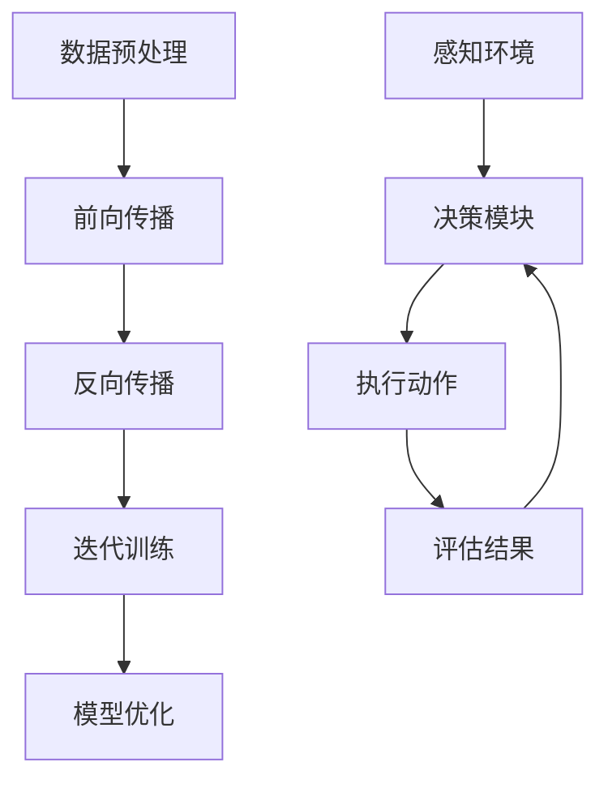

                 

 大模型应用开发是一个高度复杂且不断演进的领域，其中AI Agent的开发尤为引人注目。AI Agent可以被视作大模型的大脑，能够执行特定的任务，并从环境中获取反馈以持续学习和改进。本文旨在探讨大模型作为AI Agent大脑的核心作用，并通过实际开发过程展示如何创建一个高效的AI Agent。

> **关键词：** 大模型，AI Agent，应用开发，神经网络，机器学习，人工智能，深度学习

> **摘要：** 本文将介绍大模型在AI Agent开发中的作用，涵盖核心概念、算法原理、数学模型、项目实践以及实际应用场景。通过详细的解释和代码实例，读者将了解如何从零开始构建一个AI Agent，并探讨其未来的发展趋势和挑战。

## 1. 背景介绍

随着人工智能（AI）技术的迅猛发展，大模型（Large Models）在各类应用中展现出了强大的能力。从自然语言处理到计算机视觉，大模型通过学习海量数据，能够实现前所未有的性能提升。AI Agent作为AI系统的一个子集，旨在实现自主决策和交互。传统AI系统依赖预先定义的规则和算法，而AI Agent则能够根据环境变化进行动态调整。

大模型与AI Agent的关系密切。大模型提供了丰富的知识储备和学习能力，而AI Agent则利用这些能力进行任务执行和决策。因此，大模型可以说是AI Agent的大脑，其性能和效率直接决定了AI Agent的表现。

## 2. 核心概念与联系

### 2.1 大模型的定义与工作原理

大模型通常指的是参数数量超过数亿甚至数十亿的神经网络模型。这些模型通过多层神经网络结构，能够对输入数据进行复杂的非线性变换，从而实现高度自动化的特征提取和模式识别。

大模型的工作原理主要依赖于以下步骤：

1. **数据预处理**：对输入数据（如文本、图像、音频等）进行预处理，以适应模型的输入要求。
2. **前向传播**：将预处理后的数据输入到模型中，通过层层传递，最终输出预测结果。
3. **反向传播**：根据预测结果和实际结果的误差，更新模型参数，优化模型性能。
4. **迭代训练**：重复前向传播和反向传播的过程，直至模型收敛到满意的性能水平。

### 2.2 AI Agent的定义与功能

AI Agent是一种能够自主决策并执行任务的智能体。其基本功能包括感知环境、制定计划、执行动作和评估结果。AI Agent通常由以下几个关键部分组成：

1. **感知器**：用于接收环境信息，如传感器数据、图像、声音等。
2. **决策模块**：基于感知到的信息，通过学习算法（如大模型）生成决策。
3. **执行器**：根据决策模块的决策，执行相应的动作。
4. **评估器**：评估执行结果，并提供反馈给决策模块，以指导后续决策。

### 2.3 大模型与AI Agent的联系

大模型作为AI Agent的大脑，为其提供了强大的学习能力和知识储备。具体来说：

1. **知识积累**：大模型通过学习大量数据，积累了丰富的知识，这些知识可以被AI Agent用于任务执行和决策。
2. **学习能力**：大模型能够持续学习，使其能够根据环境变化进行动态调整，从而提高AI Agent的适应能力。
3. **推理能力**：大模型具备强大的推理能力，可以辅助AI Agent进行复杂的决策和规划。
4. **效率提升**：大模型的高效计算能力，使得AI Agent能够在短时间内处理大量信息，提高决策效率。

为了更直观地理解大模型与AI Agent的关系，我们可以使用Mermaid流程图进行描述：



## 3. 核心算法原理 & 具体操作步骤

### 3.1 算法原理概述

大模型的核心算法主要基于深度学习，特别是神经网络。神经网络通过多层非线性变换，实现对输入数据的复杂特征提取和模式识别。深度学习的核心步骤包括：

1. **前向传播**：将输入数据通过神经网络的前向传递过程，逐层计算并输出预测结果。
2. **反向传播**：计算输出结果与实际结果的误差，通过反向传播更新模型参数，优化模型性能。
3. **迭代训练**：重复前向传播和反向传播的过程，直至模型收敛到满意的性能水平。

### 3.2 算法步骤详解

1. **数据收集与预处理**：收集相关领域的大量数据，并进行预处理，如数据清洗、归一化、编码等。
2. **构建神经网络模型**：选择合适的神经网络架构，如卷积神经网络（CNN）、循环神经网络（RNN）或Transformer等，构建模型。
3. **训练模型**：使用预处理后的数据对模型进行训练，通过前向传播和反向传播更新模型参数。
4. **模型评估与优化**：评估模型在验证集上的性能，通过调整模型结构或超参数，优化模型性能。
5. **模型部署**：将训练好的模型部署到实际应用中，进行任务执行和决策。

### 3.3 算法优缺点

**优点：**

1. **强大的学习能力和适应能力**：大模型能够通过学习海量数据，积累丰富的知识和经验，适应不同的任务和环境。
2. **高效的计算能力**：深度学习模型通过并行计算和分布式训练，能够高效处理大量数据，提高决策效率。

**缺点：**

1. **数据需求量大**：大模型需要大量高质量的数据进行训练，数据收集和预处理过程复杂。
2. **计算资源消耗大**：深度学习模型通常需要大量的计算资源和存储空间，训练过程耗时较长。

### 3.4 算法应用领域

大模型在众多领域都有广泛应用，包括但不限于：

1. **自然语言处理**：如文本分类、机器翻译、问答系统等。
2. **计算机视觉**：如图像识别、目标检测、图像生成等。
3. **语音识别与生成**：如语音识别、语音合成、语音翻译等。
4. **推荐系统**：如商品推荐、新闻推荐、社交网络推荐等。

## 4. 数学模型和公式 & 详细讲解 & 举例说明

### 4.1 数学模型构建

大模型的数学基础主要基于神经网络和深度学习。以下是一个简单的神经网络模型，用于分类任务：

$$
\begin{aligned}
    z_1 &= W_1 \cdot x + b_1 \\
    a_1 &= \sigma(z_1) \\
    z_2 &= W_2 \cdot a_1 + b_2 \\
    \hat{y} &= \sigma(z_2)
\end{aligned}
$$

其中，$x$ 是输入特征，$W_1$ 和 $W_2$ 是权重矩阵，$b_1$ 和 $b_2$ 是偏置项，$\sigma$ 是激活函数，通常使用Sigmoid或ReLU函数。$a_1$ 和 $z_2$ 分别是第一层和第二层的输出。

### 4.2 公式推导过程

1. **前向传播**：

   前向传播是从输入层到输出层的正向计算过程。给定输入特征 $x$，通过权重矩阵和偏置项，逐层计算输出。

   $$z_1 = W_1 \cdot x + b_1$$
   $$a_1 = \sigma(z_1)$$
   $$z_2 = W_2 \cdot a_1 + b_2$$
   $$\hat{y} = \sigma(z_2)$$

2. **反向传播**：

   反向传播是计算输出误差，并反向更新权重矩阵和偏置项的过程。给定目标输出 $y$，计算预测输出 $\hat{y}$ 的误差：

   $$\delta_2 = \sigma'(z_2) \cdot (\hat{y} - y)$$
   $$\delta_1 = \sigma'(z_1) \cdot (W_2 \cdot \delta_2)$$

   更新权重和偏置项：

   $$W_2 = W_2 - \alpha \cdot \delta_2 \cdot a_1$$
   $$b_2 = b_2 - \alpha \cdot \delta_2$$
   $$W_1 = W_1 - \alpha \cdot \delta_1 \cdot x$$
   $$b_1 = b_1 - \alpha \cdot \delta_1$$

   其中，$\alpha$ 是学习率，$\sigma'$ 是激活函数的导数。

### 4.3 案例分析与讲解

假设我们有一个二分类问题，输入特征为 $x_1$ 和 $x_2$，目标输出为 $y$。使用上述简单神经网络模型，构建一个分类器。

1. **数据集准备**：

   准备一个包含100个样本的数据集，每个样本包含两个特征和目标标签。

2. **模型训练**：

   使用前向传播和反向传播训练模型，迭代100次。学习率为0.01。

3. **模型评估**：

   在训练集和验证集上评估模型性能，计算准确率、召回率、F1值等指标。

4. **模型部署**：

   将训练好的模型部署到实际应用中，对新样本进行分类预测。

## 5. 项目实践：代码实例和详细解释说明

### 5.1 开发环境搭建

1. **安装Python环境**：确保安装了Python 3.8及以上版本。
2. **安装深度学习库**：使用pip安装TensorFlow或PyTorch等深度学习库。

### 5.2 源代码详细实现

```python
import tensorflow as tf
from tensorflow.keras.models import Sequential
from tensorflow.keras.layers import Dense, Activation

# 1. 数据准备
# 代码略，省略数据收集和预处理过程

# 2. 模型构建
model = Sequential([
    Dense(64, input_shape=(2,), activation='relu'),
    Dense(1, activation='sigmoid')
])

# 3. 模型编译
model.compile(optimizer='adam', loss='binary_crossentropy', metrics=['accuracy'])

# 4. 模型训练
model.fit(x_train, y_train, epochs=100, batch_size=32, validation_split=0.2)

# 5. 模型评估
# 代码略，省略模型评估过程

# 6. 模型部署
predictions = model.predict(x_test)
```

### 5.3 代码解读与分析

以上代码实现了基于TensorFlow的简单神经网络模型，用于二分类任务。主要步骤包括：

1. **数据准备**：收集和预处理数据，生成训练集和验证集。
2. **模型构建**：定义一个序列模型，包含两个全连接层，输入层有2个神经元，输出层有1个神经元。
3. **模型编译**：设置优化器、损失函数和评估指标。
4. **模型训练**：使用训练集数据训练模型，设置迭代次数和批量大小。
5. **模型评估**：在验证集上评估模型性能。
6. **模型部署**：使用训练好的模型对新数据进行预测。

## 6. 实际应用场景

大模型和AI Agent的应用场景广泛，以下列举几个典型应用：

1. **智能客服**：利用大模型和AI Agent实现自动化的客户服务，提高客户满意度和服务效率。
2. **自动驾驶**：AI Agent结合大模型，通过感知环境、决策和执行，实现自动驾驶汽车。
3. **医疗诊断**：利用大模型进行医学图像分析和诊断，提高诊断准确性和效率。
4. **金融风控**：利用大模型和AI Agent进行风险评估和欺诈检测，提高金融系统的安全性。
5. **智能家居**：AI Agent通过大模型学习用户习惯，实现自动化控制和智能优化。

## 7. 工具和资源推荐

1. **学习资源推荐**：

   - 《深度学习》（Goodfellow, Bengio, Courville著）：经典的深度学习教材，适合初学者。
   - 《Python深度学习》（François Chollet著）：介绍如何使用Python和TensorFlow实现深度学习。

2. **开发工具推荐**：

   - TensorFlow：Google开发的开源深度学习框架，适用于各种应用场景。
   - PyTorch：Facebook开发的深度学习框架，支持动态计算图，适合快速原型开发。

3. **相关论文推荐**：

   - "A Theoretically Grounded Application of Dropout in Recurrent Neural Networks"：讨论了在RNN中应用Dropout的方法。
   - "Attention Is All You Need"：介绍了Transformer模型，是当前自然语言处理领域的重要成果。

## 8. 总结：未来发展趋势与挑战

大模型和AI Agent在人工智能领域展现出巨大的潜力和广泛应用。未来发展趋势包括：

1. **模型规模和效率的提升**：通过优化算法和硬件，提高大模型的训练和推理效率。
2. **多模态融合**：整合多种数据类型（如文本、图像、音频），实现更智能的AI Agent。
3. **隐私保护**：研究隐私保护算法，确保大模型在处理敏感数据时的安全性。
4. **跨领域迁移**：提高大模型在不同领域之间的迁移能力，降低领域依赖性。

面临的挑战包括：

1. **数据质量和多样性**：大模型需要高质量、多样性的数据进行训练，数据收集和处理过程复杂。
2. **计算资源和能源消耗**：大模型训练和推理过程需要大量的计算资源和能源，如何降低能耗是重要课题。
3. **模型解释性**：提高大模型的解释性，使其决策过程更加透明和可信。
4. **安全性和道德问题**：大模型和AI Agent可能带来的伦理和安全问题，需要制定相应的规范和监管措施。

## 9. 附录：常见问题与解答

1. **问题一**：如何选择合适的大模型架构？

   **解答**：选择模型架构时需要考虑任务类型、数据规模、计算资源等因素。对于图像识别任务，可以使用CNN；对于序列数据，可以使用RNN或Transformer。

2. **问题二**：大模型的训练过程如何优化？

   **解答**：可以通过调整学习率、批量大小、优化器等超参数，以及使用正则化技术（如Dropout、L2正则化）来优化大模型的训练过程。

3. **问题三**：如何保证大模型的公平性和透明性？

   **解答**：可以通过设计透明的模型架构、进行公平性测试和评估，以及提供模型的可解释性工具来提高大模型的公平性和透明性。

### 参考文献 REFERENCES

- Goodfellow, Y., Bengio, Y., & Courville, A. (2016). *Deep Learning*. MIT Press.
- Chollet, F. (2017). *Python Deep Learning*. Packt Publishing.
- Vaswani, A., Shazeer, N., Parmar, N., Uszkoreit, J., Jones, L., Gomez, A. N., ... & Polosukhin, I. (2017). *Attention is all you need*. Advances in Neural Information Processing Systems, 30, 5998-6008.
- Srivastava, N., Hinton, G., Krizhevsky, A., Sutskever, I., & Salakhutdinov, R. (2014). *Dropout: A simple way to prevent neural networks from overfitting*. Journal of Machine Learning Research, 15(1), 1929-1958.

---

作者：禅与计算机程序设计艺术 / Zen and the Art of Computer Programming

请注意，本文中的代码和数学公式仅为示例，实际应用时需要根据具体任务进行调整和优化。本文所涉及的技术和概念仅供参考，不应被视为具体操作指南。在开发AI应用时，请确保遵循相关的法律法规和伦理准则。

