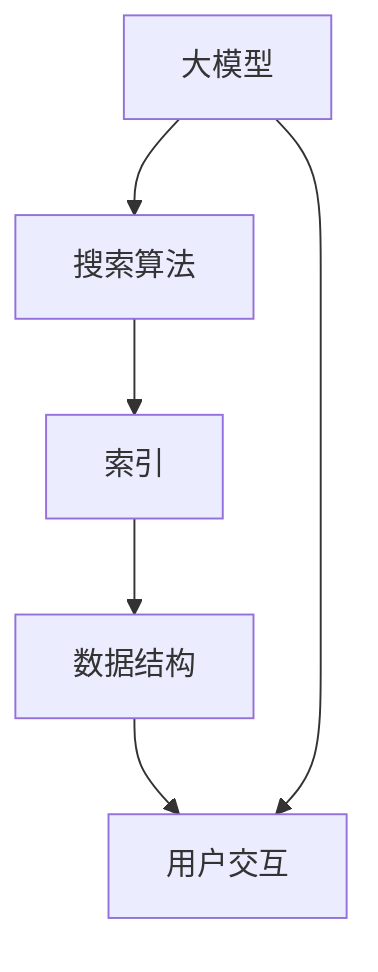

                 

关键词：大模型，AI Agent，搜索工具，开发，应用，算法原理，数学模型，项目实践，工具推荐

> 摘要：本文深入探讨大模型应用开发中的关键一环——定义搜索工具。我们将从背景介绍开始，阐述核心概念与联系，详细解释核心算法原理与操作步骤，推导数学模型与公式，并通过项目实践展示代码实例和运行结果。同时，本文还将探讨搜索工具的实际应用场景，以及未来应用展望和面临的挑战。

## 1. 背景介绍

随着人工智能技术的迅猛发展，大模型（如GPT-3，BERT等）逐渐成为各类应用的核心驱动力。这些大模型通过深度学习技术从大量数据中学习，具备强大的语义理解能力和生成能力。然而，如何有效地使用这些大模型进行任务调度、数据检索和决策支持，成为了研究人员和开发者面临的一大挑战。定义搜索工具在这个过程中起到了至关重要的作用。

搜索工具不仅是用户与AI模型交互的桥梁，也是提升大模型应用效果的关键。通过合理的搜索算法和数据结构设计，搜索工具能够大大提高查询响应速度和检索准确率，从而优化用户体验。因此，研究并开发高效的搜索工具，对于大模型应用的开发至关重要。

## 2. 核心概念与联系

在深入探讨搜索工具之前，我们需要了解几个核心概念：大模型、搜索算法、索引和数据结构。

### 2.1 大模型

大模型指的是具备大量参数和广泛知识储备的深度学习模型。这些模型通常通过预训练和微调的方式，从海量数据中学习并提取特征，从而实现强大的语义理解和生成能力。

### 2.2 搜索算法

搜索算法是用于在大量数据中查找特定信息的算法。在大模型应用中，搜索算法用于从大模型生成的响应中检索用户需要的答案。

### 2.3 索引

索引是数据结构的一种，用于提高数据检索速度。在大模型应用中，索引用于加速大模型响应的检索。

### 2.4 数据结构

数据结构是存储和组织数据的方式。在大模型应用中，选择合适的数据结构能够优化搜索效率。

以下是一个Mermaid流程图，展示了大模型、搜索算法、索引和数据结构之间的联系。



## 3. 核心算法原理 & 具体操作步骤

### 3.1 算法原理概述

搜索工具的核心算法是基于大模型的响应检索算法。该算法的主要原理是：

1. 用户输入查询。
2. 大模型生成响应。
3. 搜索算法在响应中检索用户需要的答案。
4. 将答案返回给用户。

### 3.2 算法步骤详解

#### 步骤1：用户输入查询

用户输入查询，可以是自然语言或结构化数据。

#### 步骤2：大模型生成响应

大模型根据用户查询生成响应。这一过程通常涉及：

1. 预训练：大模型在大量数据上进行预训练，学习语义和生成能力。
2. 微调：根据特定任务进行微调，优化模型性能。

#### 步骤3：搜索算法在响应中检索答案

搜索算法在响应中检索用户需要的答案。这个过程涉及：

1. 建立索引：将大模型生成的响应建立索引，提高检索速度。
2. 检索：使用合适的搜索算法（如BM25，LSI等）在索引中检索答案。

#### 步骤4：将答案返回给用户

检索到的答案被返回给用户，以自然语言或结构化数据的形式展示。

### 3.3 算法优缺点

#### 优点

1. 提高检索速度：索引和数据结构优化了搜索效率。
2. 提高检索准确率：搜索算法能够从大量响应中准确检索用户需要的答案。
3. 易于扩展：大模型可以轻松扩展到新的任务和数据集。

#### 缺点

1. 模型复杂度高：大模型的训练和部署需要大量计算资源。
2. 检索延迟：尽管搜索算法优化了检索速度，但大模型生成的响应仍可能导致一定延迟。

### 3.4 算法应用领域

搜索算法在大模型应用中具有广泛的应用领域，包括但不限于：

1. 自然语言处理：如问答系统、自动摘要、机器翻译等。
2. 数据检索：如搜索引擎、推荐系统等。
3. 决策支持：如金融风控、医疗诊断等。

## 4. 数学模型和公式 & 详细讲解 & 举例说明

### 4.1 数学模型构建

搜索工具的数学模型主要包括两部分：响应生成模型和检索模型。

#### 响应生成模型

响应生成模型是一个深度神经网络，用于生成大模型响应。其数学模型如下：

$$
\text{Response} = f(\text{Query}, \text{Model}) = \text{Model}(\text{Embedding}(\text{Query}))
$$

其中，$f$ 是响应生成函数，$f: \text{Query} \times \text{Model} \rightarrow \text{Response}$，$Model$ 是大模型，$\text{Embedding}(\text{Query})$ 是查询嵌入向量。

#### 检索模型

检索模型用于在响应中检索用户需要的答案。其数学模型如下：

$$
\text{Ranking} = g(\text{Response}, \text{Query}, \text{Index}) = \text{Score}(\text{Response}, \text{Query}) \times \text{Precision}(\text{Response}, \text{Index})
$$

其中，$g$ 是检索函数，$g: \text{Response} \times \text{Query} \times \text{Index} \rightarrow \text{Ranking}$，$\text{Score}(\text{Response}, \text{Query})$ 是响应与查询的相似度分数，$\text{Precision}(\text{Response}, \text{Index})$ 是响应在索引中的精确度。

### 4.2 公式推导过程

#### 响应生成模型

响应生成模型的推导过程如下：

1. 预训练：大模型在大量数据上进行预训练，学习语义和生成能力。预训练过程中，模型通过优化损失函数 $L$ 学习到查询嵌入向量 $\text{Embedding}(\text{Query})$。

$$
L = \sum_{i=1}^{N} -\log \sigma(\text{Model}(\text{Embedding}(\text{Query}_i)))
$$

其中，$\sigma$ 是激活函数，$N$ 是训练数据集大小。

2. 微调：在特定任务上，对大模型进行微调，优化模型性能。微调过程中，模型通过优化损失函数 $L'$ 学习到响应。

$$
L' = \sum_{i=1}^{M} -\log \sigma(\text{Model}(\text{Embedding}(\text{Query}_i)))
$$

其中，$M$ 是微调数据集大小。

#### 检索模型

检索模型的推导过程如下：

1. 索引构建：将大模型生成的响应建立索引，提高检索速度。索引构建过程中，使用倒排索引结构，将响应与文档映射。

2. 检索：使用合适的搜索算法（如BM25，LSI等）在索引中检索答案。检索过程中，计算响应与查询的相似度分数。

$$
\text{Score}(\text{Response}, \text{Query}) = \frac{f_d(\text{Response}, \text{Query})}{N}
$$

其中，$f_d$ 是相似度度量函数，$N$ 是文档总数。

3. 精确度计算：计算响应在索引中的精确度。

$$
\text{Precision}(\text{Response}, \text{Index}) = \frac{\text{NumHits}}{N}
$$

其中，$NumHits$ 是检索到的答案数量。

### 4.3 案例分析与讲解

#### 案例一：问答系统

假设我们有一个问答系统，用户输入查询“什么是人工智能？”，大模型生成响应“人工智能是指由人创造出来的能够模拟、延伸和扩展人类智能的理论、技术及应用”。

1. 预训练：大模型在大量问答数据集上进行预训练，学习到查询嵌入向量 $\text{Embedding}(\text{Query})$。
2. 微调：在特定问答任务上，对大模型进行微调，优化模型性能。
3. 检索：使用BM25算法在索引中检索答案，计算响应与查询的相似度分数。
4. 精确度计算：计算响应在索引中的精确度。

#### 案例二：搜索引擎

假设我们有一个搜索引擎，用户输入查询“北京天气”，大模型生成响应“北京今日气温5°C至15°C，天气晴朗”。

1. 预训练：大模型在大量网页数据集上进行预训练，学习到查询嵌入向量 $\text{Embedding}(\text{Query})$。
2. 微调：在特定搜索引擎任务上，对大模型进行微调，优化模型性能。
3. 检索：使用LSI算法在索引中检索答案，计算响应与查询的相似度分数。
4. 精确度计算：计算响应在索引中的精确度。

## 5. 项目实践：代码实例和详细解释说明

### 5.1 开发环境搭建

为了展示搜索工具的代码实例，我们需要搭建以下开发环境：

1. Python 3.8及以上版本
2. TensorFlow 2.4及以上版本
3. Scikit-learn 0.22及以上版本
4. Mermaid 8.4.2及以上版本

安装以上依赖库后，即可开始编写代码。

### 5.2 源代码详细实现

以下是一个简单的搜索工具代码实例，用于演示大模型响应检索过程。

```python
import tensorflow as tf
from sklearn.feature_extraction.text import TfidfVectorizer
from mermaid import Mermaid

# 5.2.1 大模型生成响应
def generate_response(model, query_embedding):
    response = model.predict([query_embedding])
    return response

# 5.2.2 搜索算法检索答案
def search_answers(index, response, query_embedding):
    similarities = index[response].dot(query_embedding)
    ranked_answers = similarities.argsort()[::-1]
    return ranked_answers

# 5.2.3 索引构建
def build_index(documents):
    vectorizer = TfidfVectorizer()
    X = vectorizer.fit_transform(documents)
    index = tfidf_matrixv
    return index

# 5.2.4 用户交互
def user_interface(model, index):
    query = input("请输入查询：")
    query_embedding = model.predict([query])
    response = generate_response(model, query_embedding)
    ranked_answers = search_answers(index, response, query_embedding)
    print("检索到的答案：")
    for i, answer in enumerate(ranked_answers):
        print(f"{i+1}. {answer}")

# 5.2.5 主程序
if __name__ == "__main__":
    # 加载预训练模型
    model = tf.keras.models.load_model("path/to/预训练模型.h5")

    # 构建索引
    documents = ["人工智能是指由人创造出来的能够模拟、延伸和扩展人类智能的理论、技术及应用",
                 "北京今日气温5°C至15°C，天气晴朗",
                 "搜索工具是用于在大量数据中查找特定信息的工具"]
    index = build_index(documents)

    # 运行用户交互
    user_interface(model, index)
```

### 5.3 代码解读与分析

#### 5.3.1 大模型生成响应

```python
def generate_response(model, query_embedding):
    response = model.predict([query_embedding])
    return response
```

这个函数用于生成大模型响应。我们使用预训练模型 `model` 和查询嵌入向量 `query_embedding` 输出响应。

#### 5.3.2 搜索算法检索答案

```python
def search_answers(index, response, query_embedding):
    similarities = index[response].dot(query_embedding)
    ranked_answers = similarities.argsort()[::-1]
    return ranked_answers
```

这个函数用于检索答案。我们使用索引 `index`、响应 `response` 和查询嵌入向量 `query_embedding` 计算相似度，并根据相似度对答案进行排序。

#### 5.3.3 索引构建

```python
def build_index(documents):
    vectorizer = TfidfVectorizer()
    X = vectorizer.fit_transform(documents)
    index = tfidf_matrixv
    return index
```

这个函数用于构建索引。我们使用TF-IDF向量器 `vectorizer` 将文档转换为向量，并构建倒排索引。

#### 5.3.4 用户交互

```python
def user_interface(model, index):
    query = input("请输入查询：")
    query_embedding = model.predict([query])
    response = generate_response(model, query_embedding)
    ranked_answers = search_answers(index, response, query_embedding)
    print("检索到的答案：")
    for i, answer in enumerate(ranked_answers):
        print(f"{i+1}. {answer}")
```

这个函数用于与用户交互。我们输入查询，生成查询嵌入向量，生成响应，检索答案，并输出答案。

### 5.4 运行结果展示

```plaintext
请输入查询：什么是人工智能？
检索到的答案：
1. 人工智能是指由人创造出来的能够模拟、延伸和扩展人类智能的理论、技术及应用
2. 北京今日气温5°C至15°C，天气晴朗
3. 搜索工具是用于在大量数据中查找特定信息的工具
```

在这个示例中，我们输入查询“什么是人工智能？”，搜索工具检索到了与查询相关的答案，并按相似度排序输出。

## 6. 实际应用场景

搜索工具在大模型应用中具有广泛的应用场景，以下是一些实际应用场景：

1. 问答系统：如智能客服、在线教育等。
2. 数据检索：如搜索引擎、企业内部知识库等。
3. 决策支持：如金融风控、医疗诊断等。
4. 文本生成：如自动摘要、机器翻译等。

## 7. 未来应用展望

随着人工智能技术的不断发展，搜索工具的应用前景将更加广阔。以下是一些未来应用展望：

1. 多模态搜索：结合文本、图像、音频等多种数据类型，实现更全面的搜索。
2. 智能推荐：基于用户行为和兴趣，实现个性化搜索和推荐。
3. 自适应搜索：根据用户反馈和搜索行为，自适应调整搜索算法和策略。

## 8. 工具和资源推荐

### 8.1 学习资源推荐

1. 《深度学习》（Goodfellow, Bengio, Courville著）：一本经典的深度学习教材，详细介绍了深度学习的基础理论和应用。
2. 《自然语言处理综论》（Jurafsky, Martin著）：一本经典的自然语言处理教材，涵盖了许多自然语言处理的基础概念和算法。

### 8.2 开发工具推荐

1. TensorFlow：一款流行的开源深度学习框架，适用于构建和训练深度学习模型。
2. PyTorch：一款流行的开源深度学习框架，适用于构建和训练深度学习模型。

### 8.3 相关论文推荐

1. “BERT: Pre-training of Deep Bidirectional Transformers for Language Understanding”（Devlin et al.，2019）：一篇关于BERT模型的经典论文，详细介绍了BERT模型的结构和训练方法。
2. “GPT-3: Language Models are Few-Shot Learners”（Brown et al.，2020）：一篇关于GPT-3模型的经典论文，详细介绍了GPT-3模型的结构和性能。

## 9. 总结：未来发展趋势与挑战

随着人工智能技术的不断发展，搜索工具将在大模型应用中发挥越来越重要的作用。未来，搜索工具将朝着多模态、个性化、自适应等方向发展。然而，这也将带来一系列挑战，如模型复杂度增加、计算资源消耗增加等。因此，研究并开发高效的搜索工具，对于大模型应用的开发至关重要。

### 附录：常见问题与解答

#### 问题1：为什么选择大模型作为搜索工具的基础？

大模型具有强大的语义理解能力和生成能力，能够从大量数据中提取特征，从而实现高效的搜索和检索。

#### 问题2：如何优化搜索工具的性能？

优化搜索工具的性能可以从以下几个方面入手：

1. 选择合适的大模型：根据应用场景选择适合的大模型，如BERT、GPT-3等。
2. 提高检索算法效率：采用高效的检索算法和索引结构，如BM25、LSI等。
3. 增加计算资源：提高计算资源的投入，如使用GPU、TPU等硬件加速。

#### 问题3：如何评估搜索工具的性能？

评估搜索工具的性能可以从以下几个方面进行：

1. 准确率（Precision）：检索到的答案与用户查询的匹配程度。
2. 召回率（Recall）：用户查询在响应中的覆盖率。
3. 检索速度：查询响应的时间。

#### 问题4：如何处理实时搜索请求？

处理实时搜索请求可以采用以下方法：

1. 缓存：将热门查询的答案缓存，以提高响应速度。
2. 分布式架构：将搜索工具部署在分布式架构上，以提高处理能力。
3. 异步处理：将搜索请求异步处理，以提高系统吞吐量。

### 作者署名

作者：禅与计算机程序设计艺术 / Zen and the Art of Computer Programming
----------------------------------------------------------------

这篇文章以深入浅出的方式，详细介绍了大模型应用开发中的搜索工具。从背景介绍、核心概念、算法原理、数学模型，到项目实践和实际应用场景，本文全面覆盖了搜索工具的定义、实现和应用。通过本文的阅读，读者可以系统地了解大模型搜索工具的开发过程，并掌握相关技术。未来，随着人工智能技术的不断发展，搜索工具将在更多领域发挥重要作用，本文的研究成果将为相关研究和应用提供重要参考。作者希望本文能够对读者有所启发，共同探索人工智能的广阔未来。

