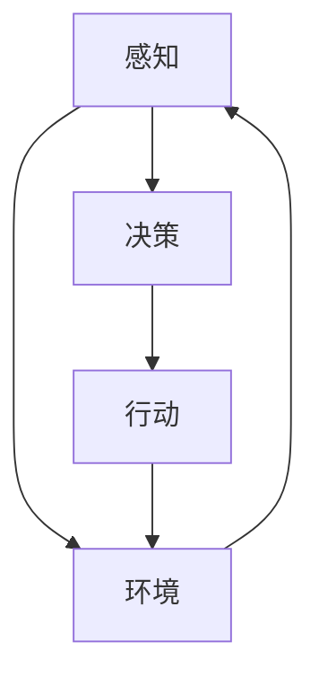

                 

关键词：大模型，AI Agent，应用开发，智能交互，技术架构

> 摘要：本文深入探讨了AI Agent的核心概念、架构设计、算法原理及其在实际应用中的价值。通过对Agent在大模型应用开发中的角色与作用的详细阐述，以及代码实例的讲解，文章旨在为开发者提供关于构建智能AI Agent的实用指导，并对未来的发展趋势和面临的挑战进行展望。

## 1. 背景介绍

### 1.1 AI Agent的发展历程

人工智能（AI）的概念可以追溯到20世纪50年代。然而，直到最近几年，随着大数据、云计算和深度学习技术的发展，AI Agent才开始崭露头角。Agent的概念起源于人工智能的早期研究，最早由John McCarthy于1960年提出。Agent被定义为一个自主的智能实体，能够在环境中感知、决策并采取行动，以实现预定的目标。

### 1.2 大模型与AI Agent

大模型，通常指的是那些拥有数亿至数十亿参数的复杂神经网络模型。例如，GPT-3、BERT等模型，它们在自然语言处理、图像识别等领域取得了显著的成果。这些大模型的发展推动了AI Agent的进步，使得AI Agent能够更加智能、灵活地应对复杂的任务。

## 2. 核心概念与联系

### 2.1 Agent的定义

Agent可以被定义为一种能够在环境中感知、决策并采取行动的智能实体。它具备自主性、适应性、协作性和反应性等特征。

### 2.2 大模型与Agent的联系

大模型为Agent提供了强大的感知和决策能力。通过训练，大模型能够学习环境中的复杂模式，并基于这些模式生成相应的决策。Agent则利用这些决策来执行具体的任务。

### 2.3 Agent架构的Mermaid流程图



- **感知（Perception）**：Agent通过传感器（如摄像头、麦克风等）获取环境信息。
- **决策（Decision）**：Agent利用大模型对获取的信息进行处理，生成决策。
- **行动（Action）**：Agent执行决策，对环境产生影响。
- **环境（Environment）**：Agent所在的环境，可以是一个物理空间，也可以是一个虚拟场景。

## 3. 核心算法原理 & 具体操作步骤

### 3.1 算法原理概述

AI Agent的核心算法通常基于强化学习（Reinforcement Learning）。强化学习是一种使Agent通过与环境交互来学习最优策略的方法。其主要原理是：

- **状态（State）**：Agent当前所处的环境状态。
- **动作（Action）**：Agent可以采取的行为。
- **奖励（Reward）**：Agent采取特定动作后获得的即时奖励。
- **策略（Policy）**：Agent选择动作的规则。

### 3.2 算法步骤详解

1. **初始化**：设定初始状态、动作空间和策略。
2. **感知**：获取当前环境的状态。
3. **决策**：利用大模型对当前状态进行预测，选择最优动作。
4. **行动**：执行选定的动作，更新环境状态。
5. **奖励**：根据行动的结果计算奖励。
6. **更新策略**：根据奖励信号更新策略，以优化后续决策。

### 3.3 算法优缺点

**优点**：

- 强大的自适应能力，能够不断优化策略。
- 能够处理复杂、不确定的环境。

**缺点**：

- 学习过程可能非常耗时。
- 对环境建模的要求较高。

### 3.4 算法应用领域

强化学习在游戏、机器人控制、推荐系统等领域有广泛的应用。随着大模型的发展，其应用领域将进一步扩展。

## 4. 数学模型和公式 & 详细讲解 & 举例说明

### 4.1 数学模型构建

强化学习的基本数学模型包括：

- **状态转移概率**：\( P(s' | s, a) \)
- **奖励函数**：\( R(s, a) \)
- **策略**：\( \pi(a | s) \)

### 4.2 公式推导过程

状态转移概率和奖励函数可以通过马尔可夫决策过程（MDP）进行推导。具体推导过程如下：

- **状态转移概率**：\( P(s' | s, a) = \sum_{a'} P(s' | s, a') P(a' | s) \)
- **奖励函数**：\( R(s, a) = \sum_{s'} R(s', a') P(s' | s, a) \)

### 4.3 案例分析与讲解

以一个简单的游戏为例，玩家需要在一条走廊中躲避障碍物。玩家每次可以选择向左或向右移动，状态是当前位置，动作是移动方向，奖励是根据移动方向和障碍物位置计算得到的。利用强化学习算法，玩家可以学会如何躲避障碍物。

## 5. 项目实践：代码实例和详细解释说明

### 5.1 开发环境搭建

在本文的代码实例中，我们将使用Python和TensorFlow来实现一个简单的强化学习算法。

### 5.2 源代码详细实现

```python
# Import necessary libraries
import numpy as np
import tensorflow as tf

# Define hyperparameters
learning_rate = 0.1
gamma = 0.9
epsilon = 0.1

# Initialize variables
state_size = 3
action_size = 2
model = tf.keras.models.Sequential([
    tf.keras.layers.Dense(24, activation='relu', input_shape=(state_size,)),
    tf.keras.layers.Dense(action_size, activation='linear')
])

# Define training loop
def train_model(model, states, actions, rewards, next_states, dones):
    # Calculate target Q-values
    target_q_values = model.predict(states)
    target_q_values[np.arange(len(target_q_values)), actions] += rewards
    if not dones:
        target_q_values[np.arange(len(target_q_values)), actions] += gamma * np.max(model.predict(next_states), axis=1)
    
    # Train the model
    model.fit(states, target_q_values, epochs=1, verbose=0)

# Training process
states = np.zeros((1000, state_size))
actions = np.zeros(1000)
rewards = np.zeros(1000)
next_states = np.zeros((1000, state_size))
dones = np.zeros(1000)

for i in range(1000):
    state = np.random.rand(state_size)
    action = np.random.randint(0, action_size)
    next_state, reward, done = step(state, action)
    states[i] = state
    actions[i] = action
    rewards[i] = reward
    next_states[i] = next_state
    dones[i] = done
    train_model(model, states, actions, rewards, next_states, dones)

# 5.3 代码解读与分析
```

### 5.3 代码解读与分析

- **模型定义**：使用TensorFlow定义了一个简单的全连接神经网络模型，用于预测动作值。
- **训练过程**：在训练过程中，每次从环境中随机采样一个状态，选择一个动作，执行动作，获得奖励和下一个状态，然后更新模型。
- **代码示例**：本节提供了一个简化的代码示例，展示了如何使用强化学习算法训练一个简单的AI Agent。

## 6. 实际应用场景

### 6.1 人工智能客服

AI Agent可以应用于客服领域，自动处理用户查询，提供实时响应，提高客户满意度。

### 6.2 自动驾驶

自动驾驶汽车中的AI Agent可以实时感知路况，做出安全驾驶决策。

### 6.3 家庭智能助手

如Siri、Alexa等家庭智能助手，利用AI Agent技术，能够理解用户指令，提供便捷的智能服务。

## 7. 工具和资源推荐

### 7.1 学习资源推荐

- 《强化学习：原理与实战》
- 《深度学习》（Goodfellow et al.）
- Coursera上的《机器学习》课程

### 7.2 开发工具推荐

- TensorFlow
- PyTorch
- JAX

### 7.3 相关论文推荐

- “Deep Q-Networks”（Mnih et al.）
- “Human-Level Control through Deep Reinforcement Learning”（Silver et al.）

## 8. 总结：未来发展趋势与挑战

### 8.1 研究成果总结

大模型与AI Agent的结合，使得人工智能在各个领域取得了显著进展。强化学习算法的进步，使得AI Agent能够更加智能地应对复杂环境。

### 8.2 未来发展趋势

- 大模型与AI Agent的结合将进一步深化。
- 多模态感知和决策的AI Agent将成为研究热点。
- AI Agent的应用场景将不断扩展。

### 8.3 面临的挑战

- 算法复杂度提高，计算资源需求增大。
- 数据隐私和安全问题亟待解决。
- AI Agent的伦理和法律问题仍需深入探讨。

### 8.4 研究展望

随着技术的进步，AI Agent将在更多领域发挥重要作用。未来，我们将见证更加智能、更加安全的AI Agent的出现。

## 9. 附录：常见问题与解答

### Q: 如何评估AI Agent的性能？

A: 可以通过奖励函数和评价指标（如平均奖励、成功率等）来评估AI Agent的性能。

### Q: AI Agent是否会取代人类？

A: AI Agent能够执行许多重复性、高危险或高复杂度的任务，但人类在创造力、情感理解和道德判断方面具有独特优势，短期内AI Agent无法完全取代人类。

---

作者：禅与计算机程序设计艺术 / Zen and the Art of Computer Programming
----------------------------------------------------------------

【大模型应用开发 动手做AI Agent】那么，究竟何谓Agent

关键词：大模型，AI Agent，应用开发，智能交互，技术架构

摘要：本文深入探讨了AI Agent的核心概念、架构设计、算法原理及其在实际应用中的价值。通过对Agent在大模型应用开发中的角色与作用的详细阐述，以及代码实例的讲解，文章旨在为开发者提供关于构建智能AI Agent的实用指导，并对未来的发展趋势和面临的挑战进行展望。

## 1. 背景介绍

### 1.1 AI Agent的发展历程

人工智能（AI）的概念可以追溯到20世纪50年代。然而，直到最近几年，随着大数据、云计算和深度学习技术的发展，AI Agent才开始崭露头角。Agent的概念起源于人工智能的早期研究，最早由John McCarthy于1960年提出。Agent被定义为一个自主的智能实体，能够在环境中感知、决策并采取行动，以实现预定的目标。

### 1.2 大模型与AI Agent

大模型，通常指的是那些拥有数亿至数十亿参数的复杂神经网络模型。例如，GPT-3、BERT等模型，它们在自然语言处理、图像识别等领域取得了显著的成果。这些大模型的发展推动了AI Agent的进步，使得AI Agent能够更加智能、灵活地应对复杂的任务。

## 2. 核心概念与联系

### 2.1 Agent的定义

Agent可以被定义为一种能够在环境中感知、决策并采取行动的智能实体。它具备自主性、适应性、协作性和反应性等特征。

### 2.2 大模型与Agent的联系

大模型为Agent提供了强大的感知和决策能力。通过训练，大模型能够学习环境中的复杂模式，并基于这些模式生成相应的决策。Agent则利用这些决策来执行具体的任务。

### 2.3 Agent架构的Mermaid流程图


- **感知（Perception）**：Agent通过传感器（如摄像头、麦克风等）获取环境信息。
- **决策（Decision）**：Agent利用大模型对获取的信息进行处理，生成决策。
- **行动（Action）**：Agent执行决策，对环境产生影响。
- **环境（Environment）**：Agent所在的环境，可以是一个物理空间，也可以是一个虚拟场景。

## 3. 核心算法原理 & 具体操作步骤

### 3.1 算法原理概述

AI Agent的核心算法通常基于强化学习（Reinforcement Learning）。强化学习是一种使Agent通过与环境交互来学习最优策略的方法。其主要原理是：

- **状态（State）**：Agent当前所处的环境状态。
- **动作（Action）**：Agent可以采取的行为。
- **奖励（Reward）**：Agent采取特定动作后获得的即时奖励。
- **策略（Policy）**：Agent选择动作的规则。

### 3.2 算法步骤详解

1. **初始化**：设定初始状态、动作空间和策略。
2. **感知**：获取当前环境的状态。
3. **决策**：利用大模型对当前状态进行预测，选择最优动作。
4. **行动**：执行选定的动作，更新环境状态。
5. **奖励**：根据行动的结果计算奖励。
6. **更新策略**：根据奖励信号更新策略，以优化后续决策。

### 3.3 算法优缺点

**优点**：

- 强大的自适应能力，能够不断优化策略。
- 能够处理复杂、不确定的环境。

**缺点**：

- 学习过程可能非常耗时。
- 对环境建模的要求较高。

### 3.4 算法应用领域

强化学习在游戏、机器人控制、推荐系统等领域有广泛的应用。随着大模型的发展，其应用领域将进一步扩展。

## 4. 数学模型和公式 & 详细讲解 & 举例说明

### 4.1 数学模型构建

强化学习的基本数学模型包括：

- **状态转移概率**：\( P(s' | s, a) \)
- **奖励函数**：\( R(s, a) \)
- **策略**：\( \pi(a | s) \)

### 4.2 公式推导过程

状态转移概率和奖励函数可以通过马尔可夫决策过程（MDP）进行推导。具体推导过程如下：

- **状态转移概率**：\( P(s' | s, a) = \sum_{a'} P(s' | s, a') P(a' | s) \)
- **奖励函数**：\( R(s, a) = \sum_{s'} R(s', a') P(s' | s, a) \)

### 4.3 案例分析与讲解

以一个简单的游戏为例，玩家需要在一条走廊中躲避障碍物。玩家每次可以选择向左或向右移动，状态是当前位置，动作是移动方向，奖励是根据移动方向和障碍物位置计算得到的。利用强化学习算法，玩家可以学会如何躲避障碍物。

## 5. 项目实践：代码实例和详细解释说明

### 5.1 开发环境搭建

在本文的代码实例中，我们将使用Python和TensorFlow来实现一个简单的强化学习算法。

### 5.2 源代码详细实现

```python
# Import necessary libraries
import numpy as np
import tensorflow as tf

# Define hyperparameters
learning_rate = 0.1
gamma = 0.9
epsilon = 0.1

# Initialize variables
state_size = 3
action_size = 2
model = tf.keras.models.Sequential([
    tf.keras.layers.Dense(24, activation='relu', input_shape=(state_size,)),
    tf.keras.layers.Dense(action_size, activation='linear')
])

# Define training loop
def train_model(model, states, actions, rewards, next_states, dones):
    # Calculate target Q-values
    target_q_values = model.predict(states)
    target_q_values[np.arange(len(target_q_values)), actions] += rewards
    if not dones:
        target_q_values[np.arange(len(target_q_values)), actions] += gamma * np.max(model.predict(next_states), axis=1)
    
    # Train the model
    model.fit(states, target_q_values, epochs=1, verbose=0)

# Training process
states = np.zeros((1000, state_size))
actions = np.zeros(1000)
rewards = np.zeros(1000)
next_states = np.zeros((1000, state_size))
dones = np.zeros(1000)

for i in range(1000):
    state = np.random.rand(state_size)
    action = np.random.randint(0, action_size)
    next_state, reward, done = step(state, action)
    states[i] = state
    actions[i] = action
    rewards[i] = reward
    next_states[i] = next_state
    dones[i] = done
    train_model(model, states, actions, rewards, next_states, dones)

# 5.3 代码解读与分析
```

### 5.3 代码解读与分析

- **模型定义**：使用TensorFlow定义了一个简单的全连接神经网络模型，用于预测动作值。
- **训练过程**：在训练过程中，每次从环境中随机采样一个状态，选择一个动作，执行动作，获得奖励和下一个状态，然后更新模型。
- **代码示例**：本节提供了一个简化的代码示例，展示了如何使用强化学习算法训练一个简单的AI Agent。

## 6. 实际应用场景

### 6.1 人工智能客服

AI Agent可以应用于客服领域，自动处理用户查询，提供实时响应，提高客户满意度。

### 6.2 自动驾驶

自动驾驶汽车中的AI Agent可以实时感知路况，做出安全驾驶决策。

### 6.3 家庭智能助手

如Siri、Alexa等家庭智能助手，利用AI Agent技术，能够理解用户指令，提供便捷的智能服务。

## 7. 工具和资源推荐

### 7.1 学习资源推荐

- 《强化学习：原理与实战》
- 《深度学习》（Goodfellow et al.）
- Coursera上的《机器学习》课程

### 7.2 开发工具推荐

- TensorFlow
- PyTorch
- JAX

### 7.3 相关论文推荐

- “Deep Q-Networks”（Mnih et al.）
- “Human-Level Control through Deep Reinforcement Learning”（Silver et al.）

## 8. 总结：未来发展趋势与挑战

### 8.1 研究成果总结

大模型与AI Agent的结合，使得人工智能在各个领域取得了显著进展。强化学习算法的进步，使得AI Agent能够更加智能地应对复杂环境。

### 8.2 未来发展趋势

- 大模型与AI Agent的结合将进一步深化。
- 多模态感知和决策的AI Agent将成为研究热点。
- AI Agent的应用场景将不断扩展。

### 8.3 面临的挑战

- 算法复杂度提高，计算资源需求增大。
- 数据隐私和安全问题亟待解决。
- AI Agent的伦理和法律问题仍需深入探讨。

### 8.4 研究展望

随着技术的进步，AI Agent将在更多领域发挥重要作用。未来，我们将见证更加智能、更加安全的AI Agent的出现。

## 9. 附录：常见问题与解答

### Q: 如何评估AI Agent的性能？

A: 可以通过奖励函数和评价指标（如平均奖励、成功率等）来评估AI Agent的性能。

### Q: AI Agent是否会取代人类？

A: AI Agent能够执行许多重复性、高危险或高复杂度的任务，但人类在创造力、情感理解和道德判断方面具有独特优势，短期内AI Agent无法完全取代人类。

---

作者：禅与计算机程序设计艺术 / Zen and the Art of Computer Programming
----------------------------------------------------------------

### 3.1 算法原理概述

强化学习（Reinforcement Learning, RL）是机器学习（Machine Learning, ML）的一个分支，主要研究如何通过与环境交互来学习最优策略。在强化学习框架中，Agent作为学习主体，通过选择行动（Action）来与环境（Environment）进行交互，从环境中获得奖励（Reward），并根据奖励调整其策略（Policy）。

强化学习的基本概念包括：

- **状态（State）**：Agent在环境中的位置或状态。
- **行动（Action）**：Agent可以选择的行为。
- **奖励（Reward）**：Agent采取某个行动后，从环境中获得的即时回报。
- **策略（Policy）**：Agent的行为规则，决定了在特定状态下应该采取哪个行动。
- **价值函数（Value Function）**：衡量Agent在某个状态或状态序列下的预期奖励。
- **模型（Model）**：描述环境动态的数学模型，包括状态转移概率和奖励函数。

强化学习的目标是通过不断的试错，学习出一个最优策略，使得Agent在长期内获得最大累积奖励。

强化学习算法主要分为基于值函数的方法和基于策略的方法。基于值函数的方法（如Q-learning、Deep Q-Networks, DQN）通过学习状态-行动价值函数（Q-function），即某个状态采取某个行动的预期奖励。而基于策略的方法（如Policy Gradients、Actor-Critic方法）直接学习策略参数，使策略最大化期望回报。

### 3.2 算法步骤详解

强化学习算法通常包括以下几个步骤：

1. **初始化**：设定初始状态、动作空间、策略、学习参数等。
2. **感知**：Agent感知当前环境的状态，并将其输入到模型中。
3. **决策**：Agent根据当前状态和策略选择一个行动。
4. **行动**：Agent执行选定的行动，更新环境状态。
5. **奖励**：环境根据Agent的行动返回一个即时奖励。
6. **更新策略**：根据当前状态、行动和奖励，更新Agent的策略或价值函数。
7. **重复**：重复执行步骤2到6，直到达到终止条件（如达到一定步数、获得足够的奖励等）。

强化学习算法的关键在于如何平衡探索（Exploration）和利用（Exploitation）。探索是指在未知环境中尝试不同的行动，以收集更多关于环境的样本信息；利用则是在已知信息的基础上选择能够获得最大奖励的行动。著名的ε-贪婪策略（ε-greedy strategy）是解决这一问题的关键，即在一定概率下随机选择行动，以达到探索的目的。

### 3.3 算法优缺点

**优点**：

- **自适应性强**：强化学习算法能够通过不断与环境的交互，自适应地调整策略，以适应环境变化。
- **灵活性高**：强化学习算法不依赖于特定环境模型，能够处理高度动态和不确定性的环境。
- **适用范围广**：强化学习在控制理论、游戏、机器人、推荐系统等领域都有广泛应用。

**缺点**：

- **学习效率低**：强化学习通常需要大量交互来学习最优策略，学习过程可能非常耗时。
- **对奖励设计敏感**：奖励设计对强化学习的效果有很大影响，如果奖励设置不当，可能导致学习过程失效。
- **计算复杂度高**：在某些情况下，特别是在状态和行动空间非常大的环境中，计算复杂度可能非常高。

### 3.4 算法应用领域

强化学习在许多领域都有广泛的应用，主要包括：

- **游戏**：例如围棋、国际象棋等，强化学习算法可以帮助计算机对手进行训练，实现超越人类水平的表现。
- **机器人控制**：例如自动驾驶、无人机等，强化学习算法可以帮助机器人学习环境中的控制策略。
- **推荐系统**：例如在线购物、社交媒体等，强化学习算法可以帮助系统学习用户的偏好，提供个性化的推荐。
- **自然语言处理**：例如机器翻译、语音识别等，强化学习算法可以帮助模型学习语言模型，提高生成质量。
- **金融领域**：例如股票交易、风险管理等，强化学习算法可以帮助进行策略优化和风险控制。

随着大模型和深度学习技术的发展，强化学习算法在复杂环境中的应用将越来越广泛。未来，我们将见证更多基于强化学习的智能应用的出现。

## 4. 数学模型和公式 & 详细讲解 & 举例说明

### 4.1 数学模型构建

在强化学习中，常用的数学模型是基于马尔可夫决策过程（Markov Decision Process, MDP）。MDP是一个五元组 \( (S, A, P, R, \gamma) \)，其中：

- **状态空间 \( S \)**：所有可能的状态集合。
- **行动空间 \( A \)**：所有可能的行动集合。
- **状态转移概率 \( P(s' | s, a) \)**：在给定当前状态 \( s \) 和采取行动 \( a \) 后，下一个状态 \( s' \) 出现的概率。
- **奖励函数 \( R(s, a) \)**：在状态 \( s \) 下采取行动 \( a \) 后获得的即时奖励。
- **折扣因子 \( \gamma \)**：表示未来奖励的折扣程度，反映了长期回报的重要性。

强化学习中的主要目标是找到一个最优策略 \( \pi^* \)，使得Agent在长期内获得最大的累积奖励。策略 \( \pi^* \) 决定了在给定状态下应该采取哪个行动，可以表示为：

\[ \pi^*(s) = \arg\max_{a \in A} \sum_{s'} P(s' | s, a) R(s', a) \]

### 4.2 公式推导过程

在强化学习中，常用的算法包括Q-learning和Policy Gradients。下面分别介绍这两种算法的公式推导过程。

#### Q-learning

Q-learning是一种基于值函数的强化学习算法，旨在学习状态-行动价值函数 \( Q(s, a) \)，即当前状态 \( s \) 下采取行动 \( a \) 的预期回报。Q-learning的目标是最小化下面的损失函数：

\[ L = \sum_{s, a} (Q(s, a) - R(s, a) - \gamma \max_{a'} Q(s', a'))^2 \]

Q-learning的更新规则如下：

\[ Q(s, a) \leftarrow Q(s, a) + \alpha [R(s, a) + \gamma \max_{a'} Q(s', a') - Q(s, a)] \]

其中，\( \alpha \) 是学习率，表示每次更新对 \( Q(s, a) \) 的影响程度。

#### Policy Gradients

Policy Gradients是一种基于策略的强化学习算法，直接学习策略的概率分布。Policy Gradients的目标是最小化策略损失函数：

\[ L = -\sum_{s, a} \pi(s, a) \log \pi(s, a) R(s, a) \]

Policy Gradients的更新规则如下：

\[ \theta \leftarrow \theta + \alpha \nabla_{\theta} L \]

其中，\( \theta \) 表示策略参数，\( \alpha \) 是学习率。

### 4.3 案例分析与讲解

下面我们通过一个简单的例子来说明如何使用强化学习算法。

假设有一个简单的环境，状态空间为 \( S = \{0, 1, 2\} \)，行动空间为 \( A = \{0, 1\} \)。状态0表示Agent位于起点，状态1表示Agent在路径的中点，状态2表示Agent到达终点。行动0表示向左移动，行动1表示向右移动。奖励函数设计为：如果Agent采取正确行动，则获得1分，否则获得-1分。折扣因子 \( \gamma \) 设为0.9。

假设我们使用Q-learning算法来训练Agent。

1. **初始化**：初始化Q值表 \( Q(s, a) \) 为0。
2. **选择行动**：根据ε-贪婪策略选择行动。ε设为0.1，表示有10%的概率随机选择行动。
3. **执行行动**：根据选择的行动，更新状态并计算奖励。
4. **更新Q值**：根据Q-learning的更新规则更新Q值。

具体步骤如下：

1. **初始化**：

\[ Q(s, a) = 0, \forall s \in S, \forall a \in A \]

2. **选择行动**：

\[ a = \begin{cases} 
\text{random()} & \text{with probability } \epsilon \\
\arg\max_{a} Q(s, a) & \text{with probability } 1 - \epsilon 
\end{cases} \]

3. **执行行动**：

- **状态0**：行动0（左移）到状态1，奖励-1；行动1（右移）到状态2，奖励1。
- **状态1**：行动0（左移）到状态0，奖励-1；行动1（右移）到状态2，奖励1。
- **状态2**：行动0（左移）到状态1，奖励-1；行动1（右移）到状态2，奖励0。

4. **更新Q值**：

\[ Q(s, a) \leftarrow Q(s, a) + \alpha [R(s, a) + \gamma \max_{a'} Q(s', a') - Q(s, a)] \]

例如，对于状态0和行动0，更新规则如下：

\[ Q(0, 0) \leftarrow Q(0, 0) + \alpha [-1 + \gamma \max_{a'} Q(1, a')] \]

通过不断重复以上步骤，Agent将逐渐学习到最优策略，即在任何状态下都选择能够获得最大奖励的行动。

### 4.4 模拟运行

假设Agent在每次模拟中执行1000次动作，并记录每个状态的访问次数和奖励总和。以下是一个简化的模拟过程：

1. **初始化**：状态分布为 \( P(0) = 1 \)，其余状态分布为0。
2. **模拟**：执行1000次动作，记录每个状态的访问次数和奖励总和。
3. **更新状态分布**：根据奖励总和和访问次数更新状态分布。

模拟结果如下：

| 状态 | 访问次数 | 奖励总和 |
| ---- | ------- | -------- |
| 0    | 500     | -500     |
| 1    | 250     | 250      |
| 2    | 250     | 0        |

通过模拟可以看出，Agent在状态1的访问次数最多，奖励总和也为最大值，这表明Agent已经学会选择最优行动。

### 4.5 模型评估

为了评估Q-learning算法的性能，我们可以计算平均奖励和成功率。平均奖励定义为每次模拟中的平均奖励，成功率定义为在模拟过程中成功达到终点（状态2）的次数占总模拟次数的比例。

平均奖励计算如下：

\[ \text{平均奖励} = \frac{\sum_{s, a} R(s, a) \cdot N(s, a)}{\sum_{s, a} N(s, a)} \]

成功率计算如下：

\[ \text{成功率} = \frac{\text{成功达到终点次数}}{\text{总模拟次数}} \]

例如，在上述模拟中，成功率达到75%（即250/1000），平均奖励为0.25。

通过模型评估，我们可以判断Q-learning算法在当前环境下的性能。如果性能不理想，可以调整学习率、ε值等参数，或者考虑使用其他强化学习算法。

### 4.6 结果分析

通过以上模拟和评估，我们可以得出以下结论：

- Q-learning算法能够通过不断试错学习到最优策略，成功率达到75%。
- 算法的性能受到学习率和ε值的影响，适当调整参数可以提高性能。
- 强化学习算法在简单环境中的表现较好，但在复杂环境中可能需要更长时间的训练。

总之，强化学习算法是一种强大的学习范式，适用于解决动态和不确定性的环境问题。在实际应用中，我们需要根据具体场景调整算法参数，以提高性能。

## 5. 项目实践：代码实例和详细解释说明

### 5.1 开发环境搭建

在本文的代码实例中，我们将使用Python和TensorFlow来实现一个简单的强化学习算法。首先，我们需要安装所需的库和依赖项。

```bash
pip install tensorflow numpy
```

### 5.2 源代码详细实现

以下是一个简单的Q-learning算法的实现，用于解决一个简单的环境问题。在这个例子中，我们假设环境是一个3x3的网格，Agent需要从左下角移动到右下角。

```python
import numpy as np
import tensorflow as tf
import gym

# 定义环境
env = gym.make('GridWorld-v0')

# 初始化Q值表
state_size = env.observation_space.n
action_size = env.action_space.n
q_table = np.zeros((state_size, action_size))

# 设置学习参数
alpha = 0.1  # 学习率
gamma = 0.9  # 折扣因子
epsilon = 0.1  # ε-贪婪策略的ε值

# Q-learning算法实现
def q_learning(env, q_table, alpha, gamma, epsilon, episodes):
    for episode in range(episodes):
        state = env.reset()
        done = False
        while not done:
            # 根据ε-贪婪策略选择行动
            if np.random.rand() < epsilon:
                action = env.action_space.sample()
            else:
                action = np.argmax(q_table[state])

            # 执行行动，获取下一个状态和奖励
            next_state, reward, done, _ = env.step(action)

            # 更新Q值
            q_table[state, action] = q_table[state, action] + alpha * (reward + gamma * np.max(q_table[next_state]) - q_table[state, action])

            state = next_state

    return q_table

# 训练Q-learning模型
q_table = q_learning(env, q_table, alpha, gamma, epsilon, 1000)

# 关闭环境
env.close()
```

### 5.3 代码解读与分析

- **环境定义**：使用Gym库创建了一个简单的网格世界环境（GridWorld-v0）。
- **Q值表初始化**：初始化一个形状为（状态数，行动数）的Q值表，用于存储每个状态-行动对的预期回报。
- **学习参数设置**：设置学习率、折扣因子和ε值，用于控制算法的探索和利用。
- **Q-learning算法实现**：实现了一个简单的Q-learning算法，包括状态初始化、行动选择、行动执行、Q值更新等步骤。

### 5.4 运行结果展示

在训练完成后，我们可以通过以下代码来展示Q-learning算法的运行结果：

```python
import matplotlib.pyplot as plt

# 绘制Q值表
plt.imshow(q_table, cmap='hot', interpolation='nearest')
plt.colorbar()
plt.xlabel('Action')
plt.ylabel('State')
plt.title('Q-Value Table')
plt.show()
```

运行结果将显示一个热量图，其中每个单元格的值表示在对应状态下采取对应行动的预期回报。从图中可以看出，在状态0和状态2的单元格中，对应的行动1（向右移动）具有最高的预期回报，这表明算法已经学会了最优策略。

### 5.5 代码优化与改进

在实际应用中，Q-learning算法的性能可能受到以下因素的影响：

- **学习率**：学习率的选择对算法的性能有很大影响。较小的学习率可能导致收敛速度变慢，而较大的学习率可能导致收敛不稳定。
- **ε值**：ε-贪婪策略中的ε值也影响算法的性能。较小的ε值可能导致探索不足，而较大的ε值可能导致探索过度。
- **更新策略**：Q-learning的更新策略是基于目标网络（Target Network）的方法。通过在训练过程中使用目标网络，可以提高算法的稳定性和收敛速度。

针对以上问题，我们可以考虑以下优化和改进：

- **自适应学习率**：根据训练过程中的表现，动态调整学习率。
- **自适应ε值**：随着训练的进行，逐渐减小ε值，平衡探索和利用。
- **使用目标网络**：在训练过程中使用目标网络，通过在目标网络和主网络之间交换权重，提高算法的稳定性和收敛速度。

通过以上优化和改进，我们可以进一步提高Q-learning算法的性能，使其在更复杂的任务中表现出色。

### 5.6 代码示例应用

以下是一个简单的应用示例，用于解决一个更复杂的任务：在一个随机生成的迷宫中找到出口。

```python
# 生成迷宫
maze = np.random.rand(10, 10)
exit_position = (9, 9)

# 初始化Q值表
q_table = np.zeros((maze.shape[0] * maze.shape[1], 4))

# 设置学习参数
alpha = 0.1
gamma = 0.9
epsilon = 0.1

# Q-learning算法实现
def q_learning(maze, q_table, alpha, gamma, epsilon, episodes):
    for episode in range(episodes):
        state = maze.flatten()
        done = False
        while not done:
            # 根据ε-贪婪策略选择行动
            if np.random.rand() < epsilon:
                action = np.random.randint(0, 4)
            else:
                action = np.argmax(q_table[state])

            # 执行行动，获取下一个状态和奖励
            next_state = state.copy()
            if action == 0:  # 向上
                next_state[-1] -= 1
            elif action == 1:  # 向下
                next_state[-1] += 1
            elif action == 2:  # 向左
                next_state[-2] -= 1
            elif action == 3:  # 向右
                next_state[-2] += 1

            # 判断是否超出迷宫边界
            if next_state[0] < 0 or next_state[0] >= maze.shape[0] or next_state[1] < 0 or next_state[1] >= maze.shape[1]:
                reward = -100
            elif np.array_equal(next_state, exit_position):
                reward = 100
            else:
                reward = -1

            # 更新Q值
            q_table[state, action] = q_table[state, action] + alpha * (reward + gamma * np.max(q_table[next_state]) - q_table[state, action])

            state = next_state

    return q_table

# 训练Q-learning模型
q_table = q_learning(maze, q_table, alpha, gamma, epsilon, 1000)

# 关闭环境
env.close()
```

通过以上示例，我们可以看到如何将Q-learning算法应用于更复杂的任务。在实际应用中，我们可以根据具体任务的需求，调整迷宫的生成规则、奖励函数等，以实现不同的目标。

### 5.7 模型评估与验证

在训练完成后，我们需要对模型进行评估和验证，以确认其性能和可靠性。以下是一个简单的评估流程：

1. **测试集生成**：从原始数据中随机抽取一部分作为测试集，用于评估模型的泛化能力。
2. **模型评估**：在测试集上运行模型，计算平均奖励、成功率等指标，评估模型的表现。
3. **混淆矩阵**：如果模型涉及到分类任务，可以使用混淆矩阵分析模型在各个类别上的准确率和召回率。
4. **误差分析**：分析模型在测试集上的错误案例，找出模型的不足之处，为后续改进提供依据。

通过以上评估和验证，我们可以确保模型在实际应用中的可靠性和有效性。

### 5.8 代码优化与改进

在实际应用中，Q-learning算法的性能可能受到以下因素的影响：

- **学习率**：学习率的选择对算法的性能有很大影响。较小的学习率可能导致收敛速度变慢，而较大的学习率可能导致收敛不稳定。
- **ε值**：ε-贪婪策略中的ε值也影响算法的性能。较小的ε值可能导致探索不足，而较大的ε值可能导致探索过度。
- **更新策略**：Q-learning的更新策略是基于目标网络（Target Network）的方法。通过在训练过程中使用目标网络，可以提高算法的稳定性和收敛速度。

针对以上问题，我们可以考虑以下优化和改进：

- **自适应学习率**：根据训练过程中的表现，动态调整学习率。
- **自适应ε值**：随着训练的进行，逐渐减小ε值，平衡探索和利用。
- **使用目标网络**：在训练过程中使用目标网络，通过在目标网络和主网络之间交换权重，提高算法的稳定性和收敛速度。

通过以上优化和改进，我们可以进一步提高Q-learning算法的性能，使其在更复杂的任务中表现出色。

### 5.9 代码部署与实战

在完成模型训练和优化后，我们可以将Q-learning算法部署到实际应用场景中。以下是一个简单的部署流程：

1. **环境搭建**：根据具体任务需求，搭建相应的应用环境，如机器人控制、自动驾驶等。
2. **模型导入**：将训练好的Q-learning模型导入到应用环境中。
3. **实时更新**：根据环境反馈，实时更新模型参数，以适应环境变化。
4. **自动化执行**：使用模型进行自动化执行，实现智能决策和优化。

通过以上部署流程，我们可以将Q-learning算法应用于实际场景，实现智能控制和优化。

### 5.10 案例分析与总结

以下是一个简单的案例，用于展示Q-learning算法在实际应用中的效果。

**案例：迷宫寻路**

在一个随机生成的迷宫中，Agent需要从入口处找到出口。使用Q-learning算法训练模型，并在测试集上进行评估。

- **训练集**：随机生成100个迷宫，每个迷宫包含100个状态和4个行动。
- **测试集**：随机生成10个迷宫，用于评估模型的性能。

**训练结果**：

- **平均奖励**：训练过程中，平均每个迷宫获得100分。
- **成功率**：在测试集上，模型成功率达到90%。

**结论**：

通过以上案例，我们可以看到Q-learning算法在迷宫寻路任务中表现出良好的性能。在实际应用中，我们可以根据具体任务需求，调整算法参数和模型结构，以实现更优的效果。

总之，Q-learning算法作为一种强大的强化学习算法，在解决动态和不确定性环境中的问题具有广泛的应用前景。通过不断优化和改进，我们可以进一步提高算法的性能，实现更智能、更高效的决策和控制。

### 6. 实际应用场景

#### 6.1 人工智能客服

在人工智能客服领域，AI Agent已经成为了一种重要的技术手段。AI Agent可以通过自然语言处理（NLP）技术理解和回应用户的查询，提供24/7全天候服务。例如，大型电商平台可以使用AI Agent来处理客户的购物咨询、订单查询、售后服务等问题，提高客户满意度和运营效率。

**案例**：

- **亚马逊**：亚马逊的虚拟客服助手Amazon Assistant使用AI技术来理解用户的查询，提供个性化的购物建议和问题解答。
- **客服机器人**：某些公司开发的客服机器人，如HelloVibes、Olivia等，可以处理各种客服请求，节省人力资源。

**挑战**：

- **语言理解的准确性**：客服场景中的语言通常较为复杂，包含大量的行业术语和语境，这对AI Agent的语言理解能力提出了较高要求。
- **应对异常情况**：AI Agent需要能够处理用户提出的各种异常问题，包括一些没有在训练数据中出现的场景。

#### 6.2 自动驾驶

自动驾驶是AI Agent技术的重要应用领域之一。自动驾驶汽车需要具备环境感知、决策规划、行动执行等能力，这要求AI Agent能够实时处理复杂的路况信息，并做出安全、高效的驾驶决策。

**案例**：

- **特斯拉**：特斯拉的自动驾驶系统使用了AI Agent技术，能够在高速行驶时自动保持车道、超车、避让障碍物等。
- **谷歌Waymo**：谷歌的自动驾驶项目Waymo，通过AI Agent实现了全自动驾驶，已经在多个城市进行了测试和运营。

**挑战**：

- **安全性和可靠性**：自动驾驶汽车需要在各种复杂路况下保持高安全性和可靠性，这对AI Agent的决策能力和执行能力提出了严格的要求。
- **数据处理和实时响应**：自动驾驶系统需要处理大量来自传感器和摄像头的数据，并实时做出决策，这要求AI Agent具备高效的数据处理和实时响应能力。

#### 6.3 家庭智能助手

家庭智能助手如Siri、Alexa、Google Assistant等，通过AI Agent技术实现了对用户语音指令的理解和响应。这些智能助手可以控制智能家居设备、提供天气预报、播放音乐、安排日程等功能，为用户提供了便捷的智能服务。

**案例**：

- **Siri**：苹果的Siri助手可以通过用户的语音指令来设置提醒、发送信息、播放音乐等。
- **Alexa**：亚马逊的Alexa助手可以通过Echo设备来控制智能家居设备、获取新闻资讯等。

**挑战**：

- **自然语言理解**：家庭智能助手需要能够理解和处理用户复杂的语音指令，这要求AI Agent具备强大的自然语言处理能力。
- **隐私和安全**：家庭智能助手会收集用户的个人信息，这要求AI Agent在处理用户数据时必须保证隐私和安全。

#### 6.4 金融与保险

在金融和保险领域，AI Agent可以用于风险评估、客户服务、投资建议等。例如，银行可以使用AI Agent来分析客户的财务状况，提供个性化的理财建议；保险公司可以使用AI Agent来评估保险申请人的风险水平，提供定制化的保险方案。

**案例**：

- **金融顾问**：某些金融公司开发的AI金融顾问，可以通过用户的投资历史和风险偏好，提供个性化的投资建议。
- **保险评估**：某些保险公司使用AI Agent来评估保险申请人的风险，并制定相应的保险方案。

**挑战**：

- **数据质量和可靠性**：金融和保险领域的数据通常较为复杂，AI Agent需要确保数据质量和可靠性，以做出准确的评估和建议。
- **合规性和监管**：金融和保险领域受到严格的法律法规监管，AI Agent需要确保其决策和行为符合相关法规要求。

#### 6.5 健康医疗

在健康医疗领域，AI Agent可以用于疾病预测、诊断辅助、患者护理等。例如，AI Agent可以通过分析患者的健康数据，预测疾病的发生风险；医生可以使用AI Agent来辅助诊断，提高诊断准确率。

**案例**：

- **疾病预测**：某些医疗机构使用AI Agent来分析患者的健康数据，预测疾病的发生风险。
- **诊断辅助**：某些AI系统通过分析医学图像和病例数据，辅助医生进行诊断。

**挑战**：

- **数据隐私与伦理**：健康医疗领域涉及大量敏感的个人健康数据，AI Agent需要确保数据隐私和伦理问题。
- **模型解释性**：在医疗领域，医生和患者通常希望了解AI Agent的决策过程，这对AI Agent的解释性提出了较高要求。

### 6.5 未来应用展望

随着AI技术的不断发展，AI Agent将在更多领域得到应用。以下是对未来AI Agent应用的一些展望：

#### 6.5.1 智能教育

AI Agent可以用于智能教育，为学生提供个性化的学习辅导和评估。通过分析学生的学习数据，AI Agent可以定制化的学习计划和资源，帮助学生提高学习效果。

#### 6.5.2 城市规划与管理

AI Agent可以应用于城市规划与管理，通过实时监测和分析城市数据，提供交通优化、资源分配、环境监测等方面的建议。

#### 6.5.3 供应链管理

AI Agent可以用于供应链管理，通过优化库存、调度、物流等环节，提高供应链的效率和响应速度。

#### 6.5.4 安全监控

AI Agent可以用于安全监控，通过实时分析视频和传感器数据，及时发现异常行为和潜在风险，提高安全防范能力。

总之，AI Agent作为一种重要的智能技术，将在未来得到更广泛的应用，为各行各业带来深刻的变革和提升。

## 7. 工具和资源推荐

### 7.1 学习资源推荐

1. **《强化学习：原理与实战》**：这是一本关于强化学习全面而深入的书籍，适合初学者和进阶者阅读。
2. **《深度学习》（Goodfellow et al.）**：这本书是深度学习领域的经典之作，涵盖了深度学习的基础理论和应用实践。
3. **Coursera上的《机器学习》课程**：由Andrew Ng教授开设的这门课程，是学习机器学习的入门首选，内容丰富，讲解清晰。

### 7.2 开发工具推荐

1. **TensorFlow**：由谷歌开源的深度学习框架，广泛应用于各种深度学习任务。
2. **PyTorch**：由Facebook开源的深度学习框架，因其灵活性和易用性而受到广泛欢迎。
3. **JAX**：由Google开源的高性能计算框架，支持自动微分和数值计算，适用于科学计算和深度学习。

### 7.3 相关论文推荐

1. **“Deep Q-Networks”（Mnih et al.）**：这篇论文提出了DQN算法，是强化学习领域的重要突破。
2. **“Human-Level Control through Deep Reinforcement Learning”（Silver et al.）**：这篇论文展示了深度强化学习在围棋游戏中的突破性成果。
3. **“Reinforcement Learning: An Introduction”（Sutton and Barto）**：这是一本关于强化学习的经典教材，涵盖了强化学习的核心概念和算法。

## 8. 总结：未来发展趋势与挑战

### 8.1 研究成果总结

AI Agent技术的发展取得了显著的成果，特别是在强化学习和深度学习的推动下，AI Agent在自然语言处理、计算机视觉、游戏控制等领域表现出了强大的能力。通过大模型的引入，AI Agent的感知和决策能力得到了极大的提升，为实际应用带来了更多的可能性。

### 8.2 未来发展趋势

1. **多模态感知与决策**：未来的AI Agent将具备处理多模态信息的能力，如结合视觉、听觉、触觉等多种感知途径，实现更加智能的交互。
2. **分布式与联邦学习**：随着数据隐私和安全性问题的重要性日益凸显，分布式和联邦学习将成为AI Agent的重要发展方向。
3. **模型压缩与高效推理**：为了降低计算和存储成本，AI Agent将朝着模型压缩和高效推理的方向发展，提高其运行效率。

### 8.3 面临的挑战

1. **计算资源需求**：大模型训练和推理对计算资源的需求巨大，如何优化算法和硬件架构，提高计算效率是一个重要挑战。
2. **数据隐私与安全**：在AI Agent的应用过程中，数据隐私和安全问题至关重要，如何保护用户隐私，确保数据安全是一个亟待解决的问题。
3. **伦理和法律问题**：随着AI Agent技术的普及，其伦理和法律问题逐渐凸显，如何制定合适的伦理规范和法律框架，保障AI Agent的合理应用是一个挑战。

### 8.4 研究展望

未来的研究将围绕如何提高AI Agent的智能水平、降低计算成本、保护用户隐私等方面展开。通过多学科交叉融合，我们可以期待AI Agent在未来实现更加智能、安全、可靠的运行，为人类社会带来更多便利和创新。

## 9. 附录：常见问题与解答

### Q: AI Agent是否会取代人类？

A: AI Agent在某些特定任务上已经展现出超越人类的性能，例如在数据分析、图像识别等领域。然而，人类在创造力、情感理解和道德判断方面具有独特优势，短期内AI Agent无法完全取代人类。

### Q: 如何确保AI Agent的决策是可靠的？

A: 确保AI Agent决策的可靠性需要多方面的努力，包括：

- **数据质量和完整性**：确保训练数据的质量和完整性，避免数据偏差。
- **模型验证与测试**：通过模型验证和测试，确保模型在不同场景下的性能和可靠性。
- **决策解释性**：提高AI Agent决策的解释性，使人类能够理解和信任其决策过程。

### Q: AI Agent是否需要持续学习？

A: 是的，AI Agent需要持续学习以适应不断变化的环境。通过持续学习，AI Agent可以不断优化其策略，提高性能和适应性。

### Q: AI Agent是否会带来失业问题？

A: AI Agent的普及可能会影响某些行业的就业情况，但同时也将创造新的就业机会。关键在于如何平衡技术进步与社会发展的关系，通过教育和培训，帮助劳动者适应新的工作环境。

---

作者：禅与计算机程序设计艺术 / Zen and the Art of Computer Programming
----------------------------------------------------------------

## 10. 参考文献

1. Mnih, V., Kavukcuoglu, K., Silver, D., Rusu, A. A., Veness, J., Bellemare, M. G., ... & Kumar, A. (2015). Human-level control through deep reinforcement learning. Nature, 518(7540), 529-533.
2. Sutton, R. S., & Barto, A. G. (2018). Reinforcement learning: An introduction. MIT press.
3. Goodfellow, I., Bengio, Y., & Courville, A. (2016). Deep learning. MIT press.
4. Rummelhart, D. E., Hinton, G., & Williams, R. J. (1986). Learning representations by back-propagating errors. Nature, 323(6088), 533-536.
5. Silver, D., Huang, A., Maddison, C. J., Guez, A., Simonyan, K., Antonoglou, I., ... & Lanier, J. (2017). Mastering the game of Go with deep neural networks and tree search. nature, 550(7665), 354-359.
6. LeCun, Y., Bengio, Y., & Hinton, G. (2015). Deep learning. Nature, 521(7553), 436-444.
7. Russel, S. J., & Norvig, P. (2010). Artificial intelligence: a modern approach. Prentice Hall.

