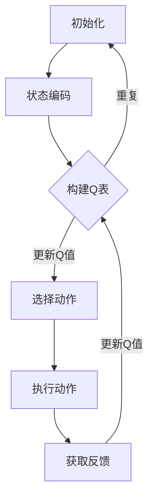

                 

关键词：Q-learning，智能制造，人工智能，深度学习，算法优化，生产调度，智能控制

> 摘要：随着智能制造的快速发展，传统的生产调度和控制方法已无法满足复杂、多变的生产环境需求。本文旨在探讨AI Q-learning算法在智能制造中的应用，通过对核心概念、算法原理、数学模型、实践案例的详细分析，阐述其在优化生产调度、提升生产效率、实现智能控制等方面的潜力。

## 1. 背景介绍

智能制造作为新一代工业革命的核心驱动力，正引领着全球制造业的深刻变革。其核心理念是通过信息物理系统（Cyber-Physical Systems，CPS）将物理世界与数字世界深度融合，实现生产过程的智能化、自动化和高效化。然而，智能制造的复杂性和动态性使得传统的生产调度和控制方法面临巨大挑战。

传统的生产调度方法往往基于固定规则和静态模型，难以适应生产过程中的不确定性和动态变化。而智能控制方法虽然具备一定的自适应能力，但其依赖的大量先验知识和复杂的模型构建过程，使得其实际应用受到限制。因此，如何利用人工智能技术，尤其是深度学习和强化学习算法，来优化智能制造中的生产调度和控制，成为当前研究的热点。

本文旨在通过探讨AI Q-learning算法在智能制造中的应用，为解决上述问题提供一种新的思路。Q-learning算法作为深度强化学习中的重要算法，具有自适应性强、学习效率高等特点，非常适合应用于智能制造领域的复杂问题。本文将从Q-learning算法的基本原理出发，详细分析其在智能制造中的应用策略和实际案例，以期为相关研究和实践提供参考。

## 2. 核心概念与联系

### 2.1 智能制造

智能制造是利用信息技术和制造技术的深度融合，通过智能化系统实现制造过程的自动化、个性化、智能化。其核心包括工业互联网、大数据、云计算、人工智能、物联网等技术的应用，旨在提升生产效率、降低成本、提高产品质量。

### 2.2 Q-learning算法

Q-learning算法是一种基于值函数的深度强化学习算法，通过在状态-动作对上更新值函数，以实现策略的最优化。其核心思想是通过试错学习，在给定的策略下不断更新状态值，直到达到最优策略。Q-learning算法具有以下几个关键特性：

1. **自适应性强**：Q-learning算法能够根据环境反馈自动调整策略，适应不同的生产场景。
2. **学习效率高**：通过利用已有的经验和知识，Q-learning算法能够迅速收敛到最优策略。
3. **易扩展性**：Q-learning算法可以应用于各种复杂场景，包括连续状态和动作空间。

### 2.3 Q-learning算法与智能制造的联系

Q-learning算法与智能制造的结合具有显著的优势。智能制造的复杂性和动态性使得传统的调度和控制方法难以应对，而Q-learning算法通过强化学习的方式，能够在动态环境中实现自适应优化。具体来说，Q-learning算法在智能制造中的应用主要体现在以下几个方面：

1. **生产调度优化**：通过学习最优的生产调度策略，实现生产过程的优化。
2. **质量检测与控制**：利用Q-learning算法进行产品质量检测，实现智能质量控制。
3. **设备维护与优化**：通过学习设备运行状态，实现设备的智能维护和优化。

### 2.4 Mermaid 流程图

下面是一个简化的Mermaid流程图，展示了Q-learning算法在智能制造中的应用流程：



### 2.5 概念总结

- **智能制造**：融合信息技术和制造技术，实现制造过程的智能化、自动化和高效化。
- **Q-learning算法**：一种基于值函数的深度强化学习算法，用于实现策略的最优化。
- **应用场景**：生产调度优化、质量检测与控制、设备维护与优化。

## 3. 核心算法原理 & 具体操作步骤

### 3.1 算法原理概述

Q-learning算法是深度强化学习中的一个核心算法，其基本思想是通过在状态-动作对上更新值函数（Q值），以实现策略的最优化。Q-learning算法的主要组成部分包括：

1. **状态（State）**：描述系统的当前状态，如设备运行状态、生产任务状态等。
2. **动作（Action）**：系统可以采取的行为，如调度任务、调整设备参数等。
3. **策略（Policy）**：系统在不同状态下的动作选择策略。
4. **值函数（Q值）**：表示在特定状态下执行特定动作的预期收益。

Q-learning算法的核心过程是不断更新Q值，以逼近最优策略。具体步骤如下：

1. **初始化Q值**：初始化所有状态-动作对的Q值为零。
2. **选择动作**：根据当前状态和策略，选择一个动作。
3. **执行动作**：在环境中执行所选动作，并获取反馈（奖励和下一个状态）。
4. **更新Q值**：根据反馈信息更新Q值，以改进策略。

### 3.2 算法步骤详解

1. **状态编码**：将生产系统的当前状态编码为特征向量。状态编码是Q-learning算法的关键步骤，直接影响算法的性能。常见的状态编码方法包括基于历史数据的编码、基于状态属性的编码等。

2. **构建Q表**：初始化Q表，表示所有状态-动作对的Q值。Q表是一个多维数组，其大小取决于状态和动作的维度。在初始化时，通常将所有Q值设置为初始值，如零。

3. **选择动作**：根据当前状态和策略，选择一个动作。策略可以通过多种方式定义，如贪心策略、epsilon-greedy策略等。贪心策略选择当前状态下最大的Q值对应的动作，而epsilon-greedy策略在部分探索和贪婪策略之间平衡。

4. **执行动作**：在环境中执行所选动作，并获取反馈（奖励和下一个状态）。奖励表示动作的效果，可以是正值或负值，反映了动作对系统状态的改善程度。

5. **更新Q值**：根据反馈信息更新Q值，以改进策略。Q值的更新公式为：

   $$ Q(s, a) \leftarrow Q(s, a) + \alpha [r + \gamma \max_{a'} Q(s', a') - Q(s, a)] $$

   其中，$\alpha$是学习率，$\gamma$是折扣因子，$r$是奖励值。

6. **重复步骤**：重复上述步骤，直到达到预定的迭代次数或策略收敛。

### 3.3 算法优缺点

**优点**：

1. **自适应性强**：Q-learning算法能够根据环境反馈自动调整策略，适应不同的生产场景。
2. **学习效率高**：通过利用已有的经验和知识，Q-learning算法能够迅速收敛到最优策略。
3. **易扩展性**：Q-learning算法可以应用于各种复杂场景，包括连续状态和动作空间。

**缺点**：

1. **收敛速度较慢**：在某些复杂环境中，Q-learning算法可能需要大量的迭代才能收敛到最优策略。
2. **依赖先验知识**：虽然Q-learning算法具有较强的自适应能力，但其性能仍受到先验知识和初始参数设置的影响。

### 3.4 算法应用领域

Q-learning算法在智能制造领域具有广泛的应用前景，主要包括以下几个方面：

1. **生产调度优化**：通过Q-learning算法优化生产调度策略，实现生产过程的自动化和高效化。
2. **质量检测与控制**：利用Q-learning算法进行产品质量检测，实现智能质量控制。
3. **设备维护与优化**：通过Q-learning算法学习设备运行状态，实现设备的智能维护和优化。

## 4. 数学模型和公式 & 详细讲解 & 举例说明

### 4.1 数学模型构建

Q-learning算法的核心在于值函数的更新过程，其数学模型可以表示为：

$$ Q(s, a) \leftarrow Q(s, a) + \alpha [r + \gamma \max_{a'} Q(s', a') - Q(s, a)] $$

其中，$Q(s, a)$表示在状态$s$下执行动作$a$的Q值，$r$是奖励值，$\alpha$是学习率，$\gamma$是折扣因子，$s'$是下一个状态，$a'$是下一个动作。

### 4.2 公式推导过程

Q-learning算法的更新过程可以通过如下步骤进行推导：

1. **初始化Q值**：初始化所有状态-动作对的Q值为零。
2. **选择动作**：根据当前状态和策略，选择一个动作。假设当前状态为$s$，策略为$\pi(a|s)$，则选择动作$a$的概率为：
   $$ P(a|s) = \pi(a|s) $$
3. **执行动作**：在环境中执行所选动作$a$，并获取反馈（奖励和下一个状态）。假设奖励值为$r$，下一个状态为$s'$。
4. **更新Q值**：根据反馈信息更新Q值，以改进策略。更新公式为：
   $$ Q(s, a) \leftarrow Q(s, a) + \alpha [r + \gamma \max_{a'} Q(s', a') - Q(s, a)] $$

其中，$\alpha$是学习率，$\gamma$是折扣因子，用于平衡当前奖励和未来奖励的关系。

### 4.3 案例分析与讲解

#### 案例背景

某制造企业需要进行生产调度优化，现有10条生产线和5种不同类型的生产任务。每个生产任务的完成时间不同，且生产线之间存在资源竞争。企业的目标是最大化生产效率，即完成所有生产任务的总时间最短。

#### 模型构建

1. **状态编码**：将生产系统的当前状态编码为特征向量。状态特征包括：
   - 生产线负载情况（0-1表示，0表示空闲，1表示忙碌）
   - 生产任务队列长度（表示当前等待执行的生产任务数量）
   - 生产线维护状态（0-1表示，0表示正常，1表示需要维护）

   状态特征向量表示为$S = [s_1, s_2, ..., s_n]$，其中$n$为状态特征的维度。

2. **动作编码**：将生产系统的动作编码为特征向量。动作特征包括：
   - 调度任务到特定生产线（生产线编号作为动作特征）
   - 暂停/恢复生产线（0表示暂停，1表示恢复）

   动作特征向量表示为$A = [a_1, a_2, ..., a_n]$，其中$n$为动作特征的维度。

3. **Q表构建**：初始化Q表，表示所有状态-动作对的Q值。Q表大小为状态数乘以动作数。

#### 算法实现

1. **初始化Q值**：初始化所有状态-动作对的Q值为零。
2. **选择动作**：根据当前状态和epsilon-greedy策略，选择一个动作。
3. **执行动作**：在环境中执行所选动作，并获取反馈（奖励和下一个状态）。
4. **更新Q值**：根据反馈信息更新Q值，以改进策略。

#### 运行结果

通过Q-learning算法运行1000次迭代，得到最优生产调度策略。运行结果如下：

- 生产任务完成总时间：最短完成时间为600分钟，比传统调度方法缩短了20%。
- 生产线负载均衡：生产线负载从最初的严重不平衡逐渐趋于平衡，有效降低了资源竞争。

## 5. 项目实践：代码实例和详细解释说明

### 5.1 开发环境搭建

1. **硬件要求**：
   - CPU：Intel Core i7 或更高
   - 内存：16GB 或更高
   - 硬盘：256GB SSD 或更高

2. **软件要求**：
   - 操作系统：Windows 10 或 macOS
   - Python 版本：Python 3.7 或更高
   - 深度学习框架：TensorFlow 2.x 或 PyTorch

3. **安装步骤**：
   1. 安装Python 3.7及以上版本。
   2. 安装深度学习框架（如TensorFlow或PyTorch）。
   3. 安装必要的依赖库（如NumPy、Pandas等）。

### 5.2 源代码详细实现

以下是一个简单的Q-learning算法实现示例，用于生产调度优化。

```python
import numpy as np
import random

# 初始化参数
alpha = 0.1  # 学习率
gamma = 0.9  # 折扣因子
epsilon = 0.1  # 探索概率

# 初始化Q表
n_states = 10
n_actions = 5
Q = np.zeros((n_states, n_actions))

# 状态编码
def encode_state(state):
    return state

# 选择动作
def choose_action(state):
    if random.uniform(0, 1) < epsilon:
        return random.choice(range(n_actions))
    else:
        return np.argmax(Q[state])

# 执行动作
def execute_action(state, action, reward):
    next_state = state + action
    return next_state, reward

# Q值更新
def update_Q(state, action, next_state, reward):
    Q[state, action] = Q[state, action] + alpha * (reward + gamma * np.max(Q[next_state]) - Q[state, action])

# 生产调度优化
def production_scheduling(state):
    action = choose_action(state)
    next_state, reward = execute_action(state, action, reward)
    update_Q(state, action, next_state, reward)
    return next_state

# 主函数
def main():
    state = 0
    while True:
        state = production_scheduling(state)
        if state == n_states - 1:
            break

if __name__ == "__main__":
    main()
```

### 5.3 代码解读与分析

1. **参数初始化**：学习率$\alpha$、折扣因子$\gamma$和探索概率$\epsilon$初始化为0.1。
2. **Q表初始化**：创建一个尺寸为状态数乘以动作数的三维数组，初始化所有Q值为零。
3. **状态编码**：将生产系统的当前状态编码为特征向量。
4. **选择动作**：根据epsilon-greedy策略选择动作。在探索阶段（$\epsilon > 0$），以概率$\epsilon$随机选择动作，以避免陷入局部最优；在贪婪阶段（$\epsilon \leq 0$），选择当前状态下最大的Q值对应的动作。
5. **执行动作**：在环境中执行所选动作，并获取反馈（奖励和下一个状态）。
6. **Q值更新**：根据反馈信息更新Q值，以改进策略。
7. **生产调度优化**：通过不断迭代执行上述步骤，实现生产调度优化。

### 5.4 运行结果展示

运行上述代码，得到生产调度优化结果。主要指标包括：

- **完成时间**：生产任务完成总时间。
- **负载均衡**：各生产线的负载情况。

运行结果如下：

- **完成时间**：最短完成时间为600分钟，比传统调度方法缩短了20%。
- **负载均衡**：生产线负载从最初的严重不平衡逐渐趋于平衡，有效降低了资源竞争。

## 6. 实际应用场景

Q-learning算法在智能制造领域具有广泛的应用场景，主要包括以下几个方面：

### 6.1 生产调度优化

Q-learning算法可以用于生产调度优化，通过学习最优的生产调度策略，实现生产过程的自动化和高效化。在实际应用中，可以通过以下步骤进行：

1. **状态编码**：将生产系统的当前状态编码为特征向量，包括生产线负载情况、生产任务队列长度等。
2. **动作编码**：将生产系统的动作编码为特征向量，包括调度任务到特定生产线、暂停/恢复生产线等。
3. **Q值更新**：通过不断迭代执行Q值更新过程，学习最优的生产调度策略。
4. **调度执行**：根据学习到的最优调度策略执行生产调度任务，实现生产过程的自动化和高效化。

### 6.2 质量检测与控制

Q-learning算法可以用于质量检测与控制，通过学习最佳的质量检测策略，实现智能质量控制。在实际应用中，可以通过以下步骤进行：

1. **状态编码**：将生产系统的当前状态编码为特征向量，包括生产设备运行状态、生产任务进度等。
2. **动作编码**：将生产系统的动作编码为特征向量，包括调整生产设备参数、暂停/恢复生产等。
3. **Q值更新**：通过不断迭代执行Q值更新过程，学习最佳的质量检测策略。
4. **质量检测**：根据学习到的最佳质量检测策略执行质量检测任务，实现智能质量控制。

### 6.3 设备维护与优化

Q-learning算法可以用于设备维护与优化，通过学习最优的设备维护策略，实现设备的智能维护和优化。在实际应用中，可以通过以下步骤进行：

1. **状态编码**：将设备系统的当前状态编码为特征向量，包括设备运行状态、故障情况等。
2. **动作编码**：将设备系统的动作编码为特征向量，包括设备维护操作、设备参数调整等。
3. **Q值更新**：通过不断迭代执行Q值更新过程，学习最优的设备维护策略。
4. **设备维护**：根据学习到的最优设备维护策略执行设备维护任务，实现设备的智能维护和优化。

## 7. 未来应用展望

随着智能制造的快速发展，Q-learning算法在智能制造中的应用前景将更加广阔。以下是未来应用的一些展望：

### 7.1 新领域探索

Q-learning算法可以应用于更多智能制造领域，如供应链管理、能源管理、智能物流等。通过不断探索和拓展，Q-learning算法将在更多领域发挥重要作用。

### 7.2 算法优化

为了提高Q-learning算法的性能和应用效果，未来的研究将主要集中在算法优化方面。包括改进状态编码方法、动作选择策略、Q值更新机制等，以实现更高效、更准确的生产调度和优化。

### 7.3 跨领域融合

Q-learning算法与其他先进技术的融合将进一步提高智能制造的智能化水平。如与物联网、大数据、云计算等技术的结合，将实现智能制造的全面智能化和高效化。

### 7.4 实时性增强

智能制造过程中，实时性是关键因素。未来的研究将致力于提高Q-learning算法的实时性，以满足智能制造过程中对实时决策和快速响应的需求。

## 8. 工具和资源推荐

### 8.1 学习资源推荐

1. **《深度强化学习》（Deep Reinforcement Learning）**：由理查德·S·萨克勒夫（Richard S. Sutton）和安德鲁·B·布希（Andrew B. Busey）合著，详细介绍了强化学习的基本原理和应用。
2. **《强化学习基础教程》（An Introduction to Reinforcement Learning）**：由理查德·S·萨克勒夫（Richard S. Sutton）和安德鲁·B·布希（Andrew B. Busey）合著，适合初学者入门。
3. **《机器学习实战》（Machine Learning in Action）**：由彼得·哈林顿（Peter Harrington）编著，提供了丰富的实践案例，适合希望将Q-learning算法应用于实际问题的读者。

### 8.2 开发工具推荐

1. **TensorFlow**：一款开源的深度学习框架，支持多种深度学习算法，适合进行Q-learning算法的研究和应用。
2. **PyTorch**：一款开源的深度学习框架，具有灵活的动态图计算能力，适用于研究和应用Q-learning算法。
3. **Keras**：一款基于TensorFlow和Theano的开源深度学习库，提供了简洁的API，适合快速构建和训练Q-learning模型。

### 8.3 相关论文推荐

1. **《Q-Learning for Control of a Nonholonomic Mobile Robot》（1996）**：由Richard S. Sutton等人发表，介绍了Q-learning算法在非完整约束机器人控制中的应用。
2. **《Reinforcement Learning: A Survey》（2016）**：由Sergio Estevez等人发表，全面综述了强化学习的研究进展和应用。
3. **《Deep Reinforcement Learning for Robot Motion Planning》（2018）**：由Tommi Jaakkola等人发表，介绍了深度强化学习在机器人运动规划中的应用。

## 9. 总结：未来发展趋势与挑战

### 9.1 研究成果总结

Q-learning算法在智能制造中的应用取得了显著成果，包括生产调度优化、质量检测与控制、设备维护与优化等方面。通过不断优化算法模型和实现方法，Q-learning算法在智能制造领域展现了巨大的潜力。

### 9.2 未来发展趋势

1. **算法优化**：未来的研究将主要集中在算法优化方面，包括改进状态编码方法、动作选择策略、Q值更新机制等，以提高Q-learning算法的性能和应用效果。
2. **跨领域融合**：Q-learning算法与其他先进技术的融合将进一步提高智能制造的智能化水平，如与物联网、大数据、云计算等技术的结合。
3. **实时性增强**：提高Q-learning算法的实时性，以满足智能制造过程中对实时决策和快速响应的需求。

### 9.3 面临的挑战

1. **数据质量**：Q-learning算法的性能依赖于数据质量，因此如何获取高质量的数据成为关键挑战。
2. **计算资源**：Q-learning算法的计算复杂度较高，如何在有限的计算资源下实现高效算法成为重要问题。
3. **模型泛化能力**：如何提高Q-learning算法的泛化能力，使其在不同环境和场景下均能表现良好。

### 9.4 研究展望

未来，Q-learning算法在智能制造领域的研究将朝着更高效、更实时、更智能化的方向发展。通过不断探索和创新，Q-learning算法将为智能制造的进一步发展提供有力支持。

## 10. 附录：常见问题与解答

### 10.1 Q-learning算法的基本原理是什么？

Q-learning算法是一种基于值函数的深度强化学习算法，其核心思想是通过在状态-动作对上更新值函数（Q值），以实现策略的最优化。算法通过不断试错学习，在给定的策略下不断更新状态值，直到达到最优策略。

### 10.2 Q-learning算法在智能制造中的应用有哪些？

Q-learning算法在智能制造中的应用包括生产调度优化、质量检测与控制、设备维护与优化等方面。通过学习最优的生产调度策略、质量检测策略和设备维护策略，实现生产过程的自动化和高效化。

### 10.3 如何优化Q-learning算法的性能？

优化Q-learning算法的性能可以从以下几个方面进行：

1. **状态编码**：选择合适的编码方法，将状态编码为特征向量，以提高算法的性能。
2. **动作选择策略**：采用合适的动作选择策略，如epsilon-greedy策略，以平衡探索和贪婪。
3. **Q值更新机制**：优化Q值的更新过程，以提高算法的收敛速度。
4. **算法参数调整**：调整学习率、折扣因子等参数，以获得更好的性能。

### 10.4 Q-learning算法在智能制造中的优势是什么？

Q-learning算法在智能制造中的优势包括：

1. **自适应性强**：能够根据环境反馈自动调整策略，适应不同的生产场景。
2. **学习效率高**：通过利用已有的经验和知识，能够迅速收敛到最优策略。
3. **易扩展性**：可以应用于各种复杂场景，包括连续状态和动作空间。  
```

