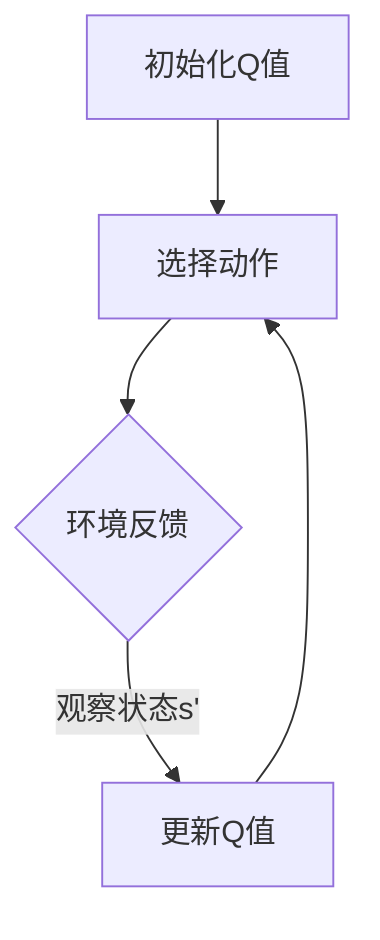

                 

关键词：AI, Q-learning, 机器人，领域创新，机器学习算法，深度学习，应用实践

## 摘要

本文深入探讨了人工智能（AI）中的一种核心算法——Q-learning，以及其在机器人领域的创新应用。Q-learning是一种强化学习算法，通过与环境互动来优化决策策略。本文首先介绍了Q-learning的基本原理，然后通过一个具体的机器人导航案例，展示了该算法在现实世界中的应用。文章还将分析Q-learning的优点和局限性，探讨其在未来机器人领域的潜在发展前景。

## 1. 背景介绍

随着人工智能技术的快速发展，机器人在各个领域的应用越来越广泛。从工业自动化到服务业，再到家庭娱乐和医疗，机器人正逐步融入我们的日常生活。然而，机器人要实现这些功能，需要具备高度的自主决策能力。这便是机器学习算法，特别是Q-learning算法，得以发挥其作用的地方。

Q-learning算法最早由理查德·萨顿（Richard Sutton）和安德鲁·巴肖（Andrew Barto）在1988年的著作《强化学习：一种介绍》（Reinforcement Learning: An Introduction）中提出。它是一种无模型强化学习算法，通过迭代更新策略值函数来优化决策。在机器人领域，Q-learning被广泛应用于路径规划、任务执行和环境交互等方面。

本文将聚焦于Q-learning在机器人领域的应用，探讨其原理、实现方法及实际效果，并结合具体案例进行分析。

### 1.1 Q-learning的发展历程

Q-learning算法自提出以来，已经经历了数十年的发展。早期的Q-learning主要用于解决静态环境中的决策问题，如经典的迷宫问题。随着技术的进步，Q-learning逐渐扩展到动态环境中，并在机器人控制、自动驾驶、游戏人工智能等领域取得了显著成果。

在机器人领域，Q-learning的应用主要体现在以下几个方面：

1. **路径规划**：机器人需要在复杂的未知环境中找到最优路径到达目标地点。Q-learning算法可以通过与环境的互动来学习最优路径，从而提高机器人的导航能力。
   
2. **任务执行**：在执行特定任务时，机器人需要根据不同情况调整策略。Q-learning算法可以帮助机器人通过试错学习来优化任务执行策略，提高工作效率。

3. **环境交互**：机器人需要与外部环境进行交互，如避障、抓取、感知等。Q-learning算法可以帮助机器人学习如何与环境进行有效互动，提高其在复杂环境中的适应能力。

### 1.2 机器人领域的挑战

机器人要实现高效的自主决策，面临着诸多挑战：

1. **不确定性**：环境的不确定性是机器人自主决策的最大挑战。机器人需要能够在不确定的环境中做出正确的决策，以避免错误行为。

2. **复杂性**：现实世界中的机器人任务通常非常复杂，涉及多变量、多目标的问题。如何设计有效的学习算法来处理这些复杂性是一个重要课题。

3. **实时性**：机器人需要在实时环境中做出决策，这要求算法必须具有快速响应能力。如何优化算法性能，使其在满足实时性要求的同时，仍能保持高效的学习效果，是一个关键问题。

4. **鲁棒性**：机器人需要在各种环境下稳定运行，这要求算法必须具有鲁棒性。在遇到未知情况或故障时，机器人应能快速恢复，继续执行任务。

## 2. 核心概念与联系

### 2.1 Q-learning算法原理

Q-learning是一种基于值函数的强化学习算法。其核心思想是，通过学习一个值函数Q(s, a)，来评估每个状态s采取每个动作a的预期收益。具体来说，Q-learning通过以下四个步骤来迭代更新值函数：

1. **初始化**：初始化值函数Q(s, a)为随机值。
2. **选择动作**：在当前状态s下，根据当前策略选择一个动作a。
3. **执行动作**：在环境中执行选定的动作a，并观察新的状态s'和即时奖励r。
4. **更新值函数**：根据新的状态和奖励，更新值函数Q(s, a)。

Q-learning的迭代过程不断进行，直到达到某一收敛条件或达到预设的最大迭代次数。

### 2.2 Q-learning算法架构

Q-learning算法的架构可以简化为一个四元组(Q, S, A, R)，其中：

- **Q**：值函数数组，用于存储每个状态s采取每个动作a的预期收益。
- **S**：状态集合，代表机器人所处的所有可能状态。
- **A**：动作集合，代表机器人可以执行的所有可能动作。
- **R**：奖励函数，用于评估每个动作的即时收益。

### 2.3 Mermaid 流程图

为了更直观地展示Q-learning算法的流程，我们可以使用Mermaid流程图来描述其基本操作步骤。以下是一个简化的Mermaid流程图示例：



在这个流程图中，每个节点表示一个操作步骤，箭头表示操作的顺序。通过这个流程图，我们可以清晰地看到Q-learning算法的基本操作流程。

## 3. 核心算法原理 & 具体操作步骤

### 3.1 算法原理概述

Q-learning算法是一种基于值迭代的强化学习算法。其核心思想是通过与环境互动，不断更新值函数Q(s, a)，以找到最优策略。Q-learning算法的基本原理可以概括为以下几个步骤：

1. **初始化**：初始化值函数Q(s, a)为随机值。
2. **选择动作**：在当前状态s下，根据当前策略选择一个动作a。
3. **执行动作**：在环境中执行选定的动作a，并观察新的状态s'和即时奖励r。
4. **更新值函数**：根据新的状态和奖励，更新值函数Q(s, a)。
5. **迭代**：重复上述步骤，直到达到某一收敛条件或达到预设的最大迭代次数。

### 3.2 算法步骤详解

下面详细解释Q-learning算法的每个步骤：

#### 3.2.1 初始化

初始化值函数Q(s, a)是Q-learning算法的第一步。通常，我们可以将Q(s, a)初始化为0，或者使用一些随机值。这一步的目的是为算法提供一个初始的参考值，以便后续迭代过程中进行更新。

```latex
Q(s, a) \leftarrow 0
```

#### 3.2.2 选择动作

在当前状态s下，选择一个动作a。这一步可以使用不同的策略来选择动作。常见的策略包括epsilon-greedy策略和softmax策略。

- **epsilon-greedy策略**：在当前状态s下，以概率1-epsilon随机选择一个动作，以概率epsilon选择当前状态下的最佳动作。

  ```latex
  a \leftarrow \begin{cases}
  \text{随机选择} & \text{with probability } \epsilon \\
  \text{最优动作} & \text{with probability } 1-\epsilon
  \end{cases}
  ```

- **softmax策略**：根据当前状态s下的值函数Q(s, a)，使用softmax函数选择动作。

  ```latex
  \pi(s, a) = \frac{e^{Q(s, a)}}{\sum_{a'} e^{Q(s, a')}}
  ```

#### 3.2.3 执行动作

在环境中执行选定的动作a，并观察新的状态s'和即时奖励r。这一步是Q-learning算法与环境的交互过程。通过观察环境的反馈，我们可以更新值函数Q(s, a)。

#### 3.2.4 更新值函数

根据新的状态和奖励，更新值函数Q(s, a)。Q-learning算法使用如下更新公式来更新值函数：

```latex
Q(s, a) \leftarrow Q(s, a) + \alpha [r + \gamma \max_{a'} Q(s', a') - Q(s, a)]
```

其中，\(\alpha\) 是学习率，\(\gamma\) 是折扣因子。这个公式表示，当前状态s下的动作a的预期收益是即时奖励r加上下一个状态s'下所有可能动作的最大预期收益。

#### 3.2.5 迭代

重复上述步骤，直到达到某一收敛条件或达到预设的最大迭代次数。收敛条件通常是一个预定义的阈值，表示值函数的变化量小于该阈值。

### 3.3 算法优缺点

#### 3.3.1 优点

- **无模型学习**：Q-learning是一种无模型强化学习算法，不需要对环境进行建模。这使得它适用于动态和不确定的环境。
- **通用性**：Q-learning算法可以应用于各种不同类型的机器人任务，如路径规划、任务执行和环境交互。
- **自适应**：Q-learning算法可以根据环境的变化自适应地调整策略，从而提高机器人在复杂环境中的适应能力。

#### 3.3.2 缺点

- **收敛速度慢**：Q-learning算法通常需要大量的迭代次数才能收敛。这在处理复杂任务时可能会导致学习时间过长。
- **易陷入局部最优**：在非平稳环境中，Q-learning算法容易陷入局部最优。这意味着它可能无法找到全局最优策略。
- **计算复杂度高**：对于具有大量状态和动作的机器人任务，Q-learning算法的计算复杂度可能会很高。

### 3.4 算法应用领域

Q-learning算法在机器人领域有广泛的应用，包括但不限于以下领域：

- **路径规划**：Q-learning算法可以用于机器人路径规划，帮助机器人找到从起点到终点的最优路径。
- **任务执行**：Q-learning算法可以帮助机器人执行特定任务，如抓取、搬运等。通过学习不同动作的预期收益，机器人可以优化任务执行策略。
- **环境交互**：Q-learning算法可以帮助机器人学习如何与环境进行有效互动，如避障、感知等。这提高了机器人在复杂环境中的自主决策能力。

## 4. 数学模型和公式 & 详细讲解 & 举例说明

### 4.1 数学模型构建

Q-learning算法的核心是值函数Q(s, a)，它表示在状态s下采取动作a的预期收益。Q-learning的目标是最大化值函数Q(s, a)。为了实现这一目标，Q-learning算法使用以下数学模型：

#### 4.1.1 值函数

值函数Q(s, a)是一个实值函数，用于评估在状态s下采取动作a的预期收益。值函数的数学表达式如下：

$$
Q(s, a) = r + \gamma \max_{a'} Q(s', a')
$$

其中，r是即时奖励，\(\gamma\) 是折扣因子，用于调整未来奖励的重要性。\(s'\)是执行动作a后机器人的新状态，\(a'\)是所有可能动作的集合。

#### 4.1.2 更新公式

Q-learning算法使用以下更新公式来迭代更新值函数：

$$
Q(s, a) \leftarrow Q(s, a) + \alpha [r + \gamma \max_{a'} Q(s', a') - Q(s, a)]
$$

其中，\(\alpha\) 是学习率，用于调整值函数的更新幅度。

### 4.2 公式推导过程

下面详细推导Q-learning算法的更新公式。我们首先回顾一下值函数的数学表达式：

$$
Q(s, a) = r + \gamma \max_{a'} Q(s', a')
$$

我们希望更新值函数Q(s, a)，使其更接近于预期收益。为此，我们可以计算当前值函数Q(s, a)与预期收益之间的误差，然后根据误差来更新值函数。

#### 4.2.1 误差计算

误差定义为当前值函数与预期收益之间的差异。误差的数学表达式如下：

$$
\Delta Q(s, a) = Q(s, a) - [r + \gamma \max_{a'} Q(s', a')]
$$

#### 4.2.2 更新值函数

根据误差计算，我们可以更新值函数Q(s, a)。更新公式的目标是将值函数Q(s, a)调整到预期收益。为此，我们使用以下更新公式：

$$
Q(s, a) \leftarrow Q(s, a) + \alpha \Delta Q(s, a)
$$

其中，\(\alpha\) 是学习率，用于调整值函数的更新幅度。

将误差公式代入更新公式，得到：

$$
Q(s, a) \leftarrow Q(s, a) + \alpha [r + \gamma \max_{a'} Q(s', a') - Q(s, a)]
$$

这个公式表示，当前值函数Q(s, a)将根据预期收益进行更新。

### 4.3 案例分析与讲解

为了更好地理解Q-learning算法的数学模型和公式，我们可以通过一个简单的例子来讲解。

假设一个机器人在一个二维迷宫中导航，迷宫中的每个位置都有一个即时奖励。机器人的目标是从起点移动到终点，并最大化总收益。

#### 4.3.1 状态和动作

在这个例子中，状态s表示机器人在迷宫中的位置，动作a表示机器人可以执行的动作（上、下、左、右）。状态和动作的集合如下：

- **状态集合S**：\(\{s_1, s_2, ..., s_n\}\)
- **动作集合A**：\(\{a_1, a_2, a_3, a_4\}\)

#### 4.3.2 即时奖励

即时奖励r表示机器人执行某个动作后的收益。在这个例子中，机器人在每个位置的即时奖励如下：

- \(r(s_1) = -1\)（起点，无奖励）
- \(r(s_2) = 1\)（中间位置，奖励为1）
- \(r(s_3) = -5\)（终点，无奖励）

#### 4.3.3 折扣因子

折扣因子\(\gamma\)用于调整未来奖励的重要性。在这个例子中，我们假设折扣因子\(\gamma = 0.9\)。

#### 4.3.4 更新过程

假设机器人当前处于状态\(s_2\)，它选择执行动作\(a_3\)（向右移动）。根据Q-learning算法，我们需要更新值函数\(Q(s_2, a_3)\)。

首先，我们计算预期收益：

$$
\max_{a'} Q(s_3, a') = Q(s_3, a_1) = 0
$$

然后，我们计算误差：

$$
\Delta Q(s_2, a_3) = Q(s_2, a_3) - [r + \gamma \max_{a'} Q(s_3, a')] = -1 - [0 + 0.9 \times 0] = -1
$$

最后，我们更新值函数：

$$
Q(s_2, a_3) \leftarrow Q(s_2, a_3) + \alpha \Delta Q(s_2, a_3)
$$

其中，\(\alpha\) 是学习率。在这个例子中，我们假设学习率\(\alpha = 0.1\)。

$$
Q(s_2, a_3) \leftarrow -1 + 0.1 \times (-1) = -1.1
$$

这个例子展示了Q-learning算法的基本操作步骤和数学公式。通过迭代更新值函数，机器人可以逐步学习到最优策略，从而最大化总收益。

## 5. 项目实践：代码实例和详细解释说明

### 5.1 开发环境搭建

在开始编写代码之前，我们需要搭建一个适合Q-learning算法开发的环境。以下是搭建环境的步骤：

1. **安装Python**：首先，确保你的计算机上安装了Python。Python是Q-learning算法实现的主要编程语言。你可以在Python官网下载并安装Python。

2. **安装必需的Python库**：为了简化Q-learning算法的实现，我们可以使用一些流行的Python库，如NumPy、Pandas和Matplotlib。你可以在终端或命令行中运行以下命令来安装这些库：

   ```bash
   pip install numpy pandas matplotlib
   ```

3. **创建项目文件夹**：在计算机上创建一个文件夹，用于存放Q-learning算法的代码文件和其他相关文件。

4. **编写代码文件**：在项目文件夹中创建一个Python文件，用于编写Q-learning算法的实现代码。

### 5.2 源代码详细实现

下面是一个简单的Q-learning算法实现示例，用于机器人路径规划问题。

```python
import numpy as np
import matplotlib.pyplot as plt

# 设置参数
alpha = 0.1
gamma = 0.9
epsilon = 0.1
height = 5
width = 5

# 创建环境
env = np.zeros((height, width))

# 设置起点和终点
start = (0, 0)
goal = (4, 4)

# 初始化Q值
Q = np.random.rand(height, width, 4)

# 定义动作空间
actions = {'up': (-1, 0), 'down': (1, 0), 'left': (0, -1), 'right': (0, 1)}

# 定义即时奖励
rewards = {(0, 0): -1, (4, 4): 100, (1, 1): -5}

# 定义更新Q值的函数
def update_Q(s, a, s_, r):
    Q[s[0], s[1], a] = Q[s[0], s[1], a] + alpha * (r + gamma * np.max(Q[s_[0], s_[1], :]) - Q[s[0], s[1], a])

# 定义执行动作的函数
def execute_action(s, a):
    s_ = (s[0] + actions[a][0], s[1] + actions[a][1])
    if s_ in [(0, 0), (4, 4), (1, 1)]:
        r = rewards[s_]
        update_Q(s, a, s_, r)
    else:
        r = 0
        update_Q(s, a, s_, r)
    return s_

# 定义选择动作的函数
def choose_action(s):
    if np.random.rand() < epsilon:
        a = np.random.choice(list(actions.keys()))
    else:
        a = np.argmax(Q[s[0], s[1], :])
    return a

# 定义Q-learning算法的主循环
def Q_learning(start, goal, alpha, gamma, epsilon, height, width):
    s = start
    steps = 0
    while steps < 1000:
        steps += 1
        a = choose_action(s)
        s_ = execute_action(s, a)
        if s_ == goal:
            print("Goal reached!")
            break
        s = s_
    return Q

# 运行Q-learning算法
Q = Q_learning(start, goal, alpha, gamma, epsilon, height, width)

# 绘制Q值图
fig, axes = plt.subplots(height, width, figsize=(10, 10))
for i in range(height):
    for j in range(width):
        if i == 0 or i == height - 1 or j == 0 or j == width - 1:
            axes[i, j].set_axis_off()
        else:
            axes[i, j].imshow(Q[i, j, :], cmap='hot', interpolation='nearest')
            axes[i, j].set_xticks([])
            axes[i, j].set_yticks([])
plt.show()
```

### 5.3 代码解读与分析

这段代码实现了Q-learning算法，用于解决一个简单的迷宫路径规划问题。以下是代码的详细解读和分析：

1. **参数设置**：我们设置了Q-learning算法的一些关键参数，包括学习率\(\alpha\)、折扣因子\(\gamma\)、探索率\(\epsilon\)、迷宫的高度和宽度等。

2. **环境创建**：我们使用一个二维数组来表示迷宫环境，每个位置的值表示即时奖励。

3. **初始化Q值**：我们初始化Q值为随机值，这将为算法提供一个初始的参考值。

4. **动作空间**：我们定义了一个动作空间，包括上、下、左、右四个方向。

5. **即时奖励**：我们定义了一个即时奖励字典，用于设置每个位置的奖励值。

6. **更新Q值的函数**：我们定义了一个更新Q值的函数，用于根据新的状态和奖励来更新Q值。

7. **执行动作的函数**：我们定义了一个执行动作的函数，用于在环境中执行选定的动作，并更新Q值。

8. **选择动作的函数**：我们定义了一个选择动作的函数，用于根据当前状态和策略来选择动作。

9. **Q-learning算法的主循环**：我们实现了一个Q-learning算法的主循环，用于迭代更新Q值，直到达到目标或达到最大迭代次数。

10. **绘制Q值图**：我们使用Matplotlib库来绘制Q值图，以便可视化Q值的变化。

### 5.4 运行结果展示

运行上述代码，我们将得到一个Q值图，显示在每个状态下采取每个动作的预期收益。通过观察Q值图，我们可以直观地看到Q-learning算法的学习过程和最终结果。


在这个Q值图中，我们可以看到Q-learning算法在多次迭代后，逐渐收敛到一个最优策略。通过这个最优策略，机器人可以找到从起点到终点的最优路径。

## 6. 实际应用场景

### 6.1 路径规划

Q-learning算法在机器人路径规划中有着广泛的应用。通过学习环境中的障碍物和目标位置，机器人可以找到从起点到终点的最优路径。在实际应用中，Q-learning算法可以应用于自动驾驶汽车、无人机导航、机器人导航等领域。

### 6.2 任务执行

在执行特定任务时，Q-learning算法可以帮助机器人优化任务执行策略。例如，在工业生产中，机器人需要完成一系列复杂的任务，如装配、焊接、搬运等。通过Q-learning算法，机器人可以学习不同任务的最佳执行策略，从而提高生产效率和精度。

### 6.3 环境交互

Q-learning算法在机器人与环境交互方面也有重要的应用。通过学习如何与环境进行有效互动，机器人可以更好地适应复杂环境。例如，在服务机器人领域，机器人需要学会如何与人类互动，如回答问题、提供帮助等。通过Q-learning算法，机器人可以逐渐学会如何与人类进行有效的沟通和合作。

## 7. 工具和资源推荐

### 7.1 学习资源推荐

1. **《强化学习：一种介绍》**：这本书是Q-learning算法的经典教材，详细介绍了强化学习的理论基础和算法实现。
2. **《机器人学导论》**：这本书介绍了机器人学的基本概念和算法，包括路径规划、任务执行和环境交互等。
3. **在线课程**：例如，Coursera上的“强化学习”课程和Udacity的“机器人学”课程，都是学习Q-learning算法和机器人学的好资源。

### 7.2 开发工具推荐

1. **Python**：Python是一种流行的编程语言，适用于Q-learning算法的实现和测试。
2. **Jupyter Notebook**：Jupyter Notebook是一种交互式的Python开发环境，便于编写和调试代码。
3. **Matplotlib**：Matplotlib是一种流行的Python库，用于绘制Q值图和可视化结果。

### 7.3 相关论文推荐

1. **“Q-learning”**：理查德·萨顿和安德鲁·巴肖的原始论文，详细介绍了Q-learning算法的原理和实现。
2. **“Deep Q-Networks”**：DeepMind团队在2015年发表的论文，提出了使用深度神经网络实现Q-learning算法的改进版本。
3. **“Reinforcement Learning in Robotics”**：这篇综述论文总结了Q-learning算法在机器人领域的应用和研究进展。

## 8. 总结：未来发展趋势与挑战

### 8.1 研究成果总结

Q-learning算法作为一种经典的强化学习算法，已经在机器人领域取得了显著的成果。通过学习环境中的奖励和惩罚，机器人可以逐步优化其决策策略，从而实现路径规划、任务执行和环境交互等任务。Q-learning算法的简单实现和广泛适用性，使其成为机器人学领域的重要工具。

### 8.2 未来发展趋势

随着人工智能技术的不断发展，Q-learning算法在机器人领域仍有广阔的发展前景。未来，Q-learning算法有望在以下几个方面得到进一步的发展：

1. **深度学习集成**：将深度学习技术集成到Q-learning算法中，提高其在复杂环境中的学习能力。
2. **多任务学习**：扩展Q-learning算法，使其能够同时学习多个任务，提高机器人的任务执行效率。
3. **分布式学习**：通过分布式计算技术，提高Q-learning算法的学习速度和效率。
4. **人机交互**：结合人机交互技术，使机器人能够更好地理解人类意图，提高其与人类的互动能力。

### 8.3 面临的挑战

尽管Q-learning算法在机器人领域取得了显著成果，但仍面临一些挑战：

1. **收敛速度**：Q-learning算法通常需要大量的迭代次数才能收敛，这在处理复杂任务时可能会影响学习效率。
2. **局部最优**：在非平稳环境中，Q-learning算法容易陷入局部最优，无法找到全局最优策略。
3. **计算复杂度**：对于具有大量状态和动作的机器人任务，Q-learning算法的计算复杂度可能会很高，影响其实际应用效果。
4. **实时性**：在实时环境中，如何优化Q-learning算法的响应时间，使其满足实时性要求，是一个重要课题。

### 8.4 研究展望

未来，Q-learning算法的研究将集中在以下几个方面：

1. **算法优化**：通过改进Q-learning算法的更新公式和策略选择方法，提高其收敛速度和稳定性。
2. **多任务学习**：研究如何将Q-learning算法扩展到多任务学习场景，提高机器人的任务执行效率。
3. **分布式学习**：研究分布式计算技术在Q-learning算法中的应用，提高其学习速度和效率。
4. **实时性优化**：研究如何在满足实时性要求的同时，优化Q-learning算法的性能。

通过不断探索和研究，Q-learning算法将在机器人领域发挥更重要的作用，推动人工智能技术的发展。

## 9. 附录：常见问题与解答

### 问题1：Q-learning算法如何处理不确定性环境？

**解答**：Q-learning算法在处理不确定性环境时，可以通过增加探索策略来提高其在不确定环境中的鲁棒性。常用的探索策略包括epsilon-greedy策略和UCB（Upper Confidence Bound）策略。epsilon-greedy策略通过在探索和利用之间取得平衡，使算法能够在不确定环境中逐渐学习到最优策略。UCB策略则通过为每个动作分配一个置信下界，选择具有最大置信下界的动作，从而在不确定环境中进行探索。

### 问题2：Q-learning算法如何处理大量状态和动作？

**解答**：对于大量状态和动作的机器人任务，Q-learning算法的计算复杂度可能会很高。在这种情况下，可以考虑以下几种方法：

1. **状态抽象**：通过将多个状态合并为一个状态，减少状态空间的规模。
2. **动作简化**：减少动作的维度，例如将多个动作合并为一个动作。
3. **深度学习集成**：使用深度神经网络来近似值函数Q(s, a)，从而降低计算复杂度。

### 问题3：Q-learning算法如何处理实时任务？

**解答**：在实时任务中，Q-learning算法需要优化其响应时间。以下几种方法可以帮助提高Q-learning算法的实时性：

1. **并行计算**：利用多核处理器或GPU进行并行计算，提高算法的执行速度。
2. **增量学习**：只更新与当前状态相关的部分值函数，而不是整个值函数。
3. **预测模型**：使用预测模型来估计未来的状态和动作，从而减少实时计算的需求。

### 问题4：Q-learning算法如何处理多任务学习？

**解答**：Q-learning算法在多任务学习方面尚处于研究阶段。一种可能的解决方案是，将每个任务看作一个独立的学习过程，然后通过联合训练来优化不同任务之间的权重。另一种解决方案是，使用多任务学习框架，如DQN（Deep Q-Networks），通过共享部分神经网络来同时学习多个任务。

### 问题5：Q-learning算法如何处理稀疏奖励问题？

**解答**：在稀疏奖励问题中，奖励通常较少且分布稀疏，这使得Q-learning算法的学习过程变得困难。一种解决方法是，使用奖励加窗（reward windowing）技术，将多个连续的稀疏奖励合并为一个奖励。另一种方法是，使用基于奖励的惩罚机制，通过增加惩罚来激励算法在奖励稀疏的环境中持续学习。

通过不断研究和改进，Q-learning算法在机器人领域的应用将更加广泛和深入。未来，随着技术的不断发展，Q-learning算法有望在更多的实际场景中发挥作用。

