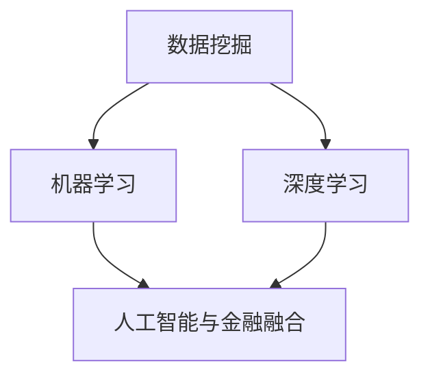

                 

关键词：人工智能，金融科技，深度学习，机器学习，数据挖掘，算法应用

> 摘要：本文探讨了人工智能在金融领域中的应用，通过分析AI技术的核心概念、算法原理、数学模型及其在实际项目中的具体应用，探讨了AI如何改变金融行业的运作方式，并展望了其未来的发展趋势和挑战。

## 1. 背景介绍

近年来，人工智能（AI）技术迅猛发展，逐渐成为推动金融行业变革的核心动力。金融领域涵盖广泛，包括银行、保险、证券、投资等多个细分市场，这些市场均面临着海量数据处理、复杂风险管理和高效决策的需求。AI技术的引入，使得金融行业能够更精准地分析市场趋势，优化风险管理，提高运营效率，从而创造出新的商业模式和价值。

### 1.1 金融行业面临的挑战

- **海量数据处理**：金融行业每天产生海量的交易数据、客户数据和市场数据，如何快速有效地处理这些数据成为了一大挑战。
- **风险管理**：金融市场的波动性极大，如何准确预测市场风险，避免金融风险成为金融机构的重要课题。
- **个性化服务**：客户需求的多样化和个性化，使得金融机构需要提供更加精准和个性化的服务。
- **合规性**：金融行业受到严格的监管，如何确保AI系统的合规性是一个重大问题。

### 1.2 AI技术的优势

- **数据处理能力**：AI技术能够高效处理海量数据，快速提取有用信息。
- **预测分析能力**：利用机器学习和深度学习算法，AI能够预测市场趋势和客户行为。
- **自动化**：通过自动化系统，AI能够降低人力成本，提高工作效率。
- **合规性**：AI技术能够辅助金融机构遵守监管要求，减少合规风险。

## 2. 核心概念与联系

在探讨AI在金融领域的应用之前，我们需要了解一些核心概念和原理，以及它们如何相互联系。

### 2.1 数据挖掘

数据挖掘是AI技术的重要分支，它涉及从大量数据中发现有用的模式和知识。在金融领域，数据挖掘可以用于客户行为分析、市场趋势预测等。

### 2.2 机器学习

机器学习是一种让计算机通过数据学习并作出决策或预测的方法。在金融领域，机器学习算法常用于信用评分、风险评估等。

### 2.3 深度学习

深度学习是机器学习的一个子领域，它使用多层神经网络进行学习。深度学习在金融领域有广泛的应用，如图像识别、语音识别等。

### 2.4 人工智能与金融的融合

人工智能与金融的融合，不仅涉及到算法的应用，还包括数据管理、风险管理、合规性等多个方面。

### 2.5 Mermaid 流程图



## 3. 核心算法原理 & 具体操作步骤

### 3.1 算法原理概述

在金融领域，常用的AI算法包括线性回归、决策树、随机森林、神经网络等。这些算法各有特点，适用于不同的金融应用场景。

### 3.2 算法步骤详解

以线性回归为例，其基本步骤如下：

1. **数据预处理**：清洗数据，处理缺失值，标准化数据。
2. **特征选择**：选择对预测目标有显著影响的特征。
3. **模型训练**：使用训练数据集，利用最小二乘法等优化方法训练模型。
4. **模型评估**：使用验证数据集评估模型性能。
5. **模型部署**：将模型部署到实际应用场景，如风险评估系统。

### 3.3 算法优缺点

- **线性回归**：简单、易于理解，但可能无法处理非线性关系。
- **决策树**：易于解释，但可能过度拟合。
- **随机森林**：具有很好的泛化能力，但计算成本较高。
- **神经网络**：强大的非线性处理能力，但训练复杂，容易过拟合。

### 3.4 算法应用领域

- **信用评分**：使用机器学习算法预测客户信用风险。
- **市场预测**：利用深度学习预测市场趋势。
- **风险管理**：通过数据挖掘分析风险因素。
- **个性化推荐**：根据客户行为数据提供个性化投资建议。

## 4. 数学模型和公式 & 详细讲解 & 举例说明

### 4.1 数学模型构建

在金融领域，常用的数学模型包括线性回归模型、神经网络模型等。

### 4.2 公式推导过程

以线性回归模型为例，其公式推导如下：

$$
y = \beta_0 + \beta_1x_1 + \beta_2x_2 + ... + \beta_nx_n + \epsilon
$$

其中，$y$ 为预测目标，$x_1, x_2, ..., x_n$ 为特征变量，$\beta_0, \beta_1, ..., \beta_n$ 为模型参数，$\epsilon$ 为误差项。

### 4.3 案例分析与讲解

假设我们要预测一个股票的价格，特征变量包括股票的市盈率、市净率等。使用线性回归模型，我们可以建立如下模型：

$$
P = \beta_0 + \beta_1\text{PE} + \beta_2\text{PB} + \epsilon
$$

其中，$P$ 为股票价格，$\text{PE}$ 为市盈率，$\text{PB}$ 为市净率。

通过数据训练，我们可以得到模型参数 $\beta_0, \beta_1, \beta_2$，然后使用该模型预测未来股票价格。

## 5. 项目实践：代码实例和详细解释说明

### 5.1 开发环境搭建

为了实现上述线性回归模型，我们需要搭建一个Python开发环境，并安装相关库，如 NumPy、Pandas、Scikit-learn 等。

```python
pip install numpy pandas scikit-learn
```

### 5.2 源代码详细实现

以下是一个简单的线性回归代码实例：

```python
import numpy as np
import pandas as pd
from sklearn.linear_model import LinearRegression

# 数据读取与预处理
data = pd.read_csv('stock_data.csv')
X = data[['PE', 'PB']]
y = data['P']

# 模型训练
model = LinearRegression()
model.fit(X, y)

# 模型评估
score = model.score(X, y)
print(f'Model R^2 score: {score}')

# 模型部署
predicted_price = model.predict([[15, 2.5]])
print(f'Predicted stock price: {predicted_price[0]}')
```

### 5.3 代码解读与分析

在这个代码中，我们首先读取股票数据，然后分离特征变量和预测目标。接着，我们使用线性回归模型进行训练，并评估模型性能。最后，我们使用模型预测未来股票价格。

### 5.4 运行结果展示

运行上述代码，我们可以得到模型的R^2得分和预测的股票价格。这表明我们的模型具有一定预测能力。

## 6. 实际应用场景

### 6.1 信用评分

利用AI技术，金融机构可以更准确地评估客户的信用风险。例如，银行可以使用机器学习算法分析客户的信用历史、收入状况、还款能力等多个因素，从而给出更准确的信用评分。

### 6.2 市场预测

AI技术可以帮助金融机构预测市场趋势，从而为投资决策提供支持。例如，基金公司可以使用深度学习算法分析历史市场数据，预测未来市场走势。

### 6.3 风险管理

AI技术可以协助金融机构识别和管理风险。例如，保险公司可以使用数据挖掘技术分析客户数据，预测潜在的风险因素，从而制定更有效的风险管理策略。

### 6.4 个性化服务

AI技术可以帮助金融机构提供更加个性化的服务。例如，投资平台可以根据客户的行为数据，推荐符合客户风险偏好和投资目标的理财产品。

## 7. 工具和资源推荐

### 7.1 学习资源推荐

- **《机器学习》（周志华著）**：系统介绍了机器学习的基本概念和方法。
- **《深度学习》（Ian Goodfellow 著）**：深入讲解了深度学习的基础理论和实践方法。

### 7.2 开发工具推荐

- **Jupyter Notebook**：一个强大的交互式开发环境，适合进行数据分析和模型训练。
- **TensorFlow**：一个开源的机器学习库，适用于构建和训练深度学习模型。

### 7.3 相关论文推荐

- **"Deep Learning for Text Classification"**：介绍了一种用于文本分类的深度学习方法。
- **"Convolutional Neural Networks for Stock Market Forecasting"**：探讨了一种利用卷积神经网络预测股票市场的技术。

## 8. 总结：未来发展趋势与挑战

### 8.1 研究成果总结

AI技术在金融领域的应用取得了显著成果，如信用评分、市场预测、风险管理等方面。这些成果不仅提高了金融机构的运营效率，还为投资者提供了更准确的决策支持。

### 8.2 未来发展趋势

随着AI技术的不断进步，未来金融领域的AI应用将更加广泛，如智能投顾、智能客服等。同时，AI技术也将推动金融行业的数字化转型，提高整体竞争力。

### 8.3 面临的挑战

尽管AI技术在金融领域具有巨大潜力，但仍然面临一些挑战，如数据隐私保护、算法透明性、合规性等。这些挑战需要金融机构、监管机构和技术公司共同努力，共同推动金融科技的发展。

### 8.4 研究展望

未来，AI技术在金融领域的应用将更加深入和广泛。我们期待看到更多的创新成果，如基于AI的智能风险管理、智能投资策略等，为金融行业带来更多价值。

## 9. 附录：常见问题与解答

### 9.1 AI在金融领域的应用有哪些？

AI在金融领域的应用包括信用评分、市场预测、风险管理、个性化服务等多个方面。

### 9.2 金融行业的AI应用有哪些挑战？

金融行业的AI应用面临数据隐私保护、算法透明性、合规性等挑战。

### 9.3 如何确保AI系统的合规性？

确保AI系统的合规性需要从数据采集、模型训练、模型部署等各个环节进行严格监管，遵循相关法律法规。

以上是关于AI在金融领域应用的全面探讨，希望对您有所帮助。作者：禅与计算机程序设计艺术 / Zen and the Art of Computer Programming。

