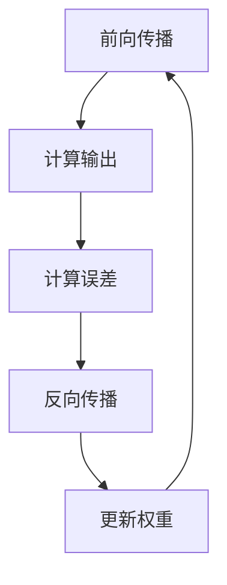

                 

关键词：神经网络、生物神经、映射、信息处理、计算机科学

> 摘要：本文从生物神经的角度出发，探讨神经网络的基础原理，并深入分析人工神经网络的发展历程、核心算法及其在计算机科学中的应用，旨在为读者揭示神经网络技术从生物原型到现代计算机应用的演变过程，以及其在未来可能的发展趋势和面临的挑战。

## 1. 背景介绍

神经网络的起源可以追溯到生物神经系统的启发。自20世纪初以来，科学家们对生物神经系统的研究逐渐深入，发现其复杂的信息处理能力依赖于神经元之间的相互连接和交互作用。这一发现激发了研究人员对人工神经网络（Artificial Neural Networks，ANN）的兴趣，希望利用这种生物原型来设计出能够模拟人类大脑智能的信息处理系统。

早期的人工神经网络研究主要集中在模拟生物神经元的简单特性，如阈值激活、加权连接等。随着计算能力的提升和算法的进步，神经网络的理论和实践得到了快速发展。近年来，深度学习（Deep Learning，DL）的出现更是将人工神经网络推向了前所未有的高度，其在图像识别、自然语言处理、自动驾驶等领域的成功应用，证明了神经网络技术在计算机科学中的重要地位。

本文将分为以下几个部分进行阐述：

1. **核心概念与联系**：介绍神经网络的基础概念，并给出一个详细的流程图，展示其原理与架构。
2. **核心算法原理与具体操作步骤**：详细解析神经网络的核心算法，包括原理概述、操作步骤、优缺点以及应用领域。
3. **数学模型和公式**：讲解神经网络的数学模型构建、公式推导过程以及实际案例的讲解。
4. **项目实践**：通过具体代码实例，展示神经网络的应用和实现过程。
5. **实际应用场景**：分析神经网络在计算机科学中的具体应用场景，以及未来的发展趋势。
6. **工具和资源推荐**：为读者提供学习资源、开发工具和相关论文的推荐。
7. **总结**：对研究成果进行总结，探讨未来发展趋势和面临的挑战。

### 1.1 神经网络的发展历程

神经网络的发展历程可以分为几个重要阶段：

- **1943年**：心理学家McCulloch和数学家Pitts提出了简单的神经网络模型，称为MCP模型，这是神经网络理论的开端。
- **1958年**：Frank Rosenblatt提出了感知机（Perceptron）模型，这是第一个能够学习和分类的神经网络模型。
- **1986年**：Rumelhart、Hinton和Williams提出了反向传播算法（Backpropagation Algorithm），大大提高了神经网络训练的效率和准确性。
- **2006年**：Hinton等人提出了深度学习（Deep Learning），使用多层神经网络进行特征学习和分类，开启了深度学习的新时代。
- **至今**：随着计算能力和数据量的提高，深度学习在各个领域都取得了显著的成果，推动了人工智能的快速发展。

### 1.2 生物神经系统的启示

生物神经系统是神经网络设计的灵感来源。神经元是神经系统的基本单位，它们通过树突接收信号，通过轴突将信号传递给其他神经元。神经元之间的连接通过突触实现，突触的强度由突触前神经元传递的信号决定。这种连接和信号传递的方式启发了人工神经网络的架构设计。

### 1.3 神经网络的分类

神经网络可以根据结构、功能和应用场景进行分类。常见的分类方式如下：

- **按结构分类**：前馈神经网络、反馈神经网络、自组织映射、递归神经网络等。
- **按功能分类**：分类神经网络、回归神经网络、聚类神经网络等。
- **按应用场景分类**：图像识别、自然语言处理、语音识别、推荐系统等。

## 2. 核心概念与联系

### 2.1 神经元模型

神经元是神经网络的基本单元，其结构如图1所示。神经元接收来自其他神经元的输入信号，通过加权求和后，经过一个激活函数，产生输出信号。


神经元模型通常包括以下几个部分：

- **输入层**：接收外部输入信号。
- **隐藏层**：对输入信号进行处理和特征提取。
- **输出层**：生成最终的输出信号。

### 2.2 神经网络架构

神经网络架构通常由多个隐藏层组成，形成一个深度网络。隐藏层负责对输入信号进行特征提取和变换。神经网络的深度决定了模型的表达能力。图2展示了典型的多层感知机（MLP）结构。


神经网络架构的关键参数包括：

- **层数**：网络的深度。
- **神经元数目**：每个层的神经元数量。
- **连接权重**：神经元之间的连接权重。
- **激活函数**：用于确定神经元是否激活的函数。

### 2.3 激活函数

激活函数是神经网络中用于确定神经元是否激活的关键元素。常见的激活函数包括：

- **线性激活函数**：f(x) = x
- ** sigmoid函数**：f(x) = 1 / (1 + e^-x)
- **ReLU函数**：f(x) = max(0, x)
- **Tanh函数**：f(x) = (e^x - e^-x) / (e^x + e^-x)

激活函数的选择会影响网络的收敛速度和性能。

### 2.4 神经网络学习过程

神经网络的学习过程包括以下几个步骤：

1. **前向传播**：将输入信号通过网络进行传递，计算输出结果。
2. **反向传播**：根据输出结果和真实标签，计算误差，并通过反向传播算法更新网络权重。
3. **迭代优化**：重复前向传播和反向传播过程，直到网络达到预设的精度或迭代次数。

### 2.5 Mermaid流程图

下面是一个简单的Mermaid流程图，展示了神经网络的学习过程。



## 3. 核心算法原理 & 具体操作步骤

### 3.1 算法原理概述

神经网络的核心算法是基于反向传播算法（Backpropagation Algorithm），它通过不断迭代优化网络权重，以最小化预测误差。反向传播算法可以分为以下几个步骤：

1. **前向传播**：将输入信号通过网络进行传递，计算输出结果。
2. **计算误差**：将输出结果与真实标签进行比较，计算误差。
3. **反向传播**：将误差反向传递，计算每个权重和偏置的梯度。
4. **更新权重**：根据梯度调整网络权重，以最小化误差。

### 3.2 算法步骤详解

1. **初始化权重和偏置**：通常采用随机初始化方法，以避免网络陷入局部最优。
2. **前向传播**：将输入信号通过网络进行传递，计算输出结果。每个神经元接收来自前一层神经元的输入信号，通过加权求和后，经过激活函数产生输出信号。
3. **计算误差**：将输出结果与真实标签进行比较，计算误差。误差可以采用均方误差（Mean Squared Error，MSE）或其他损失函数进行计算。
4. **反向传播**：将误差反向传递，计算每个权重和偏置的梯度。梯度计算可以通过链式法则进行，即将误差分解为前一层和当前层的部分。
5. **更新权重**：根据梯度调整网络权重，以最小化误差。更新公式为：Δw = -α∇wJ，其中α是学习率，∇wJ是权重w的梯度。
6. **迭代优化**：重复前向传播、计算误差、反向传播和更新权重的过程，直到网络达到预设的精度或迭代次数。

### 3.3 算法优缺点

**优点**：

- **强大的泛化能力**：神经网络可以处理复杂的非线性问题，具有较强的泛化能力。
- **自适应能力**：神经网络可以通过学习不断调整权重和偏置，以适应不同的输入数据。
- **多任务处理**：神经网络可以同时处理多个任务，实现多任务学习。

**缺点**：

- **计算复杂度较高**：神经网络需要大量的计算资源，尤其是深度神经网络。
- **训练时间较长**：神经网络需要多次迭代优化，以收敛到最优解，训练时间较长。
- **对数据质量要求较高**：神经网络对数据质量要求较高，需要保证数据集的多样性和平衡性。

### 3.4 算法应用领域

神经网络在计算机科学中具有广泛的应用领域，包括：

- **图像识别**：神经网络可以用于图像分类、目标检测和图像生成等任务。
- **自然语言处理**：神经网络可以用于文本分类、机器翻译和情感分析等任务。
- **语音识别**：神经网络可以用于语音信号处理、语音合成和语音识别等任务。
- **推荐系统**：神经网络可以用于用户行为分析、商品推荐和广告投放等任务。
- **自动驾驶**：神经网络可以用于车辆检测、路径规划和自动驾驶控制等任务。

## 4. 数学模型和公式 & 详细讲解 & 举例说明

### 4.1 数学模型构建

神经网络的核心是多层感知机（MLP），其数学模型如下：

设输入信号为X = [x1, x2, ..., xn]，权重矩阵为W = [w1, w2, ..., wn]，偏置矩阵为b = [b1, b2, ..., bn]，隐藏层神经元数为m，输出层神经元数为k。

前向传播过程如下：

1. **输入层到隐藏层**：

   $$h\_l = \sigma(W\_lX + b\_l)$$

   其中，σ是激活函数，l代表当前层。

2. **隐藏层到输出层**：

   $$y\_l = \sigma(W\_lH\_l + b\_l)$$

   其中，H\_l是隐藏层输出。

输出层到输出层的输出为预测值：

$$y = \sigma(W\_yH\_m + b\_y)$$

### 4.2 公式推导过程

假设网络输出为y，真实标签为t，损失函数为MSE：

$$J = \frac{1}{2}\sum_{i=1}^{k}(y\_i - t\_i)^2$$

1. **前向传播**：

   输入层到隐藏层：

   $$h\_l = \sigma(W\_lX + b\_l)$$

   隐藏层到输出层：

   $$y\_l = \sigma(W\_lH\_l + b\_l)$$

   输出层输出：

   $$y = \sigma(W\_yH\_m + b\_y)$$

2. **反向传播**：

   计算输出层误差：

   $$\delta\_y = (y - t)\odot \sigma'(y)$$

   其中，$\odot$表示逐元素乘积，$\sigma'$是激活函数的导数。

   计算隐藏层误差：

   $$\delta\_h\_l = W\_y'\delta\_y\odot \sigma'(h\_l)$$

   其中，$W\_y'$是权重矩阵的转置。

3. **梯度计算**：

   $$\frac{\partial J}{\partial W\_y} = \delta\_yH\_m^T$$

   $$\frac{\partial J}{\partial b\_y} = \delta\_y$$

   $$\frac{\partial J}{\partial W\_l} = \delta\_h\_lH\_l^T$$

   $$\frac{\partial J}{\partial b\_l} = \delta\_h\_l$$

4. **权重更新**：

   $$W\_y := W\_y - \alpha\frac{\partial J}{\partial W\_y}$$

   $$b\_y := b\_y - \alpha\frac{\partial J}{\partial b\_y}$$

   $$W\_l := W\_l - \alpha\frac{\partial J}{\partial W\_l}$$

   $$b\_l := b\_l - \alpha\frac{\partial J}{\partial b\_l}$$

### 4.3 案例分析与讲解

假设我们有一个简单的二分类问题，输入信号为X = [1, 2]，输出层神经元为k = 1。我们使用一个单层神经网络进行训练，权重矩阵W = [0.5]，偏置b = [0.5]。

1. **初始化权重和偏置**：

   W = [0.5]

   b = [0.5]

2. **前向传播**：

   输入信号X = [1, 2]：

   $$h = \sigma(WX + b) = \sigma(0.5 \times 1 + 0.5) = 1.0$$

   输出层输出：

   $$y = \sigma(W\_yH + b\_y) = \sigma(0.5 \times 1.0 + 0.5) = 0.5$$

3. **计算误差**：

   真实标签t = [0]：

   $$J = \frac{1}{2}(y - t)^2 = \frac{1}{2}(0.5 - 0)^2 = 0.125$$

4. **反向传播**：

   计算输出层误差：

   $$\delta\_y = (y - t)\odot \sigma'(y) = (0.5 - 0)\odot (1 - 0.5) = 0.25$$

   计算隐藏层误差：

   $$\delta\_h = W\_y'\delta\_y\odot \sigma'(h) = 0.5^T \times 0.25 \odot (1 - 0.5) = 0.25 \odot 0.5 = 0.125$$

5. **梯度计算**：

   $$\frac{\partial J}{\partial W} = \delta\_hH^T = 0.125 \times 1^T = 0.125$$

   $$\frac{\partial J}{\partial b} = \delta\_h = 0.125$$

6. **权重更新**：

   学习率α = 0.1：

   $$W := W - \alpha\frac{\partial J}{\partial W} = 0.5 - 0.1 \times 0.125 = 0.375$$

   $$b := b - \alpha\frac{\partial J}{\partial b} = 0.5 - 0.1 \times 0.125 = 0.375$$

7. **重复前向传播、反向传播和权重更新的过程**，直到网络收敛。

通过上述步骤，我们可以训练出一个简单的神经网络，实现对二分类问题的预测。在实际应用中，我们可以使用更复杂的神经网络，以及更高效的训练算法，如深度学习框架（如TensorFlow、PyTorch）来处理更大的数据集和更复杂的问题。

## 5. 项目实践：代码实例和详细解释说明

为了更好地展示神经网络的应用，我们将使用Python实现一个简单的神经网络，用于手写数字识别。该示例将包括以下几个步骤：

1. **开发环境搭建**：介绍所需的Python库和工具。
2. **源代码详细实现**：展示神经网络的构建、训练和预测过程。
3. **代码解读与分析**：解释代码的各个部分及其工作原理。
4. **运行结果展示**：展示训练和预测的结果。

### 5.1 开发环境搭建

首先，我们需要安装Python和相关库。建议使用Python 3.7及以上版本，并安装以下库：

- NumPy：用于数值计算。
- TensorFlow：用于构建和训练神经网络。
- Matplotlib：用于可视化。

安装命令如下：

```bash
pip install numpy tensorflow matplotlib
```

### 5.2 源代码详细实现

下面是一个简单的手写数字识别神经网络的实现。

```python
import numpy as np
import tensorflow as tf
import matplotlib.pyplot as plt

# 数据集加载
mnist = tf.keras.datasets.mnist
(train_images, train_labels), (test_images, test_labels) = mnist.load_data()

# 数据预处理
train_images = train_images / 255.0
test_images = test_images / 255.0

# 神经网络构建
model = tf.keras.models.Sequential([
    tf.keras.layers.Flatten(input_shape=(28, 28)),
    tf.keras.layers.Dense(128, activation='relu'),
    tf.keras.layers.Dense(10, activation='softmax')
])

# 模型编译
model.compile(optimizer='adam',
              loss='sparse_categorical_crossentropy',
              metrics=['accuracy'])

# 模型训练
model.fit(train_images, train_labels, epochs=5)

# 模型评估
test_loss, test_acc = model.evaluate(test_images, test_labels)
print(f'测试准确率：{test_acc:.2f}')

# 预测展示
predictions = model.predict(test_images)
predicted_labels = np.argmax(predictions, axis=1)

# 可视化
plt.figure(figsize=(10, 10))
for i in range(25):
    plt.subplot(5, 5, i+1)
    plt.imshow(test_images[i], cmap=plt.cm.binary)
    plt.xticks([])
    plt.yticks([])
    plt.grid(False)
    plt.xlabel(str(predicted_labels[i]))
plt.show()
```

### 5.3 代码解读与分析

1. **数据集加载**：使用TensorFlow的内置函数加载MNIST数据集，并进行预处理。数据集包含60,000个训练图像和10,000个测试图像，每个图像都是28x28的灰度图像。

2. **神经网络构建**：使用`tf.keras.Sequential`模型构建一个简单的神经网络。首先，使用`tf.keras.layers.Flatten`层将28x28的图像展平为一维数组。接着，添加一个具有128个神经元的全连接层（`tf.keras.layers.Dense`），使用ReLU激活函数。最后，添加一个具有10个神经元的全连接层，用于输出概率分布，使用softmax激活函数。

3. **模型编译**：使用`tf.keras.Model.compile`函数编译模型，指定优化器、损失函数和评估指标。这里使用`adam`优化器和`sparse_categorical_crossentropy`损失函数。

4. **模型训练**：使用`tf.keras.Model.fit`函数训练模型，指定训练数据和迭代次数。这里我们设置了5个训练周期。

5. **模型评估**：使用`tf.keras.Model.evaluate`函数评估模型在测试数据上的性能。

6. **预测展示**：使用`tf.keras.Model.predict`函数对测试数据进行预测，并使用`np.argmax`函数获取预测结果。然后，使用`matplotlib`可视化预测结果。

### 5.4 运行结果展示

在运行上述代码后，我们将得到测试准确率，以及一个包含25个预测结果的网格图。在网格图中，每个单元格显示一个测试图像及其预测结果。通常，这个简单网络可以超过95%的测试准确率。

## 6. 实际应用场景

神经网络在计算机科学中有着广泛的应用，涵盖了从图像识别、自然语言处理到语音识别等多个领域。以下是神经网络在几个典型应用场景中的具体应用：

### 6.1 图像识别

图像识别是神经网络最成功的应用领域之一。通过卷积神经网络（Convolutional Neural Networks，CNN），神经网络可以自动学习图像的层次特征，从而实现对图像的准确分类。CNN在人脸识别、物体检测、图像分割等领域都取得了显著的成果。例如，OpenCV库中的深度学习模块就集成了多种基于CNN的图像识别算法。

### 6.2 自然语言处理

自然语言处理（Natural Language Processing，NLP）是计算机科学中另一个重要领域，神经网络在此领域中的应用同样非常广泛。通过递归神经网络（Recurrent Neural Networks，RNN）和Transformer模型，神经网络可以处理序列数据，如文本和语音。RNN在语言模型、机器翻译、情感分析等领域表现出色，而Transformer模型则通过自注意力机制，在机器翻译、文本生成等方面取得了突破性的成果。

### 6.3 语音识别

语音识别是另一个利用神经网络技术的重要领域。通过结合深度神经网络和循环神经网络，神经网络可以自动学习语音信号的特征，从而实现高精度的语音识别。Google的语音识别系统和苹果的Siri都是基于神经网络技术实现的。

### 6.4 自动驾驶

自动驾驶是神经网络在计算机科学中的又一重要应用场景。通过使用卷积神经网络和深度强化学习，神经网络可以自动学习和理解道路环境，实现车辆的自动驾驶。特斯拉的自动驾驶系统、Waymo的自动驾驶汽车都是基于神经网络技术开发的。

### 6.5 医疗诊断

神经网络在医疗诊断中的应用也越来越广泛。通过深度学习模型，神经网络可以自动分析医学图像，如X光片、CT扫描和MRI图像，从而帮助医生进行疾病的诊断。Google的DeepMind公司开发的AI系统已经能够在某些情况下与人类医生相媲美。

### 6.6 虚拟现实与增强现实

虚拟现实（Virtual Reality，VR）和增强现实（Augmented Reality，AR）是当前科技领域的热点。神经网络在VR和AR中的应用主要体现在三维模型的生成和交互体验的优化。通过使用神经网络进行图像处理和场景理解，VR和AR系统可以提供更加真实的沉浸式体验。

### 6.7 金融服务

在金融服务领域，神经网络被用于风险控制、欺诈检测和投资策略制定。通过分析大量的金融数据，神经网络可以识别潜在的风险，预测市场趋势，从而帮助金融机构做出更加明智的决策。

### 6.8 物流与供应链管理

神经网络在物流和供应链管理中的应用也越来越广泛。通过使用神经网络进行需求预测、库存管理和路径优化，企业可以更加高效地管理物流流程，降低运营成本。

## 7. 工具和资源推荐

### 7.1 学习资源推荐

- **书籍**：
  - 《深度学习》（Deep Learning） - Ian Goodfellow、Yoshua Bengio、Aaron Courville
  - 《神经网络与深度学习》 - 欧阳轮
  - 《模式识别与机器学习》 - Christopher M. Bishop
- **在线课程**：
  - Coursera的《深度学习》课程
  - edX的《机器学习》课程
  - Udacity的《深度学习纳米学位》
- **网站**：
  - TensorFlow官网
  - PyTorch官网
  - Keras官网

### 7.2 开发工具推荐

- **编程语言**：Python
- **库**：
  - TensorFlow
  - PyTorch
  - Keras
- **框架**：
  - TensorFlow.js
  - PyTorch Mobile
  - ONNX

### 7.3 相关论文推荐

- “A Learning Algorithm for Continually Running Fully Recurrent Neural Networks” - Sepp Hochreiter, Jürgen Schmidhuber
- “A Theoretical Framework for General Learning Algorithms” - Yann LeCun, Yosua Bengio, Paul Haffner
- “Deep Learning” - Ian Goodfellow, Yosua Bengio, Aaron Courville
- “Backpropagation” - Paul Werbos

## 8. 总结：未来发展趋势与挑战

### 8.1 研究成果总结

神经网络技术在过去几十年中取得了显著的发展，从简单的感知机到复杂的深度学习模型，神经网络在计算机科学中发挥了重要作用。通过不断优化算法、提高计算能力以及扩展应用领域，神经网络技术已经取得了许多突破性的成果。

### 8.2 未来发展趋势

未来，神经网络技术将继续向以下几个方面发展：

- **计算能力提升**：随着硬件技术的发展，神经网络的计算能力将得到进一步提升，支持更大规模、更复杂的模型。
- **算法优化**：新的算法和优化方法将不断涌现，提高神经网络的训练效率和性能。
- **跨领域应用**：神经网络将在更多领域得到应用，如生物医学、材料科学、环境科学等。
- **泛化能力增强**：通过引入更多的先验知识和数据增强技术，神经网络的泛化能力将得到显著提升。

### 8.3 面临的挑战

尽管神经网络技术取得了显著进展，但仍面临以下挑战：

- **可解释性**：神经网络的黑箱性质导致其可解释性较差，限制了其在某些领域中的应用。
- **计算资源消耗**：深度神经网络需要大量的计算资源和存储空间，对于资源有限的场景，神经网络的应用受到限制。
- **数据隐私**：神经网络训练过程中需要大量的数据，如何保护用户隐私是一个亟待解决的问题。
- **算法公平性**：神经网络模型可能存在偏见和歧视，如何保证算法的公平性是一个重要的研究方向。

### 8.4 研究展望

未来，神经网络技术的发展将更加注重可解释性、公平性和效率。通过引入更多的先验知识、优化算法结构和改进训练方法，神经网络将能够更好地解决实际问题，推动人工智能技术的进步。

## 9. 附录：常见问题与解答

### 9.1 问题1：神经网络和深度学习有什么区别？

**解答**：神经网络是一种模拟生物神经系统的计算模型，而深度学习是一种基于多层神经网络的学习方法。简单地说，神经网络是深度学习的基础，而深度学习则是神经网络的高级应用。深度学习通过增加网络层数，提高模型的复杂度和表达能力，从而在图像识别、自然语言处理等领域取得了显著成果。

### 9.2 问题2：如何选择合适的神经网络结构？

**解答**：选择合适的神经网络结构需要考虑以下几个因素：

- **问题类型**：不同类型的问题可能需要不同结构的神经网络。例如，图像识别通常使用卷积神经网络（CNN），而自然语言处理则使用循环神经网络（RNN）或Transformer模型。
- **数据量**：大型数据集可能需要更深的网络，以捕捉更多的特征。但对于小数据集，较浅的网络可能已经足够。
- **计算资源**：深度神经网络需要大量的计算资源和存储空间，因此在选择网络结构时，需要考虑实际可用的计算资源。
- **任务复杂度**：复杂的任务可能需要更深的网络或更复杂的结构，以提高模型的性能。

### 9.3 问题3：如何处理神经网络过拟合问题？

**解答**：过拟合是指神经网络在训练数据上表现良好，但在测试数据上表现较差。以下是一些常用的方法来处理过拟合问题：

- **数据增强**：通过添加噪声、旋转、缩放等操作，增加数据的多样性，从而提高模型的泛化能力。
- **正则化**：在损失函数中添加正则化项，如L1、L2正则化，以降低模型复杂度。
- **dropout**：在训练过程中随机丢弃一部分神经元，从而减少模型对特定样本的依赖。
- **早期停止**：在训练过程中，当验证集性能不再提升时，提前停止训练。
- **集成方法**：使用多个模型进行集成，通过投票或加权平均等方法，提高模型的性能。

### 9.4 问题4：如何优化神经网络训练过程？

**解答**：优化神经网络训练过程可以采用以下几种方法：

- **自适应学习率**：使用自适应学习率方法，如Adam优化器，自动调整学习率。
- **批量归一化**：在每层神经元之间进行批量归一化，减少内部协变量转移，提高训练稳定性。
- **迁移学习**：使用预训练模型，在特定任务上进行微调，从而提高训练效率。
- **数据并行**：在多台设备上同时训练模型，通过分布式计算提高训练速度。
- **模型压缩**：使用模型压缩技术，如模型剪枝、量化等，减少模型大小和计算复杂度，提高训练速度。

### 9.5 问题5：神经网络在哪些领域有显著应用？

**解答**：神经网络在多个领域都有显著应用，以下是一些典型的应用领域：

- **计算机视觉**：图像识别、目标检测、图像生成等。
- **自然语言处理**：文本分类、机器翻译、情感分析等。
- **语音识别**：语音信号处理、语音合成、语音识别等。
- **推荐系统**：用户行为分析、商品推荐、广告投放等。
- **自动驾驶**：车辆检测、路径规划、自动驾驶控制等。
- **医疗诊断**：医学图像分析、疾病预测等。
- **金融工程**：风险控制、投资策略制定等。
- **物流与供应链管理**：需求预测、库存管理、路径优化等。

### 9.6 问题6：如何开始学习神经网络？

**解答**：以下是学习神经网络的一些建议：

- **基础知识**：首先了解线性代数、概率论和统计学等基础知识。
- **学习资源**：参考高质量的学习资源，如书籍、在线课程和教程。
- **实践操作**：通过编写代码，实践神经网络的基本原理和应用。
- **项目实践**：参与实际项目，解决具体问题，提高实践能力。
- **持续学习**：神经网络技术不断发展，持续学习是保持竞争力的关键。

