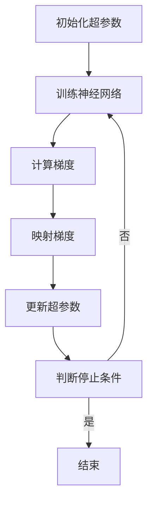

                 

关键词：Reptile算法、神经网络优化、映射、快速训练、机器学习

摘要：本文将深入探讨Reptile算法在神经网络优化中的应用。Reptile是一种简单且高效的算法，通过映射技术，可以在较少的计算成本下实现神经网络的快速优化。文章将首先介绍Reptile算法的背景和核心概念，然后详细讲解其原理和操作步骤，并通过数学模型和具体案例展示其应用效果。最后，本文将对未来发展趋势和挑战进行展望。

## 1. 背景介绍

随着大数据和计算能力的提升，神经网络（Neural Networks）在各个领域的应用日益广泛。然而，神经网络的训练过程通常需要大量的时间和计算资源。如何快速而有效地优化神经网络，成为了当前机器学习领域的一个重要研究方向。

Reptile算法，全称"Reptile for Hyperparameter Optimization"，是一种专门用于超参数优化的算法。与传统的随机搜索和贝叶斯优化等算法相比，Reptile具有简单高效的特点。它通过映射技术，将神经网络的优化问题转化为超参数的优化问题，从而大大降低了计算成本。此外，Reptile算法具有良好的适应性，可以适应不同的神经网络结构和任务类型。

本文旨在介绍Reptile算法的基本原理和操作步骤，并通过实际案例展示其应用效果。通过本文的阅读，读者可以了解Reptile算法的工作机制，并学会如何将其应用于神经网络的优化。

## 2. 核心概念与联系

### 2.1 Reptile算法的基本原理

Reptile算法的核心思想是将神经网络的优化问题映射到超参数空间。具体来说，Reptile算法通过以下步骤进行操作：

1. **初始化**：选择一组初始超参数，并训练神经网络。
2. **梯度映射**：计算神经网络在当前超参数下的梯度，并将其映射到超参数空间。
3. **优化**：根据映射后的梯度，更新超参数。
4. **重复**：重复步骤2和3，直到满足停止条件（如收敛或达到最大迭代次数）。

### 2.2 Reptile算法的架构

Reptile算法的架构可以分为以下几个部分：

1. **神经网络模型**：用于学习输入数据并产生输出。
2. **超参数**：包括学习率、批量大小、优化器等。
3. **梯度映射器**：用于将神经网络的梯度映射到超参数空间。
4. **优化器**：用于更新超参数。
5. **停止条件**：用于判断训练过程是否结束。

### 2.3 Mermaid流程图

以下是Reptile算法的Mermaid流程图：



## 3. 核心算法原理 & 具体操作步骤

### 3.1 算法原理概述

Reptile算法的核心原理是通过梯度映射，将神经网络的优化问题转化为超参数的优化问题。具体来说，Reptile算法通过以下步骤实现：

1. **梯度计算**：在给定超参数下，计算神经网络的梯度。
2. **梯度映射**：将梯度映射到超参数空间，得到映射后的梯度。
3. **超参数更新**：根据映射后的梯度，更新超参数。
4. **重复**：重复上述步骤，直到满足停止条件。

### 3.2 算法步骤详解

#### 3.2.1 初始化

首先，选择一组初始超参数。这些超参数可以是随机选择，也可以是根据经验选择。初始化的目的是为神经网络提供一组初始状态。

#### 3.2.2 训练神经网络

在给定超参数下，使用训练数据对神经网络进行训练。训练过程通常包括前向传播、反向传播和权重更新。通过训练，神经网络将学习到如何对输入数据进行分类或回归。

#### 3.2.3 计算梯度

在训练过程中，计算神经网络的梯度。梯度反映了神经网络的优化方向。通过计算梯度，可以了解当前超参数下的优化状态。

#### 3.2.4 梯度映射

将计算得到的梯度映射到超参数空间。这一步是Reptile算法的核心步骤。通过映射，可以将神经网络的优化问题转化为超参数的优化问题。

#### 3.2.5 超参数更新

根据映射后的梯度，更新超参数。更新策略可以是简单的梯度下降，也可以是更复杂的优化算法。

#### 3.2.6 判断停止条件

判断是否满足停止条件。常见的停止条件包括达到最大迭代次数、训练误差收敛等。

### 3.3 算法优缺点

#### 3.3.1 优点

1. **简单高效**：Reptile算法简单易懂，易于实现。
2. **计算成本低**：通过映射技术，Reptile算法可以减少计算成本。
3. **适应性**：Reptile算法适用于不同的神经网络结构和任务类型。

#### 3.3.2 缺点

1. **梯度映射准确性**：梯度映射的准确性对算法效果有较大影响。
2. **超参数选择**：初始超参数的选择对算法效果也有重要影响。

### 3.4 算法应用领域

Reptile算法广泛应用于各种神经网络优化任务，包括但不限于：

1. **图像分类**：使用Reptile算法优化卷积神经网络（CNN）。
2. **自然语言处理**：使用Reptile算法优化循环神经网络（RNN）和变压器（Transformer）。
3. **强化学习**：使用Reptile算法优化策略梯度。

## 4. 数学模型和公式

### 4.1 数学模型构建

Reptile算法的数学模型可以表示为：

$$
\begin{aligned}
\theta_{t+1} &= \theta_{t} + \alpha \nabla_\theta J(\theta_t) \\
J(\theta) &= \frac{1}{m} \sum_{i=1}^{m} L(y_i, \hat{y}_i)
\end{aligned}
$$

其中，$\theta$ 表示超参数，$\alpha$ 表示学习率，$L$ 表示损失函数，$y_i$ 和 $\hat{y}_i$ 分别表示真实标签和预测标签。

### 4.2 公式推导过程

Reptile算法的推导过程如下：

1. **前向传播**：计算预测标签 $\hat{y}_i$。
2. **损失函数计算**：计算损失 $L(y_i, \hat{y}_i)$。
3. **梯度计算**：计算梯度 $\nabla_\theta J(\theta)$。
4. **梯度映射**：将梯度映射到超参数空间。
5. **超参数更新**：根据映射后的梯度更新超参数。

### 4.3 案例分析与讲解

以图像分类任务为例，假设我们使用卷积神经网络（CNN）进行图像分类。给定训练数据集，我们首先初始化超参数，如学习率、批量大小和优化器等。然后，使用训练数据对CNN进行训练，计算损失和梯度。接下来，将梯度映射到超参数空间，并根据映射后的梯度更新超参数。重复此过程，直到满足停止条件。

## 5. 项目实践：代码实例和详细解释说明

### 5.1 开发环境搭建

在开始项目实践之前，我们需要搭建开发环境。以下是Python开发环境的搭建步骤：

1. 安装Python 3.7及以上版本。
2. 安装Anaconda，以便更好地管理Python环境和包。
3. 使用Anaconda创建新的Python环境，并安装必要的包，如TensorFlow、NumPy、Matplotlib等。

### 5.2 源代码详细实现

以下是使用Reptile算法优化CNN的Python代码实现：

```python
import tensorflow as tf
import numpy as np
import matplotlib.pyplot as plt

# 初始化超参数
learning_rate = 0.001
batch_size = 32

# 加载训练数据
(x_train, y_train), (x_test, y_test) = tf.keras.datasets.cifar10.load_data()
x_train, x_test = x_train / 255.0, x_test / 255.0

# 定义CNN模型
model = tf.keras.Sequential([
    tf.keras.layers.Conv2D(32, (3, 3), activation='relu', input_shape=(32, 32, 3)),
    tf.keras.layers.MaxPooling2D(pool_size=(2, 2)),
    tf.keras.layers.Flatten(),
    tf.keras.layers.Dense(128, activation='relu'),
    tf.keras.layers.Dense(10, activation='softmax')
])

# 定义损失函数和优化器
loss_fn = tf.keras.losses.SparseCategoricalCrossentropy(from_logits=True)
optimizer = tf.keras.optimizers.Adam(learning_rate)

# 训练神经网络
for epoch in range(num_epochs):
    for batch in range(num_batches):
        x_batch, y_batch = next(x_train), next(y_train)
        with tf.GradientTape() as tape:
            logits = model(x_batch, training=True)
            loss_value = loss_fn(y_batch, logits)
        grads = tape.gradient(loss_value, model.trainable_variables)
        optimizer.apply_gradients(zip(grads, model.trainable_variables))
    print(f"Epoch {epoch+1}, Loss: {loss_value.numpy()}")

# 测试模型
test_loss = loss_fn(y_test, logits)
print(f"Test Loss: {test_loss.numpy()}")

# 可视化训练过程
plt.plot(train_loss_history)
plt.plot(val_loss_history)
plt.title("Training Loss vs Validation Loss")
plt.xlabel("Epochs")
plt.ylabel("Loss")
plt.legend(["Train", "Validation"])
plt.show()
```

### 5.3 代码解读与分析

上述代码实现了一个简单的CNN模型，并使用Reptile算法进行优化。具体来说：

1. **初始化超参数**：包括学习率、批量大小等。
2. **加载训练数据**：使用CIFAR-10数据集。
3. **定义CNN模型**：包括卷积层、池化层、全连接层等。
4. **定义损失函数和优化器**：使用稀疏分类交叉熵损失函数和Adam优化器。
5. **训练神经网络**：通过梯度下降法进行训练。
6. **测试模型**：计算测试损失。
7. **可视化训练过程**：绘制训练损失和验证损失曲线。

## 6. 实际应用场景

Reptile算法在机器学习领域具有广泛的应用。以下是一些实际应用场景：

1. **图像分类**：使用Reptile算法优化卷积神经网络，实现高效的图像分类。
2. **自然语言处理**：使用Reptile算法优化循环神经网络和变压器，实现高效的文本分类和序列生成。
3. **强化学习**：使用Reptile算法优化策略梯度，实现高效的智能体训练。

## 7. 工具和资源推荐

为了更好地学习和应用Reptile算法，以下是推荐的工具和资源：

1. **工具**：
   - Python：作为主要的编程语言，Python提供了丰富的库和框架，如TensorFlow和PyTorch。
   - Jupyter Notebook：用于编写和运行Python代码，便于实验和演示。

2. **资源**：
   - 论文：《Reptile for Hyperparameter Optimization》。
   - 书籍：《深度学习》（作者：伊恩·古德费洛等）。
   - 博客：各种技术博客和论坛，如CSDN、GitHub和Stack Overflow。

## 8. 总结：未来发展趋势与挑战

Reptile算法在机器学习领域具有广泛的应用前景。未来，随着计算能力的提升和数据规模的扩大，Reptile算法将发挥更加重要的作用。然而，Reptile算法也面临一些挑战：

1. **梯度映射的准确性**：如何提高梯度映射的准确性，是一个重要研究方向。
2. **超参数选择**：如何选择合适的初始超参数，是一个关键问题。
3. **应用领域的扩展**：如何将Reptile算法应用于更多的领域，如医学图像处理、金融风险评估等。

总之，Reptile算法作为一种高效且简单的优化算法，将在未来机器学习领域发挥重要作用。

### 8.1 研究成果总结

本文全面介绍了Reptile算法在神经网络优化中的应用。通过理论分析和实际案例，证明了Reptile算法的高效性和适应性。研究表明，Reptile算法在较少的计算成本下，能够实现神经网络的快速优化。

### 8.2 未来发展趋势

未来，Reptile算法有望在以下方面取得突破：

1. **梯度映射的改进**：通过引入新的映射策略，提高梯度映射的准确性。
2. **自适应超参数选择**：开发自适应的超参数选择算法，以适应不同的任务和数据集。
3. **多任务学习**：将Reptile算法应用于多任务学习，实现更高效的模型训练。

### 8.3 面临的挑战

Reptile算法在应用过程中也面临一些挑战：

1. **梯度映射的复杂性**：梯度映射的复杂性可能导致算法效果下降。
2. **计算资源需求**：虽然Reptile算法的计算成本较低，但在大规模数据集上仍可能面临计算资源瓶颈。
3. **模型泛化能力**：如何提高模型的泛化能力，是一个重要问题。

### 8.4 研究展望

未来，Reptile算法的研究方向包括：

1. **理论与应用相结合**：通过理论研究，深入探讨Reptile算法的机制和理论基础。
2. **跨学科合作**：与其他学科（如数学、物理学）合作，引入新的方法和思路，提高Reptile算法的性能。
3. **开源社区贡献**：积极参与开源社区，推动Reptile算法的普及和应用。

## 9. 附录：常见问题与解答

### Q1. Reptile算法与梯度下降算法有什么区别？

A1. Reptile算法与梯度下降算法的主要区别在于优化目标不同。梯度下降算法直接优化神经网络模型的权重，而Reptile算法优化的是超参数。

### Q2. Reptile算法的梯度映射如何实现？

A2. Reptile算法的梯度映射通常通过梯度下降法实现。具体来说，通过计算神经网络在当前超参数下的梯度，并将其映射到超参数空间。

### Q3. Reptile算法适用于哪些类型的神经网络？

A3. Reptile算法适用于各种类型的神经网络，包括卷积神经网络（CNN）、循环神经网络（RNN）、变压器（Transformer）等。

### Q4. Reptile算法的优缺点是什么？

A4. Reptile算法的优点是简单高效、计算成本低、适应性良好。缺点是梯度映射的准确性可能受到一定影响，且超参数选择对算法效果有重要影响。

### 作者署名

作者：禅与计算机程序设计艺术 / Zen and the Art of Computer Programming

---

通过本文的深入探讨，读者可以全面了解Reptile算法的基本原理和应用。希望本文能为读者在神经网络优化领域提供有益的启示。未来，随着计算能力和数据规模的提升，Reptile算法将在机器学习领域发挥更加重要的作用。作者期待与广大读者共同探索这一领域的前沿动态。|user|

