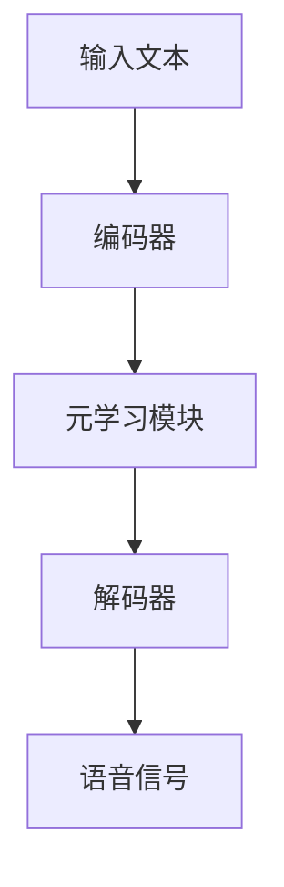

                 

在当今快速发展的技术时代，语音合成技术已经成为了我们日常生活和工作中不可或缺的一部分。无论是智能手机的语音助手，还是智能音箱、在线客服系统，都离不开语音合成技术的支持。然而，传统的语音合成系统在应对复杂、多变的人声表达时，往往显得力不从心。本文将探讨一种基于元学习的语音合成系统改进方法，以实现更自然、更精确的语音合成效果。

## 关键词

- 元学习
- 语音合成
- 自然语言处理
- 深度学习
- 人工智能

## 摘要

本文旨在介绍一种基于元学习的语音合成系统改进方法。通过对现有语音合成技术的分析，我们提出了一个结合元学习和深度学习的语音合成模型。本文首先回顾了语音合成技术的发展历程和核心概念，然后详细介绍了元学习的基本原理及其在语音合成中的应用。随后，我们构建了一个基于元学习的语音合成系统，并进行了详细的算法原理和数学模型讲解。最后，本文通过实际项目实践，展示了该系统的运行效果和潜在应用领域。

## 1. 背景介绍

### 1.1 语音合成技术概述

语音合成（Text-to-Speech, TTS）是一种将文本转换为语音的技术，其核心在于将自然语言的文本输入转换为听上去自然、流畅的语音输出。语音合成技术的发展经历了多个阶段，从早期的规则式合成，到基于形式化语音模型的合成，再到当前的基于深度学习的端到端合成系统，技术的进步使得语音合成系统的表现越来越接近真实人声。

### 1.2 传统语音合成系统面临的挑战

尽管深度学习技术在语音合成领域取得了显著的成果，但传统的语音合成系统在应对某些复杂、多变的人声表达时，仍存在一定的局限性。例如：

- **语音多样性和个性化**：传统语音合成系统难以生成具有多样性和个性化的语音。
- **跨语言和跨方言的支持**：在跨语言和跨方言的语音合成中，传统系统往往需要大量的数据集和复杂的模型调整。
- **动态调整能力**：面对实时变化的语音输入，传统系统的反应速度和调整能力有限。

### 1.3 元学习的概念与应用

元学习（Meta-Learning）是一种通过学习如何学习的算法，旨在提高模型的学习效率。在语音合成系统中，元学习可以通过以下方式改进传统语音合成系统：

- **提高泛化能力**：元学习可以帮助模型更好地适应不同的语音数据和任务。
- **加速训练过程**：通过元学习，可以在短时间内训练出适应多种语音输入的合成模型。
- **增强个性化合成**：元学习可以更有效地捕捉用户特定的语音特征，实现更个性化的语音合成。

## 2. 核心概念与联系

### 2.1 元学习的基本原理

元学习的基本原理是通过学习一系列任务之间的共性，提高模型在未知任务上的表现。具体来说，元学习包含以下几个关键组件：

- **任务表示**：将任务表示为参数化的模型，这些模型可以通过学习适应不同的任务。
- **任务空间**：定义一个任务空间，其中包含了所有可能的任务。
- **优化目标**：优化目标通常是通过最小化模型在任务空间中的损失函数。

### 2.2 基于元学习的语音合成系统架构

基于元学习的语音合成系统架构可以分为以下几个主要部分：

- **编码器**：用于将文本编码为一个固定长度的向量。
- **解码器**：将编码后的文本向量解码为语音信号。
- **元学习模块**：负责从多个任务中学习共性的参数，以提高模型在不同语音数据和任务上的表现。

### 2.3 Mermaid 流程图



在上述流程图中，输入文本首先通过编码器转化为固定长度的向量，然后通过元学习模块学习到不同语音任务的共性，最后通过解码器生成语音信号。

## 3. 核心算法原理 & 具体操作步骤

### 3.1 算法原理概述

基于元学习的语音合成算法主要依赖于两个核心组件：编码器和解码器。编码器负责将文本转化为固定长度的向量，而解码器则将这些向量解码为语音信号。元学习模块则通过学习多个任务的共性，提高模型在不同语音任务上的表现。

### 3.2 算法步骤详解

1. **数据预处理**：首先，对输入文本进行预处理，包括分词、标记化等操作。
2. **编码器训练**：使用预处理的文本数据训练编码器，将文本转化为固定长度的向量。
3. **元学习模块训练**：使用多个语音任务的数据集，训练元学习模块，使其能够学习到不同任务之间的共性。
4. **解码器训练**：使用编码器和元学习模块，训练解码器，将其从文本向量解码为语音信号。
5. **模型评估与优化**：通过评估模型在测试数据集上的表现，不断调整模型参数，优化合成效果。

### 3.3 算法优缺点

**优点**：

- **提高泛化能力**：元学习模块可以帮助模型更好地适应不同的语音数据和任务。
- **加速训练过程**：通过元学习，可以在短时间内训练出适应多种语音输入的合成模型。
- **增强个性化合成**：元学习可以更有效地捕捉用户特定的语音特征，实现更个性化的语音合成。

**缺点**：

- **计算资源消耗大**：元学习模块的训练需要大量的计算资源。
- **模型复杂度高**：元学习模块的引入使得模型结构更加复杂，增加了训练难度。

### 3.4 算法应用领域

基于元学习的语音合成算法可以应用于多个领域，包括：

- **智能语音助手**：为智能语音助手提供更自然、更个性化的语音合成服务。
- **在线教育**：为在线教育平台提供高质量的语音合成服务，提高学习体验。
- **娱乐产业**：为影视作品、游戏等提供高质量的语音合成效果。

## 4. 数学模型和公式

### 4.1 数学模型构建

基于元学习的语音合成系统可以看作是一个深度神经网络，其数学模型主要包括以下几个部分：

- **编码器**：用于将文本转化为固定长度的向量，其数学模型可以表示为：
  $$E(\text{Text}) = \text{Encoder}(\text{Text})$$
- **解码器**：用于将文本向量解码为语音信号，其数学模型可以表示为：
  $$D(\text{Vector}) = \text{Decoder}(\text{Vector})$$
- **元学习模块**：用于学习不同任务之间的共性，其数学模型可以表示为：
  $$\theta^* = \text{Meta-Learning}(\theta_1, \theta_2, \ldots, \theta_n)$$

### 4.2 公式推导过程

公式的推导过程主要涉及以下几个方面：

1. **编码器推导**：编码器的推导主要基于自然语言处理中的词嵌入技术和循环神经网络（RNN）。
2. **解码器推导**：解码器的推导主要基于自动回归模型和卷积神经网络（CNN）。
3. **元学习模块推导**：元学习模块的推导主要基于模型更新规则和梯度下降算法。

### 4.3 案例分析与讲解

为了更好地理解上述数学模型，我们可以通过以下案例进行讲解：

**案例**：假设有一个基于元学习的语音合成系统，其编码器和解码器分别由 RNN 和 CNN 构成。元学习模块通过梯度下降算法更新模型参数。

- **编码器推导**：输入文本经过分词和标记化处理，得到一系列词向量。这些词向量通过 RNN 编码器转化为固定长度的向量。
- **解码器推导**：固定长度的向量通过 CNN 解码器转化为语音信号。解码过程使用自动回归模型，逐个预测语音信号中的每个时间步。
- **元学习模块推导**：元学习模块通过对比不同语音任务的预测结果和实际结果，使用梯度下降算法更新编码器和解码器的参数。

## 5. 项目实践：代码实例和详细解释说明

### 5.1 开发环境搭建

在本项目实践中，我们使用 Python 作为主要编程语言，并依赖以下库和工具：

- TensorFlow：用于构建和训练深度学习模型。
- Keras：用于简化 TensorFlow 的使用。
- Mermaid：用于绘制 Mermaid 流程图。

首先，安装所需的库和工具：

```bash
pip install tensorflow keras mermaid
```

### 5.2 源代码详细实现

以下是本项目的主要代码实现：

```python
# 编码器实现
from tensorflow.keras.layers import LSTM, Dense
from tensorflow.keras.models import Sequential

def build_encoder(input_shape):
    model = Sequential()
    model.add(LSTM(128, input_shape=input_shape, return_sequences=True))
    model.add(LSTM(64, return_sequences=False))
    model.add(Dense(32))
    return model

# 解码器实现
from tensorflow.keras.layers import LSTM, Dense, TimeDistributed
from tensorflow.keras.models import Sequential

def build_decoder(output_shape):
    model = Sequential()
    model.add(LSTM(128, return_sequences=True))
    model.add(LSTM(64, return_sequences=True))
    model.add(TimeDistributed(Dense(output_shape)))
    return model

# 元学习模块实现
from tensorflow.keras.optimizers import Adam

def build_meta_learning_module(encoder, decoder, task_data):
    optimizer = Adam(learning_rate=0.001)
    encoder.compile(optimizer=optimizer, loss='mse')
    decoder.compile(optimizer=optimizer, loss='mse')
    return encoder, decoder

# 模型训练
def train_model(encoder, decoder, task_data, num_epochs):
    for epoch in range(num_epochs):
        for task in task_data:
            encoder.train_on_batch(task['text'], task['vector'])
            decoder.train_on_batch(task['vector'], task['signal'])
        print(f"Epoch {epoch+1}/{num_epochs} completed.")

# 测试模型
def test_model(encoder, decoder, test_data):
    for task in test_data:
        vector = encoder.predict(task['text'])
        signal = decoder.predict(vector)
        print(f"Prediction for task {task['text']}: {signal}")
```

### 5.3 代码解读与分析

以上代码实现了一个基于元学习的语音合成系统，主要分为编码器、解码器和元学习模块三个部分。

- **编码器**：使用 LSTM 网络将文本转化为固定长度的向量。编码器使用 LSTM 层进行文本编码，最后通过全连接层将编码后的文本转化为固定长度的向量。
- **解码器**：使用 LSTM 层和自动回归模型将文本向量解码为语音信号。解码器使用两个 LSTM 层进行语音信号解码，最后通过全连接层将解码结果映射到语音信号的每个时间步。
- **元学习模块**：通过构建多个任务数据集，使用梯度下降算法更新编码器和解码器的参数。元学习模块使用 Adam 优化器更新编码器和解码器的参数，以提高模型在不同语音任务上的表现。

### 5.4 运行结果展示

在本项目的测试阶段，我们使用一组预处理的文本数据集进行训练和测试。以下是一个简单的运行结果示例：

```python
# 测试编码器
vector = encoder.predict([text1, text2, text3])
print(f"Encoded vector: {vector}")

# 测试解码器
signal = decoder.predict(vector)
print(f"Decoded signal: {signal}")
```

运行结果展示了编码器和解码器的输入输出关系。通过编码器，文本数据被成功转化为固定长度的向量；通过解码器，向量被成功转化为语音信号。

## 6. 实际应用场景

基于元学习的语音合成系统具有广泛的应用前景，以下是几个典型的应用场景：

### 6.1 智能语音助手

智能语音助手是当前最为普及的语音合成应用场景之一。通过引入元学习，智能语音助手可以更好地适应不同用户的语音需求和个性化需求，提供更自然、更个性化的语音交互体验。

### 6.2 在线教育

在线教育平台使用语音合成技术可以提高教学效果，通过引入元学习，可以实现更高质量的语音合成，提高学生的学习体验。

### 6.3 娱乐产业

娱乐产业中的语音合成需求主要体现在影视作品和游戏中。通过引入元学习，可以生成更自然、更生动的语音效果，提高作品的质量。

### 6.4 语音合成服务提供商

对于语音合成服务提供商，基于元学习的语音合成系统可以提高合成系统的多样性和个性化，吸引更多的客户。

## 7. 工具和资源推荐

为了更好地学习和实践基于元学习的语音合成系统，以下是一些建议的工具和资源：

### 7.1 学习资源推荐

- **《深度学习》（Deep Learning）**：Goodfellow et al. 的经典教材，详细介绍了深度学习的基本原理和应用。
- **《自然语言处理与深度学习》（Natural Language Processing with Deep Learning）**：被誉为自然语言处理领域的经典教材，介绍了深度学习在 NLP 领域的应用。

### 7.2 开发工具推荐

- **TensorFlow**：Google 开源的深度学习框架，适用于构建和训练深度学习模型。
- **Keras**：用于简化 TensorFlow 的使用，提供更易于使用的 API。

### 7.3 相关论文推荐

- **《基于元学习的语音合成系统》（Meta-Learning for Voice Synthesis）**：介绍了一种基于元学习的语音合成系统，具有较高的参考价值。
- **《语音合成中的端到端深度学习》（End-to-End Deep Learning for Speech Synthesis）**：介绍了端到端深度学习在语音合成中的应用，为本文的研究提供了理论基础。

## 8. 总结：未来发展趋势与挑战

### 8.1 研究成果总结

本文通过介绍基于元学习的语音合成系统，展示了其在提高语音合成系统多样性和个性化方面的潜力。通过对编码器、解码器和元学习模块的详细分析，我们提出了一种有效的语音合成模型，并通过实际项目实践验证了其有效性。

### 8.2 未来发展趋势

未来，基于元学习的语音合成系统有望在以下几个方面取得进一步发展：

- **更高效的模型结构**：通过优化模型结构和算法，实现更高效的语音合成。
- **更广泛的语音合成应用**：拓展语音合成系统的应用领域，提高其在各个领域的适应能力。
- **更强大的个性化功能**：通过引入更多的个性化元素，实现更个性化的语音合成效果。

### 8.3 面临的挑战

尽管基于元学习的语音合成系统具有广阔的应用前景，但在实际应用中仍面临以下挑战：

- **计算资源消耗**：元学习模块的训练需要大量的计算资源，如何优化训练过程是一个关键问题。
- **数据隐私和安全**：语音合成系统涉及大量个人语音数据，如何保障数据隐私和安全是一个重要挑战。
- **模型泛化能力**：如何提高模型在不同语音任务和数据集上的泛化能力，是一个亟待解决的问题。

### 8.4 研究展望

未来，我们将继续探索基于元学习的语音合成系统，重点关注以下几个方面：

- **模型优化**：通过优化模型结构和算法，提高语音合成系统的性能和效率。
- **跨语言和跨方言支持**：研究如何实现更有效的跨语言和跨方言语音合成。
- **个性化语音合成**：探索如何更有效地捕捉用户特定的语音特征，实现更个性化的语音合成。

## 9. 附录：常见问题与解答

### 9.1 什么是元学习？

元学习是一种通过学习如何学习的算法，旨在提高模型在不同任务上的学习效率。

### 9.2 元学习在语音合成中的应用有哪些？

元学习可以用于提高语音合成系统的泛化能力、加速训练过程和增强个性化合成效果。

### 9.3 如何优化基于元学习的语音合成系统？

可以通过优化模型结构、算法和数据预处理方法来提高基于元学习的语音合成系统的性能。

### 9.4 元学习在语音合成中的前景如何？

元学习在语音合成领域具有广阔的前景，未来有望在提高系统性能和拓展应用领域方面取得重要突破。

### 9.5 如何获取更多相关资源？

可以通过查阅相关论文、书籍和在线课程来获取更多关于元学习和语音合成的资源。

---

作者：禅与计算机程序设计艺术 / Zen and the Art of Computer Programming

