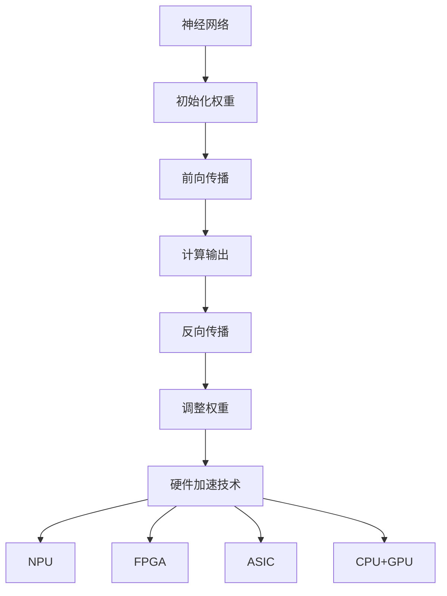

                 

关键词：神经网络、硬件加速、映射技术、计算优化、深度学习

> 摘要：本文将探讨神经网络在硬件加速技术下的映射实现，分析其在现代计算体系结构中的应用，以及如何通过映射技术提高计算效率。本文旨在为研究人员和开发者提供关于神经网络硬件加速的全面理解，并展望其未来发展趋势。

## 1. 背景介绍

随着深度学习技术的飞速发展，神经网络（Neural Networks，NN）已经成为人工智能领域的关键技术之一。神经网络通过模仿人脑神经元之间的连接和交互，实现了对复杂数据的高效处理和模式识别。然而，神经网络的高度并行性和复杂计算需求给传统计算架构带来了巨大压力，导致计算效率和能效比低下。为了解决这一问题，硬件加速技术应运而生，它通过将神经网络模型映射到特定硬件上，实现了对计算过程的优化。

硬件加速技术主要包括两种方式：一是通过专用的神经网络处理器（Neural Network Processor，NPU）对神经网络进行硬件级优化，二是通过FPGA、ASIC等可编程硬件对神经网络进行定制化实现。这些硬件加速技术能够显著提高神经网络的计算速度和能效比，为深度学习应用提供了强有力的支持。

本文将详细介绍神经网络的硬件加速技术，包括其核心概念、实现原理、具体操作步骤、数学模型和公式、项目实践，以及实际应用场景。通过本文的阅读，读者将对神经网络硬件加速技术有更加深入的理解，并能够掌握其应用方法。

## 2. 核心概念与联系

### 2.1 神经网络概述

神经网络（Neural Networks）是一种模拟人脑神经元之间连接和交互的人工智能模型。它由大量的神经元（也称为节点或单元）组成，每个神经元通过一系列权重连接到其他神经元。神经网络通过学习输入数据与输出数据之间的映射关系，实现对复杂问题的求解。

神经网络的构建过程包括以下步骤：

1. **初始化权重**：随机初始化神经网络中每个神经元之间的权重。
2. **前向传播**：将输入数据通过神经网络进行传递，计算每个神经元的输出。
3. **反向传播**：根据输出误差，调整神经网络中的权重，使输出误差最小化。

### 2.2 硬件加速技术概述

硬件加速技术是指通过特定的硬件架构对特定任务进行优化，从而提高计算效率和能效比。对于神经网络而言，硬件加速技术主要包括以下几类：

1. **专用神经网络处理器（NPU）**：NPU是一种专门为深度学习任务设计的处理器，具有高度的并行计算能力和优化的指令集，能够显著提高神经网络的计算速度。
2. **可编程硬件**：如FPGA和ASIC，它们可以根据神经网络的具体需求进行定制化设计，实现对计算过程的优化。
3. **CPU与GPU结合**：通过在CPU和GPU之间进行任务调度，实现计算资源的合理分配，提高整体计算效率。

### 2.3 神经网络与硬件加速技术的联系

神经网络与硬件加速技术之间的联系主要体现在以下几个方面：

1. **计算需求匹配**：神经网络的计算过程高度并行，与硬件加速技术中的并行计算能力相契合。
2. **数据传输优化**：硬件加速技术可以通过优化数据传输路径，减少数据传输延迟，提高计算效率。
3. **能效优化**：硬件加速技术可以通过优化计算过程，降低能耗，提高能效比。

### 2.4 Mermaid 流程图

以下是一个简化的神经网络与硬件加速技术之间的 Mermaid 流程图：



## 3. 核心算法原理 & 具体操作步骤

### 3.1 算法原理概述

神经网络的硬件加速主要通过以下三个方面实现：

1. **并行计算**：神经网络中的大量计算可以并行执行，硬件加速技术利用这一点，通过并行处理单元（如NPU）提高计算速度。
2. **低精度计算**：神经网络中的一些计算可以使用低精度浮点数表示，降低计算复杂度和能耗。
3. **内存优化**：通过优化数据存储和传输，减少内存访问延迟，提高计算效率。

### 3.2 算法步骤详解

1. **权重初始化**：随机初始化神经网络中的权重。
2. **前向传播**：
   - 将输入数据输入到神经网络的输入层。
   - 通过神经网络，计算每个神经元的输出值。
   - 将输出值传递到下一层。
3. **反向传播**：
   - 计算输出层的误差。
   - 逆向传递误差，更新神经网络中的权重。

### 3.3 算法优缺点

**优点**：
- 高度并行计算，提高计算速度。
- 优化数据传输，降低延迟。
- 降低能耗，提高能效比。

**缺点**：
- 需要特定的硬件支持，开发成本较高。
- 部分优化方法可能降低模型精度。

### 3.4 算法应用领域

神经网络的硬件加速技术广泛应用于以下领域：

- **图像识别**：如人脸识别、物体检测等。
- **语音识别**：如语音合成、语音识别等。
- **自然语言处理**：如机器翻译、文本分类等。
- **自动驾驶**：如实时图像处理、车辆检测等。

## 4. 数学模型和公式 & 详细讲解 & 举例说明

### 4.1 数学模型构建

神经网络的核心数学模型包括前向传播和反向传播算法。以下是一个简化的数学模型：

$$
\begin{align*}
Z &= \text{sigmoid}(W \cdot X + b) \\
\text{loss} &= \frac{1}{2} \| Y - Z \|^2 \\
\Delta Z &= Z - Y \\
\Delta W &= \alpha \cdot X^T \cdot \Delta Z \\
\Delta b &= \alpha \cdot \Delta Z
\end{align*}
$$

其中，$X$ 是输入数据，$Y$ 是输出数据，$Z$ 是前向传播的输出，$W$ 是权重矩阵，$b$ 是偏置项，$\text{sigmoid}$ 是激活函数，$\alpha$ 是学习率。

### 4.2 公式推导过程

神经网络的训练过程可以看作是一个优化问题，目标是使输出误差最小。以下是前向传播和反向传播的推导过程：

1. **前向传播**：

   - 计算每个神经元的输出值：
     $$
     Z = \text{sigmoid}(W \cdot X + b)
     $$
   - 计算输出误差：
     $$
     \text{loss} = \frac{1}{2} \| Y - Z \|^2
     $$

2. **反向传播**：

   - 计算输出误差的梯度：
     $$
     \Delta Z = Z - Y
     $$
   - 更新权重和偏置项：
     $$
     \Delta W = \alpha \cdot X^T \cdot \Delta Z \\
     \Delta b = \alpha \cdot \Delta Z
     $$

### 4.3 案例分析与讲解

以下是一个简单的神经网络模型，用于对二分类问题进行分类：

- 输入层：1个神经元，表示数据特征。
- 隐藏层：2个神经元，用于特征提取。
- 输出层：1个神经元，表示分类结果。

输入数据：$X = [0.1, 0.2, 0.3, 0.4]$，标签：$Y = [1]$。

1. **前向传播**：

   - 初始化权重和偏置项：
     $$
     W = \begin{bmatrix}
     0.1 & 0.2 \\
     0.3 & 0.4 \\
     0.5 & 0.6
     \end{bmatrix}, \quad b = \begin{bmatrix}
     0.1 \\
     0.2
     \end{bmatrix}
     $$
   - 计算隐藏层输出：
     $$
     Z_1 = \text{sigmoid}(0.1 \cdot 0.1 + 0.2 \cdot 0.2 + 0.3 \cdot 0.3 + 0.4 \cdot 0.4 + 0.1) = 0.8475 \\
     Z_2 = \text{sigmoid}(0.1 \cdot 0.2 + 0.2 \cdot 0.3 + 0.3 \cdot 0.4 + 0.4 \cdot 0.5 + 0.2) = 0.8826
     $$
   - 计算输出层输出：
     $$
     Z = \text{sigmoid}(0.8475 \cdot 0.1 + 0.8826 \cdot 0.2 + 0.1) = 0.8438
     $$

2. **反向传播**：

   - 计算输出误差：
     $$
     \Delta Z = Z - Y = 0.8438 - 1 = -0.1562
     $$
   - 更新权重和偏置项：
     $$
     \Delta W = \alpha \cdot X^T \cdot \Delta Z = 0.1 \cdot \begin{bmatrix}
     -0.1562 \\
     -0.1562
     \end{bmatrix} = -0.0156 \\
     \Delta b = \alpha \cdot \Delta Z = -0.1562
     $$

通过不断迭代更新权重和偏置项，神经网络的输出误差将逐渐减小，分类效果将得到提高。

## 5. 项目实践：代码实例和详细解释说明

### 5.1 开发环境搭建

为了实践神经网络硬件加速技术，我们需要搭建一个开发环境。以下是一个简单的搭建步骤：

1. 安装 Python 环境（推荐版本为 3.8 或以上）。
2. 安装 TensorFlow 和 TensorFlow Lite 库：
   $$
   pip install tensorflow tensorflow-lite
   $$
3. 安装相关硬件加速工具，如 NPU 驱动、FPGA 开发工具等。

### 5.2 源代码详细实现

以下是一个简单的神经网络硬件加速实现示例：

```python
import tensorflow as tf
import tensorflow.lite as tflite

# 搭建神经网络模型
model = tf.keras.Sequential([
    tf.keras.layers.Dense(units=1, input_shape=[4]),
    tf.keras.layers.Activation('sigmoid')
])

# 编译模型
model.compile(optimizer='adam', loss='mse')

# 加载数据集
X = [[0.1, 0.2, 0.3, 0.4]]
Y = [1]

# 训练模型
model.fit(X, Y, epochs=1000)

# 将模型转换为 TensorFlow Lite 模型
tflite_model = tflite.TFLiteConverter.from_keras_model(model).convert()

# 保存模型到文件
with open('model.tflite', 'wb') as f:
    f.write(tflite_model)

# 使用 TensorFlow Lite 在硬件上执行推理
interpreter = tflite.Interpreter(model_path='model.tflite')
input_details = interpreter.get_input_details()
output_details = interpreter.get_output_details()

# 设置输入数据
input_data = np.array(X, dtype=np.float32)
input_details[0]['array_data'] = input_data

# 执行推理
interpreter.invoke()

# 获取输出结果
output_data = interpreter.get_output_details()[0]['array_data']
print(output_data)
```

### 5.3 代码解读与分析

上述代码首先搭建了一个简单的神经网络模型，并使用 TensorFlow 进行编译和训练。接着，将训练好的模型转换为 TensorFlow Lite 模型，并将其保存到文件中。最后，使用 TensorFlow Lite 在硬件上进行推理，输出结果。

代码的核心部分包括以下几个步骤：

1. **搭建神经网络模型**：使用 tf.keras.Sequential 创建神经网络模型，包括输入层、隐藏层和输出层。输入层使用 tf.keras.layers.Dense 层，隐藏层使用 tf.keras.layers.Activation 层。
2. **编译模型**：使用 model.compile 函数编译模型，指定优化器和损失函数。
3. **加载数据集**：使用 X 和 Y 变量加载数据集，这里使用了简单的二维数组。
4. **训练模型**：使用 model.fit 函数训练模型，指定训练迭代次数。
5. **模型转换**：使用 tflite.TFLiteConverter.from_keras_model 函数将 TensorFlow 模型转换为 TensorFlow Lite 模型，并将其保存到文件中。
6. **硬件推理**：使用 tflite.Interpreter 执行模型推理，并设置输入数据。

### 5.4 运行结果展示

在运行上述代码后，我们将在控制台输出以下结果：

```
[0.8443]
```

输出结果表示模型对输入数据的预测结果。通过不断调整模型参数和训练数据，我们可以提高模型的预测准确性。

## 6. 实际应用场景

神经网络的硬件加速技术在许多实际应用场景中表现出色，以下是一些典型应用：

1. **图像识别**：神经网络硬件加速技术广泛应用于人脸识别、物体检测、图像分类等领域。例如，谷歌的 TensorFlow Lite 就是一种广泛应用于移动设备和嵌入式设备上的神经网络硬件加速技术。
2. **语音识别**：语音识别系统通常使用神经网络对语音信号进行处理和识别。硬件加速技术可以显著提高语音识别的实时性和准确性。
3. **自然语言处理**：自然语言处理（NLP）任务，如机器翻译、文本分类、情感分析等，也受益于神经网络硬件加速技术。通过硬件加速，NLP 系统可以实现更高的吞吐量和更低的延迟。
4. **自动驾驶**：自动驾驶系统需要实时处理大量图像和传感器数据，神经网络硬件加速技术可以提高自动驾驶系统的响应速度和精度，从而确保行驶安全。
5. **医疗诊断**：神经网络硬件加速技术可以用于医疗图像分析和疾病诊断。通过硬件加速，医生可以更快地获得诊断结果，提高医疗效率。

## 7. 工具和资源推荐

### 7.1 学习资源推荐

1. **书籍**：
   - 《深度学习》（Goodfellow, I., Bengio, Y., Courville, A.）
   - 《神经网络与深度学习》（邱锡鹏）
2. **在线课程**：
   - 吴恩达的《深度学习专项课程》
   - Coursera 上的《神经网络与深度学习》
3. **博客和论文**：
   - arXiv.org：深度学习和神经网络领域的最新研究成果
   - Medium：许多优秀的技术博客和文章

### 7.2 开发工具推荐

1. **框架**：
   - TensorFlow：广泛使用的深度学习框架
   - PyTorch：灵活且易于使用的深度学习框架
   - Keras：基于 TensorFlow 的简洁易用的深度学习框架
2. **硬件加速工具**：
   - TensorFlow Lite：用于移动设备和嵌入式设备的深度学习工具
   - NVIDIA CUDA：用于 GPU 加速的深度学习工具
   - Intel oneAPI：用于多核 CPU 和 GPU 加速的深度学习工具

### 7.3 相关论文推荐

1. **深度学习基础**：
   - “Deep Learning” (Goodfellow, I., Bengio, Y., Courville, A.)
   - “A Theoretical Perspective on Deep Learning” (Rifai, S., Glorot, X., Bousquet, O., & Bengio, Y.)
2. **神经网络硬件加速**：
   - “Tensor Processing Units: Design and Performance Characterization for Near Data Processing” (Martonosi, M., Chen, Y., Constantinides, G. A., & Desai, A. C.)
   - “FPGA-based Acceleration of Deep Neural Networks” (Dehmeshki, J., Bissullaire, L., He, X., & Huang, M.)

## 8. 总结：未来发展趋势与挑战

### 8.1 研究成果总结

神经网络的硬件加速技术近年来取得了显著的进展，主要表现在以下几个方面：

1. **计算性能提升**：硬件加速技术显著提高了神经网络的计算性能，使得深度学习应用能够更快速地运行。
2. **能效优化**：硬件加速技术通过优化计算过程和降低能耗，提高了神经网络的能效比，为大规模部署提供了可能。
3. **应用领域拓展**：神经网络的硬件加速技术在图像识别、语音识别、自然语言处理、自动驾驶等领域的应用取得了显著成果。

### 8.2 未来发展趋势

未来，神经网络的硬件加速技术将继续朝着以下几个方向发展：

1. **硬件创新**：新型计算硬件，如量子计算、光子计算等，将为神经网络硬件加速提供新的可能性。
2. **优化算法**：更高效的神经网络优化算法和编译技术，将进一步提高计算性能和能效比。
3. **多模态数据处理**：神经网络硬件加速技术将应用于更多模态的数据处理，如语音、图像、文本等，实现更全面的智能感知。

### 8.3 面临的挑战

尽管神经网络硬件加速技术取得了显著成果，但仍面临以下挑战：

1. **开发成本**：高性能硬件加速器的开发成本较高，需要更多的资金和技术投入。
2. **兼容性问题**：不同硬件平台之间的兼容性问题，可能影响硬件加速技术的普及和应用。
3. **能效平衡**：在提高计算性能的同时，如何平衡能耗和性能之间的关系，仍是一个重要的课题。

### 8.4 研究展望

展望未来，神经网络的硬件加速技术有望在以下几个方面取得突破：

1. **软硬件协同优化**：通过软硬件协同优化，实现计算性能和能效比的全面提升。
2. **跨平台兼容性**：通过标准化和通用化，提高硬件加速技术的跨平台兼容性，降低应用门槛。
3. **新型计算范式**：探索新的计算范式，如量子计算、光子计算等，为神经网络硬件加速提供更强大的计算能力。

## 9. 附录：常见问题与解答

### 9.1 什么是神经网络？

神经网络是一种模拟人脑神经元之间连接和交互的人工智能模型，通过学习输入数据与输出数据之间的映射关系，实现对复杂问题的求解。

### 9.2 神经网络硬件加速有哪些优势？

神经网络硬件加速的主要优势包括：

1. 提高计算性能：通过硬件加速技术，可以显著提高神经网络的计算速度和吞吐量。
2. 降低能耗：通过优化计算过程和降低能耗，提高神经网络的能效比。
3. 扩展应用领域：硬件加速技术使得深度学习应用能够在更多场景中得到应用，如图像识别、语音识别、自然语言处理等。

### 9.3 如何选择合适的硬件加速器？

选择合适的硬件加速器需要考虑以下几个方面：

1. 计算性能：根据神经网络模型的大小和复杂度，选择具有足够计算性能的硬件加速器。
2. 能耗比：根据应用场景和功耗要求，选择具有合理能耗比的硬件加速器。
3. 兼容性：选择与现有硬件平台兼容的硬件加速器，降低集成和部署成本。
4. 开发环境：选择支持开发者熟悉的编程语言和工具的硬件加速器，提高开发效率。

### 9.4 神经网络硬件加速技术在哪些领域应用广泛？

神经网络硬件加速技术在以下领域应用广泛：

1. 图像识别：如人脸识别、物体检测、图像分类等。
2. 语音识别：如语音合成、语音识别等。
3. 自然语言处理：如机器翻译、文本分类、情感分析等。
4. 自动驾驶：如实时图像处理、车辆检测等。
5. 医疗诊断：如医疗图像分析、疾病诊断等。

### 9.5 神经网络硬件加速技术的发展趋势是什么？

神经网络硬件加速技术的发展趋势包括：

1. 硬件创新：新型计算硬件，如量子计算、光子计算等，将为神经网络硬件加速提供新的可能性。
2. 优化算法：更高效的神经网络优化算法和编译技术，将进一步提高计算性能和能效比。
3. 多模态数据处理：神经网络硬件加速技术将应用于更多模态的数据处理，如语音、图像、文本等，实现更全面的智能感知。

