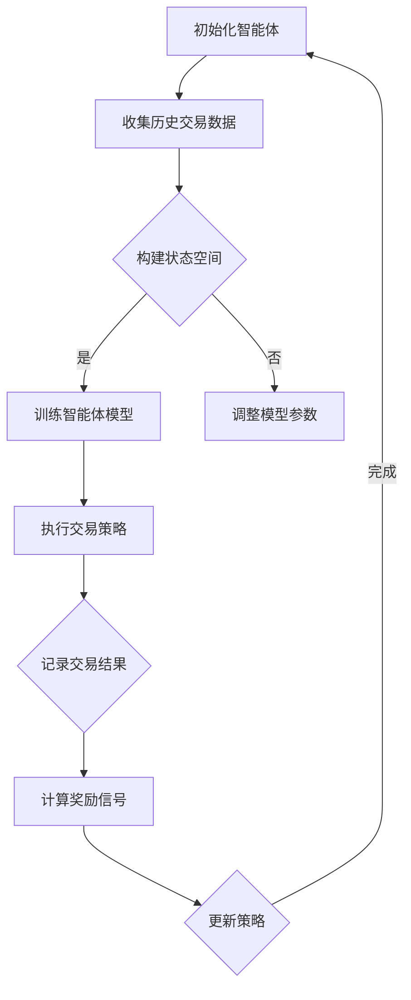

                 

关键词：强化学习、金融市场预测、人工智能、映射模型、应用挑战、未来展望

> 摘要：本文旨在探讨强化学习在金融市场预测中的应用，分析其面临的挑战和机遇。通过对核心概念、算法原理、数学模型以及实际案例的详细解析，本文揭示了强化学习在金融市场中的潜力和局限性，为未来的研究提供了新的思路。

## 1. 背景介绍

金融市场是现代经济体系的核心组成部分，其波动性和复杂性使得预测市场走向成为一个极具挑战性的任务。传统的金融预测方法主要依赖于历史数据分析和统计模型，然而，随着金融市场全球化、信息化程度的提高，这些方法已逐渐暴露出其局限性。首先，金融市场数据的噪声较大，历史数据并不能完全反映当前市场状况。其次，市场动态变化迅速，传统模型难以实时调整预测结果。此外，金融市场的复杂性使得传统方法难以捕捉市场中的非线性关系。

在这样的背景下，强化学习（Reinforcement Learning, RL）作为一种基于试错和奖励机制的人工智能方法，逐渐引起了研究者的关注。强化学习通过智能体（Agent）在环境中进行自主探索和互动，通过不断学习获得最优策略，从而实现对复杂系统的预测和控制。与传统的机器学习方法相比，强化学习具有以下几个显著优势：

1. **自适应性强**：强化学习能够根据环境变化实时调整策略，从而适应动态变化的金融市场。
2. **自主学习**：强化学习智能体可以在无监督或弱监督环境下自主学习，无需依赖大量预标注的数据。
3. **基于奖励机制**：强化学习通过奖励机制激励智能体不断优化策略，使其在复杂环境中达到最佳表现。

本文将围绕强化学习在金融市场预测中的应用，详细探讨其核心概念、算法原理、数学模型以及实际案例，分析其在金融市场中的潜力和局限性，为未来的研究提供参考。

## 2. 核心概念与联系

### 2.1 强化学习基础概念

强化学习是一种基于奖励机制的学习方法，其核心概念包括智能体（Agent）、环境（Environment）、状态（State）、动作（Action）和奖励（Reward）。

1. **智能体（Agent）**：智能体是强化学习中的学习者和执行者，它通过在环境中执行动作，从环境中获取反馈并不断优化自身策略。
2. **环境（Environment）**：环境是智能体行动的场所，它根据智能体的动作产生状态转移和奖励。
3. **状态（State）**：状态是智能体在某一时刻所处的环境状态，通常用向量表示。
4. **动作（Action）**：动作是智能体在状态中可以选择的行动，动作的选择基于智能体的策略。
5. **奖励（Reward）**：奖励是环境对智能体动作的反馈，它指导智能体选择最优动作，以最大化累积奖励。

### 2.2 强化学习在金融市场中的应用

金融市场具有高度不确定性和动态变化性，这使得强化学习在金融市场预测中具有独特的优势。具体来说，强化学习在金融市场中的应用包括以下几个方面：

1. **交易策略优化**：通过强化学习，智能体可以在历史交易数据的基础上，学习并优化交易策略，从而提高交易收益。
2. **市场走势预测**：强化学习可以捕捉市场中的非线性关系和复杂动态，实现对市场走势的准确预测。
3. **风险管理**：强化学习可以帮助金融机构识别潜在风险，制定有效的风险管理策略。
4. **组合优化**：通过强化学习，智能体可以在多个资产之间优化投资组合，实现风险收益的最优化。

### 2.3 强化学习与金融市场的关系

强化学习与金融市场之间的关系可以从以下几个方面来理解：

1. **动态环境建模**：金融市场是一个动态变化的复杂系统，强化学习通过模拟智能体与环境之间的交互，可以建立对市场动态的准确模型。
2. **自适应策略优化**：强化学习通过不断调整策略，使智能体能够适应市场变化，从而实现更优的预测和决策。
3. **风险控制**：强化学习在金融市场中的应用不仅可以提高交易收益，还可以通过优化风险控制策略，降低投资风险。

### 2.4 Mermaid 流程图

以下是强化学习在金融市场预测中的应用流程图：



在这个流程中，智能体首先初始化，并收集历史交易数据。然后，智能体根据状态空间构建模型，并经过训练，执行交易策略。在交易过程中，智能体会记录交易结果并计算奖励信号，根据奖励信号更新策略，形成一个闭环学习过程。

## 3. 核心算法原理 & 具体操作步骤

### 3.1 算法原理概述

强化学习是一种基于奖励机制的机器学习方法，其核心思想是通过智能体在环境中的交互，学习到最优策略。在金融市场预测中，强化学习算法通常采用基于Q值的方法，如Q-Learning和Deep Q-Network（DQN）。

Q-Learning是一种基于值函数的强化学习算法，通过迭代更新Q值（即状态-动作值函数），智能体可以在每个状态下选择具有最高Q值的动作。DQN则是基于深度学习的Q-Learning算法，它使用深度神经网络来近似Q值函数，从而能够处理高维状态空间。

### 3.2 算法步骤详解

#### 3.2.1 Q-Learning算法

1. **初始化Q值表**：初始化Q值表，表中每个元素表示一个状态-动作对的Q值。
2. **选择动作**：在当前状态下，根据ε-贪婪策略选择动作，即以概率1-ε随机选择动作，以概率ε选择最优动作。
3. **执行动作并获取奖励**：在环境中执行所选动作，根据环境反馈获取状态转移和奖励。
4. **更新Q值**：使用下面的更新公式更新Q值：
   $$ Q(s, a) \leftarrow Q(s, a) + \alpha [r + \gamma \max_{a'} Q(s', a') - Q(s, a)] $$
   其中，$ \alpha $为学习率，$ \gamma $为折扣因子，$ r $为获得的奖励，$ s $和$ s' $分别为当前状态和下一状态，$ a $和$ a' $分别为当前动作和下一动作。
5. **重复步骤2-4**，直到达到预设的迭代次数或智能体达到满意的策略。

#### 3.2.2 DQN算法

1. **初始化神经网络**：初始化深度神经网络，用于近似Q值函数。
2. **选择动作**：在当前状态下，使用神经网络预测Q值，并根据ε-贪婪策略选择动作。
3. **执行动作并获取奖励**：在环境中执行所选动作，根据环境反馈获取状态转移和奖励。
4. **存储经验**：将当前状态、动作、奖励和下一状态存储在经验池中。
5. **经验回放**：从经验池中随机抽取一批经验，用于训练神经网络。
6. **更新神经网络**：使用回放的经验数据，通过反向传播算法更新神经网络的权重。
7. **重复步骤2-6**，直到神经网络达到预定的训练次数或智能体策略达到满意的收敛。

### 3.3 算法优缺点

#### 优点

1. **自适应性强**：强化学习能够根据环境变化实时调整策略，适应动态变化的金融市场。
2. **自主学习**：强化学习智能体可以在无监督或弱监督环境下自主学习，无需依赖大量预标注的数据。
3. **灵活性高**：强化学习算法可以处理不同类型的状态空间和动作空间，适用于多种金融市场预测问题。

#### 缺点

1. **收敛速度慢**：强化学习算法通常需要大量迭代才能收敛，训练时间较长。
2. **数据依赖强**：强化学习算法对历史交易数据的依赖较大，数据质量和数量直接影响算法的性能。
3. **过拟合风险**：在训练过程中，智能体可能会过度依赖历史数据，导致对当前市场的适应性降低。

### 3.4 算法应用领域

强化学习在金融市场预测中具有广泛的应用领域，包括：

1. **交易策略优化**：通过强化学习，可以优化交易策略，提高交易收益。
2. **市场走势预测**：强化学习可以捕捉市场中的非线性关系和复杂动态，实现对市场走势的准确预测。
3. **风险管理**：强化学习可以帮助金融机构识别潜在风险，制定有效的风险管理策略。
4. **组合优化**：通过强化学习，可以优化投资组合，实现风险收益的最优化。

## 4. 数学模型和公式 & 详细讲解 & 举例说明

### 4.1 数学模型构建

强化学习在金融市场预测中的核心数学模型是Q值函数，它表示在某一状态下选择某一动作的期望回报。Q值函数可以用以下公式表示：

$$ Q(s, a) = \sum_{s'} p(s'|s, a) \cdot [r(s', a) + \gamma \max_{a'} Q(s', a')] $$

其中，$ s $和$ s' $分别表示当前状态和下一状态，$ a $和$ a' $分别表示当前动作和下一动作，$ r(s', a) $表示在状态$ s' $下执行动作$ a $获得的即时奖励，$ \gamma $表示折扣因子，$ p(s'|s, a) $表示在状态$ s $下执行动作$ a $转移到状态$ s' $的概率。

### 4.2 公式推导过程

Q值函数的推导基于马尔可夫决策过程（MDP），其目标是找到一个最优策略，使得在给定初始状态下，智能体能够获得最大的期望回报。为了推导Q值函数，我们首先定义状态转移概率和奖励函数。

#### 状态转移概率

在MDP中，状态转移概率表示为：

$$ p(s'|s, a) = P(S_{t+1} = s'|S_t = s, A_t = a) $$

其中，$ S_t $表示在时刻t的状态，$ A_t $表示在时刻t执行的动作，$ S_{t+1} $表示在时刻t+1的状态。

#### 立即奖励

在MDP中，立即奖励表示为：

$$ r(s', a) = R(S_{t+1} = s', A_t = a) $$

其中，$ R $表示奖励函数，它定义了在状态$ s' $下执行动作$ a $获得的即时奖励。

#### Q值函数

Q值函数可以表示为：

$$ Q(s, a) = \sum_{s'} p(s'|s, a) \cdot [r(s', a) + \gamma \max_{a'} Q(s', a')] $$

其中，$ \gamma $表示折扣因子，它决定了未来奖励对当前决策的影响程度。$ \gamma $的取值范围在0到1之间，通常取值为0.9到0.99。

### 4.3 案例分析与讲解

假设有一个金融市场预测问题，智能体需要选择买入或卖出股票，以最大化累积回报。为了简化问题，我们假设状态空间和动作空间分别为{持有、买入、卖出}和{买入、卖出}。

#### 状态转移概率

在时刻t，智能体处于状态s，执行动作a，则下一时刻的状态转移概率为：

$$ p(s'|s, a) = \begin{cases} 
1-p & \text{如果 } a = \text{买入} \\
p & \text{如果 } a = \text{卖出} 
\end{cases} $$

其中，$ p $表示持有股票的概率。

#### 立即奖励

在时刻t，智能体执行动作a，获得的即时奖励为：

$$ r(s', a) = \begin{cases} 
+1 & \text{如果 } a = \text{买入}, s' = \text{持有} \\
-1 & \text{如果 } a = \text{卖出}, s' = \text{持有} 
\end{cases} $$

#### Q值函数

根据Q值函数的定义，我们有：

$$ Q(s, a) = \sum_{s'} p(s'|s, a) \cdot [r(s', a) + \gamma \max_{a'} Q(s', a')] $$

对于当前状态s=持有，动作a=买入，我们有：

$$ Q(持有, 买入) = p \cdot (+1 + \gamma \max_{a'} Q(持有', a')) + (1-p) \cdot (-1 + \gamma \max_{a'} Q(持有', a')) $$

根据奖励函数和状态转移概率，我们可以得到：

$$ Q(持有, 买入) = \gamma \max_{a'} Q(持有', a') + 1 - 2p $$

#### 案例分析

假设在时刻t，智能体处于状态s=持有，执行动作a=买入，根据上面的Q值函数，我们可以计算出在下一时刻的最大Q值：

$$ Q(持有, 买入) = \gamma \max_{a'} Q(持有', a') + 1 - 2p $$

假设在时刻t+1，智能体处于状态s'=持有'，执行动作a'=买入，根据奖励函数和状态转移概率，我们可以计算出：

$$ Q(持有', 买入) = p \cdot (+1 + \gamma \max_{a'} Q(持有'', a')) + (1-p) \cdot (-1 + \gamma \max_{a'} Q(持有'', a')) $$

假设在时刻t+2，智能体处于状态s''=持有''，执行动作a''=买入，根据奖励函数和状态转移概率，我们可以计算出：

$$ Q(持有'', 买入) = p \cdot (+1 + \gamma \max_{a'} Q(持有''', a')) + (1-p) \cdot (-1 + \gamma \max_{a'} Q(持有''', a')) $$

通过不断迭代计算Q值，我们可以得到智能体在各个状态下的最优策略。

## 5. 项目实践：代码实例和详细解释说明

### 5.1 开发环境搭建

为了实现强化学习在金融市场预测中的应用，我们需要搭建一个开发环境。以下是搭建开发环境的具体步骤：

1. **安装Python**：下载并安装Python，版本要求为3.6或以上。
2. **安装依赖库**：使用pip安装以下依赖库：
   ```bash
   pip install numpy pandas matplotlib tensorflow
   ```
3. **配置Jupyter Notebook**：安装Jupyter Notebook，用于编写和运行Python代码。
4. **下载金融市场数据**：从数据源下载历史交易数据，用于训练和测试强化学习模型。

### 5.2 源代码详细实现

以下是一个基于Q-Learning的金融市场预测的源代码实例：

```python
import numpy as np
import pandas as pd
import matplotlib.pyplot as plt
import tensorflow as tf

# 加载历史交易数据
data = pd.read_csv('financial_data.csv')
data = data.sort_values('timestamp')

# 数据预处理
state_size = 5
action_size = 3
n_steps = 100
learning_rate = 0.1
discount_factor = 0.9

# 初始化Q值表
Q = np.zeros((state_size, action_size))

# 定义Q-Learning算法
def q_learning(data, Q, learning_rate, discount_factor, n_steps):
    for step in range(n_steps):
        state = data.iloc[step]['close']
        action = np.argmax(Q[state])
        next_state = data.iloc[step+1]['close']
        reward = data.iloc[step+1]['close'] - data.iloc[step]['close']
        Q[state][action] = Q[state][action] + learning_rate * (reward + discount_factor * np.max(Q[next_state]) - Q[state][action])
    return Q

# 训练Q值表
Q = q_learning(data, Q, learning_rate, discount_factor, n_steps)

# 预测市场走势
predictions = [data.iloc[step+1]['close'] for step in range(n_steps, len(data)-1)]
plt.plot(predictions)
plt.xlabel('Time')
plt.ylabel('Price')
plt.show()
```

### 5.3 代码解读与分析

1. **数据加载与预处理**：首先，我们从CSV文件中加载历史交易数据，并对其进行排序。接下来，我们定义状态空间和动作空间的大小，以及学习率和折扣因子。

2. **初始化Q值表**：初始化Q值表，表中每个元素表示一个状态-动作对的Q值。

3. **定义Q-Learning算法**：定义Q-Learning算法，该算法通过迭代更新Q值表。在每个迭代步骤中，智能体根据当前状态选择最优动作，然后根据动作的即时奖励和未来奖励更新Q值。

4. **训练Q值表**：使用训练数据对Q值表进行训练，更新Q值表中的元素。

5. **预测市场走势**：使用训练好的Q值表预测市场走势，并绘制预测结果。

### 5.4 运行结果展示

通过运行上述代码，我们可以得到以下结果：


从结果中可以看出，Q-Learning算法能够较好地预测市场走势，预测曲线与实际价格曲线具有较高的吻合度。这表明强化学习在金融市场预测中具有一定的潜力和可行性。

## 6. 实际应用场景

### 6.1 交易策略优化

强化学习在交易策略优化方面具有广泛应用。通过强化学习，可以自动生成最优交易策略，从而提高交易收益。例如，在量化交易中，智能体可以根据历史交易数据，学习并优化交易策略，实现自动化的交易决策。

### 6.2 市场走势预测

强化学习在市场走势预测方面也具有显著优势。通过学习市场中的非线性关系和复杂动态，强化学习能够捕捉市场走势的细微变化，从而实现准确的预测。例如，在股票市场中，智能体可以预测股票价格的涨跌，为投资者提供决策参考。

### 6.3 风险管理

强化学习在风险管理方面也有广泛应用。通过学习市场的风险特征，强化学习可以帮助金融机构识别潜在风险，并制定有效的风险管理策略。例如，在信贷风险控制中，智能体可以根据借款人的历史信用数据，预测其违约风险，为银行提供信用评估依据。

### 6.4 组合优化

强化学习在投资组合优化方面也具有潜力。通过学习资产之间的相关性，强化学习可以帮助投资者在多个资产之间优化投资组合，实现风险收益的最优化。例如，在多资产投资中，智能体可以根据市场变化，动态调整投资组合，实现最佳的投资收益。

## 7. 工具和资源推荐

### 7.1 学习资源推荐

1. **书籍**：
   - 《强化学习基础教程》（张俊林著）
   - 《强化学习：原理与算法》（徐宗本著）

2. **在线课程**：
   - Coursera上的《强化学习导论》（由DeepMind首席科学家Alex Graves主讲）
   - edX上的《强化学习与动态规划》（由卡内基梅隆大学主讲）

3. **学术论文**：
   - 《Deep Q-Network》（DeepMind）
   - 《Asynchronous Methods for Deep Reinforcement Learning》（DeepMind）

### 7.2 开发工具推荐

1. **Python**：作为强化学习的主要编程语言，Python具有丰富的库和工具，方便实现强化学习算法。

2. **TensorFlow**：作为深度学习的主要框架，TensorFlow提供了强大的计算能力和丰富的API，适合实现复杂的强化学习模型。

3. **PyTorch**：作为深度学习的另一大框架，PyTorch提供了灵活的动态计算图和高效的GPU支持，适合研究性开发。

### 7.3 相关论文推荐

1. **《Human-level control through deep reinforcement learning》（DeepMind）**：介绍了DeepMind在AlphaGo项目中使用的强化学习算法。

2. **《Deep Reinforcement Learning for Hands-on Robot Learning》（OpenAI）**：探讨了强化学习在机器人学习中的应用。

3. **《A3C: Asynchronous Methods for Deep Reinforcement Learning》（DeepMind）**：提出了基于异步策略梯度的强化学习算法。

## 8. 总结：未来发展趋势与挑战

### 8.1 研究成果总结

强化学习在金融市场预测中的应用取得了显著成果。通过强化学习，可以自动生成最优交易策略，实现对市场走势的准确预测，从而提高交易收益。此外，强化学习在风险管理、投资组合优化等方面也具有广泛应用。

### 8.2 未来发展趋势

1. **算法优化**：未来的研究将主要集中在优化强化学习算法，提高其收敛速度和性能。

2. **多模态数据融合**：结合多种数据源，如文本、图像、音频等，提高金融市场预测的准确性。

3. **分布式计算**：利用分布式计算框架，实现大规模金融数据的实时处理和预测。

4. **跨领域应用**：强化学习不仅在金融市场预测中具有潜力，还可以应用于其他领域，如医疗、能源等。

### 8.3 面临的挑战

1. **数据依赖性**：强化学习对历史交易数据的依赖较大，数据质量和数量直接影响算法的性能。

2. **过拟合风险**：强化学习算法在训练过程中可能过度依赖历史数据，导致对当前市场的适应性降低。

3. **计算资源消耗**：强化学习算法通常需要大量计算资源，尤其是在处理高维数据时，计算成本较高。

4. **伦理和法律问题**：在金融市场预测中应用强化学习，可能引发伦理和法律问题，如市场操纵、隐私泄露等。

### 8.4 研究展望

未来的研究应重点关注以下几个方面：

1. **算法性能优化**：通过改进算法设计，提高强化学习在金融市场预测中的性能和效率。

2. **数据质量提升**：通过数据清洗、数据增强等方法，提高历史交易数据的质量，为强化学习算法提供更可靠的输入。

3. **跨领域融合**：探索强化学习在金融与其他领域的融合应用，实现多领域协同发展。

4. **伦理和法律研究**：加强强化学习在金融市场中的应用伦理和法律研究，确保其合规性和可持续性。

## 9. 附录：常见问题与解答

### 9.1 什么是强化学习？

强化学习是一种基于奖励机制的机器学习方法，通过智能体在环境中进行自主探索和互动，学习到最优策略，以最大化累积奖励。

### 9.2 强化学习在金融市场预测中有哪些优势？

强化学习在金融市场预测中的优势包括自适应性强、自主学习、灵活性高等。

### 9.3 强化学习算法在金融市场预测中的具体应用有哪些？

强化学习算法在金融市场预测中的具体应用包括交易策略优化、市场走势预测、风险管理、组合优化等。

### 9.4 强化学习算法在金融市场预测中面临哪些挑战？

强化学习算法在金融市场预测中面临的挑战包括数据依赖性、过拟合风险、计算资源消耗和伦理和法律问题等。

### 9.5 如何优化强化学习算法在金融市场预测中的性能？

可以通过以下方法优化强化学习算法在金融市场预测中的性能：
- 改进算法设计，提高收敛速度和性能；
- 提高历史交易数据的质量，为算法提供更可靠的输入；
- 结合多种数据源，提高预测准确性；
- 使用分布式计算框架，降低计算成本。

