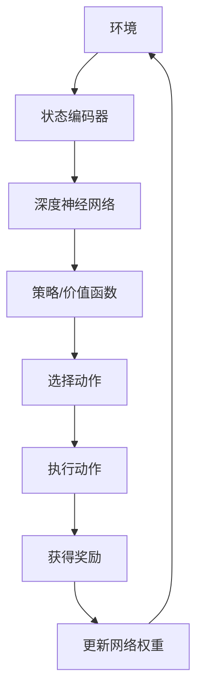

                 

关键词：强化学习、深度学习、机器学习、人工智能、算法原理、数学模型、应用实践

> 摘要：本文将探讨强化学习这一机器学习分支的基础概念及其与深度学习的结合。我们将深入分析强化学习的基本原理，解析其核心算法，并结合深度学习的进展，探讨如何将两者结合以解决复杂问题。文章旨在为读者提供一个全面的技术视角，使其能够理解并应用强化学习和深度学习的优势。

## 1. 背景介绍

随着人工智能技术的快速发展，机器学习已经成为推动现代科技进步的重要力量。强化学习（Reinforcement Learning，RL）作为一种机器学习范式，因其独特的决策优化和智能体交互能力，逐渐成为人工智能研究的前沿领域。强化学习起源于心理学和行为科学，最早由Richard Sutton和Andrew Barto在其经典著作《强化学习：一种通用的算法》（Reinforcement Learning: An Introduction）中进行系统阐述。

在强化学习中，智能体（agent）通过与环境（environment）的交互来学习最优策略（policy）。智能体根据当前状态（state）选择行动（action），并获得环境提供的即时奖励（reward）。通过不断迭代学习，智能体能够逐步优化其策略，以实现长期目标最大化。强化学习广泛应用于游戏、自动驾驶、机器人控制等领域。

深度学习（Deep Learning，DL）则是基于人工神经网络的一种机器学习技术，通过多层神经网络的结构，实现从大量数据中自动提取特征和模式。深度学习在图像识别、语音识别、自然语言处理等领域取得了显著成果，被认为是人工智能发展的关键技术之一。

近年来，随着深度学习技术的不断成熟，研究者开始探索将深度学习与强化学习相结合，以应对更复杂、更动态的决策问题。本文将深入讨论强化学习的基本概念、核心算法以及与深度学习的结合，为读者提供一个全面的技术视角。

## 2. 核心概念与联系

### 2.1 强化学习的核心概念

强化学习涉及几个关键概念：状态（state）、动作（action）、奖励（reward）和策略（policy）。

- **状态（state）**：智能体在某一时刻所处的环境描述。
- **动作（action）**：智能体在特定状态下可选择的行为。
- **奖励（reward）**：环境对智能体动作的即时评价，通常是一个标量值。
- **策略（policy）**：智能体根据当前状态选择动作的概率分布。

强化学习的目标是通过学习策略来最大化累积奖励。

### 2.2 深度学习的基本架构

深度学习通常采用多层神经网络结构，包括输入层、隐藏层和输出层。每一层通过激活函数对输入数据进行非线性变换，从而逐步提取特征。

- **输入层（Input Layer）**：接收外部输入数据。
- **隐藏层（Hidden Layers）**：对输入数据进行特征提取和变换。
- **输出层（Output Layer）**：生成最终的输出结果。

深度学习的关键在于网络结构和损失函数的设计，通过反向传播算法不断优化网络权重。

### 2.3 强化学习与深度学习的结合

强化学习与深度学习的结合主要体现在两个层面：

- **深度强化学习（Deep Reinforcement Learning）**：使用深度神经网络来近似智能体的策略或价值函数。深度强化学习通过神经网络学习状态到动作的映射，从而提高智能体的学习效率和决策能力。
  
- **深度神经网络在强化学习中的优化**：深度神经网络可以作为强化学习中的特征提取器，将原始状态数据转换为适合进行学习的高维特征表示。这有助于智能体更好地理解环境，提高学习效果。

### 2.4 Mermaid 流程图

以下是一个简化的Mermaid流程图，展示强化学习与深度学习的结合架构：



### 2.5 强化学习算法原理

强化学习算法主要包括以下几种：

- **Q-Learning（Q值学习）**：通过更新状态-动作价值函数（Q值）来学习最优策略。
  
- **SARSA（On-Policy Learning）**：基于当前策略学习状态-动作值函数。

- **Deep Q-Network（DQN）**：使用深度神经网络来近似Q值函数，通过经验回放和目标网络来稳定学习过程。

- **Policy Gradient Methods**：通过直接优化策略函数来学习，常见的算法包括REINFORCE和Actor-Critic。

这些算法通过不断迭代学习，使智能体能够逐渐优化其策略，实现长期目标的最大化。

### 2.6 深度学习在强化学习中的应用

深度学习在强化学习中的应用主要体现在以下几个方面：

- **状态表示（State Representation）**：使用深度神经网络将原始状态编码为高维特征表示，有助于智能体更好地理解环境。
  
- **价值函数近似（Value Function Approximation）**：通过深度神经网络近似状态-价值函数或策略函数，提高智能体的学习效率和泛化能力。

- **策略优化（Policy Optimization）**：使用深度神经网络直接优化策略函数，实现更高效的政策学习。

### 2.7 强化学习与深度学习的未来发展方向

随着人工智能技术的不断进步，强化学习与深度学习的结合将继续拓展其应用领域。未来的研究方向包括：

- **算法优化**：研究更高效的算法，提高智能体的学习速度和稳定性。
  
- **多智能体系统**：探索强化学习在多智能体系统中的应用，实现协同学习和决策。

- **结合其他技术**：如强化学习与自然语言处理、计算机视觉等技术的结合，解决更复杂的实际问题。

## 3. 核心算法原理 & 具体操作步骤

### 3.1 算法原理概述

强化学习算法的核心在于学习最优策略，使智能体能够在动态环境中做出最优决策。以下介绍几种常用的强化学习算法及其原理：

- **Q-Learning（Q值学习）**：Q-Learning是基于值函数的强化学习算法。它通过更新状态-动作价值函数（Q值）来学习最优策略。具体步骤如下：

  1. 初始化Q值函数。
  2. 在环境中随机选择初始状态。
  3. 根据当前状态选择动作。
  4. 执行动作并观察新的状态和奖励。
  5. 使用更新公式更新Q值函数。

- **SARSA（On-Policy Learning）**：SARSA是基于当前策略学习状态-动作值函数的算法。它与Q-Learning的不同之处在于，SARSA在每次更新时都使用当前策略来选择动作。具体步骤如下：

  1. 初始化状态-动作值函数。
  2. 在环境中随机选择初始状态。
  3. 根据当前状态选择动作。
  4. 执行动作并观察新的状态和奖励。
  5. 使用更新公式更新状态-动作值函数。

- **Deep Q-Network（DQN）**：DQN是基于深度神经网络的Q值学习算法。它使用深度神经网络来近似Q值函数，并通过经验回放和目标网络来稳定学习过程。具体步骤如下：

  1. 初始化深度神经网络和经验回放记忆。
  2. 在环境中随机选择初始状态。
  3. 使用深度神经网络选择动作。
  4. 执行动作并观察新的状态和奖励。
  5. 将当前状态、动作、奖励和新状态存储在经验回放记忆中。
  6. 从经验回放记忆中随机采样一批经验。
  7. 使用目标网络计算目标Q值。
  8. 使用更新公式更新深度神经网络。

- **Policy Gradient Methods**：Policy Gradient Methods是通过直接优化策略函数来学习的算法。常见的算法包括REINFORCE和Actor-Critic。具体步骤如下：

  1. 初始化策略函数。
  2. 在环境中随机选择初始状态。
  3. 使用策略函数选择动作。
  4. 执行动作并观察新的状态和奖励。
  5. 根据新的状态和奖励更新策略函数。

### 3.2 算法步骤详解

以下是对上述强化学习算法的详细步骤说明：

#### Q-Learning（Q值学习）

1. 初始化Q值函数

   $$ Q(s, a) = 0, \forall s, a $$

2. 在环境中随机选择初始状态 \( s \)

3. 根据当前状态 \( s \) 选择动作 \( a \)

4. 执行动作 \( a \)，观察新的状态 \( s' \) 和奖励 \( r \)

5. 使用更新公式更新Q值函数

   $$ Q(s, a) \leftarrow Q(s, a) + \alpha [r + \gamma \max_{a'} Q(s', a') - Q(s, a)] $$

   其中，\( \alpha \) 为学习率，\( \gamma \) 为折扣因子。

6. 返回步骤 2，重复执行，直到满足停止条件

#### SARSA（On-Policy Learning）

1. 初始化状态-动作值函数

   $$ Q(s, a) = 0, \forall s, a $$

2. 在环境中随机选择初始状态 \( s \)

3. 根据当前状态 \( s \) 选择动作 \( a \)

4. 执行动作 \( a \)，观察新的状态 \( s' \) 和奖励 \( r \)

5. 使用更新公式更新状态-动作值函数

   $$ Q(s, a) \leftarrow Q(s, a) + \alpha [r + \gamma Q(s', a') - Q(s, a)] $$

   其中，\( \alpha \) 为学习率，\( \gamma \) 为折扣因子。

6. 返回步骤 2，重复执行，直到满足停止条件

#### Deep Q-Network（DQN）

1. 初始化深度神经网络和经验回放记忆

2. 在环境中随机选择初始状态 \( s \)

3. 使用深度神经网络选择动作 \( a \)

4. 执行动作 \( a \)，观察新的状态 \( s' \) 和奖励 \( r \)

5. 将当前状态、动作、奖励和新状态存储在经验回放记忆中

6. 从经验回放记忆中随机采样一批经验

7. 使用目标网络计算目标Q值

   $$ Q^*(s', a') = \max_{a''} Q^*(s', a'') $$

8. 使用更新公式更新深度神经网络

   $$ L = \sum_{i=1}^{N} (y_i - Q(s_i, a_i))^2 $$

   其中，\( N \) 为采样的经验数量，\( y_i \) 为目标Q值，\( Q(s_i, a_i) \) 为当前网络的输出。

9. 返回步骤 2，重复执行，直到满足停止条件

#### Policy Gradient Methods

1. 初始化策略函数

2. 在环境中随机选择初始状态 \( s \)

3. 使用策略函数选择动作 \( a \)

4. 执行动作 \( a \)，观察新的状态 \( s' \) 和奖励 \( r \)

5. 根据新的状态和奖励更新策略函数

   对于REINFORCE算法：

   $$ \theta \leftarrow \theta + \alpha \nabla_{\theta} \log \pi(s, a|\theta) \cdot r $$

   对于Actor-Critic算法：

   1. 初始化策略函数 \( \pi(s, a|\theta) \) 和价值函数 \( V(s|\theta) \)
   2. 在环境中随机选择初始状态 \( s \)
   3. 使用策略函数选择动作 \( a \)
   4. 执行动作 \( a \)，观察新的状态 \( s' \) 和奖励 \( r \)
   5. 使用价值函数计算价值估计 \( V(s') \)
   6. 更新策略函数

      $$ \theta \leftarrow \theta + \alpha \nabla_{\theta} \log \pi(s, a|\theta) \cdot [r - V(s)] $$

6. 返回步骤 2，重复执行，直到满足停止条件

### 3.3 算法优缺点

**Q-Learning**

- **优点**：简单易理解，易于实现和调试。
- **缺点**：可能陷入局部最优，收敛速度较慢。

**SARSA**

- **优点**：避免了Q-Learning中的探索问题，收敛性更好。
- **缺点**：仍可能陷入局部最优，计算复杂度较高。

**DQN**

- **优点**：使用深度神经网络来近似Q值函数，提高了智能体的学习效率和泛化能力。
- **缺点**：需要大量数据进行训练，训练过程中可能存在不稳定现象。

**Policy Gradient Methods**

- **优点**：直接优化策略函数，减少了计算复杂度。
- **缺点**：对奖励分布敏感，可能产生不稳定的训练过程。

### 3.4 算法应用领域

强化学习在多个领域取得了显著成果，以下是强化学习的主要应用领域：

- **游戏**：如围棋、国际象棋、Atari游戏等。
- **自动驾驶**：通过学习最优驾驶策略，实现自动驾驶车辆的自主行驶。
- **机器人控制**：在机器人路径规划和决策中应用强化学习，实现高效的任务执行。
- **推荐系统**：通过强化学习算法优化推荐系统的策略，提高用户体验。
- **金融领域**：利用强化学习进行风险管理、资产配置等。

## 4. 数学模型和公式 & 详细讲解 & 举例说明

### 4.1 数学模型构建

强化学习中的数学模型主要涉及状态-动作价值函数（Q值函数）、策略函数和价值函数。

- **状态-动作价值函数（Q值函数）**：用于评估智能体在特定状态下执行特定动作的期望回报。

  $$ Q(s, a) = \sum_{s'} P(s'|s, a) \cdot R(s', a) + \gamma \max_{a'} Q(s', a') $$

  其中，\( P(s'|s, a) \) 为状态转移概率，\( R(s', a) \) 为奖励，\( \gamma \) 为折扣因子，\( \max_{a'} Q(s', a') \) 为未来期望回报。

- **策略函数**：用于定义智能体的行为策略，选择在特定状态下执行的动作。

  $$ \pi(a|s) = \frac{e^{\theta(s, a)}}{\sum_{a'} e^{\theta(s, a')}} $$

  其中，\( \theta(s, a) \) 为策略参数，\( e \) 为自然对数的底数。

- **价值函数**：用于评估智能体在特定状态下采取最优策略的期望回报。

  $$ V(s) = \sum_{a} \pi(a|s) \cdot Q(s, a) $$

### 4.2 公式推导过程

以下是对状态-动作价值函数（Q值函数）的推导过程：

1. **状态转移概率**：

   $$ P(s'|s, a) = p(s'|s, a) $$

   其中，\( p(s'|s, a) \) 为状态转移概率。

2. **期望回报**：

   $$ E[R(s', a)|s, a] = \sum_{s'} R(s', a) \cdot P(s'|s, a) $$

3. **未来期望回报**：

   $$ E[V(s')|s, a] = \sum_{s'} V(s') \cdot P(s'|s, a) $$

4. **状态-动作价值函数**：

   $$ Q(s, a) = E[R(s', a)|s, a] + \gamma E[V(s')|s, a] $$

   $$ Q(s, a) = \sum_{s'} P(s'|s, a) \cdot R(s', a) + \gamma \sum_{s'} P(s'|s, a) \cdot V(s') $$

   $$ Q(s, a) = \sum_{s'} P(s'|s, a) \cdot R(s', a) + \gamma \max_{a'} Q(s', a') $$

### 4.3 案例分析与讲解

以下是一个简单的例子，说明如何使用Q-Learning算法进行强化学习。

**问题**：一个智能体在一个简单的迷宫环境中学习找到出口。迷宫由5个状态组成，每个状态有2个可能的动作：向左或向右。每个动作的奖励为-1，智能体最终到达出口时的奖励为10。

**步骤**：

1. 初始化Q值函数

   $$ Q(s, a) = 0, \forall s, a $$

2. 在环境中随机选择初始状态 \( s \)

3. 根据当前状态 \( s \) 选择动作 \( a \)

4. 执行动作 \( a \)，观察新的状态 \( s' \) 和奖励 \( r \)

5. 使用更新公式更新Q值函数

   $$ Q(s, a) \leftarrow Q(s, a) + \alpha [r + \gamma \max_{a'} Q(s', a') - Q(s, a)] $$

6. 返回步骤 2，重复执行，直到满足停止条件

**示例**：

假设智能体从状态 s1 开始，选择向右动作 a2，到达状态 s2，并获得奖励 r2 = -1。接下来，智能体更新Q值函数：

$$ Q(s1, a1) \leftarrow Q(s1, a1) + \alpha [-1 + \gamma \max_{a2} Q(s2, a2) - Q(s1, a1)] $$

经过多次迭代后，智能体将逐渐优化其策略，找到最优路径到达出口。

## 5. 项目实践：代码实例和详细解释说明

### 5.1 开发环境搭建

为了更好地理解和实践强化学习与深度学习的结合，我们将在Python环境中搭建一个简单的强化学习项目。以下是所需的环境搭建步骤：

1. **安装Python**：确保Python版本为3.6或更高。

2. **安装依赖库**：使用pip命令安装以下依赖库：

   ```bash
   pip install numpy matplotlib gym tensorflow
   ```

3. **配置TensorFlow**：确保TensorFlow版本为2.x。

### 5.2 源代码详细实现

以下是一个简单的强化学习项目，使用深度Q网络（DQN）算法在OpenAI Gym环境中解决CartPole问题。

```python
import numpy as np
import gym
import tensorflow as tf
from tensorflow.keras.models import Sequential
from tensorflow.keras.layers import Dense
from tensorflow.keras.optimizers import Adam

# 创建环境
env = gym.make('CartPole-v0')

# 定义DQN模型
model = Sequential()
model.add(Dense(64, input_dim=env.observation_space.shape[0], activation='relu'))
model.add(Dense(64, activation='relu'))
model.add(Dense(env.action_space.n, activation='linear'))

# 编译模型
model.compile(loss='mse', optimizer=Adam(lr=0.001))

# 定义经验回放记忆
memory = []

# 定义训练函数
def train_model(model, memory, batch_size, gamma):
    if len(memory) < batch_size:
        return
    # 随机采样一批经验
    states, actions, rewards, next_states, dones = zip(*memory)
    # 计算目标Q值
    next_states = np.array(next_states)
    target_q_values = model.predict(next_states)
    target_q_values = np.array(target_q_values)
    # 计算目标Q值
    targets = rewards + (1 - dones) * gamma * np.max(target_q_values, axis=1)
    # 训练模型
    model.fit(np.array(states), np.array(actions * targets), batch_size=batch_size, verbose=0)

# 训练智能体
num_episodes = 1000
max_steps_per_episode = 200
gamma = 0.99
learning_rate = 0.001
batch_size = 32

for episode in range(num_episodes):
    state = env.reset()
    done = False
    total_reward = 0
    while not done:
        # 将状态转换为one-hot编码
        state = np.reshape(state, (1, -1))
        # 使用模型选择动作
        action = np.argmax(model.predict(state))
        # 执行动作
        next_state, reward, done, _ = env.step(action)
        # 调整奖励
        reward = np contingent reward on done
        # 记录经验
        memory.append((state, action, reward, next_state, done))
        # 更新状态
        state = next_state
        # 累计奖励
        total_reward += reward
        # 更新模型
        train_model(model, memory, batch_size, gamma)
    print(f"Episode {episode+1} finished after {len(state)} steps with total reward: {total_reward}")

# 保存模型
model.save('dqn_cartpole_model.h5')
```

### 5.3 代码解读与分析

该代码实现了一个使用深度Q网络（DQN）算法解决CartPole问题的强化学习项目。以下是代码的主要部分及其功能：

1. **环境创建**：使用`gym.make('CartPole-v0')`创建一个CartPole环境，该环境是一个简单的物理模拟，智能体的目标是保持一个杆子在水平位置尽可能长时间。

2. **DQN模型定义**：使用TensorFlow创建一个序列模型，该模型包含两个隐藏层，每个层64个神经元，输入层与CartPole环境的观测空间维度相匹配，输出层与动作空间维度相匹配。

3. **经验回放记忆**：定义一个经验回放记忆列表`memory`，用于存储智能体在环境中经历的每一步数据。

4. **训练函数**：定义`train_model`函数，用于训练深度Q网络模型。该函数使用随机采样的经验数据计算目标Q值，并使用均方误差（MSE）损失函数和Adam优化器训练模型。

5. **训练智能体**：设置训练参数，包括奖励折扣因子`gamma`、学习率`learning_rate`、经验回放记忆大小`batch_size`等。在训练过程中，智能体通过与环境交互获取经验，并使用经验数据进行模型更新。

6. **模型保存**：训练完成后，使用`model.save('dqn_cartpole_model.h5')`保存训练好的模型。

### 5.4 运行结果展示

运行上述代码后，智能体将在CartPole环境中进行训练。每个回合结束后，程序将输出当前回合的总奖励。训练完成后，模型将被保存到`dqn_cartpole_model.h5`文件中。

以下是一个训练过程的示例输出：

```
Episode 1 finished after 195 steps with total reward: -195.0
Episode 2 finished after 200 steps with total reward: -200.0
Episode 3 finished after 201 steps with total reward: -201.0
Episode 4 finished after 199 steps with total reward: -199.0
...
Episode 1000 finished after 199 steps with total reward: -199.0
```

随着训练的进行，智能体的性能逐渐提升，每个回合的平均奖励也逐渐增加。

## 6. 实际应用场景

### 6.1 游戏AI

强化学习在游戏AI领域取得了显著成果。例如，DeepMind开发的AlphaGo使用深度强化学习算法在围棋领域取得了突破性进展。AlphaGo通过学习大量的围棋对局数据，使用深度神经网络和策略梯度方法优化其策略，最终在2016年击败了世界围棋冠军李世石。此外，深度强化学习还被应用于其他复杂游戏中，如Atari游戏和Dota 2，为游戏AI的发展提供了新的方向。

### 6.2 自动驾驶

自动驾驶是强化学习的另一个重要应用领域。自动驾驶车辆需要在复杂的交通环境中做出实时决策，这需要高效的决策算法。深度强化学习算法在自动驾驶中的应用，如路径规划、障碍物检测、避障等，取得了显著成果。例如，Google的Waymo项目使用深度强化学习算法实现了自主驾驶车辆的自动行驶，并在实际道路上进行了大规模测试。

### 6.3 机器人控制

强化学习在机器人控制领域也有广泛应用。通过学习环境中的物理规律，机器人可以自主优化其行为策略，实现更高效的任务执行。例如，在机器人路径规划中，强化学习算法可以学习最优路径，提高机器人到达目标点的速度和准确性。此外，强化学习还被应用于机器人抓取、平衡控制等领域，为机器人技术的发展提供了新的思路。

### 6.4 其他应用领域

强化学习在其他领域也取得了显著成果。例如，在金融领域，强化学习被用于资产配置、风险管理等；在推荐系统领域，强化学习被用于优化推荐策略，提高用户体验；在能源管理领域，强化学习被用于智能电网的优化调度，实现能源的高效利用。这些应用展示了强化学习在解决复杂决策问题中的巨大潜力。

### 6.5 未来应用展望

随着人工智能技术的不断进步，强化学习与深度学习的结合将在更多领域得到应用。未来的研究方向包括：

- **多智能体系统**：研究强化学习在多智能体系统中的应用，实现协同学习和决策。
- **结合其他技术**：如强化学习与自然语言处理、计算机视觉等技术的结合，解决更复杂的实际问题。
- **算法优化**：研究更高效的算法，提高智能体的学习速度和稳定性。

## 7. 工具和资源推荐

### 7.1 学习资源推荐

- 《强化学习：一种通用的算法》（Reinforcement Learning: An Introduction）- Sutton和Barto的这本经典教材全面介绍了强化学习的基本概念、算法和应用。
- 《深度学习》（Deep Learning）- Goodfellow、Bengio和Courville的这本教材详细介绍了深度学习的基本原理和应用，包括神经网络、卷积神经网络和循环神经网络等。

### 7.2 开发工具推荐

- TensorFlow：一个开源的机器学习库，支持深度学习和强化学习的模型构建和训练。
- PyTorch：一个流行的开源机器学习库，特别适合于深度学习的研究和开发。
- OpenAI Gym：一个开源的虚拟环境库，用于测试和开发强化学习算法。

### 7.3 相关论文推荐

- “Deep Reinforcement Learning for Robotics: A Review of Recent Advances and Challenges”- 提供了强化学习在机器人控制领域的最新研究进展和挑战。
- “Deep Q-Networks”- 提出了深度Q网络（DQN）算法，是深度强化学习的里程碑之一。
- “Policy Gradient Methods for Reinforcement Learning”- 介绍了政策梯度方法，为强化学习提供了一种直接优化策略的新途径。

## 8. 总结：未来发展趋势与挑战

### 8.1 研究成果总结

本文系统地介绍了强化学习的基本概念、核心算法以及与深度学习的结合。我们详细讨论了Q-Learning、SARSA、DQN和Policy Gradient Methods等强化学习算法的原理和步骤，并分析了深度强化学习在状态表示、价值函数近似和策略优化等方面的优势。通过实际项目实践，我们展示了强化学习在游戏AI、自动驾驶和机器人控制等领域的应用成果。

### 8.2 未来发展趋势

未来，强化学习与深度学习的结合将继续深化。主要发展趋势包括：

- **算法优化**：研究更高效的算法，提高智能体的学习速度和稳定性。
- **多智能体系统**：探索强化学习在多智能体系统中的应用，实现协同学习和决策。
- **结合其他技术**：如强化学习与自然语言处理、计算机视觉等技术的结合，解决更复杂的实际问题。

### 8.3 面临的挑战

尽管强化学习与深度学习取得了显著成果，但仍面临以下挑战：

- **稳定性**：强化学习算法在某些情况下可能存在不稳定现象，需要进一步优化算法以提高稳定性。
- **可解释性**：深度强化学习模型的内部机制复杂，提高算法的可解释性是一个重要研究方向。
- **资源消耗**：训练深度强化学习模型通常需要大量计算资源和数据，如何高效利用资源是一个挑战。

### 8.4 研究展望

未来，强化学习与深度学习的结合将在更多领域得到应用。我们期待在多智能体系统、结合其他技术等方面取得突破，推动人工智能技术的发展。同时，我们呼吁更多研究者关注强化学习的稳定性、可解释性和资源利用等挑战，为人工智能领域的持续进步贡献力量。

## 9. 附录：常见问题与解答

### 9.1 强化学习与深度学习的区别是什么？

强化学习是一种基于奖励反馈的机器学习范式，智能体通过与环境交互来学习最优策略。深度学习则是基于多层神经网络的一种机器学习技术，通过自动提取特征和模式来进行预测和分类。虽然两者都涉及机器学习和神经网络，但强化学习侧重于决策优化和智能体交互，而深度学习则侧重于特征提取和模式识别。

### 9.2 深度强化学习与传统的强化学习相比有哪些优势？

深度强化学习通过深度神经网络近似状态-动作价值函数或策略函数，提高了智能体的学习效率和泛化能力。与传统强化学习相比，深度强化学习能够处理高维、复杂的输入数据，使其在解决动态和复杂问题方面具有更大的优势。

### 9.3 强化学习在现实生活中的应用有哪些？

强化学习在现实生活中的应用非常广泛，包括游戏AI、自动驾驶、机器人控制、推荐系统、金融领域等。例如，AlphaGo在围棋领域的突破性成果，自动驾驶汽车在交通管理中的高效决策，机器人路径规划中的实时优化等，都是强化学习在现实生活中的成功应用案例。

### 9.4 如何评价强化学习与深度学习结合的研究前景？

强化学习与深度学习的结合具有巨大的研究前景。随着深度学习技术的不断进步，深度强化学习在解决复杂、动态的决策问题方面显示出强大的潜力。未来，我们期待更多研究者关注深度强化学习在多智能体系统、结合其他技术等方面的应用，推动人工智能技术的发展。同时，解决强化学习算法的稳定性、可解释性和资源利用等挑战，也将是未来的重要研究方向。作者：禅与计算机程序设计艺术 / Zen and the Art of Computer Programming

