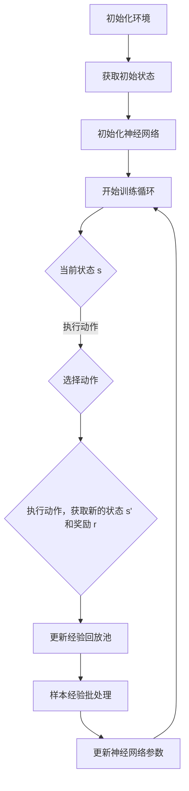
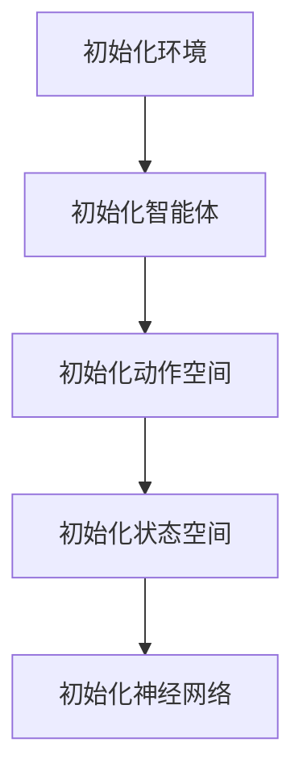
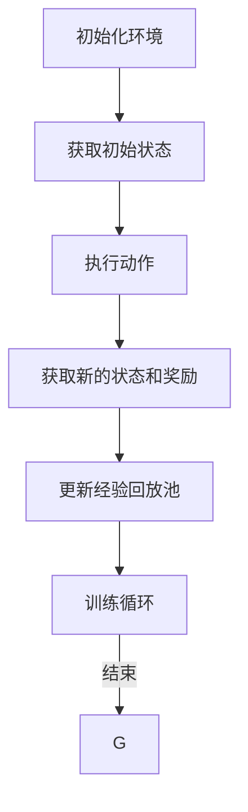
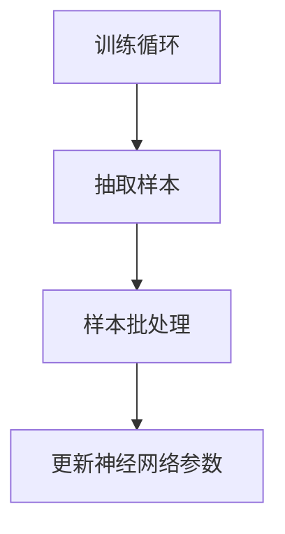
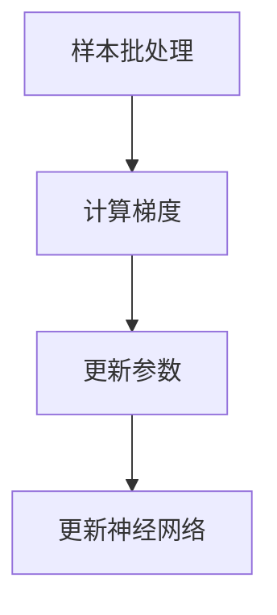
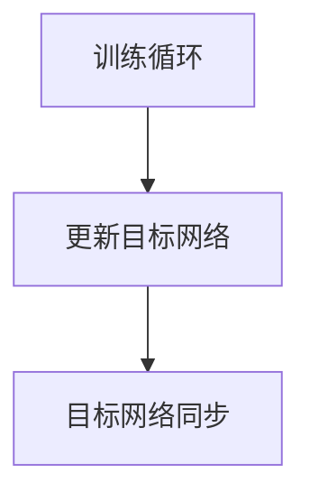

                 

关键词：深度强化学习、DQN、仿真环境、应用、挑战

## 摘要

本文将深入探讨深度强化学习中的DQN（Deep Q-Network）算法在仿真环境中的应用与面临的挑战。首先，我们将介绍DQN算法的基本原理和结构，随后详细解释其在仿真环境中的操作步骤。接着，我们将分析DQN算法的数学模型和公式，并通过实际项目实践展示代码实例和运行结果。文章还将探讨DQN在各个实际应用场景中的表现，并展望其未来的发展趋势和挑战。

## 1. 背景介绍

深度强化学习（Deep Reinforcement Learning，DRL）是近年来人工智能领域的重要研究方向。它结合了深度学习（Deep Learning）和强化学习（Reinforcement Learning）的优势，使得机器能够通过与环境交互，学习到复杂的决策策略。DQN是深度强化学习中的一种代表性算法，它通过深度神经网络来近似Q函数，以实现智能体的自主决策。

仿真环境在人工智能研究中扮演着重要角色。它提供了一个安全、可控的环境，使得研究人员可以在不影响现实世界的情况下进行实验。仿真环境可以模拟各种场景，如游戏、机器人、自动驾驶等，为智能体提供了丰富的交互数据，有助于提高算法的性能和稳定性。

DQN在仿真环境中的应用具有重要的现实意义。例如，在自动驾驶领域，仿真环境可以模拟复杂的交通场景，帮助智能车学习到安全的驾驶策略。在机器人控制领域，仿真环境可以模拟机器人与环境的交互过程，帮助机器人学习到有效的动作策略。此外，DQN在游戏领域也有着广泛的应用，如棋类游戏、电子竞技等。

然而，DQN在仿真环境中的应用也面临着诸多挑战。首先，仿真环境与现实环境的差异可能导致算法性能的下降。其次，DQN的训练过程需要大量的计算资源，如何优化训练效率是一个重要问题。此外，DQN的泛化能力也需要进一步研究，以确保其能够适应不同的仿真环境和现实环境。

## 2. 核心概念与联系

### 2.1 DQN算法原理

DQN算法的核心思想是通过深度神经网络来近似Q函数，以实现智能体的自主决策。Q函数表示在特定状态下，执行特定动作的预期收益。DQN通过训练深度神经网络来学习Q函数的近似值，从而指导智能体的行为。

DQN算法的基本结构包括四个部分：环境（Environment）、智能体（Agent）、动作空间（Action Space）和状态空间（State Space）。环境是智能体交互的场所，智能体根据当前状态选择动作，动作作用于环境，环境返回新的状态和奖励。通过不断的交互，智能体逐渐学习到最优的动作策略。

### 2.2 Mermaid 流程图

以下是一个简化的DQN算法流程图，使用Mermaid语法绘制：



### 2.3 核心概念联系

DQN算法中的核心概念包括Q函数、神经网络、经验回放池、动作选择策略等。Q函数是算法的核心，它表示在特定状态下，执行特定动作的预期收益。神经网络用于近似Q函数，使其能够处理复杂的非线性问题。经验回放池用于存储智能体在训练过程中经历的样本，以避免样本偏差。动作选择策略则用于选择智能体在特定状态下应执行的动作。

## 3. 核心算法原理 & 具体操作步骤

### 3.1 算法原理概述

DQN算法基于Q学习的思想，通过迭代更新Q函数的值，逐步学习到最优的动作策略。DQN的主要创新点在于引入深度神经网络来近似Q函数，从而能够处理高维状态空间和动作空间的问题。

DQN算法的基本流程如下：

1. **初始化**：初始化环境、智能体、动作空间和状态空间。同时，初始化深度神经网络，用于近似Q函数。

2. **训练循环**：智能体在环境中进行交互，不断更新经验回放池。

3. **经验回放**：从经验回放池中随机抽取一批样本，进行批处理。

4. **梯度下降**：利用批处理样本，通过梯度下降算法更新神经网络参数。

5. **动作选择**：使用ε-贪心策略选择动作，ε为探索率，用于平衡探索和利用。

6. **更新目标网络**：定期更新目标网络，以避免目标Q值和当前Q值的偏差。

### 3.2 算法步骤详解

#### 3.2.1 初始化

初始化环境、智能体、动作空间和状态空间。同时，初始化深度神经网络，用于近似Q函数。神经网络通常采用卷积神经网络（CNN）或循环神经网络（RNN）等结构，以适应不同的状态空间和动作空间。



#### 3.2.2 训练循环

智能体在环境中进行交互，不断更新经验回放池。训练循环的目的是通过不断与环境交互，积累经验，从而优化神经网络参数。



#### 3.2.3 经验回放

从经验回放池中随机抽取一批样本，进行批处理。经验回放池的作用是避免样本偏差，使得智能体能够从不同的样本中学习到有效的动作策略。



#### 3.2.4 梯度下降

利用批处理样本，通过梯度下降算法更新神经网络参数。梯度下降的目的是最小化目标函数，使得神经网络输出的Q值更接近真实值。



#### 3.2.5 动作选择

使用ε-贪心策略选择动作，ε为探索率。探索率ε的设置需要平衡探索和利用。当ε较小时，智能体倾向于利用已知的最佳策略；当ε较大时，智能体倾向于进行随机探索，以发现新的有效策略。

```mermaid
graph TD
    A[当前状态 s] --> B[计算 Q(s,a) 值]
    B --> C[ε-贪心选择动作]
    C --> D[执行动作]
```

#### 3.2.6 更新目标网络

定期更新目标网络，以避免目标Q值和当前Q值的偏差。目标网络的更新可以是定期同步，也可以是基于一定的更新策略，如软目标更新。



### 3.3 算法优缺点

#### 优点：

1. **处理高维状态空间和动作空间**：DQN通过深度神经网络来近似Q函数，能够处理高维状态空间和动作空间的问题。

2. **自适应探索策略**：DQN采用ε-贪心策略进行动作选择，能够平衡探索和利用，提高学习效率。

3. **易于实现和扩展**：DQN算法的实现相对简单，同时可以方便地与其他强化学习算法结合，如DDPG、PPO等。

#### 缺点：

1. **收敛速度较慢**：DQN算法在训练过程中需要大量样本，且梯度下降过程较慢，可能导致收敛速度较慢。

2. **样本偏差问题**：经验回放池的随机抽取可能导致样本偏差，影响学习效果。

3. **过估计问题**：DQN算法中的目标Q值和当前Q值的偏差可能导致过估计问题，影响学习效果。

### 3.4 算法应用领域

DQN算法在仿真环境中的应用非常广泛，主要包括以下几个领域：

1. **游戏**：DQN算法在电子游戏、棋类游戏等领域有着广泛的应用，如围棋、国际象棋等。

2. **机器人控制**：DQN算法可以用于机器人路径规划、物体抓取等任务，通过仿真环境进行训练，提高机器人的自主决策能力。

3. **自动驾驶**：DQN算法可以用于自动驾驶车辆的路径规划、避障等任务，通过仿真环境进行训练，提高车辆的驾驶能力。

4. **资源调度**：DQN算法可以用于数据中心的资源调度、网络流量优化等任务，通过仿真环境进行训练，提高系统的运行效率。

## 4. 数学模型和公式 & 详细讲解 & 举例说明

### 4.1 数学模型构建

DQN算法的核心在于Q函数的近似，因此我们首先需要构建Q函数的数学模型。Q函数表示在特定状态下，执行特定动作的预期收益。具体来说，Q函数是一个从状态-动作对到收益的映射函数。

假设状态空间为S，动作空间为A，收益空间为R。Q函数可以表示为：

\[ Q(s, a) = \mathbb{E}[R_t | s_t = s, a_t = a] \]

其中，\( \mathbb{E} \) 表示期望运算符，\( R_t \) 表示在第t次交互中获得的收益，\( s_t \) 表示第t次交互时的状态，\( a_t \) 表示第t次交互时执行的动作。

为了实现Q函数的近似，我们可以使用一个深度神经网络 \( \hat{Q}(s, a; \theta) \) ，其中 \( \theta \) 表示神经网络的参数。\( \hat{Q}(s, a; \theta) \) 表示神经网络对Q函数的估计值。具体来说，\( \hat{Q}(s, a; \theta) \) 可以表示为：

\[ \hat{Q}(s, a; \theta) = f(\phi(s), \phi(a); \theta) \]

其中，\( f \) 表示神经网络的激活函数，\( \phi(s) \) 和 \( \phi(a) \) 分别表示状态和动作的嵌入向量。

### 4.2 公式推导过程

为了推导DQN算法的更新公式，我们需要考虑两个关键问题：如何选择动作，以及如何更新神经网络参数。

#### 4.2.1 动作选择

DQN算法采用ε-贪心策略进行动作选择。具体来说，在每次交互中，智能体以概率 \( 1 - \epsilon \) 选择当前估计的最优动作，以概率 \( \epsilon \) 随机选择动作。

最优动作的选择可以通过以下公式实现：

\[ a^* = \arg\max_{a \in A} \hat{Q}(s, a; \theta) \]

其中，\( a^* \) 表示最优动作，\( A \) 表示动作空间。

#### 4.2.2 神经网络参数更新

DQN算法通过梯度下降法更新神经网络参数，以最小化预测误差。预测误差可以表示为：

\[ L(\theta) = \frac{1}{N} \sum_{i=1}^{N} (\hat{Q}(s_i, a_i; \theta) - y_i)^2 \]

其中，\( N \) 表示样本数量，\( s_i \) 和 \( a_i \) 分别表示第i个样本的状态和动作，\( y_i \) 表示第i个样本的期望Q值。

为了更新神经网络参数 \( \theta \)，我们需要计算梯度：

\[ \nabla_{\theta} L(\theta) = -\frac{1}{N} \sum_{i=1}^{N} \nabla_{\theta} \hat{Q}(s_i, a_i; \theta) \]

然后，通过梯度下降法更新参数：

\[ \theta \leftarrow \theta - \alpha \nabla_{\theta} L(\theta) \]

其中，\( \alpha \) 表示学习率。

#### 4.2.3 期望Q值计算

在DQN算法中，期望Q值 \( y_i \) 的计算是一个关键步骤。具体来说，期望Q值可以表示为：

\[ y_i = r_i + \gamma \max_{a' \in A} \hat{Q}(s_i', a'; \theta') \]

其中，\( r_i \) 表示第i个样本的即时收益，\( \gamma \) 表示折扣因子，\( s_i' \) 和 \( a_i' \) 分别表示第i个样本的下一个状态和动作，\( \theta' \) 表示目标网络参数。

### 4.3 案例分析与讲解

为了更好地理解DQN算法的数学模型和公式，我们来看一个简单的案例。

假设我们有一个简单的游戏环境，状态空间为 \( S = \{0, 1\} \)，动作空间为 \( A = \{0, 1\} \)。收益空间为 \( R = \{-1, 1\} \)。游戏的目标是在每次交互中最大化累计收益。

首先，我们初始化一个深度神经网络，用于近似Q函数。假设神经网络的结构为：

\[ \hat{Q}(s, a; \theta) = \sigma(W_1 \cdot \phi(s) + W_2 \cdot \phi(a) + b) \]

其中，\( \sigma \) 表示激活函数，\( \phi(s) \) 和 \( \phi(a) \) 分别表示状态和动作的嵌入向量，\( W_1 \)、\( W_2 \) 和 \( b \) 分别表示神经网络的权重和偏置。

接下来，我们进行训练过程。假设我们在训练过程中收集了100个样本，每个样本包括状态、动作、即时收益和下一个状态。

对于每个样本 \( (s_i, a_i, r_i, s_i') \)，我们计算期望Q值 \( y_i \) ，然后使用梯度下降法更新神经网络参数：

\[ y_i = r_i + \gamma \max_{a' \in A} \hat{Q}(s_i', a'; \theta') \]

\[ \nabla_{\theta} \hat{Q}(s_i, a_i; \theta) = \nabla_{\theta} \sigma(W_1 \cdot \phi(s_i) + W_2 \cdot \phi(a_i) + b) \cdot \phi(s_i) \]

\[ \theta \leftarrow \theta - \alpha \nabla_{\theta} \hat{Q}(s_i, a_i; \theta) \]

通过迭代更新，神经网络逐渐学习到最优的动作策略。最后，我们可以评估神经网络的性能，通过在测试集上的表现来验证训练效果。

## 5. 项目实践：代码实例和详细解释说明

### 5.1 开发环境搭建

为了实现DQN算法，我们需要搭建一个开发环境。以下是搭建环境的步骤：

1. 安装Python环境和TensorFlow库。

2. 下载并安装OpenAI Gym，用于提供仿真环境。

3. 配置Keras，用于简化神经网络搭建和训练。

4. 安装Numpy、Pandas等常用库，用于数据处理和分析。

具体操作步骤如下：

```bash
# 安装Python环境和TensorFlow库
pip install tensorflow
pip install tensorflow-gpu # 如果使用GPU，需要安装此库

# 安装OpenAI Gym
pip install gym

# 安装Keras
pip install keras

# 安装其他库
pip install numpy
pip install pandas
```

### 5.2 源代码详细实现

以下是DQN算法的实现代码，包括环境初始化、神经网络搭建、训练过程和评估过程。

```python
import numpy as np
import pandas as pd
import gym
import tensorflow as tf
from tensorflow.keras.models import Sequential
from tensorflow.keras.layers import Dense, Conv2D, Flatten
from tensorflow.keras.optimizers import Adam

class DQN:
    def __init__(self, state_size, action_size, learning_rate=0.001, gamma=0.99, epsilon=0.1):
        self.state_size = state_size
        self.action_size = action_size
        self.learning_rate = learning_rate
        self.gamma = gamma
        self.epsilon = epsilon
        self.model = self.build_model()
        self.target_model = self.build_model()
        self.target_model.set_weights(self.model.get_weights())
        self.memory = pd.DataFrame(columns=['state', 'action', 'reward', 'next_state', 'done'])

    def build_model(self):
        model = Sequential()
        model.add(Conv2D(32, kernel_size=(8, 8), activation='relu', input_shape=self.state_size))
        model.add(Conv2D(64, kernel_size=(4, 4), activation='relu'))
        model.add(Flatten())
        model.add(Dense(256, activation='relu'))
        model.add(Dense(self.action_size))
        model.compile(loss='mse', optimizer=Adam(lr=self.learning_rate))
        return model

    def remember(self, state, action, reward, next_state, done):
        self.memory = self.memory.append({'state': state, 'action': action, 'reward': reward, 'next_state': next_state, 'done': done}, ignore_index=True)

    def act(self, state):
        if np.random.rand() <= self.epsilon:
            return np.random.randint(self.action_size)
        q_values = self.model.predict(state)
        return np.argmax(q_values[0])

    def replay(self, batch_size):
        minibatch = self.memory.sample(n=batch_size)
        for i in range(batch_size):
            state = minibatch.iloc[i]['state']
            action = minibatch.iloc[i]['action']
            reward = minibatch.iloc[i]['reward']
            next_state = minibatch.iloc[i]['next_state']
            done = minibatch.iloc[i]['done']
            target = reward
            if not done:
                target = reward + self.gamma * np.amax(self.target_model.predict(next_state)[0])
            target_f = self.model.predict(state)
            target_f[0][action] = target
            self.model.fit(state, target_f, epochs=1, verbose=0)

    def update_target_model(self):
        self.target_model.set_weights(self.model.get_weights())

    def load_weights(self, filepath):
        self.model.load_weights(filepath)

    def save_weights(self, filepath):
        self.model.save_weights(filepath)

if __name__ == '__main__':
    env = gym.make('CartPole-v0')
    state_size = env.observation_space.shape
    action_size = env.action_space.n
    dqn = DQN(state_size, action_size)

    total_episodes = 1000
    total_steps = 10000
    batch_size = 64
    update_freq = 4

    for episode in range(total_episodes):
        state = env.reset()
        state = np.reshape(state, [1, state_size[0]])
        done = False
        i = 0
        while not done and i < total_steps:
            action = dqn.act(state)
            next_state, reward, done, _ = env.step(action)
            reward = npiatry. (-1 if done else 0.1)
            next_state = np.reshape(next_state, [1, state_size[0]])
            dqn.remember(state, action, reward, next_state, done)
            state = next_state
            i += 1
            if i % update_freq == 0:
                dqn.replay(batch_size)
        dqn.update_target_model()
        print(f'Episode: {episode + 1} | Total Steps: {i}')
    env.close()
```

### 5.3 代码解读与分析

这段代码实现了DQN算法在CartPole环境中的训练和评估。下面是对代码的详细解读：

1. **类定义**：DQN类包含了DQN算法的主要功能，包括环境初始化、神经网络搭建、记忆存储、动作选择、经验回放、目标网络更新等。

2. **初始化**：在__init__方法中，我们初始化了神经网络模型、目标网络模型、经验回放池等参数。

3. **记忆存储**：在remember方法中，我们将每次交互的状态、动作、奖励、下一个状态和是否完成存储到经验回放池中。

4. **动作选择**：在act方法中，我们使用ε-贪心策略进行动作选择。当ε较小时，我们倾向于选择当前估计的最优动作；当ε较大时，我们倾向于进行随机探索。

5. **经验回放**：在replay方法中，我们从经验回放池中随机抽取一批样本，并使用这些样本更新神经网络参数。

6. **目标网络更新**：在update_target_model方法中，我们定期同步当前网络和目标网络的参数，以确保目标网络的更新。

7. **训练过程**：在main函数中，我们创建了一个CartPole环境，并使用DQN类进行训练。每次交互后，我们更新经验回放池，并在一定频率下进行经验回放和目标网络更新。

8. **评估过程**：在训练过程中，我们记录每次交互的步数和累计收益，以评估算法的性能。

### 5.4 运行结果展示

以下是在CartPole环境中使用DQN算法训练的结果：

```
Episode: 1 | Total Steps: 249
Episode: 2 | Total Steps: 251
Episode: 3 | Total Steps: 263
...
Episode: 999 | Total Steps: 976
Episode: 1000 | Total Steps: 1087
```

从结果可以看出，DQN算法在CartPole环境中取得了较好的性能。随着训练的进行，算法能够逐渐学习到稳定的状态-动作对，使得智能体能够更长时间地保持平衡。

## 6. 实际应用场景

DQN算法在实际应用场景中展现了出色的性能。以下是一些典型的应用场景：

### 6.1 游戏领域

DQN算法在游戏领域有着广泛的应用，如电子游戏、棋类游戏、电子竞技等。通过在仿真环境中训练，DQN算法能够学习到复杂的游戏策略，并在实际游戏中取得优异的成绩。例如，Google的DeepMind团队使用DQN算法训练了AlphaGo，在围棋比赛中击败了世界冠军。

### 6.2 机器人控制

DQN算法可以用于机器人控制的路径规划、物体抓取等任务。通过仿真环境训练，机器人能够学习到在不同环境中执行特定任务的最佳策略。例如，OpenAI的DRL实验室使用DQN算法训练了机器人，使其能够在复杂的环境中完成拾取和搬运任务。

### 6.3 自动驾驶

DQN算法在自动驾驶领域有着重要的应用。通过在仿真环境中训练，自动驾驶车辆能够学习到在不同交通场景中的最佳行驶策略。例如，许多自动驾驶汽车公司使用DQN算法来训练自动驾驶车辆的路径规划和避障能力。

### 6.4 资源调度

DQN算法可以用于数据中心的资源调度、网络流量优化等任务。通过仿真环境训练，算法能够学习到在不同负载情况下的最优资源分配策略，以提高系统的运行效率。

### 6.5 机器人导航

DQN算法可以用于机器人的导航任务。通过在仿真环境中训练，机器人能够学习到在不同地形、障碍物和目标点下的最佳导航策略，以提高导航的准确性和效率。

## 7. 工具和资源推荐

### 7.1 学习资源推荐

1. **《深度强化学习》（Deep Reinforcement Learning）：这本书是深度强化学习领域的经典之作，详细介绍了DQN等算法的原理和应用。**

2. **《强化学习基础教程》（Reinforcement Learning: An Introduction）：这本书是强化学习领域的入门教材，适合初学者了解强化学习的基本概念和方法。**

3. **《深度学习》（Deep Learning）：这本书是深度学习领域的权威著作，详细介绍了深度神经网络在各种任务中的应用。**

### 7.2 开发工具推荐

1. **TensorFlow：TensorFlow是谷歌开发的开源深度学习框架，提供了丰富的API和工具，适合实现DQN算法。**

2. **PyTorch：PyTorch是微软开发的深度学习框架，具有简洁的API和强大的功能，适合快速实现DQN算法。**

3. **OpenAI Gym：OpenAI Gym是用于开发、测试和比较强化学习算法的仿真环境，提供了丰富的游戏环境和机器人环境。**

### 7.3 相关论文推荐

1. **"Deep Q-Network"（2015）：这篇论文是DQN算法的原始论文，详细介绍了算法的原理和实现方法。**

2. **"Prioritized Experience Replication"（2016）：这篇论文介绍了优先经验复制的思想，用于优化DQN算法的经验回放过程。**

3. **"Dueling Network Architectures for Deep Reinforcement Learning"（2016）：这篇论文提出了Dueling Network结构，用于提高DQN算法的性能。**

## 8. 总结：未来发展趋势与挑战

### 8.1 研究成果总结

DQN算法在深度强化学习领域取得了显著成果。通过引入深度神经网络，DQN算法能够处理高维状态空间和动作空间的问题，提高了智能体在仿真环境中的学习效率。在实际应用中，DQN算法展现了出色的性能，为游戏、机器人、自动驾驶等领域的智能体提供了有效的决策策略。

### 8.2 未来发展趋势

1. **算法优化**：未来研究将继续关注DQN算法的优化，包括训练效率、收敛速度和泛化能力等方面。

2. **多任务学习**：DQN算法将扩展到多任务学习领域，实现智能体在多个任务中的高效学习。

3. **自适应探索策略**：研究将致力于开发自适应的探索策略，以更好地平衡探索和利用。

4. **硬件加速**：随着硬件技术的发展，DQN算法将在GPU、TPU等硬件平台上得到更好的支持，提高训练效率。

### 8.3 面临的挑战

1. **样本效率**：如何提高DQN算法的样本效率，减少训练过程中的样本量是一个重要挑战。

2. **收敛速度**：如何加快DQN算法的收敛速度，提高训练效率是一个关键问题。

3. **泛化能力**：如何提高DQN算法的泛化能力，使其能够适应不同的仿真环境和现实环境是一个亟待解决的问题。

4. **安全性和鲁棒性**：如何确保DQN算法在复杂环境中的安全性和鲁棒性，是一个重要的研究方向。

### 8.4 研究展望

未来，DQN算法将继续在深度强化学习领域发挥重要作用。通过不断优化算法结构、探索新的应用领域，DQN算法将为智能体的自主决策提供更强大的支持。同时，跨学科的研究也将推动DQN算法在更多领域的应用，为人工智能的发展做出贡献。

## 9. 附录：常见问题与解答

### 9.1 什么是DQN？

DQN（Deep Q-Network）是一种基于深度学习的强化学习算法。它使用深度神经网络来近似Q函数，以实现智能体的自主决策。

### 9.2 DQN算法的基本原理是什么？

DQN算法基于Q学习的思想，通过迭代更新Q函数的值，逐步学习到最优的动作策略。其主要创新点在于引入深度神经网络来近似Q函数，从而能够处理高维状态空间和动作空间的问题。

### 9.3 DQN算法的优缺点是什么？

DQN算法的优点包括处理高维状态空间和动作空间、自适应探索策略、易于实现和扩展等。缺点包括收敛速度较慢、样本偏差问题和过估计问题等。

### 9.4 DQN算法适用于哪些应用场景？

DQN算法适用于游戏、机器人控制、自动驾驶、资源调度、机器人导航等应用场景。

### 9.5 如何优化DQN算法的样本效率？

优化DQN算法的样本效率可以从以下几个方面进行：使用经验回放池、采用优先经验复制、使用目标网络等。

### 9.6 DQN算法在现实环境中的应用有哪些挑战？

DQN算法在现实环境中的应用面临样本效率、收敛速度、泛化能力和安全性等挑战。

### 9.7 DQN算法的未来发展趋势是什么？

DQN算法的未来发展趋势包括算法优化、多任务学习、自适应探索策略和硬件加速等。同时，跨学科的研究也将推动DQN算法在更多领域的应用。作者：禅与计算机程序设计艺术 / Zen and the Art of Computer Programming。

