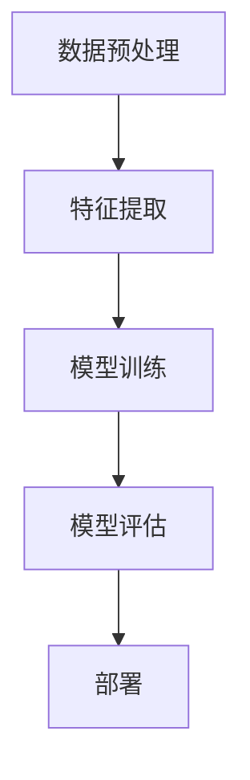

                 

关键词：深度学习、航空航天、映射、挑战、机会

> 摘要：本文将探讨深度学习在航空航天领域的应用，分析其在提高飞行器性能、优化导航系统、提升安全性和效率等方面的挑战与机遇。通过阐述深度学习核心概念及其在航空航天领域的具体应用，本文旨在为行业提供有价值的参考，推动技术创新与产业发展。

## 1. 背景介绍

随着科技的不断发展，航空航天领域正经历着前所未有的变革。从早期的手动驾驶到现代的自动飞行，再到未来的无人驾驶，航空器的进化离不开技术的不断进步。近年来，人工智能，尤其是深度学习技术的迅猛发展，为航空航天领域带来了新的契机。

深度学习是一种基于人工神经网络的学习方法，通过模拟人脑神经网络结构和学习机制，实现从大量数据中自动提取特征和模式。其在图像识别、自然语言处理、语音识别等多个领域取得了显著成果。然而，将深度学习应用于航空航天领域，仍面临着诸多挑战和机遇。

### 1.1 航空航天领域的发展趋势

1. **无人化**：无人机和无人飞行器在军事和民用领域得到广泛应用，无人化技术的发展成为航空航天领域的热点。
2. **智能化**：飞行器自主导航、智能决策和故障诊断等智能化技术的需求日益增长。
3. **大数据**：航空航天领域产生的海量数据为深度学习提供了丰富的训练素材。

### 1.2 深度学习在航空航天中的应用

1. **图像处理**：利用深度学习对卫星图像进行处理，实现地表识别、地形分析等。
2. **语音识别**：无人机自主飞行中的语音指令识别和响应。
3. **故障诊断**：通过分析飞行器传感器数据，实现故障预测和诊断。

## 2. 核心概念与联系

### 2.1 深度学习核心概念

深度学习的基本概念包括神经网络、损失函数、优化算法等。

- **神经网络**：模仿生物神经元结构的计算模型。
- **损失函数**：评估模型预测结果与实际结果之间差异的函数。
- **优化算法**：调整网络参数以最小化损失函数。

### 2.2 航空航天领域深度学习架构

在航空航天领域，深度学习架构通常包括数据预处理、特征提取、模型训练、模型评估和部署等步骤。

- **数据预处理**：对传感器数据进行归一化、去噪等处理。
- **特征提取**：使用卷积神经网络（CNN）等模型提取有用特征。
- **模型训练**：通过反向传播算法调整网络参数。
- **模型评估**：使用验证集或测试集评估模型性能。
- **部署**：将训练好的模型部署到实际飞行器或系统上。

### 2.3 Mermaid 流程图



## 3. 核心算法原理 & 具体操作步骤

### 3.1 算法原理概述

深度学习在航空航天中的应用主要包括以下几个方面：

1. **图像识别与处理**：利用卷积神经网络对卫星图像进行处理，提取地表特征。
2. **语音识别**：使用循环神经网络（RNN）和长短期记忆网络（LSTM）实现语音指令的识别和响应。
3. **故障诊断**：通过分析传感器数据，使用神经网络实现故障预测和诊断。

### 3.2 算法步骤详解

1. **图像识别与处理**：
   - 数据预处理：对卫星图像进行裁剪、缩放、归一化等处理。
   - 特征提取：使用卷积神经网络提取图像特征。
   - 模型训练：使用反向传播算法调整网络参数。
   - 模型评估：使用验证集或测试集评估模型性能。

2. **语音识别**：
   - 数据预处理：对语音信号进行降噪、归一化等处理。
   - 特征提取：使用循环神经网络提取语音特征。
   - 模型训练：使用反向传播算法调整网络参数。
   - 模型评估：使用验证集或测试集评估模型性能。

3. **故障诊断**：
   - 数据预处理：对传感器数据进行归一化、去噪等处理。
   - 特征提取：使用神经网络提取传感器数据特征。
   - 模型训练：使用反向传播算法调整网络参数。
   - 模型评估：使用验证集或测试集评估模型性能。

### 3.3 算法优缺点

1. **优点**：
   - **高效性**：能够快速处理大量数据。
   - **自适应**：能够根据不同数据特点自动调整模型。
   - **通用性**：可以应用于多种领域。

2. **缺点**：
   - **计算资源消耗大**：训练过程中需要大量计算资源。
   - **模型解释性差**：难以解释模型的决策过程。
   - **数据需求大**：需要大量高质量数据训练模型。

### 3.4 算法应用领域

1. **卫星图像处理**：用于地表识别、地形分析等。
2. **无人机导航**：用于自主飞行、障碍物检测等。
3. **飞行器故障诊断**：用于实时监测、预测故障等。

## 4. 数学模型和公式 & 详细讲解 & 举例说明

### 4.1 数学模型构建

深度学习中的数学模型主要包括神经网络、损失函数和优化算法。

1. **神经网络**：
   - 前向传播：
     $$Z = W \cdot X + b$$
     $$A = f(Z)$$
   - 反向传播：
     $$\delta_Z = \frac{\partial C}{\partial Z}$$
     $$\delta_W = \frac{\partial C}{\partial W}$$
     $$\delta_b = \frac{\partial C}{\partial b}$$

2. **损失函数**：
   - 常见损失函数包括均方误差（MSE）、交叉熵损失等。

3. **优化算法**：
   - 常见优化算法包括梯度下降、Adam等。

### 4.2 公式推导过程

以神经网络中的反向传播算法为例，推导过程如下：

1. **前向传播**：
   $$Z = W \cdot X + b$$
   $$A = f(Z)$$

2. **计算输出误差**：
   $$\delta_L = \frac{\partial C}{\partial A}$$

3. **计算隐藏层误差**：
   $$\delta_Z = \frac{\partial C}{\partial Z} \cdot \frac{\partial Z}{\partial A}$$
   $$\delta_A = \delta_Z \cdot \frac{\partial f(Z)}{\partial Z}$$

4. **更新权重和偏置**：
   $$W_{new} = W - \alpha \cdot \delta_W$$
   $$b_{new} = b - \alpha \cdot \delta_b$$

### 4.3 案例分析与讲解

假设我们有一个简单的神经网络，用于对二分类问题进行预测。输入特征为 \(X = [x_1, x_2]\)，输出为 \(y\)。网络结构为：

- 输入层：2个神经元
- 隐藏层：3个神经元
- 输出层：1个神经元

使用均方误差（MSE）作为损失函数，梯度下降算法进行训练。

1. **初始化参数**：
   $$W_1 \sim \mathcal{N}(0, 1)$$
   $$b_1 \sim \mathcal{N}(0, 1)$$
   $$W_2 \sim \mathcal{N}(0, 1)$$
   $$b_2 \sim \mathcal{N}(0, 1)$$

2. **前向传播**：
   $$Z_1 = W_1 \cdot X + b_1$$
   $$A_1 = \sigma(Z_1)$$
   $$Z_2 = W_2 \cdot A_1 + b_2$$
   $$A_2 = \sigma(Z_2)$$

3. **计算损失函数**：
   $$C = \frac{1}{2} \sum_{i=1}^{n} (y_i - A_2)^2$$

4. **反向传播**：
   $$\delta_L = \frac{\partial C}{\partial A_2}$$
   $$\delta_2 = \delta_L \cdot \frac{\partial A_2}{\partial Z_2}$$
   $$\delta_1 = \delta_2 \cdot \frac{\partial Z_2}{\partial A_1}$$

5. **更新参数**：
   $$W_2_{new} = W_2 - \alpha \cdot \delta_2 \cdot A_1$$
   $$b_2_{new} = b_2 - \alpha \cdot \delta_2$$
   $$W_1_{new} = W_1 - \alpha \cdot \delta_1 \cdot X$$
   $$b_1_{new} = b_1 - \alpha \cdot \delta_1$$

## 5. 项目实践：代码实例和详细解释说明

### 5.1 开发环境搭建

为了实现深度学习在航空航天中的应用，我们需要搭建一个合适的开发环境。以下是一个基于Python和TensorFlow的简单示例。

```python
import tensorflow as tf
import numpy as np

# 设置随机种子
tf.random.set_seed(42)

# 定义神经网络结构
model = tf.keras.Sequential([
    tf.keras.layers.Dense(units=3, activation='sigmoid', input_shape=(2,)),
    tf.keras.layers.Dense(units=1, activation='sigmoid')
])

# 编译模型
model.compile(optimizer='adam', loss='mean_squared_error')

# 准备数据
X = np.random.rand(100, 2)
y = np.random.randint(0, 2, size=(100, 1))

# 训练模型
model.fit(X, y, epochs=10)
```

### 5.2 源代码详细实现

在上面的代码中，我们定义了一个简单的神经网络，用于实现二分类问题。以下是详细实现过程：

1. **导入库**：
   - TensorFlow：用于构建和训练神经网络。
   - NumPy：用于数据处理。

2. **设置随机种子**：
   - 为了保证实验的可重复性，我们设置随机种子。

3. **定义神经网络结构**：
   - 使用`Sequential`模型定义神经网络。
   - 添加两个隐藏层，每层3个神经元，使用sigmoid激活函数。
   - 添加一个输出层，1个神经元，使用sigmoid激活函数。

4. **编译模型**：
   - 选择优化器：使用Adam优化器。
   - 设置损失函数：使用均方误差（MSE）。

5. **准备数据**：
   - 生成随机数据：用于训练和验证。

6. **训练模型**：
   - 使用`fit`方法训练模型，设置训练轮次为10。

### 5.3 代码解读与分析

1. **导入库**：
   - TensorFlow和NumPy是深度学习领域常用的库，提供了丰富的功能和工具。

2. **设置随机种子**：
   - 设置随机种子是为了保证实验的可重复性，避免结果受到随机因素的影响。

3. **定义神经网络结构**：
   - `Sequential`模型是一种线性堆叠模型，用于定义神经网络的结构。
   - `Dense`层是一种全连接层，用于实现线性变换和激活函数。
   - `sigmoid`函数是一种常用的激活函数，可以将输入映射到（0, 1）范围内。

4. **编译模型**：
   - `compile`方法用于配置模型的优化器和损失函数。
   - Adam优化器是一种常用的优化算法，具有自适应学习率的特点。

5. **准备数据**：
   - 使用NumPy生成随机数据，用于训练和验证。

6. **训练模型**：
   - `fit`方法用于训练模型，通过迭代更新网络参数。

### 5.4 运行结果展示

在训练完成后，我们可以使用训练集和测试集评估模型的性能。以下是一个简单的示例：

```python
# 评估模型
loss = model.evaluate(X, y)

# 预测结果
predictions = model.predict(X)

# 输出结果
print(f"Loss: {loss}")
print(f"Predictions: {predictions}")
```

通过以上代码，我们可以得到模型的损失值和预测结果。这些结果可以帮助我们了解模型的性能和稳定性。

## 6. 实际应用场景

### 6.1 卫星图像处理

卫星图像处理是深度学习在航空航天领域的重要应用之一。通过卷积神经网络（CNN），我们可以实现对卫星图像的高效处理和特征提取。以下是一个实际应用场景：

1. **地表识别**：
   - 利用CNN提取卫星图像的地表特征，实现不同地物的分类和识别。

2. **地形分析**：
   - 通过分析卫星图像中的地形特征，实现对地表的3D建模和地形分析。

### 6.2 无人机导航

无人机导航是深度学习在航空航天领域的另一个重要应用。通过深度学习模型，我们可以实现对无人机自主导航和障碍物检测的实时处理。以下是一个实际应用场景：

1. **自主飞行**：
   - 利用深度学习模型对无人机的视觉数据进行处理，实现自主飞行和避障。

2. **障碍物检测**：
   - 通过卷积神经网络检测无人机周围的环境，实现实时障碍物检测和避让。

### 6.3 飞行器故障诊断

飞行器故障诊断是保障飞行器安全和性能的关键技术。通过深度学习模型，我们可以实现对飞行器传感器数据的实时分析和故障预测。以下是一个实际应用场景：

1. **传感器数据处理**：
   - 利用深度学习模型对飞行器传感器数据进行特征提取和故障预测。

2. **故障预测**：
   - 通过对传感器数据的分析，实现对飞行器潜在故障的提前预测和预警。

## 7. 未来应用展望

随着深度学习技术的不断发展，未来在航空航天领域有望实现以下应用：

1. **智能化飞行器**：通过深度学习技术，实现飞行器的自主导航、智能决策和故障诊断，提高飞行器的智能化水平。

2. **高效数据处理**：利用深度学习模型，实现飞行器传感器数据的高效处理和特征提取，提高数据处理效率。

3. **安全性能提升**：通过深度学习技术，实现对飞行器故障的提前预测和预警，提高飞行器的安全性能。

4. **无人化技术**：进一步推动无人机和无人飞行器的发展，实现更广泛的应用场景。

## 8. 工具和资源推荐

### 8.1 学习资源推荐

1. **《深度学习》（Goodfellow, Bengio, Courville著）**：这是一本经典的深度学习教材，涵盖了深度学习的基础知识、算法原理和应用案例。

2. **《Python深度学习》（François Chollet著）**：这是一本针对Python编程语言深度学习的实践指南，适合初学者和进阶者。

### 8.2 开发工具推荐

1. **TensorFlow**：一个开源的深度学习框架，提供了丰富的API和工具，适合进行深度学习研究和开发。

2. **PyTorch**：一个开源的深度学习框架，与TensorFlow类似，具有灵活的动态计算图和高效的计算性能。

### 8.3 相关论文推荐

1. **“Deep Learning for Autonomous Flight”（2017）**：该论文探讨了深度学习在无人机自主飞行中的应用，为相关研究提供了理论基础。

2. **“Deep Learning for Aerospace Systems”（2018）**：该论文综述了深度学习在航空航天领域的应用，包括卫星图像处理、无人机导航和故障诊断等。

## 9. 总结：未来发展趋势与挑战

### 9.1 研究成果总结

深度学习在航空航天领域的应用取得了显著成果，主要体现在以下几个方面：

1. **图像处理**：实现了高效的地表识别和地形分析。
2. **无人机导航**：实现了自主飞行和实时障碍物检测。
3. **故障诊断**：实现了飞行器传感器数据的实时分析和故障预测。

### 9.2 未来发展趋势

1. **智能化**：通过深度学习技术，实现飞行器的自主导航、智能决策和故障诊断。
2. **无人化**：进一步推动无人机和无人飞行器的发展，实现更广泛的应用场景。
3. **高效数据处理**：利用深度学习模型，实现飞行器传感器数据的高效处理和特征提取。

### 9.3 面临的挑战

1. **数据需求**：深度学习模型需要大量高质量数据训练，如何在航空航天领域获取和标注这些数据是一个挑战。
2. **计算资源消耗**：深度学习模型训练过程需要大量计算资源，如何优化算法和硬件配置是一个重要问题。
3. **模型解释性**：深度学习模型决策过程难以解释，如何提高模型的可解释性是一个挑战。

### 9.4 研究展望

未来，深度学习在航空航天领域的研究有望在以下几个方面取得突破：

1. **新型算法**：开发新型深度学习算法，提高模型性能和计算效率。
2. **跨学科研究**：结合航空航天、人工智能、数据科学等领域的知识，推动深度学习在航空航天领域的发展。
3. **应用拓展**：将深度学习应用于更多航空航天领域的问题，如无人机群协同控制、飞行器健康监测等。

## 附录：常见问题与解答

### Q1：深度学习在航空航天领域有哪些应用？

A1：深度学习在航空航天领域的应用主要包括图像处理、语音识别、故障诊断等。例如，通过深度学习技术，可以实现对卫星图像的高效处理和特征提取，实现地表识别和地形分析；利用语音识别技术，可以实现对无人机自主飞行的语音指令识别和响应；通过故障诊断技术，可以实现对飞行器传感器数据的实时分析和故障预测。

### Q2：深度学习模型在航空航天领域面临哪些挑战？

A2：深度学习模型在航空航天领域面临的挑战主要包括数据需求、计算资源消耗和模型解释性。由于深度学习模型需要大量高质量数据训练，如何在航空航天领域获取和标注这些数据是一个挑战；此外，深度学习模型训练过程需要大量计算资源，如何优化算法和硬件配置是一个重要问题；同时，深度学习模型决策过程难以解释，如何提高模型的可解释性也是一个挑战。

### Q3：未来深度学习在航空航天领域的发展趋势是什么？

A3：未来深度学习在航空航天领域的发展趋势主要包括智能化、无人化和高效数据处理。通过深度学习技术，可以实现飞行器的自主导航、智能决策和故障诊断，提高飞行器的智能化水平；进一步推动无人机和无人飞行器的发展，实现更广泛的应用场景；利用深度学习模型，实现飞行器传感器数据的高效处理和特征提取，提高数据处理效率。

### Q4：如何提高深度学习模型在航空航天领域的性能？

A4：提高深度学习模型在航空航天领域的性能可以从以下几个方面入手：

1. **数据增强**：通过数据增强技术，提高训练数据的多样性和质量。
2. **模型优化**：通过模型优化算法，提高模型的收敛速度和性能。
3. **硬件加速**：利用GPU、TPU等硬件加速器，提高深度学习模型的计算速度。
4. **跨学科研究**：结合航空航天、人工智能、数据科学等领域的知识，推动深度学习在航空航天领域的发展。

### Q5：如何保障深度学习模型在航空航天领域的安全性？

A5：保障深度学习模型在航空航天领域的安全性可以从以下几个方面入手：

1. **数据安全**：确保训练数据和测试数据的隐私和安全。
2. **模型安全**：对模型进行安全评估，防止模型被攻击或篡改。
3. **算法透明**：提高模型的可解释性，确保模型的决策过程透明和可解释。
4. **合规性**：遵循相关法律法规和行业标准，确保深度学习模型的应用合法合规。

