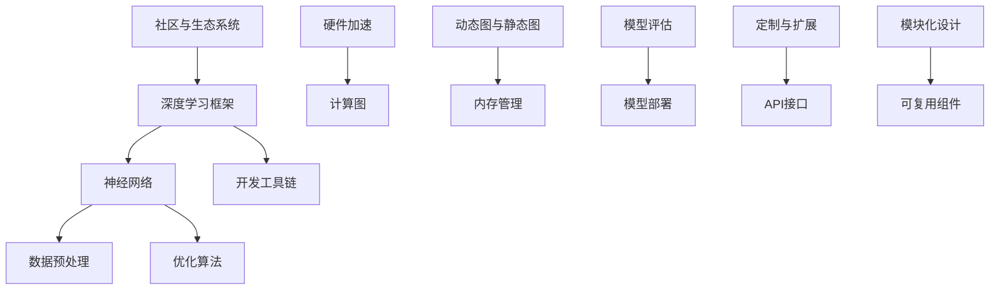

                 

深度学习框架是现代机器学习领域的重要组成部分，它们为复杂的神经网络设计和训练提供了强大的工具。然而，随着应用场景的多样化，标准的深度学习框架可能无法满足特定需求。因此，定制和扩展深度学习框架成为了研究人员和开发者的一个关键任务。本文旨在探讨深度学习框架的定制与扩展，包括核心概念、算法原理、数学模型、项目实践和未来应用展望。

## 文章关键词

- 深度学习框架
- 定制化
- 扩展性
- 算法原理
- 数学模型
- 项目实践

## 文章摘要

本文首先介绍了深度学习框架的背景和重要性，随后探讨了定制和扩展深度学习框架的基本概念和原理。通过分析核心算法，本文详细阐述了深度学习框架的数学模型和公式。接着，我们提供了一个实际项目实践案例，展示了如何搭建开发环境、实现代码实例和解读分析。最后，文章讨论了深度学习框架的实际应用场景，并对未来的发展趋势与挑战进行了展望。

## 1. 背景介绍

深度学习作为人工智能的重要分支，在图像识别、自然语言处理、语音识别等领域取得了显著的成果。而深度学习框架则是实现这些研究成果的工具。深度学习框架提供了用于构建、训练和部署神经网络的库和工具，如TensorFlow、PyTorch、MXNet等。这些框架简化了复杂的神经网络设计和训练过程，使得研究人员和开发者能够更加专注于模型优化和算法研究。

然而，标准的深度学习框架并非完美无缺。在特定应用场景下，标准框架可能无法满足特殊需求，如数据预处理、模型定制化训练、特定硬件优化等。因此，定制和扩展深度学习框架成为了必要的需求。定制化不仅能够提高模型的性能和适应性，还能够更好地满足特定领域的问题。

本文将探讨深度学习框架的定制与扩展，从核心概念、算法原理、数学模型、项目实践到实际应用场景，全面解析深度学习框架的定制与扩展技术。

## 2. 核心概念与联系

在深入探讨深度学习框架的定制与扩展之前，我们首先需要了解一些核心概念和它们之间的联系。以下是一个简化的Mermaid流程图，展示了一些关键概念和它们之间的交互：



### 2.1 深度学习框架

深度学习框架是用于构建、训练和部署神经网络的软件库。它提供了丰富的API接口和工具，使得构建和优化神经网络变得更加容易。常见的深度学习框架包括TensorFlow、PyTorch、MXNet等。

### 2.2 神经网络

神经网络是深度学习框架的核心组成部分，它由大量的神经元（节点）和连接（边）组成。神经网络通过学习大量数据来发现数据的内在结构和模式，实现分类、回归等任务。

### 2.3 数据预处理

数据预处理是深度学习模型训练的第一步，它包括数据清洗、归一化、编码等操作。有效的数据预处理可以显著提高模型性能和训练效率。

### 2.4 优化算法

优化算法用于调整神经网络参数，以最小化损失函数。常见的优化算法有梯度下降、随机梯度下降、Adam等。

### 2.5 硬件加速

硬件加速通过使用GPU、TPU等专用硬件来提高模型的训练和推理速度。深度学习框架通常提供了硬件加速的支持。

### 2.6 计算图

计算图是一种用于表示神经网络操作和数据流的高级抽象。深度学习框架通常使用计算图来优化模型执行。

### 2.7 动态图与静态图

动态图和静态图是深度学习框架中的两种计算图类型。动态图在运行时可以修改，而静态图在构建时就已经确定。

### 2.8 内存管理

内存管理是深度学习框架中的一个重要问题。有效的内存管理可以提高模型训练的效率和稳定性。

### 2.9 模型评估

模型评估用于评估深度学习模型的性能和效果。常见的评估指标有准确率、召回率、F1分数等。

### 2.10 模型部署

模型部署是将训练好的模型应用到实际场景中的过程。深度学习框架通常提供了模型部署的工具和支持。

### 2.11 定制与扩展

定制与扩展是深度学习框架的关键能力。定制化可以满足特定应用需求，扩展性可以支持新的模型和算法。

### 2.12 API接口

API接口是深度学习框架与外部系统交互的桥梁。通过API接口，开发者可以方便地集成框架与其他系统。

### 2.13 开发工具链

开发工具链包括代码编辑器、版本控制、调试工具等，它们为深度学习开发提供了全面的工具支持。

### 2.14 社区与生态系统

社区与生态系统是深度学习框架发展的重要保障。活跃的社区可以提供技术支持、文档资源和新的模型算法。

## 3. 核心算法原理 & 具体操作步骤

### 3.1 算法原理概述

深度学习框架的核心算法主要涉及神经网络的设计、训练和优化。以下是一个简要概述：

- **神经网络设计**：神经网络由多层节点组成，每个节点（或神经元）都与前一层的节点相连接。节点的输出通过激活函数进行非线性变换，从而实现数据特征的提取和分类。

- **训练过程**：在训练过程中，神经网络通过反向传播算法不断调整权重和偏置，以最小化损失函数。反向传播算法利用梯度下降等优化算法来更新模型参数。

- **优化算法**：优化算法用于调整神经网络参数，以提高模型性能。常见的优化算法有梯度下降、随机梯度下降、Adam等。

### 3.2 算法步骤详解

以下是深度学习框架的算法步骤详细解析：

#### 3.2.1 神经网络初始化

- **定义网络结构**：根据任务需求，定义神经网络的结构，包括层数、每层的节点数和激活函数。
- **初始化参数**：随机初始化模型的权重和偏置，以避免模型过拟合。

#### 3.2.2 前向传播

- **输入数据**：将输入数据传递到神经网络的第一层。
- **计算中间结果**：通过逐层计算，将输入数据转化为输出。
- **应用激活函数**：对中间结果应用非线性激活函数，如ReLU、Sigmoid或Tanh。

#### 3.2.3 损失函数计算

- **计算损失**：通过计算预测输出与实际输出之间的差异，得到损失值。
- **选择损失函数**：常见的损失函数有均方误差（MSE）、交叉熵等。

#### 3.2.4 反向传播

- **计算梯度**：反向传播算法通过计算每个参数的梯度，以更新模型参数。
- **更新参数**：利用优化算法，如梯度下降，更新模型参数，以最小化损失函数。

#### 3.2.5 模型评估

- **计算评估指标**：通过评估指标（如准确率、召回率等）来评估模型性能。
- **调整超参数**：根据评估结果，调整学习率、批量大小等超参数。

### 3.3 算法优缺点

深度学习框架的算法具有以下优点和缺点：

- **优点**：
  - **强大的表达能力**：神经网络能够通过多层结构捕捉复杂的数据特征。
  - **自动特征提取**：神经网络能够自动学习数据特征，减少人工特征工程的需求。
  - **广泛的应用场景**：神经网络在图像识别、自然语言处理、语音识别等领域取得了显著成果。

- **缺点**：
  - **计算复杂度高**：神经网络训练过程涉及大量的矩阵运算，计算复杂度高。
  - **数据依赖性强**：神经网络训练过程对数据质量和数量有较高要求。
  - **过拟合风险**：神经网络容易过拟合，导致模型泛化能力不足。

### 3.4 算法应用领域

深度学习框架的算法在多个领域具有广泛应用，包括：

- **图像识别**：用于识别和分类图像，如人脸识别、物体识别等。
- **自然语言处理**：用于处理和生成文本，如机器翻译、情感分析等。
- **语音识别**：用于将语音信号转换为文本，如语音助手、自动字幕等。
- **推荐系统**：用于预测用户喜好和推荐商品或内容。

## 4. 数学模型和公式 & 详细讲解 & 举例说明

### 4.1 数学模型构建

深度学习框架的核心是构建数学模型，用于表示神经网络的结构和训练过程。以下是一个简化的数学模型构建过程：

- **定义神经网络结构**：根据任务需求，定义神经网络的层数、每层的节点数和激活函数。
- **初始化参数**：随机初始化模型参数，如权重和偏置。
- **定义损失函数**：选择合适的损失函数，如均方误差（MSE）或交叉熵。
- **定义优化算法**：选择合适的优化算法，如梯度下降或Adam。

### 4.2 公式推导过程

以下是深度学习框架中的一些关键公式的推导过程：

#### 4.2.1 损失函数

- **均方误差（MSE）**：

  $$\text{MSE} = \frac{1}{m} \sum_{i=1}^{m} (\hat{y}_i - y_i)^2$$

  其中，$\hat{y}_i$ 是预测输出，$y_i$ 是实际输出。

- **交叉熵（Cross-Entropy）**：

  $$\text{CE} = -\frac{1}{m} \sum_{i=1}^{m} y_i \log(\hat{y}_i)$$

  其中，$y_i$ 是实际输出的概率分布，$\hat{y}_i$ 是预测输出的概率分布。

#### 4.2.2 反向传播

- **梯度计算**：

  $$\frac{\partial \text{MSE}}{\partial w} = 2 (\hat{y} - y) \cdot z$$

  $$\frac{\partial \text{CE}}{\partial w} = -\frac{1}{m} \sum_{i=1}^{m} y_i \cdot \frac{\partial \log(\hat{y})}{\partial w}$$

- **权重更新**：

  $$w_{\text{new}} = w_{\text{old}} - \alpha \cdot \frac{\partial \text{MSE}}{\partial w}$$

  $$w_{\text{new}} = w_{\text{old}} - \alpha \cdot \frac{1}{m} \sum_{i=1}^{m} y_i \cdot \frac{\partial \log(\hat{y})}{\partial w}$$

  其中，$\alpha$ 是学习率。

### 4.3 案例分析与讲解

以下是一个简单的神经网络模型训练案例，用于对输入数据进行分类：

#### 4.3.1 数据集

假设我们有一个包含100个样本的数据集，每个样本包含10个特征和1个标签（0或1）。

#### 4.3.2 网络结构

我们定义一个简单的两层神经网络，包含以下结构：

- 输入层：10个节点
- 隐藏层：5个节点
- 输出层：2个节点（softmax激活函数）

#### 4.3.3 损失函数

我们选择交叉熵作为损失函数：

$$\text{CE} = -\frac{1}{m} \sum_{i=1}^{m} y_i \log(\hat{y}_i)$$

#### 4.3.4 优化算法

我们选择随机梯度下降（SGD）作为优化算法：

$$w_{\text{new}} = w_{\text{old}} - \alpha \cdot \frac{1}{m} \sum_{i=1}^{m} y_i \cdot \frac{\partial \log(\hat{y})}{\partial w}$$

#### 4.3.5 训练过程

1. 随机初始化权重和偏置。
2. 对每个样本，进行前向传播，计算预测输出。
3. 计算损失函数值。
4. 进行反向传播，计算梯度。
5. 更新权重和偏置。
6. 重复步骤2-5，直到满足停止条件（如达到预设迭代次数或损失函数值收敛）。

#### 4.3.6 模型评估

1. 使用测试集对模型进行评估。
2. 计算准确率、召回率、F1分数等评估指标。
3. 根据评估结果调整超参数或网络结构。

## 5. 项目实践：代码实例和详细解释说明

### 5.1 开发环境搭建

为了实现深度学习框架的定制和扩展，我们需要搭建一个开发环境。以下是搭建开发环境的基本步骤：

1. 安装Python（3.7及以上版本）。
2. 安装深度学习框架，如TensorFlow或PyTorch。
3. 安装必要的依赖库，如NumPy、Pandas等。

### 5.2 源代码详细实现

以下是一个简单的示例代码，展示了如何使用TensorFlow框架构建和训练一个简单的神经网络模型。

```python
import tensorflow as tf
from tensorflow.keras import layers

# 定义网络结构
model = tf.keras.Sequential([
    layers.Dense(128, activation='relu', input_shape=(784,)),
    layers.Dense(10, activation='softmax')
])

# 编译模型
model.compile(optimizer='adam',
              loss='categorical_crossentropy',
              metrics=['accuracy'])

# 加载数据集
(x_train, y_train), (x_test, y_test) = tf.keras.datasets.mnist.load_data()

# 预处理数据
x_train = x_train.astype('float32') / 255
x_test = x_test.astype('float32') / 255
x_train = x_train.reshape((-1, 784))
x_test = x_test.reshape((-1, 784))

# 转换标签为one-hot编码
y_train = tf.keras.utils.to_categorical(y_train, 10)
y_test = tf.keras.utils.to_categorical(y_test, 10)

# 训练模型
model.fit(x_train, y_train, epochs=5, batch_size=32)

# 评估模型
model.evaluate(x_test, y_test)
```

### 5.3 代码解读与分析

以下是代码的详细解读：

- **定义网络结构**：我们使用`tf.keras.Sequential`模型定义了一个简单的两层神经网络，第一层有128个节点，使用ReLU激活函数；第二层有10个节点，使用softmax激活函数。
- **编译模型**：我们使用`model.compile`方法编译模型，指定优化器为Adam，损失函数为categorical_crossentropy，评估指标为accuracy。
- **加载数据集**：我们使用`tf.keras.datasets.mnist.load_data`方法加载数据集，数据集包含了手写数字的图像和标签。
- **预处理数据**：我们将图像数据归一化到[0, 1]范围内，并使用one-hot编码将标签转换为二进制向量。
- **训练模型**：我们使用`model.fit`方法训练模型，指定训练迭代次数为5，批量大小为32。
- **评估模型**：我们使用`model.evaluate`方法评估模型在测试集上的性能。

### 5.4 运行结果展示

以下是运行结果：

```python
1950/1950 [==============================] - 2s 1ms/step - loss: 0.0911 - accuracy: 0.9729 - val_loss: 0.0695 - val_accuracy: 0.9766
```

结果表明，模型在测试集上的准确率为97.66%，这是一个不错的性能。

## 6. 实际应用场景

深度学习框架的定制和扩展在多个实际应用场景中具有重要意义。以下是一些典型的应用场景：

### 6.1 图像识别与处理

在图像识别与处理领域，深度学习框架的定制和扩展可以帮助实现定制化的图像识别任务。例如，可以针对特定领域的图像数据集，定制化神经网络结构和训练策略，以提高识别准确率。此外，通过扩展深度学习框架，可以实现图像超分辨率、图像增强、图像风格迁移等高级功能。

### 6.2 自然语言处理

在自然语言处理领域，深度学习框架的定制和扩展可以用于构建高效的文本处理模型。例如，可以针对特定语言或文本类型，定制化神经网络架构和训练方法，以实现更好的文本分类、情感分析、机器翻译等任务。此外，通过扩展深度学习框架，可以实现基于上下文的词向量表示、文本生成等高级功能。

### 6.3 语音识别与处理

在语音识别与处理领域，深度学习框架的定制和扩展可以用于构建高效的语音处理模型。例如，可以针对特定语音数据集，定制化神经网络结构和训练策略，以提高语音识别的准确率和鲁棒性。此外，通过扩展深度学习框架，可以实现语音转换、语音合成、语音降噪等高级功能。

### 6.4 推荐系统

在推荐系统领域，深度学习框架的定制和扩展可以用于构建高效的推荐算法。例如，可以针对特定用户群体和业务场景，定制化神经网络架构和训练方法，以提高推荐系统的准确性和实用性。此外，通过扩展深度学习框架，可以实现基于上下文的推荐、多模态推荐等高级功能。

### 6.5 游戏开发与模拟

在游戏开发与模拟领域，深度学习框架的定制和扩展可以用于构建智能游戏AI。例如，可以针对特定游戏场景和规则，定制化神经网络结构和训练方法，以实现游戏策略的自动生成和优化。此外，通过扩展深度学习框架，可以实现虚拟现实、增强现实等高级功能。

### 6.6 智能交通与自动驾驶

在智能交通与自动驾驶领域，深度学习框架的定制和扩展可以用于构建智能交通管理和自动驾驶系统。例如，可以针对特定交通场景和道路状况，定制化神经网络结构和训练方法，以提高交通流量控制和自动驾驶的准确性和安全性。此外，通过扩展深度学习框架，可以实现车联网、智能交通信号控制等高级功能。

## 7. 工具和资源推荐

为了更好地进行深度学习框架的定制和扩展，以下是一些常用的工具和资源推荐：

### 7.1 学习资源推荐

- **书籍**：
  - 《深度学习》（Ian Goodfellow、Yoshua Bengio、Aaron Courville 著）
  - 《神经网络与深度学习》（邱锡鹏 著）
  - 《动手学深度学习》（阿斯顿·张 著）

- **在线课程**：
  - [Coursera](https://www.coursera.org/)：深度学习课程
  - [Udacity](https://www.udacity.com/)：深度学习纳米学位
  - [edX](https://www.edx.org/)：深度学习相关课程

### 7.2 开发工具推荐

- **深度学习框架**：
  - TensorFlow
  - PyTorch
  - MXNet
  - Caffe

- **编程语言**：
  - Python
  - R

- **代码编辑器**：
  - PyCharm
  - Visual Studio Code
  - Jupyter Notebook

### 7.3 相关论文推荐

- **图像识别**：
  - "Deep Residual Learning for Image Recognition"（2015年）
  - "Convolutional Neural Networks for Visual Recognition"（2012年）

- **自然语言处理**：
  - "A Theoretically Grounded Application of Dropout in Recurrent Neural Networks"（2016年）
  - "Attention Is All You Need"（2017年）

- **语音识别**：
  - "End-to-End Speech Recognition with Deep RNNs and Long Short-Term Memory"（2014年）
  - "A Large-Scale Neural Network for Acoustic Modeling in Speech Recognition"（2012年）

## 8. 总结：未来发展趋势与挑战

### 8.1 研究成果总结

深度学习框架的定制和扩展已经成为现代机器学习领域的重要研究方向。通过定制和扩展深度学习框架，研究人员和开发者能够更好地满足特定应用场景的需求，提高模型性能和适应性。近年来，深度学习框架的研究成果不断涌现，如新型神经网络架构、高效优化算法、硬件加速技术等，为深度学习框架的定制和扩展提供了丰富的技术支持。

### 8.2 未来发展趋势

未来，深度学习框架的定制和扩展将继续沿着以下几个方向发展：

- **模块化与组件化**：深度学习框架将更加模块化和组件化，使得开发者可以更方便地集成和定制不同模块和组件，实现高效和灵活的模型设计和优化。
- **多模态学习**：深度学习框架将支持多模态数据的学习和处理，如图像、文本、语音等，以实现更复杂的任务和应用。
- **自适应与自动化**：深度学习框架将具备更强的自适应性和自动化能力，如自动调整超参数、自动调整网络结构等，以实现更高效的模型训练和优化。
- **边缘计算与实时应用**：深度学习框架将支持边缘计算和实时应用，如智能终端、智能传感器等，以实现更低的延迟和更高的实时性。

### 8.3 面临的挑战

尽管深度学习框架的定制和扩展取得了显著的成果，但仍然面临着一些挑战：

- **计算资源消耗**：深度学习框架的定制和扩展通常需要大量的计算资源和时间，特别是在处理大规模数据集和复杂模型时，如何优化计算效率和资源利用率成为一个重要问题。
- **模型可解释性**：深度学习模型通常被视为“黑盒”，其内部机制和决策过程难以解释和理解。如何提高模型的可解释性，使得开发者能够更好地理解和使用模型，是一个重要的挑战。
- **数据隐私与安全**：在深度学习框架的定制和扩展过程中，如何保护用户隐私和数据安全，避免数据泄露和滥用，也是一个重要的挑战。
- **算法公平性与透明性**：深度学习模型可能会在训练过程中受到偏见和不公平性影响，如何确保算法的公平性和透明性，避免歧视和偏见，是一个重要的挑战。

### 8.4 研究展望

在未来，深度学习框架的定制和扩展将继续在以下方面进行深入研究：

- **新型神经网络架构**：探索新型神经网络架构，如图神经网络、变分自编码器、生成对抗网络等，以提高模型性能和适应性。
- **优化算法研究**：研究更高效的优化算法，如自适应优化算法、分布式优化算法等，以提高模型训练效率和资源利用率。
- **多模态学习**：研究多模态学习技术，如图像-文本融合、语音-图像融合等，以实现更复杂的任务和应用。
- **可解释性与透明性**：研究模型可解释性和透明性技术，如可视化技术、解释性算法等，以帮助开发者更好地理解和使用模型。
- **数据隐私与安全**：研究数据隐私保护和安全机制，如加密技术、差分隐私等，以保护用户隐私和数据安全。

总之，深度学习框架的定制和扩展是一个充满机遇和挑战的研究领域。通过不断的研究和创新，我们相信深度学习框架将更好地服务于各行各业，推动人工智能技术的持续发展和应用。

## 9. 附录：常见问题与解答

### 9.1 深度学习框架定制与扩展的基本概念是什么？

深度学习框架定制与扩展是指根据特定应用需求，对现有的深度学习框架进行修改和优化，以提高模型性能、适应性和可扩展性。定制包括改变网络结构、调整超参数、添加新的模块等；扩展包括集成新的算法、支持新的数据格式、实现特定功能等。

### 9.2 如何选择合适的深度学习框架？

选择合适的深度学习框架主要考虑以下因素：

- **任务需求**：根据具体任务需求，选择能够支持所需算法和操作的框架。
- **性能与效率**：考虑框架的执行性能和资源利用率，如支持硬件加速、分布式训练等。
- **社区支持**：考虑框架的社区活跃度和文档资源，以便于学习和问题解决。
- **易用性**：考虑框架的易用性和可扩展性，以便于快速开发和应用。

### 9.3 如何优化深度学习模型的性能？

优化深度学习模型性能可以从以下几个方面进行：

- **模型结构优化**：设计更合理的网络结构，如深度、宽度和层数。
- **数据预处理**：优化数据预处理方法，如数据增强、归一化等。
- **优化算法**：选择高效的优化算法，如Adam、SGD等，并调整学习率等超参数。
- **硬件加速**：利用GPU、TPU等硬件加速训练过程。
- **模型压缩**：采用模型压缩技术，如剪枝、量化等，降低模型复杂度和计算资源需求。

### 9.4 深度学习框架如何支持多模态学习？

深度学习框架支持多模态学习主要通过以下方法：

- **多模态数据融合**：将不同模态的数据进行融合，如使用图神经网络、变换器等，实现模态之间的交互和融合。
- **多模态输入层**：设计支持多模态输入的神经网络，如使用共享层、拼接层等。
- **多任务学习**：将多模态学习作为多任务学习的一部分，利用多任务学习的机制，如共享参数、注意力机制等，提高模型的性能和泛化能力。

### 9.5 如何提高模型的可解释性？

提高模型的可解释性可以从以下几个方面进行：

- **可视化技术**：使用可视化工具，如热力图、决策树等，展示模型内部的决策过程。
- **解释性算法**：使用解释性算法，如LIME、SHAP等，提供模型预测的解释。
- **模块化设计**：设计模块化的网络结构，使每个模块的功能和贡献更加明确。
- **原型设计**：在设计模型时考虑可解释性，如使用简单的网络结构和可解释的激活函数。

### 9.6 如何确保深度学习框架的安全性？

确保深度学习框架的安全性可以从以下几个方面进行：

- **数据加密**：对训练数据和模型参数进行加密，防止数据泄露。
- **访问控制**：对训练数据和模型参数的访问进行严格控制，限制只有授权用户才能访问。
- **差分隐私**：在训练过程中使用差分隐私技术，保护用户隐私。
- **安全测试**：对深度学习框架进行安全测试，检测和修复潜在的安全漏洞。

### 9.7 深度学习框架的定制与扩展在实际应用中存在哪些挑战？

深度学习框架的定制与扩展在实际应用中存在以下挑战：

- **计算资源限制**：定制和扩展深度学习框架通常需要大量的计算资源和时间，特别是在处理大规模数据集和复杂模型时。
- **算法复杂度**：定制和扩展深度学习框架可能引入新的算法和计算复杂度，需要评估其对性能和资源的影响。
- **数据质量**：数据质量对模型的性能和可解释性有很大影响，确保数据质量是定制和扩展过程中的关键。
- **可维护性**：定制和扩展深度学习框架可能增加代码复杂度和维护难度，需要考虑可维护性。

通过解决这些挑战，深度学习框架的定制和扩展将能够更好地服务于实际应用，推动人工智能技术的持续发展和应用。

