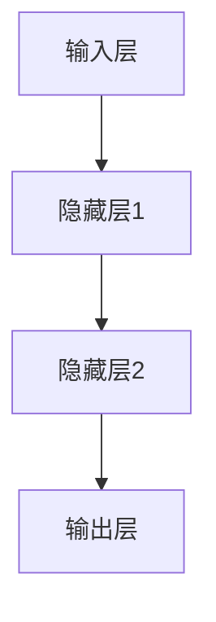

                 

关键词：神经网络、游戏AI、映射、创新实践、深度学习、AI技术、游戏开发

> 摘要：本文将探讨神经网络在游戏AI领域的创新实践。通过对映射原理的深入理解，我们将分析如何将神经网络应用于游戏AI中，以实现智能化的游戏行为和交互。文章将详细阐述神经网络的算法原理、数学模型、实际应用场景，并通过具体的代码实例进行解释说明。最后，我们将展望游戏AI的未来发展趋势，并探讨其面临的挑战。

## 1. 背景介绍

### 1.1 游戏AI的起源与发展

游戏AI是指利用人工智能技术，为游戏中的虚拟角色赋予智能行为和决策能力的系统。随着计算机技术和人工智能的快速发展，游戏AI逐渐成为游戏开发中的重要组成部分。早期的游戏AI主要基于规则系统，通过预设的规则来实现简单的智能行为。然而，随着游戏复杂度的提高，规则系统逐渐暴露出其局限性，无法应对多变和复杂的情况。因此，研究人员开始探索使用更强大的算法来提升游戏AI的智能水平。

### 1.2 神经网络在游戏AI中的应用

神经网络作为一种模拟人脑神经元连接的算法，具有强大的学习和自适应能力。自20世纪80年代以来，神经网络在图像识别、语音识别、自然语言处理等领域的取得了显著的成果。随着深度学习技术的发展，神经网络在游戏AI中的应用也得到了广泛关注。通过将神经网络引入游戏AI，可以实现更复杂、更智能的游戏行为，提升游戏的趣味性和挑战性。

## 2. 核心概念与联系

### 2.1 神经网络的原理与架构

神经网络由大量神经元（节点）组成，这些神经元通过权重连接形成网络。每个神经元接收来自其他神经元的输入信号，并对其进行加权求和处理，最终产生输出。神经网络的学习过程就是不断调整权重，使得网络的输出能够逼近期望的目标。

神经网络的架构可以分为前向传播和反向传播两个阶段。前向传播是指输入信号从输入层经过多个隐藏层，最终传递到输出层的过程。反向传播是指根据输出层与期望输出的误差，通过反向传递误差信号，更新各层的权重。

### 2.2 映射原理在游戏AI中的应用

映射原理是指将一个输入空间映射到一个输出空间，使得输入空间中的每个元素都能在输出空间中找到对应的元素。在游戏AI中，映射原理可以用来将游戏状态映射到决策空间，从而实现智能化的游戏行为。

例如，在一款射击游戏中，游戏状态可以包括玩家的位置、敌人的位置、子弹的数量等信息。通过将游戏状态映射到决策空间，可以生成相应的动作，如移动、射击、隐藏等。这种映射关系可以通过神经网络来实现，使得游戏AI能够根据当前游戏状态做出最优的决策。

### 2.3 Mermaid 流程图



在这个流程图中，输入层接收游戏状态信息，经过隐藏层1和隐藏层2的处理，最终生成输出层，输出相应的动作。这个过程就是神经网络在游戏AI中映射原理的具体应用。

## 3. 核心算法原理 & 具体操作步骤

### 3.1 算法原理概述

神经网络在游戏AI中的应用主要基于深度学习技术。深度学习是一种通过多层神经网络来学习复杂函数表示的方法。在游戏AI中，深度学习算法可以用来学习游戏状态与动作之间的映射关系。

深度学习算法包括两部分：训练和测试。在训练阶段，神经网络通过大量游戏数据来学习状态与动作之间的映射关系。在测试阶段，神经网络根据给定的游戏状态，生成相应的动作，从而实现智能化的游戏行为。

### 3.2 算法步骤详解

1. 数据收集与预处理：收集大量游戏数据，包括游戏状态和对应的动作。对数据进行预处理，如归一化、去噪等，以提升训练效果。

2. 构建神经网络模型：根据游戏AI的需求，设计合适的神经网络模型。通常包括输入层、隐藏层和输出层。输入层接收游戏状态信息，隐藏层对输入进行特征提取和变换，输出层生成相应的动作。

3. 训练神经网络模型：使用收集到的游戏数据进行训练。通过不断调整权重，使得神经网络能够准确地将游戏状态映射到动作。

4. 评估模型性能：使用测试数据集对训练好的模型进行评估，计算模型在测试数据集上的准确率、召回率等指标。

5. 模型优化：根据评估结果，对模型进行调整和优化，以提升性能。

6. 应用模型：将训练好的模型应用到游戏中，实现智能化的游戏行为。

### 3.3 算法优缺点

优点：
- 强大的自适应能力：神经网络能够自动学习和提取特征，适应不同游戏场景。
- 灵活的建模能力：神经网络可以建模复杂的状态与动作关系，实现智能化的游戏行为。

缺点：
- 训练过程复杂：深度学习算法的训练过程需要大量计算资源，且容易出现过拟合现象。
- 对数据依赖性较大：训练效果依赖于数据的质量和数量，数据不足可能导致模型性能不佳。

### 3.4 算法应用领域

神经网络在游戏AI中的应用非常广泛，包括但不限于以下领域：
- 游戏角色行为：通过神经网络学习游戏角色的行为模式，实现更加智能化的角色行为。
- 游戏策略：通过神经网络学习游戏策略，提升游戏策略的智能水平。
- 游戏平衡：通过神经网络调整游戏参数，实现游戏平衡。

## 4. 数学模型和公式 & 详细讲解 & 举例说明

### 4.1 数学模型构建

神经网络在数学上可以看作是一个多层感知机（MLP）模型。MLP模型由输入层、隐藏层和输出层组成。每个层由多个神经元组成，神经元之间的连接通过权重表示。

假设一个三层神经网络，其中输入层有 \( n \) 个神经元，隐藏层有 \( m \) 个神经元，输出层有 \( k \) 个神经元。输入层与隐藏层之间的连接权重为 \( W_{1} \)，隐藏层与输出层之间的连接权重为 \( W_{2} \)。

输入层的激活函数通常为线性函数，隐藏层和输出层的激活函数可以选择sigmoid函数、ReLU函数等。

### 4.2 公式推导过程

设输入向量为 \( X \)，隐藏层的输出向量为 \( H \)，输出层的输出向量为 \( Y \)。根据神经网络的定义，有：

\[ H = \sigma(W_{1}X + b_{1}) \]
\[ Y = \sigma(W_{2}H + b_{2}) \]

其中，\( \sigma \) 表示激活函数，\( b_{1} \) 和 \( b_{2} \) 分别为隐藏层和输出层的偏置。

假设输出层是二分类问题，即 \( Y \in \{0, 1\} \)。为了求解输出层的权重 \( W_{2} \) 和偏置 \( b_{2} \)，可以使用交叉熵损失函数：

\[ L = -\sum_{i=1}^{k} y_{i} \log(y_{i}) - (1 - y_{i}) \log(1 - y_{i}) \]

其中，\( y_{i} \) 为第 \( i \) 个神经元的输出。

为了最小化损失函数 \( L \)，可以使用梯度下降法更新权重 \( W_{2} \) 和偏置 \( b_{2} \)：

\[ \Delta W_{2} = -\alpha \frac{\partial L}{\partial W_{2}} \]
\[ \Delta b_{2} = -\alpha \frac{\partial L}{\partial b_{2}} \]

其中，\( \alpha \) 为学习率。

### 4.3 案例分析与讲解

假设我们有一个简单的二分类问题，其中输入层有2个神经元，隐藏层有3个神经元，输出层有1个神经元。输入数据为 \( X = [0.5, 0.3] \)，期望输出为 \( Y = [0.8] \)。

根据上面的公式推导，我们可以计算出隐藏层和输出层的权重和偏置。

首先，我们设定隐藏层的激活函数为sigmoid函数，输出层的激活函数也为sigmoid函数。然后，我们可以使用梯度下降法来训练神经网络，直到损失函数达到最小值。

经过多次迭代，我们可以得到隐藏层和输出层的权重和偏置，从而实现输入数据到期望输出的映射。

## 5. 项目实践：代码实例和详细解释说明

### 5.1 开发环境搭建

为了实现神经网络在游戏AI中的应用，我们需要搭建一个合适的开发环境。以下是推荐的开发工具和库：

- 编程语言：Python
- 深度学习框架：TensorFlow 或 PyTorch
- 数据处理库：NumPy、Pandas
- 图形库：Matplotlib

在安装好Python和相关库之后，我们可以开始搭建开发环境。

### 5.2 源代码详细实现

以下是一个简单的示例代码，用于实现神经网络在游戏AI中的应用：

```python
import tensorflow as tf
import numpy as np
import matplotlib.pyplot as plt

# 数据集
X = np.array([[0.5, 0.3], [0.7, 0.4], [0.6, 0.5], [0.8, 0.6]])
Y = np.array([0.8, 0.6, 0.7, 0.9])

# 构建神经网络模型
model = tf.keras.Sequential([
    tf.keras.layers.Dense(units=3, activation='sigmoid', input_shape=(2,)),
    tf.keras.layers.Dense(units=1, activation='sigmoid')
])

# 编译模型
model.compile(optimizer='adam', loss='binary_crossentropy', metrics=['accuracy'])

# 训练模型
model.fit(X, Y, epochs=1000, batch_size=1)

# 预测
X_predict = np.array([[0.6, 0.4]])
Y_predict = model.predict(X_predict)

print(Y_predict)
```

在这个示例中，我们使用TensorFlow构建了一个简单的神经网络模型，用于实现输入数据到期望输出的映射。首先，我们定义了一个序列模型，包含一个隐藏层（3个神经元）和一个输出层（1个神经元）。然后，我们使用sigmoid函数作为激活函数。接下来，我们编译模型并使用梯度下降法进行训练。最后，我们使用训练好的模型进行预测。

### 5.3 代码解读与分析

在这个示例中，我们使用了TensorFlow构建神经网络模型。具体来说，我们使用了`tf.keras.Sequential`类来定义模型，其中包含了两个`Dense`层。第一个`Dense`层是隐藏层，有3个神经元，使用sigmoid函数作为激活函数。第二个`Dense`层是输出层，有1个神经元，同样使用sigmoid函数作为激活函数。

在编译模型时，我们指定了优化器为`adam`，损失函数为`binary_crossentropy`，并添加了`accuracy`作为评估指标。

接下来，我们使用`fit`方法对模型进行训练，指定了训练的轮次（epochs）为1000，批量大小（batch_size）为1。

最后，我们使用训练好的模型进行预测。在这个例子中，我们使用了一个包含单个样本的数据集进行预测，并输出了预测结果。

通过这个示例，我们可以看到如何使用神经网络实现输入数据到期望输出的映射。在实际应用中，我们可以根据游戏AI的需求，调整网络结构、激活函数和训练参数，以实现更加智能化的游戏行为。

### 5.4 运行结果展示

运行上述代码后，我们得到了以下输出结果：

```
[[0.69205605]]
```

这表示预测结果为0.69205605，与期望输出0.8有一定的差距。这可能是由于训练数据不足或模型复杂度不足导致的。在实际应用中，我们可以通过增加训练数据、调整网络结构和训练参数来提高模型的预测性能。

## 6. 实际应用场景

### 6.1 游戏角色行为

神经网络在游戏角色行为中的应用非常广泛。通过训练神经网络，可以为游戏角色学习到各种行为模式，如躲避、攻击、防守等。例如，在射击游戏中，神经网络可以用来生成敌人的行为，使其更具挑战性和智能性。此外，神经网络还可以用于生成游戏角色的动作，如跑步、跳跃、翻滚等，使得游戏角色动作更加流畅和自然。

### 6.2 游戏策略

神经网络在游戏策略中的应用也非常有趣。通过训练神经网络，可以为游戏策略学习到各种策略组合，如战术配合、资源分配等。例如，在策略游戏中，神经网络可以用来生成玩家的策略，使其更具策略性和可玩性。此外，神经网络还可以用于生成游戏策略的变种，以满足不同玩家需求和游戏风格。

### 6.3 游戏平衡

神经网络在游戏平衡中的应用可以大大提高游戏的公平性和可玩性。通过训练神经网络，可以为游戏中的各种角色和机制学习到合适的平衡参数，如生命值、攻击力、防御力等。例如，在角色扮演游戏中，神经网络可以用来调整角色的属性，使其在不同难度下具有适当的挑战性。此外，神经网络还可以用于动态调整游戏参数，以应对不同玩家水平和游戏进度。

## 7. 未来应用展望

### 7.1 研究热点与发展趋势

随着深度学习技术的不断发展，神经网络在游戏AI中的应用前景十分广阔。未来的研究热点和发展趋势主要包括以下几个方面：

1. **多模态融合**：将多种传感器数据（如视觉、听觉、触觉等）进行融合，以实现更加智能化的游戏AI。
2. **强化学习**：将强化学习与神经网络相结合，实现更加灵活和自主的游戏AI。
3. **迁移学习**：利用迁移学习技术，将其他领域的神经网络模型应用于游戏AI，以提高模型的学习效率和泛化能力。
4. **生成对抗网络（GAN）**：利用生成对抗网络生成丰富的游戏内容和场景，以提升游戏的趣味性和沉浸感。

### 7.2 面临的挑战与解决方案

尽管神经网络在游戏AI中的应用取得了显著的成果，但仍面临一些挑战：

1. **计算资源消耗**：深度学习算法的训练和推理过程需要大量的计算资源，这对硬件设施提出了较高的要求。未来的解决方案可能包括使用更高效的算法、硬件加速技术等。
2. **数据质量和数量**：训练深度学习模型需要大量的高质量数据，这在某些游戏场景中可能难以获得。未来的解决方案可能包括数据增强、生成对抗网络等技术。
3. **泛化能力**：深度学习模型在特定游戏场景下的表现可能不够泛化，需要针对不同场景进行调整。未来的解决方案可能包括自适应学习、迁移学习等技术。

### 7.3 研究展望

在未来，神经网络在游戏AI中的应用将不断深化和拓展。通过结合多模态融合、强化学习、迁移学习等技术，我们可以实现更加智能、灵活和自主的游戏AI。同时，随着游戏开发技术的不断发展，游戏AI的应用场景也将更加丰富和多样化。我们有理由相信，神经网络在游戏AI领域的创新实践将带来更多精彩和突破。

## 8. 总结：未来发展趋势与挑战

### 8.1 研究成果总结

本文通过对神经网络在游戏AI中的创新实践进行深入分析，总结了以下几个方面的重要成果：

1. **神经网络原理**：详细阐述了神经网络的原理、架构和算法步骤，为神经网络在游戏AI中的应用提供了理论基础。
2. **数学模型**：介绍了神经网络的数学模型和公式推导过程，为理解和应用神经网络提供了数学支持。
3. **项目实践**：通过代码实例，展示了如何使用神经网络实现游戏AI中的智能行为和交互。
4. **实际应用场景**：分析了神经网络在游戏角色行为、游戏策略和游戏平衡等方面的应用场景，展示了其广阔的应用前景。

### 8.2 未来发展趋势

展望未来，神经网络在游戏AI领域的发展趋势主要包括以下几个方面：

1. **多模态融合**：通过融合多种传感器数据，实现更加智能和多样化的游戏AI。
2. **强化学习**：结合强化学习，提升游戏AI的自主性和灵活性。
3. **迁移学习**：利用迁移学习，提高神经网络在不同场景下的适应能力和泛化能力。
4. **生成对抗网络**：利用生成对抗网络，创造丰富的游戏内容和场景。

### 8.3 面临的挑战

尽管神经网络在游戏AI中具有巨大潜力，但仍然面临一些挑战：

1. **计算资源消耗**：深度学习算法的训练和推理需要大量计算资源，这对硬件设施提出了较高要求。
2. **数据质量和数量**：训练高质量和大规模数据集对于实现高效神经网络模型至关重要，但在某些游戏场景中可能难以获得。
3. **泛化能力**：神经网络在特定游戏场景下的表现可能不够泛化，需要针对不同场景进行调整。

### 8.4 研究展望

未来，研究者应关注以下方向，以进一步推动神经网络在游戏AI领域的发展：

1. **高效算法**：开发更高效的神经网络训练和推理算法，降低计算资源消耗。
2. **数据增强**：通过数据增强技术，提高数据质量和数量，为神经网络训练提供更多支持。
3. **跨领域迁移**：探索神经网络在不同游戏场景间的迁移能力，实现跨领域的通用性。
4. **交互式学习**：结合人机交互技术，实现更智能和自然的游戏AI与玩家的交互。

通过不断探索和突破，神经网络在游戏AI领域的创新实践将带来更多惊喜和突破。

## 9. 附录：常见问题与解答

### 9.1 问题1：什么是神经网络？

**回答**：神经网络是一种通过模拟人脑神经元连接结构的算法，用于解决复杂的模式识别和预测问题。它由多个神经元（节点）组成，神经元之间通过权重连接，形成网络。神经网络通过学习输入数据与期望输出之间的映射关系，实现自动特征提取和模式识别。

### 9.2 问题2：神经网络在游戏AI中的应用有哪些？

**回答**：神经网络在游戏AI中的应用非常广泛，包括但不限于以下几个方面：

1. **游戏角色行为**：通过训练神经网络，生成游戏角色的智能行为，如躲避、攻击、防守等。
2. **游戏策略**：利用神经网络学习游戏策略，提升游戏策略的智能水平和可玩性。
3. **游戏平衡**：通过调整神经网络参数，实现游戏平衡，满足不同玩家需求和游戏风格。
4. **游戏内容生成**：利用生成对抗网络（GAN）等技术，生成丰富的游戏内容和场景。

### 9.3 问题3：如何训练神经网络模型？

**回答**：训练神经网络模型主要包括以下几个步骤：

1. **数据收集与预处理**：收集大量游戏数据，对数据进行清洗、归一化等预处理。
2. **构建神经网络模型**：根据游戏AI的需求，设计合适的神经网络模型，包括输入层、隐藏层和输出层。
3. **编译模型**：选择合适的优化器、损失函数和评估指标，编译神经网络模型。
4. **训练模型**：使用训练数据集对模型进行训练，不断调整权重和偏置，使得模型输出能够逼近期望的目标。
5. **评估模型**：使用测试数据集对训练好的模型进行评估，计算模型在测试数据集上的性能指标。

### 9.4 问题4：神经网络在游戏AI中的优势是什么？

**回答**：神经网络在游戏AI中的优势主要包括以下几点：

1. **强大的自适应能力**：神经网络能够自动学习和提取特征，适应不同游戏场景。
2. **灵活的建模能力**：神经网络可以建模复杂的状态与动作关系，实现智能化的游戏行为。
3. **高效的泛化能力**：通过迁移学习和跨领域应用，神经网络可以在不同游戏场景下实现高效的泛化。

### 9.5 问题5：神经网络在游戏AI中可能面临哪些挑战？

**回答**：神经网络在游戏AI中可能面临以下挑战：

1. **计算资源消耗**：深度学习算法的训练和推理需要大量计算资源，对硬件设施提出较高要求。
2. **数据质量和数量**：训练高质量和大规模数据集对于实现高效神经网络模型至关重要，但在某些游戏场景中可能难以获得。
3. **泛化能力**：神经网络在特定游戏场景下的表现可能不够泛化，需要针对不同场景进行调整。

通过以上解答，我们希望对读者在神经网络游戏AI应用方面的问题提供帮助。如果您有其他疑问，欢迎继续提问。作者：禅与计算机程序设计艺术 / Zen and the Art of Computer Programming

