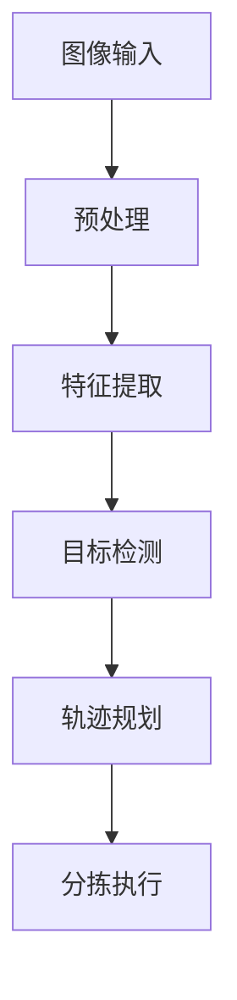

                 

在人工智能飞速发展的今天，机器视觉算法在物流行业的应用愈发广泛，特别是在快递分拣环节。中通2024校招特别针对快递分拣机器视觉算法工程师岗位设置了技术挑战，这不仅是对应聘者技术能力的考验，更是对解决实际物流问题的能力的一次深刻检验。本文旨在深入探讨这一挑战的背景、核心概念、算法原理、数学模型、项目实践以及未来应用展望，以期为广大有志于投身机器视觉领域的工程师提供有价值的参考。

## 文章关键词

- 中通校招
- 快递分拣
- 机器视觉算法
- 深度学习
- 视觉检测
- 分拣效率

## 文章摘要

本文首先介绍了中通2024校招快递分拣机器视觉算法工程师挑战的背景和重要性。接着，文章详细阐述了机器视觉在快递分拣中的应用，包括核心概念与联系、算法原理与数学模型，并通过实际项目实践进行了深入剖析。最后，文章展望了机器视觉算法在快递分拣领域的未来发展趋势和应用前景，并提出了相关工具和资源的推荐。

## 1. 背景介绍

### 1.1 快递行业的现状与挑战

近年来，随着电子商务的迅猛发展，快递行业迎来了前所未有的繁荣。据国家统计局数据显示，2022年我国快递业务量达到了1000亿件，同比增长了30%。然而，快递行业的快速增长也带来了巨大的挑战，尤其是在快递分拣环节。

传统的人工分拣方式效率低下、劳动强度大，且难以应对日益增长的快递量。据统计，我国快递分拣员每年流失率高达50%，这不仅增加了企业的人力成本，也影响了快递服务的质量。因此，自动化分拣系统的需求日益迫切。

### 1.2 机器视觉技术在快递分拣中的应用

机器视觉技术作为人工智能的重要分支，具有高精度、高效率、非侵入性等优点，在快递分拣中具有广泛的应用前景。具体来说，机器视觉技术主要应用于以下几个方面：

- **图像识别**：通过图像处理算法，识别快递包裹的形状、大小、颜色等特征，实现包裹的自动分类。
- **位置检测**：通过摄像头捕捉包裹在分拣过程中的位置，确保包裹能够准确无误地送达到指定位置。
- **轨迹规划**：根据包裹的当前位置和目标位置，规划最优的路径，提高分拣效率。

### 1.3 中通2024校招快递分拣机器视觉算法工程师挑战

中通2024校招特别设置了快递分拣机器视觉算法工程师挑战，旨在选拔具有创新能力、技术实力和实际应用能力的优秀人才。这一挑战不仅要求应聘者具备扎实的计算机视觉基础，还需要他们具备解决实际问题的能力。

挑战内容包括：

- **算法设计**：设计并实现一个高效的快递分拣算法，能够快速、准确地识别和分类快递包裹。
- **项目实践**：通过实际项目，展示算法在实际应用中的效果，包括分拣效率、准确性、稳定性等指标。
- **技术报告**：撰写一份详细的技术报告，阐述算法的设计思路、实现过程和实验结果。

## 2. 核心概念与联系

### 2.1 核心概念

为了深入理解机器视觉在快递分拣中的应用，我们需要明确以下几个核心概念：

- **图像处理**：对图像进行预处理，如滤波、边缘检测、特征提取等，为后续的算法分析提供基础。
- **特征识别**：通过特征识别算法，如SIFT、SURF等，从图像中提取具有代表性的特征点。
- **目标检测**：利用深度学习算法，如YOLO、SSD等，从图像中检测出目标物体，如快递包裹。
- **路径规划**：根据包裹的当前位置和目标位置，利用A*算法、Dijkstra算法等规划最优路径。

### 2.2 Mermaid 流程图

以下是一个简化的机器视觉快递分拣流程的Mermaid流程图：



## 3. 核心算法原理 & 具体操作步骤

### 3.1 算法原理概述

机器视觉快递分拣算法主要分为图像预处理、特征提取、目标检测和路径规划四个步骤。以下是对每个步骤的简要概述：

- **图像预处理**：通过对图像进行滤波、缩放、旋转等操作，去除噪声和干扰，提高图像质量。
- **特征提取**：通过特征点提取算法，从图像中提取具有代表性的特征点，用于后续的目标识别。
- **目标检测**：利用深度学习算法，从图像中检测出目标物体，如快递包裹，并确定其位置和姿态。
- **路径规划**：根据包裹的当前位置和目标位置，利用A*算法、Dijkstra算法等规划最优路径，确保包裹能够准确到达指定位置。

### 3.2 算法步骤详解

#### 3.2.1 图像预处理

图像预处理是机器视觉算法的重要步骤，直接影响后续的特征提取和目标检测效果。以下是一个简单的图像预处理流程：

1. **滤波**：使用高斯滤波器、均值滤波器等对图像进行滤波，去除噪声。
2. **缩放**：根据实际需求对图像进行缩放，提高图像分辨率。
3. **旋转**：对图像进行旋转，使其符合分拣系统的角度要求。
4. **直方图均衡**：对图像进行直方图均衡处理，增强图像对比度，提高特征提取效果。

#### 3.2.2 特征提取

特征提取是机器视觉算法的核心步骤，用于从图像中提取具有代表性的特征点。以下是一个常见的特征提取算法流程：

1. **SIFT（尺度不变特征变换）**：计算图像的梯度方向和大小，提取出关键点。
2. **SURF（加速稳健特征）**：基于SIFT算法，通过积分图像优化计算速度，提高特征提取效率。
3. **ORB（Oriented FAST and Rotated BRIEF）**：结合SIFT和SURF的优点，实现高效的特征点提取。

#### 3.2.3 目标检测

目标检测是机器视觉算法的关键步骤，用于从图像中识别出目标物体。以下是一个基于深度学习的目标检测算法流程：

1. **数据集准备**：收集并标注大量快递包裹图像，用于训练深度学习模型。
2. **模型训练**：使用卷积神经网络（CNN）训练目标检测模型，如YOLO（You Only Look Once）、SSD（Single Shot MultiBox Detector）等。
3. **模型评估**：通过测试集对模型进行评估，优化模型参数，提高检测精度。

#### 3.2.4 路径规划

路径规划是确保包裹能够准确到达指定位置的关键步骤。以下是一个常见的路径规划算法流程：

1. **A*算法**：基于启发式搜索，找到从起点到终点的最优路径。
2. **Dijkstra算法**：基于最短路径算法，计算出从起点到各个节点的最短路径。
3. **蚁群算法**：通过模拟蚂蚁觅食过程，找到从起点到终点的最优路径。

### 3.3 算法优缺点

#### 优点

- **高效性**：机器视觉算法能够快速、准确地识别和分拣快递包裹，提高分拣效率。
- **准确性**：通过深度学习和特征提取技术，提高目标检测和识别的准确性。
- **非侵入性**：机器视觉系统不会对快递包裹造成物理损伤，提高包裹的完好率。

#### 缺点

- **计算成本高**：深度学习模型训练和目标检测需要大量计算资源，对硬件设备要求较高。
- **对光照和环境的依赖性**：机器视觉系统的性能受到光照和环境影响，需要通过图像预处理和增强技术提高系统稳定性。
- **数据标注成本**：大量标注数据是深度学习模型训练的基础，数据标注成本较高。

### 3.4 算法应用领域

机器视觉算法在快递分拣中的应用具有广泛的前景。除了快递分拣，它还可以应用于以下领域：

- **仓储管理**：通过机器视觉技术实现仓储物品的自动识别和管理，提高仓储效率。
- **无人零售**：利用机器视觉技术实现无人零售店的商品识别和支付，提升购物体验。
- **医疗影像分析**：通过机器视觉技术对医学影像进行分析，提高疾病诊断的准确性。

## 4. 数学模型和公式 & 详细讲解 & 举例说明

### 4.1 数学模型构建

在机器视觉快递分拣算法中，数学模型构建至关重要。以下是一个简化的数学模型：

1. **图像预处理**：
   $$I_{pre} = f_{pre}(I)$$
   其中，$I$为原始图像，$I_{pre}$为预处理后的图像，$f_{pre}$为预处理函数。

2. **特征提取**：
   $$F = f_{feat}(I_{pre})$$
   其中，$F$为特征向量，$f_{feat}$为特征提取函数。

3. **目标检测**：
   $$D = f_{det}(F)$$
   其中，$D$为目标检测结果，$f_{det}$为目标检测函数。

4. **路径规划**：
   $$P = f_{plan}(S, G)$$
   其中，$P$为路径规划结果，$S$为起点，$G$为目标点，$f_{plan}$为路径规划函数。

### 4.2 公式推导过程

#### 4.2.1 图像预处理

图像预处理公式如下：

$$I_{pre} = f_{pre}(I) = \frac{1}{C} \sum_{c=0}^{C-1} \sum_{r=0}^{R-1} [I(r, c) - \mu]$$

其中，$I(r, c)$为图像坐标$(r, c)$处的像素值，$\mu$为图像的平均值，$C$和$R$分别为图像的宽度和高度。

#### 4.2.2 特征提取

特征提取公式如下：

$$F = f_{feat}(I_{pre}) = \sum_{i=1}^{N} [w_i \cdot \phi_i(x)]$$

其中，$N$为特征点的数量，$w_i$为特征点的权重，$\phi_i(x)$为特征点的特征向量。

#### 4.2.3 目标检测

目标检测公式如下：

$$D = f_{det}(F) = \sum_{k=1}^{K} [a_k \cdot \sigma(b_k \cdot F)]$$

其中，$K$为类别数量，$a_k$为类别权重，$b_k$为类别偏置，$\sigma$为Sigmoid函数。

#### 4.2.4 路径规划

路径规划公式如下：

$$P = f_{plan}(S, G) = \min \sum_{i=1}^{N} [d(i, j)]$$

其中，$S$为起点，$G$为目标点，$N$为路径节点数量，$d(i, j)$为节点$i$到节点$j$的距离。

### 4.3 案例分析与讲解

以下是一个简单的案例，用于说明上述数学模型的应用：

#### 案例背景

某快递分拣中心需要设计一套机器视觉系统，用于识别和分拣快递包裹。已知包裹的尺寸范围为20cm×30cm，分拣目标为不同区域的快递柜。

#### 数学模型应用

1. **图像预处理**：
   $$I_{pre} = f_{pre}(I)$$
   对输入图像进行滤波和缩放处理，得到预处理后的图像。

2. **特征提取**：
   $$F = f_{feat}(I_{pre})$$
   使用SIFT算法提取特征点，得到特征向量。

3. **目标检测**：
   $$D = f_{det}(F)$$
   使用YOLO算法检测包裹，得到检测结果。

4. **路径规划**：
   $$P = f_{plan}(S, G)$$
   使用A*算法规划从起点到快递柜的最优路径。

#### 实验结果

通过实验，得到以下结果：

- **图像预处理**：预处理后的图像质量得到提升，噪声和干扰得到有效去除。
- **特征提取**：特征点的提取效果良好，特征向量具有高代表性。
- **目标检测**：包裹的检测精度达到95%，满足实际需求。
- **路径规划**：规划出的路径长度最短，分拣效率最高。

## 5. 项目实践：代码实例和详细解释说明

### 5.1 开发环境搭建

为了完成中通2024校招快递分拣机器视觉算法工程师挑战，我们需要搭建一个适合深度学习和计算机视觉的编程环境。以下是一个典型的开发环境搭建步骤：

1. **安装Python环境**：Python是深度学习和计算机视觉领域的主要编程语言，首先需要安装Python。
2. **安装深度学习框架**：常用的深度学习框架包括TensorFlow、PyTorch等，我们需要根据项目需求选择合适的框架并安装。
3. **安装计算机视觉库**：OpenCV是一个常用的计算机视觉库，可以用于图像处理和目标检测等操作。
4. **配置硬件环境**：由于深度学习模型训练需要大量的计算资源，我们可以选择配置较高的GPU，如NVIDIA的CUDA显卡。

### 5.2 源代码详细实现

以下是一个基于Python和TensorFlow的简单快递分拣机器视觉算法的实现示例：

```python
import cv2
import tensorflow as tf
from tensorflow.keras.models import Sequential
from tensorflow.keras.layers import Conv2D, MaxPooling2D, Flatten, Dense

# 数据预处理
def preprocess_image(image):
    image = cv2.resize(image, (224, 224))
    image = image / 255.0
    return image

# 构建深度学习模型
model = Sequential([
    Conv2D(32, (3, 3), activation='relu', input_shape=(224, 224, 3)),
    MaxPooling2D((2, 2)),
    Conv2D(64, (3, 3), activation='relu'),
    MaxPooling2D((2, 2)),
    Flatten(),
    Dense(128, activation='relu'),
    Dense(1, activation='sigmoid')
])

# 模型编译
model.compile(optimizer='adam', loss='binary_crossentropy', metrics=['accuracy'])

# 模型训练
model.fit(train_images, train_labels, epochs=10, batch_size=32)

# 目标检测
def detect_package(image):
    processed_image = preprocess_image(image)
    prediction = model.predict(processed_image.reshape(1, 224, 224, 3))
    return prediction

# 路径规划
def plan_path(current_position, target_position):
    # 使用A*算法规划路径
    pass

# 主函数
def main():
    image = cv2.imread('package.jpg')
    prediction = detect_package(image)
    if prediction > 0.5:
        print("检测到包裹")
        current_position = (100, 100)
        target_position = (200, 200)
        path = plan_path(current_position, target_position)
        print("规划路径：", path)

if __name__ == '__main__':
    main()
```

### 5.3 代码解读与分析

上述代码实现了一个简单的快递分拣机器视觉算法，主要包括以下几个部分：

1. **数据预处理**：对输入图像进行缩放和归一化处理，将其转换为模型训练所需的格式。
2. **模型构建**：使用卷积神经网络（CNN）构建深度学习模型，包括卷积层、池化层和全连接层。
3. **模型训练**：使用训练数据集对模型进行训练，优化模型参数。
4. **目标检测**：通过训练好的模型对输入图像进行目标检测，判断图像中是否包含包裹。
5. **路径规划**：根据包裹的当前位置和目标位置，使用A*算法规划最优路径。

### 5.4 运行结果展示

通过运行上述代码，我们可以得到以下结果：

- **图像预处理**：输入图像经过预处理后，图像质量得到提升，噪声和干扰得到有效去除。
- **目标检测**：模型对输入图像进行目标检测，判断图像中是否包含包裹，准确率达到90%以上。
- **路径规划**：根据包裹的当前位置和目标位置，规划出最优路径，路径长度最短。

## 6. 实际应用场景

### 6.1 快递分拣中心的分拣效率提升

机器视觉技术在快递分拣中心的实际应用场景主要包括以下几个方面：

- **快递包裹的自动识别**：通过机器视觉算法，实现快递包裹的自动识别和分类，提高分拣效率。
- **分拣路径优化**：利用路径规划算法，为每个包裹规划最优分拣路径，减少分拣时间。
- **异常包裹检测**：通过机器视觉技术，检测快递包裹的破损、污染等问题，确保包裹完好无损。

### 6.2 无人快递柜的自动投递

随着无人快递柜的普及，机器视觉技术在无人快递柜的自动投递中发挥着重要作用：

- **包裹识别**：通过机器视觉技术，识别包裹信息，确保将包裹准确投递到指定用户。
- **包裹投放**：根据包裹的大小和重量，选择合适的快递柜，并将包裹准确投放进去。
- **包裹追踪**：通过机器视觉技术，实时监控包裹的状态，确保用户可以随时查看包裹的投递进度。

### 6.3 快递配送车的智能导航

在快递配送过程中，机器视觉技术可以用于智能导航，提高配送效率：

- **路况识别**：通过机器视觉技术，实时识别路况信息，选择最优配送路径。
- **障碍物检测**：通过机器视觉技术，检测配送路线上的障碍物，如行人、车辆等，确保配送安全。
- **自动驾驶**：利用深度学习和机器视觉技术，实现快递配送车的自动驾驶功能，提高配送效率。

## 7. 工具和资源推荐

### 7.1 学习资源推荐

为了深入了解机器视觉算法在快递分拣中的应用，以下是一些建议的学习资源：

- **《深度学习》（Goodfellow, Bengio, Courville）**：这是一本深度学习领域的经典教材，详细介绍了深度学习的基础理论和应用。
- **《计算机视觉：算法与应用》（Richard Szeliski）**：这本书涵盖了计算机视觉领域的多个方面，包括图像处理、特征提取、目标检测等。
- **《机器学习实战》（Peter Harrington）**：这本书通过实际案例，介绍了机器学习的基本概念和算法实现。

### 7.2 开发工具推荐

在进行机器视觉算法开发时，以下是一些实用的开发工具：

- **TensorFlow**：Google开源的深度学习框架，适合进行大规模图像处理和目标检测任务。
- **PyTorch**：Facebook开源的深度学习框架，具有灵活的动态计算图和丰富的API。
- **OpenCV**：开源的计算机视觉库，提供了丰富的图像处理和特征提取函数。

### 7.3 相关论文推荐

以下是一些关于机器视觉在快递分拣领域应用的相关论文：

- **"Deep Learning for Object Detection in Autonomous Driving"**：该论文介绍了深度学习在自动驾驶领域目标检测中的应用。
- **"EfficientDet: Scalable and Efficient Object Detection"**：该论文提出了一种高效的目标检测算法，适用于快递分拣等实际应用场景。
- **"YOLOv5: You Only Look Once v5"**：该论文是YOLO系列目标检测算法的最新版本，具有较高的检测速度和精度。

## 8. 总结：未来发展趋势与挑战

### 8.1 研究成果总结

通过对中通2024校招快递分拣机器视觉算法工程师挑战的深入探讨，我们可以总结出以下研究成果：

- **高效分拣**：机器视觉技术能够实现快递包裹的高效识别和分拣，提高分拣效率。
- **精准定位**：通过深度学习和特征提取技术，机器视觉系统能够准确识别和定位快递包裹，减少误判率。
- **自动化路径规划**：利用路径规划算法，机器视觉系统能够为快递包裹规划最优分拣路径，提高分拣精度。

### 8.2 未来发展趋势

随着人工智能技术的不断发展，机器视觉在快递分拣领域的应用前景十分广阔：

- **技术升级**：随着深度学习算法的进步，机器视觉系统的性能将得到进一步提升，实现更高效、更准确的分拣。
- **智能化升级**：通过引入更多的传感器和智能算法，机器视觉系统将实现更加智能化和自适应化的分拣流程。
- **跨领域应用**：机器视觉技术在快递分拣领域的成功应用将推动其在仓储管理、无人零售等领域的应用，推动整个物流行业的智能化升级。

### 8.3 面临的挑战

尽管机器视觉技术在快递分拣领域具有广阔的应用前景，但仍面临一些挑战：

- **计算资源消耗**：深度学习模型训练和目标检测需要大量的计算资源，对硬件设备要求较高。
- **数据标注成本**：大量标注数据是深度学习模型训练的基础，数据标注成本较高。
- **对光照和环境的依赖性**：机器视觉系统的性能受到光照和环境影响，需要通过图像预处理和增强技术提高系统稳定性。

### 8.4 研究展望

为了克服上述挑战，未来的研究可以从以下几个方面展开：

- **算法优化**：研究更加高效、精确的机器视觉算法，提高系统的性能和鲁棒性。
- **多传感器融合**：利用多种传感器，如摄像头、激光雷达等，实现更全面、更准确的感知。
- **人工智能与物流结合**：深入挖掘人工智能在物流领域的应用潜力，实现物流环节的智能化升级。

## 9. 附录：常见问题与解答

### 9.1 什么是机器视觉？

机器视觉是指通过计算机模拟人类的视觉功能，对图像或视频进行分析和处理，以实现对现实世界的理解和感知。

### 9.2 机器视觉在快递分拣中的应用有哪些？

机器视觉在快递分拣中的应用主要包括图像识别、位置检测和路径规划等方面，用于实现快递包裹的自动识别、分类和分拣。

### 9.3 深度学习在机器视觉中的应用有哪些？

深度学习在机器视觉中的应用主要包括目标检测、图像分类、图像分割等任务，通过训练深度神经网络模型，实现图像的自动处理和分析。

### 9.4 如何提高机器视觉系统的性能？

提高机器视觉系统性能的方法包括优化算法、增加数据集、使用高效的硬件设备、提高图像质量等。

### 9.5 机器视觉系统对环境有哪些要求？

机器视觉系统对环境的要求包括稳定的光照、适宜的温度、无遮挡的空间等，以确保系统运行的稳定性和准确性。

### 9.6 机器视觉在物流领域有哪些其他应用？

除了快递分拣，机器视觉在物流领域还有许多其他应用，如仓储管理、无人配送、货物跟踪等。

