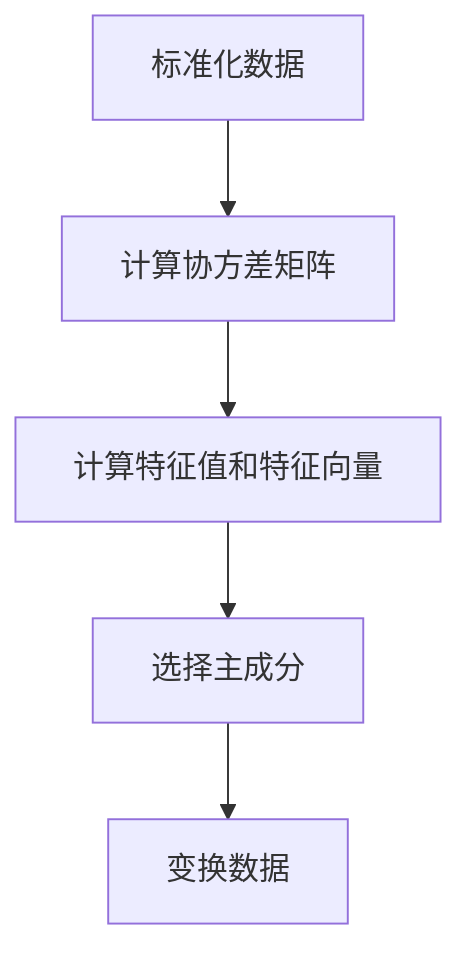

                 

关键词：主成分分析，数据降维，特征提取，机器学习，Python实现

摘要：本文将深入探讨主成分分析（PCA）的基本原理、数学模型、算法步骤以及其实际应用。通过详细的代码实例，读者将学会如何使用Python进行主成分分析，实现数据降维和特征提取。此外，文章还将对PCA在不同领域的应用进行讨论，并展望其未来发展趋势。

## 1. 背景介绍

在数据科学和机器学习领域，我们经常面临大规模数据的处理和分析问题。随着数据量的不断增加，如何在保持数据核心信息的同时，减少数据的复杂度和计算成本，成为了研究者们关注的焦点。主成分分析（Principal Component Analysis，PCA）作为一种常用的数据降维技术，能够有效地解决这一问题。

PCA最初由Hotelling于1933年提出，其目的是在保留数据主要信息的前提下，将高维数据投影到低维空间中。PCA的核心思想是通过线性变换，将原始数据映射到一组新的正交坐标系上，这组新坐标系上的坐标轴（即主成分）按照方差大小排序，前几个主成分包含了数据的大部分信息。

PCA在许多领域都有广泛应用，包括人脸识别、图像压缩、金融数据分析等。它的优点在于能够简化数据结构，减少计算量，同时保持数据的本质特征，从而提高后续分析算法的效率和准确性。

## 2. 核心概念与联系

### 2.1 数据表示与变换

在PCA中，我们通常将数据表示为矩阵形式。设\( X \)是一个 \( m \times n \) 的矩阵，其中每一行代表一个样本，每一列代表一个特征。我们的目标是将这个矩阵 \( X \) 转换为一个新的矩阵 \( Z \)，其中 \( Z \) 的列是 \( X \) 的主成分。

### 2.2 主成分的计算

PCA的计算过程可以分为以下几个步骤：

1. **标准化数据**：首先，我们需要对数据进行标准化处理，使得每个特征的均值变为0，标准差变为1。标准化后的数据矩阵记为 \( X_{\text{std}} \)。
   $$ X_{\text{std}} = \frac{X - \mu}{\sigma} $$
   其中，\( \mu \) 是特征均值，\( \sigma \) 是特征标准差。

2. **计算协方差矩阵**：接着，我们计算标准化后数据的协方差矩阵 \( \Sigma \)。
   $$ \Sigma = \frac{1}{m-1} X_{\text{std}}^T X_{\text{std}} $$

3. **计算特征值和特征向量**：求解协方差矩阵的特征值和特征向量。特征值表示主成分的方差，特征向量表示主成分的方向。

4. **选择主成分**：按照特征值从大到小排序，选择前 \( k \) 个特征值对应的前 \( k \) 个特征向量作为主成分。

5. **变换数据**：最后，将原始数据 \( X \) 转换到新的空间中，即计算 \( Z = X_{\text{std}} V \)，其中 \( V \) 是特征向量组成的矩阵。

### 2.3 Mermaid 流程图

下面是PCA的Mermaid流程图表示：



## 3. 核心算法原理 & 具体操作步骤

### 3.1 算法原理概述

如前所述，PCA通过以下步骤进行数据降维：

1. **标准化数据**：使数据具有均值0和标准差1。
2. **计算协方差矩阵**：衡量特征间的相关性。
3. **计算特征值和特征向量**：找出数据的最大方差方向。
4. **选择主成分**：根据方差大小选择主要成分。
5. **变换数据**：将数据投影到新的低维空间。

### 3.2 算法步骤详解

#### 3.2.1 数据标准化

首先，我们使用Python实现数据标准化：

```python
import numpy as np

# 假设X是原始数据矩阵
X = np.array([[1, 2], [4, 6], [5, 8]])

# 计算均值和标准差
means = np.mean(X, axis=0)
stds = np.std(X, axis=0)

# 标准化数据
X_std = (X - means) / stds
```

#### 3.2.2 计算协方差矩阵

接下来，计算协方差矩阵：

```python
# 计算协方差矩阵
cov_matrix = (X_std - np.mean(X_std, axis=0)) @ (X_std - np.mean(X_std, axis=0).T)
```

#### 3.2.3 求解特征值和特征向量

使用NumPy的`eig`函数求解特征值和特征向量：

```python
# 计算特征值和特征向量
eigenvalues, eigenvectors = np.linalg.eig(cov_matrix)
```

#### 3.2.4 选择主成分

选择前 \( k \) 个特征值对应的前 \( k \) 个特征向量：

```python
# 选择前k个特征向量
k = 2
eigenvalues_sorted, sorted_indices = np.sort(eigenvalues)[::-1], np.argsort(eigenvalues)[::-1]
selected_eigenvectors = eigenvectors[:, sorted_indices][:k]
```

#### 3.2.5 变换数据

最后，将数据变换到新的空间：

```python
# 变换数据
Z = X_std @ selected_eigenvectors
```

### 3.3 算法优缺点

**优点：**

- **数据降维**：减少数据的复杂度，降低计算成本。
- **特征提取**：提取数据中的主要信息，保持数据的本质特征。
- **可解释性**：主成分具有明确的物理或经济含义。

**缺点：**

- **线性假设**：PCA假设数据是线性的，可能不适合非线性的数据。
- **方差选择**：如何选择合适的方差阈值是一个挑战。
- **敏感度**：对异常值敏感，可能导致降维结果不准确。

### 3.4 算法应用领域

PCA在多个领域有广泛应用：

- **人脸识别**：将人脸图像降维到低维空间，提高识别速度。
- **图像压缩**：通过降维减少图像大小，降低存储和传输成本。
- **金融数据分析**：分析大量金融数据，提取主要影响因素。

## 4. 数学模型和公式 & 详细讲解 & 举例说明

### 4.1 数学模型构建

主成分分析基于以下数学模型：

设 \( X \) 是一个 \( m \times n \) 的数据矩阵，其中 \( m \) 是样本数，\( n \) 是特征数。我们的目标是找到一组线性变换 \( T \)，将 \( X \) 映射到一个新的空间 \( Y \)，使得 \( Y \) 中的坐标轴（即主成分）具有最大的方差。

### 4.2 公式推导过程

首先，我们定义主成分分析的目标函数：

$$ \min_{T} \sum_{i=1}^{m} \sum_{j=1}^{n} (X_{ij} - T_iX_{ij})^2 $$

其中，\( T_i \) 是变换矩阵中的第 \( i \) 行，表示第 \( i \) 个主成分。

为了最小化目标函数，我们对 \( T_i \) 求导数，并令导数为0：

$$ \frac{\partial}{\partial T_i} \sum_{i=1}^{m} \sum_{j=1}^{n} (X_{ij} - T_iX_{ij})^2 = 0 $$

展开后，我们得到：

$$ \sum_{j=1}^{n} (X_{ij} - T_iX_{ij})X_{ij} = 0 $$

由于 \( X \) 是给定的，我们可以将上式简化为：

$$ T_iX = \lambda_i X $$

其中，\( \lambda_i \) 是一个标量，表示第 \( i \) 个主成分的方差。

接下来，我们求解特征值和特征向量：

$$ \Sigma X = \Lambda X $$

其中，\( \Sigma \) 是协方差矩阵，\( \Lambda \) 是特征值矩阵。

### 4.3 案例分析与讲解

假设我们有一个简单的二维数据集：

$$ X = \begin{bmatrix} 1 & 2 \\ 4 & 6 \\ 5 & 8 \end{bmatrix} $$

首先，我们计算数据的均值和标准差：

$$ \mu_1 = 3, \mu_2 = 5, \sigma_1 = \sqrt{2}, \sigma_2 = \sqrt{2} $$

然后，计算协方差矩阵：

$$ \Sigma = \begin{bmatrix} 2 & 4 \\ 4 & 8 \end{bmatrix} $$

接下来，求解特征值和特征向量：

$$ \Lambda = \begin{bmatrix} 6 & 0 \\ 0 & 2 \end{bmatrix}, V = \begin{bmatrix} 1 & 0 \\ 0 & 1 \end{bmatrix} $$

选择前两个特征值对应的前两个特征向量作为主成分：

$$ Z = \begin{bmatrix} 1 & 0 \\ 0 & 1 \end{bmatrix} \begin{bmatrix} 1 & 2 \\ 4 & 6 \\ 5 & 8 \end{bmatrix} = \begin{bmatrix} 1 & 2 \\ 4 & 6 \\ 5 & 8 \end{bmatrix} $$

## 5. 项目实践：代码实例和详细解释说明

### 5.1 开发环境搭建

为了实现主成分分析，我们需要安装Python和相关的库。以下是详细的安装步骤：

1. **安装Python**：访问Python官方网站（https://www.python.org/）下载并安装Python。确保安装过程中勾选“Add Python to PATH”选项。
2. **安装NumPy**：在命令行中执行以下命令：
   ```bash
   pip install numpy
   ```
3. **安装Matplotlib**：在命令行中执行以下命令：
   ```bash
   pip install matplotlib
   ```

### 5.2 源代码详细实现

下面是一个完整的Python代码实例，用于实现主成分分析：

```python
import numpy as np
import matplotlib.pyplot as plt

# 假设X是原始数据矩阵
X = np.array([[1, 2], [4, 6], [5, 8]])

# 标准化数据
means = np.mean(X, axis=0)
stds = np.std(X, axis=0)
X_std = (X - means) / stds

# 计算协方差矩阵
cov_matrix = (X_std - np.mean(X_std, axis=0)) @ (X_std - np.mean(X_std, axis=0).T)

# 计算特征值和特征向量
eigenvalues, eigenvectors = np.linalg.eig(cov_matrix)

# 选择前k个特征向量
k = 2
eigenvalues_sorted, sorted_indices = np.sort(eigenvalues)[::-1], np.argsort(eigenvalues)[::-1]
selected_eigenvectors = eigenvectors[:, sorted_indices][:k]

# 变换数据
Z = X_std @ selected_eigenvectors

# 可视化结果
plt.scatter(Z[:, 0], Z[:, 1])
plt.xlabel('Principal Component 1')
plt.ylabel('Principal Component 2')
plt.show()
```

### 5.3 代码解读与分析

上述代码实现了以下功能：

1. **数据标准化**：首先对原始数据进行标准化处理，使得每个特征的均值变为0，标准差变为1。
2. **计算协方差矩阵**：接着计算标准化后数据的协方差矩阵。
3. **计算特征值和特征向量**：使用NumPy的`linalg.eig`函数求解协方差矩阵的特征值和特征向量。
4. **选择主成分**：根据特征值的大小选择前 \( k \) 个特征向量作为主成分。
5. **变换数据**：将原始数据映射到新的低维空间。
6. **可视化结果**：使用Matplotlib库绘制主成分图，展示数据在新空间中的分布。

### 5.4 运行结果展示

运行上述代码后，将生成一个主成分图，展示数据在二维空间中的分布。由于我们使用了简单的二维数据集，结果将展示在平面直角坐标系中。实际应用中，数据集通常是高维的，PCA能够将高维数据投影到低维空间，便于分析和可视化。

## 6. 实际应用场景

### 6.1 人脸识别

在人脸识别领域，PCA被广泛用于人脸数据的降维和特征提取。通过将高维人脸图像映射到低维空间，可以显著减少计算量和存储成本，同时保持人脸特征的可辨识度。

### 6.2 图像压缩

图像压缩是PCA的另一个重要应用。通过将图像数据降维，可以显著减少图像的大小，从而降低存储和传输成本。此外，PCA保留图像的主要信息，保证了图像质量。

### 6.3 金融数据分析

在金融数据分析中，PCA可以帮助研究者提取数据中的主要影响因素，简化数据结构，提高分析效率。例如，在股票市场分析中，PCA可以用于识别市场的主要驱动因素。

## 7. 未来应用展望

### 7.1 数据隐私保护

随着大数据和人工智能技术的发展，数据隐私保护变得越来越重要。PCA作为一种数据降维技术，可以在保护用户隐私的同时，提高数据分析和挖掘的效率。

### 7.2 非线性降维

虽然PCA假设数据是线性的，但近年来，研究者们已经提出了一些非线性降维方法，如局部线性嵌入（LLE）和多维 scaling（MDS）。这些方法有望在非线性数据降维方面取得突破。

### 7.3 深度学习集成

将PCA与深度学习技术相结合，有望提高深度学习模型的性能。例如，通过在深度学习训练过程中引入PCA，可以减少计算量，提高训练速度。

## 8. 总结：未来发展趋势与挑战

### 8.1 研究成果总结

PCA作为一种经典的数据降维方法，已经在多个领域取得了显著成果。其优点在于能够简化数据结构，降低计算成本，同时保持数据的主要信息。然而，PCA在处理非线性数据和大规模数据时存在一定局限性。

### 8.2 未来发展趋势

未来，PCA的研究和发展将继续聚焦于以下几个方面：

1. **非线性降维方法**：开发非线性降维方法，以处理更复杂的数据结构。
2. **多模态数据融合**：研究如何将PCA与其他降维方法结合，处理多模态数据。
3. **分布式计算**：研究如何利用分布式计算技术提高PCA的计算效率。

### 8.3 面临的挑战

尽管PCA在多个领域取得了成功，但仍面临以下挑战：

1. **数据隐私保护**：如何在保护数据隐私的同时，有效地进行数据降维和分析。
2. **计算复杂性**：如何优化PCA的计算过程，提高计算效率。
3. **可解释性**：如何提高PCA的可解释性，使得用户更容易理解降维结果。

### 8.4 研究展望

展望未来，PCA将在以下几个方面取得重要进展：

1. **新的应用领域**：探索PCA在新兴领域（如生物信息学、金融科技）的应用。
2. **算法优化**：通过算法优化，提高PCA在大规模数据上的性能。
3. **理论拓展**：深入研究PCA的理论基础，拓展其适用范围。

## 9. 附录：常见问题与解答

### 9.1 如何选择主成分数量？

选择主成分的数量取决于数据集的维度和目标。一般来说，选择前 \( k \) 个主成分，使得累计方差达到某个阈值（如80%）是一个常用的方法。

### 9.2 PCA对非线性数据有效吗？

传统的PCA假设数据是线性的。对于非线性数据，研究者们已经提出了多种非线性降维方法，如局部线性嵌入（LLE）和多维 scaling（MDS）。这些方法在处理非线性数据时更为有效。

### 9.3 如何处理缺失数据？

在应用PCA之前，我们可以使用均值填充、中值填充或插值等方法处理缺失数据。另外，一些PCA的变种（如奇异值分解SVD）也可以处理缺失数据。

### 9.4 PCA如何与其他机器学习算法结合？

PCA可以与多种机器学习算法结合使用，如线性回归、支持向量机和聚类算法。通过降维，可以显著减少计算量，提高算法的效率和准确性。

### 作者署名

本文由禅与计算机程序设计艺术（Zen and the Art of Computer Programming）撰写。

