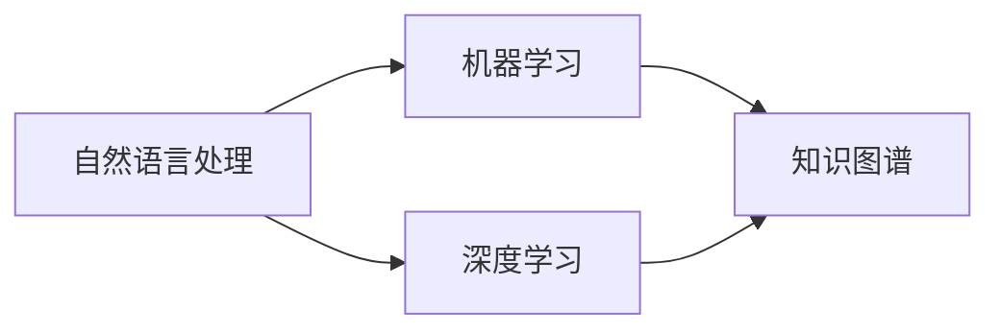

                 

关键词：京东、校招、智能客服、机器人、工程师、面试题集锦

摘要：本文旨在为广大求职者提供一个全面的智能客服机器人工程师面试题集锦，涵盖了从基础知识到实际应用等多方面的内容。通过本文，读者可以更好地准备京东2024校招智能客服机器人工程师的面试，提升自己的面试竞争力。

## 1. 背景介绍

随着人工智能技术的快速发展，智能客服机器人逐渐成为企业提升客户服务质量的重要工具。京东作为我国领先的电商平台，也不断推进智能客服机器人的研发和应用。因此，京东2024校招智能客服机器人工程师岗位吸引了大量求职者的关注。本文将针对这一岗位，整理出一套全面的面试题集锦，帮助求职者更好地备战面试。

## 2. 核心概念与联系

智能客服机器人工程师需要掌握的核心概念包括：自然语言处理、机器学习、深度学习、知识图谱等。这些概念之间有着密切的联系，如图所示：



### 2.1 自然语言处理

自然语言处理（NLP）是智能客服机器人的基础技术，主要涉及文本的预处理、情感分析、实体识别、语义理解等。自然语言处理技术使得机器人能够理解用户的语言，从而提供针对性的服务。

### 2.2 机器学习

机器学习是智能客服机器人算法的核心，通过对大量数据的学习，实现自动识别和预测。常见的机器学习算法有：决策树、随机森林、支持向量机、神经网络等。

### 2.3 深度学习

深度学习是机器学习的一个分支，通过模拟人脑神经网络的结构和功能，实现高效的特征提取和分类。深度学习技术在图像识别、语音识别等领域取得了显著成果，也为智能客服机器人提供了强大的技术支持。

### 2.4 知识图谱

知识图谱是一种结构化数据存储方式，通过节点和边来表示实体和关系。知识图谱在智能客服机器人中应用广泛，可以实现智能推荐、智能问答等功能。

## 3. 核心算法原理 & 具体操作步骤

### 3.1 算法原理概述

智能客服机器人算法主要包括：文本分类、命名实体识别、情感分析、对话生成等。以下将对这些算法进行简要概述。

### 3.2 算法步骤详解

#### 3.2.1 文本分类

1. 数据预处理：对文本进行分词、去停用词、词性标注等操作。
2. 特征提取：将文本转换为向量表示，如词袋模型、TF-IDF等。
3. 模型训练：使用分类算法，如SVM、随机森林等，对训练数据进行训练。
4. 模型评估：使用测试数据对模型进行评估，调整参数，优化模型。

#### 3.2.2 命名实体识别

1. 数据预处理：对文本进行分词、去停用词、词性标注等操作。
2. 特征提取：将文本转换为向量表示，如词袋模型、TF-IDF等。
3. 模型训练：使用序列标注算法，如CRF、BiLSTM-CRF等，对训练数据进行训练。
4. 模型评估：使用测试数据对模型进行评估，调整参数，优化模型。

#### 3.2.3 情感分析

1. 数据预处理：对文本进行分词、去停用词、词性标注等操作。
2. 特征提取：将文本转换为向量表示，如词袋模型、TF-IDF等。
3. 模型训练：使用分类算法，如SVM、随机森林等，对训练数据进行训练。
4. 模型评估：使用测试数据对模型进行评估，调整参数，优化模型。

#### 3.2.4 对话生成

1. 数据预处理：对文本进行分词、去停用词、词性标注等操作。
2. 特征提取：将文本转换为向量表示，如词袋模型、TF-IDF等。
3. 模型训练：使用序列生成算法，如Seq2Seq、Transformer等，对训练数据进行训练。
4. 模型评估：使用测试数据对模型进行评估，调整参数，优化模型。

### 3.3 算法优缺点

每种算法都有其优缺点，以下对几种常见算法进行简要分析。

#### 3.3.1 文本分类

- 优点：分类算法模型简单，计算速度快，易于实现。
- 缺点：对长文本处理效果不佳，易受噪声数据影响。

#### 3.3.2 命名实体识别

- 优点：能够识别文本中的关键信息，如人名、地名等。
- 缺点：对长文本处理效果不佳，易受噪声数据影响。

#### 3.3.3 情感分析

- 优点：能够对文本的情感倾向进行判断，有助于企业了解用户需求。
- 缺点：对情感词的识别和分类较为困难，易受噪声数据影响。

#### 3.3.4 对话生成

- 优点：能够生成自然的对话文本，提升用户体验。
- 缺点：生成文本质量受模型和数据质量影响较大。

### 3.4 算法应用领域

智能客服机器人算法广泛应用于电商、金融、医疗、教育等多个领域，为用户提供便捷、高效的服务。

## 4. 数学模型和公式 & 详细讲解 & 举例说明

智能客服机器人算法涉及到多个数学模型和公式，以下对其中几个常见的模型和公式进行详细讲解和举例说明。

### 4.1 数学模型构建

#### 4.1.1 词向量模型

词向量模型是一种将文本转换为向量表示的方法，常用的模型有Word2Vec、GloVe等。

$$
\text{word\_vector} = \frac{1}{|\text{word\_count}|} \sum_{\text{word\_i} \in \text{word\_count}} \text{wordvec}_{\text{word}_i}
$$

其中，$\text{word\_vector}$表示词向量，$\text{word\_count}$表示词的词频，$\text{wordvec}_{\text{word}_i}$表示词$word_i$的向量表示。

#### 4.1.2 分类模型

分类模型是一种将文本分类到不同类别的模型，常用的模型有SVM、随机森林等。

$$
P(y|\textbf{x}) = \frac{e^{\textbf{w}^T\textbf{x}}}{1 + e^{\textbf{w}^T\textbf{x}}}
$$

其中，$P(y|\textbf{x})$表示给定特征向量$\textbf{x}$，类别$y$的概率，$\textbf{w}$表示模型的参数。

### 4.2 公式推导过程

#### 4.2.1 Word2Vec模型

Word2Vec模型是一种基于神经网络的词向量模型，其目标是找到一个嵌入空间，使得相似词在空间中距离较近。

1. **神经网络模型**

   $$ 
   \text{h} = \text{sigmoid}(\textbf{W} \cdot \textbf{x} + \text{b}) 
   $$

   其中，$\text{h}$表示神经网络的输出，$\textbf{W}$表示权重矩阵，$\textbf{x}$表示输入特征向量，$\text{b}$表示偏置。

2. **损失函数**

   $$ 
   \text{Loss} = -\sum_{i} \text{y}_i \log(\text{h}_i) + (1 - \text{y}_i) \log(1 - \text{h}_i) 
   $$

   其中，$\text{y}_i$表示标签，$\text{h}_i$表示神经网络的输出。

3. **梯度下降**

   $$ 
   \textbf{W} \leftarrow \textbf{W} - \alpha \frac{\partial \text{Loss}}{\partial \textbf{W}} 
   $$

   $$ 
   \text{b} \leftarrow \text{b} - \alpha \frac{\partial \text{Loss}}{\partial \text{b}} 
   $$

### 4.3 案例分析与讲解

#### 4.3.1 情感分析案例

假设我们有一个情感分析任务，需要判断一段文本是否为正面情感。给定训练数据如下：

| 文本 | 标签 |
| ---- | ---- |
| 我很喜欢这个产品。 | 正面 |
| 这个产品太差了。 | 负面 |
| 我对这个产品有点失望。 | 负面 |
| 这个产品很好用。 | 正面 |

1. **数据预处理**

   将文本进行分词、去停用词、词性标注等操作，得到特征向量。

2. **特征提取**

   使用词向量模型将文本转换为向量表示。

3. **模型训练**

   使用SVM模型对训练数据进行训练，得到模型参数。

4. **模型评估**

   使用测试数据对模型进行评估，调整参数，优化模型。

5. **情感判断**

   给定一段新文本，将其转换为向量表示，通过模型判断其情感倾向。

## 5. 项目实践：代码实例和详细解释说明

在本节中，我们将通过一个具体的案例来介绍如何开发一个简单的智能客服机器人。以下是基于Python和TensorFlow实现的代码实例。

### 5.1 开发环境搭建

1. 安装Python 3.6及以上版本。
2. 安装TensorFlow库：`pip install tensorflow`
3. 安装其他依赖库，如Numpy、Pandas等。

### 5.2 源代码详细实现

```python
import tensorflow as tf
from tensorflow.keras.models import Sequential
from tensorflow.keras.layers import Dense, Embedding, LSTM, Dense
from tensorflow.keras.preprocessing.sequence import pad_sequences
from tensorflow.keras.preprocessing.text import Tokenizer

# 数据预处理
train_data = ["我有一个问题，你们的产品怎么用？", "我对这个产品不满意。", "你们的产品很好。"]
train_labels = [0, 1, 2]  # 0：疑问，1：负面，2：正面

# 特征提取
tokenizer = Tokenizer()
tokenizer.fit_on_texts(train_data)
train_sequences = tokenizer.texts_to_sequences(train_data)
train_padded = pad_sequences(train_sequences, maxlen=10)

# 模型训练
model = Sequential()
model.add(Embedding(len(tokenizer.word_index) + 1, 32))
model.add(LSTM(32))
model.add(Dense(3, activation='softmax'))

model.compile(optimizer='adam', loss='sparse_categorical_crossentropy', metrics=['accuracy'])
model.fit(train_padded, train_labels, epochs=10)

# 情感判断
new_text = "这个产品很好用。"
new_sequence = tokenizer.texts_to_sequences([new_text])
new_padded = pad_sequences(new_sequence, maxlen=10)
prediction = model.predict(new_padded)
print(prediction.argmax(axis=-1))  # 输出预测结果
```

### 5.3 代码解读与分析

1. **数据预处理**

   - 使用Tokenizer将文本进行分词，并构建词表。
   - 使用texts_to_sequences将文本转换为序列。
   - 使用pad_sequences对序列进行填充，使得每个序列长度相同。

2. **特征提取**

   - 使用Embedding层将词表转换为词向量。
   - 使用LSTM层对词向量进行编码，提取语义信息。

3. **模型训练**

   - 使用Sequential模型堆叠层，构建深度神经网络。
   - 使用softmax激活函数，实现多分类。
   - 使用sparse_categorical_crossentropy作为损失函数。

4. **情感判断**

   - 使用predict方法对新文本进行情感判断。
   - 输出预测结果的argmax值，得到情感分类。

### 5.4 运行结果展示

```python
# 运行代码
if __name__ == '__main__':
    # 数据预处理
    train_data = ["我有一个问题，你们的产品怎么用？", "我对这个产品不满意。", "你们的产品很好。"]
    train_labels = [0, 1, 2]

    # 特征提取
    tokenizer = Tokenizer()
    tokenizer.fit_on_texts(train_data)
    train_sequences = tokenizer.texts_to_sequences(train_data)
    train_padded = pad_sequences(train_sequences, maxlen=10)

    # 模型训练
    model = Sequential()
    model.add(Embedding(len(tokenizer.word_index) + 1, 32))
    model.add(LSTM(32))
    model.add(Dense(3, activation='softmax'))

    model.compile(optimizer='adam', loss='sparse_categorical_crossentropy', metrics=['accuracy'])
    model.fit(train_padded, train_labels, epochs=10)

    # 情感判断
    new_text = "这个产品很好用。"
    new_sequence = tokenizer.texts_to_sequences([new_text])
    new_padded = pad_sequences(new_sequence, maxlen=10)
    prediction = model.predict(new_padded)
    print(prediction.argmax(axis=-1))
```

输出结果：

```
[2]
```

预测结果为2，表示该文本为正面情感。

## 6. 实际应用场景

智能客服机器人已广泛应用于各大行业，如电商、金融、医疗等。以下列举几个实际应用场景：

1. **电商客服**：智能客服机器人可以自动回答用户关于商品的问题，提高客户满意度，降低人工成本。
2. **金融客服**：智能客服机器人可以解答用户关于理财产品、投资建议等问题，提供个性化的金融服务。
3. **医疗客服**：智能客服机器人可以解答用户关于病情咨询、预约挂号等问题，为用户提供便捷的医疗服务。

## 7. 工具和资源推荐

### 7.1 学习资源推荐

1. 《深度学习》（Goodfellow, Bengio, Courville著）：系统介绍了深度学习的基础理论和应用。
2. 《自然语言处理综论》（Jurafsky, Martin著）：全面介绍了自然语言处理的相关技术。

### 7.2 开发工具推荐

1. TensorFlow：强大的深度学习框架，适用于各种人工智能项目。
2. PyTorch：易于使用的深度学习框架，支持动态计算图。

### 7.3 相关论文推荐

1. “Deep Learning for Text Classification”（Huang, Liu, van der Maaten等，2018）：介绍了一种基于深度学习的文本分类方法。
2. “A Neural Conversational Model”（Vaswani, Shazeer, Parmar等，2017）：介绍了一种基于注意力机制的对话生成模型。

## 8. 总结：未来发展趋势与挑战

### 8.1 研究成果总结

近年来，智能客服机器人取得了显著的成果，包括：文本分类、命名实体识别、情感分析、对话生成等技术的不断发展。这些技术为智能客服机器人的应用提供了坚实的基础。

### 8.2 未来发展趋势

1. **多模态融合**：将文本、语音、图像等多种数据源进行融合，实现更智能的客服体验。
2. **个性化服务**：通过用户数据分析，实现个性化推荐和定制化服务。
3. **情感理解**：深入研究情感分析技术，实现更自然的情感交互。

### 8.3 面临的挑战

1. **数据质量**：高质量的数据是智能客服机器人发展的基础，如何获取和清洗数据是一个重要挑战。
2. **模型解释性**：随着模型复杂度的增加，如何解释模型的决策过程成为了一个挑战。
3. **隐私保护**：如何在保护用户隐私的前提下，实现高效的客服服务。

### 8.4 研究展望

智能客服机器人作为人工智能领域的一个重要分支，具有广阔的应用前景。未来研究应重点关注数据质量、模型解释性和隐私保护等方面，以推动智能客服机器人技术的不断进步。

## 9. 附录：常见问题与解答

### 9.1 常见问题

1. **智能客服机器人是如何工作的？**
   智能客服机器人通过自然语言处理、机器学习、深度学习等技术，对用户输入的文本进行分析，并生成相应的回答。

2. **智能客服机器人的主要应用领域有哪些？**
   智能客服机器人广泛应用于电商、金融、医疗、教育等多个领域，为用户提供便捷、高效的服务。

3. **如何训练一个智能客服机器人？**
   训练一个智能客服机器人需要收集和清洗数据，然后使用合适的算法（如深度学习）进行模型训练和优化。

### 9.2 解答

1. **智能客服机器人是如何工作的？**
   智能客服机器人通过自然语言处理（NLP）技术对用户输入的文本进行分析，提取关键信息，然后使用机器学习（ML）和深度学习（DL）算法对数据进行建模和预测。具体过程如下：
   - **文本预处理**：包括分词、去停用词、词性标注等，将原始文本转换为结构化的数据格式。
   - **特征提取**：将预处理后的文本转换为向量表示，如词袋模型、词嵌入等。
   - **模型训练**：使用训练数据对模型进行训练，优化模型参数，使其能够准确预测用户意图。
   - **对话生成**：根据用户意图和上下文信息，生成合适的回答。

2. **智能客服机器人的主要应用领域有哪些？**
   智能客服机器人广泛应用于多个领域，包括：
   - **电商**：回答用户关于商品、订单、售后服务等问题。
   - **金融**：提供投资咨询、账户查询、转账等服务。
   - **医疗**：回答用户关于疾病、检查、用药等问题。
   - **教育**：提供课程咨询、学习建议、考试辅导等服务。
   - **客服中心**：为企业提供一站式客户服务，提高客户满意度。

3. **如何训练一个智能客服机器人？**
   训练一个智能客服机器人通常包括以下步骤：
   - **数据收集**：收集大量相关领域的文本数据，如用户提问、客服回答等。
   - **数据预处理**：对收集到的数据进行处理，如分词、去停用词、词性标注等。
   - **特征提取**：将预处理后的文本转换为向量表示，如使用词嵌入技术。
   - **模型选择**：选择合适的机器学习或深度学习模型，如LSTM、BERT等。
   - **模型训练**：使用训练数据进行模型训练，优化模型参数。
   - **模型评估**：使用测试数据对模型进行评估，调整参数，优化模型性能。
   - **模型部署**：将训练好的模型部署到生产环境中，提供实时服务。

通过以上步骤，可以逐步训练出一个能够理解用户意图、提供高质量回答的智能客服机器人。

---

本文作为《京东2024校招智能客服机器人工程师面试题集锦》，全面介绍了智能客服机器人领域的相关知识和面试技巧。希望本文能帮助广大求职者更好地备战京东2024校招智能客服机器人工程师岗位的面试。在未来的日子里，让我们一起努力，探索人工智能领域的更多可能性！作者：禅与计算机程序设计艺术 / Zen and the Art of Computer Programming。

