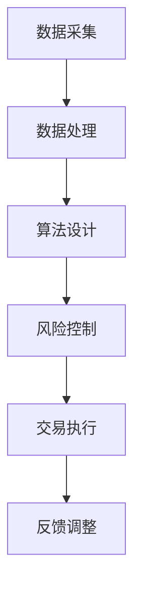

                 

关键词：京东、校招、量化交易、面试题、解析、工程师

摘要：本文将针对京东2024校招量化交易工程师的面试题进行详细解析，帮助广大求职者更好地准备此类面试，同时为京东的招聘工作提供有益参考。

## 1. 背景介绍

随着大数据、人工智能等技术的不断发展，量化交易已成为金融领域的一股新兴力量。量化交易工程师作为这一领域的重要人才，其需求日益增长。京东作为我国领先的互联网企业，每年都会开展校招，吸引优秀的人才加入。本文旨在对京东2024校招量化交易工程师的面试题进行详细解析，帮助求职者更好地准备面试。

## 2. 核心概念与联系

### 2.1 量化交易基础概念

**量化交易**是一种利用数学模型、统计分析和计算机算法进行交易决策的投资方法。其主要特点包括：

- **自动化**：通过计算机算法实现交易决策，提高交易效率。
- **风险可控**：通过模型评估和控制风险，降低投资风险。
- **长期收益**：通过大数据分析和模型优化，实现长期稳定的投资收益。

### 2.2 量化交易架构

量化交易的架构主要包括以下几个部分：

- **数据采集与处理**：获取金融市场数据，进行预处理，如清洗、去重、标准化等。
- **算法设计与实现**：根据交易策略，设计并实现算法模型。
- **风险控制与管理**：对交易策略进行风险评估和控制，确保投资安全。
- **交易执行与反馈**：执行交易策略，对交易结果进行反馈和调整。

以下是一个简化的Mermaid流程图，展示了量化交易的基本架构：



## 3. 核心算法原理 & 具体操作步骤

### 3.1 算法原理概述

量化交易的核心在于算法设计。常见的算法包括：

- **趋势追踪算法**：根据市场趋势进行交易决策。
- **均值回归算法**：认为市场会回归到平均值，根据这个原理进行交易。
- **机器学习算法**：利用大数据和机器学习技术，对市场进行预测和交易决策。

### 3.2 算法步骤详解

以下以趋势追踪算法为例，介绍其具体操作步骤：

1. **数据预处理**：收集历史市场数据，进行预处理，如归一化、去除噪声等。
2. **特征提取**：从预处理后的数据中提取特征，如价格、成交量等。
3. **模型训练**：利用历史数据，对趋势追踪模型进行训练。
4. **模型评估**：使用验证集评估模型性能，调整模型参数。
5. **交易决策**：根据模型预测结果，制定交易策略。
6. **风险控制**：对交易策略进行风险评估和控制。
7. **交易执行**：执行交易策略，进行买卖操作。
8. **反馈调整**：根据交易结果，调整模型和交易策略。

### 3.3 算法优缺点

**趋势追踪算法**的优点包括：

- **适应性强**：可以适应不同市场环境。
- **稳定收益**：在趋势明显时，收益稳定。

缺点：

- **震荡市表现不佳**：在震荡市场中，容易产生亏损。
- **需要大量数据支持**：需要大量的历史数据作为训练数据。

### 3.4 算法应用领域

趋势追踪算法主要应用于股票、期货、外汇等金融市场。在京东的量化交易场景中，可以用于股票市场的交易策略制定和执行。

## 4. 数学模型和公式 & 详细讲解 & 举例说明

### 4.1 数学模型构建

趋势追踪算法的核心是建立一个趋势预测模型。常见的模型有：

- **移动平均模型**：使用过去一段时间内的平均值来预测未来价格。
- **指数平滑模型**：对过去数据进行加权平均，更重视近期数据。

以下是一个简化的移动平均模型公式：

$$
MA_t = \frac{\sum_{i=1}^{n} P_i}{n}
$$

其中，$MA_t$表示第$t$时刻的移动平均价格，$P_i$表示第$i$个时刻的价格，$n$表示窗口大小。

### 4.2 公式推导过程

移动平均模型的推导过程如下：

1. **数据预处理**：对历史价格数据进行归一化处理，使其符合正态分布。
2. **特征提取**：提取最近$n$个时刻的价格数据。
3. **计算平均值**：计算这些价格数据的平均值。
4. **预测未来价格**：使用当前的平均值作为未来价格的预测值。

### 4.3 案例分析与讲解

以下是一个简化的案例，假设我们使用5日移动平均模型来预测未来价格：

| 日期 | 价格 |
| ---- | ---- |
| 1    | 100  |
| 2    | 102  |
| 3    | 105  |
| 4    | 103  |
| 5    | 100  |
| 6    | 97   |
| 7    | 99   |
| 8    | 102  |

使用5日移动平均模型，我们可以计算出每个日期的移动平均价格：

| 日期 | 价格 | 5日移动平均价格 |
| ---- | ---- | -------------- |
| 1    | 100  | 101.25        |
| 2    | 102  | 102           |
| 3    | 105  | 103.5         |
| 4    | 103  | 103           |
| 5    | 100  | 101.5         |
| 6    | 97   | 100.5         |
| 7    | 99   | 100           |
| 8    | 102  | 101.25        |

根据这些数据，我们可以看到，在第8天，价格开始上升，这与我们的预测一致。

## 5. 项目实践：代码实例和详细解释说明

### 5.1 开发环境搭建

在这里，我们将使用Python编写一个简单的量化交易项目。首先，需要安装Python环境和相关的库：

```bash
pip install numpy pandas matplotlib
```

### 5.2 源代码详细实现

以下是一个简单的量化交易代码实例：

```python
import numpy as np
import pandas as pd
import matplotlib.pyplot as plt

# 数据读取
data = pd.read_csv('stock_price.csv')
prices = data['price']

# 移动平均模型
def moving_average(prices, window):
    return np.convolve(prices, np.ones(window), 'valid') / window

# 训练和预测
window = 5
ma_prices = moving_average(prices, window)
predicted_prices = ma_prices.shift(1)

# 可视化
plt.figure(figsize=(10, 5))
plt.plot(prices, label='实际价格')
plt.plot(ma_prices, label='移动平均价格')
plt.plot(predicted_prices, label='预测价格')
plt.legend()
plt.show()
```

### 5.3 代码解读与分析

- **数据读取**：我们从CSV文件中读取股票价格数据。
- **移动平均模型**：使用NumPy的`convolve`函数计算移动平均价格。
- **训练和预测**：对移动平均价格进行预测，即将当前的平均值作为下一期的预测价格。
- **可视化**：使用matplotlib绘制实际价格、移动平均价格和预测价格的图表。

## 6. 实际应用场景

在京东的量化交易场景中，量化交易工程师可以应用于以下几个方向：

- **股票交易**：使用量化交易策略进行股票交易，实现长期稳定的投资收益。
- **广告投放**：通过量化交易策略，优化广告投放效果，提高投资回报率。
- **供应链管理**：通过量化交易策略，优化供应链管理，降低库存成本。

## 7. 未来应用展望

随着技术的不断发展，量化交易在未来将会得到更广泛的应用。未来应用展望包括：

- **智能投顾**：利用量化交易技术，为普通投资者提供个性化的投资建议。
- **风险控制**：通过量化交易技术，实现对金融市场风险的有效控制。
- **金融科技**：将量化交易技术应用于金融科技领域，推动金融行业的创新和发展。

## 8. 工具和资源推荐

### 8.1 学习资源推荐

- **《量化交易：策略、实践与优化》**：详细介绍量化交易的理论和实践，适合初学者阅读。
- **《机器学习：概率视角》**：介绍机器学习的基本概念和算法，有助于理解量化交易中的机器学习应用。

### 8.2 开发工具推荐

- **Python**：量化交易领域的主要编程语言，拥有丰富的库和工具。
- **Matplotlib**：Python的绘图库，可用于数据可视化。

### 8.3 相关论文推荐

- **《基于机器学习的量化交易策略研究》**：介绍机器学习在量化交易中的应用。
- **《量化交易策略优化方法研究》**：讨论量化交易策略优化的方法。

## 9. 总结：未来发展趋势与挑战

量化交易作为金融领域的重要发展方向，具有广阔的应用前景。在未来，量化交易将不断融合大数据、人工智能等新技术，推动金融行业的创新和发展。然而，量化交易也面临着算法透明度、风险控制等挑战。只有不断进行技术创新和优化，才能在量化交易领域取得更好的成果。

## 附录：常见问题与解答

### Q：量化交易有哪些优点？

A：量化交易具有以下优点：

- **自动化**：通过计算机算法实现交易决策，提高交易效率。
- **风险可控**：通过模型评估和控制风险，降低投资风险。
- **长期收益**：通过大数据分析和模型优化，实现长期稳定的投资收益。

### Q：量化交易有哪些缺点？

A：量化交易的主要缺点包括：

- **需要大量数据支持**：需要大量的历史数据作为训练数据。
- **震荡市表现不佳**：在震荡市场中，容易产生亏损。
- **算法复杂**：需要深厚的数学和计算机知识。

### Q：如何成为一名优秀的量化交易工程师？

A：要成为一名优秀的量化交易工程师，需要掌握以下技能：

- **数学和计算机知识**：掌握概率论、统计学、线性代数、机器学习等数学知识，以及Python、C++等编程语言。
- **金融知识**：了解金融市场的基本原理和交易规则。
- **数据分析和建模能力**：能够运用数据分析方法和机器学习技术，构建有效的交易模型。
- **风险控制能力**：能够对交易策略进行风险评估和控制。

以上是对京东2024校招量化交易工程师面试题的详细解析。希望本文能对广大求职者和招聘者提供有益的参考。最后，再次感谢大家阅读本文，作者：禅与计算机程序设计艺术 / Zen and the Art of Computer Programming。希望这篇文章能为大家在量化交易领域的探索之路带来一丝启示。

