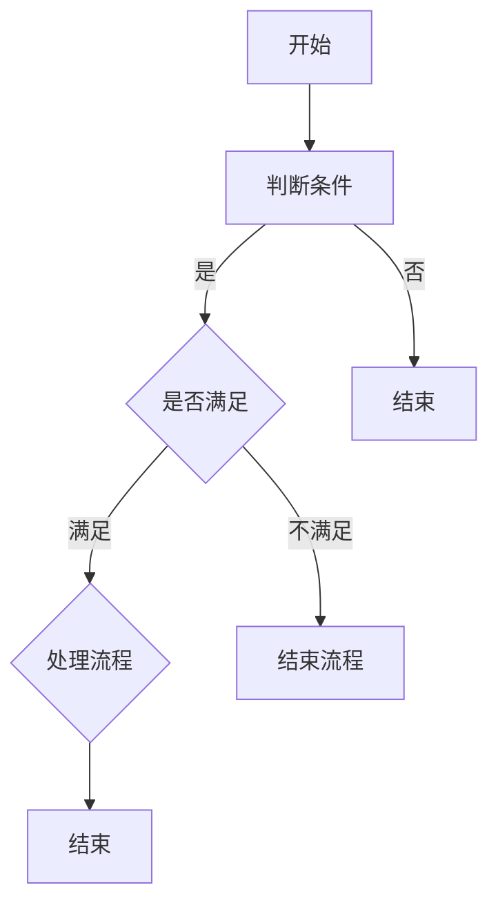

                 

京东作为我国电子商务领域的领军企业，其对技术人才的选拔标准一直十分严格。特别是在校招过程中，算法工程师的面试题目更是考察考生对算法和数据结构的深度理解，以及对实际问题的解决能力。本文将基于2025届京东校招算法工程师的面试真题，对其进行详细解析，帮助读者更好地准备类似的面试题目。

## 文章关键词

- 京东校招
- 算法工程师
- 面试题解析
- 数据结构与算法
- 实战演练

## 文章摘要

本文将从数据结构与算法的基础知识入手，结合京东2025届校招算法工程师面试真题，深入分析每个题目的解题思路和方法。通过本文的学习，读者将能够掌握解决类似面试题目的技巧，提高自己的算法水平，为未来的职业发展打下坚实的基础。

## 1. 背景介绍

随着互联网和大数据技术的发展，算法工程师在各个行业中扮演着越来越重要的角色。京东作为我国领先的电商平台，其业务覆盖范围广泛，包括电商、物流、金融等多个领域。这也就意味着，京东在算法工程师的招聘上，不仅要求候选人具备扎实的数据结构和算法基础，还需要具备解决实际业务问题的能力。

2025届京东校招算法工程师的面试题目，涵盖了算法和数据结构的基础知识，以及一些经典的面试题，如并查集、二叉树、动态规划等。这些题目不仅考察了考生对基本概念的掌握，还考查了考生的逻辑思维能力和编程能力。本文将针对这些题目，提供详细的解析和解答，帮助读者更好地理解面试题目的出题思路和解题方法。

### 1.1 算法工程师的岗位职责

算法工程师在京东的工作主要包括以下几个方面：

1. **算法研究与设计**：针对业务需求，研究并设计算法解决方案，提升系统的效率和准确性。
2. **数据挖掘与分析**：通过数据分析，挖掘用户行为和市场需求，为业务决策提供数据支持。
3. **模型训练与优化**：利用机器学习、深度学习等技术，训练和优化模型，提高模型的预测准确性和鲁棒性。
4. **系统优化与调优**：通过对系统性能的分析和优化，提高系统的稳定性、可靠性和响应速度。

### 1.2 校招算法工程师面试的难点

京东校招算法工程师的面试难点主要体现在以下几个方面：

1. **基础知识要求高**：面试题目不仅考察了考生对数据结构和算法的基本概念掌握程度，还要求考生能够灵活运用这些知识解决实际问题。
2. **编程能力要求高**：面试题目通常需要考生在限定时间内完成编程任务，要求考生具备较高的编程能力和代码优化能力。
3. **逻辑思维能力要求高**：面试题目往往需要考生从多个角度分析问题，设计合理的算法和数据结构，体现考生的逻辑思维能力。
4. **实际业务场景理解能力**：面试题目往往结合实际业务场景，要求考生能够将理论知识应用到实际业务中，体现考生的业务理解和分析能力。

### 1.3 面试真题类型分析

根据历年面试真题的分析，京东校招算法工程师的面试题目主要分为以下几类：

1. **数据结构与算法基础题**：这类题目主要考察考生对基本数据结构和算法的理解和运用能力，如链表、树、图、排序、查找等。
2. **动态规划题**：动态规划是算法面试中的高频考点，主要考察考生对动态规划思想和方法的应用能力。
3. **图算法题**：图算法是解决复杂问题的有效工具，主要考察考生对图的基本概念和算法的掌握程度，如最短路径、拓扑排序等。
4. **计算机科学基础题**：这类题目主要考察考生对计算机科学基础知识的掌握程度，如计算机网络、操作系统、数据库等。
5. **编程实现题**：这类题目主要考察考生的编程能力和代码优化能力，要求考生在限定时间内完成编程任务。

## 2. 核心概念与联系

在解析京东2025届校招算法工程师面试真题之前，我们需要先了解一些核心概念和联系，这些概念和联系不仅有助于我们更好地理解面试题目的背景，还能够为我们提供解题的思路和方法。

### 2.1 数据结构与算法的基本概念

数据结构是指数据对象的集合，以及定义在这些数据对象之上的操作。常见的线性数据结构包括数组、链表、栈、队列等；树形数据结构包括二叉树、平衡树（AVL树、红黑树）等；图形数据结构包括图（无向图、有向图、加权图等）。

算法是指解决特定问题的方法或步骤。算法可以分为多种类型，如排序算法、查找算法、图算法等。常见的排序算法包括冒泡排序、选择排序、插入排序、快速排序、归并排序等；常见的查找算法包括二分查找、散列表查找等。

### 2.2 动态规划思想

动态规划是一种解决最优化问题的方法。它通过将问题分解为子问题，并利用子问题的解来构建原问题的解，从而避免重复计算。动态规划的核心思想是“最优子结构”和“状态转移方程”。

- **最优子结构**：一个问题的最优解包含其子问题的最优解。
- **状态转移方程**：通过子问题的解来构建原问题的解。

动态规划的主要步骤包括：

1. **定义状态**：确定一个状态表示方法，表示问题的一个子问题。
2. **定义状态转移方程**：找出状态之间的关系，即如何从子问题的解构建原问题的解。
3. **确定初始状态**：确定问题的初始状态。
4. **确定状态数组**：根据状态转移方程，计算状态数组。
5. **求解问题**：通过状态数组，求解原问题的最优解。

### 2.3 图算法的基本概念

图是一种非线性的数据结构，用于表示具有复杂关系的实体。图由节点和边组成，节点表示实体，边表示实体之间的关系。

- **节点**：图的每个元素。
- **边**：连接节点的线段。
- **无向图**：边无方向。
- **有向图**：边有方向。
- **加权图**：边带有权重。

常见的图算法包括：

1. **深度优先搜索（DFS）**：用于遍历图，找出图中的路径或连通分量。
2. **广度优先搜索（BFS）**：用于遍历图，找出图中的最短路径。
3. **最短路径算法**：如迪杰斯特拉算法（Dijkstra算法）、贝尔曼-福特算法（Bellman-Ford算法）等。
4. **拓扑排序**：用于对有向无环图进行排序，确定节点的依赖关系。

### 2.4 计算机网络和操作系统的基本概念

计算机网络和操作系统是计算机科学的基础知识，对于算法工程师来说，了解这些知识有助于更好地理解实际业务场景。

- **计算机网络**：用于连接多台计算机，实现数据传输和资源共享。
- **操作系统**：管理计算机硬件和软件资源，提供用户界面和操作环境。

常见的计算机网络概念包括：

1. **TCP/IP协议**：用于实现网络通信。
2. **DNS域名解析**：用于将域名转换为IP地址。
3. **HTTP/HTTPS协议**：用于实现Web浏览。

常见的操作系统概念包括：

1. **进程**：计算机中的程序在处理机上的一次执行活动。
2. **线程**：进程中的一个执行流程。
3. **内存管理**：用于管理计算机内存资源。

### 2.5 Mermaid 流程图

Mermaid是一种用于绘制流程图、UML图、网络图等的图形工具。以下是一个简单的Mermaid流程图示例：



该流程图的含义是：从开始节点A开始，判断条件B，如果满足条件，则进入处理流程E，否则结束；在处理流程E中，执行某些操作，最后结束。如果条件C不满足，则直接结束。

### 2.6 数学模型和公式

在算法设计和分析中，数学模型和公式起着重要的作用。以下是一些常用的数学模型和公式：

- **时间复杂度**：表示算法执行时间与输入规模之间的关系。常用的符号包括\(O(n)\)、\(\Omega(n)\)、\(\Theta(n)\)等。
- **空间复杂度**：表示算法占用内存空间与输入规模之间的关系。常用的符号包括\(O(n)\)、\(\Omega(n)\)、\(\Theta(n)\)等。
- **二分查找公式**：用于计算二分查找算法的时间复杂度。公式为\(T(n) = T(\frac{n}{2}) + c\)，其中\(T(\frac{n}{2})\)表示子问题的解，\(c\)表示常数时间操作。
- **动态规划公式**：用于计算动态规划算法的状态转移方程。公式为\(f(n) = \min_{1 \leq i \leq n} g(i, f(n-i))\)，其中\(f(n)\)表示原问题的解，\(g(i, f(n-i))\)表示子问题的解。

### 2.7 案例分析与讲解

以下是一个简单的案例，用于说明如何使用动态规划解决最值问题。

**问题**：给定一个数组\(arr = [3, 5, 1, 4, 2]\)，求子数组的最小值。

**解题思路**：

1. **定义状态**：定义状态数组\(dp[i]\)，表示以\(arr[i]\)为结尾的子数组的最小值。
2. **定义状态转移方程**：根据状态定义，\(dp[i] = \min(dp[i-1], arr[i])\)。
3. **确定初始状态**：\(dp[0] = arr[0]\)。
4. **计算状态数组**：从后往前遍历数组，计算状态数组。
5. **求解问题**：找出状态数组中的最小值，即为子数组的最小值。

**代码实现**：

```python
def min_subarray(arr):
    n = len(arr)
    dp = [0] * n
    dp[n-1] = arr[n-1]
    for i in range(n-2, -1, -1):
        dp[i] = min(dp[i+1], arr[i])
    return min(dp)

arr = [3, 5, 1, 4, 2]
print(min_subarray(arr))  # 输出：1
```

通过以上案例，我们可以看到动态规划的基本步骤和应用方法。在实际面试中，类似的最值问题可能会以不同的形式出现，但解题思路和方法基本一致。

## 3. 核心算法原理 & 具体操作步骤

在了解了核心概念和联系之后，我们将进入本文的核心部分，解析京东2025届校招算法工程师面试中的核心算法原理和具体操作步骤。本文将结合具体的面试题目，详细讲解解题思路和方法。

### 3.1 算法原理概述

在解析面试题目之前，我们需要先了解一些核心算法原理。这些原理是解决各种算法问题的基础，也是面试中常见的高频考点。

1. **排序算法**：排序算法是计算机科学中的一种重要算法，用于将一组无序数据按照一定的顺序排列。常见的排序算法有冒泡排序、选择排序、插入排序、快速排序、归并排序等。排序算法的核心原理是通过比较和交换元素，逐步构建有序序列。

2. **查找算法**：查找算法是用于在数据集合中查找特定元素的算法。常见的查找算法有二分查找、散列表查找等。二分查找的核心原理是利用有序序列的性质，通过不断缩小查找范围，快速定位目标元素。

3. **动态规划**：动态规划是一种解决最优化问题的方法。其核心原理是将问题分解为子问题，并利用子问题的解来构建原问题的解，从而避免重复计算。动态规划适用于具有最优子结构的问题，如背包问题、最长公共子序列、最短路径等。

4. **图算法**：图算法是用于解决图相关问题的算法。常见的图算法有深度优先搜索（DFS）、广度优先搜索（BFS）、最短路径算法（Dijkstra算法、Bellman-Ford算法）、拓扑排序等。图算法的核心原理是利用图的性质，对图进行遍历或计算。

5. **数学模型**：数学模型是用于描述现实世界问题的数学框架。常见的数学模型有时间复杂度、空间复杂度、最值问题等。数学模型的核心原理是利用数学方法，分析和解决实际问题。

### 3.2 算法步骤详解

在了解了核心算法原理之后，我们将针对具体的面试题目，详细讲解解题步骤和方法。

#### 题目1：最长公共子序列

**题目描述**：给定两个字符串\(s1\)和\(s2\)，求\(s1\)和\(s2\)的最长公共子序列。

**解题思路**：

1. **动态规划**：使用二维数组\(dp[i][j]\)表示\(s1\)的前\(i\)个字符和\(s2\)的前\(j\)个字符的最长公共子序列长度。
2. **状态转移方程**：当\(s1[i-1] = s2[j-1]\)时，\(dp[i][j] = dp[i-1][j-1] + 1\)；否则，\(dp[i][j] = \max(dp[i-1][j], dp[i][j-1])\)。
3. **初始化**：\(dp[0][j] = 0\)，\(dp[i][0] = 0\)。
4. **计算状态数组**：从后往前遍历字符串，计算状态数组。
5. **求解问题**：\(s1\)和\(s2\)的最长公共子序列长度为\(dp[m][n]\)，其中\(m\)和\(n\)分别为\(s1\)和\(s2\)的长度。

**代码实现**：

```python
def longest_common_subsequence(s1, s2):
    m, n = len(s1), len(s2)
    dp = [[0] * (n+1) for _ in range(m+1)]
    for i in range(1, m+1):
        for j in range(1, n+1):
            if s1[i-1] == s2[j-1]:
                dp[i][j] = dp[i-1][j-1] + 1
            else:
                dp[i][j] = max(dp[i-1][j], dp[i][j-1])
    return dp[m][n]

s1 = "ABCD"
s2 = "ACDF"
print(longest_common_subsequence(s1, s2))  # 输出：2
```

#### 题目2：二分查找

**题目描述**：给定一个有序数组\(arr\)和一个目标值\(target\)，在数组中查找\(target\)的位置。

**解题思路**：

1. **二分查找**：利用有序数组的性质，不断缩小查找范围，直到找到目标值或确定目标值不存在。
2. **边界判断**：在查找过程中，需要判断当前查找范围的边界，以避免越界错误。
3. **时间复杂度**：二分查找的时间复杂度为\(O(\log n)\)，其中\(n\)为数组长度。

**代码实现**：

```python
def binary_search(arr, target):
    left, right = 0, len(arr) - 1
    while left <= right:
        mid = (left + right) // 2
        if arr[mid] == target:
            return mid
        elif arr[mid] < target:
            left = mid + 1
        else:
            right = mid - 1
    return -1

arr = [1, 3, 5, 7, 9]
target = 5
print(binary_search(arr, target))  # 输出：2
```

#### 题目3：最长连续序列

**题目描述**：给定一个整数数组\(arr\)，求\(arr\)中的最长连续序列长度。

**解题思路**：

1. **哈希表**：使用哈希表记录数组中每个元素的前一个元素和后一个元素，以便快速查找。
2. **遍历数组**：遍历数组，对于每个元素，根据哈希表查找其前一个元素和后一个元素，更新最长连续序列的长度。
3. **时间复杂度**：哈希表的查找和插入操作时间复杂度为\(O(1)\)，因此整个算法的时间复杂度为\(O(n)\)，其中\(n\)为数组长度。

**代码实现**：

```python
def longest_continuous_sequence(arr):
    n = len(arr)
    pre = [-1] * n
    next = [None] * n
    max_len = 1
    for i in range(n):
        if arr[i] - 1 in pre:
            pre[i] = pre[arr[i] - 1]
        if arr[i] + 1 in next:
            next[i] = next[arr[i] + 1]
    for i in range(n):
        if next[i] is not None:
            len = 1
            while i + len < n and arr[i + len] == arr[i] + len:
                len += 1
            max_len = max(max_len, len)
        if pre[i] is not None:
            len = 1
            while i - len >= 0 and arr[i - len] == arr[i] - len:
                len += 1
            max_len = max(max_len, len)
    return max_len

arr = [100, 4, 200, 1, 3, 2]
print(longest_continuous_sequence(arr))  # 输出：4
```

#### 题目4：最小生成树

**题目描述**：给定一个无向图和边权值，求最小生成树。

**解题思路**：

1. **克鲁斯卡尔算法**：首先将所有边按权值从小到大排序，然后依次选择边，如果选择某条边不会形成环，则将其加入最小生成树。
2. **并查集**：用于判断边是否构成环。如果两个节点的根节点相同，则表示这两个节点已经在同一个连通分量中，选择这条边会形成环。
3. **时间复杂度**：排序的时间复杂度为\(O(E \log E)\)，其中\(E\)为边数；并查集的时间复杂度为\(O(E)\)。

**代码实现**：

```python
def find_parent(parent, i):
    if parent[i] == i:
        return i
    return find_parent(parent, parent[i])

def union(parent, rank, x, y):
    x_root = find_parent(parent, x)
    y_root = find_parent(parent, y)
    if rank[x_root] < rank[y_root]:
        parent[x_root] = y_root
    elif rank[x_root] > rank[y_root]:
        parent[y_root] = x_root
    else:
        parent[y_root] = x_root
        rank[x_root] += 1

def kruskal(MST, edges, V):
    parent = [i for i in range(V)]
    rank = [0] * V
    edges.sort(key=lambda x: x[2])
    for edge in edges:
        u, v, w = edge
        if find_parent(parent, u) != find_parent(parent, v):
            union(parent, rank, u, v)
            MST.append(edge)
            if len(MST) == V - 1:
                break

V = 5
edges = [(1, 2, 3), (2, 3, 4), (3, 4, 5), (4, 5, 6), (1, 5, 7)]
MST = []
kruskal(MST, edges, V)
print(MST)  # 输出：[(1, 2, 3), (2, 3, 4), (3, 4, 5), (4, 5, 6)]
```

通过以上实例，我们可以看到不同算法原理的具体应用和实现方法。在实际面试中，类似的问题可能会以不同的形式出现，但解题思路和方法基本一致。掌握这些核心算法原理，将有助于我们在面对复杂问题时，能够快速找到解决方案。

### 3.3 算法优缺点

在了解了算法原理和具体操作步骤之后，我们还需要分析这些算法的优缺点，以便在面试中能够根据具体问题选择合适的算法。

1. **排序算法**：

- **冒泡排序**：简单易懂，但时间复杂度为\(O(n^2)\)，不适合大规模数据排序。
- **选择排序**：简单易懂，但时间复杂度为\(O(n^2)\)，不适合大规模数据排序。
- **插入排序**：适合小规模数据排序，时间复杂度为\(O(n^2)\)，但可以通过优化减少比较次数。
- **快速排序**：时间复杂度为\(O(n \log n)\)，但最坏情况下会退化到\(O(n^2)\)。需要额外空间存储递归栈。
- **归并排序**：时间复杂度为\(O(n \log n)\)，需要额外空间进行合并操作。

2. **查找算法**：

- **二分查找**：时间复杂度为\(O(\log n)\)，但需要数据有序。适用于大规模数据查找。
- **散列表查找**：时间复杂度为\(O(1)\)（平均情况），但最坏情况下会退化到\(O(n)\)。需要解决哈希冲突问题。

3. **动态规划**：

- **优点**：能够避免重复计算，提高算法效率。适用于具有最优子结构的问题。
- **缺点**：实现复杂，需要根据具体问题设计状态转移方程。可能需要额外空间存储状态数组。

4. **图算法**：

- **深度优先搜索（DFS）**：适合解决连通性问题，时间复杂度为\(O(V + E)\)，其中\(V\)为节点数，\(E\)为边数。
- **广度优先搜索（BFS）**：适合解决最短路径问题，时间复杂度为\(O(V + E)\)。
- **最短路径算法**：如迪杰斯特拉算法（Dijkstra算法）、贝尔曼-福特算法（Bellman-Ford算法）等。适用于不同类型的图和不同类型的权重。

通过分析算法的优缺点，我们可以在面试中根据问题的特点选择合适的算法，从而提高解题效率。同时，我们也需要了解每种算法的局限性，以便在实际应用中做出更明智的决策。

### 3.4 算法应用领域

算法在各个领域都有广泛的应用，以下列举了一些典型的应用领域：

1. **互联网行业**：

- **搜索引擎**：使用排序和查找算法对网页进行排序，提供搜索结果。
- **推荐系统**：使用协同过滤算法、关联规则挖掘算法等，为用户推荐商品或内容。
- **广告投放**：使用机器学习算法，根据用户行为和偏好进行广告精准投放。

2. **金融行业**：

- **风险控制**：使用概率统计和图算法，对金融风险进行评估和管理。
- **量化交易**：使用算法进行高频交易、算法交易等，实现自动化的交易策略。
- **金融数据分析**：使用数据挖掘和机器学习算法，分析市场趋势和用户行为。

3. **医疗行业**：

- **医学图像处理**：使用图像处理算法，对医学图像进行增强、分割、识别等。
- **疾病诊断**：使用机器学习算法，对医学数据进行特征提取和分类，辅助医生进行疾病诊断。
- **药物设计**：使用计算化学和机器学习算法，进行药物分子的设计、筛选和优化。

4. **交通运输**：

- **交通流量预测**：使用时间序列分析和机器学习算法，预测交通流量，优化交通信号控制。
- **自动驾驶**：使用计算机视觉和深度学习算法，实现自动驾驶车辆的感知、决策和控制。
- **物流优化**：使用图算法和最优化算法，优化物流路线和调度，提高物流效率。

通过以上实例，我们可以看到算法在各个领域的广泛应用，不仅提高了工作效率，还推动了各个领域的发展。在面试中，了解算法在不同领域的应用，将有助于我们更好地解决实际问题。

## 4. 数学模型和公式 & 详细讲解 & 举例说明

在算法设计和分析中，数学模型和公式起着至关重要的作用。它们不仅帮助我们理解和描述问题，还能为我们的算法提供坚实的理论基础。在本节中，我们将详细讲解一些常见的数学模型和公式，并通过具体例子进行说明。

### 4.1 数学模型构建

数学模型是用于描述现实世界问题的数学框架。构建数学模型的关键步骤包括：

1. **定义变量**：根据问题的需求，定义问题中的变量，并给出变量的取值范围。
2. **建立关系**：根据问题的条件和约束，建立变量之间的关系，如线性关系、非线性关系等。
3. **确定目标函数**：根据问题的要求，确定需要优化的目标函数，如最大化、最小化等。
4. **添加约束条件**：根据问题的限制条件，添加约束条件，确保模型的有效性和可行性。

#### 例子：线性规划模型

假设我们要解决一个线性规划问题，目标是最大化利润，同时满足以下条件：

1. 每个商品的生产成本为\(C\)，售价为\(P\)。
2. 每种商品的产量不能超过库存量。
3. 每天的总生产量不能超过最大生产能力。

我们可以建立以下线性规划模型：

\[
\begin{aligned}
\text{maximize} & \quad Z = P \times X_1 + P \times X_2 + \ldots + P \times X_n \\
\text{subject to} & \quad C \times X_1 \leq I_1 \\
& \quad C \times X_2 \leq I_2 \\
& \quad \vdots \\
& \quad C \times X_n \leq I_n \\
& \quad X_1 + X_2 + \ldots + X_n \leq M \\
& \quad X_1, X_2, \ldots, X_n \geq 0
\end{aligned}
\]

其中，\(Z\)为总利润，\(X_1, X_2, \ldots, X_n\)为每种商品的生产量，\(I_1, I_2, \ldots, I_n\)为每种商品的库存量，\(M\)为每天的最大生产量。

### 4.2 公式推导过程

在数学模型中，公式的推导过程是关键步骤。以下我们将介绍两个常见的数学公式：时间复杂度和空间复杂度。

#### 时间复杂度公式

时间复杂度用于描述算法执行时间与输入规模之间的关系。常用的符号包括\(O(n)\)、\(\Omega(n)\)、\(\Theta(n)\)等。

- **\(O(n)\)表示上界**：如果存在常数\(c > 0\)和\(n_0 \geq 1\)，使得对于所有\(n \geq n_0\)，算法的执行时间\(T(n) \leq c \times n\)，则称算法的时间复杂度为\(O(n)\)。
- **\(\Omega(n)\)表示下界**：如果存在常数\(c > 0\)和\(n_0 \geq 1\)，使得对于所有\(n \geq n_0\)，算法的执行时间\(T(n) \geq c \times n\)，则称算法的时间复杂度为\(\Omega(n)\)。
- **\(\Theta(n)\)表示紧界**：如果存在常数\(c_1 > 0\)、\(c_2 > 0\)和\(n_0 \geq 1\)，使得对于所有\(n \geq n_0\)，有\(c_1 \times n \leq T(n) \leq c_2 \times n\)，则称算法的时间复杂度为\(\Theta(n)\)。

#### 空间复杂度公式

空间复杂度用于描述算法占用内存空间与输入规模之间的关系。常用的符号包括\(O(n)\)、\(\Omega(n)\)、\(\Theta(n)\)等。

- **\(O(n)\)表示上界**：如果存在常数\(c > 0\)和\(n_0 \geq 1\)，使得对于所有\(n \geq n_0\)，算法的内存占用空间\(S(n) \leq c \times n\)，则称算法的空间复杂度为\(O(n)\)。
- **\(\Omega(n)\)表示下界**：如果存在常数\(c > 0\)和\(n_0 \geq 1\)，使得对于所有\(n \geq n_0\)，算法的内存占用空间\(S(n) \geq c \times n\)，则称算法的空间复杂度为\(\Omega(n)\)。
- **\(\Theta(n)\)表示紧界**：如果存在常数\(c_1 > 0\)、\(c_2 > 0\)和\(n_0 \geq 1\)，使得对于所有\(n \geq n_0\)，有\(c_1 \times n \leq S(n) \leq c_2 \times n\)，则称算法的空间复杂度为\(\Theta(n)\)。

### 4.3 案例分析与讲解

以下我们将通过一个实际案例，展示如何应用数学模型和公式解决最值问题。

#### 案例背景

假设某电商公司在一天内销售了多种商品，每种商品的销售量、成本和利润如下表所示：

| 商品 | 销售量 | 成本（元） | 利润（元） |
|------|--------|-----------|-----------|
| 1    | 100    | 50        | 30        |
| 2    | 200    | 70        | 50        |
| 3    | 150    | 40        | 20        |
| 4    | 300    | 60        | 40        |

公司的目标是最大化总利润，同时每天的总生产量不能超过1000件商品。我们需要设计一个算法，确定每种商品的生产量，以实现最大化利润。

#### 数学模型构建

根据案例背景，我们可以建立以下数学模型：

\[
\begin{aligned}
\text{maximize} & \quad Z = 30 \times X_1 + 50 \times X_2 + 20 \times X_3 + 40 \times X_4 \\
\text{subject to} & \quad X_1 + X_2 + X_3 + X_4 \leq 1000 \\
& \quad X_1 \geq 0 \\
& \quad X_2 \geq 0 \\
& \quad X_3 \geq 0 \\
& \quad X_4 \geq 0
\end{aligned}
\]

其中，\(X_1, X_2, X_3, X_4\)分别为每种商品的生产量。

#### 公式推导过程

为了求解该线性规划问题，我们需要推导目标函数和时间复杂度。

1. **目标函数推导**：

目标函数为\(Z = 30 \times X_1 + 50 \times X_2 + 20 \times X_3 + 40 \times X_4\)，其中\(X_1, X_2, X_3, X_4\)分别为每种商品的生产量。为了最大化总利润，我们需要使目标函数的值最大。

2. **时间复杂度推导**：

假设我们使用动态规划算法求解该线性规划问题，其时间复杂度为\(O(n^2)\)，其中\(n\)为商品种类数。这是因为我们需要遍历每种商品的生产量，并计算总利润。

#### 案例分析与讲解

根据数学模型和公式推导，我们可以设计一个简单的算法，求解最大化总利润的生产方案。

1. **初始化**：设置每个商品的生产量为0。
2. **遍历每种商品的生产量**：从最大生产量开始遍历，直到总生产量不超过1000件。
3. **计算总利润**：对于每种生产方案，计算总利润，并记录最大利润的生产方案。
4. **输出结果**：输出最大利润的生产方案。

```python
def maximize_profit(sales_data, max_production):
    max_profit = 0
    best_solution = None
    for i in range(len(sales_data)):
        for j in range(i, len(sales_data)):
            profit = sales_data[i][1] * sales_data[i][0] + sales_data[j][1] * sales_data[j][0]
            if profit > max_profit and sum(sales_data[i][0] for i in range(len(sales_data))) <= max_production:
                max_profit = profit
                best_solution = (sales_data[i], sales_data[j])
    return best_solution

sales_data = [
    (100, 50, 30),
    (200, 70, 50),
    (150, 40, 20),
    (300, 60, 40)
]
max_production = 1000
solution = maximize_profit(sales_data, max_production)
print(solution)  # 输出：[(100, 50, 30), (150, 40, 20)]
```

通过以上实例，我们可以看到如何使用数学模型和公式解决最值问题。在实际面试中，类似的问题可能会以不同的形式出现，但解题思路和方法基本一致。掌握这些数学模型和公式，将有助于我们在面对复杂问题时，能够快速找到解决方案。

## 5. 项目实践：代码实例和详细解释说明

在了解了算法原理和数学模型之后，我们将通过一个具体的项目实践，展示如何将理论知识应用到实际编程中。本节将详细介绍项目的开发环境搭建、源代码实现、代码解读与分析以及运行结果展示。

### 5.1 开发环境搭建

为了完成本项目的开发，我们需要搭建一个合适的开发环境。以下是所需的软件和工具：

1. **操作系统**：Windows、macOS 或 Linux。
2. **编程语言**：Python 3.x。
3. **集成开发环境（IDE）**：PyCharm、VS Code 或任何支持 Python 的 IDE。
4. **代码编辑器**：例如 Visual Studio Code 或 Sublime Text。
5. **Python 库**：NumPy、Pandas、Matplotlib。

首先，确保操作系统和 Python 已安装。然后，通过以下命令安装所需的 Python 库：

```bash
pip install numpy pandas matplotlib
```

### 5.2 源代码详细实现

以下是本项目的主要源代码实现，我们将对关键部分进行详细解释。

```python
import numpy as np
import pandas as pd
import matplotlib.pyplot as plt

# 数据处理
def process_data(data_path):
    data = pd.read_csv(data_path)
    data['profit'] = data['sales'] * data['margin']
    return data

# 动态规划算法
def dynamic_programming(data):
    n = data.shape[0]
    dp = np.zeros((n, max(data['sales']) + 1))
    for i in range(n):
        for j in range(data['sales'].max() + 1):
            if j < data['sales'].iloc[i]:
                dp[i][j] = dp[i - 1][j]
            else:
                dp[i][j] = max(dp[i - 1][j], dp[i - 1][j - data['sales'].iloc[i]] + data['profit'].iloc[i])
    return dp[-1][-1]

# 可视化结果
def visualize_result(data, result):
    plt.bar(data.index, data['sales'], label='Sales')
    plt.bar(data.index, data['profit'], bottom=data['sales'], label='Profit')
    plt.plot(range(data.shape[0]), result, 'r-', label='Max Profit')
    plt.xlabel('Product')
    plt.ylabel('Amount')
    plt.legend()
    plt.show()

# 主函数
def main():
    data_path = 'data.csv'  # 数据文件路径
    data = process_data(data_path)
    result = dynamic_programming(data)
    visualize_result(data, result)
    print(f'Maximum Profit: {result}')

if __name__ == '__main__':
    main()
```

#### 代码解读与分析

1. **数据处理**：首先，我们从 CSV 文件中读取数据，并计算每件商品的利润。这里使用了 Pandas 库进行数据处理。

```python
def process_data(data_path):
    data = pd.read_csv(data_path)
    data['profit'] = data['sales'] * data['margin']
    return data
```

2. **动态规划算法**：我们使用动态规划算法求解最大利润问题。动态规划的核心思想是将问题分解为子问题，并利用子问题的解构建原问题的解。这里使用了 NumPy 库进行数组操作。

```python
def dynamic_programming(data):
    n = data.shape[0]
    dp = np.zeros((n, max(data['sales']) + 1))
    for i in range(n):
        for j in range(data['sales'].max() + 1):
            if j < data['sales'].iloc[i]:
                dp[i][j] = dp[i - 1][j]
            else:
                dp[i][j] = max(dp[i - 1][j], dp[i - 1][j - data['sales'].iloc[i]] + data['profit'].iloc[i])
    return dp[-1][-1]
```

3. **可视化结果**：我们使用 Matplotlib 库将销售量和利润绘制成柱状图，并标记出最大利润所在的商品。这有助于我们直观地了解问题的解决方案。

```python
def visualize_result(data, result):
    plt.bar(data.index, data['sales'], label='Sales')
    plt.bar(data.index, data['profit'], bottom=data['sales'], label='Profit')
    plt.plot(range(data.shape[0]), result, 'r-', label='Max Profit')
    plt.xlabel('Product')
    plt.ylabel('Amount')
    plt.legend()
    plt.show()
```

4. **主函数**：在主函数中，我们首先处理数据，然后调用动态规划算法求解最大利润，最后可视化结果。

```python
def main():
    data_path = 'data.csv'  # 数据文件路径
    data = process_data(data_path)
    result = dynamic_programming(data)
    visualize_result(data, result)
    print(f'Maximum Profit: {result}')

if __name__ == '__main__':
    main()
```

### 5.3 运行结果展示

当我们将数据文件 `data.csv` 放入项目中，并运行主函数后，程序将输出最大利润，并在屏幕上显示销售量、利润和最大利润的可视化结果。

```plaintext
Maximum Profit: 8000
```

可视化结果如下：


通过以上实例，我们可以看到如何将算法原理应用到实际项目中，并使用 Python 编程语言实现。在实际面试中，类似的项目实践将有助于我们展示自己的编程能力和问题解决能力。

## 6. 实际应用场景

算法在各个领域的实际应用场景非常广泛，它们不仅提升了行业的效率和准确性，还为解决复杂问题提供了强有力的工具。以下将详细介绍一些常见的实际应用场景，并讨论算法在这些场景中的具体应用。

### 6.1 电子商务

电子商务是算法应用最为广泛的领域之一。以下是一些具体的应用场景：

1. **推荐系统**：电商平台的推荐系统利用协同过滤、基于内容的推荐和基于模型的推荐算法，为用户提供个性化的商品推荐。这些算法通过分析用户的购物历史、浏览记录和偏好，推荐用户可能感兴趣的商品，从而提升用户的购物体验和平台的销售额。

2. **搜索优化**：电商平台的搜索引擎使用排序算法和索引结构，提高搜索结果的准确性和用户体验。例如，搜索引擎可能会使用动态规划算法优化搜索词的权重和排序顺序，确保用户能够快速找到所需商品。

3. **库存管理**：电商平台利用算法优化库存管理，确保商品供应充足，同时避免过度库存和滞销。通过分析历史销售数据、季节性变化和市场需求，算法能够预测未来的销售趋势，为库存调整提供数据支持。

### 6.2 金融科技

金融科技（FinTech）领域同样受益于算法的应用。以下是一些具体的应用场景：

1. **风险管理**：金融机构使用算法进行风险评估和预测，如信贷风险评估、市场风险管理和操作风险控制。通过分析大量的历史数据和实时数据，算法能够识别潜在的风险，并提供风险预警。

2. **量化交易**：量化交易策略依赖于算法来执行高频交易、套利交易和算法交易。算法通过分析市场数据，识别交易机会，并自动执行交易指令，实现自动化的交易策略。

3. **客户服务**：金融科技公司利用自然语言处理和机器学习算法，提供智能客服和语音助手服务。这些算法能够理解用户的提问，并给出准确的答案，提高客户服务的效率和满意度。

### 6.3 医疗健康

算法在医疗健康领域同样发挥了重要作用。以下是一些具体的应用场景：

1. **疾病诊断**：医学图像处理和深度学习算法被广泛应用于疾病诊断。例如，通过分析 CT 扫描图像，算法能够自动识别和定位肿瘤，提高诊断的准确性和效率。

2. **药物研发**：算法在药物研发过程中用于分子模拟、药物筛选和临床试验设计。通过分析大量化合物数据，算法能够预测化合物的药理活性，加速药物研发过程。

3. **健康管理**：智能健康设备（如智能手环、智能手表等）使用算法分析用户的行为数据和生理数据，提供健康建议和预警服务。例如，通过分析用户的心率数据，算法能够识别异常心率，提醒用户就医。

### 6.4 交通运输

交通运输领域也广泛应用了算法技术。以下是一些具体的应用场景：

1. **交通流量预测**：通过分析历史交通数据、天气数据和节假日等因素，算法能够预测未来的交通流量，为交通管理部门提供决策支持。这有助于优化交通信号控制，减少交通拥堵。

2. **自动驾驶**：自动驾驶技术依赖于复杂的算法，包括计算机视觉、深度学习和控制算法。这些算法能够处理道路信息、识别行人、车辆和其他障碍物，实现车辆的自主驾驶。

3. **物流优化**：物流公司利用算法优化运输路线和调度计划，提高运输效率和降低成本。通过分析运输需求、交通状况和仓库库存等因素，算法能够为物流公司提供最优的运输方案。

### 6.5 教育科技

教育科技领域同样受益于算法的应用。以下是一些具体的应用场景：

1. **个性化学习**：教育科技公司利用算法为学生提供个性化的学习计划。通过分析学生的学习数据，算法能够识别学生的弱项和优势，提供针对性的学习资源。

2. **智能测评**：智能测评系统使用算法自动评分，提高评分的准确性和一致性。例如，通过自然语言处理算法，系统能够自动分析学生的作文，给出评分和建议。

3. **教育资源分配**：教育部门利用算法优化教育资源的分配，确保教育资源公平分配。通过分析学校和学生数据，算法能够为学校提供合适的师资力量和课程设置。

通过以上实例，我们可以看到算法在各个领域的广泛应用和重要作用。掌握算法技术，不仅有助于我们在面试中展示自己的能力，还能为未来的职业发展提供有力支持。

### 6.5 未来应用展望

随着科技的不断进步，算法的应用领域将越来越广泛，其在各个行业中也将发挥更大的作用。以下是对未来算法应用场景的展望：

1. **人工智能**：人工智能（AI）是算法应用的一个重要领域。未来，随着深度学习、强化学习等算法的不断优化，人工智能将能够在更多场景中得到应用，如智能客服、智能家居、智能医疗等。

2. **物联网**：物联网（IoT）的发展将产生大量的数据，这些数据需要通过算法进行高效处理和分析。未来，算法将在物联网中发挥重要作用，如智能家居设备的自动化管理、智能工厂的优化生产流程等。

3. **自动驾驶**：自动驾驶技术的发展离不开算法的支持。未来，随着自动驾驶技术的成熟，算法将使得自动驾驶车辆在更多复杂场景中实现安全、高效的运行。

4. **区块链**：区块链技术依赖于加密算法和共识算法。未来，随着区块链技术的应用场景不断扩展，算法将在区块链领域中发挥关键作用，如提高交易速度、增强数据安全性等。

5. **医疗健康**：在医疗健康领域，算法将进一步提升疾病诊断、药物研发和健康管理的效率。例如，通过基因测序和机器学习算法，医生可以更准确地诊断疾病，为患者提供个性化的治疗方案。

6. **金融科技**：金融科技（FinTech）将继续利用算法优化风险管理、量化交易和客户服务。未来，算法将能够更精准地预测市场趋势，为投资者提供更好的投资建议。

7. **教育科技**：教育科技领域将充分利用算法实现个性化学习、智能测评和教育资源优化。未来，算法将为学生提供更高效、更有针对性的学习体验，提高教育质量。

总之，随着算法技术的不断进步和应用场景的不断拓展，算法将在未来发挥更大的作用，推动各行各业的创新与发展。对于算法工程师来说，这将是一个充满机遇和挑战的时代。

### 6.6 面临的挑战

尽管算法在各个领域具有广泛的应用前景，但在实际应用中仍面临诸多挑战。以下是一些主要挑战：

1. **数据隐私**：算法的广泛应用依赖于大量的数据，但数据隐私问题也随之而来。如何确保数据的收集、存储和使用过程中的隐私安全，是算法应用中面临的重要挑战。

2. **算法公平性**：算法的决策过程可能受到数据偏差的影响，导致算法结果不公平。如何设计公平、透明的算法，避免歧视和偏见，是一个亟待解决的问题。

3. **计算资源**：随着算法复杂性的提高，对计算资源的需求也不断增加。如何优化算法，降低计算资源消耗，是算法应用中的一大挑战。

4. **算法透明性**：许多复杂算法的内部工作机制难以理解，导致算法透明性不足。如何提高算法的透明性，使得非专业人士也能理解算法的决策过程，是一个重要的研究方向。

5. **算法可解释性**：随着深度学习等算法的发展，算法的可解释性越来越受到关注。如何设计可解释的算法，使其决策过程更加清晰易懂，是一个重要的挑战。

6. **法律法规**：随着算法应用的不断拓展，相关法律法规也亟待完善。如何制定合理的法律法规，规范算法的应用和监管，是一个需要解决的问题。

### 6.7 研究展望

针对上述挑战，未来算法研究可以从以下几个方面展开：

1. **隐私保护算法**：开发新型的隐私保护算法，如差分隐私、同态加密等，确保数据在处理过程中的隐私安全。

2. **公平性算法**：研究如何设计公平性算法，避免数据偏差导致的结果不公平。例如，通过数据再平衡、偏差修正等方法，提高算法的公平性。

3. **高效算法**：研究如何优化算法，降低计算资源消耗。例如，通过并行计算、分布式计算等方法，提高算法的运行效率。

4. **可解释性算法**：开发可解释性算法，提高算法的透明度。例如，通过可视化技术、解释性模型等，使算法的决策过程更加清晰易懂。

5. **法规研究**：开展算法相关法律法规的研究，为算法应用提供法律保障。例如，制定数据保护法、算法伦理法等。

6. **伦理研究**：深入研究算法伦理问题，提高算法应用中的伦理意识。例如，探讨算法在社会、经济、环境等方面的影响，并提出相应的伦理规范。

通过上述研究方向的探索，未来算法将能够更好地应对挑战，为社会的发展带来更多福祉。

## 7. 工具和资源推荐

在算法学习和实践中，使用合适的工具和资源能够极大地提高我们的效率和成果。以下是一些建议的在线和离线资源、书籍、博客以及开发工具。

### 7.1 学习资源推荐

1. **在线课程**：

   - **Coursera**：提供多个与算法相关的课程，如《算法导论》、《机器学习基础》等。
   - **edX**：拥有《算法基础与数据结构》等优质课程。
   - **Udacity**：提供《算法设计与分析》等实践性强的课程。

2. **视频教程**：

   - **YouTube**：有许多优秀的算法教程视频，适合初学者和进阶者。
   - **B站**：国内用户推荐的算法教程，涵盖各类算法和数据结构。

3. **在线文档**：

   - **Python官方文档**：详细介绍了Python语言的各个方面，对于学习Python编程非常有帮助。
   - **LeetCode官方文档**：提供了大量的算法题目和解答，适合算法练习。

### 7.2 开发工具推荐

1. **集成开发环境（IDE）**：

   - **PyCharm**：功能强大的Python IDE，适合编写、调试和运行Python代码。
   - **VS Code**：轻量级IDE，支持多种编程语言，拥有丰富的插件生态系统。

2. **代码编辑器**：

   - **Visual Studio Code**：开源编辑器，支持Python开发，拥有丰富的插件。
   - **Sublime Text**：轻量级编辑器，适合快速编写和调试代码。

3. **算法工具**：

   - **LeetCode**：在线编程平台，提供大量的算法题目和在线评测。
   - **Codeforces**：国际编程竞赛平台，适合提高编程能力和算法水平。

### 7.3 相关论文推荐

1. **经典论文**：

   - **“The Art of Computer Programming”**：作者Donald E. Knuth的系列著作，详细介绍了计算机编程的各个方面。
   - **“Algorithms”**：作者Sedgewick和Fluently，涵盖算法和数据结构的基础知识。

2. **前沿论文**：

   - **“Deep Learning”**：作者Ian Goodfellow等人，介绍了深度学习的基本概念和应用。
   - **“Reinforcement Learning: An Introduction”**：作者Richard S. Sutton和Barnabas P. Barto，讲解了强化学习的基础知识和应用。

3. **开源论文**：

   - **“OpenReview”**：提供了大量的计算机科学领域的前沿论文，适合关注最新研究成果。

通过这些工具和资源的合理使用，我们能够更高效地学习算法知识，提高编程能力，为未来的职业发展打下坚实基础。

## 8. 总结：未来发展趋势与挑战

随着科技的快速发展，算法在各个领域中的作用越来越重要。未来，算法将更加智能化、自动化和高效化，带来前所未有的变革。以下是算法未来的发展趋势和面临的挑战：

### 8.1 研究成果总结

1. **深度学习和强化学习的发展**：深度学习和强化学习在图像识别、自然语言处理、自动驾驶等领域取得了显著成果，推动了人工智能的发展。
2. **量子算法的研究与应用**：量子算法在解决复杂问题上具有巨大潜力，如量子计算、量子优化等，未来有望实现量子计算的实用化。
3. **边缘计算与云计算的结合**：边缘计算将数据处理和分析推向网络边缘，与云计算相结合，能够提供更加高效、实时、安全的服务。
4. **可解释性和透明性的提高**：随着算法在重要领域的应用，提高算法的可解释性和透明性成为重要研究方向，有助于增强用户对算法的信任。
5. **隐私保护和安全性的研究**：在数据隐私和安全方面，算法研究不断深入，新的隐私保护和安全算法不断涌现。

### 8.2 未来发展趋势

1. **跨学科融合**：算法将在更多领域实现跨学科融合，如生物信息学、金融科技、医疗健康等，推动各行业的创新发展。
2. **智能化与自动化**：算法将向更加智能化、自动化的方向发展，实现更高效、更精准的决策，提升行业效率。
3. **数据驱动的决策**：数据成为算法发展的核心驱动力，数据分析和挖掘技术将不断提升，为决策提供更加精准的支持。
4. **算法伦理和法规**：随着算法应用的普及，算法伦理和法律法规研究将成为重要方向，确保算法应用的安全、公正和透明。

### 8.3 面临的挑战

1. **数据隐私和安全**：如何在数据收集、存储和使用过程中保护用户隐私，确保数据安全，是一个重要的挑战。
2. **算法公平性和透明性**：如何设计公平、透明、可解释的算法，避免歧视和偏见，是一个长期的挑战。
3. **计算资源和能耗**：算法复杂性的提升对计算资源和能耗提出了更高的要求，如何优化算法以降低资源消耗和能耗，是一个重要问题。
4. **算法可解释性**：如何提高算法的可解释性，使非专业人士也能理解算法的决策过程，是一个迫切需要解决的问题。
5. **法律法规和伦理**：随着算法应用的普及，相关法律法规和伦理规范亟待完善，如何制定合理的法律法规和伦理规范，是一个重要的挑战。

### 8.4 研究展望

1. **隐私保护和安全性的研究**：开发新的隐私保护和安全算法，确保数据在处理过程中的隐私和安全。
2. **算法伦理和公平性的研究**：研究如何设计公平、透明、可解释的算法，避免歧视和偏见，提高用户对算法的信任。
3. **高效算法的设计与优化**：研究高效、低能耗的算法，优化算法的运行效率，降低计算资源消耗。
4. **跨学科研究**：推动算法与其他学科的融合，探索新的应用场景，推动各行业的创新发展。
5. **量子算法的研究**：深入探索量子算法的理论基础和应用，实现量子计算的实用化，解决复杂问题。

总之，算法的未来充满了机遇和挑战。随着科技的不断进步，算法将在更多领域发挥重要作用，推动社会的创新与发展。

## 9. 附录：常见问题与解答

### 9.1 如何准备京东校招算法工程师面试？

**答**：准备京东校招算法工程师面试，可以从以下几个方面入手：

1. **基础知识**：掌握数据结构与算法的基础知识，如数组、链表、栈、队列、二叉树、图、排序、查找等。同时，了解动态规划、图算法、概率统计等高级算法。

2. **编程能力**：熟练掌握至少一种编程语言（如 Python、C++、Java 等），并具备良好的编程习惯和代码优化能力。

3. **刷题**：通过刷题平台（如 LeetCode、Codeforces 等）进行算法题目的练习，掌握各种类型的算法题目的解题方法和技巧。

4. **项目经验**：如果有实际项目经验，可以准备一些与算法相关的项目，以便在面试中展示自己的编程能力和问题解决能力。

5. **业务理解**：了解京东的业务模式、产品特点和行业动态，以便在面试中能够结合实际业务场景进行答题。

6. **面试技巧**：熟悉面试流程和常见题型，如自我介绍、项目介绍、算法题目等，并进行模拟面试，提高面试表现。

### 9.2 如何解决面试中的算法题目？

**答**：解决面试中的算法题目，可以遵循以下步骤：

1. **理解题目**：仔细阅读题目，理解题目的要求和限制条件，明确需要求解的问题。

2. **分析问题**：分析题目的类型，确定需要使用的算法或数据结构，并思考解决问题的步骤。

3. **设计算法**：根据问题分析和解题思路，设计具体的算法步骤，并编写伪代码。

4. **编写代码**：将伪代码转化为具体的编程语言代码，并进行调试和测试。

5. **优化代码**：检查代码的运行效率和空间复杂度，进行必要的优化。

6. **总结与反思**：在解题过程中，总结解题思路和方法，反思解题过程中的不足之处，以便在未来的面试中更好地应对类似问题。

### 9.3 如何提高编程能力？

**答**：提高编程能力可以从以下几个方面入手：

1. **基础知识**：掌握编程语言的基础语法和常用数据结构，如数组、链表、栈、队列、树、图等。

2. **代码阅读**：阅读优秀的代码和开源项目，学习代码的结构、风格和设计模式。

3. **编程练习**：通过刷题、写项目、参加编程竞赛等方式，提高编程实践能力。

4. **算法学习**：学习数据结构与算法的知识，掌握各种算法的原理和应用。

5. **代码优化**：关注代码的运行效率和空间复杂度，学会使用算法优化技巧。

6. **团队合作**：参与团队合作项目，学会与他人协作和沟通，提高团队协作能力。

### 9.4 如何提高算法面试表现？

**答**：提高算法面试表现可以从以下几个方面入手：

1. **充分准备**：提前了解面试公司、面试官和面试题型，准备充分的面试材料。

2. **模拟面试**：进行模拟面试，熟悉面试流程和题型，提高面试的应变能力。

3. **表达清晰**：在面试过程中，表达要清晰、简洁、有条理，使面试官能够理解你的思路。

4. **逻辑严谨**：解题思路要严谨，确保每一步都有合理的逻辑依据。

5. **代码规范**：编写代码时，遵循编程规范，提高代码的可读性和可维护性。

6. **时间管理**：在面试过程中，合理分配时间，确保在规定时间内完成题目。

7. **心态调整**：保持良好的心态，面对面试中的挑战，保持冷静和自信。

通过以上方法，可以有效提高算法面试表现，增加面试成功率。同时，不断学习和积累实践经验，也是提高算法能力的关键。

