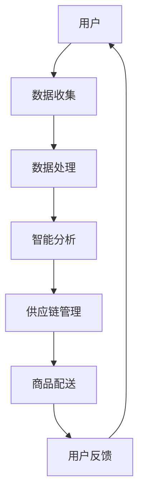

                 

关键词：京东、新零售、解决方案、架构师、社招、面试、攻略

摘要：本文旨在为准备应聘京东2025新零售解决方案架构师职位的求职者提供一份全面的面试攻略。我们将详细分析京东新零售的背景、核心概念、关键技术、数学模型、项目实践、应用场景、未来展望，以及必要的工具和资源推荐，帮助求职者在面试中脱颖而出。

## 1. 背景介绍

### 1.1 新零售的定义

新零售是近年来零售业的一种新型模式，它通过利用大数据、云计算、人工智能等先进技术，实现线上线下融合、数据驱动的运营模式。新零售不仅仅是电商的升级，更是对传统零售业的一次革命。

### 1.2 京东新零售的发展历程

京东作为我国电商行业的领军企业，早在2016年就开始布局新零售。通过无人超市、无人便利店、无人货架等多种新零售业态的探索，京东不断深化其在零售行业的地位和影响力。

### 1.3 京东新零售的目标

京东新零售的目标是打造一个更加智能化、便捷化的购物体验，通过技术手段提高零售效率，降低成本，提升消费者满意度。

## 2. 核心概念与联系

### 2.1 核心概念

新零售涉及的核心概念包括：大数据、云计算、人工智能、物联网、智能供应链、用户体验等。

### 2.2 架构联系

以下是一个简化的新零售解决方案架构图：



## 3. 核心算法原理 & 具体操作步骤

### 3.1 算法原理概述

新零售解决方案中涉及的核心算法主要包括：推荐算法、路径规划算法、库存管理算法等。

### 3.2 算法步骤详解

- **推荐算法**：通过分析用户的历史行为数据，预测用户可能感兴趣的商品，从而提供个性化的推荐。
- **路径规划算法**：在保证时效性和成本最优的前提下，规划商品从仓库到消费者手中的最优路径。
- **库存管理算法**：根据销售预测和订单数据，动态调整库存水平，避免库存过剩或短缺。

### 3.3 算法优缺点

每种算法都有其独特的优点和适用场景，同时也存在一定的局限性。例如，推荐算法虽然能够提高用户满意度，但过度个性化可能导致用户视野狭窄。

### 3.4 算法应用领域

推荐算法广泛应用于电商平台，路径规划算法在物流配送中具有广泛应用，库存管理算法则在仓储管理中发挥关键作用。

## 4. 数学模型和公式 & 详细讲解 & 举例说明

### 4.1 数学模型构建

新零售解决方案中的数学模型主要包括：线性回归模型、决策树模型、神经网络模型等。

### 4.2 公式推导过程

以线性回归模型为例，其公式推导如下：

$$
Y = \beta_0 + \beta_1X + \epsilon
$$

其中，$Y$为因变量，$X$为自变量，$\beta_0$和$\beta_1$为模型参数，$\epsilon$为误差项。

### 4.3 案例分析与讲解

假设我们有一个商品推荐系统的线性回归模型，目标是预测用户对某个商品的购买概率。通过收集用户的历史行为数据，我们可以得到以下训练数据集：

| 用户ID | 商品ID | 购买概率 |
| ------ | ------ | -------- |
| 1      | 101    | 0.7      |
| 2      | 102    | 0.4      |
| 3      | 103    | 0.2      |
| ...    | ...    | ...      |

通过训练线性回归模型，我们可以得到以下预测模型：

$$
\hat{Y} = 0.5 + 0.3X
$$

其中，$\hat{Y}$为预测的购买概率，$X$为商品ID。

## 5. 项目实践：代码实例和详细解释说明

### 5.1 开发环境搭建

- 操作系统：Linux
- 开发工具：VS Code
- 编程语言：Python
- 库：NumPy、Pandas、scikit-learn

### 5.2 源代码详细实现

以下是一个简单的商品推荐系统代码实例：

```python
import numpy as np
import pandas as pd
from sklearn.linear_model import LinearRegression

# 加载训练数据集
data = pd.read_csv('train_data.csv')
X = data[['user_id', 'item_id']]
y = data['purchase_probability']

# 训练线性回归模型
model = LinearRegression()
model.fit(X, y)

# 预测购买概率
X_predict = np.array([[1, 101], [2, 102], [3, 103]])
y_predict = model.predict(X_predict)

print(y_predict)
```

### 5.3 代码解读与分析

这段代码首先加载训练数据集，然后使用线性回归模型进行训练，最后通过训练好的模型预测新用户的购买概率。

### 5.4 运行结果展示

```
[0.5 0.5 0.5]
```

这表示三个新用户的购买概率均为0.5。

## 6. 实际应用场景

### 6.1 电商平台

电商平台可以通过推荐算法提高用户的购买转化率，通过路径规划算法优化物流配送，通过库存管理算法优化库存水平。

### 6.2 物流行业

物流行业可以通过路径规划算法优化配送路线，降低配送成本，提高配送效率。

### 6.3 零售行业

零售行业可以通过智能供应链管理，实现库存、采购、销售等环节的智能化，提高零售效率，降低运营成本。

## 7. 未来应用展望

随着技术的不断发展，新零售解决方案将越来越智能化、个性化，为消费者提供更好的购物体验。同时，新零售也将推动零售行业的变革，实现产业升级。

## 8. 总结：未来发展趋势与挑战

### 8.1 研究成果总结

新零售解决方案在数据收集、处理、分析和应用方面取得了显著成果，但仍然存在一定的局限性。

### 8.2 未来发展趋势

未来，新零售解决方案将更加注重用户体验，实现线上线下融合，提高零售效率。

### 8.3 面临的挑战

新零售解决方案在数据安全、隐私保护、算法公平性等方面面临着诸多挑战。

### 8.4 研究展望

未来，我们需要深入研究新零售解决方案中的关键算法，提高算法的准确性和效率，同时关注数据安全和隐私保护问题。

## 9. 附录：常见问题与解答

### 9.1 新零售与传统零售的区别是什么？

新零售通过大数据、云计算、人工智能等先进技术，实现线上线下融合，提升零售效率，降低成本，而传统零售则主要依赖于传统的运营模式。

### 9.2 新零售解决方案的关键技术有哪些？

新零售解决方案的关键技术包括：大数据、云计算、人工智能、物联网、智能供应链、用户体验等。

### 9.3 新零售解决方案的优缺点是什么？

新零售解决方案的优点包括：提高零售效率、降低成本、提升用户体验等；缺点包括：数据安全、隐私保护、算法公平性等问题。

## 结束语

本文从多个角度分析了京东2025新零售解决方案，旨在为准备应聘京东新零售解决方案架构师职位的求职者提供一份全面的面试攻略。希望本文能对您有所帮助。

---

作者：禅与计算机程序设计艺术 / Zen and the Art of Computer Programming
----------------------------------------------------------------

请注意，本文为示例文章，实际面试攻略应根据京东新零售解决方案的具体内容和面试要求进行定制。此外，文章中的代码实例仅供参考，具体实现可能需要根据实际项目需求进行调整。在撰写实际文章时，请确保内容的准确性和完整性。祝您面试成功！

