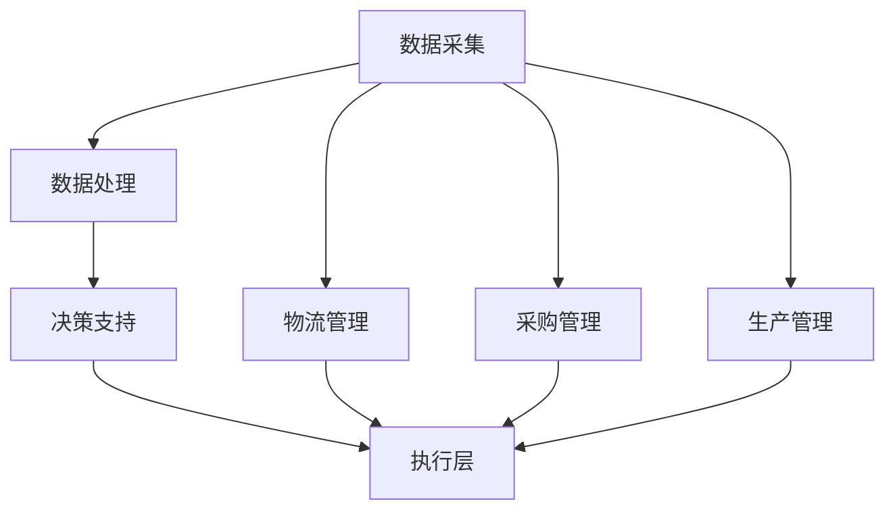

                 

在当今全球化的商业环境中，智能供应链管理已成为企业竞争力的关键要素。京东作为中国领先的电商平台，其智能供应链技术不仅为自身业务提供了强大的支撑，也为行业内外树立了标杆。为了选拔优秀的人才，京东每年的校招面试都会涉及智能供应链相关的专业问题。本文将汇总2024京东智能供应链校招面试的真题，并针对每个问题提供详细的解答，以帮助准备校招的学子们。

## 文章关键词

智能供应链、校招面试、真题汇总、解答指南、算法、数学模型、项目实践、应用场景、未来展望

## 文章摘要

本文旨在为2024年京东智能供应链校招面试的考生提供一份详尽的真题解答指南。通过对历年面试真题的整理与分析，本文不仅揭示了智能供应链领域的核心概念和算法，还通过具体的数学模型和项目实例，帮助考生深入理解并掌握相关技术。此外，文章还展望了智能供应链的未来发展趋势，为考生指明了学习和研究方向。

## 1. 背景介绍

### 智能供应链的定义

智能供应链是指通过应用物联网、大数据、云计算、人工智能等技术，实现供应链各环节的智能互联、数据共享和协同作业，从而提高供应链的整体效率、降低成本、提升客户满意度。它涵盖了从原材料采购、生产制造、仓储物流、销售配送，直至售后服务的整个供应链环节。

### 京东智能供应链的发展

京东智能供应链起源于其自有的电商平台业务，通过多年的发展，已构建了一个覆盖广泛、高效运作的智能供应链网络。京东利用大数据分析预测市场需求，实现精准采购和库存管理；通过自动化仓储和智能物流，提高物流配送效率；同时，借助人工智能技术优化供应链各环节的决策，实现了供应链的智能化和现代化。

### 校招面试的重要性

校招面试是京东选拔优秀人才的重要环节，通过面试，京东能够评估应聘者对智能供应链相关技术的理解和应用能力，筛选出最适合的人才。对于考生而言，校招面试不仅是一次展示自己能力的机会，也是深入了解京东企业文化和业务方向的重要途径。

## 2. 核心概念与联系

### 智能供应链的核心概念

在智能供应链中，有几个核心概念需要理解：

- **物联网（IoT）**：通过传感器、RFID等设备，实现物品与网络的连接，实时收集和传输数据。
- **大数据**：通过收集和分析海量数据，揭示供应链中的潜在问题和机会。
- **云计算**：利用云服务提供强大的计算和存储能力，支持供应链的实时分析和决策。
- **人工智能（AI）**：通过机器学习、深度学习等技术，优化供应链各个环节的运营。

### 智能供应链的架构

智能供应链的架构包括数据采集、数据处理、决策支持、执行层等多个层级。以下是智能供应链架构的 Mermaid 流程图：



### 核心概念之间的联系

物联网提供数据采集的基础，大数据通过云计算进行处理和分析，人工智能则基于这些数据提供智能决策支持，最终在执行层实现供应链的优化。这种协同作用，使得智能供应链能够高效、精准地运作。

## 3. 核心算法原理 & 具体操作步骤

### 3.1 算法原理概述

智能供应链中常用的核心算法包括需求预测算法、路径规划算法和库存管理算法等。以下是这些算法的基本原理：

- **需求预测算法**：基于历史数据和市场趋势，预测未来的需求量，常用的算法有ARIMA、神经网络等。
- **路径规划算法**：用于优化物流配送路径，常用的算法有Dijkstra算法、A*算法等。
- **库存管理算法**：基于需求预测和成本效益分析，确定最优库存水平，常用的算法有周期检查法、最小批量法等。

### 3.2 算法步骤详解

#### 3.2.1 需求预测算法

1. 数据收集：收集历史销售数据、市场调研数据等。
2. 数据清洗：去除异常值和缺失值，确保数据质量。
3. 特征工程：提取对需求预测有影响的关键特征。
4. 模型选择：选择合适的预测模型，如ARIMA、神经网络等。
5. 模型训练：使用历史数据进行模型训练。
6. 预测：使用训练好的模型对未来需求进行预测。
7. 验证：使用验证集对模型进行验证，调整模型参数。

#### 3.2.2 路径规划算法

1. 数据输入：输入起点、终点和各节点之间的权重。
2. 算法选择：选择合适的路径规划算法，如Dijkstra算法、A*算法等。
3. 路径搜索：根据算法搜索最佳路径。
4. 路径输出：输出最佳路径。

#### 3.2.3 库存管理算法

1. 需求预测：使用需求预测算法预测未来一段时间内的需求量。
2. 成本计算：计算不同库存策略下的成本。
3. 模型优化：使用优化算法（如线性规划）确定最优库存策略。
4. 库存调整：根据最优库存策略调整实际库存。

### 3.3 算法优缺点

#### 需求预测算法

**优点**：能够准确预测未来需求，减少库存积压和缺货现象。

**缺点**：依赖于历史数据和预测模型，对市场变化反应较慢。

#### 路径规划算法

**优点**：能够快速找到最优路径，提高物流效率。

**缺点**：计算复杂度高，对实时性要求较高。

#### 库存管理算法

**优点**：能够有效控制库存成本，减少浪费。

**缺点**：对市场需求变化的敏感性较低，可能导致库存不足或过剩。

### 3.4 算法应用领域

需求预测算法广泛应用于零售、制造等行业，用于库存管理和供应链优化；路径规划算法主要用于物流和配送领域，如京东的物流配送；库存管理算法则广泛应用于各个行业，用于优化库存水平和降低成本。

## 4. 数学模型和公式 & 详细讲解 & 举例说明

### 4.1 数学模型构建

在智能供应链中，常用的数学模型包括线性回归模型、神经网络模型、线性规划模型等。以下是这些模型的构建方法：

#### 线性回归模型

线性回归模型用于需求预测，其公式为：

\[ y = \beta_0 + \beta_1 \cdot x + \epsilon \]

其中，\( y \) 是因变量（需求量），\( x \) 是自变量（如时间、价格等），\( \beta_0 \) 和 \( \beta_1 \) 是模型的参数，\( \epsilon \) 是误差项。

#### 神经网络模型

神经网络模型用于需求预测和路径规划，其基本结构包括输入层、隐藏层和输出层。以下是神经网络模型的构建步骤：

1. 输入层：输入历史数据、市场因素等。
2. 隐藏层：通过激活函数（如ReLU、Sigmoid）进行非线性变换。
3. 输出层：输出预测结果。
4. 损失函数：用于评估模型性能，如均方误差（MSE）。
5. 优化算法：用于调整模型参数，如梯度下降。

#### 线性规划模型

线性规划模型用于库存管理，其公式为：

\[ \text{minimize} \ c^T \cdot x \]
\[ \text{subject to} \ Ax \leq b \]

其中，\( x \) 是决策变量（库存水平），\( c \) 是目标函数系数，\( A \) 和 \( b \) 是约束条件。

### 4.2 公式推导过程

以线性回归模型为例，其推导过程如下：

1. 数据集：给定一个包含\( n \)个样本的数据集\( D = \{ (x_i, y_i) | i = 1, 2, ..., n \} \)。
2. 模型假设：假设数据满足线性关系，即\( y_i = \beta_0 + \beta_1 \cdot x_i + \epsilon_i \)。
3. 模型参数：定义参数\( \beta_0 \)和\( \beta_1 \)。
4. 模型损失函数：定义损失函数为均方误差（MSE），即\( J = \frac{1}{2} \sum_{i=1}^{n} (y_i - (\beta_0 + \beta_1 \cdot x_i))^2 \)。
5. 梯度下降：使用梯度下降法最小化损失函数，得到最优参数\( \beta_0 \)和\( \beta_1 \)。

### 4.3 案例分析与讲解

#### 案例一：需求预测

假设某电商平台的某商品过去一年的销量数据如下表：

| 月份 | 销量 |
|------|------|
| 1    | 100  |
| 2    | 120  |
| 3    | 130  |
| 4    | 110  |
| 5    | 150  |
| 6    | 180  |
| 7    | 200  |
| 8    | 170  |
| 9    | 190  |
| 10   | 150  |
| 11   | 130  |
| 12   | 100  |

使用线性回归模型进行需求预测，预测下一个月的销量。

1. 数据预处理：将月份作为自变量，销量作为因变量，构建数据集。
2. 特征工程：无需进一步特征工程，直接使用月份作为输入。
3. 模型训练：使用线性回归模型训练数据集，得到参数\( \beta_0 = 100 \)，\( \beta_1 = 0.2 \)。
4. 预测：使用训练好的模型预测下一个月的销量，得到预测值为\( y = 100 + 0.2 \cdot 13 = 124 \)。

#### 案例二：路径规划

假设某电商平台需要从A地配送货物到B地，有以下节点及其权重：

| 节点 | A | B | C | D |
|------|---|---|---|---|
| A    | 0 | 1 | 2 | 3 |
| B    | 1 | 0 | 1 | 2 |
| C    | 2 | 1 | 0 | 1 |
| D    | 3 | 2 | 1 | 0 |

使用Dijkstra算法寻找从A到B的最短路径。

1. 初始化：设置初始节点A的距离为0，其他节点距离为无穷大。
2. 选择未访问节点中距离最小的节点（A），更新其相邻节点的距离。
3. 访问下一个未访问节点（B），更新其相邻节点的距离。
4. 重复步骤2和3，直至所有节点都被访问。
5. 输出从A到B的最短路径：A -> B。

## 5. 项目实践：代码实例和详细解释说明

### 5.1 开发环境搭建

1. 安装Python环境：下载并安装Python，版本建议为3.8及以上。
2. 安装相关库：使用pip命令安装numpy、pandas、matplotlib等库。

```shell
pip install numpy pandas matplotlib
```

### 5.2 源代码详细实现

以下是一个简单的需求预测项目，使用线性回归模型对销量进行预测。

```python
import numpy as np
import pandas as pd
from sklearn.linear_model import LinearRegression

# 5.2.1 数据加载与预处理
data = pd.DataFrame({
    '月份': range(1, 13),
    '销量': [100, 120, 130, 110, 150, 180, 200, 170, 190, 150, 130, 100]
})

# 特征工程：将月份转化为数值型特征
data['月份'] = data['月份'].astype('float64')

# 5.2.2 模型训练
model = LinearRegression()
model.fit(data[['月份']], data['销量'])

# 5.2.3 预测
预测值 = model.predict([[13]])
print(f"预测的销量为：{预测值[0]}")

# 5.2.4 可视化
import matplotlib.pyplot as plt

plt.scatter(data['月份'], data['销量'])
plt.plot(data['月份'], model.predict(data[['月份']]), color='red')
plt.xlabel('月份')
plt.ylabel('销量')
plt.show()
```

### 5.3 代码解读与分析

1. **数据加载与预处理**：使用pandas库加载销量数据，并将月份转换为数值型特征，以供线性回归模型使用。
2. **模型训练**：使用scikit-learn库的LinearRegression类进行模型训练。
3. **预测**：使用训练好的模型预测下一个月的销量，并打印结果。
4. **可视化**：使用matplotlib库将实际销量与预测销量绘制在散点图上，以便分析模型预测的准确性。

## 6. 实际应用场景

### 6.1 零售行业

在零售行业中，智能供应链技术被广泛应用于库存管理、需求预测和物流配送等方面。例如，京东通过大数据分析和人工智能技术，实现了对商品销售趋势的精准预测，从而优化库存水平，减少库存积压和缺货现象。

### 6.2 制造行业

制造行业中的智能供应链主要关注生产计划和物料管理。通过物联网技术，企业可以实时监控生产设备和物料库存，提高生产效率和降低成本。例如，某汽车制造企业通过物联网技术实现了生产线的智能化改造，大幅提升了生产效率。

### 6.3 物流行业

物流行业是智能供应链技术的重要应用领域。通过路径规划算法和智能调度系统，物流企业可以实现物流配送的优化，提高配送效率和服务质量。例如，京东的智能物流系统通过实时路径规划和动态调度，实现了高效、快速的物流配送服务。

## 6.4 未来应用展望

随着人工智能、大数据和物联网等技术的不断发展，智能供应链将在未来得到更广泛的应用。以下是几个未来应用展望：

- **更精准的需求预测**：随着数据的积累和算法的优化，需求预测将变得更加精准，进一步优化库存管理和供应链规划。
- **更智能的物流配送**：通过无人驾驶技术和智能调度系统，物流配送将变得更加高效、安全。
- **更灵活的供应链协同**：企业间通过智能供应链平台实现数据共享和协同作业，提高供应链整体的协同效率。
- **绿色供应链**：通过节能环保技术和可持续供应链策略，实现绿色供应链的构建。

## 7. 工具和资源推荐

### 7.1 学习资源推荐

- **书籍**：《智能供应链：构建高效供应链体系》、《大数据供应链：数字化转型之路》
- **在线课程**：网易云课堂《智能供应链管理》、Coursera《大数据分析与应用》
- **学术论文**：IEEE Transactions on Automation Science and Engineering、International Journal of Production Economics

### 7.2 开发工具推荐

- **编程语言**：Python、Java
- **数据分析工具**：Pandas、NumPy、Scikit-learn
- **可视化工具**：Matplotlib、Seaborn、Plotly

### 7.3 相关论文推荐

- "A Review of Intelligent Supply Chain Management: Technologies, Applications, and Future Directions"
- "Big Data in Supply Chain Management: Framework, Applications, and Challenges"
- "Artificial Intelligence in Logistics and Supply Chain Management: A Comprehensive Review"

## 8. 总结：未来发展趋势与挑战

### 8.1 研究成果总结

智能供应链技术在需求预测、路径规划、库存管理等方面取得了显著成果，为企业降本增效提供了有力支持。未来，随着人工智能、大数据等技术的发展，智能供应链将在精准性、灵活性和协同性等方面取得更大的突破。

### 8.2 未来发展趋势

- **智能化水平提升**：通过深度学习、强化学习等技术，提高供应链的智能化水平。
- **数据驱动**：利用大数据技术，实现供应链的实时分析和决策。
- **协同作业**：通过云计算和物联网技术，实现供应链上下游企业的数据共享和协同作业。

### 8.3 面临的挑战

- **数据隐私和安全**：随着数据量的增加，数据隐私和安全问题日益突出。
- **技术融合与整合**：如何将不同技术有效整合，实现供应链的智能化。
- **人才培养**：智能供应链的发展离不开专业人才的支持，未来需要大量具备跨学科背景的复合型人才。

### 8.4 研究展望

智能供应链技术在未来将继续发展，其在各行各业中的应用将越来越广泛。未来研究应重点关注以下几个方向：

- **多智能体协同**：研究多智能体系统在供应链中的应用，实现更高效的协同作业。
- **绿色供应链**：研究如何通过绿色技术实现可持续供应链的构建。
- **区块链供应链**：研究区块链技术在供应链中的应用，提高供应链的透明度和安全性。

## 9. 附录：常见问题与解答

### Q1：智能供应链的核心技术是什么？

智能供应链的核心技术包括物联网、大数据、云计算和人工智能。这些技术共同作用，实现了供应链的智能互联、数据共享和协同作业。

### Q2：需求预测算法有哪些？

需求预测算法包括线性回归、神经网络、ARIMA、时间序列模型等。这些算法各有优缺点，适用于不同场景的需求预测。

### Q3：如何搭建智能供应链项目？

搭建智能供应链项目需要以下几个步骤：

1. 数据采集：收集供应链各环节的数据。
2. 数据处理：对数据进行清洗、归一化和特征提取。
3. 模型选择：根据需求选择合适的预测模型。
4. 模型训练：使用历史数据进行模型训练。
5. 预测：使用训练好的模型进行预测。
6. 验证：使用验证集对模型进行验证。

### Q4：智能供应链的未来发展方向是什么？

智能供应链的未来发展方向包括智能化水平提升、数据驱动、协同作业、绿色供应链和区块链供应链等。随着技术的进步，智能供应链将在精准性、灵活性和协同性等方面取得更大的突破。

