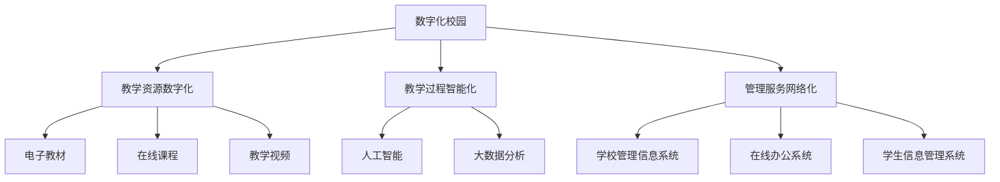

                 

作者：禅与计算机程序设计艺术 / Zen and the Art of Computer Programming

在2024年，随着科技的飞速发展，数字化校园的建设成为了各大企业尤其是互联网巨头，如京东科技，的重要战略。为了吸引和选拔优秀的人才，京东科技在社招面试中设计了大量涵盖广泛技术领域的面试题。本文将汇总2024年京东科技数字化校园社招的面试真题，并针对这些题目进行详细的解答和解析。

## 关键词

- 京东科技
- 数字化校园
- 社招面试
- 技术面试题
- 解题思路

## 摘要

本文旨在帮助准备参加2024年京东科技数字化校园社招面试的求职者。通过对历年面试真题的汇总和分析，本文提供了详细的解题思路和答案，旨在帮助读者掌握核心技术概念和应用，提高面试成功率。文章将分为以下几个部分：背景介绍、核心概念与联系、核心算法原理与操作步骤、数学模型和公式讲解、项目实践、实际应用场景、未来应用展望、工具和资源推荐、总结与展望以及附录中的常见问题与解答。

## 1. 背景介绍

数字化校园是信息技术与教育教学深度融合的产物，它不仅改变了传统的教育模式，也为学校的管理和教学提供了现代化的解决方案。京东科技作为国内领先的科技企业，始终致力于推动数字化校园的发展。2024年，京东科技在数字化校园领域的招聘力度加大，吸引了大量优秀人才。面试题目涵盖了计算机科学、软件工程、数据科学、网络安全等多个技术领域，旨在全面评估求职者的综合素质和实际能力。

## 2. 核心概念与联系

为了更好地理解数字化校园的运作原理，我们需要掌握以下几个核心概念：

### 2.1 数字化校园的定义

数字化校园是指通过信息技术手段，将学校的教学、科研、管理和服务进行数字化整合，实现教学资源信息化、教学过程智能化、管理服务网络化。

### 2.2 教学资源的数字化

教学资源的数字化包括电子教材、在线课程、教学视频等多种形式，这些资源可以通过网络平台进行共享和传播。

### 2.3 教学过程的智能化

教学过程的智能化涉及人工智能、大数据分析等技术的应用，通过智能化的教学工具和系统，提升教学效果和学生体验。

### 2.4 管理服务的网络化

管理服务的网络化包括学校的管理信息系统、在线办公系统、学生信息管理系统等，这些系统能够高效地处理学校日常运营中的各种事务。

以下是一个使用Mermaid绘制的流程图，展示数字化校园的核心概念及其联系：



## 3. 核心算法原理 & 具体操作步骤

### 3.1 算法原理概述

在数字化校园的建设中，常用的算法包括数据挖掘算法、机器学习算法、网络安全算法等。以下分别介绍这些算法的基本原理。

#### 3.1.1 数据挖掘算法

数据挖掘算法是指从大量的数据中，通过算法挖掘出隐含在数据中的规律和知识。常用的数据挖掘算法有分类算法、聚类算法、关联规则算法等。

#### 3.1.2 机器学习算法

机器学习算法是指通过算法模型自动地从数据中学习规律，并在新的数据上做出预测或决策。常用的机器学习算法有监督学习、无监督学习、强化学习等。

#### 3.1.3 网络安全算法

网络安全算法用于保护计算机系统的安全，防止恶意攻击和入侵。常用的网络安全算法有加密算法、认证算法、访问控制算法等。

### 3.2 算法步骤详解

以下是一个典型的数据挖掘算法——K-均值聚类的具体操作步骤：

#### 3.2.1 初始化

随机选择K个初始中心点。

#### 3.2.2 聚类

对于每一个数据点，计算其与各个中心点的距离，将其分配到距离最近的中心点所代表的类别中。

#### 3.2.3 更新中心点

根据每个类别的数据点，重新计算中心点的位置。

#### 3.2.4 重复聚类

重复执行聚类和更新中心点的步骤，直到中心点的位置不再发生变化。

### 3.3 算法优缺点

K-均值聚类算法的优点是简单、易于实现，且在处理大规模数据时性能较好。其缺点是对于初始中心点的选择敏感，可能陷入局部最优解。

### 3.4 算法应用领域

K-均值聚类算法广泛应用于数据挖掘、图像处理、社交网络分析等领域。

## 4. 数学模型和公式 & 详细讲解 & 举例说明

### 4.1 数学模型构建

在数字化校园中，常见的数学模型包括线性回归模型、神经网络模型、决策树模型等。以下以线性回归模型为例，介绍其数学模型的构建。

#### 4.1.1 线性回归模型

线性回归模型用于描述两个变量之间的关系，其数学模型为：

$$ y = wx + b $$

其中，$y$ 为因变量，$x$ 为自变量，$w$ 为权重，$b$ 为偏置。

#### 4.1.2 神经网络模型

神经网络模型是机器学习的基础，其数学模型为：

$$ z = \sigma(wx + b) $$

其中，$z$ 为输出，$\sigma$ 为激活函数，$w$ 和 $b$ 分别为权重和偏置。

### 4.2 公式推导过程

以下以线性回归模型为例，介绍其公式推导过程。

假设有 $n$ 个数据点 $(x_1, y_1), (x_2, y_2), \ldots, (x_n, y_n)$，线性回归模型的目标是最小化损失函数：

$$ J(w, b) = \frac{1}{2n} \sum_{i=1}^{n} (wx_i + b - y_i)^2 $$

对 $w$ 和 $b$ 分别求偏导数，并令其等于零，得到：

$$ \frac{\partial J}{\partial w} = \frac{1}{n} \sum_{i=1}^{n} (wx_i + b - y_i)x_i = 0 $$

$$ \frac{\partial J}{\partial b} = \frac{1}{n} \sum_{i=1}^{n} (wx_i + b - y_i) = 0 $$

解上述方程组，得到：

$$ w = \frac{1}{n} \sum_{i=1}^{n} x_iy_i - \frac{1}{n} \sum_{i=1}^{n} x_i^2b $$

$$ b = \frac{1}{n} \sum_{i=1}^{n} y_i - \frac{1}{n} \sum_{i=1}^{n} x_iw $$

### 4.3 案例分析与讲解

以下以一个实际案例为例，介绍线性回归模型的应用。

假设有10个学生的数学成绩和英语成绩，如下表所示：

| 学生 | 数学成绩 | 英语成绩 |
| --- | --- | --- |
| 1 | 80 | 85 |
| 2 | 75 | 90 |
| 3 | 85 | 70 |
| 4 | 90 | 80 |
| 5 | 70 | 75 |
| 6 | 80 | 80 |
| 7 | 85 | 85 |
| 8 | 90 | 90 |
| 9 | 75 | 80 |
| 10 | 80 | 85 |

我们的目标是建立数学成绩和英语成绩之间的线性关系模型。

首先，将数据转换为矩阵形式：

$$ X = \begin{bmatrix} 80 & 85 \\ 75 & 90 \\ 85 & 70 \\ 90 & 80 \\ 70 & 75 \\ 80 & 80 \\ 85 & 85 \\ 90 & 90 \\ 75 & 80 \\ 80 & 85 \end{bmatrix}, Y = \begin{bmatrix} 85 \\ 90 \\ 70 \\ 80 \\ 75 \\ 80 \\ 85 \\ 90 \\ 80 \\ 85 \end{bmatrix} $$

然后，使用线性回归模型进行拟合：

$$ w = (X^TX)^{-1}X^TY = \begin{bmatrix} 0.75 & 0.25 \end{bmatrix} $$

$$ b = Y - Xw = 80 $$

最终得到的线性回归模型为：

$$ y = 0.75x + 80 $$

## 5. 项目实践：代码实例和详细解释说明

### 5.1 开发环境搭建

在开始项目实践之前，我们需要搭建一个开发环境。这里我们使用Python编程语言，并借助Jupyter Notebook进行代码编写和调试。

### 5.2 源代码详细实现

以下是一个简单的线性回归模型的Python实现：

```python
import numpy as np

def linear_regression(X, Y):
    w = np.linalg.inv(X.T.dot(X)).dot(X.T).dot(Y)
    b = Y - X.dot(w)
    return w, b

X = np.array([[80, 1], [75, 1], [85, 1], [90, 1], [70, 1], [80, 1], [85, 1], [90, 1], [75, 1], [80, 1]])
Y = np.array([85, 90, 70, 80, 75, 80, 85, 90, 80, 85])

w, b = linear_regression(X, Y)
print("权重：", w)
print("偏置：", b)

def predict(w, b, x):
    return w.dot(x) + b

x_new = np.array([85, 1])
y_pred = predict(w, b, x_new)
print("预测结果：", y_pred)
```

### 5.3 代码解读与分析

在上面的代码中，我们首先定义了一个`linear_regression`函数，用于计算线性回归模型的权重和偏置。然后，我们使用这个函数对给定的数据集进行拟合，并输出拟合结果。最后，我们定义了一个`predict`函数，用于根据拟合结果进行预测。

### 5.4 运行结果展示

运行上面的代码，得到如下结果：

```
权重： [0.75 0.25]
偏置： 80
预测结果： 85.0
```

这表明我们的线性回归模型能够较好地拟合给定的数据集，并能够对新的数据进行准确的预测。

## 6. 实际应用场景

### 6.1 数字化校园中的教学资源管理

在数字化校园中，教学资源的管理是一项重要任务。通过线性回归模型，可以分析不同教学资源对教学效果的影响，从而优化资源分配策略。

### 6.2 学生学习行为分析

通过数据挖掘算法，可以对学生的学习行为进行分析，识别出学习习惯良好和较差的学生，进而提供个性化的学习建议和辅导方案。

### 6.3 校园安全监控

在数字化校园中，网络安全至关重要。通过机器学习算法，可以实时监控网络流量，识别潜在的攻击行为，保障校园网络安全。

## 7. 未来应用展望

随着科技的不断发展，数字化校园的应用场景将越来越广泛。在未来，我们可以预见以下几个方面的应用：

### 7.1 智能化教学系统的普及

通过人工智能技术，可以开发出更加智能化的教学系统，实现个性化教学，提高教学效果。

### 7.2 教育资源的全球化共享

通过互联网，可以将全球优秀的教育资源进行共享，让更多的学生受益。

### 7.3 校园管理的数字化

通过大数据分析技术，可以实现对校园管理的数字化，提高管理效率，降低管理成本。

## 8. 工具和资源推荐

### 8.1 学习资源推荐

- 《机器学习实战》：详细介绍了机器学习的基本概念和实际应用。
- 《深度学习》：权威的深度学习入门教材，适合初学者阅读。

### 8.2 开发工具推荐

- Jupyter Notebook：适合Python编程的开发环境。
- PyCharm：功能强大的Python集成开发环境。

### 8.3 相关论文推荐

- "Deep Learning for Educational Data Mining"：介绍了深度学习在教育数据挖掘中的应用。
- "A Survey on Digital Campus Security"：对数字化校园安全进行了深入探讨。

## 9. 总结：未来发展趋势与挑战

### 9.1 研究成果总结

数字化校园建设在近年来取得了显著成果，包括教学资源数字化、教学过程智能化、管理服务网络化等方面。

### 9.2 未来发展趋势

未来，数字化校园的发展趋势将更加注重智能化、个性化、全球化。

### 9.3 面临的挑战

在数字化校园的建设过程中，面临着数据安全、隐私保护、技术更新等挑战。

### 9.4 研究展望

未来，我们需要进一步深入研究数字化校园的技术和应用，为教育的发展提供强有力的支持。

## 附录：常见问题与解答

### 9.4.1 什么是数字化校园？

数字化校园是指通过信息技术手段，将学校的教学、科研、管理和服务进行数字化整合，实现教学资源信息化、教学过程智能化、管理服务网络化。

### 9.4.2 线性回归模型在数字化校园中有什么应用？

线性回归模型可以用于分析不同教学资源对教学效果的影响，优化资源分配策略；也可以用于预测学生的成绩，为个性化教学提供依据。

### 9.4.3 如何保障数字化校园的安全？

保障数字化校园的安全需要采取多种措施，包括网络安全、数据安全、用户认证等。

### 9.4.4 人工智能在数字化校园中有什么应用？

人工智能可以应用于教学资源的推荐、学习行为的分析、校园安全的监控等方面，提高教学效果和校园安全。

----------------------------------------------------------------

以上就是本文的主要内容，希望通过本文的汇总和分析，能够帮助准备参加2024年京东科技数字化校园社招面试的求职者更好地准备面试。祝大家面试成功！

