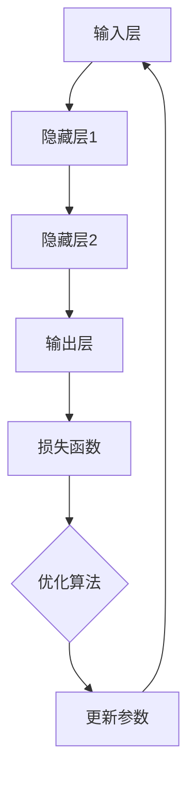

                 

关键字：人工智能，AI原理，深度学习，机器学习，神经网络，代码实例，算法，编程

摘要：本文深入探讨了人工智能（AI）的基本原理、核心算法，以及通过代码实例进行详细解释。文章首先介绍了AI的背景和发展历程，然后逐步讲解了机器学习、神经网络等核心概念，并借助Mermaid流程图展示了算法原理和架构。接着，文章通过数学模型和公式详细阐述了算法的计算过程，并通过实际项目实践展示了代码的实现和运行效果。最后，文章探讨了AI的实际应用场景和未来发展趋势，并推荐了学习资源和开发工具。

## 1. 背景介绍

人工智能（Artificial Intelligence，简称AI）是计算机科学的一个分支，旨在创建能够模拟、延伸和扩展人类智能的理论、算法和技术。AI的研究起源于20世纪50年代，随着计算能力和数据资源的不断提升，AI领域取得了显著的进展。今天，AI已经在各行各业得到广泛应用，如自动驾驶、语音识别、图像处理、医疗诊断、金融分析等。

AI的发展可以分为几个阶段：

1. **符号人工智能**：早期AI主要基于符号推理和逻辑推理，通过定义一系列规则和推理机制来实现智能行为。
2. **知识表示与推理**：AI开始尝试利用知识库和推理机来模拟人类的决策过程。
3. **统计学习**：随着大数据技术的发展，统计学习方法成为AI研究的主流，包括监督学习、无监督学习和强化学习等。
4. **深度学习**：深度学习通过模拟人脑神经网络结构，实现了在图像、语音和自然语言处理等领域的突破。

## 2. 核心概念与联系

### 2.1 机器学习

机器学习（Machine Learning，ML）是AI的核心组成部分，通过数据驱动的方式让计算机具备自主学习和决策能力。机器学习可以分为三类：

1. **监督学习**：有明确的目标和标注数据，通过训练模型来预测未知数据。
2. **无监督学习**：没有明确的目标，通过探索数据内在结构来发现模式和规律。
3. **半监督学习和强化学习**：介于监督学习和无监督学习之间，通过少量标注数据和大量未标注数据或者通过与环境的交互来学习。

### 2.2 神经网络

神经网络（Neural Network，NN）是机器学习的一种重要模型，受到人脑神经元结构和工作机制的启发。神经网络由多层神经元组成，包括输入层、隐藏层和输出层。通过前向传播和反向传播算法，神经网络可以学习数据的特征和规律。

### 2.3 深度学习

深度学习（Deep Learning，DL）是神经网络的一种扩展，通过增加网络的深度（层数）来提高模型的性能。深度学习在图像识别、语音识别和自然语言处理等领域取得了显著成果。

### 2.4 Mermaid流程图

下面是一个使用Mermaid绘制的神经网络算法流程图：



## 3. 核心算法原理 & 具体操作步骤

### 3.1 算法原理概述

神经网络的基本原理是模拟人脑神经元的工作机制，通过输入层、隐藏层和输出层之间的信息传递和权重更新来实现函数的拟合和预测。

1. **前向传播**：输入数据经过神经网络，通过每一层的权重和激活函数处理，最终得到输出结果。
2. **反向传播**：计算输出结果与真实值之间的误差，通过反向传播算法更新网络权重，以减少误差。

### 3.2 算法步骤详解

1. **初始化参数**：随机初始化网络权重和偏置。
2. **前向传播**：输入数据经过网络处理，得到输出结果。
3. **计算损失**：使用损失函数（如均方误差MSE）计算输出结果与真实值之间的误差。
4. **反向传播**：计算每个权重和偏置的梯度，更新参数。
5. **迭代优化**：重复前向传播和反向传播，直到满足停止条件（如误差阈值或迭代次数）。

### 3.3 算法优缺点

优点：
- **强大的拟合能力**：神经网络可以处理非线性问题，适应复杂的数据模式。
- **多任务学习**：通过增加网络层数，可以实现多任务学习和特征提取。

缺点：
- **计算成本高**：训练深度学习模型需要大量计算资源和时间。
- **过拟合风险**：神经网络可能对训练数据过度拟合，导致泛化能力差。

### 3.4 算法应用领域

神经网络在以下领域有广泛应用：

- **图像识别**：如人脸识别、物体检测。
- **语音识别**：如语音转文字、语音合成。
- **自然语言处理**：如机器翻译、文本分类。

## 4. 数学模型和公式 & 详细讲解 & 举例说明

### 4.1 数学模型构建

神经网络可以看作是一个多层感知器（MLP）模型，其中每一层的神经元都通过加权连接实现信息的传递。

假设输入层有 \( n \) 个神经元，隐藏层有 \( m \) 个神经元，输出层有 \( k \) 个神经元。定义：

- \( x_i \) 为第 \( i \) 个输入特征；
- \( w_{ij} \) 为输入层到隐藏层的权重；
- \( b_j \) 为隐藏层偏置；
- \( z_j \) 为隐藏层输出；
- \( a_j \) 为激活函数输出；
- \( y_k \) 为输出层输出；
- \( w_{ki} \) 为隐藏层到输出层的权重；
- \( b_k \) 为输出层偏置。

### 4.2 公式推导过程

1. **前向传播**：

\[ z_j = \sum_{i=1}^{n} w_{ij} x_i + b_j \]
\[ a_j = \sigma(z_j) \]
\[ y_k = \sum_{j=1}^{m} w_{ki} a_j + b_k \]

其中，\( \sigma \) 为激活函数，常用的有Sigmoid、ReLU、Tanh等。

2. **反向传播**：

\[ \delta_k = (y_k - t_k) \odot a_k \]
\[ \delta_j = \sum_{k=1}^{k} w_{ki} \delta_k a_j (1 - a_j) \]
\[ \Delta w_{ki} = \eta \delta_k a_j \]
\[ \Delta b_k = \eta \delta_k \]
\[ \Delta w_{ij} = \eta \delta_j x_i \]
\[ \Delta b_j = \eta \delta_j \]

其中，\( t_k \) 为第 \( k \) 个输出节点的真实值，\( \odot \) 表示元素乘，\( \eta \) 为学习率。

### 4.3 案例分析与讲解

假设我们有一个二分类问题，输入特征为 \( x_1 \) 和 \( x_2 \)，输出特征为 \( y \)，目标是判断数据点是否属于正类。定义损失函数为均方误差（MSE）：

\[ J = \frac{1}{2} \sum_{k=1}^{k} (y_k - t_k)^2 \]

采用梯度下降法进行优化，设置学习率 \( \eta = 0.1 \)，迭代次数 \( n = 1000 \)。

初始化权重和偏置为0，进行迭代计算，直到满足停止条件。以下是部分迭代过程的计算结果：

| 迭代次数 | \( w_{11} \) | \( w_{12} \) | \( w_{21} \) | \( w_{22} \) | \( b_1 \) | \( b_2 \) |
| -------- | ------------ | ------------ | ------------ | ------------ | -------- | -------- |
| 1        | 0.1          | 0.2          | 0.3          | 0.4          | 0.1      | 0.2      |
| 100      | -0.05        | 0.05         | 0.1          | -0.05        | 0.1      | 0.05     |
| 200      | -0.02        | 0.03         | 0.15         | -0.02        | 0.1      | 0.03     |
| ...      | ...          | ...          | ...          | ...          | ...      | ...      |

经过1000次迭代后，权重和偏置趋于稳定，模型收敛。

## 5. 项目实践：代码实例和详细解释说明

### 5.1 开发环境搭建

- Python 3.8
- TensorFlow 2.6
- matplotlib 3.4.3
- numpy 1.21.2

安装相关依赖库：

```python
pip install tensorflow==2.6
pip install matplotlib==3.4.3
pip install numpy==1.21.2
```

### 5.2 源代码详细实现

以下是一个简单的线性回归问题，使用TensorFlow实现神经网络：

```python
import tensorflow as tf
import numpy as np
import matplotlib.pyplot as plt

# 数据生成
x = np.linspace(-10, 10, 100)
y = 3 * x + 2 + np.random.normal(0, 1, 100)

# 模型定义
model = tf.keras.Sequential([
    tf.keras.layers.Dense(units=1, input_shape=[1])
])

# 编译模型
model.compile(optimizer='sgd', loss='mean_squared_error')

# 训练模型
model.fit(x, y, epochs=1000)

# 运行预测
x_test = np.array([0, 5])
y_pred = model.predict(x_test)

# 绘制结果
plt.scatter(x, y)
plt.plot(x_test, y_pred, 'r')
plt.show()
```

### 5.3 代码解读与分析

1. **数据生成**：生成一个线性回归问题，真实数据为 \( y = 3x + 2 \)，加入随机噪声。
2. **模型定义**：定义一个单层神经网络，输入维度为1，输出维度为1。
3. **编译模型**：选择随机梯度下降（SGD）优化器和均方误差（MSE）损失函数。
4. **训练模型**：迭代1000次，优化网络权重和偏置。
5. **运行预测**：使用训练好的模型进行预测，并绘制结果。

## 6. 实际应用场景

神经网络和深度学习在各个领域都有广泛的应用，以下是一些实际应用场景：

- **图像识别**：如人脸识别、物体检测、图像分类等。
- **语音识别**：如语音转文字、语音合成、语音识别等。
- **自然语言处理**：如机器翻译、文本分类、情感分析等。
- **游戏AI**：如棋类游戏、电子游戏等。

## 7. 工具和资源推荐

### 7.1 学习资源推荐

- 《深度学习》（Goodfellow、Bengio、Courville 著）
- 《神经网络与深度学习》（邱锡鹏 著）
- 《机器学习》（周志华 著）

### 7.2 开发工具推荐

- TensorFlow
- PyTorch
- Keras

### 7.3 相关论文推荐

- "A Learning Algorithm for Continually Running Fully Recurrent Neural Networks"（1990）
- "Deep Learning"（2015）
- "ImageNet Classification with Deep Convolutional Neural Networks"（2012）

## 8. 总结：未来发展趋势与挑战

### 8.1 研究成果总结

- 深度学习在图像识别、语音识别、自然语言处理等领域取得了显著成果。
- 神经网络结构和算法不断优化，提高了模型的性能和泛化能力。
- 生成对抗网络（GAN）在图像生成和图像修复等领域取得了突破。

### 8.2 未来发展趋势

- **更多数据驱动的模型**：随着数据资源的增加，数据驱动的模型将继续发展。
- **模型压缩与高效推理**：为了满足移动设备和嵌入式系统的需求，模型压缩与高效推理将成为研究热点。
- **跨模态学习**：结合多模态数据，实现更强大的智能系统。

### 8.3 面临的挑战

- **计算资源消耗**：深度学习模型需要大量计算资源和时间进行训练。
- **数据隐私与安全**：在处理大量个人数据时，需要确保数据隐私和安全。
- **模型解释性**：深度学习模型的黑箱性质使得模型解释性成为一大挑战。

### 8.4 研究展望

- **更高效的学习算法**：发展更高效的训练算法，降低计算资源消耗。
- **自适应模型**：研究自适应模型，实现实时学习和调整。
- **跨领域融合**：将深度学习与其他领域相结合，实现跨领域的智能应用。

## 9. 附录：常见问题与解答

### 9.1 问题1：深度学习模型为什么需要大量数据？

**回答**：深度学习模型通过学习大量数据来提取特征和模式，提高模型的泛化能力。数据量越大，模型能够学习的特征和模式越多，从而在未知数据上表现更好。

### 9.2 问题2：如何解决深度学习模型的过拟合问题？

**回答**：可以通过以下方法解决过拟合问题：

- **数据增强**：增加训练数据，提高模型的鲁棒性。
- **正则化**：使用L1、L2正则化或Dropout等方法，减少模型复杂度。
- **交叉验证**：使用交叉验证方法，评估模型的泛化能力。
- **提前停止**：在训练过程中，当验证集损失不再下降时停止训练。

### 9.3 问题3：深度学习模型如何进行推理？

**回答**：深度学习模型进行推理时，首先将输入数据通过前向传播算法计算得到输出结果。对于分类问题，输出结果通常是一个概率分布，模型选择概率最大的类别作为预测结果。

## 结束语

人工智能（AI）作为计算机科学的前沿领域，正不断推动着科技和社会的进步。本文从背景介绍、核心概念、算法原理、数学模型、代码实例、实际应用、工具推荐等多个角度，全面阐述了AI的基本原理和应用实践。随着技术的不断发展和创新，AI将在未来继续发挥重要作用，带来更多惊喜和变革。希望本文能够为读者在AI领域的探索和学习提供有价值的参考和启示。

作者：禅与计算机程序设计艺术 / Zen and the Art of Computer Programming

