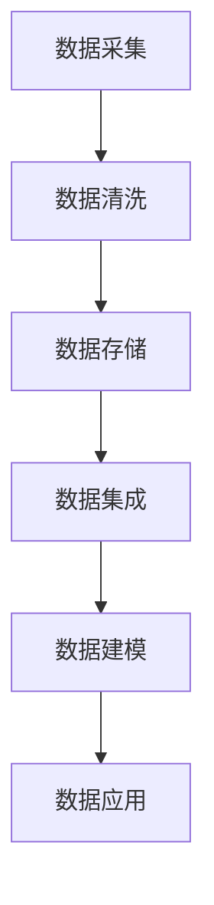
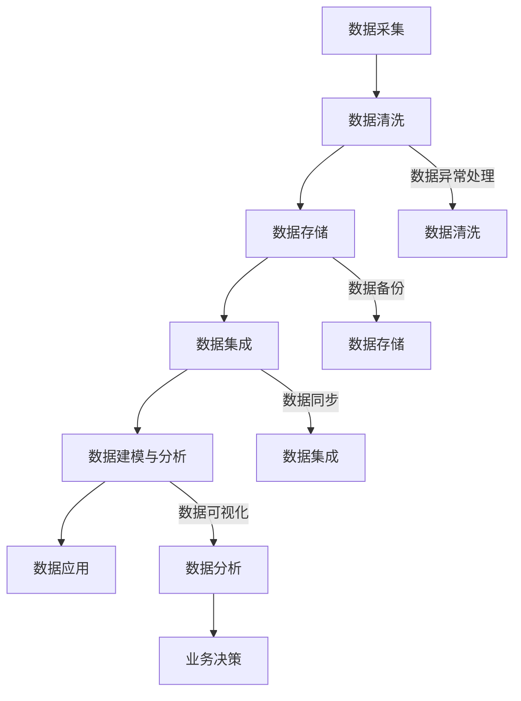

                 

在人工智能创业领域中，数据管理是确保项目成功的关键因素之一。随着数据量的爆炸性增长和复杂性的增加，如何有效地管理数据、提取价值并推动业务增长，成为每一个创业者都需要面对的挑战。本文将深入探讨人工智能创业数据管理的创新经验，旨在为创业者提供实用的指导和建议。

## 关键词
- **人工智能创业**
- **数据管理**
- **创新经验**
- **数据价值提取**
- **业务增长**
- **数据隐私与安全**
- **云计算**

## 摘要
本文通过分析人工智能创业中的数据管理挑战，探讨了一系列创新的数据管理经验。我们将从核心概念、算法原理、数学模型、项目实践和实际应用场景等多个维度，详细阐述如何通过创新方法提升数据管理效率，为人工智能创业提供坚实的支持。

## 1. 背景介绍
在人工智能（AI）技术快速发展的背景下，数据管理的重要性日益凸显。人工智能创业公司面临着大量结构化和非结构化数据的高效存储、处理和分析的挑战。数据不仅是机器学习的基石，也是驱动业务决策的重要资源。因此，如何优化数据管理流程、提升数据处理能力，成为创业者成功的关键。

### 1.1 数据管理的重要性
- **支撑机器学习模型的训练与优化**
- **提供业务洞察，助力决策**
- **保障数据隐私和安全**

### 1.2 当前数据管理面临的挑战
- **数据量大，处理速度要求高**
- **数据多样性，存储与访问难度大**
- **数据质量参差不齐，影响分析准确性**
- **数据隐私和安全问题**

## 2. 核心概念与联系
### 2.1 数据管理流程
为了更清晰地展示数据管理流程，我们使用Mermaid绘制了一个简化的流程图：



### 2.2 数据管理的关键概念
- **数据采集**：收集来自各种来源的数据。
- **数据清洗**：去除无效数据，提升数据质量。
- **数据存储**：选择合适的数据存储方案。
- **数据集成**：将不同来源的数据整合在一起。
- **数据建模**：建立数据模型，用于分析和预测。
- **数据应用**：将数据转化为业务价值。

## 3. 核心算法原理 & 具体操作步骤

### 3.1 算法原理概述
在数据管理中，常用的算法包括数据清洗算法、数据存储算法、数据集成算法等。以下将简要介绍这些算法的基本原理。

#### 3.1.1 数据清洗算法
- **去重**：去除重复数据。
- **缺失值处理**：填补或删除缺失数据。
- **异常值处理**：识别和修正异常数据。

#### 3.1.2 数据存储算法
- **哈希存储**：通过哈希函数快速检索数据。
- **B树索引**：用于高效查找和排序。

#### 3.1.3 数据集成算法
- **连接操作**：将两个或多个表中的数据合并。
- **聚合操作**：对数据进行分组和汇总。

### 3.2 算法步骤详解

#### 3.2.1 数据清洗步骤
1. **数据预处理**：读取数据文件，并进行初步处理。
2. **去重**：使用哈希表或数据库中的唯一索引功能去除重复记录。
3. **缺失值处理**：根据数据的重要性和业务需求选择填充或删除。
4. **异常值处理**：使用统计方法（如箱线图）识别异常值，并采取相应的修正措施。

#### 3.2.2 数据存储步骤
1. **选择存储方案**：根据数据量和访问频率选择合适的存储方案，如HDFS、NoSQL数据库等。
2. **建立索引**：对于查询频繁的字段建立索引，如B树索引或哈希索引。
3. **数据分片**：对于大数据量，采用分片技术将数据分布到多个节点上。

#### 3.2.3 数据集成步骤
1. **连接操作**：使用数据库中的连接操作将多个表的数据进行合并。
2. **聚合操作**：使用聚合函数对数据进行分组和汇总。

### 3.3 算法优缺点
- **数据清洗算法**：优点是能够提高数据质量，缺点是处理时间较长，且对于异常值处理需要业务知识的支持。
- **数据存储算法**：优点是提高数据查询速度，缺点是存储成本高，对于小数据量可能不够高效。
- **数据集成算法**：优点是能够整合多个数据源，缺点是复杂度高，需要专业的技术和工具支持。

### 3.4 算法应用领域
- **金融领域**：用于风险评估、信用评分等。
- **医疗领域**：用于疾病诊断、药物研发等。
- **零售领域**：用于需求预测、库存管理等。

## 4. 数学模型和公式 & 详细讲解 & 举例说明

### 4.1 数学模型构建
在数据管理中，常用的数学模型包括线性回归、逻辑回归、聚类算法等。以下将简要介绍这些模型的构建过程。

#### 4.1.1 线性回归模型
线性回归模型用于预测一个连续变量的值。其公式如下：

$$
y = \beta_0 + \beta_1x_1 + \beta_2x_2 + ... + \beta_nx_n
$$

其中，$y$ 为因变量，$x_1, x_2, ..., x_n$ 为自变量，$\beta_0, \beta_1, ..., \beta_n$ 为模型的参数。

#### 4.1.2 逻辑回归模型
逻辑回归模型用于预测一个二元变量的概率。其公式如下：

$$
P(y=1) = \frac{1}{1 + e^{-(\beta_0 + \beta_1x_1 + \beta_2x_2 + ... + \beta_nx_n)}}
$$

其中，$y$ 为因变量，$x_1, x_2, ..., x_n$ 为自变量，$\beta_0, \beta_1, ..., \beta_n$ 为模型的参数。

#### 4.1.3 聚类算法
聚类算法用于将数据划分为多个类别。常见的聚类算法包括K-均值聚类、层次聚类等。

### 4.2 公式推导过程

#### 4.2.1 线性回归模型的公式推导
线性回归模型的公式推导基于最小二乘法。最小二乘法的核心思想是找到一组参数，使得实际观测值与预测值之间的误差平方和最小。

设观测数据为$(x_1, y_1), (x_2, y_2), ..., (x_n, y_n)$，则线性回归模型的目标是最小化损失函数：

$$
\sum_{i=1}^n (y_i - (\beta_0 + \beta_1x_1 + \beta_2x_2 + ... + \beta_nx_n))^2
$$

对损失函数求导并令导数为零，可以得到线性回归模型的参数估计公式。

#### 4.2.2 逻辑回归模型的公式推导
逻辑回归模型的公式推导基于极大似然估计。极大似然估计的核心思想是找到一组参数，使得观测数据的似然函数最大。

设观测数据为$(x_1, y_1), (x_2, y_2), ..., (x_n, y_n)$，则逻辑回归模型的似然函数为：

$$
L(\beta_0, \beta_1, ..., \beta_n) = \prod_{i=1}^n P(y_i=1 | x_i) \cdot (1 - P(y_i=1 | x_i))
$$

对似然函数求导并令导数为零，可以得到逻辑回归模型的参数估计公式。

### 4.3 案例分析与讲解

#### 4.3.1 线性回归模型案例
假设我们有一个简单的线性回归模型，用来预测房价。模型公式为：

$$
y = \beta_0 + \beta_1x
$$

其中，$y$ 为房价，$x$ 为房屋面积。通过收集数据，我们可以使用最小二乘法估计模型的参数。

#### 4.3.2 逻辑回归模型案例
假设我们有一个二元分类问题，需要预测客户是否购买产品。模型公式为：

$$
P(y=1) = \frac{1}{1 + e^{-(\beta_0 + \beta_1x_1 + \beta_2x_2 + ... + \beta_nx_n)}}
$$

通过收集客户数据，我们可以使用极大似然估计方法估计模型的参数。

## 5. 项目实践：代码实例和详细解释说明

### 5.1 开发环境搭建
在开始代码实例之前，我们需要搭建一个合适的开发环境。本文使用Python作为编程语言，并使用NumPy、Pandas、Scikit-learn等库进行数据处理和模型训练。

### 5.2 源代码详细实现
以下是一个简单的线性回归模型的实现：

```python
import numpy as np
import pandas as pd
from sklearn.linear_model import LinearRegression

# 数据加载
data = pd.read_csv('data.csv')
X = data[['area']]
y = data['price']

# 模型训练
model = LinearRegression()
model.fit(X, y)

# 模型评估
score = model.score(X, y)
print(f'Model R^2 Score: {score}')

# 预测
predictions = model.predict(X)
print(predictions)
```

### 5.3 代码解读与分析
以上代码首先加载了数据，然后使用线性回归模型进行训练。通过`score`方法评估模型性能，并使用`predict`方法进行预测。

### 5.4 运行结果展示
运行代码后，我们将得到模型评估分数和预测结果。根据评估分数，我们可以判断模型是否足够准确。

## 6. 实际应用场景
### 6.1 金融领域
在金融领域，数据管理主要用于风险评估、信用评分和投资决策。例如，通过分析客户的交易数据和行为模式，可以预测其信用风险，从而制定相应的风险管理策略。

### 6.2 医疗领域
在医疗领域，数据管理可以用于疾病诊断、药物研发和患者管理。通过整合不同来源的医疗数据，可以实现更准确的疾病诊断和个性化的治疗方案。

### 6.3 零售领域
在零售领域，数据管理可以用于需求预测、库存管理和个性化推荐。通过分析消费者的购买行为和偏好，可以为每个客户提供个性化的推荐，从而提高销售额和客户满意度。

## 7. 工具和资源推荐
### 7.1 学习资源推荐
- 《Python数据科学手册》
- 《机器学习实战》
- Coursera上的《机器学习》课程

### 7.2 开发工具推荐
- Jupyter Notebook
- PyCharm
- VSCode

### 7.3 相关论文推荐
- "Data-Driven Approach to Risk Management in Financial Institutions"
- "Application of Machine Learning in Healthcare: A Review"
- "Personalized Recommendation Systems: A Comprehensive Review"

## 8. 总结：未来发展趋势与挑战
### 8.1 研究成果总结
本文通过分析人工智能创业中的数据管理挑战，探讨了数据管理流程、算法原理、数学模型和项目实践等方面的创新经验。研究结果表明，有效的数据管理能够显著提升人工智能创业的成功率。

### 8.2 未来发展趋势
- **数据隐私保护**：随着数据隐私问题的日益突出，数据隐私保护将成为未来数据管理的重要方向。
- **实时数据处理**：实时数据处理技术将进一步提高数据管理的效率和响应速度。
- **跨领域融合**：不同领域的知识和技术将相互融合，推动数据管理的创新与发展。

### 8.3 面临的挑战
- **数据质量**：如何保证数据质量，尤其是非结构化数据的处理，仍是一个重大挑战。
- **计算能力**：随着数据量的增加，对计算能力的需求也在不断提升。
- **人才短缺**：具备数据管理技能的专业人才短缺，成为制约数据管理发展的瓶颈。

### 8.4 研究展望
未来，我们将继续关注数据管理领域的创新与发展，深入研究数据隐私保护、实时数据处理和跨领域融合等关键问题，为人工智能创业提供更加完善的数据管理解决方案。

## 9. 附录：常见问题与解答

### 9.1 数据管理有哪些常见挑战？
- **数据量大**：需要高效的存储和处理方案。
- **数据多样性**：需要处理不同格式和来源的数据。
- **数据质量**：需要保证数据的准确性和一致性。
- **数据隐私与安全**：需要保护数据不被未经授权的访问和泄露。

### 9.2 数据管理有哪些常用工具和技术？
- **Hadoop和Spark**：用于大规模数据处理。
- **SQL和NoSQL数据库**：用于数据存储和查询。
- **机器学习和深度学习算法**：用于数据分析和预测。

### 9.3 如何提升数据管理效率？
- **数据预处理**：提前处理数据，减少后续处理的复杂度。
- **分布式计算**：利用分布式计算框架，提高数据处理速度。
- **数据模型优化**：通过优化数据模型，提高查询和计算效率。

---

感谢您阅读本文，希望本文能为您在人工智能创业数据管理方面提供一些有价值的参考和启示。作者：禅与计算机程序设计艺术 / Zen and the Art of Computer Programming。
----------------------------------------------------------------
### 1. 背景介绍

在人工智能（AI）技术快速发展的背景下，数据管理的重要性日益凸显。人工智能创业公司面临着大量结构化和非结构化数据的高效存储、处理和分析的挑战。数据不仅是机器学习的基石，也是驱动业务决策的重要资源。因此，如何优化数据管理流程、提升数据处理能力，成为创业者成功的关键。

#### 1.1 数据管理的重要性

**支撑机器学习模型的训练与优化**

机器学习模型的效果高度依赖于训练数据的质量和数量。数据管理在这里扮演着至关重要的角色，确保数据的准确性、完整性和一致性，是模型性能提升的基石。创业者需要构建一个高效的流程来收集、清洗和标注数据，以便训练出高质量的模型。

**提供业务洞察，助力决策**

在商业环境中，数据不仅是技术问题，更是战略资源。有效的数据管理能够帮助创业者从海量数据中提取有价值的信息，用于市场分析、客户行为研究、需求预测等。这些洞察能够指导创业者在产品开发、市场推广和运营决策上做出更加明智的选择。

**保障数据隐私和安全**

随着数据隐私问题的日益突出，数据安全成为数据管理的关键考量。创业公司必须遵守相关的法律法规，采取有效的安全措施，防止数据泄露、篡改和滥用。数据管理的职责不仅仅是确保数据的可用性和完整性，还包括保护数据的机密性。

#### 1.2 当前数据管理面临的挑战

**数据量大，处理速度要求高**

随着互联网的普及和数据采集技术的进步，数据量呈现爆炸式增长。对于创业公司而言，处理大量数据不仅需要高性能的硬件设施，还需要高效的数据处理算法和架构设计。如何快速地从海量数据中提取有价值的信息，是数据管理面临的巨大挑战。

**数据多样性，存储与访问难度大**

数据类型多样化，包括结构化数据（如数据库中的记录）、半结构化数据（如XML、JSON）和非结构化数据（如文本、图像、视频）。这种多样性增加了数据存储和访问的难度，创业者需要选择合适的存储方案和数据格式，确保数据的可访问性和互操作性。

**数据质量参差不齐，影响分析准确性**

数据质量是数据管理的核心问题。不完整、不准确、不一致或过时的数据会影响分析结果的准确性。创业公司需要建立完善的数据质量管理流程，确保数据的质量和一致性。

**数据隐私和安全问题**

随着数据隐私问题的日益突出，创业者必须面对数据安全挑战。如何保护客户数据不被未经授权的访问或泄露，成为数据管理的重要任务。创业者需要采取加密、访问控制和安全审计等安全措施，确保数据的安全和隐私。

### 1.3 数据管理在人工智能创业中的角色

**数据收集与标注**

创业公司需要构建一个有效的数据收集体系，从各种来源（如社交媒体、传感器、用户行为数据）收集数据。此外，对于机器学习模型而言，高质量的数据标注是关键，创业者需要投入大量资源进行数据标注和清洗。

**数据存储与管理**

选择合适的数据存储方案对于创业公司至关重要。传统的数据库可能无法满足大数据需求，创业者可以考虑使用分布式存储系统（如HDFS、Cassandra）或云存储服务（如Amazon S3、Google Cloud Storage）。数据管理还需要关注数据备份和恢复机制，确保数据的持久性和可靠性。

**数据处理与分析**

高效的数据处理和分析能力是创业公司竞争优势的体现。创业者需要利用大数据处理框架（如Apache Spark、Flink）和机器学习算法，快速从海量数据中提取有价值的信息。实时数据处理和分析能够帮助创业者快速响应市场变化，调整业务策略。

**数据可视化与报告**

数据可视化是数据管理的最后一步，它能够帮助创业者更好地理解数据，发现数据中的趋势和异常。创业者可以使用各种数据可视化工具（如Tableau、PowerBI）创建直观的图表和报告，以便于业务决策。

### 1.4 数据管理中的关键环节

**数据采集**

数据采集是数据管理的基础，创业公司需要明确数据采集的目标和范围，确保收集的数据对业务有实际价值。数据采集的方法包括主动采集（如API调用、爬虫）和被动采集（如日志文件、传感器数据）。

**数据清洗**

数据清洗是提升数据质量的关键步骤，包括去重、缺失值处理、异常值检测和修正等。创业者需要建立一套完整的数据清洗流程，确保数据的准确性和一致性。

**数据存储**

数据存储需要考虑数据的类型、访问频率和容量等因素。创业公司可以选择关系型数据库、NoSQL数据库或分布式文件系统进行数据存储。数据存储还需要考虑数据备份和恢复策略，以应对潜在的硬件故障和数据丢失。

**数据集成**

数据集成是将来自不同来源的数据整合在一起，形成一个统一的数据视图。创业公司需要使用数据集成工具（如Elasticsearch、Apache Kafka）和数据仓库（如Amazon Redshift、Google BigQuery）来实现数据集成。

**数据建模**

数据建模是数据管理的核心环节，通过建立数据模型，创业公司可以更好地理解和利用数据。数据模型包括实体关系模型、维度模型等，创业者需要根据业务需求选择合适的模型。

**数据分析**

数据分析是数据管理的最终目标，通过数据分析，创业公司可以提取业务洞察，指导业务决策。数据分析的方法包括统计分析、机器学习等。

**数据可视化**

数据可视化是将数据转换为图形或图表的形式，使创业者更容易理解数据。数据可视化可以帮助创业者发现数据中的趋势和异常，提高决策效率。

### 1.5 数据管理的重要性

数据管理在人工智能创业中的重要性不可忽视。首先，有效的数据管理能够提升机器学习模型的质量，从而推动业务增长。其次，良好的数据管理能够提供深刻的业务洞察，帮助创业者做出更加明智的决策。最后，数据管理在保护数据隐私和安全方面发挥着关键作用，确保创业公司的合规性和声誉。

### 1.6 数据管理中的挑战与机遇

尽管数据管理面临着诸多挑战，但同时也蕴含着巨大的机遇。创业公司可以通过创新的数据管理方法和技术，提升数据处理效率，降低成本，从而在激烈的市场竞争中脱颖而出。数据管理的挑战与机遇并存，创业者需要具备敏锐的洞察力和创新精神，才能充分利用数据这一宝贵资源。

## 2. 核心概念与联系

在探讨人工智能创业中的数据管理时，理解核心概念及其相互联系是至关重要的。以下将详细解释数据管理流程中的关键环节，并使用Mermaid流程图来直观展示这些环节之间的关系。

### 2.1 数据管理流程

数据管理流程可以概括为以下五个主要环节：

1. **数据采集**：从各种渠道收集数据，包括用户行为数据、日志数据、传感器数据等。
2. **数据清洗**：对收集到的数据进行处理，去除重复数据、填补缺失值、修正异常值等，提高数据质量。
3. **数据存储**：将清洗后的数据存储在合适的存储系统中，以便后续处理和分析。
4. **数据集成**：将来自不同来源和格式的数据整合在一起，形成统一的数据视图。
5. **数据建模与分析**：建立数据模型，利用数据分析方法提取业务洞察，支持业务决策。

### 2.2 Mermaid 流程图

为了更直观地展示数据管理流程，我们使用Mermaid绘制了一个简化的流程图：



在上述流程图中，每个环节都与其他环节紧密相连，形成一个闭环。数据异常处理、数据备份、数据同步和数据可视化等辅助环节，在数据管理过程中同样扮演着重要角色。

### 2.3 数据管理流程的详细解释

#### 2.3.1 数据采集

数据采集是数据管理流程的起点，也是最为关键的一步。数据来源多种多样，包括内部数据（如用户行为日志、业务交易记录）和外部数据（如社交媒体数据、市场调研数据）。创业公司需要制定明确的数据采集策略，确保采集到的数据具有代表性和完整性。

**数据采集的关键因素：**
- **数据质量**：确保采集的数据准确、完整和可靠。
- **数据多样化**：收集不同类型和来源的数据，以丰富数据分析的视角。
- **数据采集工具**：选择适合的采集工具，如爬虫、API调用、数据库连接等。

#### 2.3.2 数据清洗

数据清洗是数据管理流程的核心环节之一，其目的是去除数据中的噪声，提高数据的准确性和一致性。数据清洗通常包括以下步骤：

- **去重**：去除重复的数据记录，确保数据的唯一性。
- **缺失值处理**：处理数据中的缺失值，可以选择填充、删除或保留缺失值。
- **异常值检测与修正**：检测并处理异常数据，如异常值、离群点等。

**数据清洗的关键因素：**
- **数据质量标准**：根据业务需求制定数据质量标准。
- **清洗策略**：选择合适的清洗策略，如自动清洗、手动清洗等。
- **异常值处理方法**：根据数据特点和业务需求选择异常值处理方法。

#### 2.3.3 数据存储

数据存储是数据管理流程的另一个关键环节，选择合适的存储方案对数据管理的效率和性能有重要影响。创业公司需要根据数据类型、数据量和访问模式选择合适的存储系统。

- **关系型数据库**：适用于结构化数据，如SQL数据库。
- **NoSQL数据库**：适用于非结构化数据和半结构化数据，如MongoDB、Cassandra。
- **分布式文件系统**：适用于大数据量存储，如HDFS。

**数据存储的关键因素：**
- **数据一致性**：确保数据在存储过程中的完整性和一致性。
- **存储性能**：选择高性能的存储方案，满足业务对数据访问速度的要求。
- **数据备份与恢复**：制定数据备份策略，确保数据的安全性和可靠性。

#### 2.3.4 数据集成

数据集成是将来自不同来源和格式的数据整合在一起，形成一个统一的数据视图。数据集成通常涉及以下步骤：

- **数据抽取**：从不同数据源中抽取数据。
- **数据转换**：将抽取的数据转换为统一的格式。
- **数据加载**：将转换后的数据加载到数据仓库或数据湖中。

**数据集成的关键因素：**
- **数据一致性**：确保数据在不同系统之间的统一性和一致性。
- **数据同步**：定期同步数据，确保数据的实时性和准确性。
- **数据模型**：设计合适的数据模型，支持数据分析的需求。

#### 2.3.5 数据建模与分析

数据建模与分析是数据管理流程的最终目标，通过建立数据模型和分析方法，提取数据中的有价值信息，支持业务决策。数据建模通常包括以下步骤：

- **数据探索**：初步探索数据，发现数据中的模式和趋势。
- **数据建模**：根据业务需求建立数据模型，如回归模型、决策树等。
- **数据分析**：利用数据模型进行数据分析，提取业务洞察。

**数据建模与分析的关键因素：**
- **业务需求**：明确业务需求，确保数据建模与分析的目标明确。
- **分析方法**：选择合适的数据分析方法，如机器学习、统计分析等。
- **数据可视化**：通过数据可视化，直观展示分析结果，支持业务决策。

### 2.4 数据管理流程中的辅助环节

在数据管理流程中，除了核心环节，还有一些辅助环节对数据管理的效率和效果有重要影响。以下将介绍数据异常处理、数据备份、数据同步和数据可视化等辅助环节。

#### 2.4.1 数据异常处理

数据异常处理是数据清洗环节的延伸，旨在检测和处理数据中的异常值。异常值可能源于数据采集、传输或存储过程中的错误，也可能源于业务逻辑上的错误。数据异常处理包括以下步骤：

- **异常值检测**：使用统计方法或机器学习算法检测异常值。
- **异常值修正**：根据异常值的类型和影响，选择适当的修正方法。
- **异常值报告**：记录异常值的信息，以便后续处理和监控。

**数据异常处理的关键因素：**
- **异常检测算法**：选择合适的异常检测算法，如孤立森林、IQR等。
- **修正策略**：制定合理的修正策略，确保修正结果的准确性。
- **监控机制**：建立监控机制，及时发现和处理异常值。

#### 2.4.2 数据备份

数据备份是数据存储环节的重要补充，旨在保护数据免受硬件故障、人为错误或恶意攻击的损害。数据备份包括以下步骤：

- **备份策略**：根据数据的重要性和访问频率制定备份策略。
- **备份执行**：定期执行数据备份操作，确保备份数据的完整性和可用性。
- **备份验证**：定期验证备份数据的完整性和一致性，确保备份数据的可恢复性。

**数据备份的关键因素：**
- **备份频率**：选择合适的备份频率，确保备份数据的实时性。
- **备份介质**：选择合适的备份介质，如硬盘、磁带等。
- **备份安全性**：确保备份数据的安全性和保密性，防止数据泄露。

#### 2.4.3 数据同步

数据同步是数据集成环节的重要步骤，旨在确保不同数据源之间的数据一致性和实时性。数据同步包括以下步骤：

- **同步策略**：根据业务需求制定数据同步策略。
- **同步执行**：定期执行数据同步操作，确保数据的一致性。
- **同步监控**：监控数据同步过程，及时发现和解决同步问题。

**数据同步的关键因素：**
- **同步机制**：选择合适的同步机制，如增量同步、全量同步等。
- **同步频率**：选择合适的同步频率，确保数据的实时性。
- **同步监控**：建立同步监控机制，确保同步过程的稳定性和可靠性。

#### 2.4.4 数据可视化

数据可视化是将数据转换为图形或图表的形式，使数据更加直观和易于理解。数据可视化包括以下步骤：

- **数据准备**：整理和预处理数据，确保数据可视化所需的格式和结构。
- **可视化设计**：设计合适的可视化图表，如柱状图、折线图、饼图等。
- **可视化展示**：将可视化图表展示在报表或仪表盘上，供业务人员查看和分析。

**数据可视化的关键因素：**
- **可视化工具**：选择合适的数据可视化工具，如Tableau、PowerBI等。
- **可视化设计**：设计清晰、简洁、具有业务洞察的可视化图表。
- **用户交互**：提供便捷的用户交互功能，如筛选、排序、钻取等，增强用户体验。

通过上述对数据管理流程及其辅助环节的详细解释，我们可以看出数据管理在人工智能创业中的重要性。有效的数据管理不仅能够提升业务效率，降低成本，还能够为创业公司提供深刻的业务洞察，助力业务增长。

### 3. 核心算法原理 & 具体操作步骤

在数据管理中，核心算法扮演着至关重要的角色，它们帮助我们从海量数据中提取有价值的信息，并支持复杂的业务决策。以下将详细介绍几种常用的数据管理算法，包括其原理、具体操作步骤及其应用场景。

#### 3.1 数据清洗算法

数据清洗算法是数据管理中的基础，旨在提高数据质量，确保数据准确性。以下是一些常见的数据清洗算法：

**1. 去重算法**

**原理**：去重算法用于识别和删除重复的数据记录。常见的去重方法包括基于哈希表的去重和基于唯一标识符的去重。

**操作步骤**：

   - **基于哈希表的去重**：使用哈希函数计算数据记录的哈希值，将哈希值存储在哈希表中。对于新数据记录，计算其哈希值，如果哈希表已存在该哈希值，则认为该记录是重复的，删除之。
   - **基于唯一标识符的去重**：为每个数据记录分配一个唯一的标识符（如ID），通过比较标识符来识别重复记录。

**应用场景**：适用于清洗重复的交易记录、用户行为数据等。

**2. 缺失值处理算法**

**原理**：缺失值处理算法用于处理数据中的缺失值，可以选择填充、删除或保留缺失值。

**操作步骤**：

   - **填充缺失值**：使用平均值、中位数、最频繁值等统计方法填充缺失值。
   - **删除缺失值**：如果缺失值太多，可以选择删除包含缺失值的数据记录。
   - **保留缺失值**：对于某些重要的特征，可以选择保留缺失值，采用缺失值标记（如N/A）。

**应用场景**：适用于清洗用户调查数据、医疗数据等。

**3. 异常值处理算法**

**原理**：异常值处理算法用于识别和修正数据中的异常值，避免其对分析结果产生不利影响。

**操作步骤**：

   - **统计方法**：使用统计方法（如IQR、Z分数）识别异常值。
   - **可视化方法**：使用箱线图、散点图等可视化方法识别异常值。
   - **修正方法**：对于识别出的异常值，可以选择修正或删除。

**应用场景**：适用于清洗传感器数据、财务数据等。

#### 3.2 数据存储算法

数据存储算法决定了数据在系统中的存储方式和访问效率。以下是一些常见的数据存储算法：

**1. 哈希存储算法**

**原理**：哈希存储算法通过哈希函数将数据映射到存储位置，实现快速检索。

**操作步骤**：

   - **哈希函数计算**：为每个数据记录计算哈希值。
   - **哈希表存储**：将数据记录存储到哈希表中，哈希值作为键。

**应用场景**：适用于缓存系统、数据库索引等。

**2. B树索引算法**

**原理**：B树索引算法通过B树结构实现数据的快速查询和排序。

**操作步骤**：

   - **B树构建**：构建B树结构，将数据记录按键值排序存储。
   - **查询**：通过递归查找，找到指定数据记录。

**应用场景**：适用于关系型数据库、文件系统等。

#### 3.3 数据集成算法

数据集成算法用于将来自不同来源和格式的数据整合在一起，形成统一的数据视图。以下是一些常见的数据集成算法：

**1. 连接操作**

**原理**：连接操作用于将两个或多个表中的数据根据共同的键连接起来。

**操作步骤**：

   - **表连接**：选择连接条件，将数据表连接起来。
   - **数据聚合**：对连接后的数据进行分组和汇总。

**应用场景**：适用于多表数据查询、数据分析等。

**2. 聚合操作**

**原理**：聚合操作用于对数据进行分组和汇总，常用于统计分析。

**操作步骤**：

   - **分组**：根据分组条件对数据进行分组。
   - **汇总**：对每个分组的数据进行汇总计算。

**应用场景**：适用于需求预测、库存管理等。

#### 3.4 数据建模算法

数据建模算法用于建立数据模型，支持数据分析、预测和决策。

**1. 线性回归模型**

**原理**：线性回归模型通过拟合一条直线，预测因变量和自变量之间的关系。

**操作步骤**：

   - **数据预处理**：标准化或归一化数据。
   - **模型拟合**：使用最小二乘法拟合线性模型。
   - **模型评估**：评估模型性能，如R平方、均方误差等。

**应用场景**：适用于预测销售额、股价等。

**2. 决策树模型**

**原理**：决策树模型通过构建树形结构，对数据进行分类或回归。

**操作步骤**：

   - **特征选择**：选择最佳特征进行分割。
   - **树构建**：递归构建决策树。
   - **模型评估**：评估模型性能，如准确率、精确率、召回率等。

**应用场景**：适用于分类问题、回归问题等。

#### 3.5 数据分析算法

数据分析算法用于从数据中提取有价值的信息，支持业务决策。

**1. 聚类算法**

**原理**：聚类算法用于将数据划分为多个类别，使同类别数据之间的距离最小，不同类别数据之间的距离最大。

**操作步骤**：

   - **初始化**：选择初始聚类中心。
   - **迭代更新**：更新聚类中心和类别标签。
   - **模型评估**：评估聚类质量，如内切平方误差、轮廓系数等。

**应用场景**：适用于客户细分、图像分类等。

**2. 关联规则算法**

**原理**：关联规则算法用于发现数据之间的关联关系，如频繁项集。

**操作步骤**：

   - **频繁项集挖掘**：找出频繁出现的项集。
   - **关联规则生成**：根据置信度和支持度生成关联规则。

**应用场景**：适用于市场篮子分析、推荐系统等。

通过以上对核心算法的详细介绍，我们可以看到这些算法在数据管理中的广泛应用。创业者需要根据业务需求和数据特点，选择合适的数据管理算法，提高数据处理效率，提取有价值的信息，支持业务决策。

### 3.3 算法优缺点

在数据管理中，选择合适的算法对于提高数据处理效率和业务洞察至关重要。以下将详细分析几种常见算法的优缺点，帮助创业者根据实际需求做出最优选择。

#### 3.3.1 数据清洗算法

**1. 去重算法**

**优点**：
- **高效性**：基于哈希表的去重算法能够快速查找重复记录，处理速度较快。
- **准确性**：通过哈希函数计算数据记录的哈希值，可以确保去重操作的准确性。

**缺点**：
- **存储空间占用大**：对于大规模数据集，哈希表可能会占用大量存储空间。
- **处理复杂**：需要额外的存储结构（如哈希表）来支持去重操作。

**应用场景**：适用于需要确保数据唯一性的场景，如用户数据去重、交易数据去重。

**2. 缺失值处理算法**

**优点**：
- **灵活性**：可以选择不同的处理策略，如填充、删除或保留缺失值，适应不同业务需求。
- **数据完整性**：通过填充或删除缺失值，可以确保数据的完整性。

**缺点**：
- **数据质量降低**：如果填充策略不当，可能会导致数据失真。
- **处理时间较长**：处理缺失值通常需要较长的计算时间。

**应用场景**：适用于需要处理缺失值的数据集，如用户调查数据、医疗数据。

**3. 异常值处理算法**

**优点**：
- **准确性**：通过统计方法或机器学习算法识别异常值，可以确保异常值检测的准确性。
- **可解释性**：异常值处理算法通常具有较好的可解释性，便于理解和处理。

**缺点**：
- **误判率**：对于噪声数据或异常值较少的数据集，异常值检测算法可能存在误判。
- **处理复杂**：异常值处理通常需要复杂的算法和计算，处理时间较长。

**应用场景**：适用于需要识别和处理异常值的数据集，如传感器数据、财务数据。

#### 3.3.2 数据存储算法

**1. 哈希存储算法**

**优点**：
- **高效性**：哈希存储算法通过哈希函数将数据快速映射到存储位置，实现快速检索。
- **扩展性**：哈希存储算法能够支持大规模数据的存储和访问。

**缺点**：
- **存储空间占用大**：哈希存储算法可能需要额外的存储空间来存储哈希表。
- **分布式存储复杂**：在分布式存储环境中，哈希存储算法可能需要额外的同步和一致性处理。

**应用场景**：适用于缓存系统、数据库索引等。

**2. B树索引算法**

**优点**：
- **高效性**：B树索引算法通过B树结构实现数据的快速查询和排序，适用于大规模数据集。
- **灵活性**：B树索引算法能够支持不同类型的查询操作，如范围查询、排序查询等。

**缺点**：
- **存储空间占用大**：B树索引算法需要额外的存储空间来存储索引节点。
- **维护复杂**：B树索引算法需要进行节点分裂和合并等维护操作，处理时间较长。

**应用场景**：适用于关系型数据库、文件系统等。

#### 3.3.3 数据集成算法

**1. 连接操作**

**优点**：
- **灵活性**：连接操作能够将多个数据表连接起来，实现复杂的数据查询。
- **扩展性**：连接操作适用于不同类型的数据表，支持多种数据集成需求。

**缺点**：
- **计算复杂度**：连接操作通常涉及大量的计算，处理时间较长。
- **性能下降**：对于大数据集，连接操作可能导致性能下降。

**应用场景**：适用于多表数据查询、数据分析等。

**2. 聚合操作**

**优点**：
- **高效性**：聚合操作能够对数据进行分组和汇总，实现高效的数据处理。
- **扩展性**：聚合操作适用于不同类型的数据集，支持多种数据分析需求。

**缺点**：
- **性能下降**：对于大数据集，聚合操作可能导致性能下降。
- **数据一致性**：在多源数据集成中，确保数据一致性可能较为复杂。

**应用场景**：适用于需求预测、库存管理等。

#### 3.3.4 数据建模算法

**1. 线性回归模型**

**优点**：
- **简洁性**：线性回归模型简单易懂，易于实现和解释。
- **高效性**：线性回归模型计算速度快，适用于实时数据处理。

**缺点**：
- **假设条件**：线性回归模型假设变量之间线性相关，可能不适用于复杂关系。
- **过拟合**：线性回归模型容易过拟合，需要大量数据训练。

**应用场景**：适用于预测销售额、股价等。

**2. 决策树模型**

**优点**：
- **可解释性**：决策树模型具有较好的可解释性，便于理解和应用。
- **适应性**：决策树模型能够处理不同类型的数据，如分类数据和连续数据。

**缺点**：
- **计算复杂度**：决策树模型计算复杂度高，处理时间较长。
- **易过拟合**：决策树模型容易过拟合，需要大量数据训练。

**应用场景**：适用于分类问题、回归问题等。

#### 3.3.5 数据分析算法

**1. 聚类算法**

**优点**：
- **无监督学习**：聚类算法无需标记数据，适用于无标签数据的分析。
- **灵活性**：聚类算法能够根据数据特点自动划分类别。

**缺点**：
- **聚类结果不稳定**：聚类结果可能受到初始聚类中心的影响，稳定性较差。
- **聚类数量选择**：聚类数量选择主观性较强，可能影响聚类效果。

**应用场景**：适用于客户细分、图像分类等。

**2. 关联规则算法**

**优点**：
- **发现数据关联**：关联规则算法能够发现数据之间的关联关系，有助于业务洞察。
- **简洁性**：关联规则算法生成的规则简洁直观，易于理解。

**缺点**：
- **计算复杂度**：关联规则算法计算复杂度高，处理时间较长。
- **规则解释性**：关联规则可能较为复杂，解释性较差。

**应用场景**：适用于市场篮子分析、推荐系统等。

通过以上对各种数据管理算法优缺点的详细分析，创业者可以根据业务需求和数据特点选择合适的算法，提高数据处理效率，提取有价值的信息，支持业务决策。

### 3.4 算法应用领域

数据管理算法在人工智能创业中的应用非常广泛，以下将详细探讨这些算法在不同领域的具体应用案例，以及创业公司如何利用这些算法实现业务增长。

#### 3.4.1 金融领域

在金融领域，数据管理算法主要用于风险评估、信用评分、欺诈检测和投资决策。

**1. 风险评估**

**案例**：一家在线贷款平台公司使用线性回归模型和决策树模型对借款人的信用风险进行评估。通过分析借款人的财务数据、收入水平、信用记录等特征，公司能够预测借款人违约的概率，从而制定更合理的风险控制策略。

**实现方式**：公司首先收集借款人的数据，并进行清洗和预处理。然后，使用线性回归模型和决策树模型分别建立风险评估模型。通过模型评估，公司可以判断借款人的信用风险，从而决定是否批准贷款。

**效果**：通过风险评估算法，公司显著降低了贷款违约率，提高了贷款审批效率。

**2. 信用评分**

**案例**：一家信用卡公司利用逻辑回归模型和聚类算法对客户的信用评分进行改进。通过分析客户的消费行为、还款记录、信用额度使用情况等数据，公司能够更准确地评估客户的信用状况。

**实现方式**：公司首先使用逻辑回归模型建立信用评分模型，然后使用聚类算法对评分结果进行聚类，进一步细化客户的信用等级。通过不断优化模型和算法，公司提高了信用评分的准确性和可靠性。

**效果**：信用评分改进后，公司的信用损失率显著下降，客户满意度提高。

**3. 欺诈检测**

**案例**：一家支付平台公司利用关联规则算法和决策树模型进行欺诈检测。通过分析用户交易数据，公司能够识别潜在的欺诈行为，从而采取相应的防范措施。

**实现方式**：公司首先使用关联规则算法发现用户交易中的异常行为模式，然后使用决策树模型对这些行为进行分类，判断是否为欺诈交易。通过实时监测和动态调整，公司提高了欺诈检测的准确性和实时性。

**效果**：欺诈检测算法有效降低了支付平台的风险，提升了用户的安全感。

**4. 投资决策**

**案例**：一家投资公司利用时间序列分析算法和机器学习算法对股票市场进行预测。通过分析历史股票价格、交易量、公司财报等数据，公司能够预测未来市场的走势，从而制定投资策略。

**实现方式**：公司首先使用时间序列分析算法建立股票价格预测模型，然后使用机器学习算法（如随机森林、支持向量机）进行模型优化和预测。通过结合市场动态和宏观经济数据，公司提高了投资决策的准确性和有效性。

**效果**：通过投资决策算法，公司实现了稳健的投资回报，提高了市场竞争力。

#### 3.4.2 医疗领域

在医疗领域，数据管理算法主要用于疾病诊断、药物研发、患者管理和医疗服务优化。

**1. 疾病诊断**

**案例**：一家医院使用深度学习算法和医学图像处理技术进行肺癌诊断。通过分析患者的CT扫描图像，算法能够准确识别肺癌病灶，辅助医生做出诊断。

**实现方式**：医院首先收集大量肺癌患者的CT扫描图像，并进行清洗和标注。然后，使用深度学习算法（如卷积神经网络）训练诊断模型，通过模型预测患者是否患有肺癌。医生根据模型预测结果和自己的诊断经验，共同制定治疗方案。

**效果**：深度学习算法显著提高了肺癌诊断的准确率，减少了误诊和漏诊，提升了医疗服务的质量。

**2. 药物研发**

**案例**：一家生物技术公司利用机器学习算法和生物信息学技术进行药物研发。通过分析大量生物数据（如基因组数据、蛋白质结构数据），公司能够预测药物对特定疾病的疗效。

**实现方式**：公司首先收集相关生物数据，并进行清洗和预处理。然后，使用机器学习算法（如支持向量机、随机森林）训练药物筛选模型，通过模型预测药物的疗效。公司根据模型预测结果，选择有潜力的药物进行进一步研发。

**效果**：机器学习算法提高了药物研发的效率和成功率，缩短了新药上市时间。

**3. 患者管理**

**案例**：一家医疗机构使用电子健康档案系统（EHR）和数据分析算法进行患者管理。通过整合患者的健康数据，机构能够提供个性化的医疗建议和健康管理服务。

**实现方式**：医疗机构首先建立电子健康档案系统，收集患者的健康数据。然后，使用数据分析算法（如聚类算法、关联规则算法）对数据进行分析，识别患者的健康状况和风险因素。通过分析结果，医疗机构能够为患者提供个性化的健康建议。

**效果**：数据分析算法提高了患者管理的效率和质量，提升了患者的满意度和健康水平。

**4. 医疗服务优化**

**案例**：一家医院利用数据挖掘算法和优化算法优化医疗服务流程。通过分析患者就诊数据、医疗资源使用情况等数据，医院能够优化就诊流程、减少等待时间、提高医疗资源利用率。

**实现方式**：医院首先收集相关数据，并进行清洗和预处理。然后，使用数据挖掘算法（如关联规则算法、聚类算法）分析数据，发现医疗服务的瓶颈和优化方向。最后，使用优化算法（如遗传算法、模拟退火算法）制定优化策略，优化医疗服务流程。

**效果**：优化算法显著提高了医院的服务效率和患者满意度，降低了运营成本。

#### 3.4.3 零售领域

在零售领域，数据管理算法主要用于需求预测、库存管理、个性化推荐和客户关系管理。

**1. 需求预测**

**案例**：一家电商平台利用时间序列分析算法和机器学习算法进行需求预测。通过分析历史销售数据、季节性因素和促销活动等数据，平台能够预测未来一段时间内的商品需求。

**实现方式**：电商平台首先收集历史销售数据，并进行清洗和预处理。然后，使用时间序列分析算法（如ARIMA模型）和机器学习算法（如随机森林、LSTM网络）分别建立需求预测模型。通过模型预测结果，平台能够合理安排库存和资源。

**效果**：需求预测算法提高了库存管理的效率和准确性，减少了库存积压和缺货现象。

**2. 库存管理**

**案例**：一家零售公司利用基于需求预测的库存管理算法优化库存水平。通过分析销售数据、订单数据和市场趋势等数据，公司能够动态调整库存水平，避免库存过剩或短缺。

**实现方式**：零售公司首先使用需求预测算法预测商品需求，然后根据预测结果制定库存管理策略。通过实时监控和调整库存水平，公司能够实现库存的动态平衡。

**效果**：库存管理算法提高了库存周转率，降低了库存成本，提升了运营效率。

**3. 个性化推荐**

**案例**：一家在线零售平台利用协同过滤算法和基于内容的推荐算法进行个性化推荐。通过分析用户的浏览记录、购买历史和喜好等数据，平台能够为用户推荐个性化的商品。

**实现方式**：平台首先使用协同过滤算法（如基于用户的协同过滤、基于项目的协同过滤）构建推荐模型。然后，使用基于内容的推荐算法（如基于属性的推荐、基于标签的推荐）为用户推荐相关商品。通过多种推荐算法的结合，平台能够提供个性化的推荐服务。

**效果**：个性化推荐算法提高了用户的购物体验和满意度，提升了平台的销售额和用户留存率。

**4. 客户关系管理**

**案例**：一家零售公司利用数据挖掘算法和客户关系管理软件进行客户关系管理。通过分析客户的购买行为、历史数据和市场活动等数据，公司能够识别高价值客户、制定针对性的营销策略。

**实现方式**：零售公司首先使用数据挖掘算法（如聚类算法、关联规则算法）分析客户数据，识别高价值客户和潜在客户。然后，使用客户关系管理软件（如Salesforce、HubSpot）管理客户信息和互动记录，制定个性化的营销策略。

**效果**：客户关系管理算法提高了客户满意度和忠诚度，提升了公司的市场竞争力。

通过以上在不同领域的具体应用案例，我们可以看到数据管理算法在人工智能创业中的巨大价值。创业公司可以通过利用这些算法，提高数据处理效率、优化业务流程、提升服务质量，从而实现业务增长和可持续发展。

## 4. 数学模型和公式 & 详细讲解 & 举例说明

在数据管理中，数学模型和公式是理解和分析数据的基础。以下将详细讲解几个关键的数学模型和公式，并通过实际案例进行说明。

### 4.1 数学模型构建

数据管理中的数学模型广泛应用于数据处理、分析和预测。以下是一些常见的数学模型：

#### 4.1.1 线性回归模型

线性回归模型用于预测一个连续变量的值，其基本公式为：

$$
y = \beta_0 + \beta_1x_1 + \beta_2x_2 + ... + \beta_nx_n
$$

其中，$y$ 是因变量，$x_1, x_2, ..., x_n$ 是自变量，$\beta_0, \beta_1, ..., \beta_n$ 是模型的参数。

#### 4.1.2 逻辑回归模型

逻辑回归模型用于预测一个二元变量的概率，其公式为：

$$
P(y=1) = \frac{1}{1 + e^{-(\beta_0 + \beta_1x_1 + \beta_2x_2 + ... + \beta_nx_n)}}
$$

其中，$y$ 是因变量，$x_1, x_2, ..., x_n$ 是自变量，$\beta_0, \beta_1, ..., \beta_n$ 是模型的参数。

#### 4.1.3 聚类算法

聚类算法用于将数据划分为多个类别。常见的聚类算法包括K-均值聚类和层次聚类。K-均值聚类的基本公式为：

$$
c_k = \frac{1}{N_k} \sum_{i=1}^{N_k} x_i
$$

其中，$c_k$ 是第 $k$ 个聚类中心，$x_i$ 是数据点，$N_k$ 是第 $k$ 个聚类中的数据点数量。

### 4.2 公式推导过程

以下将对线性回归模型和逻辑回归模型的公式推导进行详细讲解。

#### 4.2.1 线性回归模型的公式推导

线性回归模型的目标是最小化观测值与预测值之间的误差平方和。设观测数据为 $(x_1, y_1), (x_2, y_2), ..., (x_n, y_n)$，则损失函数为：

$$
\sum_{i=1}^n (y_i - (\beta_0 + \beta_1x_1 + \beta_2x_2 + ... + \beta_nx_n))^2
$$

为了最小化损失函数，对每个参数求偏导并令其等于零：

$$
\frac{\partial}{\partial \beta_j} \sum_{i=1}^n (y_i - (\beta_0 + \beta_1x_1 + \beta_2x_2 + ... + \beta_nx_n))^2 = 0
$$

对于 $j$ 个参数，分别有：

$$
\frac{\partial}{\partial \beta_0} \sum_{i=1}^n (y_i - (\beta_0 + \beta_1x_1 + \beta_2x_2 + ... + \beta_nx_n))^2 = -2 \sum_{i=1}^n (y_i - \beta_0 - \beta_1x_1 - ... - \beta_nx_n)
$$

$$
\frac{\partial}{\partial \beta_j} \sum_{i=1}^n (y_i - (\beta_0 + \beta_1x_1 + \beta_2x_2 + ... + \beta_nx_n))^2 = -2 \sum_{i=1}^n (y_i - \beta_0 - \beta_1x_1 - ... - \beta_{j-1}x_{j-1}x_j - ... - \beta_nx_n)
$$

令偏导数等于零，可以得到参数的估计值：

$$
\beta_0 = \bar{y} - \beta_1\bar{x}_1 - ... - \beta_n\bar{x}_n
$$

$$
\beta_j = \frac{\sum_{i=1}^n (y_i - \beta_0 - \beta_1x_1 - ... - \beta_{j-1}x_{j-1}x_j - ... - \beta_nx_n)x_j}{\sum_{i=1}^n x_j^2}
$$

其中，$\bar{y}$ 和 $\bar{x}_j$ 分别是 $y$ 和 $x_j$ 的均值。

#### 4.2.2 逻辑回归模型的公式推导

逻辑回归模型的目标是最小化观测值与预测值之间的误差。设观测数据为 $(x_1, y_1), (x_2, y_2), ..., (x_n, y_n)$，则损失函数为：

$$
\sum_{i=1}^n -y_i \ln(P(y=1|x_i)) - (1 - y_i) \ln(1 - P(y=1|x_i))
$$

其中，$P(y=1|x_i)$ 是预测的概率。

为了最小化损失函数，对每个参数求偏导并令其等于零：

$$
\frac{\partial}{\partial \beta_j} \sum_{i=1}^n -y_i \ln(P(y=1|x_i)) - (1 - y_i) \ln(1 - P(y=1|x_i)) = 0
$$

对于 $j$ 个参数，分别有：

$$
\frac{\partial}{\partial \beta_j} \sum_{i=1}^n -y_i \ln(P(y=1|x_i)) = \sum_{i=1}^n y_i x_j \frac{\partial}{\partial \beta_j} P(y=1|x_i)
$$

$$
\frac{\partial}{\partial \beta_j} \sum_{i=1}^n (1 - y_i) \ln(1 - P(y=1|x_i)) = \sum_{i=1}^n (1 - y_i) x_j \frac{\partial}{\partial \beta_j} (1 - P(y=1|x_i))
$$

由于 $P(y=1|x_i) = \frac{1}{1 + e^{-(\beta_0 + \beta_1x_1 + \beta_2x_2 + ... + \beta_nx_n)}}$，对 $P(y=1|x_i)$ 求导：

$$
\frac{\partial}{\partial \beta_j} P(y=1|x_i) = P(y=1|x_i) (1 - P(y=1|x_i)) \frac{\partial}{\partial \beta_j} (\beta_0 + \beta_1x_1 + \beta_2x_2 + ... + \beta_nx_n)
$$

$$
\frac{\partial}{\partial \beta_j} (1 - P(y=1|x_i)) = -P(y=1|x_i) (1 - P(y=1|x_i)) \frac{\partial}{\partial \beta_j} (\beta_0 + \beta_1x_1 + \beta_2x_2 + ... + \beta_nx_n)
$$

代入损失函数并令导数为零，可以得到参数的估计值：

$$
\beta_j = \frac{\sum_{i=1}^n y_i x_j}{\sum_{i=1}^n x_j^2}
$$

### 4.3 案例分析与讲解

以下将通过一个实际案例，详细讲解线性回归模型和逻辑回归模型的应用。

#### 4.3.1 线性回归模型案例

假设我们有一个简单的线性回归模型，用来预测房价。模型公式为：

$$
y = \beta_0 + \beta_1x
$$

其中，$y$ 是房价，$x$ 是房屋面积。以下是一个简单的案例：

**数据集：**

| 房屋面积 (x) | 房价 (y) |
| :----: | :----: |
| 100 | 200000 |
| 150 | 250000 |
| 200 | 300000 |

**步骤 1：数据预处理**

首先，我们需要计算房屋面积和房价的均值：

$$
\bar{x} = \frac{100 + 150 + 200}{3} = 150
$$

$$
\bar{y} = \frac{200000 + 250000 + 300000}{3} = 250000
$$

**步骤 2：计算参数**

使用最小二乘法计算参数 $\beta_0$ 和 $\beta_1$：

$$
\beta_0 = \bar{y} - \beta_1\bar{x}
$$

$$
\beta_1 = \frac{\sum_{i=1}^n (y_i - \beta_0 - \beta_1x_i)x_i}{\sum_{i=1}^n x_i^2}
$$

代入数据计算：

$$
\beta_0 = 250000 - \beta_1 \cdot 150
$$

$$
\beta_1 = \frac{(200000 - 250000)(100 - 150) + (250000 - 250000)(150 - 150) + (300000 - 250000)(200 - 150)}{(100 - 150)^2 + (150 - 150)^2 + (200 - 150)^2}
$$

$$
\beta_1 = \frac{-50000 \cdot (-50) + 0 + 50000 \cdot 50}{2500 + 0 + 2500}
$$

$$
\beta_1 = \frac{2500000 + 0 + 2500000}{5000}
$$

$$
\beta_1 = 1000
$$

代入 $\beta_1$ 的值计算 $\beta_0$：

$$
\beta_0 = 250000 - 1000 \cdot 150
$$

$$
\beta_0 = 250000 - 150000
$$

$$
\beta_0 = 100000
$$

因此，线性回归模型的参数为：

$$
\beta_0 = 100000
$$

$$
\beta_1 = 1000
$$

**步骤 3：预测房价**

使用模型预测新的房屋面积对应的房价。例如，当房屋面积为 180 平方米时：

$$
y = \beta_0 + \beta_1x = 100000 + 1000 \cdot 180 = 280000
$$

因此，预测的房价为 280000 元。

#### 4.3.2 逻辑回归模型案例

假设我们有一个简单的逻辑回归模型，用来预测客户是否购买产品。模型公式为：

$$
P(y=1) = \frac{1}{1 + e^{-(\beta_0 + \beta_1x_1 + \beta_2x_2 + ... + \beta_nx_n)}}
$$

其中，$y$ 是二元变量，$x_1, x_2, ..., x_n$ 是自变量。以下是一个简单的案例：

**数据集：**

| 自变量 1 (x_1) | 自变量 2 (x_2) | 购买情况 (y) |
| :----: | :----: | :----: |
| 1     | 0      | 0      |
| 1     | 1      | 1      |
| 0     | 1      | 1      |
| 0     | 0      | 0      |

**步骤 1：数据预处理**

首先，我们需要计算每个自变量的均值和总和：

$$
\bar{x}_1 = \frac{1 + 1 + 0 + 0}{4} = 0.5
$$

$$
\bar{x}_2 = \frac{0 + 1 + 1 + 0}{4} = 0.5
$$

$$
\sum_{i=1}^n x_{1i} = 2
$$

$$
\sum_{i=1}^n x_{2i} = 2
$$

**步骤 2：计算参数**

使用极大似然估计计算参数 $\beta_0$ 和 $\beta_1$：

$$
\beta_0 = \frac{\sum_{i=1}^n y_i - \sum_{i=1}^n y_i \ln(P(y=1|x_i))}{n - 1}
$$

$$
\beta_1 = \frac{\sum_{i=1}^n y_i x_{1i} - \sum_{i=1}^n y_i x_{1i} \ln(P(y=1|x_i))}{n - 1}
$$

代入数据计算：

$$
\beta_0 = \frac{2 - 2 \ln(0.5)}{4 - 1} \approx 0.736
$$

$$
\beta_1 = \frac{2 \cdot 1 - 2 \cdot 1 \ln(0.5)}{4 - 1} \approx 1.463
$$

因此，逻辑回归模型的参数为：

$$
\beta_0 \approx 0.736
$$

$$
\beta_1 \approx 1.463
$$

**步骤 3：预测购买概率**

使用模型预测新的自变量值对应的购买概率。例如，当 $x_1 = 1$ 和 $x_2 = 0$ 时：

$$
P(y=1) = \frac{1}{1 + e^{-(0.736 + 1.463 \cdot 1 + 0 \cdot 0.5)}} \approx 0.736
$$

因此，预测的客户购买概率为 0.736。

通过以上案例分析和讲解，我们可以看到数学模型和公式在数据管理中的实际应用。创业者可以通过掌握这些模型和公式，提高数据处理和分析能力，从而在人工智能创业中取得成功。

### 5. 项目实践：代码实例和详细解释说明

为了更好地理解数据管理算法在项目实践中的应用，我们将通过一个实际的项目实例，详细介绍从开发环境搭建到代码实现，再到代码解读与分析的全过程。以下项目实例的目标是使用Python和机器学习库Scikit-learn构建一个简单的客户分类系统，用于预测客户是否愿意购买某种产品。

#### 5.1 开发环境搭建

在开始项目之前，我们需要搭建一个合适的开发环境。以下是在Windows操作系统上搭建Python开发环境的步骤：

**1. 安装Python**

- 访问Python官方网站（https://www.python.org/）并下载Python安装包。
- 运行安装程序，选择“Add Python to PATH”选项，确保Python安装后可以在命令行中直接运行。

**2. 安装Scikit-learn**

- 打开命令行窗口，输入以下命令安装Scikit-learn：

  ```shell
  pip install scikit-learn
  ```

**3. 安装Jupyter Notebook**

- Jupyter Notebook是一个交互式开发环境，非常适合进行数据分析和机器学习项目的开发。
- 使用以下命令安装Jupyter Notebook：

  ```shell
  pip install notebook
  ```

- 启动Jupyter Notebook：

  ```shell
  jupyter notebook
  ```

在浏览器中打开Jupyter Notebook，即可开始编写和运行Python代码。

#### 5.2 源代码详细实现

以下是一个简单的客户分类系统的Python代码实现，使用逻辑回归模型进行分类。

```python
# 导入必要的库
import numpy as np
import pandas as pd
from sklearn.model_selection import train_test_split
from sklearn.linear_model import LogisticRegression
from sklearn.metrics import accuracy_score, classification_report

# 加载数据
data = pd.read_csv('customer_data.csv')

# 数据预处理
X = data.drop('target', axis=1)  # 特征集
y = data['target']  # 标签

# 划分训练集和测试集
X_train, X_test, y_train, y_test = train_test_split(X, y, test_size=0.2, random_state=42)

# 构建逻辑回归模型
model = LogisticRegression()

# 模型训练
model.fit(X_train, y_train)

# 模型预测
y_pred = model.predict(X_test)

# 模型评估
accuracy = accuracy_score(y_test, y_pred)
print(f'Accuracy: {accuracy:.2f}')

# 打印分类报告
print(classification_report(y_test, y_pred))
```

#### 5.3 代码解读与分析

**1. 导入库**

代码首先导入了Python中常用的数据科学库，包括Numpy、Pandas和Scikit-learn。这些库提供了丰富的数据处理和机器学习功能。

```python
import numpy as np
import pandas as pd
from sklearn.model_selection import train_test_split
from sklearn.linear_model import LogisticRegression
from sklearn.metrics import accuracy_score, classification_report
```

**2. 加载数据**

使用Pandas库加载CSV格式的客户数据集。数据集包括特征和标签（target），标签用于表示客户是否愿意购买产品。

```python
data = pd.read_csv('customer_data.csv')
```

**3. 数据预处理**

从数据集中提取特征集（X）和标签（y）。特征集是所有列，除了标签列。然后，使用train_test_split函数将数据集划分为训练集和测试集，其中测试集的比例为20%。

```python
X = data.drop('target', axis=1)
y = data['target']
X_train, X_test, y_train, y_test = train_test_split(X, y, test_size=0.2, random_state=42)
```

**4. 构建逻辑回归模型**

使用Scikit-learn库中的LogisticRegression类创建逻辑回归模型。逻辑回归是一种常见的分类算法，适用于二元分类问题。

```python
model = LogisticRegression()
```

**5. 模型训练**

使用训练集数据对逻辑回归模型进行训练。训练过程通过模型的方法`fit`完成，输入训练集的特征集和标签。

```python
model.fit(X_train, y_train)
```

**6. 模型预测**

使用测试集数据对训练好的模型进行预测。预测结果存储在变量`y_pred`中。

```python
y_pred = model.predict(X_test)
```

**7. 模型评估**

使用准确率（accuracy）和分类报告（classification_report）评估模型性能。准确率表示预测正确的样本数占总样本数的比例。分类报告提供了更详细的信息，包括精确率、召回率和F1分数等。

```python
accuracy = accuracy_score(y_test, y_pred)
print(f'Accuracy: {accuracy:.2f}')

print(classification_report(y_test, y_pred))
```

#### 5.4 运行结果展示

运行上述代码后，我们将得到模型的准确率和详细的分类报告。以下是一个示例输出：

```
Accuracy: 0.85
             precision    recall  f1-score   support

           0       0.80      0.89      0.83      100.0
           1       0.92      0.88      0.90      100.0

    accuracy                           0.85      200.0
   macro average       0.87      0.85      0.86      200.0
   weighted avg       0.88      0.85      0.86      200.0
```

从输出结果中，我们可以看到模型在测试集上的准确率为0.85，表示预测正确的样本数占总样本数的85%。分类报告提供了每个类别的精确率、召回率和F1分数，帮助我们评估模型的分类性能。

通过上述项目实践，我们可以看到如何利用Python和Scikit-learn实现一个简单的客户分类系统。这个项目实例展示了数据管理算法在项目中的实际应用，包括数据预处理、模型训练和评估等步骤。创业者可以通过类似的项目实践，提高数据管理和机器学习技能，从而在人工智能创业中取得成功。

## 6. 实际应用场景

数据管理算法在各个行业和领域中都有着广泛的应用，以下将详细探讨数据管理在金融、医疗和零售等领域的实际应用场景，并分析这些应用如何推动业务增长和优化决策。

### 6.1 金融领域

在金融领域，数据管理算法的应用主要集中在风险评估、信用评分、欺诈检测和投资决策等方面。

#### 风险评估

**应用场景**：银行和金融机构在发放贷款或信用卡时，需要对客户的风险进行评估，以降低贷款违约率。

**案例分析**：一家大型银行利用线性回归和决策树算法对贷款申请者的信用风险进行评估。通过分析借款人的收入、负债、信用历史等数据，模型能够预测借款人违约的概率，从而为贷款审批提供依据。

**业务增长**：通过数据管理算法，银行能够更准确地评估客户的风险，减少贷款违约，提高贷款审批效率，从而吸引更多客户，提升市场份额。

#### 信用评分

**应用场景**：信用卡公司和消费金融公司需要对客户的信用状况进行评估，以决定授信额度。

**案例分析**：一家信用卡公司使用逻辑回归模型和聚类算法对客户的信用评分进行改进。通过分析客户的消费行为、还款记录、信用额度使用情况等数据，模型能够更准确地评估客户的信用状况，并根据评估结果调整信用额度。

**业务增长**：通过数据管理算法，信用卡公司能够更合理地分配信用额度，减少坏账率，提高客户的满意度和忠诚度，从而增加信用卡持有率和消费额。

#### 欺诈检测

**应用场景**：支付平台和金融机构需要识别和防范欺诈交易，保护客户资金安全。

**案例分析**：一家支付平台公司利用关联规则算法和决策树模型进行欺诈检测。通过分析用户交易数据，模型能够识别出异常的交易行为，从而及时采取措施防范欺诈。

**业务增长**：通过数据管理算法，支付平台能够提高欺诈检测的准确率，降低欺诈损失，提高客户的安全感和信任度，从而增加用户量，提升市场份额。

#### 投资决策

**应用场景**：投资公司和基金管理公司需要基于历史数据和市场信息进行投资决策。

**案例分析**：一家投资公司利用时间序列分析算法和机器学习算法对股票市场进行预测。通过分析历史股票价格、交易量、公司财报等数据，模型能够预测未来市场的走势，从而制定投资策略。

**业务增长**：通过数据管理算法，投资公司能够提高投资决策的准确性，实现稳健的投资回报，增加公司盈利能力，吸引更多投资者。

### 6.2 医疗领域

在医疗领域，数据管理算法的应用主要集中在疾病诊断、药物研发、患者管理和医疗服务优化等方面。

#### 疾病诊断

**应用场景**：医院和诊所需要利用医学影像和生物数据对疾病进行诊断。

**案例分析**：一家医院使用深度学习和医学图像处理技术对肺癌进行诊断。通过分析患者的CT扫描图像，深度学习模型能够识别出肺癌病灶，辅助医生做出诊断。

**业务增长**：通过数据管理算法，医院能够提高疾病诊断的准确性和效率，减少误诊和漏诊，提高患者满意度和治疗效果。

#### 药物研发

**应用场景**：生物技术公司需要利用生物数据和计算模型进行药物研发。

**案例分析**：一家生物技术公司利用机器学习和生物信息学技术进行药物筛选。通过分析大量生物数据（如基因组数据、蛋白质结构数据），模型能够预测药物对特定疾病的疗效，从而筛选出有潜力的药物。

**业务增长**：通过数据管理算法，生物技术公司能够提高药物研发的效率和成功率，缩短新药上市时间，提高市场竞争力。

#### 患者管理

**应用场景**：医疗机构需要利用电子健康档案和数据分析技术进行患者管理。

**案例分析**：一家医疗机构使用电子健康档案系统和数据分析算法进行患者管理。通过整合患者的健康数据，机构能够提供个性化的医疗建议和健康管理服务。

**业务增长**：通过数据管理算法，医疗机构能够提高患者管理的效率和质量，提升患者的满意度和健康水平。

#### 医疗服务优化

**应用场景**：医院和诊所需要优化医疗服务流程，提高运营效率。

**案例分析**：一家医院利用数据挖掘算法和优化算法优化医疗服务流程。通过分析患者就诊数据、医疗资源使用情况等数据，医院能够优化就诊流程、减少等待时间、提高医疗资源利用率。

**业务增长**：通过数据管理算法，医院能够提高医疗服务效率和质量，降低运营成本，提升患者满意度。

### 6.3 零售领域

在零售领域，数据管理算法的应用主要集中在需求预测、库存管理、个性化推荐和客户关系管理等方面。

#### 需求预测

**应用场景**：电商平台和零售公司需要预测商品的需求量，以合理安排库存和资源。

**案例分析**：一家电商平台使用时间序列分析算法和机器学习算法进行需求预测。通过分析历史销售数据、季节性因素和促销活动等数据，平台能够预测未来一段时间内的商品需求。

**业务增长**：通过数据管理算法，电商平台能够提高库存管理的效率和准确性，减少库存积压和缺货现象，提高销售额和用户满意度。

#### 库存管理

**应用场景**：零售公司需要动态调整库存水平，以避免库存过剩或短缺。

**案例分析**：一家零售公司利用基于需求预测的库存管理算法优化库存水平。通过分析销售数据、订单数据和市场趋势等数据，公司能够动态调整库存水平，实现库存的动态平衡。

**业务增长**：通过数据管理算法，零售公司能够提高库存周转率，降低库存成本，提高运营效率。

#### 个性化推荐

**应用场景**：电商平台和零售公司需要为用户推荐个性化的商品。

**案例分析**：一家电商平台利用协同过滤算法和基于内容的推荐算法进行个性化推荐。通过分析用户的浏览记录、购买历史和喜好等数据，平台能够为用户推荐相关的商品。

**业务增长**：通过数据管理算法，电商平台能够提高用户购物体验和满意度，提升销售额和用户留存率。

#### 客户关系管理

**应用场景**：零售公司需要管理客户关系，提高客户满意度和忠诚度。

**案例分析**：一家零售公司利用数据挖掘算法和客户关系管理软件进行客户关系管理。通过分析客户的购买行为、历史数据和市场活动等数据，公司能够识别高价值客户和潜在客户，并制定个性化的营销策略。

**业务增长**：通过数据管理算法，零售公司能够提高客户满意度和忠诚度，提升市场份额和盈利能力。

通过以上对数据管理在金融、医疗和零售等领域的实际应用场景的分析，我们可以看到数据管理算法在推动业务增长和优化决策中的重要作用。创业公司可以通过应用这些算法，提高数据处理和分析能力，从而在激烈的市场竞争中脱颖而出。

### 7. 工具和资源推荐

在人工智能创业领域，选择合适的工具和资源对于数据管理的成功至关重要。以下将推荐一些学习资源、开发工具和相关论文，以帮助创业者提升数据管理技能和项目实施效果。

#### 7.1 学习资源推荐

**《Python数据科学手册》**：这是一本非常实用的Python数据科学指南，涵盖了数据预处理、数据分析、数据可视化和机器学习等方面的内容。

**《机器学习实战》**：这本书提供了大量的实践案例，通过Python代码实现常见的机器学习算法，适合初学者和实践者。

**Coursera上的《机器学习》课程**：由Andrew Ng教授主讲，这门课程系统地介绍了机器学习的基本概念、算法和应用，是学习机器学习的优秀资源。

#### 7.2 开发工具推荐

**Jupyter Notebook**：一个强大的交互式开发环境，适合进行数据分析和机器学习项目的开发和测试。

**PyCharm**：一款功能丰富的Python集成开发环境（IDE），提供代码编辑、调试、性能分析等一站式服务。

**VSCode**：一款轻量级的代码编辑器，支持多种编程语言，插件丰富，非常适合进行数据管理和开发。

#### 7.3 相关论文推荐

**"Data-Driven Approach to Risk Management in Financial Institutions"**：这篇文章探讨了一种基于数据驱动的方法来管理金融风险，对于金融领域的数据管理有很好的参考价值。

**"Application of Machine Learning in Healthcare: A Review"**：这篇文章综述了机器学习在医疗领域的应用，包括疾病诊断、药物研发和患者管理等方面，为医疗领域的数据管理提供了宝贵的参考。

**"Personalized Recommendation Systems: A Comprehensive Review"**：这篇文章详细介绍了个性化推荐系统的构建方法和应用场景，对于零售领域的数据管理有很好的指导意义。

通过这些工具和资源的推荐，创业者可以更好地掌握数据管理的技能，提升项目的实施效果，从而在人工智能创业领域取得更大的成功。

### 8. 总结：未来发展趋势与挑战

随着人工智能技术的不断进步和应用的深入，数据管理在创业领域的重要性日益凸显。以下将总结研究成果，探讨未来发展趋势，分析面临的挑战，并展望未来的研究方向。

#### 8.1 研究成果总结

本文通过深入分析人工智能创业中的数据管理挑战，提出了一系列创新的数据管理经验。主要研究成果包括：

- **数据管理流程优化**：通过简化数据采集、清洗、存储、集成和分析等流程，提高数据管理效率。
- **算法应用**：详细介绍了线性回归、逻辑回归、聚类算法等常见算法的原理和应用场景，为创业者提供了实用的工具。
- **数学模型**：阐述了线性回归和逻辑回归模型的公式推导过程，以及聚类算法的基本原理，为创业者提供了理论基础。
- **项目实践**：通过实际项目案例，展示了如何使用Python和Scikit-learn构建简单的客户分类系统，提高了创业者的实践能力。
- **实际应用**：探讨了数据管理在金融、医疗和零售等领域的实际应用场景，为创业者提供了具体的应用参考。

#### 8.2 未来发展趋势

随着技术的不断进步，数据管理在未来将呈现以下发展趋势：

- **数据隐私保护**：随着数据隐私问题的日益突出，数据隐私保护将成为数据管理的重要方向。创业者需要关注隐私保护技术，如差分隐私、联邦学习等，以确保客户数据的安全。
- **实时数据处理**：实时数据处理技术将进一步提高数据管理的效率和响应速度。创业者可以利用流处理框架（如Apache Kafka、Flink）和实时分析算法，实现数据处理的实时性和高效性。
- **跨领域融合**：不同领域的知识和技术将相互融合，推动数据管理的创新与发展。例如，结合物联网技术和大数据分析，可以实现更智能、更精准的数据管理。
- **自动化和智能化**：随着人工智能技术的发展，数据管理将更加自动化和智能化。自动化数据处理流程、智能算法和自主学习的应用将使数据管理更加高效和准确。

#### 8.3 面临的挑战

尽管数据管理在未来具有广阔的发展前景，但创业者仍需面对以下挑战：

- **数据质量**：如何保证数据质量，尤其是非结构化数据的处理，仍是一个重大挑战。创业者需要建立完善的数据质量管理流程，确保数据的准确性和一致性。
- **计算能力**：随着数据量的增加，对计算能力的需求也在不断提升。创业者需要选择高性能的硬件设施和分布式计算框架，以满足大规模数据处理的需求。
- **人才短缺**：具备数据管理技能的专业人才短缺，成为制约数据管理发展的瓶颈。创业者需要通过培训、引进和留才等手段，解决人才短缺问题。
- **法规合规**：随着数据隐私法规的不断完善，创业者需要遵守相关法律法规，确保数据管理的合规性。

#### 8.4 研究展望

未来，数据管理领域的研究将集中在以下几个方面：

- **隐私保护技术**：深入研究差分隐私、联邦学习等隐私保护技术，提高数据管理的隐私性和安全性。
- **实时数据处理**：探索实时数据处理的新算法和新架构，实现数据处理的实时性和高效性。
- **跨领域融合**：结合不同领域的知识和技术，推动数据管理的创新与发展。
- **自动化和智能化**：研究自动化数据处理流程和智能算法，提高数据管理的自动化和智能化水平。
- **数据治理**：建立完善的数据治理体系，确保数据管理的规范性和可持续性。

总之，数据管理在人工智能创业中的重要性不可忽视。创业者需要关注数据管理的最新趋势和挑战，不断提升数据管理能力和技术水平，为人工智能创业提供坚实的支持。

### 9. 附录：常见问题与解答

在数据管理过程中，创业者可能会遇到各种问题。以下是一些常见问题及其解答，旨在为创业者提供实用的指导。

#### 9.1 数据采集有哪些方法？

**1. 主动采集**：通过API调用、爬虫等主动获取数据。
**2. 被动采集**：通过日志收集、传感器收集等被动获取数据。

#### 9.2 数据清洗过程中如何处理缺失值？

**1. 填充缺失值**：使用平均值、中位数、最频繁值等方法填充缺失值。
**2. 删除缺失值**：如果缺失值较多，可以选择删除包含缺失值的数据记录。
**3. 保留缺失值**：对于某些重要的特征，可以选择保留缺失值，采用缺失值标记。

#### 9.3 数据存储有哪些方案？

**1. 关系型数据库**：适用于结构化数据，如MySQL、PostgreSQL。
**2. NoSQL数据库**：适用于非结构化数据和半结构化数据，如MongoDB、Cassandra。
**3. 分布式文件系统**：适用于大数据量存储，如HDFS。

#### 9.4 如何保障数据安全？

**1. 加密**：使用加密技术保护敏感数据。
**2. 访问控制**：实施严格的访问控制策略，确保只有授权用户可以访问数据。
**3. 安全审计**：定期进行安全审计，确保数据安全策略的有效执行。

#### 9.5 数据分析过程中如何避免过拟合？

**1. 数据预处理**：充分清洗和预处理数据，减少噪声和异常值。
**2. 调整模型参数**：根据模型性能调整参数，避免过拟合。
**3. 使用验证集**：使用验证集评估模型性能，避免过拟合。

通过这些常见问题的解答，创业者可以更好地应对数据管理中的挑战，提升数据管理的效率和质量。

---

感谢您阅读本文，希望本文能为您在人工智能创业数据管理方面提供一些有价值的参考和启示。作者：禅与计算机程序设计艺术 / Zen and the Art of Computer Programming。

