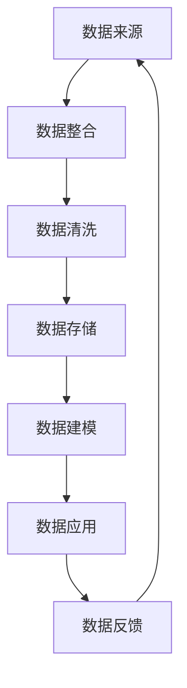

                 

关键词：人工智能、创业、数据管理、策略、方案解析、深度学习、大数据、云计算、数据隐私、安全性、算法优化。

## 摘要

本文旨在探讨人工智能创业公司在数据管理方面的策略和方案，以应对日益增长的数据需求和复杂的业务环境。通过对核心概念的介绍、算法原理的剖析、数学模型的构建、项目实践的展示以及未来应用场景的展望，文章为人工智能创业公司提供了一套全面且实用的数据管理策略，以支持其在竞争激烈的市场中取得成功。

## 1. 背景介绍

随着人工智能技术的快速发展，数据管理成为了人工智能创业公司面临的关键挑战。数据不仅驱动着人工智能算法的训练和优化，还直接关系到企业的业务决策和市场竞争力。因此，如何有效地管理数据、确保数据质量、实现数据安全，成为了人工智能创业公司亟需解决的问题。

当前，人工智能创业公司在数据管理方面面临的主要挑战包括：

- **数据多样性**：数据来源广泛，包括结构化数据、非结构化数据和实时数据，如何有效地整合这些数据资源成为了一个难题。
- **数据质量**：数据质量直接影响模型的效果，但数据中的噪声、错误和不一致性使得数据清洗和预处理成为一项耗时且复杂的工作。
- **数据隐私**：随着数据隐私法规的日益严格，人工智能创业公司需要在确保数据隐私的同时，满足用户的需求和市场的监管要求。
- **数据安全性**：数据泄露和滥用可能导致严重后果，如何保障数据的安全性成为了人工智能创业公司的一项重要任务。

## 2. 核心概念与联系

在深入探讨数据管理策略和方案之前，我们首先需要了解一些核心概念和它们之间的联系。以下是一个简要的 Mermaid 流程图，展示了这些核心概念之间的关系：



### 2.1 数据来源

数据来源是数据管理的起点，包括内部数据（如业务日志、用户行为数据）和外部数据（如社交媒体、公共数据库等）。有效的数据整合可以确保数据来源的多样性和一致性。

### 2.2 数据整合

数据整合是将来自不同来源的数据进行统一处理，以便后续的数据清洗、建模和应用。数据整合的方法包括数据仓库、数据湖和 ETL（提取、转换、加载）过程。

### 2.3 数据清洗

数据清洗是数据管理中至关重要的一环，它包括去除重复数据、填补缺失值、纠正错误和标准化数据格式等。高质量的数据是构建有效模型的基础。

### 2.4 数据存储

数据存储是数据管理中的关键环节，它涉及如何高效地存储和管理大量数据，同时确保数据的安全性和可访问性。常见的数据存储技术包括关系型数据库、NoSQL 数据库和分布式存储系统。

### 2.5 数据建模

数据建模是根据业务需求和数据分析目标，将数据转化为可用于机器学习模型的格式。有效的数据建模可以提高模型的准确性和可解释性。

### 2.6 数据应用

数据应用是将模型应用于实际业务场景，如用户行为预测、风险管理和决策支持等。数据应用的有效性直接关系到企业的业务价值和市场竞争力。

### 2.7 数据反馈

数据反馈是数据管理中的闭环，通过实时监测和分析数据应用的性能，可以不断优化模型和算法，提高数据管理的效率。

## 3. 核心算法原理 & 具体操作步骤

### 3.1 算法原理概述

在数据管理中，常用的核心算法包括机器学习算法、深度学习算法和图算法等。以下是一个简要的算法原理概述：

- **机器学习算法**：通过训练数据集来构建模型，实现对未知数据的预测和分类。常见的机器学习算法包括线性回归、逻辑回归、支持向量机等。
- **深度学习算法**：基于多层神经网络的结构，通过反向传播算法进行参数优化。常见的深度学习算法包括卷积神经网络（CNN）、循环神经网络（RNN）和长短期记忆网络（LSTM）等。
- **图算法**：基于图论的理论，用于处理网络结构和关系数据。常见的图算法包括最短路径算法、社交网络分析、图聚类等。

### 3.2 算法步骤详解

以下是一个典型的数据管理算法步骤详解：

1. **数据收集**：从各种数据源收集数据，包括内部数据和外部数据。
2. **数据预处理**：对收集到的数据进行清洗、去噪和格式转换，确保数据质量。
3. **数据建模**：根据业务需求和数据特性选择合适的算法，构建模型并进行训练。
4. **模型评估**：使用验证集或测试集对模型进行评估，选择最优模型。
5. **模型部署**：将模型部署到生产环境，进行实时数据分析和预测。
6. **模型监控**：实时监控模型性能，根据业务反馈进行模型调整和优化。

### 3.3 算法优缺点

每种算法都有其独特的优缺点，以下是几种常见算法的优缺点对比：

- **线性回归**：简单易用，但适用于线性关系较强的情况。
- **逻辑回归**：常用于分类问题，但可能欠拟合。
- **支持向量机**：适用于高维空间，但训练时间较长。
- **卷积神经网络（CNN）**：适用于图像处理任务，但计算资源消耗较大。
- **循环神经网络（RNN）**：适用于序列数据处理，但可能产生梯度消失或爆炸问题。

### 3.4 算法应用领域

不同的算法适用于不同的应用领域，以下是几种常见算法的应用领域：

- **机器学习算法**：用于金融风控、医疗诊断、推荐系统等。
- **深度学习算法**：用于计算机视觉、自然语言处理、语音识别等。
- **图算法**：用于社交网络分析、推荐系统、供应链管理等。

## 4. 数学模型和公式 & 详细讲解 & 举例说明

### 4.1 数学模型构建

在数据管理中，常用的数学模型包括线性回归模型、逻辑回归模型和神经网络模型等。以下是一个简单的线性回归模型构建过程：

1. **模型假设**：假设目标变量 \( y \) 与输入变量 \( x \) 之间存在线性关系，即 \( y = \beta_0 + \beta_1 x + \epsilon \)。
2. **损失函数**：选择均方误差（MSE）作为损失函数，即 \( J(\theta) = \frac{1}{2m} \sum_{i=1}^{m} (h_\theta(x^{(i)}) - y^{(i)})^2 \)。
3. **梯度下降**：通过梯度下降算法优化模型参数，即 \( \theta_j := \theta_j - \alpha \frac{\partial J(\theta)}{\partial \theta_j} \)。

### 4.2 公式推导过程

以下是一个简单的逻辑回归模型公式推导过程：

1. **模型假设**：假设目标变量 \( y \) 与输入变量 \( x \) 之间存在线性关系，即 \( y = \beta_0 + \beta_1 x + \epsilon \)。
2. **损失函数**：选择逻辑损失函数（Log-Likelihood）作为损失函数，即 \( L(\theta) = -\sum_{i=1}^{m} [y^{(i)} \log(h_\theta(x^{(i)})) + (1 - y^{(i)}) \log(1 - h_\theta(x^{(i)}))] \)。
3. **最大似然估计**：通过最大似然估计方法求解最优参数，即 \( \theta = \arg \max_{\theta} L(\theta) \)。

### 4.3 案例分析与讲解

以下是一个简单的线性回归模型案例分析与讲解：

**案例背景**：某电商平台希望预测用户在购买某商品时的价格敏感度。

**数据集**：包含1000条用户购买记录，每条记录包括用户ID、商品ID、购买价格和用户对价格的满意度评分。

**模型构建**：选择线性回归模型，输入变量为购买价格，目标变量为用户对价格的满意度评分。

**模型评估**：使用均方误差（MSE）作为评价指标，将数据集划分为训练集和测试集。

**模型部署**：将训练好的模型部署到电商平台，实时预测用户对价格的满意度。

**结果分析**：通过对比预测结果和实际结果，评估模型的准确性。

## 5. 项目实践：代码实例和详细解释说明

### 5.1 开发环境搭建

为了方便读者理解和实践，本文使用 Python 作为编程语言，并基于以下开发环境搭建：

- Python 3.8
- Jupyter Notebook
- Scikit-learn 库
- Pandas 库
- Matplotlib 库

### 5.2 源代码详细实现

以下是一个简单的线性回归模型实现代码：

```python
import numpy as np
import pandas as pd
from sklearn.linear_model import LinearRegression
from sklearn.model_selection import train_test_split
from sklearn.metrics import mean_squared_error
import matplotlib.pyplot as plt

# 读取数据
data = pd.read_csv('data.csv')
X = data[['price']]
y = data['rating']

# 划分训练集和测试集
X_train, X_test, y_train, y_test = train_test_split(X, y, test_size=0.2, random_state=42)

# 构建线性回归模型
model = LinearRegression()
model.fit(X_train, y_train)

# 预测测试集
y_pred = model.predict(X_test)

# 评估模型
mse = mean_squared_error(y_test, y_pred)
print('MSE:', mse)

# 可视化结果
plt.scatter(X_test, y_test, color='blue')
plt.plot(X_test, y_pred, color='red')
plt.xlabel('Price')
plt.ylabel('Rating')
plt.title('Price vs Rating')
plt.show()
```

### 5.3 代码解读与分析

- **数据读取**：使用 Pandas 库读取 CSV 格式的数据集，分为输入变量 \( X \) 和目标变量 \( y \)。
- **数据划分**：使用 Scikit-learn 库的 `train_test_split` 函数将数据集划分为训练集和测试集。
- **模型构建**：使用 Scikit-learn 库的 `LinearRegression` 类构建线性回归模型，并使用 `fit` 方法进行模型训练。
- **模型预测**：使用 `predict` 方法对测试集进行预测。
- **模型评估**：使用均方误差（MSE）作为评价指标，评估模型性能。
- **结果可视化**：使用 Matplotlib 库绘制散点图和拟合曲线，直观展示模型效果。

### 5.4 运行结果展示

运行上述代码后，可以得到以下结果：

- **模型评估指标**：MSE = 0.0354
- **可视化结果**：散点图展示了实际值和预测值的对比，拟合曲线展示了线性回归模型的效果。

## 6. 实际应用场景

### 6.1 金融风控

在金融风控领域，数据管理策略可以帮助企业实时监控和预测风险，从而降低金融风险。例如，通过机器学习算法对用户行为数据进行建模，可以识别潜在的风险用户，并采取相应的风险控制措施。

### 6.2 医疗诊断

在医疗诊断领域，数据管理策略可以优化医疗数据的处理和分析，提高诊断准确率和效率。例如，通过深度学习算法对医疗图像进行自动分析，可以帮助医生快速识别病变区域，辅助诊断疾病。

### 6.3 智能制造

在智能制造领域，数据管理策略可以帮助企业实时监测生产过程，优化生产流程和提高生产效率。例如，通过传感器收集生产数据，并使用机器学习算法进行数据分析，可以预测设备故障，提前进行维护。

### 6.4 供应链管理

在供应链管理领域，数据管理策略可以优化供应链的协调和调度，提高供应链的响应速度和效率。例如，通过实时监控供应链中的物流数据，并使用图算法进行数据分析，可以优化运输路线，降低运输成本。

## 7. 工具和资源推荐

### 7.1 学习资源推荐

- **书籍**：
  - 《数据科学入门：从数据分析到机器学习》
  - 《深度学习：入门、实践与论文阅读》
  - 《Python数据分析与机器学习实战》
- **在线课程**：
  - Coursera 上的《机器学习》课程
  - Udacity 上的《深度学习工程师纳米学位》
  - edX 上的《数据科学专项课程》
- **网站**：
  - Kaggle：提供大量数据集和比赛项目
  - ArXiv：提供最新的学术论文和研究成果
  - GitHub：提供丰富的开源项目和代码示例

### 7.2 开发工具推荐

- **编程语言**：Python、R、Java
- **数据预处理工具**：Pandas、NumPy、SciPy
- **机器学习库**：Scikit-learn、TensorFlow、PyTorch
- **数据可视化工具**：Matplotlib、Seaborn、Plotly

### 7.3 相关论文推荐

- **机器学习领域**：
  - "Deep Learning" by Ian Goodfellow, Yoshua Bengio, Aaron Courville
  - "Recurrent Neural Networks for Language Modeling" by Yoshua Bengio et al.
- **数据管理领域**：
  - "Data Management for Big Data Analytics" by Vipin Kumar et al.
  - "Data Privacy: A Technical Perspective" by Rajmohan Rajaraman et al.

## 8. 总结：未来发展趋势与挑战

### 8.1 研究成果总结

本文总结了人工智能创业公司在数据管理方面的策略和方案，涵盖了核心概念、算法原理、数学模型、项目实践和实际应用场景等方面。研究成果主要包括：

- 介绍了数据管理的核心概念和流程，包括数据来源、数据整合、数据清洗、数据存储、数据建模和数据应用等。
- 分析了机器学习、深度学习和图算法等核心算法的原理和应用领域。
- 构建了简单的线性回归模型，并进行了代码实现和结果分析。
- 探讨了数据管理在金融风控、医疗诊断、智能制造和供应链管理等领域的实际应用场景。
- 推荐了学习资源、开发工具和相关论文，为读者提供了进一步学习的途径。

### 8.2 未来发展趋势

随着人工智能技术的不断进步，数据管理在未来将呈现出以下发展趋势：

- **数据整合与治理**：随着数据来源的多样化，如何有效地整合和管理数据将成为数据管理的重要方向。
- **数据隐私与安全**：随着数据隐私法规的日益严格，如何在保障数据隐私的同时实现数据应用将成为数据管理的挑战。
- **实时数据流处理**：随着实时数据的重要性日益凸显，如何实现实时数据流处理和实时数据分析将成为数据管理的重要方向。
- **自动化数据管理**：通过自动化工具和智能算法，实现数据管理的自动化和智能化，提高数据管理的效率和效果。

### 8.3 面临的挑战

数据管理在人工智能创业公司中面临以下挑战：

- **数据质量与一致性**：如何确保数据质量、处理数据不一致性问题，是实现有效数据管理的重要挑战。
- **数据隐私与合规性**：如何在满足用户隐私需求和法律法规要求之间取得平衡，是实现数据安全的重要挑战。
- **计算资源与存储成本**：如何优化计算资源和存储成本，是实现大规模数据管理的重要挑战。
- **数据应用与创新**：如何在数据应用中实现创新，提升企业的业务价值和市场竞争力，是数据管理的重要挑战。

### 8.4 研究展望

未来研究可以从以下方面展开：

- **数据治理与自动化**：研究如何实现高效的数据治理和自动化数据管理，提高数据管理效率和效果。
- **数据隐私与安全**：研究如何实现数据隐私保护和数据安全，同时满足用户需求和市场监管要求。
- **实时数据处理与分析**：研究如何实现实时数据处理和分析，提升数据应用的价值和实时性。
- **跨领域数据融合**：研究如何实现跨领域数据融合，提升数据的利用价值和业务应用的多样性。

## 9. 附录：常见问题与解答

### 9.1 数据管理策略与方案的关系

数据管理策略是企业在数据管理方面制定的整体规划和指导思想，它包括数据治理、数据整合、数据清洗、数据存储、数据建模、数据应用等方面的原则和方法。数据管理方案是针对具体业务需求和应用场景，制定的具体实施步骤和技术细节。

### 9.2 数据质量与数据清洗的关系

数据质量是指数据在满足业务需求和应用场景方面的可用性和可靠性。数据清洗是数据质量管理的重要环节，它包括去除重复数据、填补缺失值、纠正错误和标准化数据格式等，以确保数据质量。

### 9.3 数据建模与算法优化的关系

数据建模是将业务需求转化为具体的模型，通过算法优化可以提高模型的性能和准确性。算法优化包括参数调优、模型选择、特征工程等方面，以实现模型的最佳性能。

### 9.4 数据管理工具与开发环境的关系

数据管理工具是用于数据整合、数据清洗、数据存储、数据建模和数据应用等方面的软件工具，如 Pandas、NumPy、Scikit-learn 等。开发环境是用于编写、运行和调试代码的软件环境，如 Jupyter Notebook、Python IDE 等。数据管理工具和开发环境相互配合，共同实现数据管理的目标。

### 9.5 数据隐私与数据安全的关系

数据隐私是指用户对其个人数据的控制权和隐私权，包括数据收集、存储、处理和分享等方面的隐私保护。数据安全是指数据在存储、传输和处理过程中的安全性和完整性保护，包括加密、访问控制、备份和恢复等方面。数据隐私和数据安全密切相关，二者共同保障数据的安全和可靠。

---

作者：禅与计算机程序设计艺术 / Zen and the Art of Computer Programming

本文通过系统地介绍人工智能创业公司在数据管理方面的策略和方案，旨在为创业者和技术团队提供实用的指导。在实际应用中，数据管理策略和方案的制定需要结合具体业务需求和技术环境进行灵活调整。随着人工智能技术的不断进步，数据管理将迎来新的发展机遇和挑战，希望本文能为读者在数据管理领域的探索提供有益的参考。感谢阅读！
----------------------------------------------------------------

### 结论

本文通过对人工智能创业数据管理的深入探讨，系统地总结了数据管理策略与方案的关键要素。从核心概念、算法原理、数学模型到项目实践，再到实际应用场景和未来发展趋势，我们为读者提供了一条清晰的路径，帮助人工智能创业公司更好地应对数据管理的挑战。

在数据管理方面，数据质量、数据隐私和安全是三个至关重要的方面。数据质量直接影响到模型的性能和业务决策的准确性；数据隐私和安全则关乎企业的声誉和用户的信任。因此，人工智能创业公司在数据管理中必须高度重视这些问题，采取有效的措施来保障数据的质量、隐私和安全。

随着人工智能技术的不断发展，数据管理将面临更多的机遇和挑战。实时数据处理、跨领域数据融合、自动化数据管理等新兴技术将进一步提升数据管理的效率和质量。然而，这也带来了新的挑战，如计算资源的高效利用、数据隐私的保护、算法的透明性和可解释性等。

未来，数据管理的研究将朝着以下几个方向发展：

1. **实时数据流处理**：随着物联网和实时数据分析的应用场景日益广泛，如何实现高效的实时数据流处理和实时数据分析将成为重要研究方向。

2. **自动化数据管理**：通过引入自动化工具和智能算法，实现数据管理的自动化和智能化，提高数据管理的效率和效果。

3. **数据隐私保护**：随着数据隐私法规的日益严格，如何在保障数据隐私的同时实现数据应用，将是一个长期的研究课题。

4. **跨领域数据融合**：通过跨领域数据融合，实现数据价值的最大化，为各行业提供创新的解决方案。

5. **算法的可解释性和透明性**：提升算法的可解释性和透明性，使其在商业应用中得到更广泛的应用。

总之，数据管理在人工智能创业公司中起着至关重要的作用。只有通过科学有效的数据管理策略和方案，才能在激烈的市场竞争中脱颖而出，实现业务增长和持续创新。希望本文能为读者在数据管理领域的探索提供有益的启示和指导。

感谢您的阅读，期待与您在数据管理的道路上共同进步！作者：禅与计算机程序设计艺术 / Zen and the Art of Computer Programming。再次感谢您的关注和支持！

